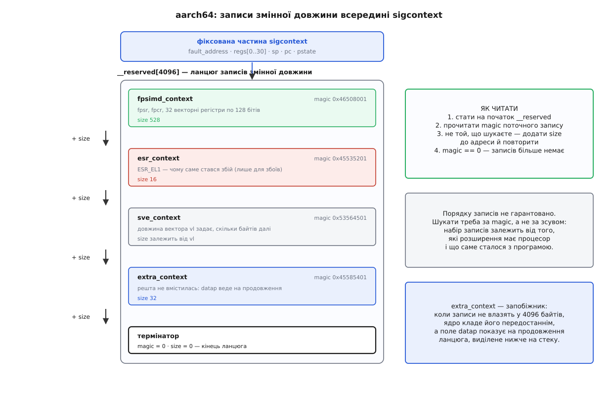

# 📋 Будова сигнального кадру: поля, індекси, розміри

Обробник, [призначений із прапорцем `SA_SIGINFO`](book:unix-linux/signal-disposition), отримує третім аргументом вказівник на **справжній** `ucontext_t`, що лежить на стеку, — не на копію. Усе, що з ним можна зробити, впирається в точні імена полів, тож тут зібрано розкладку кадру на x86-64 і aarch64, індекси, за якими дістають окремий регістр, протокол читання розширеного стану процесора й підписи, потрібні, щоб порахувати розмір запасного стека.

## Підпис обробника

```c
void handler(int sig, siginfo_t *info, void *ucontext);
```

Третій аргумент оголошено як `void *` не з недбалості: його справжній тип різний на кожній архітектурі, і переносного імені для нього не існує. Перше, що робить будь-який код, — приводить його до `ucontext_t *` з `<ucontext.h>`.

## x86-64: із чого складається кадр

Ядро будує `struct rt_sigframe` (`arch/x86/include/asm/sigframe.h`) — три поля поспіль, від нижчої адреси до вищої:

| поле | тип | байтів | що це |
|---|---|---|---|
| `pretcode` | `char *` | 8 | адреса повернення; веде на батут, сюди подивиться `ret` обробника |
| `uc` | `struct ucontext` | 304 | контекст перерваного виконання |
| `info` | `struct siginfo` | 128 | опис події; ядро заповнює його завжди, навіть коли обробник узяв лише номер |

Області розширеного стану процесора в цій структурі немає. Вона лежить **окремо, вище за адресою**, і дістатися до неї можна тільки за вказівником усередині `uc`. Обчислювати до неї зсув марно: розмір області різний на різних машинах і навіть у різних процесів на одній машині.

Кадр тут завжди один і той самий: іншого формату 64-бітовий Linux не будує взагалі. А от [32-бітовий процес на тому самому ядрі](book:unix-linux/compat-32-on-64) може отримати два різні кадри — коротший `struct sigframe_ia32` без `siginfo`, якщо обробник призначено без `SA_SIGINFO`, і повний `struct rt_sigframe_ia32`, якщо з ним. Код, що розбирає кадри чужого процесу, мусить упізнавати обидва.

### `ucontext_t`: поля й зсуви

Зсуви — від початку самого `ucontext_t`:

| зсув | поле | байтів | що це |
|---|---|---|---|
| 0 | `uc_flags` | 8 | прапорці кадру |
| 8 | `uc_link` | 8 | у сигнальному кадрі завжди `NULL`; поле належить `makecontext`, а не сигналам |
| 16 | `uc_stack` | 24 | `stack_t` запасного стека, який діяв у мить сигналу |
| 40 | `uc_mcontext` | 256 | машинний контекст: регістри, прапорці, вказівник на розширений стан |
| 296 | `uc_sigmask` | 8 | маска сигналів, яку `rt_sigreturn` поставить назад |

Прапорці в `uc_flags` (`arch/x86/include/uapi/asm/ucontext.h`):

| прапорець | значення | що означає |
|---|---|---|
| `UC_FP_XSTATE` | 0x1 | за вказівником на область співпроцесора є ще й розширений стан |
| `UC_SIGCONTEXT_SS` | 0x2 | ядро зберегло в кадрі регістр `ss`, а не залишило поле порожнім |
| `UC_STRICT_RESTORE_SS` | 0x4 | сигнал прийшов із 64-бітового коду, тож `ss` відновиться точно як збережено |

> ⚠️ **Розмір типу не дорівнює розміру даних.** `ucontext_t` у glibc займає 968 байтів, а ядро в кадрі заповнює лише перші 304. Хвіст типу — `__fpregs_mem` і `__ssp` — існує для `getcontext`/`swapcontext`; у сигнальному обробнику там чужі байти. Те саме з маскою: `sigset_t` у glibc — 128 байтів, ядро пише 8. Перевірити окремий сигнал через `sigismember` можна, скопіювати маску цілком як структуру — ні.

### Регістр за іменем: індекси `gregs`

`uc_mcontext.gregs` — масив із 23 значень типу `greg_t`; `i`-й елемент лежить за зсувом `40 + 8·i` від початку `ucontext_t`. Порядок повторює `struct sigcontext_64` у ядрі, а імена індексів дає `<sys/ucontext.h>`:

| індекс | константа | що містить |
|---|---|---|
| 0–7 | `REG_R8` … `REG_R15` | регістри `r8`…`r15` |
| 8 | `REG_RDI` | `rdi` |
| 9 | `REG_RSI` | `rsi` |
| 10 | `REG_RBP` | `rbp` |
| 11 | `REG_RBX` | `rbx` |
| 12 | `REG_RDX` | `rdx` |
| 13 | `REG_RAX` | `rax` — саме це значення `rt_sigreturn` поверне як результат |
| 14 | `REG_RCX` | `rcx` |
| 15 | `REG_RSP` | покажчик стека перерваного коду |
| 16 | `REG_RIP` | покажчик інструкції: адреса, з якої виконання піде далі |
| 17 | `REG_EFL` | прапорці процесора |
| 18 | `REG_CSGSFS` | чотири 16-бітові селектори `cs`, `gs`, `fs`, `ss` в одному слові |
| 19 | `REG_ERR` | код причини збою |
| 20 | `REG_TRAPNO` | номер пастки; 14 — сторінковий збій |
| 21 | `REG_OLDMASK` | історичний залишок, ядро його не вживає |
| 22 | `REG_CR2` | адреса, на якій стався [сторінковий збій](book:unix-linux/page-fault) — те саме, що `si_addr` |

Найкорисніше з цього списку — `REG_ERR`. Апаратний код причини збою відповідає на питання, якого немає в `siginfo_t`: чи це було читання, чи запис.

| біт | 0 | 1 |
|---|---|---|
| 0 | сторінки немає в таблицях | сторінка є, порушено права |
| 1 | читання | запис |
| 2 | доступ із режиму ядра | доступ із режиму користувача |
| 3 | — | порушено зарезервований біт таблиці |
| 4 | — | вибірка інструкції |
| 5 | — | спрацював [ключ захисту пам'яті](book:unix-linux/memory-protection-keys) |

```c
#define _GNU_SOURCE
#include <signal.h>
#include <ucontext.h>
#include <stdint.h>

static void recover(void);                  /* куди піти замість збою */

static volatile sig_atomic_t was_write;
static void *fault_at;
static void *fault_pc;

static void on_segv(int sig, siginfo_t *info, void *uc_raw)
{
    ucontext_t *uc = uc_raw;
    greg_t     *r  = uc->uc_mcontext.gregs;

    fault_at  = info->si_addr;               /* == (void *)r[REG_CR2] */
    fault_pc  = (void *)r[REG_RIP];          /* інструкція, що впала  */
    was_write = (r[REG_ERR] & 2) != 0;       /* біт 1 — це був запис  */

    r[REG_RIP] = (greg_t)(uintptr_t)recover; /* повернутися не сюди   */
}
```

Присвоєння в останньому рядку — не гра з копією: після `rt_sigreturn` виконання піде саме за новою адресою. Друкувати щось із обробника при цьому не можна — `printf` не належить до [функцій, безпечних в обробнику](book:unix-linux/async-signal-safety); значення виносять у змінні й розбирають назовні.

> 🔧 **Навіщо це.** Емулятор захищеної пам'яті, збирач слідів доступу, механізм «копіювання при записі» в бібліотеці — усі вони ловлять `SIGSEGV` і мусять розрізняти читання й запис. `si_addr` каже лише «де», а «що саме робили» знає тільки `REG_ERR` на x86-64 та `esr_context` на aarch64. Без цього біта обробник не відрізнить спробу прочитати захищену сторінку від спроби в неї записати.

## Розширений стан: як його знайти й скільки його

Поле `uc_mcontext.fpregs` (зсув 224 від початку `ucontext_t`) вказує на область у форматі `FXSAVE` — 512 байтів із регістрами співпроцесора й `XMM`. Якщо процесор уміє `XSAVE`, за цією областю лежить продовження: маски, верхні половини векторних регістрів, плитки матричних розширень. Де воно закінчується, сказано в самій області.

Байти 464…511 усередині 512-байтового блока зарезервовано для програмного вжитку — там лежить `struct _fpx_sw_bytes`:

| зсув у структурі | поле | що це |
|---|---|---|
| 0 | `magic1` | `FP_XSTATE_MAGIC1` = `0x46505853`, якщо розширений стан є; 0 — якщо це старий формат |
| 4 | `extended_size` | повний розмір області разом із контрольною міткою в кінці |
| 8 | `xfeatures` | бітова маска компонентів, які реально збережено |
| 16 | `xstate_size` | розмір самого стану — на 4 байти менший за `extended_size` |

Перевірка складається з трьох кроків, і пропускати їх не варто: набір компонентів залежить від процесора й від того, які [розширення стану](book:programming/xsave-extended-state) процес узагалі попросив увімкнути.

```c
#include <stdint.h>
#include <string.h>

#define FPX_SW_OFFSET      464
#define FP_XSTATE_MAGIC1   0x46505853U
#define FP_XSTATE_MAGIC2   0x46505845U

struct fpx_sw { uint32_t magic1, extended_size;
                uint64_t xfeatures;
                uint32_t xstate_size, padding[7]; };

static size_t xstate_bytes(ucontext_t *uc)
{
    if (!(uc->uc_flags & UC_FP_XSTATE))          /* крок 1: ядро каже, що є  */
        return 0;

    unsigned char *fp = (unsigned char *)uc->uc_mcontext.fpregs;
    struct fpx_sw *sw = (struct fpx_sw *)(fp + FPX_SW_OFFSET);

    if (sw->magic1 != FP_XSTATE_MAGIC1)          /* крок 2: мітка на початку */
        return 0;

    uint32_t tail;                               /* крок 3: мітка в кінці    */
    memcpy(&tail, fp + sw->extended_size - 4, 4);
    if (tail != FP_XSTATE_MAGIC2)
        return 0;

    return sw->xstate_size;                      /* заголовок XSAVE — з fp+512 */
}
```

Мітка в кінці існує рівно для того, щоб зловити помилку у власних обчисленнях: якщо `extended_size` прочитано правильно, в останньому 32-бітовому слові області лежатиме `0x46505845`. Не збіглося — далі йти не можна, бо ви дивитеся не туди.

## aarch64: ланцюг записів замість фіксованих полів

Тут порядок інший вже на верхньому рівні: у `struct rt_sigframe` спершу йде `siginfo`, а вже потім `ucontext`. Фіксована частина `struct sigcontext` коротка й читається без жодних хитрощів:

| зсув | поле | байтів | що це |
|---|---|---|---|
| 0 | `fault_address` | 8 | адреса, на якій стався збій; для інших сигналів не заповнюється |
| 8 | `regs[0..30]` | 248 | регістри `x0`…`x30`; `regs[29]` — покажчик кадру, `regs[30]` — адреса повернення |
| 256 | `sp` | 8 | покажчик стека перерваного коду |
| 264 | `pc` | 8 | покажчик інструкції — аналог `REG_RIP` |
| 272 | `pstate` | 8 | стан процесора: прапорці, рівень винятку, маски переривань |
| 288 | `__reserved` | 4096 | усе інше — ланцюгом записів; поле вирівняне на 16 байтів, звідси розрив після `pstate` |

Ось у цьому останньому полі й лежить головна відмінність від x86-64. Замість фіксованих полів ядро складає туди **записи змінної довжини**, кожен зі своїм заголовком:

```c
struct _aarch64_ctx {
    __u32 magic;
    __u32 size;
};
```



*Потрібний запис шукають за міткою `magic`, а до наступного переходять, додавши до адреси його `size`.*

| `magic` | запис | що всередині |
|---|---|---|
| `0x46508001` | `fpsimd_context` | `fpsr`, `fpcr`, 32 векторні регістри по 128 бітів |
| `0x45535201` | `esr_context` | `ESR_EL1` — апаратний опис збою, аналог `REG_ERR` |
| `0x53564501` | `sve_context` | стан масштабованих векторів; розмір задає довжина вектора `vl` |
| `0x54504902` | `tpidr2_context` | регістр `TPIDR2_EL0` |
| `0x54366345` | `za_context` | матричний регістр `ZA` розширення SME |
| `0x45585401` | `extra_context` | продовження ланцюга поза `__reserved`: `datap` і `size` |
| `0x00000000` | термінатор | `size` теж 0 — записів більше немає |

Порядку записів у документованому інтерфейсі немає, тому шукають їх обходом: беруть `magic` поточного заголовка, і якщо він не той, додають до адреси `size` та повторюють, доки не натраплять на нуль. Коли всі записи в чотири кілобайти не вміщаються, ядро кладе передостаннім `extra_context`, чиє поле `datap` показує на продовження, виділене нижче на стеку.

Звідси й правило, яке звучить категорично, але має просту причину: **переносного коду роботи з машинним контекстом не буває**. Це не недогляд стандарту. `uc_mcontext` — знімок конкретного процесора, а процесори різні в усьому, що для цієї роботи важливе. Покажчик інструкції на x86-64 дістають індексом у масиві (`gregs[REG_RIP]`), на aarch64 — окремим полем `pc`. Причину збою на x86-64 читають із `REG_ERR`, на aarch64 — з `esr_context`, який ще треба знайти обходом. Розширений стан на x86-64 лежить за вказівником і зсувом 464, на aarch64 — записом усередині кадру. Спільний тут лише [звичай передавати контекст третім аргументом](book:programming/abi-calling-convention); усе інше пишуть під `#ifdef` на архітектуру.

## `siginfo_t`: що саме сталося

Три перші поля є завжди, решта залежить від сигналу:

| поле | тип | коли осмислене |
|---|---|---|
| `si_signo` | `int` | завжди — номер сигналу |
| `si_errno` | `int` | здебільшого 0 у Linux |
| `si_code` | `int` | завжди — причина; саме воно каже, які поля далі читати |
| `si_addr` | `void *` | `SIGSEGV`, `SIGBUS`, `SIGILL`, `SIGFPE` — адреса, на якій стався збій |
| `si_pid`, `si_uid` | `pid_t`, `uid_t` | сигнал надіслала програма, а не апаратура |
| `si_value` | `union sigval` | `sigqueue`, таймери — навантаження від відправника |
| `si_pkey` | `int` | `SEGV_PKUERR` — номер ключа захисту, що спрацював |
| `si_lower`, `si_upper` | `void *` | `SEGV_BNDERR` — межі, за які вийшов доступ |

Значення `si_code` діляться на дві сім'ї. Нуль і від'ємні означають, що сигнал надіслано програмно: `SI_USER` (0) — через `kill`, `SI_QUEUE` (−1) — через `sigqueue`, `SI_TIMER` (−2) — таймером, `SI_TKILL` (−6) — через `tgkill`; осібно від них стоїть `SI_KERNEL` (0x80) — сигнал згенерувало саме ядро. Додатні уточнюють апаратну причину:

| сигнал | `si_code` | причина |
|---|---|---|
| `SIGSEGV` | `SEGV_MAPERR` (1) | за адресою немає відображення |
| `SIGSEGV` | `SEGV_ACCERR` (2) | відображення є, бракує прав |
| `SIGSEGV` | `SEGV_PKUERR` (4) | заборонив ключ захисту пам'яті |
| `SIGBUS` | `BUS_ADRALN` (1) | доступ не за вирівняною адресою |
| `SIGBUS` | `BUS_ADRERR` (2) | адреси фізично не існує |
| `SIGBUS` | `BUS_MCEERR_AR` (4) | апаратна помилка пам'яті, яку вже спожито |
| `SIGFPE` | `FPE_INTDIV` (1) | ділення цілого на нуль |
| `SIGFPE` | `FPE_FLTINV` (7) | недійсна дробова операція |
| `SIGILL` | `ILL_ILLOPC` (1) | невідомий код операції |
| `SIGCHLD` | `CLD_EXITED` (1) … `CLD_CONTINUED` (6) | що саме сталося з нащадком |

## Скільки місця треба під кадр

Розмір кадру перестав бути сталим, коли процесори почали обростати регістрами, тож ядро повідомляє чинний мінімум у [допоміжному векторі](book:unix-linux/auxiliary-vector) полем `AT_MINSIGSTKSZ` (номер 51). Дістати його можна двома способами:

```c
#include <sys/auxv.h>            /* getauxval */
#include <unistd.h>              /* sysconf   */

long raw  = getauxval(AT_MINSIGSTKSZ);   /* прямо з вектора; 0, якщо ядро старе */
long need = sysconf(_SC_MINSIGSTKSZ);    /* те саме число, glibc 2.34+          */
long work = sysconf(_SC_SIGSTKSZ);       /* з запасом на власний код обробника  */
```

`sysconf` зручніший: він працює й тоді, коли ядро нічого у вектор не поклало, і сам підставляє підлогу там, де рахує робочий розмір. Арифметика в glibc проста:

```
_SC_MINSIGSTKSZ = AT_MINSIGSTKSZ         (немає у векторі → 2048)
_SC_SIGSTKSZ    = max( max(_SC_MINSIGSTKSZ, 2048) · 4, 8192 )
```

Множник чотири — не розрахунок, а збережена історична пропорція: старі `MINSIGSTKSZ` = 2048 і `SIGSTKSZ` = 8192 різнилися саме вчетверо. Мінімум покриває лише сам кадр; учетверо більший розмір лишає місце ще й на те, що обробник викличе сам.

З версії 2.34 glibc перевизначає самі макроси `MINSIGSTKSZ` і `SIGSTKSZ` на ці виклики, щойно оголошено `_GNU_SOURCE` або `_DYNAMIC_STACK_SIZE_SOURCE`. Тому старий код, який писав `static char stack[SIGSTKSZ];` як масив сталого розміру, від цієї версії просто не компілюється — і це навмисно; усередині функції той самий рядок мовчки стане масивом змінної довжини, що не краще.

Запасну площадку встановлюють так:

```c
int sigaltstack(const stack_t *restrict ss, stack_t *restrict old_ss);

typedef struct {
    void  *ss_sp;      /* початок ділянки                                 */
    int    ss_flags;   /* 0 — увімкнути; SS_DISABLE — вимкнути            */
    size_t ss_size;    /* розмір; менше за мінімум — помилка              */
} stack_t;
```

| `ss_flags` | значення | зміст |
|---|---|---|
| 0 | — | установити площадку |
| `SS_ONSTACK` | 1 | лише при читанні: обробник саме зараз працює на площадці |
| `SS_DISABLE` | 2 | вимкнути площадку |
| `SS_AUTODISARM` | `1u << 31` | площадка сама вимикається на час обробника — щоб `swapcontext` не зіпсував її |

| помилка | коли |
|---|---|
| `ENOMEM` | `ss_size` менший за чинний мінімум |
| `EINVAL` | у `ss_flags` біти, яких там бути не може |
| `EPERM` | спроба змінити площадку, на якій зараз працює обробник |
| `EFAULT` | `ss` або `old_ss` показують у нікуди |

Мінімальний робочий виклик — рівно чотири дії, і жодного числа в коді:

```c
#define _GNU_SOURCE
#include <signal.h>
#include <unistd.h>
#include <stdlib.h>

static void install_altstack(void)
{
    size_t   sz = (size_t)sysconf(_SC_SIGSTKSZ);
    stack_t  ss = { .ss_sp = malloc(sz), .ss_flags = 0, .ss_size = sz };
    sigaltstack(&ss, NULL);

    struct sigaction sa = { 0 };
    sa.sa_sigaction = on_segv;
    sa.sa_flags     = SA_SIGINFO | SA_ONSTACK;
    sigemptyset(&sa.sa_mask);
    sigaction(SIGSEGV, &sa, NULL);
}
```

Площадку заводять **на кожен потік окремо**: `sigaltstack` — властивість потоку, а не процесу, і потік без власної площадки при переповненні свого стека помре мовчки, хоч би скільки їх було в решти.
