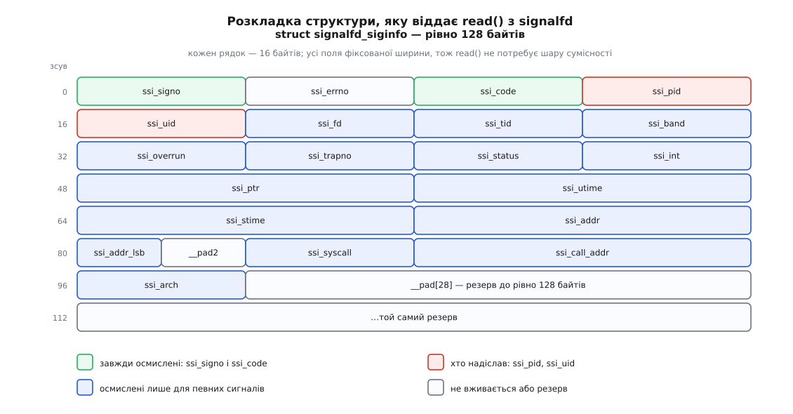

# 📋 Контракт маски й signalfd

Це перелік того, що програма передає ядру й що дістає назад, коли керує доправленням сигналів сама: підписи всієї родини маски, три режими її зміни, розкладка структури, яку віддає читання з дескриптора, значення кожного поля з поміткою, для яких сигналів воно взагалі заповнене, коди помилок і те, що видно ззовні через `/proc`. Довідка відповідає на питання, які виникають із клавіатурою під руками — чи цей виклик ставить `errno`, чи повертає його числом; скільки байтів має бути в буфері; чому «заблокувати все» блокує не все.

Оголошення набору, маски й синхронного очікування живуть у `<signal.h>`, `signalfd` — у `<sys/signalfd.h>`, атомарні варіанти очікування — у `<sys/select.h>`, `<poll.h>` і `<sys/epoll.h>`. Числа взято з дерева ядра 6.15; розкладка структури є частиною двійкового інтерфейсу й не змінюється.

## Набір сигналів

`sigset_t` є непрозорим типом: у Linux це бітова карта, але її ширина різна на різних системах, тому лізти в неї руками не можна.

| виклик | підпис | повертає |
|---|---|---|
| `sigemptyset` | `int sigemptyset(sigset_t *set)` | `0` / `-1` |
| `sigfillset` | `int sigfillset(sigset_t *set)` | `0` / `-1` |
| `sigaddset` | `int sigaddset(sigset_t *set, int signum)` | `0` / `-1` |
| `sigdelset` | `int sigdelset(sigset_t *set, int signum)` | `0` / `-1` |
| `sigismember` | `int sigismember(const sigset_t *set, int signum)` | `1` / `0` / `-1` |
| `sigisemptyset` | `int sigisemptyset(const sigset_t *set)` | `1` / `0` (розширення GNU) |
| `sigorset` | `int sigorset(sigset_t *d, const sigset_t *l, const sigset_t *r)` | `0` / `-1` (розширення GNU) |
| `sigandset` | `int sigandset(sigset_t *d, const sigset_t *l, const sigset_t *r)` | `0` / `-1` (розширення GNU) |

Єдина помилка — `EINVAL`, коли `signum` не є дійсним номером сигналу. Три останні потребують `#define _GNU_SOURCE` перед першим `#include`.

Правило, яке компілятор не перевірить: змінна типу `sigset_t` **мусить** пройти через `sigemptyset()` або `sigfillset()`, перш ніж її подадуть у `sigaddset`/`sigdelset`/`sigismember`. Обнулення пам'яті замість цього формально не є ініціалізацією, і на системі з іншим представленням набору такий код тихо працюватиме не так.

Друга неочевидність стосується саме glibc: її `sigfillset()` **не** кладе в набір два реальночасові сигнали, якими всередині користується реалізація потоків, а `pthread_sigmask()` мовчки викидає їх зі спроби заблокувати. Тобто «заблокувати геть усе» ніколи не глушить механізм скасування потоків — і це навмисне, бо інакше `pthread_cancel()` перестав би працювати.

## Маска потоку

```c
int sigprocmask(int how, const sigset_t *restrict set, sigset_t *restrict oldset);
int pthread_sigmask(int how, const sigset_t *restrict set, sigset_t *restrict oldset);
int sigpending(sigset_t *set);
int sigsuspend(const sigset_t *mask);
```

| `how` | значення | дія над маскою |
|---|---|---|
| `SIG_BLOCK` | `0` | об'єднання поточної маски з `set` |
| `SIG_UNBLOCK` | `1` | різниця: сигнали з `set` вилучають із маски |
| `SIG_SETMASK` | `2` | маска стає рівно `set` |

`set == NULL` означає «нічого не міняти» — так читають поточну маску, не чіпаючи її. `oldset == NULL` означає «стару не повертати».

Різниця в способі звітувати — постійне джерело мовчазних помилок. `sigprocmask()` повертає `0` або `-1` і ставить `errno`; `pthread_sigmask()` повертає **сам номер помилки** й `errno` не чіпає взагалі. Перевірка `if (pthread_sigmask(...) < 0)` не спрацює ніколи.

| помилка | виклик | причина |
|---|---|---|
| `EINVAL` | `sigprocmask`, `pthread_sigmask` | недійсне значення `how` |
| `EFAULT` | `sigprocmask`, `sigpending`, `sigsuspend` | вказівник поза відведеним простором |
| `EINTR` | `sigsuspend` | звичайне закінчення роботи, а не збій |

`SIGKILL` і `SIGSTOP` з будь-якого поданого набору мовчки викидають — помилки не буде, просто в масці їх не стане.

Під `sigprocmask()` лежить системний виклик `rt_sigprocmask(how, set, oldset, sigsetsize)` з четвертим аргументом-розміром: набір ядра — це 8 байтів на 64-бітній системі (64 сигнали), тоді як `sigset_t` у glibc займає 128 байтів. Обгортка перекладає одне в інше, тому виклик `syscall(SYS_rt_sigprocmask, …)` напряму з `sizeof(sigset_t)` дає `EINVAL`.

`sigpending()` віддає об'єднання двох наборів: очікуваних сигналів **того потоку, що питає**, і спільних на весь процес. Він каже, **які** сигнали чекають, і не каже, скільки їх у черзі — глибина черги реальночасових сигналів звідси не видна.

`sigsuspend()` не має успішного повернення: він **завжди** віддає `-1`, і за нормальної роботи `errno` дорівнює `EINTR`. Прокидається він лише тоді, коли **виконався обробник**; сигнал із диспозицією «ігнорувати» його не збудить, а сигнал із типовою дією «завершити» — просто вб'є процес.

## Синхронне зняття одного сигналу

```c
int sigwaitinfo(const sigset_t *restrict set, siginfo_t *_Nullable restrict info);
int sigtimedwait(const sigset_t *restrict set, siginfo_t *_Nullable restrict info,
                 const struct timespec *restrict timeout);
int sigwait(const sigset_t *set, int *sig);
```

Перші два повертають **номер знятого сигналу** (число більше нуля) або `-1` з `errno`. `sigwait()` — спрощена форма: `0` на успіх, номер помилки числом (як `pthread_sigmask`).

| помилка | причина |
|---|---|
| `EAGAIN` | час `timeout` вичерпано, жоден сигнал із `set` не надійшов |
| `EINTR` | виконався обробник сигналу, якого в `set` **немає** |
| `EINVAL` | `timeout` недійсний (від'ємні значення, наносекунди поза `0…999999999`) |

`timeout` з обома нулями перетворює `sigtimedwait()` на неблокувальну перевірку. Сигнали з `set` мають бути заблоковані **до** виклику: інакше вони підуть звичайним шляхом доправлення, а поведінка за стандартом не визначена. `SIGKILL` і `SIGSTOP` у `set` мовчки ігнорують, а обгортка glibc так само тихо викидає звідти два свої службові реальночасові сигнали.

## Аргумент-маска в очікуванні

Ці виклики роблять неподільно те, що двома окремими викликами неподільним не буває: ставлять маску, чекають і відновлюють стару.

| виклик | підпис | ядро | glibc |
|---|---|---|---|
| `pselect` | `int pselect(int nfds, fd_set *r, fd_set *w, fd_set *e, const struct timespec *to, const sigset_t *sigmask)` | 2.6.16 | 2.4 (справжній виклик) |
| `ppoll` | `int ppoll(struct pollfd *fds, nfds_t n, const struct timespec *to, const sigset_t *sigmask)` | 2.6.16 | 2.4 |
| `epoll_pwait` | `int epoll_pwait(int epfd, struct epoll_event *ev, int max, int timeout_ms, const sigset_t *sigmask)` | 2.6.19 | 2.6 |
| `epoll_pwait2` | `int epoll_pwait2(int epfd, struct epoll_event *ev, int max, const struct timespec *to, const sigset_t *sigmask)` | 5.11 | 2.35 |

`sigmask == NULL` робить кожен із них тотожним звичайному варіанту без літери `p`. Дві розбіжності між обгорткою й ядром варто знати. По-перше, ядро обмежене шістьма аргументами системного виклику, тому `pselect6` бере шостим не вказівник на набір, а вказівник на структуру з двох полів — вказівника на набір і його розміру. По-друге, справжні `pselect6` і `ppoll` **змінюють** передану `struct timespec`, віднімаючи від неї прочекане; обгортки glibc віддають ядру копію, і програма цього не бачить. Код, що ходить у ядро напряму через `syscall()`, бачить.

## signalfd

```c
#include <sys/signalfd.h>
int signalfd(int fd, const sigset_t *mask, int flags);
```

| `fd` | що станеться |
|---|---|
| `-1` | створити новий дескриптор із набором `mask` |
| наявний signalfd | замінити його набір на `mask`, повернути **той самий** номер |
| будь-який інший дескриптор | `EINVAL` |

Набір `mask` описує, які сигнали видно крізь цей дескриптор; `SIGKILL` і `SIGSTOP` з нього мовчки викидають, як і всюди.

| прапорець | дорівнює | ядро |
|---|---|---|
| `SFD_CLOEXEC` | `O_CLOEXEC` (на x86-64 — `02000000`) | 2.6.27 |
| `SFD_NONBLOCK` | `O_NONBLOCK` (на x86-64 — `04000`) | 2.6.27 |

Числа беруть з архітектури, і на кількох із них вони інші, тому в коді пишуть імена. До ядра 2.6.27 прапорців не було зовсім: ненульовий `flags` там дає `EINVAL`. Під обгорткою — системний виклик `signalfd4(fd, mask, sizemask, flags)`; старіший `signalfd(fd, mask, sizemask)` лишився заради двійкової сумісності.

| помилка | виклик | причина |
|---|---|---|
| `EBADF` | `signalfd` | `fd` не є відкритим дескриптором |
| `EINVAL` | `signalfd` | `fd` відкритий, але це не signalfd; або недійсний `flags` |
| `EMFILE` | `signalfd` | вичерпано межу відкритих дескрипторів процесу |
| `ENFILE` | `signalfd` | вичерпано загальносистемну межу відкритих файлів |
| `ENODEV` | `signalfd` | не вдалося змонтувати внутрішній пристрій анонімних inode |
| `ENOMEM` | `signalfd` | забракло пам'яті ядра |
| `EAGAIN` | `read` | дескриптор неблокувальний, очікуваних сигналів немає |
| `EINVAL` | `read` | буфер менший за 128 байтів |
| `EINTR` | `read` | блокувальне читання перервав обробник незаблокованого сигналу |

Дескриптор підтримує `read()`, `poll()`/`select()`/`epoll`, `close()` — і нічого більше; запису в нього немає. У `ls -l /proc/<pid>/fd/` він показується як `anon_inode:[signalfd]`. Готовність **рівнева**: доки лишається бодай один очікуваний сигнал із набору, опитування повертатиме готовність знову.

## Що віддає read



*Фіксовані 128 байтів і фіксована ширина кожного поля — свідоме рішення: результат `read()` не можна прогнати крізь шар сумісності 32/64, тому в структурі немає жодного типу, що змінює розмір.*

Читання забирає сигнал із набору очікуваних — точнісінько так, як це зробив би обробник, — і кладе в буфер одну структуру на кожен знятий сигнал. Буфер на `n · 128` байтів за один виклик віддасть до `n` структур, скільки їх зараз є.

| поле | тип | коли заповнене |
|---|---|---|
| `ssi_signo` | `u32` | завжди — номер сигналу |
| `ssi_errno` | `s32` | ніколи: у Linux завжди `0`, поле лишили місцем |
| `ssi_code` | `s32` | завжди — походження сигналу; **саме воно каже, які інші поля дійсні** |
| `ssi_pid` | `u32` | `SI_USER`, `SI_QUEUE`, `SI_TKILL` — PID відправника; `SIGCHLD` — PID дитини |
| `ssi_uid` | `u32` | там само — реальний UID відправника чи дитини |
| `ssi_fd` | `s32` | `SIGIO`/`SIGPOLL` від [керованого сигналами вводу-виводу](topic:unix-linux/signal-driven-io) з `F_SETSIG` |
| `ssi_tid` | `u32` | `SI_TIMER` — внутрішній ідентифікатор [таймера POSIX](topic:unix-linux/process-timers) |
| `ssi_band` | `u32` | `SIGIO`/`SIGPOLL` — набір подій у бітах `POLL*`, як у `poll()` |
| `ssi_overrun` | `u32` | `SI_TIMER` — скільки спрацювань таймера пропущено |
| `ssi_trapno` | `u32` | апаратна пастка на архітектурах, що це підтримують (x86 — ні) |
| `ssi_status` | `s32` | `SIGCHLD`: код виходу при `CLD_EXITED`, інакше номер сигналу |
| `ssi_int` | `s32` | `SI_QUEUE`, `SI_MESGQ` — `sival_int` від `sigqueue()` чи [сповіщення черги](topic:unix-linux/message-queues) |
| `ssi_ptr` | `u64` | там само — `sival_ptr` |
| `ssi_utime` | `u64` | `SIGCHLD` — користувацький час дитини в тактах `sysconf(_SC_CLK_TCK)` |
| `ssi_stime` | `u64` | `SIGCHLD` — системний час дитини, [у тих самих тактах](topic:unix-linux/cpu-time-accounting) |
| `ssi_addr` | `u64` | `SIGSEGV`, `SIGBUS`, `SIGILL`, `SIGFPE` — адреса, що спричинила пастку |
| `ssi_addr_lsb` | `u16` | `SIGBUS` з `BUS_MCEERR_*` — двійковий логарифм розміру ураженої сторінки (з 2.6.37) |
| `ssi_syscall` | `s32` | `SIGSYS` від [фільтра seccomp](topic:unix-linux/seccomp-filtering) — номер системного виклику (з 4.18) |
| `ssi_call_addr` | `u64` | `SIGSYS` — адреса інструкції виклику (з 4.18) |
| `ssi_arch` | `u32` | `SIGSYS` — архітектура виклику, значення `AUDIT_ARCH_*` (з 4.18) |

Поле `ssi_code` читають першим, бо саме воно розділяє випадки:

| `ssi_code` | значення | звідки сигнал |
|---|---|---|
| `SI_USER` | `0` | `kill()` або `raise()` |
| `SI_KERNEL` | `0x80` | породило саме ядро |
| `SI_QUEUE` | `-1` | `sigqueue()` — є `ssi_int` і `ssi_ptr` |
| `SI_TIMER` | `-2` | таймер POSIX — є `ssi_tid` і `ssi_overrun` |
| `SI_MESGQ` | `-3` | сповіщення черги повідомлень |
| `SI_ASYNCIO` | `-4` | завершення асинхронного вводу-виводу |
| `SI_SIGIO` | `-5` | застаріле джерело `SIGIO` |
| `SI_TKILL` | `-6` | `tkill()`/`tgkill()` — сигнал у конкретний потік |
| `CLD_EXITED`…`CLD_CONTINUED` | `1`…`6` | лише для `SIGCHLD`: вийшла, убита, скинула образ, під трасуванням, зупинена, продовжена |

## Дрібниці, що визначають поведінку

Дескриптор **нічого не зберігає** — він є вікном у набір очікуваних сигналів задачі. З цього одного факту випливає решта.

Зміна набору наявного дескриптора не чіпає того, що вже накопичилося: сигнали, які випали з нового набору, лишаються очікуваними й підуть звичайним шляхом доправлення, щойно з них знімуть маску. Два дескриптори з тим самим сигналом у наборі теж не розмножують подію — читання забирає сигнал із набору очікуваних, тож дістанеться він рівно одному читачеві, а якому саме — не визначено.

Реальночасовий сигнал, поставлений у чергу тричі, дасть три структури; звичайний сигнал, надісланий тричі поспіль під маскою, — одну, бо в наборі очікуваних він займає один біт.

`SFD_NONBLOCK` — це просто початкове значення `O_NONBLOCK`, і його, як на будь-якому [дескрипторі](topic:unix-linux/file-descriptor), можна перемкнути потім через `fcntl(sfd, F_SETFL, …)`. У [epoll](topic:unix-linux/select-poll-epoll) читати варто до `EAGAIN` за обох режимів спрацювання: за фронтовим (`EPOLLET`) інакше загубляться сигнали, за рівневим — цикл просто робитиме зайвий оберт на кожен непрочитаний.

## Що видно ззовні

Маску signalfd показує `/proc/<pid>/fdinfo/<fd>` — окремим рядком `sigmask`, доданим у ядрі 3.8. Приклад для дескриптора, створеного з обома прапорцями:

```
pos:	0
flags:	02004002
mnt_id:	14
ino:	1027
sigmask:	0000000000014003
```

Тут `flags` — вісімкова сума `O_RDWR | O_NONBLOCK | O_CLOEXEC`, а `sigmask` — та сама бітова карта в шістнадцятковому вигляді. Ті самі карти лежать у `/proc/<pid>/status`, і зчитувати їх доводиться однаково.

| рядок `status` | що містить |
|---|---|
| `SigQ` | `черга/межа` — скільки реальночасових сигналів стоїть у черзі цього реального UID і яка стеля |
| `SigPnd` | очікувані сигнали **цього потоку** |
| `ShdPnd` | очікувані сигнали, спільні на весь процес |
| `SigBlk` | маска заблокованих |
| `SigIgn` | сигнали з диспозицією `SIG_IGN` |
| `SigCgt` | сигнали, на які поставлено обробник |

`SigPnd` і `SigBlk` **особисті для потоку**, тож `/proc/<pid>/status` показує лише головний; маску решти дивляться в `/proc/<pid>/task/<tid>/status` — саме там видно, чи справді всі потоки успадкували те, що ставив головний.

**Прочитати `SigBlk: 0000000000014003`.** Біт із номером `k` (від нуля) означає сигнал `k + 1`:

```
0x14003 = 0001 0100 0000 0000 0011₂
біти зі значенням 1: 0, 1, 14, 16
номер сигналу = біт + 1: 1, 2, 15, 17
1 → SIGHUP · 2 → SIGINT · 15 → SIGTERM · 17 → SIGCHLD
```

Отже, процес заблокував рівно ті чотири сигнали, які збирається читати з дескриптора. Якщо ті самі номери водночас стоять у `SigCgt`, десь лишився ще й обробник, і сигнал забере той, хто встигне перший.

## Найменший робочий виклик

```c
#define _GNU_SOURCE
#include <sys/signalfd.h>
#include <signal.h>
#include <unistd.h>
#include <stdio.h>

int main(void) {
    sigset_t mask;
    sigemptyset(&mask);
    sigaddset(&mask, SIGINT);

    if (pthread_sigmask(SIG_BLOCK, &mask, NULL) != 0)  /* повертає errno числом */
        return 1;

    int sfd = signalfd(-1, &mask, SFD_CLOEXEC);
    if (sfd < 0) { perror("signalfd"); return 1; }

    struct signalfd_siginfo si;
    if (read(sfd, &si, sizeof si) != (ssize_t) sizeof si) { perror("read"); return 1; }

    printf("signo=%u code=%d pid=%u uid=%u\n",
           si.ssi_signo, si.ssi_code, si.ssi_pid, si.ssi_uid);
    close(sfd);
    return 0;
}
```

Збирати з `-pthread`. Порядок двох перших кроків обов'язковий: без блокування `SIGINT` дійде до типової дії й уб'є процес раніше, ніж програма встигне дійти до читання. Перевірка `!= sizeof si` — не формальність, а єдиний спосіб відрізнити коротке читання від помилки: часткових структур цей дескриптор не віддає, тож будь-яке інше число означає, що щось пішло не так.
