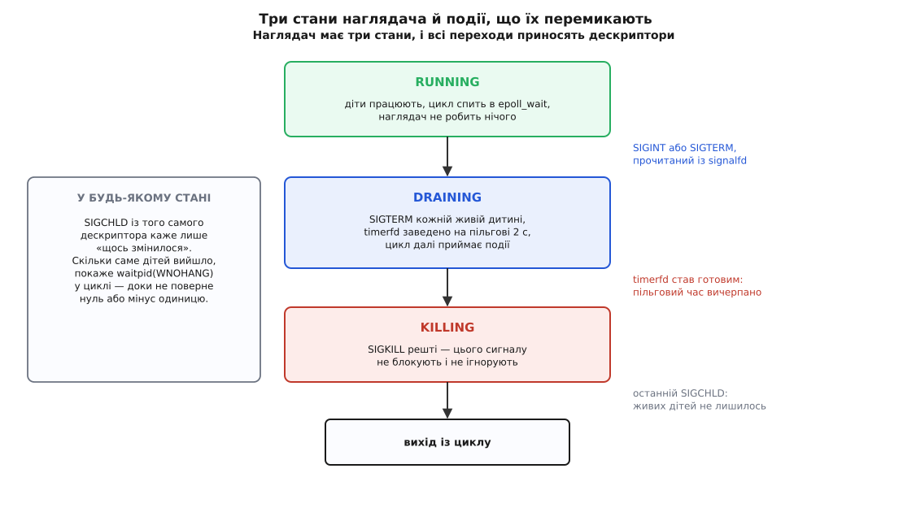

# ⚙️ Маленький наглядач: signalfd, timerfd і згортання без жодного обробника

Тут зібрано повний код служби на C, яка тримає кілька дитячих процесів і вміє акуратно скластися на Ctrl-C: приймає сигнали як звичайні події `epoll`, прибирає зомбі, дає дітям пільговий час і добиває тих, хто його прогуляв. Дві сотні рядків — і жодної функції-обробника, жодного прапорця `volatile sig_atomic_t`, жодної гонки між перевіркою й засинанням.

## Умова

Наглядач мусить уміти рівно чотири речі, і кожна з них у класичному вигляді породжує окрему халепу:

- **запустити N дітей** — і не залишити їм у спадок власних дивацтв;
- **дізнатися про смерть дитини** тоді, коли вона сталася, і забрати код виходу, щоб у таблиці процесів не збиралися зомбі;
- **прийняти Ctrl-C або `SIGTERM`** у своїй точці, а не посеред довільної інструкції;
- **згорнутися зі стелею за часом**: чемним дати попрощатися, впертих убити.

Остання вимога — та, заради якої в цьому прикладі є другий дескриптор. «Дати дві секунди» без таймера означає `sleep(2)` посеред циклу, тобто дві секунди глухоти до всього іншого: смерть дитини за цей час помічена не буде, повторний Ctrl-C — теж. Тому пільговий час теж стає подією.

## Порядок, який не можна переставити

Уся конструкція складається з трьох кроків, і переставляти їх немає як.

**Спершу маска.** `SIGINT`, `SIGTERM` і `SIGCHLD` блокуються найпершою дією `main`, ще до створення дескрипторів і — якби вони були — до створення потоків, бо кожен новий потік дістає копію маски того, хто його створив. Поки маска стоїть, ці три сигнали нікуди не діваються: їхні біти лягають у набір очікуваних і чекають, доки їх заберуть явно.

**Потім дескриптори.** `signalfd` показує саме те, що назбиралося під маскою; `timerfd_create` дає другий дескриптор, поки не заведений. Обидва з прапорцями `CLOEXEC` (щоб не потекли в дитину через `exec`) і `NONBLOCK` (щоб порожнє читання поверталося `EAGAIN`, а не блокувало цикл).

**Аж тоді діти.** І в кожній дитині — один обов'язковий рядок між `fork` і `exec`, про який ітиметься окремо.

Далі наглядач — це проста машина з трьох станів, і всі переходи в ній приносять дескриптори, а не обробники.



*Обидва переходи згортання починаються з `read()` — з одного дескриптора або з другого. Прибирання зомбі йде впоперек станів: `SIGCHLD` осмислений у будь-якому з них.*

> 🔧 **Навіщо це.** Стан наглядача змінюється лише в одній точці програми — там, де цикл розібрав подію. Тому `state`, масив `kids[]` і лічильник `alive` є звичайними змінними без жодного `volatile` й без атомарних операцій: до них ніхто не має доступу «зсередини» довільної інструкції. Саме це й купується маскою.

## Код

```c
/* sup.c — наглядач на signalfd + timerfd + epoll.
   Збірка: cc -std=gnu11 -D_GNU_SOURCE -Wall -Wextra -O2 -o sup sup.c */

#include <errno.h>
#include <signal.h>
#include <stdint.h>
#include <stdio.h>
#include <stdlib.h>
#include <string.h>
#include <sys/epoll.h>
#include <sys/signalfd.h>
#include <sys/timerfd.h>
#include <sys/wait.h>
#include <time.h>
#include <unistd.h>

#define NKIDS      3
#define GRACE_SEC  2

static const char *KIND[NKIDS] = { "polite", "polite", "stubborn" };

enum { RUNNING, DRAINING, KILLING };

static pid_t kids[NKIDS];
static int   alive = 0;
static int   state = RUNNING;
static int   sfd = -1, tfd = -1;

/* ── дитина: той самий образ, запущений з argv[1] == "worker" ─────────── */

static volatile sig_atomic_t stop_now = 0;
static void on_term(int signo) { (void) signo; stop_now = 1; }

static int worker(const char *kind)
{
    struct sigaction sa;
    memset(&sa, 0, sizeof sa);
    sa.sa_handler = strcmp(kind, "stubborn") == 0 ? SIG_IGN : on_term;
    sigemptyset(&sa.sa_mask);
    sigaction(SIGTERM, &sa, NULL);

    printf("  worker[%s] pid=%ld: почав\n", kind, (long) getpid());
    fflush(stdout);

    while (!stop_now) {
        struct timespec t = { 0, 200 * 1000 * 1000 };
        nanosleep(&t, NULL);
    }
    printf("  worker[%s] pid=%ld: прибрав за собою й виходжу\n", kind, (long) getpid());
    fflush(stdout);
    return 0;
}

/* ── наглядач ─────────────────────────────────────────────────────────── */

static void reap(void)
{
    for (;;) {
        int status;
        pid_t pid = waitpid(-1, &status, WNOHANG);
        if (pid <= 0)                    /* 0 — усі живі; -1 — дітей більше нема */
            return;
        for (int i = 0; i < NKIDS; i++)
            if (kids[i] == pid) { kids[i] = -1; alive--; }
        if (WIFEXITED(status))
            printf("supervisor: pid=%ld вийшов сам, код %d (лишилось %d)\n",
                   (long) pid, WEXITSTATUS(status), alive);
        else
            printf("supervisor: pid=%ld убитий сигналом %d (лишилось %d)\n",
                   (long) pid, WTERMSIG(status), alive);
        fflush(stdout);
    }
}

static void finish_shutdown(void)
{
    struct itimerspec off;

    state = KILLING;
    memset(&off, 0, sizeof off);
    timerfd_settime(tfd, 0, &off, NULL);          /* нульовий it_value роззброює */

    for (int i = 0; i < NKIDS; i++)
        if (kids[i] > 0) {
            printf("supervisor: pid=%ld не встиг — SIGKILL\n", (long) kids[i]);
            kill(kids[i], SIGKILL);
        }
    fflush(stdout);
}

static void begin_shutdown(void)
{
    struct itimerspec grace;

    if (state == DRAINING) {                      /* другий Ctrl-C: більше не чекаємо */
        printf("supervisor: повторний сигнал — добиваю негайно\n");
        finish_shutdown();
        return;
    }
    if (state != RUNNING)
        return;
    state = DRAINING;

    for (int i = 0; i < NKIDS; i++)
        if (kids[i] > 0)
            kill(kids[i], SIGTERM);

    memset(&grace, 0, sizeof grace);
    grace.it_value.tv_sec = GRACE_SEC;            /* it_interval нульовий → один раз */
    timerfd_settime(tfd, 0, &grace, NULL);

    printf("supervisor: SIGTERM усім, %d с на прибирання\n", GRACE_SEC);
    fflush(stdout);
}

static void handle_signal(const struct signalfd_siginfo *si)
{
    if (si->ssi_signo == SIGCHLD) {
        reap();
    } else {
        printf("supervisor: %s від pid=%u — починаю згортання\n",
               si->ssi_signo == SIGINT ? "SIGINT" : "SIGTERM", si->ssi_pid);
        fflush(stdout);
        begin_shutdown();
    }
}

static void drain_signalfd(void)
{
    struct signalfd_siginfo si[8];                /* 8 × 128 = 1024 байти */
    for (;;) {
        ssize_t n = read(sfd, si, sizeof si);
        if (n < 0) {
            if (errno == EINTR) continue;
            if (errno != EAGAIN) perror("read signalfd");
            return;                               /* EAGAIN: очікуваних більше нема */
        }
        for (size_t i = 0; i < (size_t) n / sizeof si[0]; i++)
            handle_signal(&si[i]);
    }
}

static void drain_timerfd(void)
{
    uint64_t ticks;

    if (read(tfd, &ticks, sizeof ticks) != (ssize_t) sizeof ticks)
        return;
    printf("supervisor: пільговий час вичерпано\n");
    fflush(stdout);
    finish_shutdown();
}

static pid_t spawn(const char *self, const char *kind, const sigset_t *orig)
{
    pid_t pid = fork();

    if (pid < 0) { perror("fork"); exit(1); }
    if (pid == 0) {
        sigprocmask(SIG_SETMASK, orig, NULL);     /* без цього рядка дитина глуха */
        execl(self, self, "worker", kind, (char *) NULL);
        perror("execl");
        _exit(127);
    }
    return pid;
}

int main(int argc, char **argv)
{
    sigset_t mask, orig;
    struct epoll_event ev;
    int ep;

    if (argc == 3 && strcmp(argv[1], "worker") == 0)
        return worker(argv[2]);

    sigemptyset(&mask);
    sigaddset(&mask, SIGINT);
    sigaddset(&mask, SIGTERM);
    sigaddset(&mask, SIGCHLD);

    /* 1. Маска — найперша дія. У програмі з потоками тут стояв би
          pthread_sigmask() ДО створення бодай одного потоку.        */
    if (sigprocmask(SIG_BLOCK, &mask, &orig) < 0) { perror("sigprocmask"); return 1; }

    /* 2. Тільки тепер дескриптори мають сенс. */
    sfd = signalfd(-1, &mask, SFD_CLOEXEC | SFD_NONBLOCK);
    if (sfd < 0) { perror("signalfd"); return 1; }
    tfd = timerfd_create(CLOCK_MONOTONIC, TFD_CLOEXEC | TFD_NONBLOCK);
    if (tfd < 0) { perror("timerfd_create"); return 1; }

    ep = epoll_create1(EPOLL_CLOEXEC);
    if (ep < 0) { perror("epoll_create1"); return 1; }
    ev.events = EPOLLIN;  ev.data.fd = sfd;  epoll_ctl(ep, EPOLL_CTL_ADD, sfd, &ev);
    ev.events = EPOLLIN;  ev.data.fd = tfd;  epoll_ctl(ep, EPOLL_CTL_ADD, tfd, &ev);

    /* 3. Аж тепер діти. */
    for (int i = 0; i < NKIDS; i++) {
        kids[i] = spawn(argv[0], KIND[i], &orig);
        alive++;
    }
    printf("supervisor pid=%ld: %d дітей запущено; Ctrl-C або kill -TERM %ld\n",
           (long) getpid(), NKIDS, (long) getpid());
    fflush(stdout);

    while (alive > 0) {
        struct epoll_event out[4];
        int n = epoll_wait(ep, out, 4, -1);
        if (n < 0) {
            if (errno == EINTR) continue;
            perror("epoll_wait");
            break;
        }
        for (int i = 0; i < n; i++) {
            if (out[i].data.fd == sfd)      drain_signalfd();
            else if (out[i].data.fd == tfd) drain_timerfd();
        }
    }
    printf("supervisor: дітей не лишилось, виходжу\n");
    return 0;
}
```

Дитина тут — той самий виконуваний файл, запущений з `argv[1] == "worker"`: так приклад лишається одним файлом, а поведінка дітей повністю під нашим контролем. Двоє «чемних» ставлять обробник `SIGTERM` і виходять, побачивши прапорець; один «упертий» ставить `SIG_IGN` і не має наміру помирати добровільно.

Чемна дитина написана навмисне по-старому — обробник плюс `volatile sig_atomic_t`, — щоб різниця між двома підходами була видна поруч. Щілина в ній нікуди не поділася: сигнал, що прийшов між перевіркою `!stop_now` і входом у `nanosleep`, коштує зайвих 200 мілісекунд сну. Для робітника, який усе одно прокидається п'ять разів на секунду, це ціна нікчемна, тому городити тут другий `signalfd` не варто. Але саме ця затримка й перетворюється на справжню помилку, щойно замість `nanosleep` стане `epoll_wait` без таймауту: тоді «зайвий сон» триває вічно.

## Збірка й запуск

```sh
cc -std=gnu11 -D_GNU_SOURCE -Wall -Wextra -O2 -o sup sup.c
./sup
```

Далі — Ctrl-C у терміналі. Ось що видно:

```
supervisor pid=8231: 3 дітей запущено; Ctrl-C або kill -TERM 8231
  worker[polite] pid=8232: почав
  worker[polite] pid=8233: почав
  worker[stubborn] pid=8234: почав
^Csupervisor: SIGINT від pid=0 — починаю згортання
supervisor: SIGTERM усім, 2 с на прибирання
  worker[polite] pid=8232: прибрав за собою й виходжу
  worker[polite] pid=8233: прибрав за собою й виходжу
supervisor: pid=8232 вийшов сам, код 0 (лишилось 2)
supervisor: pid=8233 вийшов сам, код 0 (лишилось 1)
supervisor: пільговий час вичерпано
supervisor: pid=8234 не встиг — SIGKILL
supervisor: pid=8234 убитий сигналом 9 (лишилось 0)
supervisor: дітей не лишилось, виходжу
```

`pid=0` у першому рядку — не помилка друку. Ctrl-C народжує термінальний драйвер, а не якийсь процес, тож поля відправника лишаються нульовими. Надішліть той самий сигнал руками (`kill -TERM 8231` з іншого термінала) — і в цьому рядку побачите справжній номер оболонки, яка виконала `kill`.

## Пастки

**Рівнева готовність і читання до `EAGAIN`.** `epoll` тут рівневий: поки в наборі очікуваних лишається бодай один сигнал, `epoll_wait` повертатиметься негайно ([select, poll, epoll](book:unix-linux/select-poll-epoll) — рівнева готовність повідомляє про стан, а за фронтом — лише про зміну стану). Прочитати одну структуру за пробудження й вийти теж «працює», але цикл марно оббігає ще раз. А от у режимі за фронтом (`EPOLLET`) недочитаний залишок означає, що наступного повідомлення не буде ніколи: стан не змінювався, змінювати його нікому. Тому в `drain_signalfd` стоїть `for (;;)` до `EAGAIN` — і саме тому дескриптор створено з `SFD_NONBLOCK`. Ці дві речі — одне рішення, розірване на два місця коду: без прапорця останній `read` у цьому циклі просто заблокував би службу назавжди.

**Чому `read` віддає рівно 128 байтів.** Стільки займає `struct signalfd_siginfo`: реальних полів у ній менше, решта — навмисне доповнення, залишене на майбутні поля, щоб додавання нового не зламало вже зібрані програми. Наслідок практичний: буфер, менший за 128 байтів, дає `EINVAL` — не коротке читання, а помилку. Більший буфер дає кілька структур за один виклик, тому кількість подій рахують діленням: `n / sizeof si[0]`.

**Забути маску.** Найдорожча помилка й водночас найтихіша, бо ламається двома різними способами одразу. `SIGINT` і `SIGTERM` підуть звичайним шляхом, і типова дія вб'є наглядача просто в циклі; діти лишаться сиротами й перейдуть до `init` ([сироти й перепідпорядкування](book:unix-linux/orphan-reparenting) — коли батько вмирає раніше за дитину, її всиновлює процес-збирач). А `SIGCHLD` не вб'є нікого: його типова дія — «ігнорувати», тож сигнал спокійно дійде до кінця шляху й там зникне, у дескрипторі не з'явившись жодного разу. Зовні це має вигляд «signalfd не бачить смерті дітей», а насправді дескриптор порожній тому, що забирати з нього нічого: сигнал уже опрацьовано.

**Забути скинути маску дитині.** Диспозиції під час `exec` скидаються на типові, дескриптори з `CLOEXEC` закриваються, а маска переходить у новий образ як є ([exec: заміна образу](book:unix-linux/exec-semantics) — заміняється вміст пам'яті, але не властивості процесу, які до пам'яті не належать). Приберіть у `spawn` рядок із `sigprocmask` — і вивід зміниться так:

```
supervisor: SIGTERM усім, 2 с на прибирання
supervisor: пільговий час вичерпано
supervisor: pid=8232 не встиг — SIGKILL
supervisor: pid=8233 не встиг — SIGKILL
supervisor: pid=8234 не встиг — SIGKILL
```

Чемні діти зникли з виводу разом із упертою. Їхній код бездоганний: обробник поставлено, прапорець перевіряється — але `SIGTERM` заблокований успадкованою маскою, тож обробник не виконається ніколи, і біт просто лежить в очікуваних до самої смерті від `SIGKILL`. Шукати причину будуть у дитині, а лежить вона в батькові, за два виклики звідти.

**`SIGCHLD` не рахує, скільки разів надійшов.** Звичайні сигнали не стають у чергу: поки біт стоїть, наступний такий самий зливається з ним. Троє дітей, що вийшли в ту саму мілісекунду, цілком можуть дати одну структуру в `read` — і якби `reap()` робив один `waitpid`, двоє з трьох лишилися б зомбі назавжди ([завершення, wait і зомбі](book:unix-linux/exit-wait-zombies) — запис про мертву дитину живе в таблиці, доки батько не забере код виходу). Тому `waitpid(-1, …, WNOHANG)` крутиться в циклі, доки не поверне нуль (живі є, новин нема) або `-1` (дітей не лишилось). Це не перестраховка, а єдиний правильний спосіб: із самого сигналу кількість подій дістати неможливо.

**`waitpid(-1, …)` забирає будь-яку дитину, не лише вашу.** У наглядачі це саме те, що треба, але щойно в тій самій програмі з'явиться `system()`, `popen()` чи бібліотека, яка нишком запускає допоміжний процес, — гонка неминуча. Той, хто прокинувся першим, забере чужий код виходу, а справжній власник дістане `-1` з `ECHILD` і побачить, що його дитина ніби ніколи не існувала. Тому в наглядачі або зовсім немає інших способів породжувати процеси, або замість `-1` передають конкретний номер і ловлять `ECHILD` як «уже прибрано». Дешевого способу примирити збирача «за всіма» з чужими викликами `system()` немає — це вибір архітектури, а не деталь коду.

**У програмі з потоками змінюється рівно один рядок — і додається одне правило.** Замість `sigprocmask` пишуть `pthread_sigmask` (у багатопотоковій програмі поведінка першого стандартом не визначена), а виклик має відбутися до створення першого потоку: маска копіюється з творця, тож так її дістануть усі. Правило ж таке: читати з `signalfd` має один потік. Формально дескриптор можна додати в кілька циклів подій, але сигнал, прочитаний одним читачем, зникає для решти, і хто саме його дістане — не визначено. Наглядач, у якого `SIGCHLD` іноді потрапляє не в той потік, налагоджується довго й неприємно.

**Таймер теж треба вичитувати.** `timerfd` віддає 8 байтів — беззнакове ціле з кількістю спрацювань від попереднього читання ([таймери процесу](book:unix-linux/process-timers) — той самий годинник, поданий як дескриптор). Не прочитати його означає лишити дескриптор готовим, і рівневий `epoll` укрутить цикл у стовідсоткове завантаження процесорного ядра. З тієї ж причини в `finish_shutdown` таймер роззброюють нульовим `it_value`: свою справу він зробив, а прокидатися вдруге ні до чого.

**Наглядач лишається смертним, і це навмисно.** `SIGKILL` заблокувати не можна, тож у дескрипторі він не з'явиться ніколи — жодною маскою служба не зробить себе незнищенною. Ціна за всю конструкцію мала: два дескриптори незалежно від кількості дітей, одне пробудження на подію та один прохід по масиву дітей на кожен щабель згортання.
