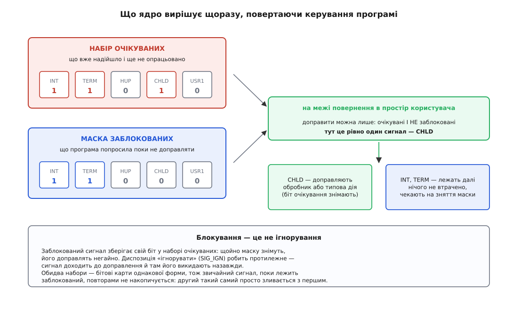
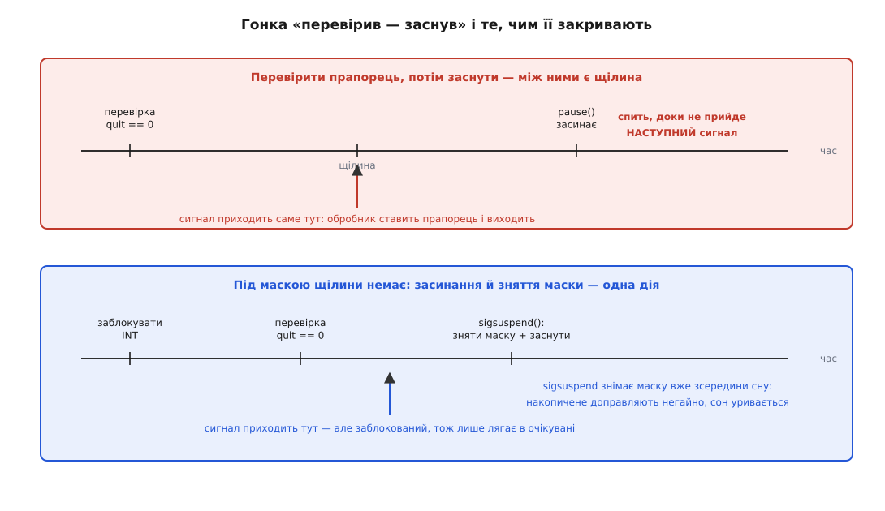
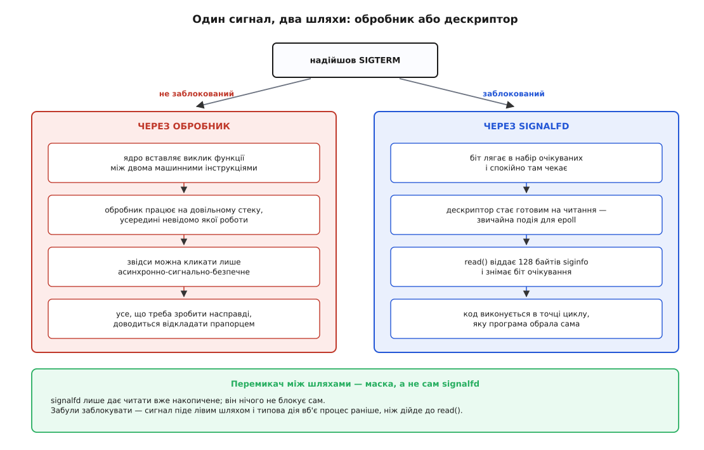

# Маскування сигналів і signalfd

<preknowlist>
- [Сигнал: асинхронне сповіщення](topic:unix-linux/signal-model) — біт очікування замість лічильника, розрив між породженням і доправленням, доправлення лише на межі повернення в простір користувача.
- [Диспозиція сигналу](topic:unix-linux/signal-disposition) — три можливі долі доправленого сигналу: власний обробник, ігнорування, типова дія.
- [Що можна робити в обробнику сигналу](topic:unix-linux/async-signal-safety) — чому всередині обробника заборонено майже все звичне й що таке асинхронно-сигнальна безпека.
- [Файловий дескриптор](topic:unix-linux/file-descriptor) — маленьке число, яким процес називає ядру вже відкритий об'єкт.
- [select, poll, epoll](topic:unix-linux/select-poll-epoll) — як один потік засинає одразу на багатьох джерелах і прокидається від будь-якого.
- [Блокуючий і неблокуючий режим](topic:unix-linux/blocking-and-nonblocking) — що означає `O_NONBLOCK` і відповідь `EAGAIN` замість чекання.
- [Потоки в Linux](topic:unix-linux/threads-as-tasks) — планувальник бачить задачі; кілька задач складають одну групу потоків, тобто те, що ззовні звуть процесом.
- [Канали й іменовані канали](topic:unix-linux/pipe-and-fifo) — двокінцева труба в ядрі, обидва кінці якої є звичайними дескрипторами.
</preknowlist>

Служба перекладає базу на нове місце: тимчасовий файл уже записано, лишилося перейменувати його поверх старого. Дві дії, між ними — частка мілісекунди. Саме в цю частку користувач тисне Ctrl-C.

Далі програма нічого не обирає. Якщо обробника немає, процес просто вмирає, і на диску лишається сирота — тимчасовий файл без старого поруч. Якщо обробник є, ядро вставить виклик цієї функції між двома машинними інструкціями, байдуже якими: посеред перейменування, посеред роботи бібліотеки виділення пам'яті, у потоці, якого ви для цього не призначали. Обидва варіанти погані з однієї причини — момент вибрали не ви.

А потрібне просте: новину прийняти негайно, щоб користувач не тиснув удруге, а зреагувати тоді, коли перейменування скінчиться. Тобто розчепити дві речі, які в сигналі злиті докупи: **надходження** й **опрацювання**.

Unix дає для цього один-єдиний важіль. Уся решта споруди виростає з нього.

## Відкласти, не втративши

Важіль зветься **маскою** (від фр. *masque* — накладка, що затуляє): для кожної задачі ядро тримає набір сигналів, які зараз **не можна доправляти**. Заблокований сигнал не зникає й не втрачається — його біт лягає в набір очікуваних і спокійно там лежить. Щойно маску знімуть, ядро доправить накопичене на найближчій же межі повернення в програму.

Це геть інша річ, ніж диспозиція «ігнорувати». `SIG_IGN` спрацьовує **під час** доправлення: сигнал доходить до кінця шляху, і там його викидають назавжди. Маска спрацьовує **до** доправлення: шлях просто перегороджено, а сигнал стоїть перед перепоною. Плутанина між цими двома станами — джерело цілого класу помилок: програміст «вимкнув» сигнал маскою, потім десь у бібліотеці маску відновили з копії — і весь накопичений затор ринув усередину саме тоді, коли на нього не чекали.



*Два бітові набори однакової форми: перший каже, що вже надійшло, другий — чого поки не чіпати. Доправляють їхній перетин; решта лишається лежати.*

Керують маскою через `sigprocmask()`, а в багатопотоковій програмі — через `pthread_sigmask()` з тими самими аргументами. Три режими: `SIG_BLOCK` додає сигнали до маски, `SIG_UNBLOCK` вилучає, `SIG_SETMASK` ставить маску цілком. Сам набір збирають примітивами `sigemptyset`/`sigaddset` — `sigset_t` є непрозорим типом саме тому, що в різних системах це або одне машинне слово, або масив слів.

Дві межі стоять тут із самого початку і не рухаються. `SIGKILL` і `SIGSTOP` заблокувати не можна: їх мовчки викидають із будь-якого набору, бо інакше процес міг би зробити себе незнищенним. І блокувати **синхронні** сигнали пасток — `SIGSEGV`, `SIGBUS`, `SIGILL`, `SIGFPE` — беззмістовно: коли такий сигнал народжений завинилою інструкцією, ядро зриває і маску, і диспозицію та виконує типову дію, бо повернення в ту саму інструкцію дало б вічну петлю падінь. Маска має сенс лише для сигналів, надісланих **ззовні**.

Ще одна межа не така очевидна. Поки звичайний сигнал лежить заблокований, повтори того самого номера не накопичуються: біт уже стоїть, другий такий самий просто зливається з першим. Чим довше тримати маску, тим більше подій злипнеться — механізм цього злипання й те, чим від нього різняться реальночасові сигнали, розібрано в [моделі сигналу](topic:unix-linux/signal-model). Практичний висновок один: маска — інструмент коротких вікон, а не постійний спосіб життя.

> 🔧 **Навіщо це.** Найдешевша користь з маски — критична ділянка. Обгорніть перейменування бази в `SIG_BLOCK`/`SIG_SETMASK`, і Ctrl-C посеред неї не вб'є процес на півкроці: сигнал зачекає кілька мікросекунд і доправиться відразу після. Ніякого обробника для цього не треба взагалі.

Про одну маску легко забути, бо її ставить не програміст. На час роботи обробника ядро **само** додає до маски той сигнал, який доправляється, плюс усе, перелічене в полі `sa_mask` при `sigaction()`. Тому обробник за замовчуванням не переривається сам собою. Стару маску відновлює `sigreturn` — той самий системний виклик, яким програма повертається з обробника ([сигнальний кадр і повернення з обробника](topic:unix-linux/signal-frame-and-sigreturn)). Прапорець `SA_NODEFER` цю люб'язність вимикає, і тоді обробник має бути готовим до входу в самого себе.

## Маска належить потокові

Набір очікуваних сигналів у групі потоків подвійний: один спільний на процес і по одному в кожного потоку. А от маска — **завжди особиста**. У кожного потоку своя, при `pthread_create` вона копіюється з того потоку, що створював.

Звідси випливає непередбачуваність, з якою неможливо жити. Сигнал, надісланий процесові (`kill()` за номером), ядро віддає **будь-якому** потоку, що його не блокує. Якому саме — не визначено; на це не можна покластися ані в документації, ані на практиці. Ваш `SIGTERM` може дістатися потокові, що саме розбирає мережевий пакет, і виконати обробник посеред нього.

Лікують це не вгадуванням, а розпорядженням. Головний потік **до** створення решти ставить маску, що блокує всі цікаві сигнали. Кожен новий потік успадковує її копію — отже, блокують усі. У ядра просто немає кандидата на доправлення, і сигнал лежить у спільному наборі очікуваних, доки хтось не забере його **явно**. Далі лишається вибрати, хто і як забирає, — і саме про це вся решта статті.

Дрібниця, що коштує довгих ночей: у багатопотоковій програмі поведінка `sigprocmask()` не визначена стандартом. Працює вона зазвичай так само, як `pthread_sigmask()`, але покладатися на це не варто — у програмі з потоками пишіть `pthread_sigmask()`, і крапка.

## Вікно між перевіркою й засинанням

Найпростіший спосіб «зреагувати у своїй точці» виглядає так: обробник ставить прапорець, головний код його перевіряє. Написати це правильно з першої спроби майже нікому не вдається.

```c
static volatile sig_atomic_t quit = 0;

static void on_term(int signo) { (void)signo; quit = 1; }

/* ... sigaction(SIGTERM, ...) ... */

while (!quit)
    pause();          /* чекати на будь-який сигнал */
```

Помилка ховається між двома рядками. Умова `!quit` обчислилася й дала «ще ні»; програма прямує до `pause()`. У цей проміжок приходить `SIGTERM`: обробник ставить `quit = 1` і повертається. Аж тепер починає працювати `pause()` — і засинає, чекаючи на сигнал, який уже прийшов. Якщо він був єдиним, програма спатиме вічно, тримаючи `quit == 1` у пам'яті.

Щілину не можна замалювати: скільки не переставляй перевірку, між нею й засинанням лишається проміжок, а сигнал приходить асинхронно й влучить у нього рано чи пізно. Прибрати можна лише саму окремішність цих двох дій.

Це й робить `sigsuspend()`: **атомарно** ставить задану маску й засинає. Разом із блокуванням до перевірки виходить конструкція без щілин.

```c
sigset_t block, orig, empty;
sigemptyset(&block);  sigaddset(&block, SIGTERM);
sigemptyset(&empty);

pthread_sigmask(SIG_BLOCK, &block, &orig);   /* від цієї миті TERM лише накопичується */

while (!quit)
    sigsuspend(&empty);                      /* зняти маску І заснути — однією дією */

pthread_sigmask(SIG_SETMASK, &orig, NULL);
```

Розберімо обидва випадки. Сигнал прийшов **до** перевірки — обробник виконатися не міг, бо маска блокує, тож `quit` ще нуль; але біт очікування стоїть. `sigsuspend` ставить порожню маску — і сигнал доправляють негайно, обробник ставить `quit`, `sigsuspend` повертається з `EINTR`, цикл перевіряє прапорець і виходить. Сигнал прийшов **після** перевірки, поки програма вже спить у `sigsuspend` з порожньою маскою, — доправлення теж негайне. Третього варіанту немає: доки маска стоїть, обробник не виконається, а зняття маски й засинання неподільні.



*Уся конструкція існує заради того, щоб між перевіркою стану й засинанням не лишилося моменту, у який сигнал може прийти непоміченим.*

Та сама гонка є в кожній програмі з циклом подій: там замість `pause()` стоїть `poll()` чи `epoll_wait()`, а щілина точнісінько така сама. Тому в системі є варіанти цих викликів із додатковим аргументом-маскою — `pselect()`, `ppoll()`, `epoll_pwait()`: вони ставлять маску, чекають і відновлюють стару, і все це неподільно.

## Сигнал як байти в дескрипторі

Атомарна маска в `ppoll` розв'язує гонку, але лишає всю незручність обробника: код, що реагує на сигнал, і код, що обслуговує з'єднання, живуть у різних світах. Обробник має право лише на асинхронно-сигнально-безпечні виклики, спільні дані бачить крізь `volatile sig_atomic_t`, і виконується він хтозна в якому потоці.

Вихід з'явився у вигляді прийому, який донині ходить під назвою **self-pipe** (англ. «труба до себе») і приписується Деніелові Бернстайну. Ідея — на один рядок. Програма створює канал і залишає обидва його кінці відкритими. Обробник сигналу робить рівно одну дію: пише в канал один байт. Цикл подій стежить за кінцем на читання, як за будь-яким іншим дескриптором.

Працює це тому, що `write()` — асинхронно-сигнально-безпечний, а запис однієї порції в канал є неподільним. Сигнал у такий спосіб перетворюється на **дані**, а дані цикл подій умів чекати завжди.

Ціна теж є, і чимала. Обробник нікуди не дівся — з усіма своїми обмеженнями. Обидва кінці треба зробити неблокуючими, інакше переповнений канал заблокує обробник назавжди; отже, при переповненні байти губляться, і разом з ними — розрізнення сигналів. Багатий опис події (`siginfo`) в один байт не влазить. І два дескриптори витрачено на те, що взагалі не є вводом-виводом.

## Дескриптор, що показує сигнали

Прийом виявився настільки поширеним, що його зробили частиною ядра. У 2007 році Давіде Лібенці подав до Linux серію латок «signal/timer/event fds», і в версії 2.6.22 з'явився системний виклик `signalfd()`; сусідні `eventfd` і `timerfd` — з тієї самої серії й тієї самої думки. Дорогу від ненадійних сигналів раннього Unix до цього виклику розказано окремо: [від self-pipe до signalfd](topic:unix-linux/signal-mask-signalfd/hist-from-self-pipe-to-signalfd.md) — які саме гонки не вдавалося закрити засобами POSIX, чому обгортка `pselect` була не атомарною і що врешті потрапило в ядро.

`signalfd()` створює дескриптор, який стає **готовим на читання**, поки для читача є очікувані сигнали з указаного набору. Читання забирає сигнал зі списку очікуваних і віддає натомість структуру `signalfd_siginfo` завдовжки 128 байтів: номер сигналу, номер і власника процесу-відправника, код походження, а для `SIGCHLD` — ще й код виходу дитини. Жодного обробника, жодного довільного стека, жодних обмежень безпеки: код виконується там, де ви його написали.

Одна річ у цій конструкції обов'язкова, і саме на ній спотикаються. **`signalfd` нічого не блокує.** Він лише дає читати вже накопичене. Не заблокуєте сигнали самі — вони підуть звичайним шляхом, і типова дія вб'є процес раніше, ніж цикл дійде до `read()`. Тож порядок завжди той самий: спершу маска, потім дескриптор.



*Перемикач між шляхами — маска. signalfd лише відчиняє двері до накопиченого; закрити старий шлях мусить сама програма.*

```c
sigset_t mask;
sigemptyset(&mask);
sigaddset(&mask, SIGINT);
sigaddset(&mask, SIGTERM);
sigaddset(&mask, SIGCHLD);

/* 1. без цього кроку решта не має сенсу */
pthread_sigmask(SIG_BLOCK, &mask, NULL);

/* 2. дескриптор, що бачить саме ці сигнали */
int sfd = signalfd(-1, &mask, SFD_CLOEXEC | SFD_NONBLOCK);
if (sfd < 0) { perror("signalfd"); return 1; }

/* 3. далі це звичайне джерело подій */
struct pollfd pfd = { .fd = sfd, .events = POLLIN };
for (;;) {
    if (poll(&pfd, 1, -1) < 0) { if (errno == EINTR) continue; break; }

    struct signalfd_siginfo si;
    while (read(sfd, &si, sizeof si) == (ssize_t) sizeof si) {
        if (si.ssi_signo == SIGCHLD)
            reap_children();                  /* сам сигнал зомбі не прибирає */
        else
            begin_graceful_shutdown();        /* INT або TERM */
    }
    /* read повернув EAGAIN — очікуваних більше немає, спимо далі */
}
```

Три деталі коду варті окремої уваги. Перший аргумент `-1` каже «створити новий дескриптор»; передавши замість нього наявний, ви зміните його набір сигналів на льоту. `SFD_CLOEXEC` закриває дескриптор при `exec`, `SFD_NONBLOCK` рятує від застрягання на порожньому читанні — обидва прапорці додано трохи пізніше за сам виклик, у 2.6.27. І готовність тут рівнева: поки очікувані є, `poll` повертатиме готовність знову й знову, тож читання по одній структурі за прохід нічого не губить — лише змушує цикл робити зайвий оберт на кожен непрочитаний сигнал. Тому дескриптор вичерпують до `EAGAIN`; у режимі спрацювання за фронтом (`EPOLLET`) це вже не економія, а обов'язок. За один `read` можна забрати кілька структур одразу, якщо дати більший буфер.

Повний перелік того, чим це все керується — підписи `sigprocmask`, `pthread_sigmask`, `sigsuspend`, `sigwaitinfo`, `signalfd`, значення прапорців, усі поля `signalfd_siginfo` з поясненням, для якого сигналу яке з них має сенс, коди помилок і що видно в `/proc/<pid>/fdinfo` — винесено окремо: [контракт маски й signalfd](topic:unix-linux/signal-mask-signalfd/api-signal-mask-and-signalfd.md).

> 🔧 **Навіщо це.** Служба з циклом подій отримує одну однорідну картину світу: з'єднання, таймери й сигнали — усе це дескриптори в тому самому `epoll`. Зникає цілий клас помилок «прапорець з обробника побачили із запізненням», і `SIGTERM` від системи менеджера служб опрацьовується як звичайна подія — з доступом до всіх структур програми, з логуванням, із коректним закриттям з'єднань.

## Чого signalfd не вміє

Найдорожча пастка цієї конструкції лежить не в ній самій, а поруч. Маска **переживає `exec`**. Диспозиції при заміні образу скидаються на типові, дескриптор із `SFD_CLOEXEC` закривається — а маска переходить у нову програму як є. Служба, що заблокувала `SIGINT` заради signalfd і запустила з-під себе дитину, віддає їй глухоту до Ctrl-C у спадок. Дитина ні про що не здогадується, її код правильний, а Ctrl-C не діє. Лікування — один виклик між `fork` і `exec`:

```c
pid_t pid = fork();
if (pid == 0) {
    sigset_t none;
    sigemptyset(&none);
    pthread_sigmask(SIG_SETMASK, &none, NULL);   /* віддати дитині чисту маску */
    execvp(path, argv);
    _exit(127);
}
```

Решта меж прямо випливає з того, як усе влаштовано. `SIGKILL` і `SIGSTOP` через дескриптор не читаються — їх не можна заблокувати, а отже, вони ніколи не залежуються в очікуваних. Синхронні пастки теж ні: заблокований `SIGSEGV` призводить не до тихого очікування, а до примусової типової дії. Читання `SIGCHLD` не прибирає зомбі — дескриптор віддає новину, а звільняє запис про дитину як і раніше `wait` ([завершення, wait і зомбі](topic:unix-linux/exit-wait-zombies)). Після `fork` дитина отримує копію дескриптора, але читає з нього **свої** сигнали, а не батькові: спільним є лише дескриптор, а не потік подій. І читання бачить очікувані сигнали **того потоку, який читає**, плюс спільні на процес — сигнал, спрямований у конкретний інший потік, у ваш дескриптор не потрапить.

Нарешті, `signalfd` є лише в Linux. У переносній програмі це або умовна компіляція, або відмова від нього.

Як усе це складається в живу службу — цикл `epoll`, дитячі процеси, скидання маски перед `exec`, прибирання зомбі й вихід із таймаутом на повільних дітях — зібрано в робочому прикладі: [маленький наглядач на signalfd](topic:unix-linux/signal-mask-signalfd/proj-signalfd-supervisor.md).

## Коли простіше без дескриптора

Якщо цикл подій програмі не потрібен, дескриптор — зайва сутність. POSIX має старший спосіб, що дає ту саму головну вигоду: `sigwaitinfo()` і його варіант з обмеженням часу `sigtimedwait()` **синхронно** знімають один сигнал із набору очікуваних, чекаючи, поки він там з'явиться.

Схема така сама: головний потік блокує потрібні сигнали до створення решти, після чого один призначений потік крутить `sigwaitinfo()` у вічному циклі й робить те, що треба. Обробників немає взагалі, обмежень асинхронно-сигнальної безпеки немає, `siginfo` доступний повністю — і все це переносне між системами Unix.

Вибір між двома підходами вирішує одне питання: чи є в програмі цикл подій, у якому сигнал має стати ще однією подією серед інших. Є — `signalfd` вбудовує сигнали в цю картину без окремого потоку й без окремої логіки пробудження. Немає (або потрібна переносність) — виділений потік із `sigwaitinfo` дає той самий контроль над моментом простішими засобами. Спільним лишається перший крок, з якого починається і те, і те: заблокувати сигнал скрізь, щоб ніхто не забрав його випадково.
