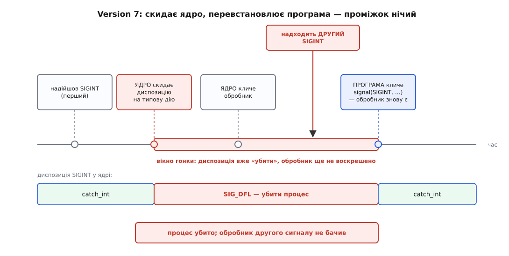

# 📜 Як сигнали переставали губитися

Перші десять років сигнали в Unix були влаштовані так, що надійну програму з ними написати було **неможливо** — не важко, а саме неможливо: у механізмі сиділа гонка, якої не можна було уникнути жодним кодом у просторі користувача. Теперішня складність `sigaction` — це рубець від того лікування, і варто знати, від чого саме.

## Обробник, що мусив себе воскрешати

У Version 7 Unix (1979) призначення обробника було одноразовим. Ядро, доправляючи сигнал, спершу **скидало диспозицію на типову дію** — тобто те налаштування «що робити з цим номером», яке процес виставляє собі сам і яке ядро зберігає в його структурі ([диспозиція сигналу](topic:unix-linux/signal-disposition)), — й лише потім кликало вашу функцію. Man-сторінка V7 каже це прямо: сигнал скидається на типову дію після перехоплення, і якщо ви хочете ловити кожен такий сигнал, ваша процедура мусить видати ще один виклик `signal`.

Звідси канонічний вигляд обробника тих часів:

```c
/* Version 7: диспозиція вже скинута, поки ми тут. Перше, що робимо, —
   воскрешаємо себе, бо наступний SIGINT уб'є процес. */
void catch_int(int sig)
{
    signal(SIGINT, catch_int);   /* ← перевстановлення */
    interrupted = 1;
}
```

Виглядає як дрібна незручність. Насправді це діра.

## Гонка, яку не можна закрити зсередини

Погляньмо на послідовність подій уважно.

Ядро скинуло диспозицію. Ядро віддало керування обробникові. Обробник виконав перший рядок і покликав `signal()`. Між другою й четвертою дією минає **ненульовий час** — кілька інструкцій, вхід у ядро, повернення. І весь цей час диспозиція `SIGINT` стоїть на типовій дії, тобто «убити процес».

Якщо саме в цей проміжок надійде другий `SIGINT` — програма помре. Не помилково, не через ваду в ядрі: ядро зробить рівно те, що записано в диспозиції.



*Скидання робить ядро, перевстановлення — програма; проміжок між ними належить нікому.*

Головне тут — не сама гонка, а те, що вона **непереборна зсередини**. Щоб її закрити, треба зробити «скинуто → перевстановлено» неподільним; але скидає ядро, а перевстановлює програма, і об'єднати ці дві дії в одну програма не має чим. Немає такого порядку рядків, який рятує. Немає обгортки навколо `signal()`, яка рятує. Хиба сидить у самому інтерфейсі — а отже, лікувати її мусить система.

Це був **не єдиний** такий випадок. Класична пара до нього — очікування сигналу:

```c
while (!got_signal)      /* прапорець ставить обробник */
    pause();             /* спати, доки не прийде сигнал */
```

Якщо сигнал надійде після перевірки прапорця, але до входу в `pause()`, обробник відпрацює, поставить прапорець — і `pause()` засне назавжди, бо будити його вже нікому. Знову дві дії, які мусили бути одна, і знову з простору користувача їх не склеїти. У книжці Стівенса «Advanced Programming in the UNIX Environment» (гл. 10) цей приклад стоїть поруч із першим саме тому, що хиба в них спільна.

Тодішній звичний обхід — не повертатися з обробника взагалі, а вистрибувати з нього через `longjmp()` у наперед поставлену точку. Гонки він не знімає: вікно між скиданням і перевстановленням лишається, просто програма рідше в нього потрапляє. Це паліатив, а не ліки.

## Берклі: маска замість скидання

Перше справжнє лікування прийшло з 4.2BSD (серпень 1983). Ідея була в тому, щоб **прибрати скидання й натомість дати процесові маску заблокованих сигналів** — окремий стан, яким можна порядкувати явно.

Обробник тепер лишається встановленим назавжди. А щоб він не переривав сам себе, ядро на час його роботи **додає до маски процесу** сам цей сигнал плюс те, що ви попросили заблокувати додатково, — і повертає маску до попереднього значення, коли обробник завершиться. Скидати диспозицію більше не треба, воскрешати себе теж, вікна не існує.

Нові виклики: `sigvec()` — призначити диспозицію разом із маскою `sv_mask` на час обробника; `sigblock()` — додати сигнали до маски; `sigsetmask()` — замінити маску цілком; `sigpause()` — атомарно поставити маску й заснути. Останній закриває й другу гонку: «розблокувати й чекати» стало **однією** дією ядра. За man-сторінками BSD `sigvec()` уперше з'явився саме в 4.2BSD; у 4.3BSD (червень 1986) через нього переписали й сам `signal()`, тож на BSD старе ім'я почало давати нову, надійну поведінку.

Ключове в берклійському рішенні — не набір імен, а те, що **маска стала повноцінним значенням**: її можна прочитати, зберегти, замінити цілком і повернути назад однією дією. Саме це робить можливими критичні ділянки на кілька сигналів одразу.

## AT&T: те саме лікування, інша форма

System V Release 3 (1986) полагодив ту саму гонку — і полагодив інакше, бо йшов від сумісності. Старий `signal()` у System V поведінки **не змінив**: він і далі скидав диспозицію (це та сама семантика, що її сьогодні дає `sigaction` із прапорцями `SA_RESETHAND | SA_NODEFER`). Замість нього додали окрему родину: `sigset()` призначає обробник із надійною семантикою, `sighold()` блокує сигнал, `sigrelse()` розблоковує, `sigignore()` вимикає, `sigpause()` чекає.

Різниця з Берклі виглядає косметичною, а насправді принципова: у System V маски **як цілого не було**. Кожна дія стосується рівно одного номера. Хочете закрити критичну ділянку від трьох сигналів — робите три `sighold()`, і між ними ви вже в стані, якого не описати одним значенням; хочете відновити те, що було до вас, — мусите пам'ятати про кожен номер окремо. `sigpause()` у System V теж бере один номер, тобто чекати можна на один сигнал, а не на набір.

Ці два лікування були **несумісні між собою**: код, написаний під `sigvec`, не збирався на System V, і навпаки. Обидва світи мали робочі надійні сигнали й жодного спільного способу їх записати.

## Чому POSIX узяв берклійську модель

IEEE Std 1003.1-1988 — перша редакція стандарту, що описував інтерфейс Unix-подібної системи як спільний контракт для всіх постачальників ([стандарт POSIX](topic:unix-linux/posix-standard)), — мусив обрати одне. Обрав берклійське — звідси й `sigaction()`, `sigprocmask()`, `sigpending()`, `sigsuspend()` та тип `sigset_t`, які ми вживаємо дотепер.

Причина в тому самому, чим ці моделі й різнилися. Набір сигналів як окремий тип дає операції, яких посигнальний інтерфейс не дає взагалі:

```c
sigset_t block, old;
sigemptyset(&block);
sigaddset(&block, SIGTERM);
sigaddset(&block, SIGHUP);

sigprocmask(SIG_BLOCK, &block, &old);   /* критична ділянка: одна дія на два сигнали */
/* … оновлюємо структуру, яку обробник не має побачити напівзміненою … */
sigprocmask(SIG_SETMASK, &old, NULL);   /* точне повернення того, що було */
```

Тут видно три речі, недосяжні для `sighold()`: атомарність для **набору**, збереження попередньої маски як **значення** й точне її відновлення. Останнє критичне для бібліотек: бібліотечна функція не знає, що заблокував той, хто її покликав, і мусить лишити маску такою, якою взяла. Так само `sigsuspend()` — це `sigpause()` над набором: атомарно ставить маску, спить і повертає стару.

При цьому POSIX не викинув здобутого досвіду сумісності. Скидання диспозиції лишилося доступним — але вже як **явно попрошений прапорець** `SA_RESETHAND`, а не як єдина можлива поведінка. Різниця між «за домовленістю» й «на вимогу» тут і є вся суть історії.

І ще одна спадщина, з якою стикається кожен: сам `signal()` стандарт залишив із **невизначеною** семантикою — на BSD надійна, на System V ні. Тому в програмах, які мають працювати всюди, `signal()` не вживають: не тому, що він старий, а тому, що з його імені не видно, яку саме з двох історій ви щойно покликали. Пишуть `sigaction()`, де кожен прапорець назвали вголос.

Розділити тут варто три речі, які легко злипаються. **Ідея** — блокування замість скидання — визріла в Берклі до 1983 року. **Реалізації** було дві, різні й несумісні, у 4.2BSD і в SVR3. **Стандартизація** 1988-го обрала одну з них не як «кращу школу», а за конкретною властивістю: набір сигналів як значення, з яким можна робити атомарні дії.

*Джерела: man-сторінка `signal(2)` Version 7 Unix; `sigvec(3)`, `sigset(3)` і `signal(2)` в man-pages Linux та OpenBSD (розділи HISTORY і NOTES); W. R. Stevens, S. A. Rago, «Advanced Programming in the UNIX Environment», гл. 10.*
