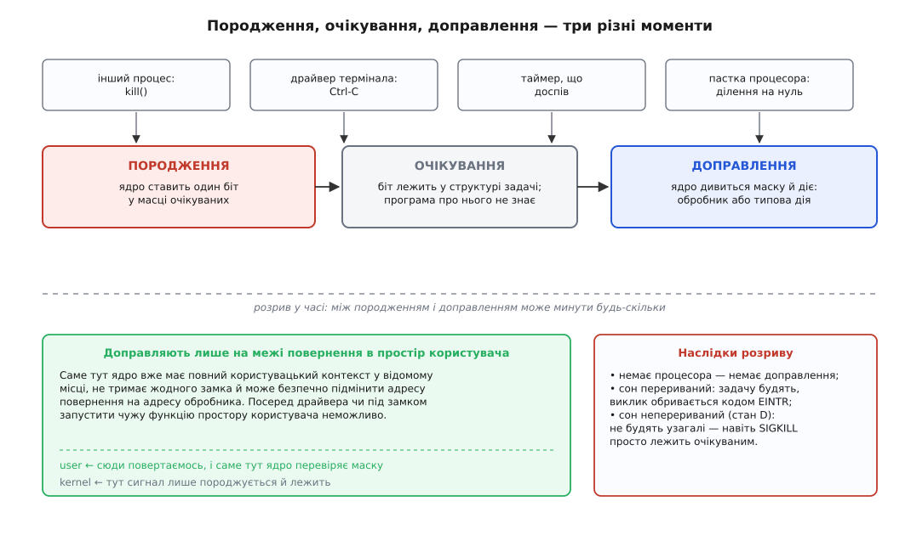
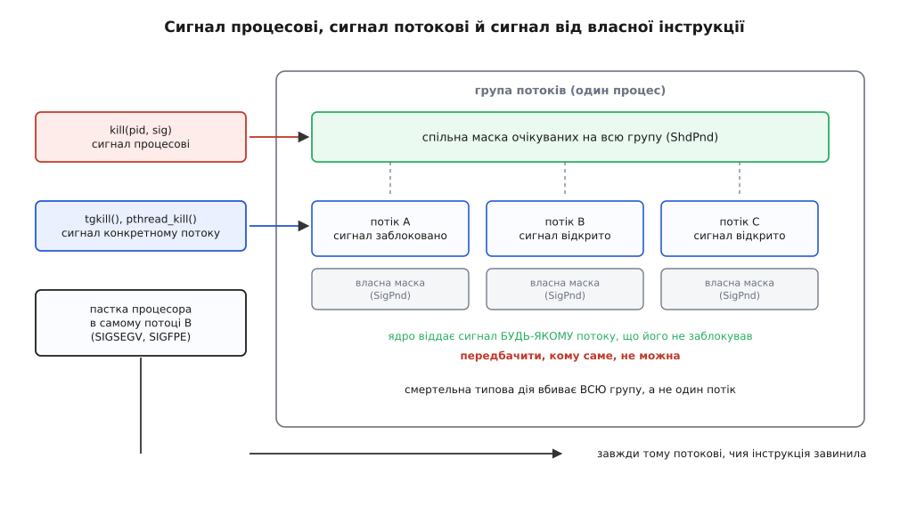
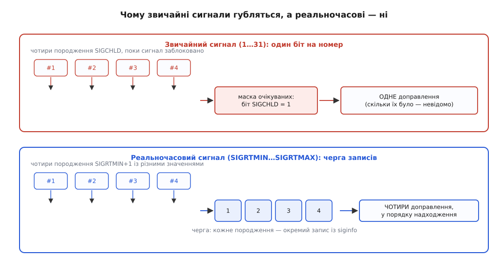

# Сигнал: асинхронне сповіщення

<preknowlist>
- [Ядро й простір користувача](book:unix-linux/kernel-and-userspace) — програма не порядкує машиною сама: усе, що стосується заліза й чужих ресурсів, робить ядро.
- [Механіка системного виклику](book:unix-linux/syscall-mechanics) — як програма переходить у режим ядра з проханням і як повертається назад у власний код.
- [Процес](book:unix-linux/process-model) — що саме ядро тримає про один запуск програми і в яких структурах це лежить.
- [Стани процесу](book:unix-linux/process-states) — задача не завжди виконується: буває перериваний сон, неперериваний і зупинений стан.
- [Потоки як задачі](book:unix-linux/threads-as-tasks) — планувальник Linux бачить не процеси, а задачі; кілька задач складають одну групу потоків.
- [Переривання](book:programming/interrupts) — апаратний прийом: урвати виконання посеред роботи, виконати чужий код і повернутися так, наче нічого не було.
</preknowlist>

## Новина, якої ніхто не питав

Ви натискаєте Ctrl-C, і `grep`, що вже хвилину гортає велетенський файл, зупиняється. Відкрийте його вихідний код — там немає нічого схожого на «перевір, чи не натиснули чогось на клавіатурі». Там узагалі немає клавіатури. Є цикл читання й порівняння рядків, і жодної миті цей цикл не цікавиться зовнішнім світом.

Отже, новина дійшла до програми якимось шляхом, до якого програма не готувалася. І це не окремий випадок, а ціла родина ситуацій: помер нащадок, і батько має прибрати за ним; доспів таймер; адміністратор просить службу перечитати налаштування; система вимикається й дає всім тридцять секунд на прибирання; програма записала в канал, читача якого вже нема.

Спробуймо два очевидні способи доправити таку новину — і подивімось, де вони ламаються.

**Спосіб перший: хай програма сама час від часу зазирає в скриньку.** Тоді кожна програма мусить бути наперед написана під це — а `grep` не написаний. Гірше: у ту мить, коли ви натиснули Ctrl-C, `grep` не виконував жодної своєї інструкції. Він спав усередині читання з диска. Спляча програма не зазирає нікуди.

**Спосіб другий: хай система просто вб'є її.** Це вміє будь-яка система, і для Ctrl-C цього майже досить. Але «майже» тут дороге: програма не закриє наполовину записаний файл, не зніме замок, не допише журнал. А для «перечитай налаштування» чи «твій нащадок помер» убивство взагалі не відповідь.

Отже, потрібне третє: змусити програму **покинути те, що вона робить**, виконати щось інше й повернутися — навіть якщо вона спить, навіть якщо про такий поворот подій у ній не написано ані слова. Тобто зробити з процесом рівно те, що апаратне переривання робить із процесором.

Механізм, який це робить, називають **сигналом** (лат. *signum* — знак).

## Чому сповіщення виходить таким бідним

Перш ніж дивитися, як сигнал влаштований, варто спитати, **хто його породжує**, — бо саме звідси виростають усі його дивацтва.

Породжувачів чотири роди, і всі вони в скруті. Драйвер термінала обробляє натискання **в контексті переривання**: там не можна ані спати, ані чекати. Ядро, що впіймало пастку процесора (програма поділила на нуль), стоїть посеред обробника виняткової ситуації. Таймер спрацьовує з переривання годинника. І навіть найспокійніший випадок — інший процес кличе `kill()` — не рятує: адресат може спати, може бути зупиненим, може взагалі не мати процесора найближчу секунду.

Спільне в усіх чотирьох: породжувач **не може виділити пам'ять** (виділення здатне не вдатися саме тоді, коли новина найпотрібніша — коли в системи скінчилася пам'ять), **не може заблокуватися** в очікуванні адресата й **не має жодної гарантії**, що адресат колись погляне в його бік.

За таких умов найбільше, що можна зробити надійно й миттєво, — це **поставити один біт у слові, яке вже існує** в структурі процесу. Не передати текст, не покласти запис у чергу, не виділити буфер. Поставити біт.

Ось звідки береться вся бідність сигналу: сигнал — це **число**, і більше нічого. Ані відправника, ані пояснення, ані вантажу. Уся змістовність механізму тримається на **домовленості**, що означає кожне число: 2 — «користувач перервав», 15 — «попроханий вихід», 17 — «щось сталося з нащадком». Номерів у Linux шістдесят чотири.

> 🔧 **Навіщо це.** Коли ви бачите, що служба вміє перечитувати налаштування «по `SIGHUP`», а не «по команді в сокеті», — це не архаїзм і не лінощі. Сигнал доходить до процесу, який не піднімав жодного сокета, не має жодного порту й міг бути написаний за десять років до вашого інструмента адміністрування. Це єдиний канал, доступний **без попередньої змови**.

## Три моменти, які легко сплутати

Найбільше непорозумінь із сигналами виникає тому, що в голові вони злипаються в одну подію. Насправді їх три, і між ними — час.

**Породження.** Хтось (`kill()`, драйвер термінала, таймер, сама пастка процесора) просить ядро позначити сигнал для задачі. Ядро ставить біт у масці **очікуваних** сигналів цієї задачі. На цьому породження скінчилося: жодного коду програми ще не виконано.

**Очікування.** Біт лежить. Скільки завгодно довго. Побачити його можна прямо ззовні — у `/proc/<pid>/status` рядки `SigPnd` (очікувані для цієї задачі), `ShdPnd` (очікувані для всієї групи потоків) і `SigBlk` (заблоковані) є звичайними шістнадцятковими масками.

**Доправлення.** Ядро дивиться на маску очікуваних без заблокованих і **діє**: викликає обробник або виконує типову дію.

І тут головне: доправлення трапляється **не будь-де**, а тільки в одному місці — на **межі повернення в простір користувача**. Ядро перевіряє маску тоді, коли вже закінчило свою справу й збирається віддати процесор програмі: наприкінці системного виклику, після обробки переривання, після пастки.

Чому саме там — не свавілля, а необхідність. Щоб запустити обробник, ядро мусить підмінити збережену адресу повернення на адресу функції в програмі й підготувати для неї кадр на стеку. Для цього треба (а) мати повний користувацький контекст у відомому місці — а він лежить там лише на цій межі; (б) не тримати жодного замка й нічого недороблено — інакше програма отримає керування посеред напівзміненого стану ядра. Посеред драйвера, під замком, у контексті переривання зробити це неможливо. Як саме ядро підмінює контекст і як програма потім повертається назад, розібрано окремо — [сигнальний кадр і повернення з обробника](book:unix-linux/signal-frame-and-sigreturn) описують, що ядро кладе на стек і чому повернення з обробника є окремим системним викликом.



*Породження й доправлення розділені в часі; діяти ядро може лише там, де вже тримає повний контекст програми.*

З цього розриву випливають три речі, які інакше здаються вадами.

**Немає процесора — немає доправлення.** Надішліть сигнал зупиненому процесу — біт просто ляже. Він доправиться тоді, коли задача знову дійде до межі повернення.

**Сон доводиться переривати.** Якщо задача спить у **перериваному** сні (класичне читання з термінала чи з сокета), ядро **будить** її саме для того, щоб вона дійшла до межі й отримала сигнал. Системний виклик при цьому обривається недоробленим і повертає помилку `EINTR`. Це не збій, а прямий наслідок моделі: інакше сигнал не дійшов би роками — [EINTR і перезапуск перерваних викликів](book:unix-linux/eintr-and-restart) розглядають, що з такою помилкою робити й коли ядро перезапускає виклик само.

**А в неперериваному сні не будять узагалі.** Задача, що чекає на завершення операції з диском чи із зависаючою мережевою файловою системою (стан `D`), сигналів не отримує. Саме тому `kill -9` іноді «не працює»: сигнал породжено, біт стоїть, маска очікуваних у `/proc/<pid>/status` це показує — але доправляти нікуди, бо задача не дійде до межі, доки не повернеться залізо.

## Біт, а не лічильник

Маска очікуваних — це маска. На `SIGCHLD` у ній рівно **один** біт.

Отже, якщо поки цей сигнал заблоковано померло десятеро нащадків, ядро десять разів поставить одиницю в ту саму позицію, і при доправленні обробник запуститься **один раз**. Дев'ять сповіщень не загубилися в дорозі — їх ніколи й не було як окремих сутностей.

Це прямий наслідок попереднього розділу: щоб зберегти всі десять, породжувач мусив би виділяти пам'ять під кожне, а ми з'ясували, що виділяти він не може.

Практичний висновок з цього один і залізний: **сигнал каже «подивись», а не «ось що сталося»**. Обробник не має права рахувати виклики й не має права припускати «одне доправлення — одна подія». Він мусить піти й перепитати світ, доки світ не скаже «більше нічого».

```c
/* Правильне прибирання нащадків: не «один сигнал — один wait»,
   а «сигнал прийшов — вигрібай, доки є що вигрібати». */
static void on_sigchld(int sig)
{
    int saved = errno;                 /* обробник не має права зіпсувати errno */
    while (waitpid(-1, NULL, WNOHANG) > 0)
        ;                              /* поки хтось є — забираємо */
    errno = saved;
}
```

Той самий закон діє й у зворотний бік: `SIGWINCH` не скаже, скільки разів тягли за край вікна, — треба спитати поточний розмір; `SIGHUP` не скаже, скільки разів просили перечитати налаштування, — треба перечитати їх один раз, і цього досить.

Живий приклад того, як звичайні сигнали злипаються, а реальночасові — ні, і скільки насправді подій втрачається під навантаженням, зібрано окремо: [дослід зі злипанням сигналів](book:unix-linux/signal-model/proj-signal-race.md) — маленька програма, що навмисно засипає себе сигналами й рахує, скільки з них дійшло.

> 🔧 **Навіщо це.** Найпоширеніша помилка в демонах — обробник `SIGCHLD` з одним `waitpid()` без циклу. Під малим навантаженням вона не виявляється роками, а на сплеску породжує зомбі, які поволі з'їдають таблицю процесів. Помилка не в коді `waitpid`, а в припущенні, що сигналів рівно стільки, скільки подій.

## Дві різні природи під одним механізмом

Тепер варто розділити те, що номери сигналів навмисне змішують.

Одні сигнали народжуються **від самої інструкції** тієї самої задачі. Процесор виконав звертання за недійсною адресою, поділив на нуль, натрапив на невідомий код операції — і підняв виняткову ситуацію. Ядро дивиться, чи може воно це полагодити (наприклад, це просто сторінка, яку треба підвантажити), і якщо не може — породжує сигнал: `SIGSEGV`, `SIGFPE`, `SIGILL`, `SIGBUS`, `SIGTRAP`.

Такий сигнал доправляється **негайно**, ще на виході з обробника пастки, **тій самій задачі** й у **точці тієї самої інструкції**. Тому обробник бачить контекст аварії — і тому ж має неприємну властивість: якщо він нічого не полагодив і просто повернувся, та сама інструкція виконається знову, знову впаде — і так без кінця.

Ядро це передбачає. Коли сигнал народжений пасткою — а програма встигла його заблокувати або призначити «ігнорувати», — ядро **зриває** таке налаштування й виконує типову дію (як правило, убиває процес зі скиданням [аварійного дампа](book:unix-linux/core-dump)). Інакше система отримала б задачу, що вічно падає на одній інструкції й вічно повертається в неї.

Інші сигнали не мають до поточної інструкції жодного стосунку: `SIGINT`, `SIGTERM`, `SIGCHLD`, `SIGALRM`, `SIGWINCH`. Вони приходять ззовні, і мить доправлення — довільна: між двома будь-якими інструкціями програми. Саме ці й заслуговують назви **асинхронних** (гр. *a-* — не, *syn-chronos* — одночасний): їхній час не збігається з часом програми.

Механізм доправлення в обох родів один, номери — з того самого набору, а сенс — протилежний. Тому й правила поводження різні: заблокувати `SIGTERM` на час критичної ділянки — звичайна практика; заблокувати `SIGSEGV` — безглуздя, яке ядро мовчки скасує.

## Кому саме доправлять

Процес у Linux — це, як правило, кілька задач. Кому з них дістанеться сигнал?

Відповідь залежить від того, як його надіслали. `kill(pid, sig)` цілиться **у групу потоків**, тобто в процес як ціле. Ядро кладе біт у **спільну** маску очікуваних і при першій нагоді віддає сигнал **будь-якому** потокові, що не заблокував цей номер. Якому саме — не визначено й не передбачувано.

`tgkill()` (і `pthread_kill()` над ним) цілиться **в конкретну задачу**: біт лягає у власну маску цього потоку. А сигнали від пасток, як щойно з'ясувалося, іншого адресата й не мають — вони завжди належать тому потокові, чия інструкція завинила.



*Сигнал процесові дістається довільному потоку без блокування; сигнал потокові — рівно йому; пастка — завжди винному.*

Звідси два наслідки, що коштують багатьом програмам ночі налагодження. Перший: обробник не має права спиратися на те, у якому потоці він виконується, — сьогодні це головний, завтра робочий із чужого пулу. Другий: смертельна типова дія стосується **всієї групи** — коли `SIGTERM` доправлено одному потокові, помирає весь процес, а не той потік.

Загальноприйнятий вихід із цієї непередбачуваності — не вгадувати, а розпорядитися: заблокувати сигнал в усіх потоках, крім одного призначеного, і чекати на нього там явно ([маскування сигналів і signalfd](book:unix-linux/signal-mask-signalfd)).

## Черга замість біта: реальночасові сигнали

Злипання сигналів помітили давно, і в 1993 році розширення реального часу до стандарту POSIX (IEEE Std 1003.1b-1993) додало **другу родину** номерів — реальночасові сигнали, від `SIGRTMIN` до `SIGRTMAX`. У ядрі Linux це номери 32…64; бібліотека GNU резервує перші два-три під власні потреби, тому `SIGRTMIN` у програмі зазвичай дорівнює 34 і його завжди пишуть як `SIGRTMIN+n`, ніколи числом.

Різниця не в номері, а в поводженні. Кожне породження реальночасового сигналу — **окремий запис у черзі**, а не одиниця в бітовій масці. Записів стільки, скільки було породжень; доправляються вони по черзі; при цьому запис несе `siginfo` — зокрема значення, передане `sigqueue()`, тож сигнал уперше може щось **сказати**, а не лише вказати. Порядок теж визначено: серед реальночасових першими йдуть менші номери.



*Чотири породження одного номера: у верхньому ряду від них лишається один біт, у нижньому — чотири записи з власними значеннями.*

Плата очевидна з того, з чого ми починали: черга — це виділення пам'яті, а виділення не безкоштовне й не завжди вдале. Тому черга обмежена: ліміт `RLIMIT_SIGPENDING` рахує записи **на реального користувача** по всіх його процесах, і коли ліміт вичерпано, `sigqueue()` чесно повертає `EAGAIN`. Тобто надійність доправлення обміняно на можливість відмови — старий біт відмовити не міг ніколи.

Розумний наступний здогад — «чому ж не переробили так само старі номери 1…31?» — має просту відповідь. Ці номери означають конкретні події, з ними працюють програми, писані десятиліттями, і чимало з них покладаються саме на злипання: одне `SIGCHLD` на сплеск смертей — це не вада для того, хто й так гребе `waitpid()` у циклі, а поява тисячі записів у черзі стала б для нього несподіванкою. Стандарт додав нову родину, замість того щоб міняти семантику старої, — і Linux зберігає це розділення дотепер, аж до того, що звичайні сигнали доправляються раніше за реальночасові, коли очікують і ті, і ті.

Сама ця обережність має історію: перші сигнали в Unix губилися так, що з ними взагалі неможливо було писати надійний код, і теперішня складність — рубець від того лікування. Коротко про це — [як сигнали переставали губитися](book:unix-linux/signal-model/hist-unreliable-signals.md): скидання обробника при кожному доправленні у Version 7, гонка, якої не можна було уникнути, і два різні лікування — у 4.2BSD та в System V.

## Право надіслати

Сигнал уриває чужий потік керування, тож ядро питає, чи маєте ви на це право. Правило просте: надсилати вільно можна процесам того самого користувача — збігатися має реальний або збережений ідентифікатор власника; понад це право дає можливість `CAP_KILL` ([користувачі, групи й ідентичність процесу](book:unix-linux/uid-gid-model)). Окремий виняток зроблено для `SIGCONT`: його можна надіслати будь-якому процесу свого сеансу, бо інакше оболонка не могла б продовжувати завдання, запущені з-під іншого користувача ([керування завданнями й термінальні сигнали](book:unix-linux/job-control)).

І тут ховається гонка, яку легко не помітити. Між тим, як ви прочитали номер процесу з файла, і тим, як ви покликали `kill()`, процес міг померти, а його номер — дістатися новому. Ви вб'єте невинного. Тому в ядро додали спосіб цілитися не в номер, а в **сталу відсилку до процесу** — дескриптор процесу й надсилання через нього ([дескриптор процесу (pidfd)](book:unix-linux/pidfd)): така відсилка після смерті адресата не «перевзувається» на іншого, а чесно віддає помилку.

Повний перелік того, чим і як породжують сигнал — підписи `kill`, `killpg`, `raise`, `sigqueue`, `tgkill`, `pidfd_send_signal`, значення від'ємних і нульових номерів, коди помилок і поля `siginfo`, за якими одержувач розрізняє джерело, — винесено окремо: [контракт надсилання сигналу](book:unix-linux/signal-model/api-sending-signals.md).

## Що з цієї моделі випливає для програми

Складімо докупи те, що ми вивели, — уже не як опис механізму, а як вимоги до коду.

Сигнал — **сповіщення, а не повідомлення**. Він каже, що подія цього роду сталася, і не каже ані скільки разів, ані що саме. Стан треба щоразу перепитувати в системи.

Сигнал **урве розпочату роботу**. Будь-який довгий системний виклик може обірватися з `EINTR`, і код мусить це передбачати — інакше програма падатиме рівно тоді, коли її просять чемно завершитися.

Сигнал **виконає ваш код у геть довільній точці** — між двома інструкціями, посеред перерозподілу пам'яті, посеред оновлення структури даних, у невідомому потоці. Ваш обробник опиниться в тому самому адресному просторі з напівзміненими даними, і майже все звичне робити в ньому не можна ([що взагалі можна робити в обробнику сигналу](book:unix-linux/async-signal-safety)).

Через це склався єдиний практичний рисунок: обробник робить **мінімум** — виставляє прапорець типу `volatile sig_atomic_t` або записує один байт у заздалегідь відкритий канал, — а всю справжню роботу виконує головний цикл там, де йому зручно.

```c
static volatile sig_atomic_t want_stop = 0;
static int notify_fd = -1;              /* кінець каналу для запису */

static void on_term(int sig)
{
    want_stop = 1;
    (void)!write(notify_fd, "x", 1);    /* однобайтний стусан головному циклу */
}
```

Саме цей рисунок і пояснює, куди рухається система. Перетворити асинхронне вторгнення назад на **дескриптор, якого можна чекати разом з усім іншим**, — це `signalfd` для сигналів, `timerfd` для таймерів, `pidfd` для процесів, `eventfd` для власних сповіщень ([eventfd і futex](book:unix-linux/eventfd-and-futex)). Тоді новина приходить не тоді, коли їй заманулося, а в точці, яку програма обрала сама, — і всі жорсткі обмеження обробника зникають разом із самим обробником.

Але замінити сигнали цим не вийде, і причина та сама, з якої вони колись і з'явилися: дескриптор треба відкрити **наперед**, за домовленістю. Сигнал же доходить до процесу, який ні про що не домовлявся й нічого не відкривав. Доки в системі є потреба спинити чи попросити довільну чужу програму, `SIGKILL` і `SIGTERM` нікуди не подінуться.
