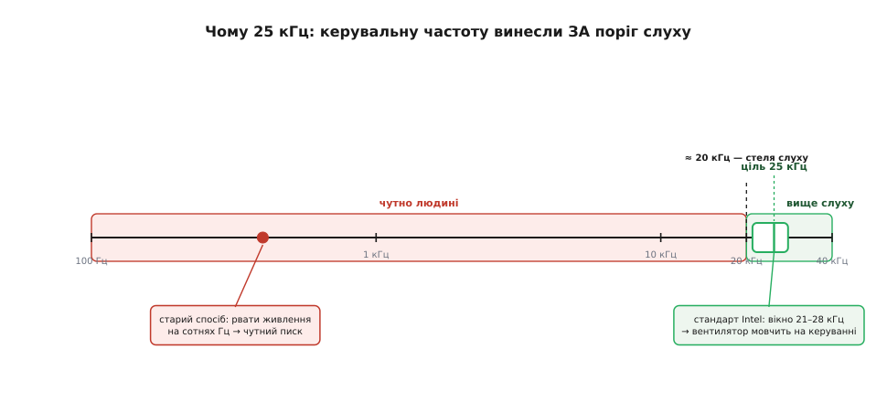
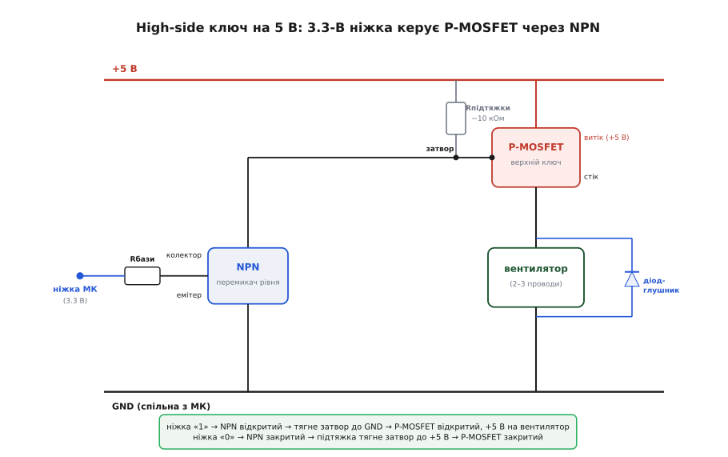

# 📋 Керування 5V-вентилятором у коді: 25-кГц ШІМ, тахометр і ключ

Щоб керувати 5-вольтовим вентилятором із мікроконтролера, треба вміти рівно три конкретні речі: подати на його PWM-вхід сигнал правильної частоти, порахувати оберти з лінії TACH і — якщо вентилятор дво- чи трипровідний — увімкнути йому живлення транзисторним ключем. Кожна з трьох має рівно одну пастку, на якій новачки й спотикаються: ставлять надто повільний ШІМ і слухають писк, губляться на підрахунку обертів, намагаються живити мотор прямо з ніжки й дивуються, чому «дзижчить і не крутиться». Зберімо тут робочі рецепти всіх трьох — генерацію ШІМ, зчитування тахометра й схему ключа, — які можна залити й скористатися, а не перемальовувати чужий приклад.

Домовимося про залізо, щоб приклади були конкретні. Беремо **чотирипровідний 5V-вентилятор** (живлення +5 В, GND, PWM, TACH), а мозок — будь-який: усі три задачі спираються на речі, що є в кожному мікроконтролері (таймер із ШІМ-виходом, вивід, здатний на переривання, підтяжка на вході, а часто й апаратний лічильник імпульсів), і лише **називаються** в кожному середовищі по-своєму. Тому кожен приклад нижче йде вкладками — **Arduino**, **ESP-IDF**, **STM32 HAL** і **рівень регістрів**; суть та сама, різниця тільки в іменах викликів. Обидва кути зору навчальні: готовий периферійний блок показує, як це роблять «дорослі» драйвери, а регістри — що діється під ними.

## Чому не можна просто дефолтним ШІМ

Перша спокуса — керувати швидкістю однією стрічкою: узяти дефолтний ШІМ-хелпер середовища (в Arduino це `analogWrite(pin, duty)`) і задати ним заповнення. Функція є, ШІМ вона видає, вентилятор навіть закрутиться. І одразу засвистить.

Причина — **частота**. Дефолтний ШІМ будь-якого середовища налаштований під світлодіоди, а не під мотор, і живе на кількасот герц: `analogWrite` на Arduino Uno — це близько 490 Гц на більшості виводів (і ~980 Гц на двох), бо функція просто ділить тактову частоту таймера сталим дільником під зручні для світлодіодів значення. Вентиляторний вхід за специфікацією Intel очікує зовсім інше — **близько 25 кГц** (припустимо 21–28 кГц): це число навмисне винесене **вище за поріг людського слуху** (~20 кГц), щоб на частоті керування нічого не свистіло. Подаєте 490 Гц — і мотор із його механікою чесно відпрацьовує вашу «пилку»: котушки перемикаються в такт ШІМ, крильчатка ледь помітно тремтить на цій частоті, а вухо чує це як настирливий тон. Що менше заповнення (тихіший режим), то виразніший писк, бо імпульси стають короткими й «жорсткими».


*Дефолтний `analogWrite` жене сотні герц — глибоко в чутному, звідси писк. Стандарт Intel цілить у вікно 21–28 кГц, вище за стелю слуху ~20 кГц, тому 25-кГц керування вентилятор відпрацьовує безшумно.*

> 🔧 **Навіщо це.** Правило коротке: **керувальний ШІМ вентилятора завжди робіть апаратним таймером на ~25 кГц, а не дефолтним хелпером**. Це не педантизм — це різниця між безшумним приладом і тим, що бісить писком у тиші кімнати. Практичний маркер зіпсованого коду: якщо в прикладі ШІМ на вентилятор подають однорядковим дефолтом (`analogWrite` і його аналоги) і ніде не задають частоту явно — ані регістрами таймера, ані викликом на кшталт `ledcAttach` / `ledc_timer_config` / `HAL_TIM_PWM_Init` — цей код свистітиме, хоч би як гарно виглядав.

Отже, обидва завдання — і генерацію ШІМ, і підрахунок обертів — ми віддаємо **апаратній периферії** контролера, а не крутимо в програмному циклі. Так робить залізо, і воно робить це точно.

## Генерація 25-кГц ШІМ

### Готовим блоком: LEDC на ESP32

В ESP32 за ШІМ відповідає окремий блок **LEDC** (*LED Controller* — його задумували під плавне світіння світлодіодів, але це звичайний налаштовуваний генератор ШІМ, який чудово годиться й для вентилятора). Ви не крутите регістри руками — кажете блоку частоту й розрядність, а він сам жене імпульси на вивід, поки ядро займається чим завгодно.

Тут важлива пастка версій. У **Arduino-ESP32 3.x** (він вийшов на базі ESP-IDF 5.1 і став типовим у 2024–2025 роках) старий триетапний рецепт `ledcSetup` + `ledcAttachPin` **прибрали**; тепер налаштування й прив'язка виводу зведені в один виклик `ledcAttach(pin, frequency, resolution)`, а `ledcWrite(pin, duty)` бере вже сам вивід, а не номер каналу. Старі приклади з мережі під версію 2.x на новому ядрі просто не зберуться. Пишу під 3.x як під поточний стандарт. У чистому ESP-IDF того самого досягають парою `ledc_timer_config` (частота й розрядність) + `ledc_channel_config` (прив'язка до виводу) — імена інші, блок той самий.

Розрядність (`resolution`) — це на скільки сходинок ділиться повний період. Тут криється тонкий зв'язок, який варто зрозуміти, а не завчити: **частота, розрядність і тактова частота лічильника пов'язані**. LEDC тактується від джерела (типово 80 МГц), і для ШІМ частотою *f* із розрядністю *N* бітів лічильник має відлічувати 2ᴺ сходинок за період, тобто потрібна тактова 2ᴺ · *f*. Для 25 кГц:

```
потрібна тактова лічильника = 2ᴺ · f

N = 8 біт:  2⁸ · 25000  = 256 · 25000  =  6 400 000 Гц  = 6.4 МГц   ✓ (80 МГц ділиться легко)
N = 11 біт: 2¹¹ · 25000 = 2048 · 25000 = 51 200 000 Гц  = 51.2 МГц  ✓ (ще влазить під 80 МГц)
N = 12 біт: 2¹² · 25000 = 4096 · 25000 = 102 400 000 Гц = 102.4 МГц ✗ (більше за 80 МГц — не вийде)
```

Висновок простий: на 25 кГц більше ніж **11 біт** розрядності від 80-МГц джерела не витягнути. Для керування вентилятором **8 біт** (256 градацій швидкості) — з головою: людина не розрізнить 256 рівнів обдуву, а число 0…255 зручне. Беремо 8.

:::tabs
```arduino
// esp32-fan-pwm.ino — 25-кГц ШІМ на вивід PWM вентилятора (Arduino-ESP32 3.x)
#include <Arduino.h>

const int   PWM_PIN  = 25;       // будь-який GPIO, здатний на вихід LEDC
const int   PWM_FREQ = 25000;    // 25 кГц — вище за поріг слуху (спец. Intel: 21–28 кГц)
const int   PWM_BITS = 8;        // 8-бітна розрядність → duty 0…255
const int   DUTY_MAX = (1 << PWM_BITS) - 1;   // 255

void fanSetSpeed(uint8_t percent) {           // 0…100 % → duty
  if (percent > 100) percent = 100;
  uint32_t duty = (uint32_t)percent * DUTY_MAX / 100;
  ledcWrite(PWM_PIN, duty);                    // у 3.x аргумент — сам вивід, не канал
}

void setup() {
  // один виклик: налаштувати частоту+розрядність і прив'язати вивід
  ledcAttach(PWM_PIN, PWM_FREQ, PWM_BITS);
  fanSetSpeed(50);                             // старт на 50 %
}

void loop() {
  // повільний «вдих-видих» швидкістю, щоб почути (точніше — НЕ почути) роботу
  for (int p = 20; p <= 100; p += 5) { fanSetSpeed(p); delay(200); }
  for (int p = 100; p >= 20; p -= 5) { fanSetSpeed(p); delay(200); }
}
```
```esp-idf
// Те саме на чистому ESP-IDF 5.x: таймер LEDC задає частоту, канал — вивід
#include "driver/ledc.h"
#include "freertos/FreeRTOS.h"
#include "freertos/task.h"

#define PWM_GPIO   25                     // будь-який GPIO, здатний на вихід LEDC
#define PWM_FREQ   25000                  // 25 кГц — вище за поріг слуху
#define PWM_BITS   LEDC_TIMER_8_BIT       // 8 біт розрядності → duty 0…255
#define DUTY_MAX   255

static void fan_set_speed(uint8_t percent) {      // 0…100 % → duty
    if (percent > 100) percent = 100;
    uint32_t duty = (uint32_t)percent * DUTY_MAX / 100;
    ESP_ERROR_CHECK(ledc_set_duty(LEDC_LOW_SPEED_MODE, LEDC_CHANNEL_0, duty));
    ESP_ERROR_CHECK(ledc_update_duty(LEDC_LOW_SPEED_MODE, LEDC_CHANNEL_0));
}

void app_main(void) {
    ledc_timer_config_t timer = {                 // крок 1: частота й розрядність
        .speed_mode      = LEDC_LOW_SPEED_MODE,
        .duty_resolution = PWM_BITS,
        .timer_num       = LEDC_TIMER_0,
        .freq_hz         = PWM_FREQ,
        .clk_cfg         = LEDC_AUTO_CLK,         // джерело такту вибере драйвер
    };
    ESP_ERROR_CHECK(ledc_timer_config(&timer));

    ledc_channel_config_t chan = {                // крок 2: прив'язка до виводу
        .gpio_num   = PWM_GPIO,
        .speed_mode = LEDC_LOW_SPEED_MODE,
        .channel    = LEDC_CHANNEL_0,
        .intr_type  = LEDC_INTR_DISABLE,
        .timer_sel  = LEDC_TIMER_0,
        .duty       = 0,                          // старт: вентилятор стоїть
        .hpoint     = 0,
    };
    ESP_ERROR_CHECK(ledc_channel_config(&chan));

    while (1) {   // повільний «вдих-видих» швидкістю — щоб НЕ почути роботу
        for (int p = 20; p <= 100; p += 5) { fan_set_speed(p); vTaskDelay(pdMS_TO_TICKS(200)); }
        for (int p = 100; p >= 20; p -= 5) { fan_set_speed(p); vTaskDelay(pdMS_TO_TICKS(200)); }
    }
}
```
```stm32
// Те саме на STM32 HAL: TIM3, канал 1 у режимі PWM, 25 кГц
// Тактова таймера (APB1 timer clock) 84 МГц → 84e6 / 25e3 = 3360 кроків на період
#include "stm32f4xx_hal.h"

#define PWM_TOP  3359                     // 84 МГц / 25 кГц − 1

TIM_HandleTypeDef htim3;

static void fan_set_speed(uint8_t percent) {          // 0…100 %
    if (percent > 100) percent = 100;
    uint32_t duty = (uint32_t)percent * PWM_TOP / 100;
    __HAL_TIM_SET_COMPARE(&htim3, TIM_CHANNEL_1, duty);
}

void fan_pwm_begin(void) {
    __HAL_RCC_TIM3_CLK_ENABLE();
    // вивід у режим альтернативної функції TIM3_CH1 налаштовує HAL_TIM_PWM_MspInit()

    htim3.Instance           = TIM3;
    htim3.Init.Prescaler     = 0;                     // без дільника — повна роздільність
    htim3.Init.CounterMode   = TIM_COUNTERMODE_UP;
    htim3.Init.Period        = PWM_TOP;               // верх лічильника задає частоту
    htim3.Init.ClockDivision = TIM_CLOCKDIVISION_DIV1;
    HAL_TIM_PWM_Init(&htim3);

    TIM_OC_InitTypeDef oc = {0};
    oc.OCMode     = TIM_OCMODE_PWM1;                  // не-інверсний ШІМ
    oc.Pulse      = 0;                                // старт: вентилятор стоїть
    oc.OCPolarity = TIM_OCPOLARITY_HIGH;
    HAL_TIM_PWM_ConfigChannel(&htim3, &oc, TIM_CHANNEL_1);
    HAL_TIM_PWM_Start(&htim3, TIM_CHANNEL_1);
}

int main(void) {
    HAL_Init();
    SystemClock_Config();
    fan_pwm_begin();
    fan_set_speed(50);                                // старт на 50 %

    while (1) {   // повільний «вдих-видих» швидкістю
        for (int p = 20; p <= 100; p += 5) { fan_set_speed(p); HAL_Delay(200); }
        for (int p = 100; p >= 20; p -= 5) { fan_set_speed(p); HAL_Delay(200); }
    }
}
```
:::

Зверніть увагу на `fanSetSpeed`: назовні вона говорить відсотками, а всередину переводить у сирий `duty` 0…255. Це дрібниця, але саме така обгортка рятує подальший код від магічних чисел і плутанини «а це в яких одиницях».

### Таймер вручну: регістри ATmega328 і STM32

Там, де готового однорядкового виклику немає, 25 кГц доводиться народжувати прямо з регістрів таймера — і це корисно побачити один раз, бо це та сама механіка, яку LEDC (чи HAL) ховає всередині. Візьмемо на ATmega328 **Timer1** (16-бітний) у режимі *Fast PWM* із власним верхом лічильника: ми самі задаємо, до якого числа він рахує, — а отже, задаємо період, а отже, частоту. На STM32 роль «верху» грає регістр `ARR`, а заповнення сидить у `CCRx` — назви інші, арифметика буквально та сама.

Ідея така. Таймер тактується від 16 МГц. У режимі Fast PWM із верхом в регістрі `ICR1` лічильник біжить від 0 до `ICR1`, потім скидається — і це один період ШІМ. Щоб дістати 25 кГц без дільника (prescaler = 1):

```
ICR1 = тактова / бажана_частота − 1

ICR1 = 16 000 000 / 25 000 − 1 = 640 − 1 = 639
```

Тобто лічильник рахує 0…639 (640 кроків) за період — і період виходить рівно 1/25000 с. Заповнення тепер задаємо через `OCR1A`: скільки з цих 640 кроків вивід тримається високим. `OCR1A = 0` — завжди низько (стоп), `OCR1A = 639` — завжди високо (повна швидкість), проміжне — пропорційна швидкість.

:::tabs
```arduino
// atmega-fan-pwm.ino — 25-кГц ШІМ через Timer1 (Fast PWM, TOP=ICR1) на пін 9
// Пін 9 = OC1A на ATmega328 (Uno/Nano). Пін 10 (OC1B) можна вести паралельно.
#include <Arduino.h>

const uint16_t PWM_TOP = 639;    // 16 МГц / 25 кГц − 1 → період рівно 25 кГц

void fanPwmBegin() {
  pinMode(9, OUTPUT);
  // Fast PWM, TOP=ICR1 (режим 14): WGM13:12:11:10 = 1110
  // Не-інверсний вихід на OC1A: COM1A1=1
  TCCR1A = _BV(COM1A1) | _BV(WGM11);
  TCCR1B = _BV(WGM13)  | _BV(WGM12) | _BV(CS10);   // CS10 → prescaler = 1
  ICR1  = PWM_TOP;                                  // задає частоту (верх лічильника)
  OCR1A = 0;                                        // старт: вентилятор стоїть
}

void fanSetSpeed(uint8_t percent) {                 // 0…100 %
  if (percent > 100) percent = 100;
  OCR1A = (uint32_t)percent * PWM_TOP / 100;        // заповнення = частка від періоду
}

void setup() { fanPwmBegin(); fanSetSpeed(60); }
void loop()  {}
```
```stm32-ll
// Та сама задача на STM32 без HAL, прямо в регістрах: TIM3_CH1 на виводі PA6.
// Тактова таймера 84 МГц → ARR = 84 000 000 / 25 000 − 1 = 3359.
#include "stm32f4xx.h"

#define PWM_TOP  3359u                        // верх лічильника = період 25 кГц

void fan_pwm_begin(void) {
    RCC->AHB1ENR |= RCC_AHB1ENR_GPIOAEN;      // такт на порт A
    RCC->APB1ENR |= RCC_APB1ENR_TIM3EN;       // такт на TIM3

    GPIOA->MODER  &= ~(3u   << (6 * 2));      // PA6: очистити режим
    GPIOA->MODER  |=  (2u   << (6 * 2));      // 10 = альтернативна функція
    GPIOA->AFR[0] &= ~(0xFu << (6 * 4));
    GPIOA->AFR[0] |=  (2u   << (6 * 4));      // AF2 = TIM3_CH1

    TIM3->PSC   = 0;                          // дільник 1 — рахуємо від 84 МГц
    TIM3->ARR   = PWM_TOP;                    // задає частоту (аналог ICR1)
    TIM3->CCMR1 = (6u << 4) | (1u << 3);      // OC1M=110 (PWM mode 1) + OC1PE
    TIM3->CCER |= (1u << 0);                  // CC1E — вивід каналу 1 увімкнено
    TIM3->CCR1  = 0;                          // старт: вентилятор стоїть (аналог OCR1A)
    TIM3->CR1  |= TIM_CR1_ARPE | TIM_CR1_CEN; // preload ARR і пуск лічильника
}

void fan_set_speed(uint8_t percent) {         // 0…100 %
    if (percent > 100) percent = 100;
    TIM3->CCR1 = (uint32_t)percent * PWM_TOP / 100;   // заповнення = частка періоду
}
```
:::

Дві речі, на яких тут спотикаються, — і обидві не про Arduino, а про залізо взагалі. Перша: **вивід жорстко прив'язаний до таймера** — ШІМ виходить лише з тих ніжок, які розведені на канали саме цього таймера (на ATmega328 Timer1 — це пін 9 = `OC1A` і/або пін 10 = `OC1B`; на STM32 — виводи з альтернативною функцією `TIMx_CHy`), і жоден інший тут не годиться, бо сигнал формує регістр таймера, а не сам пін. Друга: перемкнувши Timer1 у цей режим, ви **збиваєте частоту `analogWrite` на пінах 9 і 10** — якщо на них висіло щось інше через `analogWrite`, воно теж поїде на 25 кГц. Це не поломка, а плата за прямий доступ до заліза: один таймер — один режим на всі його виводи.

## Підрахунок обертів із TACH

Тепер зворотний зв'язок. Вентилятор виводить на TACH прямокутні імпульси, і за стандартом Intel їх **два на повний оберт** (два перемикання давача Холла за оберт). Порахувавши імпульси за відомий час, оберти дістаємо просто:

```
оберти за хвилину = (імпульсів за секунду ÷ 2) × 60

Приклад: за 1 секунду нарахували 80 імпульсів TACH.
    обертів за секунду = 80 ÷ 2 = 40
    RPM = 40 × 60 = 2400 обертів/хв
```

Ділимо на 2 — бо два імпульси на оберт; множимо на 60 — переводимо в хвилини. Ці два множники (÷2, ×60) — уся арифметика тахометра.

Питання лише в тім, **як рахувати імпульси надійно**. Опитувати вивід у циклі (`digitalRead` і ловити зміну) — погана ідея: між читаннями легко проґавити імпульс, а на 2400 об/хв це вже 80 імпульсів за секунду, кожен вужчий за мілісекунду. Тому рахують двома чесними способами: **перериванням по фронту** (працює всюди) або **апаратним лічильником імпульсів** (де він є — найкраще).

### Спосіб 1: переривання по фронту (працює на будь-якому МК)

Ідея: чіпляємо на вивід TACH переривання, яке спрацьовує на кожному фронті сигналу й лише інкрементує лічильник. Раз на секунду головний код знімає накопичене число, множить на два множники — і скидає лічильник на новий інтервал. Переривання коротке (одна дія — `++`), тож воно нічому не заважає.

Один тонкий, але критичний момент: змінну-лічильник, яку чіпає переривання, треба оголосити **`volatile`**, інакше оптимізатор може вирішити, що між читаннями вона не змінюється (він же не бачить, хто її смикає), і закешувати старе значення. А знімати її з головного коду треба **атомарно** — на 8-бітному ATmega читання багатобайтового `long` не миттєве, і переривання може влізти посередині, лишивши вам «півстарого-півнового» числа. Тому на час зчитування переривання коротко глушать.

Усі приклади нижче вмикають на вході **підтяжку** — і це не дрібниця, а необхідність. Тахо-вихід вентилятора — це [вихід із відкритим колектором](root:hw-digital/open-drain-bus-pullup-sizing): він уміє лише притягувати лінію до землі, а «плюс» на ній має тримати підтяжка. Немає підтяжки (зовнішньої чи ввімкненої внутрішньої) — переривання не спрацює жодного разу, бо на лінії не буде фронтів, самі нулі. Внутрішня підтяжка є майже скрізь, просто зветься по-різному: `INPUT_PULLUP` в Arduino, `pull_up_en` у конфізі `gpio_config` в ESP-IDF, `GPIO_PULLUP` у полі `Pull` в STM32 HAL.

Код скрізь однаковий за суттю — лічильник у ISR і зняття накопиченого раз на секунду, — а відрізняється лише дрібницями платформи: як зветься реєстрація обробника й чим глушать переривання на час атомарного зчитування. Ось та сама програма чотирма способами:

:::tabs
```arduino
// ESP32: підрахунок обертів через переривання по фронту
#include <Arduino.h>

const int TACH_PIN = 27;                 // вхід із зовнішньою або внутрішньою підтяжкою
volatile uint32_t tachEdges = 0;         // лічильник фронтів — його чіпає ISR

void IRAM_ATTR onTachEdge() {            // ISR має жити в IRAM на ESP32
  tachEdges++;                           // тільки інкремент — нічого важкого в ISR
}

void setup() {
  Serial.begin(115200);
  pinMode(TACH_PIN, INPUT_PULLUP);       // підтяжка до 3.3 В — тахо це відкритий колектор
  attachInterrupt(digitalPinToInterrupt(TACH_PIN), onTachEdge, RISING);  // фронт
}

uint32_t lastMs = 0;
void loop() {
  uint32_t now = millis();
  if (now - lastMs >= 1000) {            // раз на секунду
    lastMs = now;
    noInterrupts();                      // атомарно зняти й скинути
    uint32_t edges = tachEdges;
    tachEdges = 0;
    interrupts();

    uint32_t rpm = (edges / 2) * 60;     // ÷2 (2 імпульси/оберт) ×60 (у хвилини)
    Serial.printf("TACH: %u імп/с  →  %u об/хв\n", edges, rpm);
  }
}
```
```arduino
// ATmega328 (Uno/Nano): підрахунок обертів через переривання по фронту
#include <Arduino.h>
#include <util/atomic.h>                 // ATOMIC_BLOCK — атомарне зчитування long

const uint8_t TACH_PIN = 2;              // пін 2 або 3 — апаратні переривання ATmega328
volatile uint32_t tachEdges = 0;

void onTachEdge() { tachEdges++; }       // ISR: тільки інкремент

void setup() {
  Serial.begin(115200);
  pinMode(TACH_PIN, INPUT_PULLUP);       // внутрішня підтяжка ~30 кОм до +5 В
  attachInterrupt(digitalPinToInterrupt(TACH_PIN), onTachEdge, RISING);
}

uint32_t lastMs = 0;
void loop() {
  uint32_t now = millis();
  if (now - lastMs >= 1000) {
    lastMs = now;
    uint32_t edges;
    ATOMIC_BLOCK(ATOMIC_RESTORESTATE) {  // читання 4-байтового long без розриву ISR
      edges = tachEdges;
      tachEdges = 0;
    }
    uint32_t rpm = (edges / 2UL) * 60UL; // ÷2 ×60
    Serial.print(F("TACH: ")); Serial.print(edges);
    Serial.print(F(" імп/с  ->  ")); Serial.print(rpm); Serial.println(F(" об/хв"));
  }
}
```
```esp-idf
// ESP-IDF 5.x: підрахунок обертів через GPIO-переривання
#include <inttypes.h>
#include "driver/gpio.h"
#include "esp_log.h"
#include "freertos/FreeRTOS.h"
#include "freertos/task.h"

#define TACH_GPIO  GPIO_NUM_27
static const char *TAG = "fan";

static volatile uint32_t tach_edges = 0;     // лічильник фронтів — його чіпає ISR
static portMUX_TYPE tach_mux = portMUX_INITIALIZER_UNLOCKED;

static void IRAM_ATTR tach_isr(void *arg) {  // ISR має жити в IRAM
    tach_edges++;                            // тільки інкремент — нічого важкого в ISR
}

void app_main(void) {
    gpio_config_t io = {
        .pin_bit_mask = 1ULL << TACH_GPIO,
        .mode         = GPIO_MODE_INPUT,
        .pull_up_en   = GPIO_PULLUP_ENABLE,      // тахо це відкритий колектор
        .pull_down_en = GPIO_PULLDOWN_DISABLE,
        .intr_type    = GPIO_INTR_POSEDGE,       // висхідний фронт
    };
    ESP_ERROR_CHECK(gpio_config(&io));
    ESP_ERROR_CHECK(gpio_install_isr_service(0));
    ESP_ERROR_CHECK(gpio_isr_handler_add(TACH_GPIO, tach_isr, NULL));

    while (1) {
        vTaskDelay(pdMS_TO_TICKS(1000));         // раз на секунду
        portENTER_CRITICAL(&tach_mux);           // атомарно зняти й скинути
        uint32_t edges = tach_edges;
        tach_edges = 0;
        portEXIT_CRITICAL(&tach_mux);

        uint32_t rpm = (edges / 2) * 60;         // ÷2 (2 імпульси/оберт) ×60
        ESP_LOGI(TAG, "TACH: %" PRIu32 " імп/с  ->  %" PRIu32 " об/хв", edges, rpm);
    }
}
```
```stm32
// STM32 HAL: підрахунок обертів через зовнішнє переривання EXTI на виводі PB7
#include "stm32f4xx_hal.h"
#include <stdio.h>

#define TACH_PIN   GPIO_PIN_7
#define TACH_PORT  GPIOB

volatile uint32_t tachEdges = 0;             // лічильник фронтів — його чіпає ISR

void EXTI9_5_IRQHandler(void) {              // лінії EXTI5…9 сидять на одному векторі
    HAL_GPIO_EXTI_IRQHandler(TACH_PIN);
}

void HAL_GPIO_EXTI_Callback(uint16_t pin) {  // спільний колбек усіх ліній EXTI
    if (pin == TACH_PIN) tachEdges++;        // тільки інкремент
}

void tach_begin(void) {
    __HAL_RCC_GPIOB_CLK_ENABLE();
    GPIO_InitTypeDef g = {0};
    g.Pin  = TACH_PIN;
    g.Mode = GPIO_MODE_IT_RISING;            // переривання на висхідному фронті
    g.Pull = GPIO_PULLUP;                    // підтяжка — тахо це відкритий колектор
    HAL_GPIO_Init(TACH_PORT, &g);
    HAL_NVIC_SetPriority(EXTI9_5_IRQn, 5, 0);
    HAL_NVIC_EnableIRQ(EXTI9_5_IRQn);
}

int main(void) {
    HAL_Init();
    SystemClock_Config();
    tach_begin();

    uint32_t lastMs = 0;
    while (1) {
        uint32_t now = HAL_GetTick();
        if (now - lastMs >= 1000) {           // раз на секунду
            lastMs = now;
            __disable_irq();                  // атомарно зняти й скинути
            uint32_t edges = tachEdges;
            tachEdges = 0;
            __enable_irq();

            uint32_t rpm = (edges / 2) * 60;  // ÷2 ×60
            printf("TACH: %lu імп/с  ->  %lu об/хв\r\n",
                   (unsigned long)edges, (unsigned long)rpm);
        }
    }
}
```
:::

Цей спосіб працює всюди й точний, поки переривань небагато. Але в нього є прихована ціна: на кожен імпульс процесор відволікається на ISR. Один вентилятор на 80 імпульсів за секунду — дрібниця. А от кілька вентиляторів на швидких обертах, та ще й з іншими перериваннями поруч (наприклад, приймання даних), і ці відволікання починають накопичуватися. Тут і виграє апаратний лічильник.

### Спосіб 2: апаратний лічильник імпульсів (PCNT на ESP32, таймер на STM32)

Майже в кожному МК є вузол, який рахує зовнішні фронти **сам, без участі процесора**: в ESP32 це окремий блок **PCNT** (*Pulse Counter*), у STM32 — звичайний таймер, перемкнутий на **зовнішнє тактування** (кожен фронт на вході — крок лічильника), в ATmega — той-таки Timer1 із джерелом такту `T1`. Ви один раз його налаштували, а далі раз на секунду просто зчитуєте накопичене число. Процесор при цьому не смикається жодного разу — навіть якби імпульсів було мільйон за секунду. Розберімо це на PCNT, бо він найбагатослівніший і тому найзрозуміліший.

Тут теж є пастка версій, дзеркальна до LEDC. Старий драйвер (`driver/pcnt.h` з викликами `pcnt_unit_config`, `pcnt_get_counter_value`) у ESP-IDF 5.x оголошений застарілим; сучасний — **`driver/pulse_cnt.h`** із моделлю «створи юніт → створи канал → задай дію на фронт». Він багатослівніший, зате чесно віддає, що коїться: юніт — це лічильник із межами, канал — прив'язка до конкретного виводу й правило «що робити на фронті».

Логіка налаштування читається згори вниз:

- **`pcnt_new_unit`** створює лічильник; у конфізі задають межі `high_limit`/`low_limit` (лічильник 16-бітний, тож стеля — 32767; для секундного інтервалу вентилятора цього з запасом).
- **`pcnt_new_channel`** прив'язує лічильник до виводу через поле `edge_gpio_num` — саме на цьому виводі блок стежитиме за фронтами.
- **`pcnt_channel_set_edge_action`** каже, що робити: на висхідному фронті — рахувати (`INCREASE`), на низхідному — не чіпати (`HOLD`). Так один імпульс дає рівно +1.
- **`pcnt_unit_set_glitch_filter`** відсіює короткі голки коротші за задане `max_glitch_ns` — рятує від хибних спрацювань на брудному сигналі (тахо-лінія відкритого колектора без гарної підтяжки любить дзвеніти).
- **`pcnt_unit_enable` → `pcnt_unit_clear_count` → `pcnt_unit_start`** — увімкнути, обнулити, запустити.

Далі раз на секунду: `pcnt_unit_get_count` дає накопичене число, ми переводимо його в RPM і `pcnt_unit_clear_count` скидаємо на новий інтервал.

:::tabs
```arduino
// esp32-fan-tach-pcnt.ino — оберти через апаратний лічильник PCNT (ESP-IDF 5.x driver)
#include <Arduino.h>
#include "driver/pulse_cnt.h"

const int TACH_PIN = 27;
pcnt_unit_handle_t    unit = nullptr;    // дескриптор лічильника
pcnt_channel_handle_t chan = nullptr;    // дескриптор каналу

void tachPcntBegin() {
  // 1. Юніт-лічильник із межами (16-бітний: −32768…32767)
  pcnt_unit_config_t unit_cfg = {
    .low_limit  = -1,                    // мінімум трохи нижче нуля (вимога API)
    .high_limit =  32767,                // стеля 16-бітного лічильника
  };
  pcnt_new_unit(&unit_cfg, &unit);

  // 2. Канал: стежити за фронтами саме на виводі TACH
  pcnt_chan_config_t chan_cfg = {
    .edge_gpio_num  = TACH_PIN,          // тут блок лічить фронти
    .level_gpio_num = -1,                // рівень-керування не потрібне
  };
  pcnt_new_channel(unit, &chan_cfg, &chan);

  // 3. На висхідному фронті — +1, на низхідному — нічого (один імпульс = +1)
  pcnt_channel_set_edge_action(chan,
      PCNT_CHANNEL_EDGE_ACTION_INCREASE,     // висхідний фронт
      PCNT_CHANNEL_EDGE_ACTION_HOLD);        // низхідний фронт

  // 4. Фільтр голок: усе коротше за 1 мкс — шум, ігноруємо
  pcnt_glitch_filter_config_t filt = { .max_glitch_ns = 1000 };
  pcnt_unit_set_glitch_filter(unit, &filt);

  // 5. Увімкнути → обнулити → запустити
  pcnt_unit_enable(unit);
  pcnt_unit_clear_count(unit);
  pcnt_unit_start(unit);
}

void setup() {
  Serial.begin(115200);
  pinMode(TACH_PIN, INPUT_PULLUP);       // підтяжка все одно потрібна — сигнал OC
  tachPcntBegin();
}

uint32_t lastMs = 0;
void loop() {
  uint32_t now = millis();
  if (now - lastMs >= 1000) {            // вимірюємо рівно за секунду
    lastMs = now;
    int count = 0;
    pcnt_unit_get_count(unit, &count);   // залізо вже все порахувало
    pcnt_unit_clear_count(unit);         // скид на новий інтервал

    uint32_t rpm = (count / 2) * 60;     // ÷2 ×60
    Serial.printf("TACH: %d імп/с  ->  %u об/хв\n", count, rpm);
  }
}
```
```esp-idf
// ESP-IDF 5.x: те саме без обгортки Arduino
#include <inttypes.h>
#include "driver/gpio.h"
#include "driver/pulse_cnt.h"
#include "esp_log.h"
#include "freertos/FreeRTOS.h"
#include "freertos/task.h"

#define TACH_GPIO  27
static const char *TAG = "fan";

void app_main(void) {
    gpio_set_pull_mode(TACH_GPIO, GPIO_PULLUP_ONLY);   // сигнал OC — підтяжка обов'язкова

    // 1. Юніт-лічильник із межами (16-бітний: −32768…32767)
    pcnt_unit_config_t unit_cfg = {
        .low_limit  = -1,
        .high_limit = 32767,
    };
    pcnt_unit_handle_t unit = NULL;
    ESP_ERROR_CHECK(pcnt_new_unit(&unit_cfg, &unit));

    // 2. Канал: стежити за фронтами саме на виводі TACH
    pcnt_chan_config_t chan_cfg = {
        .edge_gpio_num  = TACH_GPIO,
        .level_gpio_num = -1,                          // рівень-керування не потрібне
    };
    pcnt_channel_handle_t chan = NULL;
    ESP_ERROR_CHECK(pcnt_new_channel(unit, &chan_cfg, &chan));

    // 3. Висхідний фронт — +1, низхідний — нічого (один імпульс = +1)
    ESP_ERROR_CHECK(pcnt_channel_set_edge_action(chan,
        PCNT_CHANNEL_EDGE_ACTION_INCREASE,
        PCNT_CHANNEL_EDGE_ACTION_HOLD));

    // 4. Фільтр голок: усе коротше за 1 мкс — шум, ігноруємо
    pcnt_glitch_filter_config_t filt = { .max_glitch_ns = 1000 };
    ESP_ERROR_CHECK(pcnt_unit_set_glitch_filter(unit, &filt));

    // 5. Увімкнути → обнулити → запустити
    ESP_ERROR_CHECK(pcnt_unit_enable(unit));
    ESP_ERROR_CHECK(pcnt_unit_clear_count(unit));
    ESP_ERROR_CHECK(pcnt_unit_start(unit));

    while (1) {
        vTaskDelay(pdMS_TO_TICKS(1000));               // вимірюємо рівно за секунду
        int count = 0;
        ESP_ERROR_CHECK(pcnt_unit_get_count(unit, &count));   // залізо вже все порахувало
        ESP_ERROR_CHECK(pcnt_unit_clear_count(unit));         // скид на новий інтервал

        uint32_t rpm = (count / 2) * 60;                      // ÷2 ×60
        ESP_LOGI(TAG, "TACH: %d імп/с  ->  %" PRIu32 " об/хв", count, rpm);
    }
}
```
```stm32
// STM32 HAL: PCNT-а тут немає, зате є таймер у режимі зовнішнього тактування —
// кожен фронт на вході TI1 крутить лічильник TIM2. Процесор лише знімає результат.
#include "stm32f4xx_hal.h"
#include <stdio.h>

TIM_HandleTypeDef htim2;                     // TIM2_CH1 = PA0, сюди заходить TACH

void tach_counter_begin(void) {
    __HAL_RCC_GPIOA_CLK_ENABLE();
    GPIO_InitTypeDef g = {0};
    g.Pin       = GPIO_PIN_0;
    g.Mode      = GPIO_MODE_AF_PP;
    g.Pull      = GPIO_PULLUP;               // підтяжка — сигнал OC
    g.Alternate = GPIO_AF1_TIM2;             // PA0 → вхід TIM2_CH1
    HAL_GPIO_Init(GPIOA, &g);
    __HAL_RCC_TIM2_CLK_ENABLE();

    htim2.Instance         = TIM2;
    htim2.Init.Prescaler   = 0;
    htim2.Init.CounterMode = TIM_COUNTERMODE_UP;
    htim2.Init.Period      = 0xFFFFFFFF;     // TIM2 32-бітний — стелі тут не досягти
    HAL_TIM_Base_Init(&htim2);

    TIM_ClockConfigTypeDef clk = {0};
    clk.ClockSource    = TIM_CLOCKSOURCE_TI1;        // тактувати лічильник самим входом
    clk.ClockPolarity  = TIM_CLOCKPOLARITY_RISING;   // рахувати висхідні фронти
    clk.ClockPrescaler = TIM_CLOCKPRESCALER_DIV1;
    clk.ClockFilter    = 8;                          // цифровий фільтр — аналог glitch-фільтра
    HAL_TIM_ConfigClockSource(&htim2, &clk);

    HAL_TIM_Base_Start(&htim2);              // пуск: далі рахує саме залізо
}

int main(void) {
    HAL_Init();
    SystemClock_Config();
    tach_counter_begin();

    uint32_t lastMs = 0;
    while (1) {
        uint32_t now = HAL_GetTick();
        if (now - lastMs >= 1000) {                        // вимірюємо рівно за секунду
            lastMs = now;
            uint32_t count = __HAL_TIM_GET_COUNTER(&htim2);
            __HAL_TIM_SET_COUNTER(&htim2, 0);              // скид на новий інтервал

            uint32_t rpm = (count / 2) * 60;               // ÷2 ×60
            printf("TACH: %lu імп/с  ->  %lu об/хв\r\n",
                   (unsigned long)count, (unsigned long)rpm);
        }
    }
}
```
:::

Порівняйте два способи не за рядками коду, а за тим, **хто робить роботу**. У способі з перериванням її робить процесор — на кожен імпульс він кидає все й біжить у ISR; це універсально, але кожен імпульс коштує тактів. У способі з PCNT роботу робить залізо, а процесор лише раз на секунду забирає результат — це майже безкоштовно для ядра, але залежить від того, чи є в конкретному МК такий вузол і чи вільний він (PCNT на ESP32, зайнятий під це таймер на STM32 — а в дрібних контролерах може не бути нічого). Для одного вентилятора різниці ви не помітите; для системи, де кожен такт на рахунку, PCNT — правильний вибір.

## Живлення й ключ: high-side для 3-провідного

З чотирипровідним вентилятором усе просто: живлення +5 В подане постійно, а ШІМ іде окремою тонкою лінією керування. Мороки з ключем немає. А от коли вентилятор **дво- чи трипровідний**, а вам треба вмикати-вимикати живлення з коду (чи регулювати швидкість рванням живлення в трипровідного), доводиться ставити транзистор-ключ — і тут ховається найтонше місце.

Здоровий глузд підказує **нижній ключ** (*low-side*): транзистор між вентилятором і землею, керований прямо з ніжки — керувати ним найлегше, бо його затвор відлічується від тієї самої землі, що й мікроконтролер. Але для трипровідного вентилятора з тахометром це помилка: у кожну паузу ШІМ земля вентилятора **відривається** від землі плати, а разом із нею повисає й тахо-вихід (його рівні відлічуються від тієї самої землі). Тахометр починає брехати. Лікується це перенесенням ключа **нагору** — між плюс і вентилятор (*high-side*): тоді земля вентилятора завжди прибита до землі плати, і тахометр читається чисто.

Верхній ключ на 5-вольтовій шині роблять **P-канальним MOSFET**, і тут вилазить пастка рівнів. P-канальний ключ **відкривається**, коли його затвор притягнуто **нижче** витоку (а витік сидить на +5 В), і **закривається**, коли затвор підтягнутий до тих самих +5 В. Проблема: ніжка 3.3-вольтового мікроконтролера **не може підняти затвор до 5 В**, щоб надійно закрити ключ, — вона тягне щонайбільше до 3.3 В, а між затвором (3.3 В) і витоком (5 В) лишається ~1.7 В, чого часто досить, щоб ключ прочинявся й підтікав. Тому 3.3-вольтовим мікроконтролером P-канальний верхній ключ ганяють **не напряму, а через маленький нижній транзистор-перемикач рівня** (звичайний NPN чи n-канальний MOSFET): ніжка керує цим малюком, а він уже перекидає затвор P-канального між +5 В і землею на всю амплітуду.


*Ніжка через базовий резистор відкриває NPN; відкритий NPN притягує затвор P-MOSFET до землі — і той відкривається, подаючи +5 В на вентилятор. Ніжка в нулі — NPN закритий, підтяжка тягне затвор до +5 В, ключ закривається. Так повна амплітуда 0…5 В на затворі керується 3.3-вольтовою ніжкою; діод-глушник паралельно вентилятору гасить кидок при вимиканні.*

І ще одне, про що забувають майже всі, хто вмикає мотор зовнішнім ключем: **кидок напруги при вимиканні**. Котушки вентилятора — це індуктивність, а індуктивність при різкому знеструмленні викидає стрибок напруги протилежної полярності ([кидок напруги від індуктивності](root:hw-components/inductor-kickback) — енергія магнітного поля мусить кудись подітися, і без шляху вона зривається сплеском на десятки вольтів), який може пробити ключ. Тому паралельно вентилятору (між його плюсом і землею) ставлять **діод-глушник** (шунтувальний, *flyback*): у нормі він закритий і не заважає, а в мить вимикання приймає цей стрибок на себе й гасить його. Забути діод — значить поволі вбивати транзистор кожним вимиканням.

> 🔧 **Навіщо це.** Практичний висновок для всіх трьох випадків. **Чотири проводи** — не морочтеся з ключем узагалі: живлення постійне, керуйте лінією PWM. **Три проводи з тахометром** — тільки верхній (*high-side*) ключ, інакше поламаєте тахометр; на 3.3-вольтовому МК — через транзистор-перемикач рівня. **Будь-який ключ на моторі** — обов'язково діод-глушник паралельно вентилятору. Пропустите будь-що з цього — дістанете або брехливий тахометр, або поволі згораючий ключ.

Ці три рецепти — генерація ШІМ, підрахунок обертів і ключ — і є все, що потрібне, щоб керувати вентилятором із коду. Як зібрати з них закінчену корисну річ — **тихе охолодження, що само підганяє швидкість під температуру й стереже, чи вентилятор живий**, — показано окремим прикладом: [термокероване охолодження вентилятором](root:cat-hw-actuators/fan-5v/proj-fan-control.md).

## Пастки, на яких горять найчастіше

Зберемо всі граблі в одному місці — кожна коштувала комусь вечора, і кожна обходиться однією думкою.

**Живити мотор із ніжки мікроконтролера.** Найдорожча помилка. Ніжка дає лічені міліампери, вентилятор на старті хоче на порядок більше (поштовховий струм рушання вищий за робочий). Живлення — **тільки** з повноцінної шини 5 В; ніжка — лише **сигнал** (PWM-лінія чи керування ключем). Хочете вмикати живлення з коду — ставте транзистор-ключ, а не вішайте вентилятор на ніжку.

**Дефолтний ШІМ-хелпер на керувальний вхід.** Кількасот герц замість 25 кГц — і вентилятор свистить. Завжди апаратний таймер із явно заданою частотою ~25 кГц: LEDC на ESP32, Timer1 на ATmega, `TIMx` у режимі PWM на STM32.

**Забути підтяжку на TACH.** Тахо-вихід — це відкритий колектор: він уміє тільки притягувати лінію до землі, а «плюс» має дати підтяжка. Немає підтяжки (зовнішньої чи ввімкненої внутрішньої — `INPUT_PULLUP`, `pull_up_en`, `GPIO_PULLUP`, як її не звати у вашому середовищі) — на вході незмінна тиша, і код бачить нуль обертів на цілком живому вентиляторі. Це не поломка, а брак одного резистора.

**Плутати рівні тахо-сигналу.** П'ятивольтовий вентилятор може віддавати тахо-імпульси амплітудою до **5 В**. Завести таку лінію напряму на вивід 3.3-вольтового мікроконтролера, [не толерантний до 5 В](root:hw-digital/logic-levels-as-ranges) (тобто вхід, чия стеля — 3.3 В, а не 5 В), — шлях убити ніжку. Якщо тахо підтягнуте до +5 В, а МК 3.3-вольтовий і не 5V-tolerant — підтягуйте тахо до **+3.3 В** (відкритому колектору байдуже, до якого плюса його тягнуть — він же тільки замикає на землю) або ставте дільник/перемикач рівня.

**Опитувати TACH у циклі замість переривання/лічильника.** `digitalRead` у `loop` легко проґавить вузький імпульс, і оберти вийдуть заниженими. Рахуйте перериванням по фронту або апаратним лічильником — не опитуванням.

**Забути `volatile` на лічильнику ISR** (спосіб із перериванням). Без `volatile` оптимізатор закешує змінну, і головний код читатиме старе значення, наче обертів нема. І знімайте лічильник **атомарно** — інакше на 8-бітному МК зловите напівоновлене число.

**Нижній ключ під трипровідний вентилятор із тахометром.** Ключ між вентилятором і землею відв'язує землю вентилятора в паузах ШІМ, і тахометр повисає. Верхній (*high-side*) ключ — і земля завжди на місці.

**Ключ на моторі без діода-глушника.** Кидок напруги від індуктивності котушок при вимиканні поволі вбиває транзистор. Діод паралельно вентилятору обов'язковий, якщо живлення рветься ключем.

Кожна з цих пасток зникає, щойно тримати в голові природу пристрою: вентилятор — це самодостатній мотор із власним драйвером, якому треба **чисте живлення достатнього струму** (звідси — шина, а не ніжка, і ключ, а не пряме підключення), керувати ним слід **його ж мовою** (25-кГц ШІМ на PWM-вхід, а не рване живлення), а тахо-вихід — це слабенький **відкритий колектор**, якому потрібна підтяжка й акуратність із рівнями. Три думки — і вентилятор перетворюється з примхливого «квадратика з дротами» на слухняний вузол, яким код керує впевнено й точно.
