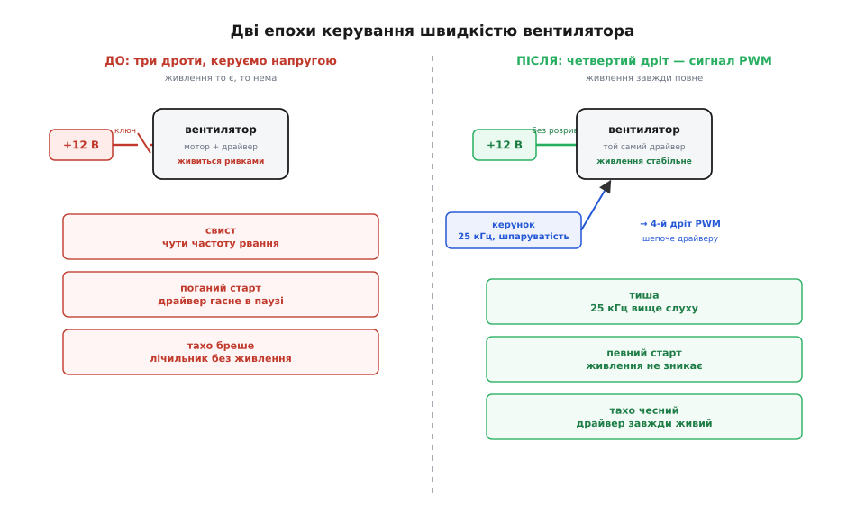

# 📜 Звідки взявся четвертий дріт: історія PWM-стандарту вентиляторів

Уявіть інженерів Intel десь на початку 2004 року. На столі лежить свіжий Pentium 4 ядра Prescott — процесор, що мав розганятися до небачених частот, а натомість перетворився на грубку: під навантаженням він жер під сотню ватів і гарячів свою кришку так, що штатний вентилятор мусив крутитися на чотири-пʼять тисяч обертів, аби втримати кристал у безпеці. А чотири тисячі обертів маленького вентилятора — це виск, від якого хочеться вимкнути комп'ютер. Користувачі скаржилися, оглядачі глузували, а Intel відбивалася, кивала на виробників корпусів і навіть склала «список термічно вивірених корпусів». Проблема була не в корпусах. Проблема була в тому, що **вентилятор не вмів крутитися тихо тоді, коли можна тихо, і швидко лише тоді, коли справді треба**.

Здавалося б, дрібниця: зроби так, щоб вентилятор шумів лише під навантаженням. Але за цією дрібницею ховалася ціла інженерна пастка, і щоб її розплутати, Intel довелося в липні 2004 року видати окрему специфікацію та фактично **додати вентилятору четвертий дріт**. Ця стаття — про те, чому трьох дротів забракло, звідки взялося магічне число 25 кілогерц, чому тахометр дає рівно два імпульси на оберт, і як маленький синій провідник тихо витіснив грубе рвання живлення з усіх комп'ютерів світу.

## Чому напругою керувати виявилося недостатньо

До 2004-го керований вентилятор мав три дроти: плюс, землю й тахо-вихід. Швидкість регулювали **єдиним доступним важелем — напругою живлення**. Хочеш тихіше — дай вентилятору не 12 вольтів, а вісім чи п'ять; менша напруга, менша потужність, повільніші оберти. Просто, зрозуміло і... по-справжньому погано з трьох різних боків одразу.

Найперша й найгрубіша біда — **як саме занизити напругу**. Найдешевший спосіб — лінійний стабілізатор: транзистор, що працює як керований резистор і «з'їдає» зайві вольти. Але з'їдені вольти не зникають — вони перетворюються на тепло **прямо на цьому транзисторі**. Виходить знущання: пристрій, чия єдина робота — виганяти тепло, вимагає, щоб десь поруч інша деталь це тепло виробляла. Що дужче ви хочете пригальмувати вентилятор, то більше вольтів треба спалити, то гарячіший стабілізатор. Це марнотратно за самою суттю.

Природна відповідь інженера — **не спалювати напругу лінійно, а рвати живлення ключем**. Замість того щоб тримати транзистор напіввідкритим і гріти його, вмикаймо його то повністю, то повністю вимикаймо, дуже часто. Транзистор-ключ у повністю відкритому стані майже не гріється (падіння напруги на ньому крихітне), у закритому не проводить струму взагалі — втрати мізерні в обох станах. Керуючи **часткою часу «ввімкнено»** (шпаруватість, англ. duty cycle), задаємо середню потужність. Це і є [широтно-імпульсна модуляція](root:hw-analog/pwm) — ШІМ. Ефективно, не гріється. Але тут інженери 2004 року вдарилися об **другу стіну**.

Річ у тім, що всередині вентилятора живе не проста котушка, а [безколекторний мотор](root:cat-hw-actuators/bldc-motor-module) із власною електронікою — драйвером, який сам вирішує, коли перемикати струм у котушках. Цій електроніці потрібне **живлення без розривів**. Коли ви рвете саме лінію живлення повільним ШІМ — скажімо, на частоті кількасот герц, — драйвер у кожну паузу знеструмлюється, «помирає», а на наступному імпульсі мусить прокинутися заново. Мотор смикається, гуде на частоті вашого рвання, а на низькій шпаруватості може взагалі не зрушити з місця. Замість тихого шелесту дістаєте деренчання.

І тут-таки чекає **третя стіна, найпідступніша: тахометр**. Трипровідний вентилятор пишався тим, що вміє повідомляти свої оберти. Але тахо-вихід — це [відкритий колектор](root:hw-digital/open-drain-bus-pullup-sizing), і рівні свого сигналу він відлічує від власної землі та власного живлення. Коли ви рвете живлення нижнім ключем — між вентилятором і землею плати, — у кожну паузу «земля» вентилятора відв'язується, і тахо-сигнал повисає в невизначеності. Драйвер, поки знеструмлений, взагалі нічого не рахує. Виходить зачароване коло: **ви хочете керувати вентилятором тихо й водночас знати його оберти, а рвання живлення ламає і те, і те**.


*Уся суть переходу 2004 року в одній картинці. Керувати напругою означає чіпати живлення — а живлення драйверу й тахометру потрібне ціле. Керувати окремим дротом означає лишити живлення в спокої.*

Можна було боротися: переносити ключ нагору (між плюс і вентилятор), тоді земля лишається на місці й тахометр читається. Можна було піднімати частоту рвання. Але кожен такий рятунок вимагав розумнішої схеми **зовні**, на материнській платі, для кожного вентилятора окремо. Intel зробила інакше й розумніше: **а що, як розумну частину лишити там, де їй місце — усередині вентилятора, — а назовні винести лише тонесеньку команду?**

## Ідея, до якої дійшли: винести керунок в окремий дріт

Осяяння було простим до геніальності. Живлення вентилятора **не треба чіпати взагалі**. Хай на плюс і землю завжди йдуть повні 12 вольтів — драйверу добре, тахометру добре, старт надійний. А швидкість задаваймо **окремим, п'ятивольтовим логічним сигналом по четвертому дроту**. Цей сигнал нічого не живить — він лише *каже* внутрішньому драйверу: «крутися на стільки-то відсотків». Драйвер, який і так уже вміє вмикати-вимикати котушки в потрібний такт, тепер додатково слухає цю команду й сам, усередині, дозує потужність — швидко, чисто, не втрачаючи ні живлення, ні тахо-сигналу.

Це переносить весь бруд ШІМ **із силової лінії на сигнальну**. Зовні на четвертому дроті — слабенький логічний писк, який нічого не гріє й нікуди не пропадає. Усередині — драйвер, спеціально спроєктований, щоб цей писк почути й перетворити на плавну швидкість. Материнській платі більше не треба ні лінійного стабілізатора, ні хитрого верхнього ключа, ні окремої схеми на кожен вентилятор: вона просто виставляє шпаруватість на одній ніжці.

Саме це Intel і закріпила в документі **«4-Wire Pulse Width Modulation (PWM) Controlled Fans Specification»**, ревізія 1.2, датована липнем 2004 року; уточнену ревізію 1.3 випустили у вересні 2005-го. Специфікація описала розкладку роз'єму так, щоб він лишався сумісним зі старими трипровідними гніздами:

```
Контакт   Призначення           Типовий колір
─────────────────────────────────────────────────
   1      GND (земля)           чорний
   2      +12 В (живлення)      жовтий
   3      SENSE (тахо-вихід)    зелений
   4      CONTROL (PWM-вхід)    синій
```

Хитрість розкладки в тім, що перші три контакти **збігаються** зі старим трипровідним роз'ємом. Увіткнеш чотирипровідний вентилятор у старе трипровідне гніздо — він працюватиме на повну (четвертий контакт просто нема куди), а тахометр читатиметься. І навпаки, старий трипровідний вентилятор у новому чотириконтактному гнізді житиме, лише керуватиметься по-старому, напругою. Зворотна сумісність була однією з умов, і саме тому стандарт прижився миттєво: він нічого не ламав.

> 🔧 **Навіщо це.** Головна причина, чому чотирипровідний вентилятор кращий за будь-яке рвання живлення, — не «більше дротів = краще», а конкретна інженерна перемога: **живлення й керунок розведено**. Живлення завжди повне — драйвер і тахометр цілі; швидкість несе окремий слабкий сигнал — його не шкода й не страшно рвати як завгодно часто. Знаючи це, ви ніколи не переплутаєте, куди подавати ШІМ: не на живлення (там йому не місце й ніколи не було), а на четвертий дріт.

## Звідки взялося число 25 кілогерц

Тепер найтонше питання специфікації: **на якій частоті має пищати керувальний сигнал?** Intel зафіксувала: цільова частота — **25 кГц**, допустимий діапазон від 21 до 28 кГц (тобто 25 кГц ±10%). Число не з неба. У ньому зашита боротьба одразу з двома небезпеками, які тиснуть із протилежних боків.

Знизу частоту підпирає **людський слух**. Вухо чує приблизно до 20 кГц (у молодих — трохи вище, з віком менше). Будь-яке періодичне вмикання-вимикання, що потрапляє в цей діапазон, ми чуємо як тон, писк або гудіння. Мотор вентилятора — це котушки, і коли струм у них пульсує на, скажімо, п'яти чи десяти кілогерцах, вони буквально співають на цій частоті: магнітострикція й механічні вібрації перетворюють електричну пульсацію на звук. Тому першим ділом частоту треба **винести за верхню межу чутного** — вище 20 кГц. Тоді пульсація нікуди не дінеться фізично, але ми її просто не почуємо.

Здавалося б — то женіть її ще вище, сто кілогерц, мегагерц, чим вище тим краще? Ні, і тут частоту підпирає **зверху сама електроніка**. Драйвер усередині вентилятора має цей сигнал *розібрати* — виміряти шпаруватість, згладити її у плавну команду швидкості. Простенька, дешева, залита компаундом мікросхема не любить надто швидких фронтів: на дуже високих частотах вона перестає встигати, шпаруватість вимірюється неточно, керування пливе. До того ж кожне перемикання силового ключа всередині — це втрати; що частіше перемикаєш, то більше марнуєш. Отже, згори тисне і точність дешевого драйвера, і ККД.

25 кілогерц — це компроміс, що вдовольняє обидві сторони з невеликим запасом. Погляньмо, чому саме десь тут проходить межа:

```
Частота ШІМ     Що з нею не так / гаразд
────────────────────────────────────────────────────────
   ~100 Гц       грубо чути; мотор гуде, деренчить
   ~1–5 кГц      огидний писк, найгірше для вуха
   ~15 кГц       ще на межі чутного, комарине пищання
   ~20 кГц       верхня межа слуху — небезпечно близько
   25 кГц ✓      вище слуху, драйвер ще певно встигає
   ~40 кГц       теж тихо, але дешевий драйвер вже пливе
```

Двадцять п'ять кілогерц сидить у вузькому вікні: досить високо, щоб вуху було тихо навіть із запасом на молодий гострий слух, і досить низько, щоб найпростіший внутрішній контролер вентилятора надійно розібрав команду. Допуск ±10% (21–28 кГц) лишили тому, що дешевий генератор на материнській платі не тримає частоту ідеально, і стандарт мусив бути поблажливим до розкиду — інакше половина плат не потрапила б у норму.

> 🔧 **Навіщо це.** Практичний висновок гострий: якщо ваш саморобний контролер видає вентилятору ШІМ не на 25 кГц, а на кількасот герц чи кілька кілогерц — **ви це почуєте**, і не як звук вентилятора, а як бридкий писк на частоті вашого сигналу. Мікроконтролер треба навмисне налаштувати на 25 кГц. Проґавили — і замість тихого регулювання дістали свисток. Число 25 000 у коді генератора ШІМ — не забаганка, а рівно та межа, за якою починається тиша.

## Чому саме два імпульси на оберт

Третя цифра стандарту стосується зворотного зв'язку — тахометра, і вона теж не випадкова. Intel закріпила: сигнал SENSE дає **два імпульси на кожен повний оберт** крильчатки. Звідки саме два?

Тут відповідь напрочуд фізична. Той самий [давач Холла](root:hw-sensing/hall-sensor), що керує комутацією мотора, «бачить» магнітні полюси ротора, які пропливають повз нього. У найпоширенішого простенького вентилятора ротор — це кільцевий магніт із **двома парами полюсів** (північ-південь-північ-південь по колу). За один повний оберт повз давач проходять два однакові полюси того самого знаку — і давач двічі перемикається однаково. Драйвер виводить ці перемикання назовні, і виходить **природно два імпульси на оберт**, без жодних додаткових деталей: сигнал бере просто те, що вже й так відбувається всередині для комутації.

Число два — це знову компроміс, і його варто відчути. Було б **менше** імпульсів — скажімо, один на оберт — і на повільному вентиляторі імпульси приходили б надто рідко: щоб дізнатися оберти, довелося б чекати цілий оберт, а це на низьких швидкостях половина секунди й довше. Керування ставало б млявим. Було б **більше** імпульсів — краще розрізнення, але дешевий давач і магніт цього безкоштовно не дають; довелося б ускладнювати ротор або додавати електроніку. Два — це те, що виходить *задарма* з найпростішого мотора й водночас дає прийнятну частоту оновлення. Саме тому специфікація не вигадала якесь «красиве» число, а закріпила те, що диктувала фізика найдешевшого масового вентилятора.

Практична користь стандартизації тут у тому, що **будь-яка материнська плата тепер знала переказний коефіцієнт наперед**. Порахував імпульси за секунду, поділив на два, помножив на шістдесят — маєш оберти за хвилину. Не треба нічого припускати про конкретний вентилятор:

```
оберти/хв = (імпульсів за секунду ÷ 2) × 60

Приклад: за секунду прийшло 100 імпульсів SENSE.
    обертів за секунду = 100 ÷ 2 = 50
    RPM = 50 × 60 = 3000 обертів/хв
```

Без домовленості про «два» кожен вентилятор довелося б калібрувати окремо, а материнська плата не знала б, чи бачить вона 3000 обертів, чи 1500. Стандарт перетворив тахометр із загадки на просту арифметику — і зробив це так само тихо й непомітно, як усе інше в цій специфікації.

## Що ще вимагав стандарт: запобіжники від дурниці

Специфікація не обмежилася трьома числами — вона передбачила й **людські помилки**, і саме ця завбачливість зробила її по-справжньому надійною.

Перше — **що робити, якщо керувального сигналу нема взагалі**. Уявіть: вентилятор увіткнули, а четвертий дріт не під'єднали, або контролер завис і не видає ШІМ. Якби вентилятор у цьому разі стояв, процесор би згорів у тиші. Тому вхід PWM усередині вентилятора зроблено з **внутрішньою підтяжкою до плюса**: нема сигналу — лінія сама піднімається у високий рівень, а це драйвер читає як «повна шпаруватість». Тобто **за відсутності команди вентилятор крутиться на максимум**. Це запобіжник у чистому вигляді: збій керування завжди відхиляє систему в бік *надто сильного* охолодження, ніколи в бік перегріву. Тиша сигналу означає «дуй на повну», а не «спи».

Друге — **нижня межа швидкості**. Специфікація зобов'язала виробника вказати мінімальні оберти й відповідну їм шпаруватість, і поставила вимогу: ці мінімальні оберти мають бути **не більше за 30% від максимальних**. Інакше кажучи, стандартний вентилятор мусить уміти сповільнитися щонайменше до третини повної швидкості — інакше «тихого» режиму просто не вийшло б. А що діється *нижче* заявленого мінімуму шпаруватості, стандарт чесно лишив на розсуд виробника (поведінка «невизначена»): дуже дешевий вентилятор на надто малій шпаруватості може зупинитися або не стартувати, і це не вважається порушенням — просто не заходьте туди, куди виробник не гарантує.

Обидві вимоги — про те саме, про що вся ця історія: зняти з материнської плати й з користувача тягар «а що як». Плата не мусить знати нутрощі кожного вентилятора; їй досить виставити шпаруватість у чесному діапазоні, а межові випадки стандарт уже або підстелив запобіжником (нема сигналу → повний хід), або чесно позначив як «сюди не лізь».

## Тиха перемога, якої ніхто не помітив

Найкраще у цій історії те, наскільки **непомітно** вона завершилася. Не було гучного перевороту. Просто з якогось моменту материнські плати почали виходити з чотириконтактними гніздами замість трьох, вентилятори — з синім дротом, а комп'ютери — тихшими. Користувач нічого не налаштовував: увімкнув, і кулер сам шелестить ледь чутно в спокої й розкручується лише під навантаженням. Грубе рвання живлення, з усіма його свистами, поганими стартами й брехливими тахометрами, тихо зникло з масової техніки — не тому, що його заборонили, а тому, що четвертий дріт просто робив ту саму роботу без жодного з його болів.

Сьогодні той самий принцип — постійне живлення плюс окрема лінія команди на 25 кГц із двома імпульсами тахо на оберт — стоїть **скрізь**: на процесорах, у корпусах, на відеокартах, у 3D-принтерах, і в маленьких п'ятивольтових вентиляторах одноплатних комп'ютерів, які успадкували ту саму логіку (лише напругу знизили з 12 до 5 вольтів, а філософію лишили незмінною). Специфікація 2004 року виявилася настільки правильною, що за двадцять із гаком років її не довелося переписувати — 25 кГц і два імпульси лишаються тими самими. Іноді найкраща інженерія — та, яку не чути: додали один тонкий провідник, розвели живлення й команду, і ціле покоління техніки перестало верещати, а ніхто й не помітив, коли саме це сталося.

Це і є суть винаходу, який виглядав як дрібниця: не потужніший мотор, не хитріший корпус, а **правильно проведена межа** — між тим, що живить, і тим, що керує. Варто було лишень перестати рвати живлення й натомість тихо шепнути драйверу окремим дротом — і проблема, з якою інженери билися лінійними стабілізаторами й верхніми ключами, розчинилася сама собою.
