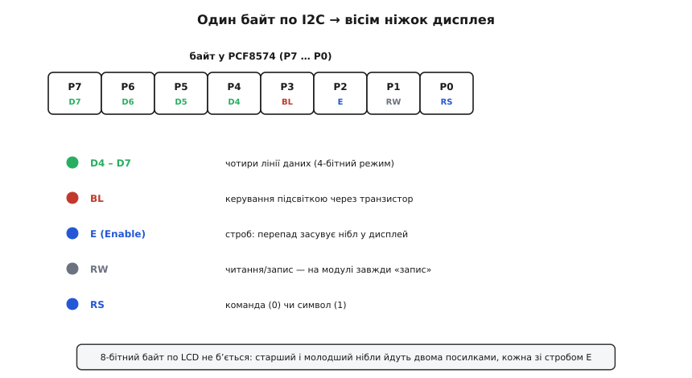
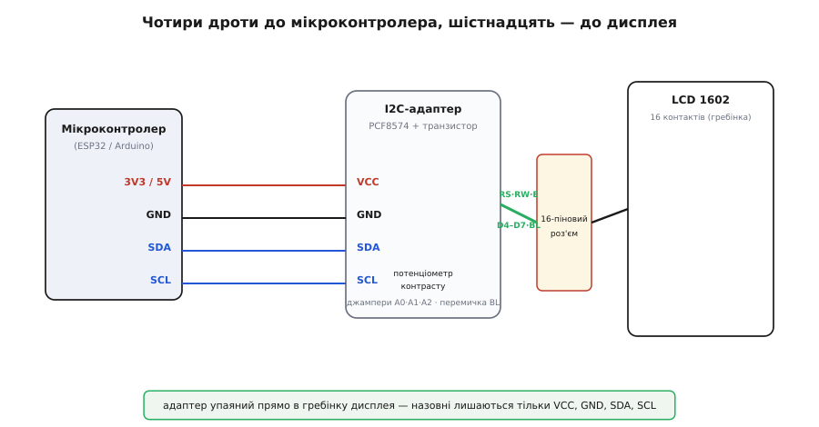

# I2C-адаптер для LCD 1602 (PCF8574)

<preknowlist>
- [Шина I2C](root:com-devices/i2c-bus) — дві лінії SDA/SCL, ведучий і ведений, адреса пристрою; без цього не зрозуміти, чим адаптер економить виводи.
- [Символьний дисплей LCD 1602A](root:cat-hw-actuators/lcd-1602) — що це за екран, його 16 контактів, контролер HD44780 і 4-бітний режим — саме його адаптер і оживляє.
- [Адресація I2C](root:com-devices/i2c-addressing) — 7-бітна адреса й молодші біти від ніжок; потрібне для розуміння джамперів A0/A1/A2 і чому екран «на 0x27».
</preknowlist>

Візьміть у руки символьний дисплей LCD 1602 — і побачите ззаду гребінку на шістнадцять контактів. Кожен треба кудись під'єднати: чотири-вісім ліній даних, три керуючі, живлення, земля, підсвітка, контраст. На макетній платі це десяток дротів і половина виводів дешевого мікроконтролера, витрачених на один-єдиний екранчик. А тепер погляньте на маленьку чорну платку, впаяну впритул до тієї самої гребінки, з якої назовні стирчать лише **чотири** ніжки: `VCC`, `GND`, `SDA`, `SCL`. Це і є **I2C-адаптер для LCD 1602** — крихітний перехідник, що згортає шістнадцять проводів дисплея у дві сигнальні лінії шини I2C.

Серце адаптера — одна мікросхема, **PCF8574**: восьмибітний розширювач портів для шини [I2C](root:com-devices/i2c-bus). Уся хитрість у ній: замість того, щоб мікроконтролер сам смикав шістнадцять ніжок дисплея, він шле короткий байт по двох дротах, а розширювач розкладає цей байт на вісім своїх виводів — і саме вони під'єднані до керуючих і даних-ліній екрана. Дисплей не знає, що ним керують через I2C; для нього ніби хтось безпосередньо ворушить його ніжки. Ця стаття — про те, як упізнати такий адаптер, що в нього всередині, як його підключити, задати адресу й не наступити на кілька типових граблів.

### Навіщо він узагалі потрібен

Щоб побачити цінність адаптера, треба знати, чого варта пряма проводка. Дисплей 1602 будується навколо контролера **HD44780** (або сумісного), і той спілкується паралельним інтерфейсом: щоб передати один байт, треба виставити його бітами на лінії даних, сказати «це команда чи символ» на лінії `RS`, і клацнути лінією `Enable` — тоді дисплей засуне байт усередину. Навіть у полегшеному **4-бітному режимі**, коли даними служать лише чотири лінії `D4`–`D7`, а байт передається двома половинками, мікроконтролеру доводиться тримати щонайменше шість виводів: чотири даних плюс `RS` і `Enable`. Додайте керування підсвіткою — і сім.

Сім виводів на один екран — це багато. На платі ESP32-C6 чи маленькому Arduino Nano їх усього два-три десятки, і кожен на рахунку: під давачі, кнопки, світлодіоди. Віддати чверть портів дисплею шкода. Тут і виходить на сцену **розширювач портів** — мікросхема, що сама має вісім виводів, а керується по двох лініях шини. Мікроконтролер каже їй по I2C: «постав на своїх ніжках отакий байт», — і вона ставить. Ті вісім ніжок фізично припаяні до `RS`, `Enable`, чотирьох ліній даних і транзистора підсвітки. Так екран отримує повний паралельний інтерфейс, а мікроконтролер платить за це лише двома дротами, які до того ж може розділити з десятком інших I2C-пристроїв.

> 🔧 **Навіщо це.** Це той самий трюк, яким користуються всюди, де ніжок мало, а керувати треба багатьма речами: розширювач портів «відрощує» контролеру додаткові виводи ціною двох ліній шини. Дисплей — найтиповіший випадок, але так само через один PCF8574 можна засвітити вісім реле чи опитати вісім кнопок. Загальний принцип — у статті про [розширювач портів I2C](root:com-devices/i2c-expander); адаптер дисплея — його найпоширеніше конкретне втілення.

### Що всередині: одна мікросхема і транзистор

Плата адаптера навмисне бідна на деталі — у цьому й краса. Придивіться, і ви впізнаєте кожен елемент.

Головна мікросхема — **PCF8574** у корпусі SO-16 (варіант з літерою `T`) або, зрідка, **PCF8574A**. Її придумали ще в Philips Semiconductors (нині це **NXP**); за документацією вона в обігу щонайменше з кінця 1990-х і відтоді стала галузевим стандартом дешевого розширення портів. Усередині — восьмибітний **квазідвонапрямлений порт** `P0`–`P7` та інтерфейс I2C. «Квазідвонапрямлений» означає особливу схему виводу: тягне до землі порт сильно, а вгору до живлення — лише слабеньким внутрішнім джерелом. Ця асиметрія нам ще знадобиться, коли говоритимемо про підсвітку, бо вона пояснює, чому виводом можна впевнено «замкнути на землю», але не можна ним живити щось потужне.

Друга помітна деталь — **біполярний транзистор** десь у кутку плати (часто підписаний як `Q1`, у корпусі SOT-23), з парою резисторів поряд. Він керує підсвіткою: один вивід розширювача занадто слабкий, щоб самому тягнути струм світлодіодного заднього підсвічування, тож він лише **відмикає транзистор**, а вже той пропускає струм крізь підсвітку. Поряд із транзистором — знімна **перемичка** (джампер): накинута, вона віддає керування підсвіткою розширювачу; знята — розриває коло, і підсвітка гасне назавжди (інколи це роблять, щоб убити мерехтіння або зекономити струм).

Третя річ — синій **підстроювальний потенціометр** (часто позначений `RV1`). Він задає **контраст**: крутячи його викруткою, ви подаєте на ніжку `V0` дисплея потрібну напругу, від якої залежить, наскільки темні символи проти тла. Це аналоговий регулятор, до I2C він не має стосунку — просто зручно винесений на адаптер, бо на голому дисплеї під нього довелося б вішати окремий резистор.

І нарешті — три пари контактних площадок під паяльну краплю, підписані **`A0`, `A1`, `A2`**. Ними задають I2C-адресу; до цього ми дійдемо окремо.


*Вісім бітів у PCF8574 (`P7`…`P0`) жорстко припаяні до ніжок дисплея: старша половина `P4`–`P7` — чотири лінії даних, `P3` — керування підсвіткою через транзистор, `P2` — строб `Enable`, `P1` — `RW` (на модулі завжди «запис»), `P0` — `RS` (команда чи символ). Тому один байт по I2C одразу виставляє весь стан ніжок.*

### Як байт по I2C стає символом на екрані

Ось де вся суть. Розширювач робить одну-єдину річ: коли ведучий шле йому байт по I2C, він виставляє біти цього байта на своїх ніжках `P0`–`P7`. А ці ніжки на платі адаптера **жорстко розведені** до контактів дисплея за майже завжди однаковою розкладкою — тією, під яку написана поширена бібліотека `LiquidCrystal_I2C`:

```
Біт розширювача   Ніжка дисплея   Призначення
──────────────────────────────────────────────────────────
P0                RS              команда (0) або символ (1)
P1                RW              читання/запис (тут завжди 0)
P2                E               строб Enable
P3                —               керування підсвіткою (транзистор)
P4                D4              лінія даних
P5                D5              лінія даних
P6                D6              лінія даних
P7                D7              лінія даних
```

Тепер уявімо, що треба вивести символ. Дисплей у 4-бітному режимі, тож байт символу йде **двома половинками-ніблами** (англ. *nibble* — півбайта, чотири біти). Щоб дисплей проковтнув одну половинку, потрібен **перепад на лінії `Enable`**: спершу дані стоять на `D4`–`D7`, потім `Enable` піднімають, а тоді опускають — і по цьому спадові контролер дисплея зчитує чотири біти. Отже, на кожну половинку припадає щонайменше **три посилки по I2C**: виставити дані з піднятим `Enable`, той самий стан із опущеним `Enable`, і так само для другої половинки.

Розберімо на конкретному прикладі, як бібліотека формує ці байти для розширювача.

**Вивести літеру `A` (код 0x41 = 0100 0001), підсвітка ввімкнена, це символ (RS = 1).**
```c
// 0x41 = 0100 0001. Старший нібл = 0100, молодший = 0001.
// Розкладка бітів у байті для PCF8574:
//   P7 P6 P5 P4  P3  P2  P1  P0
//   D7 D6 D5 D4  BL  E   RW  RS
// BL = 1 (підсвітка), RW = 0, RS = 1 (символ).

// --- старший нібл 0100 → D7..D4 = 0100 ---
uint8_t hi = 0b0100 << 4;          // дані в старші 4 біти = 0100 0000
hi |= (1 << 3);                    // BL  (P3) = 1  -> 0100 1000
hi |= (1 << 0);                    // RS  (P0) = 1  -> 0100 1001
// тепер strob Enable:
i2c_write(addr, hi | (1 << 2));    // E=1 (P2)      -> 0100 1101
i2c_write(addr, hi);               // E=0           -> 0100 1001  (спад зчитує нібл)

// --- молодший нібл 0001 → D7..D4 = 0001 ---
uint8_t lo = 0b0001 << 4;          // 0001 0000
lo |= (1 << 3) | (1 << 0);         // BL=1, RS=1    -> 0001 1001
i2c_write(addr, lo | (1 << 2));    // E=1           -> 0001 1101
i2c_write(addr, lo);               // E=0           -> 0001 1001
```
Чотири посилки по I2C — і на екрані з'явилася `A`. Команда (наприклад, «очистити екран») формується так само, лише `RS` = 0. Уся ця арифметика захована в бібліотеці: ви пишете `lcd.print("A")`, а нібли, строби й біт підсвітки вона складає сама. Але тепер видно, що діється під капотом, — і зрозуміло, чому I2C-дисплей ніколи не буде швидким: на кожен символ летить кілька байтів по повільній шині, а не один.

> 🔧 **Навіщо це.** Ця повільність — не дрібниця. Якщо в циклі щокадру перемальовувати весь екран (32 символи × 4 посилки = 128 байтів по I2C), на стандартних 100 кГц це помітно гальмує програму. Практичне правило: **оновлюйте лише те, що змінилося** — перемістіть курсор і перепишіть саме ту цифру, а не весь рядок. І тримайте шину на 400 кГц (режим *fast*), якщо дисплей і плата це тягнуть, — вийде вчетверо жвавіше.

### Адреса: чому «0x27» і як її змінити

Кожен пристрій на шині I2C має свою [адресу](root:com-devices/i2c-addressing) — інакше ведучий не знав би, до кого звертається. У PCF8574 старші чотири біти семибітної адреси зашиті в кремній (`0100`), а три молодші задаються ніжками `A0`, `A1`, `A2`. На адаптері ці ніжки виведені на пари контактних площадок:

```
Площадки A2 A1 A0   Адреса (PCF8574)
──────────────────────────────────────
не замкнені         0x27   ← стандартно
A0 замкнена         0x26
A1 замкнена         0x25
A0+A1 замкнені      0x24
...   (кожна замкнена площадка обнуляє свій біт)
усі три замкнені    0x20
```

Тонкість, на якій спотикаються: площадки підтягнуті до живлення слабкими резисторами, тож **незамкнена площадка дає логічну одиницю**. Незаймана плата з усіма трьома «вгорі» дає адресу `0x27`. Замкнули краплею припою `A0` — обнулили молодший біт, адреса стала `0x26`. Тобто паяння **знижує** адресу, а не піднімає. Це дозволяє повісити на одну шину **до восьми** таких адаптерів (адреси від `0x20` до `0x27`), розрізняючи їх перемичками, — наприклад, кілька дисплеїв у великому приладі.

Окрема пастка — **різновид мікросхеми**. Якщо на адаптері стоїть не PCF8574, а **PCF8574A**, у неї інші зашиті старші біти (`0111`), і незаймана плата озветься вже на **`0x3F`**, а не `0x27`. Тому найнадійніший спосіб дізнатися адресу свого екземпляра — не гадати, а **просканувати шину**: коротка програмка-сканер перебирає всі адреси й друкує ті, що відгукнулися. Це перше, що варто зробити з новим адаптером, бо половина запитань «чому дисплей мовчить» — це просто неправильна адреса в коді.

### Підключення: чотири дроти

Електрично все зводиться до чотирьох контактів на краю адаптера.

```
Адаптер       Мікроконтролер (приклад ESP32)
──────────────────────────────────────────────
VCC    ──────  5V   (дисплей 1602 хоче 5 В для читабельного контрасту)
GND    ──────  GND
SDA    ──────  GPIO21  (лінія даних I2C)
SCL    ──────  GPIO22  (лінія такту I2C)
```

Найважливіше рішення тут — **живлення**. Символьний дисплей 1602 за паспортом любить **5 вольтів**: від них залежить не лише яскравість, а й контраст самих символів. На 3.3 В багато екземплярів дають блідий, ледь видний текст, навіть якщо викрутити потенціометр контрасту до краю. Тому адаптер зазвичай годують **п'ятьма вольтами** — і тут зачаїлася головна небезпека.


*Ліворуч мікроконтролер віддає лише чотири лінії: живлення, землю й пару I2C (`SDA`/`SCL`). Адаптер із PCF8574 упаяний прямо в 16-контактну гребінку дисплея й розкладає I2C у повний паралельний інтерфейс. На платі адаптера — потенціометр контрасту, площадки адреси `A0`/`A1`/`A2` і перемичка підсвітки.*

> 🔧 **Навіщо це.** Небезпека — у **рівнях сигналів**. Якщо адаптер живиться від 5 В, його лінії `SDA`/`SCL` теж підтягуються до 5 В внутрішніми резисторами. Для 5-вольтового Arduino Uno це рідна мова, проблеми немає. Але для **3.3-вольтового** мікроконтролера (ESP32, STM32, Pico) п'ять вольтів на його виводах I2C — це перевищення, яке поволі точить кристал. Виходів два: або живити адаптер від 3.3 В і змиритися з тьмянішим екраном, або поставити між платами **двонапрямлений перетворювач рівнів** на лінії `SDA`/`SCL`, залишивши дисплею його законні 5 В. Найгірше — з'єднати 5-вольтовий адаптер напряму з ніжками ESP32 «бо ж працює»: працює, поки не відмовить.

Ще дві дрібниці про шину I2C. По-перше, лінії `SDA`/`SCL` потребують **підтягувальних резисторів** до живлення (зазвичай 4.7 кОм); на більшості адаптерів вони вже стоять, але якщо на шині багато пристроїв — сумарна підтяжка стає завеликою і сигнал псується, тоді зайві резистори доводиться прибирати. По-друге, дисплей під час запису **не смикає струм ривками** так, як SD-картка, тож живлення до нього некритичне; головне, щоб 5 В були власне п'ятьма вольтами, а не просілими чотирма з поганого USB.

### Як ним керувати в коді

На боці програми весь цей танець із ніблами й стробами бере на себе бібліотека. Для Arduino/ESP32 стандарт де-факто — `LiquidCrystal_I2C`: ви створюєте об'єкт дисплея, передавши йому знайдену адресу й геометрію (16 стовпців, 2 рядки), викликаєте `begin()`, і далі пишете майже так само, як на будь-якому символьному екрані — `setCursor()`, `print()`, `clear()`, `backlight()`. Під капотом кожен виклик перетворюється на ту саму послідовність байтів для PCF8574, яку ми розібрали вище.

Робочий скелет, типові виклики, керування підсвіткою й курсором, а також пастки на кшталт «дисплей показує ряд чорних прямокутників» (майже завжди — неправильна адреса або погана ініціалізація) винесено в окремий [приклад коду для I2C-дисплея](root:cat-hw-actuators/i2c-lcd-adapter/api-lcd-i2c.md): там і скетч-сканер адрес, і мінімальна програма «Hello, world», і поради, як не спалити 3.3-вольтову плату.

### Що варто запам'ятати

I2C-адаптер для LCD 1602 — це маленька плата з мікросхемою-розширювачем **PCF8574**, транзистором підсвітки й потенціометром контрасту, впаяна в гребінку дисплея. Вона перетворює громіздкий паралельний інтерфейс екрана (шість-сім ліній) на дві лінії шини **I2C** плюс живлення й землю. Мікроконтролер шле по шині байти, розширювач розкладає їх на ніжки дисплея, а вбудована бібліотека ховає від вас усю арифметику ніблів і стробів.

Три речі, на яких найчастіше горять. Перша — **адреса**: стандартно `0x27`, але буває `0x3F` (якщо чип PCF8574A), тож не гадайте, а скануйте шину. Друга — **рівні живлення**: дисплей хоче 5 В, але з'єднувати 5-вольтовий адаптер напряму з 3.3-вольтовим мікроконтролером — повільна диверсія проти власної плати; ставте перетворювач рівнів або жертвуйте яскравістю. Третя — **контраст**: якщо екран горить рівним рядком прямокутників або, навпаки, зовсім порожній, першим ділом крутіть синій потенціометр, а вже потім шукайте помилку в коді. Упізнавши ці три граблі, ви змусите будь-який такий адаптер працювати за п'ять хвилин.
