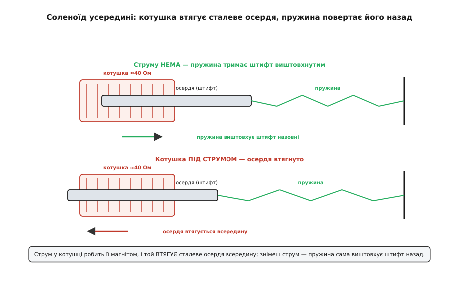
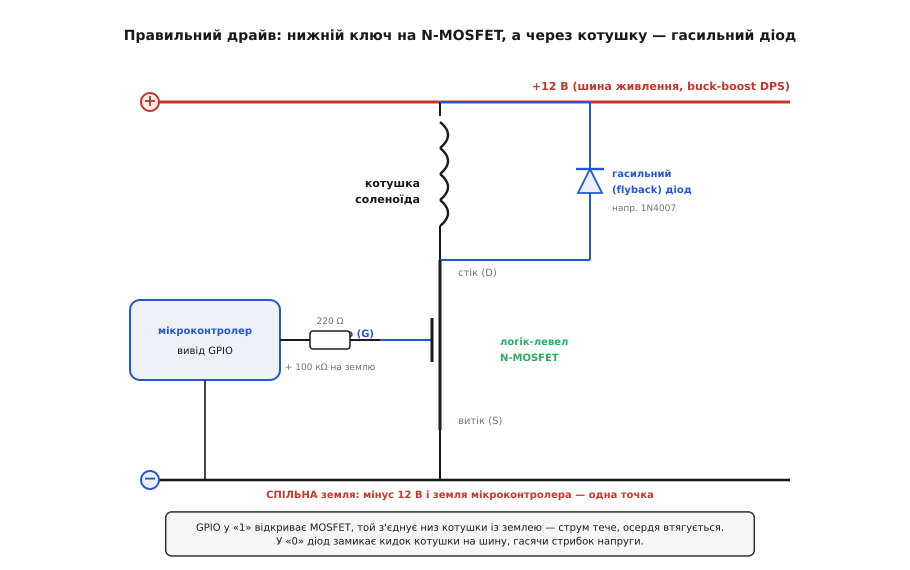
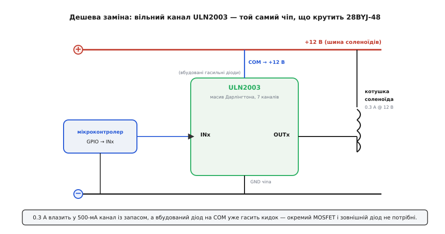
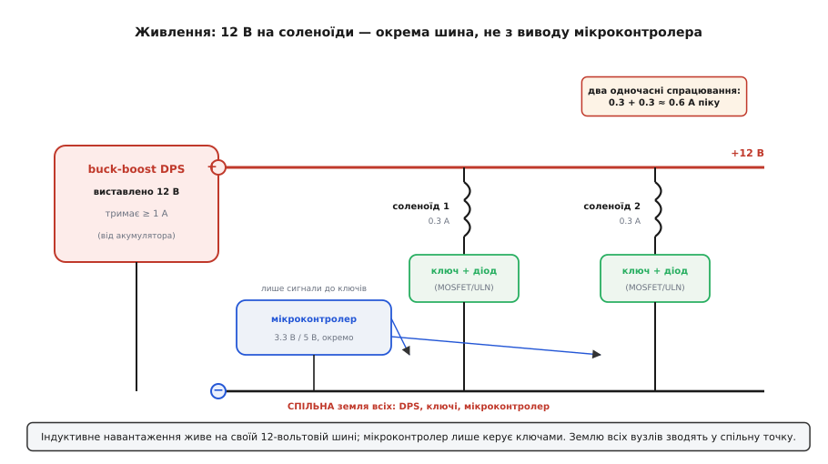

# Соленоїд JF-0530B (12 В, push-pull)

<preknowlist>
- [Електромагніт](root:ph-electromagnetism/electromagnet) — котушка зі струмом стає магнітом, а знятий струм гасить магнетизм; саме на цьому тримається весь рух соленоїда.
- [Котушка](root:ph-electromagnetism/inductor-coil) — виток дроту, що накопичує енергію в магнітному полі й опирається різкій зміні струму; обмотка соленоїда і є така котушка.
- [MOSFET як ключ](root:hw-components/mosfet-switch) — польовий транзистор, що вмикається напругою на затворі й пропускає крізь себе струм, більший за той, що дає вивід мікроконтролера.
- [Брикання котушки](root:hw-components/inductor-kickback) — коли струм крізь обмотку різко рвуть, вона відповідає гострим кидком напруги, здатним пробити ключ; його гасять діодом.
- [Закон Ома](root:hw-analog/ohms-law) — напруга = струм · опір; з нього дістаємо і струм соленоїда, і його опір.
</preknowlist>

Візьміть у пальці невеликий чорний брусок завбільшки з коробок сірників — приблизно шістнадцять на шістнадцять міліметрів у перерізі й із три сантиметри завдовжки, з відкритою металевою рамкою-скобою по боках і сталевим штифтом, що стирчить з одного торця й ходить туди-сюди, коли його штовхнути пальцем. З протилежного боку виходить пара дротів. Це **JF-0530B** — дешевий електромагнітний **лінійний привід**, або соленоїд: пристрій, що вміє одне-єдине, зате миттєво й сильно — **втягувати сталевий штифт усередину, коли на котушку подано струм**, і відпускати його назад, щойно струм зникне. Не обертати, як мотор, а саме **штовхати чи тягти по прямій**. Такі брусочки клацають замками, штовхають монети в торгових автоматах, б'ють по клавішах механічних інструментів і смикають важелі там, де треба короткий різкий рух «увімкнув — зробилося».

Головне, що варто зрозуміти про цю річ наперед: це не «розумний» пристрій і не мотор із плавним керуванням. Це, по суті, **котушка дроту зі сталевим сердечником усередині** — найпростіший електромагніт у корпусі. Уся його поведінка випливає з одного факту: [котушка, крізь яку тече струм, стає магнітом](root:ph-electromagnetism/electromagnet) і притягує до себе залізо. Розберімо, як із цього факту виходить корисний привід, чому його не можна вмикати прямо з ніжки мікроконтролера, і як під'єднати його правильно, щоб не спалити ні драйвер, ні сам соленоїд.

### Що означає ця назва й що каже паспорт

Саме слово **соленоїд** (фр. *solénoïde*, з гр. *sōlēn* — «трубка, канал» + *-eidēs* — «подібний»; тобто «трубкоподібний») придумав André-Marie Ampère близько 1823 року для позначення циліндричної котушки дроту (усталений факт, підтверджений мовними джерелами). Спершу так звали просто саму котушку у фізиці; згодом, коли в котушку почали вставляти рухомий сталевий сердечник, назва перейшла на цілий **пристрій-привід**. Тому в електроніці «соленоїд» — це вже не абстрактна котушка, а конкретна залізяка: обмотка плюс осердя, що в неї втягується.

Маркування **JF-0530B** — це серійний код виробника (JF — родина відкриторамкових соленоїдів дрібного розміру, 0530 — типорозмір, B — виконання), без глибокого прихованого змісту, як буває в моторів. Куди важливіші числа з паспорта. Ось вони — саме та версія, про яку йдеться:

```
напруга живлення   12 В постійного струму
робочий струм      0.3 А (300 мА)
споживана потужність ≈ 3.6 Вт  (12 · 0.3)
сила                ≈ 5 Н
хід штока           ≈ 10 мм
розміри             ≈ 16 × 16.5 × 30 мм
тип                 відкрита рамка, з поверненням пружиною
```

(Ці значення однакові в десятках продавців цієї деталі — усталені паспортні дані; є й версії тієї самої серії на 6 В і 24 В, тому напругу завжди перевіряйте на конкретному примірнику.)

Кілька цих чисел варто прочитати уважніше, бо вони прямо диктують, як із соленоїдом поводитися.

**Опір обмотки дістаємо просто із [закону Ома](root:hw-analog/ohms-law).** Виробник дає напругу й струм, а опір рахуємо самі:

```
R = U / I = 12 В / 0.3 А = 40 Ом
```

**Сила 5 Н і хід 10 мм.** П'ять ньютонів — це приблизно вага півкілограмової гирки, яку штифт здатен зрушити. Але тут ховається головна фізична пастка соленоїда, яку треба знати одразу: **ця сила не стала**. Вона найбільша, коли осердя вже майже втягнене, і найменша на початку ходу, коли штифт іще далеко висунутий. Тобто «5 Н» — це радше сила наприкінці руху, а зрушити важкий вантаж із самого початку соленоїд може й не подужати. Через це соленоїд люблять там, де потрібен **короткий кидок** (клацнути засувку, штовхнути легкий важіль), а не рівномірне тягнення на всю довжину ходу.

> 🔧 **Навіщо це.** Непостійність сили — не дефект, а сама природа приладу, і вона визначає, куди його ставити. Клацнути замок, збити монету, штовхнути кульку в пінбольній машині — усе це короткі рухи на останніх міліметрах ходу, де сила максимальна: соленоїд тут ідеальний. А от плавно й рівно тягти щось на всі 10 мм від самого початку він не вміє — сила «плаває», рух ривкуватий. Треба довгий рівний хід — беруть інший привід (черв'ячний, ходовий гвинт із мотором); треба різко клацнути — беруть соленоїд.

### Як він рухає штифт: котушка, осердя, пружина

Розберімо брусок подумки. Усередині відкритої сталевої рамки намотано **котушку** мідного дроту — багато витків навколо порожнистого каналу. У цей канал вставлено **осердя** — сталевий стрижень (у JF-0530B це шток діаметром десь 6 мм), який може вільно ковзати вздовж осі. А ще є **пружина**, що штовхає осердя в бік «висунуто».

Тепер сама фізика, від першопричини. Поки струму немає, пружина тримає штифт **висунутим** назовні. Щойно ми пускаємо струм крізь котушку, вона [стає електромагнітом](root:ph-electromagnetism/electromagnet) — усередині її каналу виникає магнітне поле. А магнітне поле **втягує залізо в область, де воно найсильніше** — тобто всередину котушки. Сталеве осердя відчуває це притягання й **засмоктується** в котушку, долаючи пружину, аж поки не втягнеться до упору. Знімаємо струм — поле зникає, притягання щезає, і **пружина сама виштовхує** штифт назад назовні. Ось і весь рух: подав струм — втягнулося, зняв — вискочило.


*Струм у котушці робить її магнітом, і той втягує сталеве осердя всередину, долаючи пружину. Знімеш струм — магнетизм зникає, і пружина сама виштовхує штифт назад. Уся робота приладу — це перемикання між цими двома станами.*

Тепер про слово **push-pull** у назві, бо воно збиває з пантелику. Дослівно це «штовхай-тягни», і можна подумати, що соленоїд активно вміє й тягнути, і штовхати. Насправді ця конкретна відкриторамкова деталь активно робить лише **одне** — **втягує** осердя, коли ввімкнена; зворотний рух дає **пружина**, а не струм. «Push-pull» тут — це радше про **спосіб застосування**: залежно від того, як ви приладнаєте шток до механізму, той самий втягувальний рух може або **тягнути** щось до соленоїда (якщо чіпляєте навантаження за кінець штока), або **штовхати** щось геть від нього (якщо навантаження стоїть перед торцем штока з боку пружини). Один рух — два способи використати. Це не те саме, що справжній двобічний привід, де струм жене осердя і туди, і назад.

> 🔧 **Навіщо це.** Практичний висновок із пружинного повернення важливий: **соленоїд повертає штифт сам, без вашої команди**. Не треба другого сигналу «відпусти» — досить зняти струм, і пружина зробить решту. Але звідси й обмеження: **сила зворотного ходу — це лише сила пружини**, кілька десятих ньютона, куди слабша за втягувальні 5 Н. Тож якщо навантаження треба з рівною силою рухати в обидва боки — ця деталь не годиться; шукайте справжній двокотушковий чи фіксувальний (латкувальний) соленоїд, де магніт активно жене осердя в обидва положення й може утримувати його без струму. JF-0530B натомість чудовий там, де **робочий рух — в один бік**, а назад досить «просто відпустити».

### Головна пастка: індуктивне навантаження й кидок котушки

Ось те, чого не можна не знати, беручись керувати соленоїдом, — інакше згорить драйвер. Обмотка соленоїда — це **[котушка](root:ph-electromagnetism/inductor-coil)**, тобто індуктивність, а індуктивність поводиться підступно: **вона опирається різкій зміні струму**.

Розгорнімо це від причини. Поки струм крізь котушку тече рівно, усе спокійно. Але тієї миті, коли ви **розриваєте** коло (вимикаєте ключ), струм у котушці не може обірватися миттєво — накопичена в магнітному полі енергія мусить кудись подітися. Котушка «намагається» проштовхнути струм далі й задля цього **сама генерує напругу** — і то величезну, у десятки й сотні вольт, хоча живили ви її якимись дванадцятьма. Цей стрибок і зветься [бриканням котушки](root:hw-components/inductor-kickback) (англ. *inductive kickback*, або *flyback* — «зворотний спалах»). Спрямований він так, що б'є прямісінько по щойно закритому ключу — і пробиває транзистор за лічені перемикання, якщо той беззахисний.

Рятунок — **гасильний діод** (його ще звуть зворотним, або flyback-діодом; англ. *freewheeling diode* — «діод вільного ходу»). Його ставлять **паралельно котушці**, «навпаки» до живлення: катодом до плюса, анодом до того кінця обмотки, який смикає ключ. Поки ключ відкритий і струм тече нормально, діод замкнений і нічого не робить. Але щойно ключ рветься й котушка кидає свій стрибок напруги — цей стрибок відмикає діод, і струм обмотки **добігає своє коло через діод по замкнутому кільцю**, тихо згасаючи в опорі дроту, замість того щоб пробивати ключ. Напруга на ключі при цьому не підскакує вище «плюс живлення плюс одне падіння на діоді» — цілком безпечно.

> 🔧 **Навіщо це.** Це найчастіша й найдорожча помилка новачка з будь-яким індуктивним навантаженням — соленоїдом, реле, мотором: **увімкнути котушку через транзистор і забути діод**. Працює воно спершу нібито нормально, а тоді ключ ні з того ні з сього «сам собою» вигоряє — бо кожне вимикання лупить по ньому сотнями вольт. Правило залізне: **керуєш котушкою — став гасильний діод паралельно їй, завжди.** Виняток лише один — якщо драйвер уже має такий діод усередині (як мікросхема ULN2003, про яку нижче): тоді зовнішній не потрібен, бо його роль виконує вбудований.

Історію того, звідки взявся гасильний діод і чому саме таку схему захисту прийняли для всього індуктивного, винесено [в окрему нотатку](root:cat-hw-actuators/jf-0530b-solenoid/hist-freewheeling-diode.md).

### Чому не можна вмикати прямо з мікроконтролера

Спокуса під'єднати соленоїд просто до ніжки плати й «вмикати програмою» руйнується об два числа. По-перше, **струм**: обмотка тягне 0.3 ампера (300 мА), а вивід мікроконтролера — Arduino, ESP32, Raspberry Pi Pico — безпечно віддає лише десь **20–40 міліампер**. Спробуєте живити котушку прямо з ніжки — ніжка або згорить, або просто не дасть стільки струму, і штифт не зрушить. По-друге, **напруга**: соленоїд хоче 12 вольт, а логіка мікроконтролера працює на 3.3 чи 5 — вивід фізично не може подати 12 В, навіть якби струм дозволяв.

Отже, потрібен **силовий посередник — ключ**, який слухається слабенького сигналу з мікроконтролера, а сам комутує 12 вольт і 0.3 ампера. Мозок вирішує *коли* вмикати, а м'язи — окремий транзистор — це вмикання виконують. Це та сама логіка, що й у будь-якого потужного навантаження: між «розумною» ніжкою й «сильним» приладом завжди стоїть ключ.

Є два звичні способи поставити цей ключ, і обидва варті знати.

### Спосіб перший: нижній ключ на N-MOSFET

Класика для одного соленоїда — **логік-левел N-канальний MOSFET** нижнім ключем (англ. *low-side* — «знизу»). «Логік-левел» тут ключове слово: це MOSFET, що повністю відкривається вже від 3.3–5 вольт на затворі, тобто прямо від логічного рівня мікроконтролера, без окремого драйвера затвора. Схема виходить проста й дешева.


*GPIO у «1» відкриває MOSFET, і той з'єднує нижній кінець котушки із землею — струм тече, осердя втягується. У «0» транзистор закривається, а кидок котушки замикає на шину гасильний діод. Резистор у затворі гамує дзвін, а підтяжка вниз тримає ключ закритим, поки МК не завантажився.*

Прочитаймо цю схему по колу. **Котушка соленоїда** одним кінцем сидить на постійному **+12 В**, а другим — на **стоку** транзистора. **Витік** MOSFET іде на **землю**. Тепер, коли мікроконтролер виставляє на **затвор** логічну одиницю, транзистор відкривається й **з'єднує стік із витоком**, тобто притягує нижній кінець котушки до землі. Коло замикається: струм біжить від +12 В крізь обмотку, крізь відкритий транзистор — на землю. Осердя втягується. Виставив на затворі нуль — транзистор закрився, коло розірване, пружина виштовхнула штифт.

У схемі є ще три деталі, кожна не випадкова:

- **Гасильний діод** паралельно котушці (катодом до +12 В) — той самий захист від кидка, без якого MOSFET помре. Годиться будь-який випрямний, наприклад 1N4007.
- **Резистор у затворі** (сотні ом, скажімо 220 Ом) — гамує паразитний «дзвін» на затворі при перемиканні. Не критичний, але корисний.
- **Підтяжка затвора до землі** (десятки-сотні кілоом, наприклад 100 кОм) — тримає транзистор **гарантовано закритим**, поки мікроконтролер завантажується і його виводи ще «висять у повітрі». Без неї соленоїд може смикнутися при вмиканні живлення. Дрібниця, а рятує від несподіванок.

Чому саме **нижній** ключ, а не верхній? Бо так найпростіше. Керувати транзистором, витік якого сидить на землі, легко: досить подати на затвор напругу відносно тієї ж землі — рівно те, що вміє ніжка мікроконтролера. Якби ключ стояв **зверху** (між плюсом і котушкою), затвор довелося б піднімати вище дванадцяти вольт, а це вже морока з окремим драйвером. Нижній ключ обходиться без цього — тому для простого вмикання котушки беруть саме його.

### Спосіб другий: вільний канал ULN2003 — той самий чіп, що й у степера

Якщо у вашому наборі вже є плата **ULN2003** — та сама зелена платка, що йде в парі з кроковим мотором [28BYJ-48](root:cat-hw-actuators/28byj-48-stepper), — соленоїд можна повісити прямо на **вільний канал** цієї мікросхеми, без окремого MOSFET і навіть без зовнішнього діода. І це часто найдешевший шлях, бо чіп у вас уже є.

ULN2003 — це **масив із семи однакових потужних ключів** (пар Дарлінгтона) в одному корпусі. Для крокового мотора з них працюють лише чотири, а решта **три просто простоюють** — от на один із них і чіпляють соленоїд. Три числа з паспорта мікросхеми показують, що 0.3 ампера соленоїда їй по зубах:

```
струм на канал     ≈ 500 мА (пік до 600 мА)   →  0.3 А влазить із запасом
напруга на виході  до 50 В                     →  12 В — дрібниця
вбудований діод    на кожному каналі (вивід COM) → окремий не потрібен
```


*Котушка одним кінцем на +12 В, другим — на виході OUTx. Одиниця на вході INx відкриває канал, той притягує OUTx до землі, і струм тече крізь обмотку. Кидок котушки гасить вбудований діод, що йде від виходу до виводу COM — його треба лише завести на +12 В.*

Схема майже така сама, як для степера, тільки замість обмотки мотора — обмотка соленоїда. Один кінець котушки — на **+12 В**, другий — на вихід **OUTx**. Одиниця на вході **INx** відкриває канал, і той **притягує OUTx до землі** (це теж нижній ключ, як і MOSFET), замикаючи струм крізь обмотку. Це вже знайома [логіка плати ULN2003](root:cat-hw-drivers/uln2003-driver): вхід у «1» — навантаження під струмом, вихід сам струму не дає, а лише стікає його в землю.

Ключова зручність — **вбудований гасильний діод**. У ULN2003 є окремий вивід **COM**, і від кожного виходу до нього йде готовий діод. Заводите COM на ту саму плюсову шину, що живить котушки, — і захист від кидка вже є, зовнішній діод чіпляти не треба. Та сама причина, чому зі степером усе працює «саме собою»: на платі 28BYJ-48 цей COM уже з'єднано з плюсом розводкою.

> 🔧 **Навіщо це.** Тут криється найтонший момент, коли берете **голу** мікросхему (чи плату степера) під соленоїд: **не забудьте завести COM на +12 В**. На платі 28BYJ-48 COM з'єднаний із плюсовою клемою за вас, тому зі степером про це не думаєш. Але щойно ви живите соленоїд від окремих 12 В, а COM лишили непід'єднаним — вбудовані діоди виявляються «в нікуди», кидок котушки нема куди відвести, і чіп гине. Правило те саме, що й з MOSFET: **керуєш індуктивним — подбай, куди подінеться кидок**. Тут це означає одне: COM — на плюс живлення котушок.

Який спосіб обрати? Якщо соленоїд один і плати ULN у вас немає — простіше й дешевше поставити **один MOSFET із діодом**. Якщо ж ULN2003 уже лежить (а він майже завжди лежить поряд зі степером у наборі) — **беріть вільний канал**, це найменше деталей: ні окремого транзистора, ні зовнішнього діода. Обидва підходи роблять те саме — нижній ключ, що притягує низ котушки до землі за сигналом мікроконтролера.

### Живлення: 12 В окремою шиною, не з логіки

Число «12 вольт» одразу відділяє соленоїд від світу мікроконтролера, який живе на 3.3 чи 5 В. Ці 12 В треба звідкись узяти — і взяти **окремою силовою шиною**, а не з виводів плати.

Зручне джерело — **[програмований buck-boost перетворювач (DPS)](root:cat-hw-power/dcdc-buck-boost)**: модуль, що з будь-якого вхідного живлення (акумулятора, блока) робить рівно виставлені 12 В і тримає потрібний струм. «Buck-boost» означає, що він уміє і **знижувати**, і **підвищувати** напругу — тож дасть свої 12 В хоч від просілого акумулятора нижче дванадцяти, хоч від вищого. Виставили на ньому 12.0 В — маєте стабільну шину під соленоїди.

Скільки струму від цієї шини треба? Один соленоїд бере 0.3 А. Якщо в пристрої **два** соленоїди й вони можуть спрацювати **одночасно**, рахуйте на пік суми:

```
один соленоїд         0.3 А
два одночасно         0.3 + 0.3 = 0.6 А
запас на пусковий струм і надійність → джерело на ≥ 1 А
```


*Індуктивне навантаження живе на своїй 12-вольтовій шині від DPS; мікроконтролер живиться окремо й лише керує ключами. Два одночасні спрацювання дають близько 0.6 А піку, тож джерело беруть із запасом. Землю всіх вузлів обов'язково зводять у спільну точку.*

Два правила живлення, які найчастіше порушують:

**Сигнали розділяй, землю об'єднуй.** Плюсові шини логіки (3.3/5 В) і соленоїдів (12 В) — **окремі**, їх не змішують. А от **землі** — мінус 12-вольтового джерела й земля мікроконтролера — **обов'язково зводяться в спільну точку**. Без цього сигнал із ніжки на затвор (чи на вхід ULN) не має спільної точки відліку з силовою частиною, і ключ поводиться непередбачувано: «все під'єднав, а не спрацьовує» — майже завжди про роз'єднані землі.

**Соленоїд — не з ніжки 5 В плати.** Спокуса живити котушку від виводу «5V» плати мікроконтролера, коли та висить на USB, закінчується погано: USB часто не тягне такий струм, напруга просідає, плата перезавантажується просто в мить спрацювання. Дайте котушкам **окреме** джерело на 12 В, а плату лишіть на своєму живленні.

### Чого стерегтися й де його місце

JF-0530B — дешевий і корисний, але має чіткі межі, і чесно знати їх наперед.

**Він гріється, коли тримає.** Ось найважливіше обмеження. Соленоїд перетворює всі свої 3.6 вата на тепло весь час, поки котушка під струмом, — адже осердя вже втягнене й не рухається, а струм тече. Кілька секунд це байдуже, але **тримати соленоїд увімкненим хвилинами** він не любить: обмотка помітно нагрівається, і за тривалого утримання її можна перегріти. Практичне правило для цієї деталі — **вмикати короткими імпульсами**, а не тримати надовго. Треба щось **утримувати** довго — соленоїд не той інструмент (для цього беруть фіксувальний, самозатискний соленоїд або механічну засувку). А якщо утримувати таки треба, є хитрий прийом: **повне живлення на короткий кидок, щоб втягнути, а тоді знизити струм** (наприклад, широтно-імпульсною модуляцією) до рівня, що лише **утримує** вже втягнуте осердя — тримати ж треба менше сили, ніж зрушити. Це помітно зменшує нагрів; докладніше — [в окремому проєкті-вставці з кодом драйва](root:cat-hw-actuators/jf-0530b-solenoid/proj-drive-solenoid.md).

**Сила «плаває» по ходу.** Ті самі 5 Н — це радше кінець руху; на початку ходу сила менша. Тож розраховуйте механізм так, щоб основне зусилля припадало на **останні міліметри** втягування, а не на самий старт.

**Рух — в один активний бік.** Втягує струм, повертає пружина — і сила повернення слабка. Робочий рух робіть у бік втягування; на зворотний бік важкого навантаження не покладайтеся.

**Пусковий струм вищий за робочий.** У першу мить увімкнення, поки осердя ще не втягнулося, струм короткочасно вищий за паспортні 0.3 А. Тому й джерело, і ключ беруть із запасом, а не «рівно під 0.3 А».

Насамкінець — головна думка, яку цей копійчаний брусок вкладає в голову. Соленоїд — це найпростіший спосіб перетворити електричний сигнал на **механічний рух по прямій**: подав струм — сталеве осердя втяглося, зняв — пружина виштовхнула. За цією простотою стоїть уся фізика електромагніта, і з неї ж випливають усі правила поводження: котушка хоче струму, якого ніжка не дасть, — тому між нею й мікроконтролером стоїть **ключ**; котушка при вимиканні б'є кидком напруги — тому паралельно їй стоїть **гасильний діод**; котушка весь час гріється — тому її вмикають **імпульсами**. Зрозумівши ці три «тому», ви впораєтеся не лише з JF-0530B, а з будь-яким соленоїдом, реле чи іншим індуктивним навантаженням, яке доведеться вмикати з мікроконтролера.
