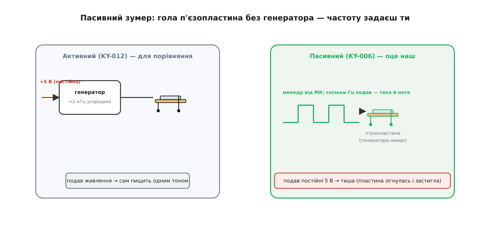
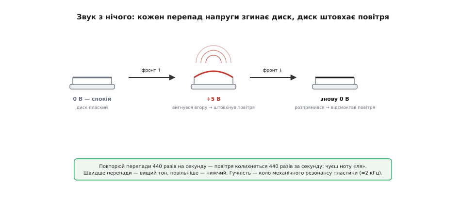
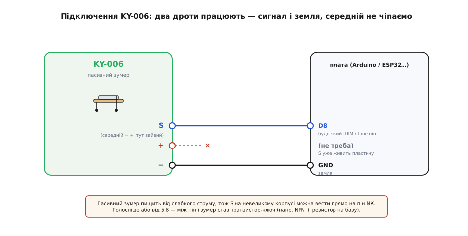

# KY-006 — пасивний зумер

<preknowlist>
- [KY-серія (Keyes 37-в-1)](root:cat-hw-sensors/ky-series) — спільний формат родини: гребінка на три штирі, живлення 3.3–5 В, «номер важливіший за виробника»; звідси загальні звички роботи з платою, а тут — лише специфіка KY-006.
- [П'єзоефект](root:ph-condensed/piezoelectric-effect-quartz-resonance) — деякі кристали під напругою міняють форму (і навпаки); саме це змушує пластину зумера гнутися й штовхати повітря — без цього годі зрозуміти, ЧОМУ він звучить.
- [Рівні «0» і «1»](root:hw-digital/logic-levels-as-ranges) — що пін МК видає як HIGH і LOW; звук пасивного зумера — це і є швидке перемикання цих двох рівнів на його виводі.
- [Широтно-імпульсна модуляція (ШІМ)](root:hw-analog/pwm) — той самий апарат «прямокутні імпульси з керованою частотою», яким МК і годує пасивний зумер; функція `tone()` під капотом робить рівно це.
- [Резонанс](root:ph-waves/resonance) — чому пластина на одній «своїй» частоті (≈2 кГц) відгукується найгучніше, а поза нею тихне; це задає, які ноти в KY-006 виходять дзвінко, а які ледь чути.
</preknowlist>

Здається, зумер — дрібниця: два дроти, і воно пищить. Але саме на KY-006 новачок спотикається чи не найчастіше з усієї KY-серії, і причина одна: **на цій платі немає нічого, що вміло б пищати само**. Подаєш на неї живлення, як на лампочку, чекаєш звуку — а вона мовчить. І це не поломка. Це вся суть слова «пасивний».

**KY-006** — маленька синя платка [KY-серії](root:cat-hw-sensors/ky-series) з однією-єдиною чорною п'єзотаблеткою й гребінкою на три штирі. Розберімо її так, щоб зрозуміти головне: чому «пасивний» зумер сам не звучить, що таке той меандр, яким його доводиться годувати, як із цього народжується нота потрібної висоти, і як написати код, що зіграє на KY-006 не лише «біп», а й мелодію.

## Пасивний проти активного: у чому вся різниця

Слово «пасивний» тут не про якийсь другорядний режим. Воно про те, **чого на платі бракує** — і саме ця нестача визначає, як з нею працювати.

Уяви два зумери-близнюки, зовні майже однакові. Перший — **активний**: усередині його корпусу, крім п'єзопластини, сидить крихітна схема-генератор, яка сама торохтить із частотою близько 2 кГц. Подав на такий зумер постійні 5 вольт — генератор ожив, розхитав пластину, і вона запищала. Один тон, завжди той самий, і керування зводиться до «увімкнув живлення / вимкнув». Це [KY-012](root:cat-hw-actuators/ky-012-buzzer), його сусід по родині.

Другий — **пасивний**, наш KY-006. У ньому генератора немає взагалі. Є **гола п'єзопластина** й пара доріжок до неї — і все. Подаси на неї постійні 5 вольт — і нічого не почуєш: пластина один раз зігнеться, застигне в новому положенні й замовкне. Постійна напруга не хитає — вона лише тримає.



*Активний (для контрасту) має вбудований генератор — подав постійні 5 В, і він сам пищить одним тоном. Пасивний KY-006 — лише п'єзопластина без генератора: від постійної напруги він мовчить, а щоб зазвучав, ти сам мусиш подати меандр (прямокутні імпульси), і скільки герців у тому меандрі — така й вийде нота.*

Ось у чому вся розвилка. Активному зумеру потрібна від тебе **напруга**; пасивному — **коливання**. KY-006 не почне звучати, поки на його виводі щось не почне швидко перемикатися між «0» і «1». Це його вада й водночас його сила:

> 🔧 **Навіщо це.** Пасивність KY-006 — не недолік, а свобода. Активний зумер уміє рівно один тон — той, під який його генератор налаштували на заводі. Пасивний KY-006 зіграє **будь-яку** частоту, яку ти йому подаси: писк тривоги, дзвінок, гами, коротку мелодію, звукову шкалу «що гарячіше — то вищий тон». Ціна цієї свободи — ти **сам відповідаєш за коливання**: якщо просто подати живлення й забути, звуку не буде. Тому вибір між KY-006 і KY-012 простий: треба один сигнал «пік» найдешевше й без клопоту — бери активний; треба різні тони чи мелодію — тільки пасивний, і готуйся генерувати меандр.

## Що всередині: п'єзопластина і більш нічого

Зазирнімо під чорну таблетку. Там — **п'єзоелемент**: тонкий латунний диск, на який наклеєно ще тонший шар п'єзокераміки (зазвичай PZT — цирконат-титанат свинцю). Два виводи: один до латуні, другий до металізації кераміки. Оце і є весь «динамік» KY-006.

Працює він на [п'єзоефекті](root:ph-condensed/piezoelectric-effect-quartz-resonance) — точніше, на його **зворотному** боці. Прямий п'єзоефект — це коли кристал під тиском **родить напругу** (на цьому стоять запальнички й мікрофони). А тут усе навпаки: **подаєш напругу — кристал міняє форму**. Керамічний шар під напругою трохи стискається чи розтягується в площині, а що він міцно приклеєний до латунного диска, який своєї довжини не міняє, то весь «бутерброд» вимушено **вигинається** — як біметалева пластина від нагріву. Приклав напругу однієї полярності — диск вигнувся в один бік; зняв — розпрямився.

І тут стає видно, чому постійна напруга дає тишу. Вигнутий диск — це просто вигнутий диск: він застиг і повітря більше не рухає. **Звук — це рух повітря**, а рух дає лише **зміна** положення. Щоб диск безперестанку штовхав повітря туди-сюди, напруга на ньому має безперестанку **перемикатися**:



*Кожен перепад напруги згинає або розпрямляє диск, і цей рух штовхає повітря. Подаси перепади 440 разів на секунду — повітря колихнеться 440 разів за секунду, і вухо почує ноту «ля». Швидше перепади — вищий тон, повільніше — нижчий; найгучніше виходить коло механічного резонансу пластини, близько 2 кГц.*

Тобто щоб KY-006 звучав рівним тоном, на його вивід треба подавати **меандр** (фр. *méandre* — звивина, від назви звивистої річки Меандр у Малій Азії; так називають прямокутну хвилю з рівними «полицями» вгорі й унизу) — сигнал, що ритмічно стрибає HIGH-LOW-HIGH-LOW. Скільки таких повних циклів за секунду — стільки **герців**, і саме це вухо чує як висоту тону. 440 разів на секунду — камертонне «ля»; 262 — «до» першої октави; 1000 — пронизливий високий писк.

> 🔧 **Навіщо це.** Зрозумівши, що звук — це перепади, а не рівень, ти вже не спитаєш «а чому воно не пищить від 5 вольт» і не шукатимеш неіснуючої поломки. І одразу видно, звідки береться висота ноти: це просто частота твого меандру. Хочеш вищий тон — частіше перемикай пін; хочеш нижчий — рідше. Хочеш мелодію — міняй частоту в часі. Уся «музика» на KY-006 — це керування тим, як швидко ти смикаєш один вивід між нулем і одиницею.

### Чому найгучніше саме коло 2 кГц

Пластина KY-006 зіграє широкий діапазон нот, але не всі однаково голосно. У неї, як у будь-якої пружної штуки — струни, дзвона, келиха, — є **власна частота**, на якій вона хитається найохочіше. Це [резонанс](root:ph-waves/resonance): коли частота твоїх поштовхів збігається з тією, на якій диск і сам «любить» коливатися, кожен наступний поштовх додається в такт до попереднього розгойдування, і розмах виходить максимальний — а отже, і звук найгучніший. Для типової пластини KY-006 ця частота — **близько 2 кГц**.

Практичний висновок простий і корисний. Якщо тобі потрібен просто **гучний сигнал тривоги** — став частоту коло 2000 Гц, і той самий зумер від того самого струму заволає помітно гучніше, ніж на 500 чи на 5000 Гц. А якщо граєш **мелодію**, будь готовий, що низькі ноти вийдуть тихішими за високі коло резонансу — це не поломка, це фізика пластини.

## Гребінка на три штирі: а працюють два

Придивись до штирів — і побачиш звичну для [KY-серії](root:cat-hw-sensors/ky-series) трипінову гребінку:

```
S   —  сигнал (Signal): сюди меандр від мікроконтролера
(середній) —  живлення (VCC): у KY-006 зазвичай НЕ підключений
−   —  спільна земля (GND)
```

І ось характерна для саме KY-006 несподіванка. У більшості KY-модулів середній штир — це живлення, без якого плата не працює. **У пасивного зумера живлення окремо не потрібне**: п'єзопластині вистачає того струму, що тече через сигнальний вивід, коли пін МК смикає її між HIGH і LOW. Тому середній штир на багатьох KY-006 узагалі нікуди не веде (not connected) — а якщо й розведений, його можна лишити без діла.

Робочих виводів, отже, **два**: `S` — на пін мікроконтролера, `−` — на землю. Меандр, що біжить із піна на `S`, і є все живлення й усе керування водночас: пін то підтягує пластину до 5 вольт, то садить на нуль, і кожен такий перепад її згинає.

> 🔧 **Навіщо це.** Практична дрібниця, що економить нерви: якщо ти звик до інших KY-модулів і шукаєш, куди подати VCC на зумер, — не шукай. На KY-006 достатньо `S` і `−`. Сигнальний пін сам і живить, і керує. Це ще й пояснює, чому пасивний зумер можна почепити прямо на ніжку МК без окремої лінії живлення — про межі цього нижче.

## Підключення до плати

Гребінка живе за спільним правилом серії: **підключай за написами, не за позицією**. Але через те, що середній штир зайвий, розводка ще простіша, ніж у датчиків родини.



*Розводка пін-у-пін. S — на будь-який цифровий пін, здатний видати меандр (на Arduino це вивід під `tone()`, на ESP32 — LEDC-канал). − — на землю. Середній штир (живлення) у пасивного зумера зайвий — лишаємо не підключеним. Пластина пищить від слабкого струму, тож на невеликому корпусі S можна вести прямо на пін; для гучнішого звуку чи живлення від 5 В між пін і зумер ставлять транзистор-ключ.*

Виходить так:

```
S   →  цифровий пін під меандр (напр. D8 на Arduino Uno)
(середній) →  нікуди (not connected)
−   →  GND
```

Тепер про межу, яку варто знати чесно. Пасивний зумер споживає **небагато** — пластина це переважно ємність, і струм через неї малий, тож на невеликому зумері KY-006 сигнальний вивід справді можна вести **прямо на ніжку мікроконтролера**: більшість пінів витягнуть цей струм без надриву. Але два «але». По-перше, чим гучніше ти хочеш, тим сильніше треба розгойдувати пластину, тим більший струм — і на межі можливостей піна МК звук виходить кволий. По-друге, деякі плати-контролери не люблять, коли з піна тягнуть на повну довго. Тому надійний спосіб дати гучний звук — не мучити пін, а поставити між ним і зумером **транзистор-ключ**: слабкий меандр із піна керує [транзистором](root:hw-components/transistor-idea), а той уже качає через пластину повноцінний струм від шини живлення. Для навчального «біп» це зайве, для гучної сирени — доречне.

## Як змусити KY-006 звучати в коді

Оскільки звук — це меандр на піні, «керування» зводиться до того, щоб змусити пін перемикатися HIGH-LOW із потрібною частотою. Найгірший спосіб — робити це вручну в циклі; найкращий — доручити це залізу, яке вміє генерувати меандр саме, поки процесор зайнятий іншим.

Почнімо з наївного, щоб відчути суть, а тоді зробимо правильно.

**Умова.** KY-006 підключено: `S` на будь-яку цифрову ніжку мікроконтролера, `−` на землю (у прикладах нижче це D8 на Arduino Uno, GPIO18 на ESP32 і ніжка з таймером на STM32). Хочемо, щоб зумер видав тон 1000 Гц — тобто меандр, що перемикається 1000 разів за секунду.

Один повний цикл 1000-герцового меандру триває 1 мс: пів-цикла HIGH (0.5 мс), пів-цикла LOW (0.5 мс). Найпростіший спосіб — робити це руками:

:::tabs
```arduino
const uint8_t PIN_BUZ = 8;

void setup() {
  pinMode(PIN_BUZ, OUTPUT);
}

void loop() {
  // один цикл меандру 1000 Гц: 500 мкс вгорі + 500 мкс унизу
  digitalWrite(PIN_BUZ, HIGH);
  delayMicroseconds(500);
  digitalWrite(PIN_BUZ, LOW);
  delayMicroseconds(500);
}
```
```esp-idf
#include "driver/gpio.h"
#include "esp_rom_sys.h"        // esp_rom_delay_us — затримка на мікросекунди

#define BUZ_GPIO GPIO_NUM_18

void buzz_1khz(void)
{
    gpio_config_t cfg = {
        .pin_bit_mask = 1ULL << BUZ_GPIO,
        .mode         = GPIO_MODE_OUTPUT,
        .pull_up_en   = GPIO_PULLUP_DISABLE,
        .pull_down_en = GPIO_PULLDOWN_DISABLE,
        .intr_type    = GPIO_INTR_DISABLE,
    };
    ESP_ERROR_CHECK(gpio_config(&cfg));

    while (1) {
        // один цикл меандру 1000 Гц: 500 мкс вгорі + 500 мкс унизу
        gpio_set_level(BUZ_GPIO, 1);
        esp_rom_delay_us(500);
        gpio_set_level(BUZ_GPIO, 0);
        esp_rom_delay_us(500);
    }
}
```
```stm32
// ніжку описано як GPIO_Output: BUZ_GPIO_Port / BUZ_Pin
// HAL_Delay уміє лише мілісекунди, тож півперіод відміряємо грубим лічильником
static void delay_us(uint32_t us) {
    uint32_t ticks = us * (SystemCoreClock / 1000000U) / 4U;
    while (ticks--) __NOP();
}

void buzz_1khz(void)
{
    while (1) {
        // один цикл меандру 1000 Гц: 500 мкс вгорі + 500 мкс унизу
        HAL_GPIO_WritePin(BUZ_GPIO_Port, BUZ_Pin, GPIO_PIN_SET);
        delay_us(500);
        HAL_GPIO_WritePin(BUZ_GPIO_Port, BUZ_Pin, GPIO_PIN_RESET);
        delay_us(500);
    }
}
```
:::

Це працює — пін чесно смикається 1000 разів за секунду, зумер пищить рівним тоном. Але спосіб поганий: **процесор увесь час зайнятий** тим, що рахує мікросекунди й перемикає ніжку. Поки він пищить, він не може читати кнопки, крутити мотор чи блимати світлодіодом. Щойно ти захочеш звук **і** щось іще — цей підхід розвалюється.

Тому в реальності меандр доручають **апаратному таймеру** — блоку, який є в кожному мікроконтролері: йому задають частоту й шпаруватість 50 %, і далі він сам смикає ніжку, поки процесор робить своє. Arduino ховає це за однією функцією `tone()`; в ESP-IDF ту саму роботу робить периферія **LEDC**, на STM32 — таймер у режимі ШІМ. Той самий тон 1000 Гц — але без ручного смикання:

:::tabs
```arduino
const uint8_t PIN_BUZ = 8;

void setup() {
  tone(PIN_BUZ, 1000);   // залізо саме генерує меандр 1000 Гц на D8
  // процесор тут уже вільний — може робити що завгодно
}

void loop() {
  // ...інша робота йде паралельно; зумер тим часом пищить сам...
}
```
```esp-idf
#include "driver/ledc.h"

#define BUZ_GPIO GPIO_NUM_18

void buzzer_tone(uint32_t freq_hz)      // freq_hz і є висота тону
{
    ledc_timer_config_t timer = {
        .speed_mode      = LEDC_LOW_SPEED_MODE,
        .timer_num       = LEDC_TIMER_0,
        .duty_resolution = LEDC_TIMER_10_BIT,
        .freq_hz         = freq_hz,
        .clk_cfg         = LEDC_AUTO_CLK,
    };
    ESP_ERROR_CHECK(ledc_timer_config(&timer));

    ledc_channel_config_t ch = {
        .gpio_num   = BUZ_GPIO,
        .speed_mode = LEDC_LOW_SPEED_MODE,
        .channel    = LEDC_CHANNEL_0,
        .timer_sel  = LEDC_TIMER_0,
        .duty       = 512,      // 512 з 1024 — рівно 50 %, тобто меандр
        .hpoint     = 0,
    };
    ESP_ERROR_CHECK(ledc_channel_config(&ch));
    // процесор тут уже вільний — меандр жене периферія LEDC
}
```
```stm32
// ніжку зумера заведено на вихід TIM3_CH1; таймер налаштовано в режимі PWM
extern TIM_HandleTypeDef htim3;

void buzzer_tone(uint32_t freq_hz)
{
    // період лічильника задає частоту: f = f_тайм / ((PSC+1)·(ARR+1))
    uint32_t tim_clk = HAL_RCC_GetPCLK1Freq() * 2U;
    uint32_t arr = tim_clk / ((htim3.Init.Prescaler + 1U) * freq_hz) - 1U;

    __HAL_TIM_SET_AUTORELOAD(&htim3, arr);
    __HAL_TIM_SET_COMPARE(&htim3, TIM_CHANNEL_1, arr / 2U);  // 50 % — меандр
    HAL_TIM_PWM_Start(&htim3, TIM_CHANNEL_1);
    // процесор тут уже вільний — ніжку смикає таймер
}
```
:::

`tone(pin, freq)` заводить звук і одразу повертає керування; звук триває, поки не викличеш `noTone(pin)` (або новий `tone()` з іншою частотою). Є й зручний варіант із тривалістю — `tone(pin, freq, ms)` сам замовкне через `ms` мілісекунд.

> 🔧 **Навіщо це.** Різниця між ручним `delayMicroseconds` і `tone()` — це різниця між «пристрій уміє лише пищати» й «пристрій пищить між ділом». `tone()` перекладає генерацію меандру на таймер, тож твоя головна програма й далі читає давачі, рахує, керує — а звук іде фоном. Це той самий принцип, що й [ШІМ](root:hw-analog/pwm): не тримати процесор на генерації прямокутника, а віддати це залізу. Ціна — на Arduino Uno `tone()` займає один таймер (Timer2), і поки він грає, не працює `analogWrite()` на пінах 3 і 11; на іншому залізі свої нюанси, але ідея та сама.

### Зіграти мелодію: частота = нота

Раз висота тону — це просто частота меандру, мелодія зводиться до списку частот і тривалостей. Кожній ноті відповідає своя частота в герцах (це фізика висоти звуку, однакова для будь-якого інструмента): «ля» першої октави — 440 Гц, «до» — 262 Гц, і так далі. Зіграти мелодію — значить по черзі подати ці частоти, витримавши кожну свій час.

**Умова.** Той самий KY-006 на тій самій ніжці. Хочемо зіграти перші ноти простого мотиву — послідовність нот із паузами між ними, як у справжній музиці.

:::tabs
```arduino
const uint8_t PIN_BUZ = 8;

// частоти нот у герцах
const int C4 = 262, D4 = 294, E4 = 330, F4 = 349, G4 = 392;

// мелодія: пари {частота, тривалість у мс}. 0 = пауза (тиша)
const int melody[][2] = {
  {E4, 300}, {E4, 300}, {F4, 300}, {G4, 300},
  {G4, 300}, {F4, 300}, {E4, 300}, {D4, 300}, {C4, 500},
};

void setup() {
  pinMode(PIN_BUZ, OUTPUT);
  for (auto &note : melody) {
    int freq = note[0], dur = note[1];
    if (freq > 0)
      tone(PIN_BUZ, freq, dur);   // грати ноту freq протягом dur мс
    else
      noTone(PIN_BUZ);            // freq==0 → пауза
    // між нотами — маленький проміжок тиші, щоб ноти не зливались
    delay(dur + 40);
    noTone(PIN_BUZ);
  }
}

void loop() {}
```
```esp-idf
#include "driver/ledc.h"
#include "freertos/FreeRTOS.h"
#include "freertos/task.h"

// частоти нот у герцах
#define C4 262
#define D4 294
#define E4 330
#define F4 349
#define G4 392

// мелодія: пари {частота, тривалість у мс}. 0 = пауза (тиша)
static const struct { uint32_t freq; uint32_t ms; } melody[] = {
    {E4, 300}, {E4, 300}, {F4, 300}, {G4, 300},
    {G4, 300}, {F4, 300}, {E4, 300}, {D4, 300}, {C4, 500},
};

void play_melody(void)              // канал LEDC уже налаштовано (див. вище)
{
    for (size_t i = 0; i < sizeof melody / sizeof melody[0]; i++) {
        if (melody[i].freq > 0) {
            ledc_set_freq(LEDC_LOW_SPEED_MODE, LEDC_TIMER_0, melody[i].freq);
            ledc_set_duty(LEDC_LOW_SPEED_MODE, LEDC_CHANNEL_0, 512);  // 50 %
        } else {
            ledc_set_duty(LEDC_LOW_SPEED_MODE, LEDC_CHANNEL_0, 0);    // пауза
        }
        ledc_update_duty(LEDC_LOW_SPEED_MODE, LEDC_CHANNEL_0);
        vTaskDelay(pdMS_TO_TICKS(melody[i].ms));

        // між нотами — маленький проміжок тиші, щоб ноти не зливались
        ledc_set_duty(LEDC_LOW_SPEED_MODE, LEDC_CHANNEL_0, 0);
        ledc_update_duty(LEDC_LOW_SPEED_MODE, LEDC_CHANNEL_0);
        vTaskDelay(pdMS_TO_TICKS(40));
    }
}
```
```stm32
extern TIM_HandleTypeDef htim3;     // TIM3_CH1 на ніжці зумера

// частоти нот у герцах
#define C4 262
#define D4 294
#define E4 330
#define F4 349
#define G4 392

// мелодія: пари {частота, тривалість у мс}. 0 = пауза (тиша)
static const struct { uint16_t freq; uint16_t ms; } melody[] = {
    {E4, 300}, {E4, 300}, {F4, 300}, {G4, 300},
    {G4, 300}, {F4, 300}, {E4, 300}, {D4, 300}, {C4, 500},
};

void play_melody(void)
{
    for (size_t i = 0; i < sizeof melody / sizeof melody[0]; i++) {
        if (melody[i].freq > 0)
            buzzer_tone(melody[i].freq);   // перелаштувати ARR і пустити ШІМ
        HAL_Delay(melody[i].ms);

        // між нотами — маленький проміжок тиші, щоб ноти не зливались
        HAL_TIM_PWM_Stop(&htim3, TIM_CHANNEL_1);
        HAL_Delay(40);
    }
}
```
:::

Тут видно два тонкі місця, об які часто спотикаються. Перше: **запуск ноти нічого не чекає** — байдуже, чи це `tone(pin, freq, dur)`, чи `ledc_set_freq`, чи новий ARR у таймері, виклик лише вмикає генерацію й одразу повертається, тож без затримки цикл миттю перебіжить усі ноти, і ти почуєш тільки останню. Друге: **маленька пауза між нотами** (`+40` мс тиші) потрібна, щоб дві однакові ноти поспіль (як два «мі» на початку) не злилися в один довгий звук, — інакше вухо не почує, що їх дві.

Ця пара дій — «задай частоту, витримай час, замовкни» — і є вся мелодія, а називається вона скрізь по-своєму. Під нею завжди той самий блок, що робить [ШІМ](root:hw-analog/pwm): таймер із шпаруватістю 50 %. Різниця лише в тому, чи його загорнули у функцію на кшталт `tone()`, чи ти сам пишеш частоту в регістр періоду.

## Де це стоїть насправді й коли брати саме KY-006

KY-006 навчальна, і в готовому пристрої ти навряд чи припаяєш саме цю сину платку — радше візьмеш голий п'єзоелемент або зумер-таблетку туди, де треба. Але як **макетний звуковипромінювач** вона зручна: два дроти — і в тебе на столі керований голос для проєкту.

Її природна робота — там, де потрібен **не один фіксований писк, а різні тони**: звукова індикація подій різної ваги (тихий низький «клац» на успіх, різкий високий на помилку), проста мелодія-дзвінок, звуковий термометр чи далекомір, де висота тону росте зі значенням, метроном, коротка сигналізація з наростанням. Скрізь, де звук має **щось означати висотою чи мотивом**, а не просто бути, — KY-006 закриває завдання, бо вміє будь-яку частоту.

> 🔧 **Навіщо це.** Помітивши це, легко обрати між двома зумерами родини під конкретну задачу. Треба **найдешевше й найпростіше просигналити «увага!»** одним тоном, і байдуже яким, — бери [активний KY-012](root:cat-hw-actuators/ky-012-buzzer): подав напругу, і він сам пищить, коду мінімум. Треба **різні тони, мелодія, звук, що щось означає висотою** — тільки пасивний KY-006: він нічого не грає сам, зате зіграє все, що ти згенеруєш меандром. Правило коротке: один сигнал — активний; музика — пасивний.

Готовий невеликий модуль прошивки під KY-006 — неблокувальні тони й мелодії без зупинки головного циклу, таблиця нот, звукова шкала «значення → частота» й короткі сигнали-патерни — винесено в [окрему вставку з кодом](root:cat-hw-actuators/ky-006-buzzer/proj-ky006-buzzer.md); його можна взяти в проєкт як є.

## Що з цього винести

KY-006 — це **гола п'єзопластина на маленькій платі [KY-серії](root:cat-hw-sensors/ky-series)**, і ключове слово — **пасивний**: усередині немає генератора, тому від постійної напруги зумер **мовчить**. Щоб він зазвучав, на його сигнальний вивід треба подати **меандр** — прямокутні імпульси, що ритмічно перемикаються HIGH-LOW; частота цих перемикань і є висота тону (440 Гц — «ля», і так далі), а найгучніше пластина відгукується коло свого механічного [резонансу](root:ph-waves/resonance) ≈2 кГц. Звук родить [зворотний п'єзоефект](root:ph-condensed/piezoelectric-effect-quartz-resonance): напруга гне керамічний диск, кожен перепад штовхає повітря. З гребінки на три штирі робочих **два** — `S` на пін МК і `−` на землю; середній штир живлення пасивному зумеру зазвичай не потрібен. У коді меандр не смикають руками, а доручають **апаратному таймеру** (він звільняє процесор, але сам таймер зайнятий): на Arduino це `tone(pin, freq)`, в ESP-IDF — канал LEDC, на STM32 — таймер у режимі ШІМ; мелодія при цьому — просто список частот і тривалостей. Бери KY-006, коли треба **різні тони чи мелодія**; коли досить одного писка найпростіше — бери активний [KY-012](root:cat-hw-actuators/ky-012-buzzer).
