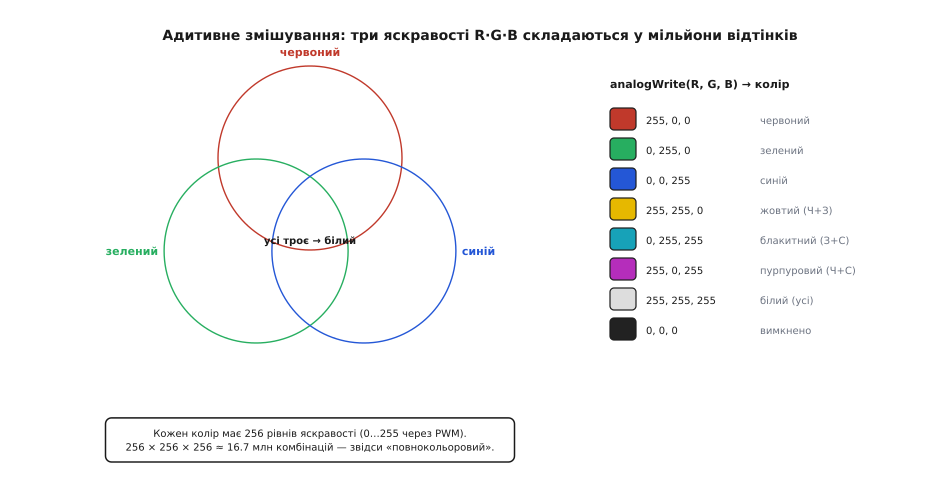
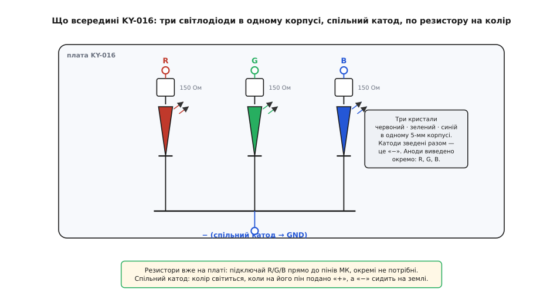
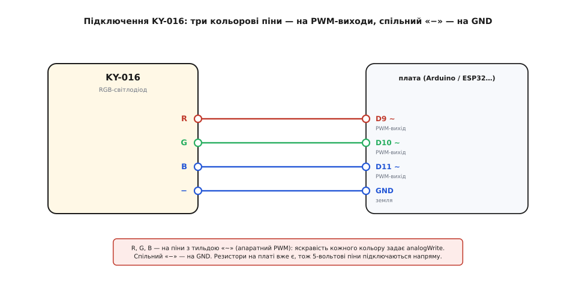

# KY-016 — RGB-світлодіод

<preknowlist>
- [Світлодіод](root:hw-sensing/led-photodiode) — що таке LED і чому він світить лише в один бік і лише від певної напруги: це діод, у якому електрон, падаючи через p-n-перехід, віддає енергію фотоном. KY-016 — три такі діоди в одному корпусі.
- [Закон Ома](root:hw-analog/ohms-law) — напруга = струм · опір; на ньому стоїть розрахунок струмообмежувального резистора, без якого світлодіод згорає.
- [Широтно-імпульсна модуляція (ШІМ)](root:hw-arch/pwm-on-mcu) — як швидким увімк-вимк «підробити» проміжну яскравість; саме нею плата задає силу кожного з трьох кольорів, а отже, і сам відтінок.
- [KY-серія (Keyes 37-в-1)](root:cat-hw-sensors/ky-series) — спільний формат родини: гребінка, живлення 3.3–5 В, «номер важливіший за виробника». KY-016 успадковує цей формат, лише пінів у нього чотири, а не три.
</preknowlist>

Серед синіх платок [KY-серії](root:cat-hw-sensors/ky-series) **KY-016** — та, з якої проєкт уперше починає **світитися кольором**. На вигляд це майже нічого: маленька плата, на ній один прозорий чи матовий 5-міліметровий світлодіод із чотирма ніжками, три дрібні резистори поруч і чорна гребінка на чотири штирі з написами `R G B −`. А вміє вона річ, за якою тягнеться кожен, хто щойно навчив плату блимати: не просто вмикати вогник, а **задавати йому будь-який колір** — від тьмяно-бурштинового до крижано-білого, плавно перетікати з відтінка у відтінок, дихати світлом. Розберімо, що це за світлодіод із трьома кольорами всередині, чому колір узагалі можна «змішати», як плата робить це трьома дротами й однією хитрістю зі швидким миготінням, і чого з цією платкою легко не догледіти.

## Що це і навіщо

KY-016 — це **модуль повнокольорового світлодіода** (англ. *RGB LED*, від Red-Green-Blue — червоний-зелений-синій). Замість одного вогника незмінного кольору він дає один вогник, колір якого ти задаєш програмою. Це найдешевший спосіб дати пристрою **кольоровий сигнал**: зелений — усе гаразд, червоний — помилка, синій — заряджається, жовтий — увага; або просто прикрасу, що переливається веселкою. Один світлодіод замість трьох окремих, одне вічко замість трьох дірок у корпусі — і мільйони можливих відтінків.

Уся хитрість — усередині 5-міліметрового корпусу сидить **не один світлодіодний кристал, а три**: червоний, зелений і синій, притиснуті майже впритул. Око з відстані не розрізняє трьох близьких цяток — воно бачить їхнє світло **злитим в один колір**, так само як здалеку не видно окремих субпікселів на екрані телефона. А раз три чисті кольори зливаються в один, то, керуючи **яскравістю кожного окремо**, можна дістати будь-яку їхню суміш. У цьому вся ідея RGB, і KY-016 — її найпростіше фізичне втілення.

> 🔧 **Навіщо це.** Три світлодіоди в одному корпусі — це не просто економія місця. Головне, що всі три кристали світять **з однієї точки**, тож їхні кольори змішуються **до того**, як світло дійде до ока, і дають чистий рівний відтінок без райдужних облямівок. Постав ти поруч три окремі 5-мм світлодіоди — червоний, зелений, синій — і зблизька бачитимеш три різнокольорові плями, а не один жовтий чи білий вогник. Спільний корпус — саме те, що перетворює «три лампочки» на «один кольоровий піксель». Тому RGB-світлодіод беруть скрізь, де треба **колір як сигнал в одній точці**: індикатор стану приладу, підсвітка кнопки, вогник настрою.

## Три кольори — бо саме з них будується будь-який

Чому саме червоний, зелений і синій, а не, скажімо, жовтий із фіолетовим? Це не примха виробника, а властивість **нашого ока**. У сітківці людини три типи колбочок, чутливих приблизно до червоного, зеленого й синього; будь-який колір, який ми бачимо, мозок збирає з того, наскільки збуджений кожен із трьох типів. Тож щоб **обдурити око будь-яким кольором**, досить трьох джерел світла, що влучають саме в ці три чутливості. Червоний, зелений, синій — це базові кольори не природи, а **людського зору**, і вся кольорова техніка (екрани, камери, ця платка) стоїть на цьому факті.

Складання кольорів зі світла зветься **адитивним змішуванням** (лат. *additivus* — той, що додається): кольори тут не забирають світло, а **додають** його. Це протилежність до фарб. Змішаєш червону й зелену **фарбу** — дістанеш брудно-коричневу, бо кожна фарба **відбирає** частину світла; це віднімання. А от червоне й зелене **світло**, накладені разом, дають **жовте** — яскравіше за кожне окремо, бо світло **додається**. Саме тому з RGB-світла три чисті кольори разом дають не чорне й не буре, а **біле** — суму всього.



*Адитивне змішування трьох кольорів світла. Червоний + зелений = жовтий, зелений + синій = блакитний, червоний + синій = пурпуровий, усі троє на повну = білий, усі троє вимкнені = темрява. Задаючи трьома числами (0…255) яскравість кожного кольору, дістаєш будь-яку клітинку цього простору — звідси «повнокольоровий».*

А тепер ключове: щоб дістати не лише сім чистих сумішей, а **всі проміжні відтінки**, замало вмикати кольори «на повну чи зовсім». Треба вміти світити кожним кольором **наполовину**, **на чверть**, на будь-яку частку. Скажімо, багато червоного, трохи зеленого й зовсім чуть синього — вийде теплий помаранчево-рожевий. Отже, справжнє завдання платки — не просто вмикати три кольори, а **плавно керувати яскравістю кожного**. І тут виходить на сцену прийом, без якого весь RGB не працював би на цифровій платі.

## Як задати «півсвітла»: керування яскравістю через PWM

Мікроконтролер — пристрій цифровий: його пін уміє видати або повні 5 (чи 3.3) вольти, або нуль. Проміжного «половина напруги» на звичайному цифровому піні немає. То як же світити світлодіодом **упівсили**?

Хитрість проста й геніальна: якщо не можна зменшити напругу, можна **швидко-швидко блимати**. Вмикай пін і вимикай сотні разів на секунду — так швидко, що око не встигає помітити окремих спалахів і бачить лише **усереднену яскравість**. Тримаєш пін увімкненим половину часу — світлодіод здається світним наполовину. Увімкненим чверть часу — світить на чверть. Ця частка часу «увімкнено» зветься **шпаруватістю**, а сам прийом — **широтно-імпульсна модуляція**, [ШІМ](root:hw-arch/pwm-on-mcu) (англ. *PWM*, pulse-width modulation): міняємо не висоту імпульсу, а його **ширину** — яку частку періоду пін тримає «+».

На Arduino це робить одна команда — `analogWrite(pin, value)`, де `value` від **0** (завжди вимкнено, темно) до **255** (завжди ввімкнено, повна яскравість), а проміжні числа задають проміжну шпаруватість. Ім'я `analogWrite` трохи оманливе: жодного справжнього аналогового «півнапруги» пін не видає, він саме **блимає** із заданою шпаруватістю — але око бачить результат так, ніби напруга й справді проміжна.

Далі все складається просто. Три кольори — три піни з PWM, три незалежні `analogWrite`. Задаєш трьома числами яскравості R, G, B — і дістаєш їхню суміш:

```
analogWrite(R, 255); analogWrite(G, 0);   analogWrite(B, 0);    // чистий червоний
analogWrite(R, 255); analogWrite(G, 255); analogWrite(B, 0);    // жовтий (Ч+З)
analogWrite(R, 128); analogWrite(G, 0);   analogWrite(B, 128);  // приглушений пурпуровий
analogWrite(R, 255); analogWrite(G, 255); analogWrite(B, 255);  // білий (усі троє на повну)
```

Кожне з трьох чисел має 256 рівнів, тож усього комбінацій **256 × 256 × 256 ≈ 16.7 мільйона** — це ті самі «16.7 млн кольорів», якими хизуються монітори. KY-016, звісно, стількох відтінків оком не покаже, але сам спосіб їх задати — той самий, що й у великого екрана.

> 🔧 **Навіщо це.** Той самий трюк із PWM — це те, як узагалі керують яскравістю світла в цифровій техніці: підсвітка екрана, регульована лампа, індикатор, що плавно розгоряється. Замість дорогого й гарячого способу «гасити зайву напругу на опорі» PWM **не витрачає енергію дарма** — світлодіод або повністю ввімкнений (майже без втрат), або повністю вимкнений (зовсім без втрат), а «півсвітла» виходить із їхнього чергування. Зрозумівши PWM на трьох ніжках KY-016, ти вже знаєш, як плавно керувати будь-яким світлом — і чому це не гріє плату.

## Що на платі KY-016

Тепер від ідеї до конкретної платки. Уся вона — це:

```
RGB-світлодіод 5 мм    — три кристали (Ч/З/С) в одному корпусі, спільний катод
3 резистори (≈150 Ом)  — струмообмежувальні, по одному на колір
гребінка на 4 штирі    — R · G · B · −  (три аноди й спільний катод)
```

І це все. Головне, що відрізняє KY-016 від трьох окремих світлодіодів і що конче треба зрозуміти, — це **спільний катод** (гр. *káthodos* — шлях униз; вивід, куди струм у діод входить із боку «−»). Три кристали всередині з'єднані **однією спільною ніжкою з боку мінуса**, а їхні плюсові виводи (аноди) виведені нарізно — це і є R, G, B. Тобто спільний штир `−` іде на землю, а колір світиться тоді, коли на **його** пін (R, G чи B) подано «+». Немає плюса на піні кольору — цей колір темний.



*Що всередині KY-016. Три світлодіодні кристали ділять спільний катод (нижня шина → пін «−»), а їхні аноди виведено окремо на піни R, G, B, кожен через свій струмообмежувальний резистор ≈150 Ом. Колір горить, коли на його пін подано «+», а «−» сидить на землі. Резистори вже стоять на платі, тож зовнішні не потрібні.*

Отут криється **перша пастка**, і вона підступна: трапляється й **спільний анод**. Частина клонів KY-016 (і споріднений SMD-модуль KY-009) зроблена навпаки — спільна ніжка йде на **«+»**, а колір вмикається подачею **низького** рівня (землі) на його пін. Логіка керування тоді **дзеркальна**: `0` — повна яскравість, `255` — темрява. Якщо ти під'єднав усе правильно, а вогник поводиться навпаки (яскравіє, коли має гаснути), — майже напевно тобі трапився варіант зі спільним анодом; лікується це інверсією значень у коді (`255 − value`). Тому перше, що варто зробити з новою платкою, — **глянути на напис** біля спільного штиря: `−` (або `GND`, `G`, `C`) означає спільний катод, `+` (або `VCC`) — спільний анод.

**Друга особливість — резистори вже на платі.** На кожен із трьох кольорів стоїть свій струмообмежувальний резистор, тому KY-016 можна чіпляти прямо до пінів плати **без жодних зовнішніх деталей** — на відміну від голого RGB-світлодіода, якому три резистори довелося б доставляти самому. Номінал типово **150 Ом** на всіх трьох (буває й 1 кОм — тоді світить помітно тьмяніше). І тут ховається дрібниця, яку корисно розуміти: однакові резистори **не дають однакової яскравості** трьох кольорів.

**Чому колір при R=G=B не виходить чисто білим.** Річ у різних **прямих напругах** трьох кристалів. Червоному світлодіоду треба близько 1.8 В, а зеленому й синьому — близько 2.8 В (їхні фотони енергійніші, тож і напруга вища). За [законом Ома](root:hw-analog/ohms-law) через однаковий резистор при більшій напрузі на світлодіоді лишається менша напруга на резисторі, а отже — менший струм. Порахуймо струм кожного кольору на резисторі 150 Ом від 5 В (нехтуючи для простоти опором самого світлодіода):

```
червоний:  I = (5 − 1.8) / 150 = 3.2 / 150 ≈ 0.0213 А ≈ 21 мА
зелений:   I = (5 − 2.8) / 150 = 2.2 / 150 ≈ 0.0147 А ≈ 15 мА
синій:     I = (5 − 2.8) / 150 = 2.2 / 150 ≈ 0.0147 А ≈ 15 мА
```

Отже, червоний канал жене більший струм, ніж зелений і синій, — а до цього ще й наше око по-різному чутливе до кольорів (найдужче до зеленого). Тому, подавши `R=G=B=255`, чистого нейтрально-білого ти **не дістанеш**: вийде відтінок із перекосом. Щоб зробити білий справді білим, яскравості кольорів **балансують у коді** — приглушують один, підкручують інший, доки око не скаже «біле». Це не вада платки, а звичайна властивість будь-якого RGB-джерела; докладніше про баланс кольорів, гамма-корекцію (чому півшпаруватості — це не «половина яскравості» для ока) і перерахунок відтінків — в [окремій вставці про математику змішування кольорів](root:cat-hw-actuators/ky-016-rgb/math-color-mixing.md).

## Підключення до плати

Чотири штирі, чотири дроти. Три кольорові піни `R`, `G`, `B` ідуть на **PWM-здатні** виходи плати, а спільний `−` — на землю.



*Розводка пін-у-пін. Кольорові піни R, G, B — на виходи з апаратним PWM (на Arduino Uno їх позначено тильдою «~»: D3, D5, D6, D9, D10, D11); спільний «−» — на GND. Живлення окремим дротом не потрібне: «живить» кольори сам сигнальний пін через резистор на платі.*

Виходить так:

```
R  →  PWM-пін  (з «~»: напр. D9 на Uno)
G  →  PWM-пін  (напр. D10)
B  →  PWM-пін  (напр. D11)
−  →  GND
```

Тут є **третя пастка, специфічна саме для цієї платки: не будь-який пін годиться**. Оскільки яскравість задають через `analogWrite`, усі три кольорові піни мають бути з тих, що вміють **апаратний PWM**. На Arduino Uno таких лише шість, і вони позначені тильдою `~` на платі (D3, D5, D6, D9, D10, D11). Заведеш колір на звичайний цифровий пін без `~` — `analogWrite` там працюватиме як простий `digitalWrite`: колір зможе бути тільки «повністю ввімкнений» або «вимкнений», без проміжних яскравостей, і плавні відтінки зникнуть. Тому три кольори KY-016 садять **саме на піни з тильдою**.

На **[ESP32](root:cat-hw-boards/esp32-family)** ситуація і краща, і трохи інша: там PWM (модуль `LEDC`) можна прив'язати майже до **будь-якого** GPIO, тож жорсткого списку «тільки ці піни» немає — зате й команда інша (`ledcWrite`), бо `analogWrite` там з'явився не одразу. Суть та сама: три канали PWM на три кольори.

І звичне для серії застереження про напругу — але тут воно м'якше. Резистори на платі розраховані під **5 В**; від 3.3 В (як на ESP32) світлодіоди просто світитимуть тьмяніше, і це безпечно. А от у зворотний бік пильнуй: KY-016 — це **вихід**, плата ним керує, тож 5-вольтові рівні йдуть від плати до світлодіода, а не навпаки, і проблеми «5 В на 3.3-вольтовий вхід» тут немає — небезпека такого штибу стосується давачів-входів, а не світлодіода-виходу.

## Керуємо кольором у коді

Найпростіша програма запалює один заданий колір — трьома `analogWrite`. Уся принада RGB в тому, що «запалити колір» — це просто виставити три числа. Загорнімо ці три виклики в одну функцію `setColor`, щоб далі говорити кольорами, а не пінами.

**Умова.** KY-016 зі спільним катодом: R на D9, G на D10, B на D11, спільний `−` на GND. Хочемо світити теплим помаранчевим.

:::tabs
```cpp
const uint8_t PIN_R = 9;    // усі три — PWM-піни (з «~» на Uno)
const uint8_t PIN_G = 10;
const uint8_t PIN_B = 11;

void setColor(uint8_t r, uint8_t g, uint8_t b) {
  analogWrite(PIN_R, r);    // 0 = колір вимкнено, 255 = повна яскравість
  analogWrite(PIN_G, g);
  analogWrite(PIN_B, b);
}

void setup() {
  setColor(255, 90, 0);     // багато червоного, трохи зеленого, без синього → помаранчевий
}

void loop() {}
```
```micropython
from machine import Pin, PWM

# ESP32: PWM на майже будь-якому GPIO; частота 1 кГц, 8-бітна шкала 0…255
r = PWM(Pin(25), freq=1000, duty_u16=0)
g = PWM(Pin(26), freq=1000, duty_u16=0)
b = PWM(Pin(27), freq=1000, duty_u16=0)

def set_color(cr, cg, cb):
    r.duty_u16(cr * 257)      # 0…255 → 0…65535 (257 = 65535/255)
    g.duty_u16(cg * 257)
    b.duty_u16(cb * 257)

set_color(255, 90, 0)         # помаранчевий
```
:::

Зверни увагу на дрібницю в MicroPython-версії: ESP32 задає шпаруватість 16-бітним числом (`duty_u16`, 0…65535), тож звичну шкалу 0…255 множимо на 257, щоб дотягтися до повного розмаху. Це та сама «яскравість 0…255», лише в іншій одиниці.

А щоб побачити всю принаду RGB, найкраще запустити **плавний перебіг веселки** — колір, що безперервно перетікає по всіх відтінках. Найпростіший спосіб: уявити колір як точку, що біжить по колу («колесо кольорів»), і на кожному кроці перераховувати її в трійку R, G, B.

**Умова.** Той самий монтаж; хочемо, щоб вогник плавно й нескінченно перетікав червоний → зелений → синій → червоний.

```cpp
const uint8_t PIN_R = 9, PIN_G = 10, PIN_B = 11;

void setColor(uint8_t r, uint8_t g, uint8_t b) {
  analogWrite(PIN_R, r);
  analogWrite(PIN_G, g);
  analogWrite(PIN_B, b);
}

// позиція 0..255 по «колесу»: перетікання Ч→З→С→Ч
void wheel(uint8_t pos) {
  if (pos < 85)        setColor(255 - pos * 3, pos * 3, 0);          // червоний → зелений
  else if (pos < 170) { pos -= 85; setColor(0, 255 - pos * 3, pos * 3); } // зелений → синій
  else                { pos -= 170; setColor(pos * 3, 0, 255 - pos * 3); } // синій → червоний
}

void setup() {}

void loop() {
  for (int p = 0; p < 256; p++) {   // повний оберт колеса
    wheel(p);
    delay(15);                      // швидкість перетікання
  }
}
```

Кожні 15 мілісекунд колір трохи зсувається по колу, і за кілька секунд вогник проходить усю веселку. Уся логіка — в одній функції `wheel`, що ділить коло на три ділянки й на кожній гасить один колір, поки розгоряється сусідній; сума трьох завжди дає насичений відтінок. Це найдешевша веселка, але не найрівніша: така функція «зі сталою сумою» помітно просідає яскравістю на жовтому й блакитному, а справжній рівний обхід дає модель HSV. Її, разом із гамма-корекцією для рівної на око яскравості, підтримкою і катода, і анода та переносом на ESP32, зібрано в [окремий довідник керування з робочим кодом](root:cat-hw-actuators/ky-016-rgb/api-rgb-control.md).

## Чого стерегтися

KY-016 підкупає простотою, але кілька речей ловлять новачка регулярно.

**Катод чи анод.** Найчастіша плутанина: код написано під спільний катод (`255` — яскраво), а платка виявилася зі спільним анодом (там `255` — темно). Симптом — вогник поводиться «навпаки». Перевір напис біля спільного штиря й, якщо треба, інвертуй значення в коді.

**Порядок пінів `R G B` не завжди такий.** На деяких клонах піни підписані `− G R B` або в іншому порядку, ніж очікуєш. Якщо кольори переплутані (просиш червоний — світить синій), не переставляй дроти навмання — **звір написи на платі** й приведи у відповідність номери пінів у коді.

**Тільки PWM-піни.** Кольорові піни мусять бути PWM-здатні (з `~` на Uno), інакше замість плавних відтінків дістанеш лише вісім чистих комбінацій «увімк/вимк». Це найтиповіша причина, чому «півкольори не виходять».

**Білий не зовсім білий.** Через різні прямі напруги й нерівну чутливість ока `R=G=B` дає відтінок із перекосом, а не нейтральний білий. Хочеш справжній білий — **балансуй** канали в коді.

**Кут і розсіювання.** У прозорого (не матового) 5-мм світлодіода світло вузьке й напрямлене, і зблизька три кольори можуть **не встигати злитися** — видно кольорові облямівки. Матовий (дифузний) корпус змішує кольори краще; якщо потрібен рівний колір із близької відстані, бери KY-016 із матовим світлодіодом або накрий його розсіювачем.

**Це один вогник, не стрічка.** І тут — головна межа платки. KY-016 — **один** RGB-світлодіод на трьох спільних PWM-каналах: він світить одним кольором за раз, хай і будь-яким. Треба багато незалежно кольорових точок (біжучий вогонь, гірлянда, матриця, де кожна крапка своя) — і трьох PWM-каналів уже не досить: це вже **адресні** світлодіоди (WS2812 та подібні), де кожен діод має власний контролер і слухає спільний дріт-дані. Там і принцип інший — не три аналогові яскравості, а цифровий потік кольорів по одному дроту, — і код інший; KY-016 закінчується рівно на межі «один вогник».
