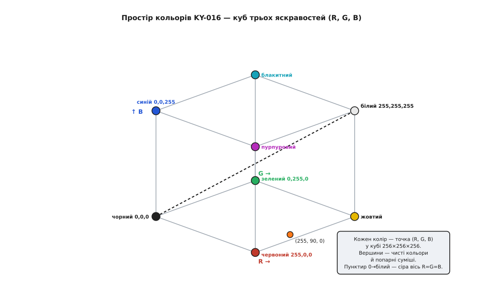
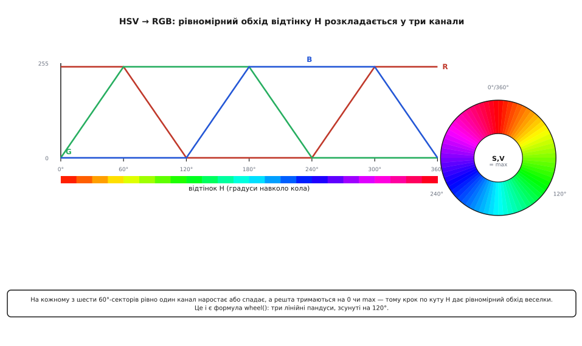

# 🧮 Математика змішування кольорів

Три числа — і будь-який колір. У цьому вся обіцянка RGB-світлодіода: подаєш трійку `(R, G, B)`, кожне від 0 до 255, і дістаєш відтінок. Але за цією простотою ховається чотири окремі математичні сюжети, і кожен, якщо його не розуміти, ловить на дрібниці. Чому взагалі трьох чисел досить, а не чотирьох чи десяти? Чому `R=G=B` — начебто «порівну всіх» — дає не чистий білий, а відтінок із перекосом? Чому шпаруватість ШІМ 50% око бачить зовсім не як «половину яскравості»? І як зробити так, щоб вогник обходив веселку **рівно**, без ривків і провалів? Розберімо всі чотири — від першопричини, а не як набір готових формул.

<preknowlist>
- [Широтно-імпульсна модуляція (ШІМ)](root:hw-arch/pwm-on-mcu) — як швидким увімк-вимк задають частку часу «увімкнено» (шпаруватість) і цим — усереднену яскравість; тут ми беремо цю шпаруватість як число 0…255 і питаємо, що з нього бачить око.
- [Закон Ома](root:hw-analog/ohms-law) — напруга = струм · опір; на ньому стоїть увесь висновок, чому через однакові резистори три кольори жену́ть різний струм.
- [Світлодіод](root:hw-sensing/led-photodiode) — що прямá напруга діода задана шириною забороненої зони (енергією фотона): саме звідси беруться різні напруги червоного, зеленого й синього кристалів.
</preknowlist>

## Простір кольору — куб трьох яскравостей

Почнімо з питання «скільки чисел». Око людини має три типи колбочок — грубо кажучи, «червоний», «зелений» і «синій» приймачі. Будь-яке відчуття кольору мозок збирає з того, наскільки збуджений кожен із трьох. Це означає дивовижну річ: **колірне відчуття — тривимірне**. Не тому, що світло має три складові (спектр світла — це нескінченний набір довжин хвиль, ціла крива), а тому, що око стискає всю цю криву до **трьох чисел** — трьох ступенів збудження трьох приймачів. Дві геть різні спектральні криві, що дають однакові три збудження, око бачить як **той самий колір** (це зветься метамерія). Тому щоб відтворити будь-який видимий колір, теоретично досить трьох незалежних джерел — саме стільки вимірів має простір, який ми намагаємось заповнити.

Отже, стан KY-016 — це три яскравості, а три числа природно лягають у **точку тривимірного простору**. Позначмо їх нормованими на одиницю (255 → 1.0), і весь набір досяжних кольорів стає **одиничним кубом**:

```
колір = (r, g, b),   де 0 ≤ r, g, b ≤ 1
       r — яскравість червоного каналу
       g — яскравість зеленого
       b — яскравість синього
```

Кожна вершина куба — крайній випадок. `(0,0,0)` — усе вимкнено, чорний (точніше, темрява). `(1,1,1)` — усі три на повну, білий. Три вершини на осях — чисті `(1,0,0)` червоний, `(0,1,0)` зелений, `(0,0,1)` синій. Три «дальні» вершини — попарні суми: `(1,1,0)` жовтий (червоний + зелений), `(0,1,1)` блакитний (зелений + синій), `(1,0,1)` пурпуровий (червоний + синій). Це і є та класична семиколірна діаграма перетину кіл — лише розгорнута в три виміри.



*Простір кольору KY-016 — куб 256×256×256. Кожна досяжна фарба світла — точка в кубі; вісім вершин — чисті кольори й попарні суміші; пунктирна діагональ 0→білий — сіра вісь, де всі три яскравості рівні. Точка всередині (наприклад теплий помаранчевий 255, 90, 0) — довільна суміш.*

> 🔧 **Навіщо це.** Куб — не абстракція заради краси, а робочий інструмент. Пряма лінія в кубі — це **плавний перехід** між двома кольорами: щоб перетекти з червоного `(1,0,0)` у синій `(0,0,1)`, ведеш точку по відрізку між ними, лінійно міняючи всі три координати. Головна діагональ `(0,0,0)→(1,1,1)` — це **вісь сірого**: усі точки на ній мають рівні складові, від чорного до білого через сірі. А відстань між двома точками куба грубо підказує, наскільки два кольори різні на око. Тримаючи в голові цю картинку, ти перестаєш думати про колір як про «магічну трійку» й починаєш бачити геометрію: змішати — скласти вектори, приглушити — помножити на скаляр, перейти — рушити по прямій.

Важлива тонкість: цей куб — простір **того, що ти задаєш**, а не рівно того, що бачить око. Дві причини викривляють відповідність між координатою й відчуттям. Перша — фізична: рівні цифрові значення трьох каналів не дають рівної **сили світла** (чому — розбираємо на прикладі білого нижче). Друга — перцептивна: рівні кроки координати не дають рівних кроків **яскравості на око** (це сюжет гамма-корекції). Обидва викривлення — не вади платки, а властивості світла й зору; їх треба знати, щоб куб працював чесно.

## Чому R=G=B не дає чистого білого

Логіка підказує: якщо `(1,1,1)` — це білий, то й `(0.5, 0.5, 0.5)` має бути нейтральним сірим, а `(1,1,1)` — нейтральним білим. «Порівну всіх трьох» — звідки взятися перекосу? А перекіс усе одно є, і причин рівно дві, обидві варті розуміння.

**Причина перша: різні прямі напруги → різні струми.** Колір світлодіодного кристала задається шириною його забороненої зони — тим стрибком енергії, що його електрон віддає фотоном, падаючи через p-n-перехід. Енергія фотона й довжина хвилі жорстко пов'язані:

```
E = h·c / λ
    E — енергія фотона
    h — стала Планка   (6.626·10⁻³⁴ Дж·с)
    c — швидкість світла (3·10⁸ м/с)
    λ — довжина хвилі світла
```

Синій фотон (λ ≈ 465 нм) енергійніший за червоний (λ ≈ 630 нм) — коротша хвиля, більша енергія. А що більша енергія фотона, то ширша потрібна заборонена зона, то **вища пряма напруга** кристала. Тому червоний світлодіод (матеріал AlGaInP) відкривається близько 1.8–2.0 В, а зелений і синій (InGaN — ширша зона) потребують близько 2.8–3.2 В. Це не примха, а прямий наслідок того, що синє світло «дорожче» за червоне енергетично.

Тепер згадаймо, що на платі KY-016 стоять **однакові** резистори — типово по 150 Ом на кожен колір. За [законом Ома](root:hw-analog/ohms-law) струм у гілці — це напруга на резисторі, поділена на його опір, а напруга на резисторі — це те, що лишилося від живлення після падіння на самому світлодіоді. Порахуймо струм кожного каналу від 5 В (нехтуючи для простоти власним опором кристала):

**Умова.** Живлення 5 В, резистор 150 Ом на кожен колір, прямі напруги: червоний 1.8 В, зелений і синій 2.8 В. Скільки струму жене кожен канал при повній яскравості?

```
червоний:  I_R = (5 − 1.8) / 150 = 3.2 / 150 = 0.0213 А ≈ 21.3 мА
зелений:   I_G = (5 − 2.8) / 150 = 2.2 / 150 = 0.0147 А ≈ 14.7 мА
синій:     I_B = (5 − 2.8) / 150 = 2.2 / 150 = 0.0147 А ≈ 14.7 мА
```

**Висновок:** червоний канал жене **майже в півтора раза** більший струм, ніж зелений і синій. А сила світла світлодіода росте приблизно пропорційно струму. Тож навіть якщо цифрово задати `R=G=B=255`, **червоний фізично світитиме яскравіше** за інші два — просто тому, що через нього тече більший струм. Уже самих резисторів досить, щоб білий поїхав у теплий, червонястий бік.

Ці числа прив'язані до напруги живлення, а вона в різних систем різна, і перекіс від неї сильно залежить. П'ять вольт — рівень AVR-плат на кшталт Arduino Uno. На 3.3-вольтовій логіці (ESP32, більшість STM32) після 2.8 В прямої напруги на резисторі лишається якихось 0.5 В: `(3.3 − 2.8)/150 ≈ 3.3 мА` проти `(3.3 − 1.8)/150 = 10 мА` у червоного. Перекіс уже не в півтора раза, а **втричі**, а зелений із синім помітно тьмяніють. Тому баланс білого — величина не платки, а зв'язки «платка + це живлення»: змінив 5 В на 3.3 В — перераховуй.

**Причина друга: око по-різному чутливе до кольорів.** Навіть якби всі три кристали давали однакову силу світла (у ватах), око однаково не сприйняло б їх як рівнояскраві. Чутливість людського зору залежить від довжини хвилі: вона максимальна в зеленому (пік удень — близько 555 нм) і різко падає в синьому й далекому червоному. Ту саму фізичну потужність зеленого світла ми бачимо набагато яскравішою, ніж синього. Кольорова техніка ловить це стандартними ваговими коефіцієнтами світлоти (їх задає стандарт Rec. 709 / sRGB — той самий, за яким живуть монітори):

```
Y = 0.2126·R + 0.7152·G + 0.0722·B
    Y — світлота (яскравість на око) кольору
    ваги: червоний 0.2126, зелений 0.7152, синій 0.0722
```

Ці три числа приголомшують. Зелений тягне на себе **майже три чверті** відчуття яскравості, а синій — лише сім відсотків. Проста арифметика: `0.7152 / 0.0722 ≈ 9.9` — при однаковій цифровій величині зелений внесок в яскравість **майже вдесятеро** більший за синій. Тому додати трохи зеленого — помітно освітлити колір, а піддати синього — ледве зрушити яскравість, натомість сильно охолодивши відтінок.

> 🔧 **Навіщо це.** Дві причини складаються й псують білий з обох боків: резистори штовхають його в червоне (більший струм червоного), а нерівна чутливість ока робить зелений непропорційно вагомим. Тому повна шпаруватість на всіх трьох каналах — `(255, 255, 255)` — на реальному KY-016 дає не чистий, а **перекошений** білий — найчастіше жовтяво-рожевий. Лікується це **балансом білого**: у коді навмисно занижують один-два канали, доки око не скаже «нейтрально». Наприклад, лишити червоний повним, а зелений і синій ледь підняти, або навпаки — приглушити червоний множником десь 0.8. Точні числа залежать від конкретного екземпляра платки (розкид напруг кристалів помітний), тож баланс підбирають на око або калібрують. Головне — не чекати чистого білого «задарма» й закласти три множники калібрування в код одразу. Той самий баланс білого, лише з боку камери, розбирає атом [про баланс білого](root:sf-visual/color-formats).

Формально баланс білого — це просто три множники калібрування, накладені перед видачею в порт:

```
R_out = round(k_R · R)      типово, наприклад: k_R ≈ 0.80
G_out = round(k_G · G)                          k_G ≈ 1.00
B_out = round(k_B · B)                          k_B ≈ 0.90
```

де коефіцієнти підбирають так, щоб `(255,255,255)` після множення давав на око нейтральний білий. Це зсуває «стелю» кожного каналу, вирівнюючи внески.

## Гамма: чому 50% шпаруватості — це не половина яскравості

Ось найпідступніша пастка, і вона суто перцептивна. Задаєш шпаруватість ШІМ рівно 50% — світлодіод фізично увімкнений половину часу, віддає половину світлової енергії. Логічно чекати, що око побачить «половину яскравості». А око бачить **приблизно чверть**. Приглушиш до 25% шпаруватості — здасться, ніби світло впало не до чверті, а до кількох відсотків. Чому?

Бо **зір нелінійний**. Око еволюціонувало бачити в діапазоні освітленості від зоряної ночі до сонячного полудня — це мільярди разів різниці. Щоб охопити такий розмах, воно реагує не на **абсолютну** силу світла, а приблизно на її **логарифм**: сприймає радше **у скільки разів** яскравіше, ніж **на скільки**. Наслідок — око надзвичайно чутливе до змін у темряві й майже байдуже до змін у яскравому. Різницю між 1% і 2% світла ти помітиш легко (це вдвічі), а між 90% і 91% — ніяк.

Цю нелінійність добре наближає **степенева крива**. Зв'язок між фізичною силою світла (тим, що дає ШІМ лінійно) і сприйнятою яскравістю (тим, що відчуває око) моделюють показником **гамма**, і для зору він близький до 2.2:

```
perceived ≈ linear^2.2      (наближено, γ ≈ 2.2)
    linear    — фізична частка світла (= шпаруватість ШІМ, 0…1)
    perceived — сприйнята яскравість (0…1)
```

Підставмо шпаруватість 0.5:

```
perceived = 0.5^2.2 = 0.218 ≈ 22%
```

Ось воно. Половина фізичного світла — це для ока лише **22%** яскравості. А чверть шпаруватості:

```
perceived = 0.25^2.2 = 0.048 ≈ 5%
```

Чверть часу «увімкнено» око бачить як **п'ять відсотків**. Тому наївний лінійний повзунок яскравості почувається огидно: перша чверть ходу немов «вибухає» від темряви до майже повного світла, а остання половина — мертва зона, де нічого не змінюється. Ти рухаєш повзунок від 128 до 255, а око майже не бачить різниці.


*Гамма-крива зору. Наївно очікувана відповідність (пунктир) — пряма: скільки шпаруватості, стільки й яскравості. Реальне око (крива) тисне низ донизу: 50% шпаруватості → лише ~22% сприйнятої яскравості. Щоб яскравість росла рівно на око, шпаруватість треба гнати по цій кривій, а не по прямій.*

**Розв'язок — гамма-корекція.** Раз око стискає світло степенем 2.2, ми маємо наперед **розтягти** сигнал оберненим степенем, щоб два викривлення взаємно скасувалися. Ти хочеш задавати число `L` у «перцептивній» шкалі (де подвоєння `L` = вдвічі яскравіше на око), а на порт видати таку шпаруватість, щоб око побачило саме `L`. Обертаємо формулу:

```
duty = round( 255 · (L / 255)^(1/2.2) )
    L    — бажана яскравість у перцептивній шкалі (0…255)
    duty — шпаруватість, яку слати в ШІМ-канал (0…255)
    1/2.2 ≈ 0.4545 — обернений показник (кодувальна гамма)
```

Число 255 тут — не магія, а просто **повна шкала** ШІМ: у 8-бітного таймера повний період і справді дає 255, у ширшого (13 біт у LEDC на ESP32, довільний період `ARR` у STM32) на його місці стоїть свій максимум. Формула та сама, міняється лише верхня межа.

Порахуймо кілька точок і перевіримо, що око справді дістане те, що просили:

**Умова.** Хочемо перцептивну яскравість 10%, 25%, 50%, 75%. Яку шпаруватість слати і що око реально побачить?

```
L=10%:  duty = 255·(0.10)^0.4545 = 255·0.354 = 90    → око: (90/255)^2.2  = 10.1%  ✓
L=25%:  duty = 255·(0.25)^0.4545 = 255·0.534 = 136   → око: (136/255)^2.2 = 25.1%  ✓
L=50%:  duty = 255·(0.50)^0.4545 = 255·0.730 = 186   → око: (186/255)^2.2 = 50.0%  ✓
L=75%:  duty = 255·(0.75)^0.4545 = 255·0.879 = 224   → око: (224/255)^2.2 = 75.2%  ✓
```

**Висновок:** щоб око бачило «половину», у порт треба слати не 128, а **186** — бо світлодіод має бути ввімкнений 73% часу, аби здатися напівяскравим. Обернена крива вигинає шкалу так, що рівні кроки `L` дають рівні кроки **відчуття**. Ось таблиця відповідності, готова лягти в код:

```
бажана яскравість L    шпаруватість duty
       0 %                    0
      10 %                   90
      25 %                  136
      50 %                  186
      75 %                  224
     100 %                  255
```

> 🔧 **Навіщо це.** Гамма-корекція — це те, що відрізняє «дихання» світлом, яке приємно дивитися, від смикання. Хочеш, щоб вогник плавно розгорявся й гаснув (ефект «подиху») — жени `L` рівномірно вгору-вниз, а на порт видавай `duty` через обернену формулу; тоді око побачить рівну зміну. Прожени лінійно саму шпаруватість — і «подих» вийде рваний: різкий спалах на старті, довге тьмяне доживання наприкінці. Ту саму корекцію застосовують для **плавних переходів між кольорами** й для того, щоб приглушений на 10% колір справді виглядав приглушеним, а не вимкненим. На практиці степінь 1/2.2 рахують не щоразу (це повільно), а раз заганяють у **таблицю на 256 входів**: попередньо обчислюють усі 256 значень `duty` і потім лише беруть готове число за індексом `L` — одне звертання до пам'яті замість степеневої функції на кожен кадр.

Дрібне уточнення чесності заради: показник 2.2 — зручне наближення. Точна крива стандарту sRGB — степенева з показником 2.4 плюс короткий лінійний «носок» біля нуля (щоб уникнути нескінченної похідної в темряві), і разом вони поводяться приблизно як 2.2. Для KY-016 різниця між 2.2 і точною sRGB-кривою непомітна оком, тож степінь 2.2 (а часто й дешевша ціла 2) — цілком годяща.

## HSV → RGB: рівний обхід веселки

Останній сюжет — про рух по кольорах. Куб зручний для геометрії, але жахливий, коли хочеш просто **перебрати всі відтінки** веселки. Спробуй-но описати «яскраво-помаранчевий» через `(r,g,b)` — доведеться в голові підбирати три числа. А людині природніше думати про колір інакше: *який* це відтінок (червоний? бірюзовий? фіолетовий?), *наскільки* він насичений (соковитий чи блідий до сірого) і *наскільки* яскравий. Це три осі моделі **HSV** (Hue-Saturation-Value — відтінок-насиченість-яскравість):

```
H — відтінок:    кут 0…360° по кольоровому колу (0°=червоний, 120°=зелений, 240°=синій)
S — насиченість: 0 = сірий (без кольору), 1 = чистий насичений колір
V — яскравість:  0 = чорний, 1 = повна сила
```

Головна зручність — **відтінок H — це кут**. Хочеш обійти всю веселку рівно? Просто збільшуй H від 0° до 360° рівними кроками, тримаючи `S=V=1`. Точка їде по колу, вогник плавно перетікає червоний → жовтий → зелений → блакитний → синій → пурпуровий → назад у червоний. Один параметр замість трьох — і обхід гарантовано рівномірний по відтінку.

Але KY-016 не розуміє кутів — йому потрібні три яскравості. Тож треба **перевести** `(H, S, V)` у `(R, G, B)`. Виведімо це перетворення для випадку `S=V=1` (найяскравіше насичене коло — саме те, що потрібне для веселки), бо саме воно пояснює, звідки береться «колесо».

Розділимо коло на **шість секторів по 60°**. Ключове спостереження: у кожному секторі **один канал тримається на максимумі, другий — на нулі, а третій лінійно повзе** між ними. Позначмо `hp = H / 60` (номер сектора з дробом) і `x` — той канал, що якраз переходить:

```
x = 1 − |hp mod 2 − 1|      (лінійний пандус 0→1→0 усередині кожної пари секторів)

сектор 0 (  0…60°):  R=1,  G=x,  B=0    червоний → жовтий
сектор 1 ( 60…120°): R=x,  G=1,  B=0    жовтий  → зелений
сектор 2 (120…180°): R=0,  G=1,  B=x    зелений → блакитний
сектор 3 (180…240°): R=0,  G=x,  B=1    блакитний → синій
сектор 4 (240…300°): R=x,  G=0,  B=1    синій   → пурпуровий
сектор 5 (300…360°): R=1,  G=0,  B=x    пурпуровий → червоний
```

Погляньмо, що це означає. У першому секторі червоний стоїть повний, синій вимкнений, а **зелений розгоряється** від 0 до повного — червоний плавно жовтіє. У другому зелений уже повний, синій нуль, а **червоний гасне** — жовтий зеленіє. І так по колу: на кожному стику один канал доходить до краю, і естафету підхоплює наступний. Три канали — це три однакові трапеції-хвилі, зсунуті одна від одної рівно на 120°.



*HSV→RGB при S=V=1. Обхід відтінку H по колу розкладається на три канальні хвилі, зсунуті на 120°: на кожному 60°-секторі рівно один канал наростає або спадає, решта тримаються на 0 чи максимумі. Рівний крок по куту H → рівний обхід веселки. Праворуч ті самі шість секторів, згорнуті в колесо.*

**Умова.** Візьмімо H = 30° (середина першого сектора), S=V=1. Який це RGB?

```
hp = 30 / 60 = 0.5           → сектор 0
x  = 1 − |0.5 mod 2 − 1| = 1 − |0.5 − 1| = 1 − 0.5 = 0.5
сектор 0:  R=1, G=x=0.5, B=0
у шкалі 0…255:  (255, 128, 0)  — насичений помаранчевий  ✓
```

Рівно посередині між червоним (0°) і жовтим (60°) виходить помаранчевий — саме як слід. Крутячи H рівномірно, дістаєш рівномірний обхід усього кольорового кола.

> 🔧 **Навіщо це.** Одна тонкість тут — джерело поширеної помилки, і варте окремого слова. Проста функція «колеса», яку часто пишуть для веселки (типу тієї, що ділить діапазон 0…255 на три ділянки й на кожній гасить один канал, поки розгоряється сусідній), тримає **сталою суму** трьох каналів: `R+G+B ≈ 255`. А справжній HSV тримає сталим **максимум**: `max(R,G,B) = 255`. Різниця вилазить рівно на **вторинних кольорах**. Візьми жовтий: справжній HSV дає `(255, 255, 0)` — обидва канали повні, колір яскравий; наївне «колесо зі сталою сумою» дасть у тій точці десь `(128, 128, 0)` — той самий відтінок, але **удвічі тьмяніший**. Тому веселка на наївному колесі помітно «просідає» яскравістю на жовтому, блакитному й пурпуровому, а на чистих червоному-зеленому-синьому спалахує — виходить пульсація яскравості замість рівного світіння. Хочеш веселку рівної яскравості — бери справжній HSV зі сталим максимумом, а не колесо зі сталою сумою. Різниця в коді копійчана, а на око — величезна.

Складімо тепер усі чотири сюжети докупи, бо саме разом вони дають гарний колір, а не кожен окремо. Береш бажаний **відтінок** як кут H і переводиш його в трійку `(R,G,B)` через HSV (сталий максимум — рівна веселка). Множиш кожен канал на свій **коефіцієнт балансу білого** (щоб нейтральне було нейтральним, а не жовтявим). Проганяєш кожне число через **гамма-корекцію** (щоб яскравість і переходи виглядали рівно для ока, а не рвано). І аж тоді віддаєш три готові числа трьом каналам ШІМ — байдуже, як цей канал зветься в твоєму середовищі: `analogWrite()` в Arduino, канал `ledc` у ESP-IDF, регістр порівняння `CCR` таймера під STM32 HAL. Кожен крок латає своє викривлення: HSV — зручність обходу, баланс — фізику різних струмів і нерівну чутливість, гамма — нелінійність зору. Пропустиш будь-який — і те саме залізо KY-016 світитиме помітно гірше, ніж могло б, хоча жодна деталь на платі не зміниться.
