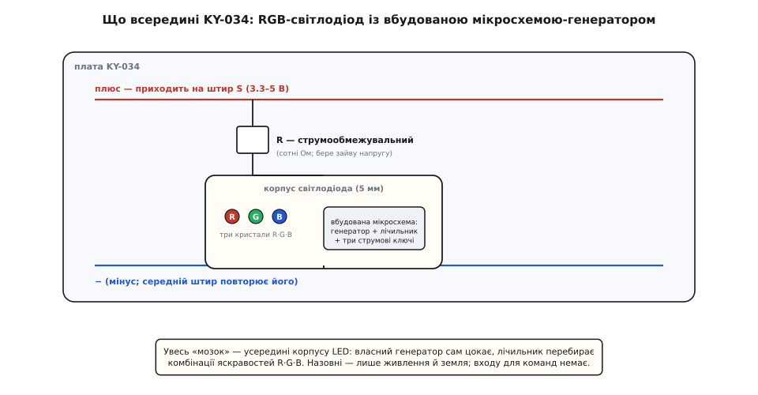
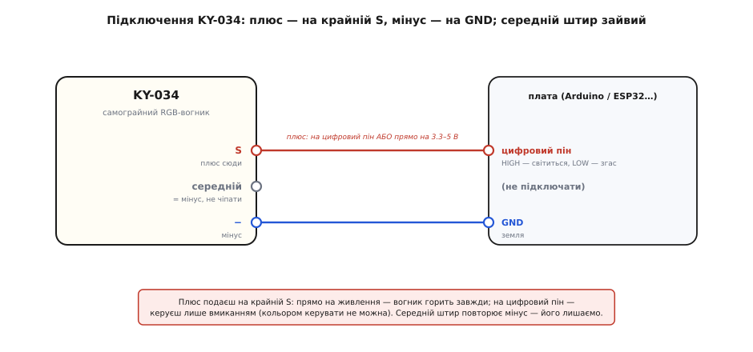

# KY-034 — 7-кольоровий миготливий LED

<preknowlist>
- [Світлодіод (LED)](root:hw-motion/led) — що це, чому має полярність і чому струм крізь нього треба обмежувати резистором; уся плата KY-034 — обгортка навколо одного світлодіода.
- [Цифровий вивід GPIO](root:hw-digital/gpio) — що означає «пін HIGH / LOW» і що з нього тече струм; єдиний спосіб керувати цим модулем — подати HIGH або LOW.
- [ШІМ (PWM)](root:hw-analog/pwm) — швидке вмикання-вимикання, яким змішують яскравість; саме так мікросхемка всередині LED домішує червоний, зелений і синій у проміжні кольори.
- [KY-серія (Keyes 37-в-1)](root:cat-hw-sensors/ky-series) — спільний формат синіх модулів: гребінка на три штирі, живлення 3.3–5 В, «номер важливіший за виробника». KY-034 успадковує вигляд і цоколівку серії, але з однією помітною відмінністю.
</preknowlist>

Устроми цей модуль у живлення — і він сам, без жодного рядка коду, почне неквапно перебирати кольори: червоний, зелений, синій, тоді жовтий, бірюзовий, бузковий, білий — і знову по колу. Нічого не програмуєш, нічого не налаштовуєш; світлодіод просто живе власним життям, доки на ньому є напруга. **KY-034** — це саме така платка: одна-єдина п'ятиміліметрова лампочка, що вміє світитися сімома кольорами сама по собі, посаджена на звичну синю плату [KY-серії](root:cat-hw-sensors/ky-series). І весь фокус, і всю пастку тут ховає одне слово — «сама». Розберімо, звідки береться той хоровод кольорів, чому мікроконтролер тут майже ні до чого, і чим ця простота одночасно і зваблива, і оманлива.

## Що це і навіщо

KY-034 не міряє нічого — на відміну від багатьох сусідів по серії, це не давач, а **сигнальний випромінювач**: його робота — світити й привертати увагу. Але світити не рівно, а грати кольорами: плавно перетікати від одного відтінку до іншого за наперед закладеною програмою. Одна деталь дає готовий маленький «світлошоу», який деінде довелося б збирати з трьох окремих світлодіодів, трьох резисторів і купки коду.

Навіщо таке взагалі потрібне? Там, де хочеться живого кольорового вогника без зусиль: індикатор «пристрій увімкнений», прикраса корпусу, іграшка, нічник, декоративне підсвічування, ялинкова гірлянда з однієї лампочки. Скрізь, де важить сам факт «гарно моргає», а не точний колір у точну мить, KY-034 закриває задачу однією деталлю й двома дротами.

Уся хитрість — усередині самого світлодіода. Це не звичайна лампочка, а **RGB-світлодіод із вбудованою мікросхемою**: у той самий прозорий корпус, де сидять три крихітні кристали — червоний, зелений і синій, — виробник вкладає ще й мікроскопічну керувальну мікросхему (англ. *integrated circuit*, IC — інтегральна схема). Ця мікросхема має власний [ШІМ](root:hw-analog/pwm) і власний [генератор коливань](root:hw-analog/relaxation-oscillator) — крихітний «годинник», що сам собі цокає, — і за тим годинником вона поволі змінює, скільки струму пускати в кожен із трьох кристалів. Більше червоного — вогник червоніє; додала зеленого — стає жовтим; погасила червоний, лишила синій — синіє. Око бачить не три окремі кристали, а один злитий колір, бо вони поруч і світять крізь спільну лінзу-корпус.

> 🔧 **Навіщо це.** Головна цінність KY-034 — **нуль коду й нуль пінів на керування**. Коли тобі потрібен просто «живий вогник» — на макеті, у корпусі готового виробу, в іграшці, — ти не витрачаєш на нього ані ніжки мікроконтролера (крім, хіба, вимикача), ані такту процесора, ані рядка прошивки. Устромив у живлення — світиться. Це та сама причина, чому такі LED масово ставлять у дешеві ялинкові гірлянди й нічники: одна деталь замінює цілий вузол «три канали + драйвер + програма».

## Головне непорозуміння: цим кольором не можна керувати

Тут ховається пастка, через яку об KY-034 спотикаються майже всі, хто бачить у назві «RGB» і згадує адресовані стрічки. Тож скажемо прямо, і це найважливіше речення статті: **послідовність кольорів KY-034 закладена на заводі й із коду не змінюється взагалі.** Ти не можеш сказати йому «стань зараз фіолетовим», не можеш пришвидшити або сповільнити перебір, не можеш зупинити на одному кольорі. Мікросхемка всередині світлодіода не має жодного входу для команд — ні даних, ні тактів, ні адреси. У неї є лише живлення. Дав живлення — вона крутить свій хоровод; забрав — згасла. Оце і весь її «інтерфейс».

Чому так? Бо ця мікросхема — не приймач команд, а **автономний автомат**. Усередині неї сидить власний генератор-«годинник» (той самий [релаксаційний генератор](root:hw-analog/relaxation-oscillator) на конденсаторі, що заряджається й розряджається), і від його цокання лічильник послідовно перебирає закладені стани — комбінації яскравостей R, G, B. Жодного дроту «ззовні» до цього лічильника не підведено; ним керує тільки внутрішній такт. Виробник зашив і кольори, і швидкість переходів **у саму мікросхему**, коли її робив, — і після цього змінити їх можна не більше, ніж переграти мелодію музичної листівки.

Це відразу окреслює, для чого KY-034 годиться, а для чого — ні. Годиться, коли тебе влаштовує **готовий заводський візерунок**: гарно, само, дешево. Не годиться, коли тобі треба **керований** колір — щоб зелений означав «готово», а червоний «помилка», щоб колір відповідав температурі чи гучності, щоб гірлянда малювала візерунок. Для керованого кольору беруть зовсім інші деталі: або звичайний [RGB-світлодіод](root:hw-motion/led) на три окремі ноги (тоді яскравістю кожного каналу керуєш сам через ШІМ мікроконтролера — саме так влаштований сусід [KY-016](root:cat-hw-actuators/ky-016-rgb)), або **[адресовані світлодіоди](root:hw-motion/addressable-leds)** на кшталт WS2812, де кожному пікселю по шині шлють точний код кольору. KY-034 — навмисно найдешевший, найтупіший і найсамостійніший край цього спектра: він уміє рівно одне — світити своїм візерунком, поки живиться.


*Де KY-034 стоїть серед кольорових світлодіодів. Ліворуч — він сам: дві робочі ноги, весь автомат усередині корпусу, кольором не покерувати. Посередині — звичайний RGB на чотири ноги: керуєш яскравістю R, G, B сам через ШІМ. Праворуч — адресований піксель: точний колір по шині, каскад із сотень штук. Ліворуч направо зростає керованість — і разом із нею кількість дротів і коду.*

> 🔧 **Навіщо це.** Розрізняти «самограйний» і «керований» кольоровий LED — практичне вміння, що економить години. Побачив у чужому проєкті чи наборі «RGB LED» — перше питання: скільки в нього ніг? **Дві робочі ноги (як у KY-034 фактично) — самограйний**, кольором не покеруєш, лише вмикач. **Чотири ноги** — звичайний RGB, кожен колір окремою ногою, ШІМ-керований. **Три ноги з підписами типу DIN/DOUT, VCC, GND** — адресований (WS2812 і рідня), керується цифровим протоколом. Сплутаєш — обереш деталь, що фізично не вміє того, що ти від неї хочеш, і згаєш вечір, доки зрозумієш чому.

## Що на платі KY-034

Тепер від принципу до конкретної платки — і вона тут напрочуд порожня. Уся вона складається з трьох речей:

```
RGB-світлодіод із вбудованою мікросхемою  — той самий 5 мм «самограйний» вогник
струмообмежувальний резистор              — щоб не спалити світлодіод струмом
гребінка на 3 штирі                        — S · середній · −
```

І це весь склад. Ані компаратора, ані крутилки, ані другого світлодіода-індикатора, ані будь-якого «мозку» на платі немає — увесь «мозок» захований у самому корпусі LED, а плата лише виводить його дві робочі ноги на зручну гребінку й ставить у розрив один резистор, щоб обмежити струм.

Про резистор варто сказати окремо, бо він тут за призначенням той самий, що біля будь-якого світлодіода, і саме тому платка терпить і 3.3 В, і 5 В без додаткової мороки. Світлодіод не можна вмикати «голим» у джерело напруги: щойно напруга перевищить його поріг відкриття, струм крізь нього злітає лавиною й вигорає кристал. Тому послідовно зі світлодіодом завжди ставлять резистор, що **бере зайву напругу на себе й обмежує струм** до безпечних міліампер. На KY-034 цей резистор уже розпаяний на платі — тому тобі не треба додавати свій; устромив у живлення — і струм уже обмежено.

> ⚠️ Щодо номіналу цього резистора в описах модуля панує плутанина: подекуди повторюють «10 кОм», але це число, найпевніше, помилково перенесене з опису світлочутливих KY-модулів (там 10 кОм — плече дільника). Струмообмежувальний резистор для світлодіода на 5 В має бути **не десятки кілоомів, а сотні омів** (типово 150–330 Ом): при 10 кОм крізь LED текло б лічені десятки мікроампер і він ледь-ледь жеврів би, а не світив на повну. Тож сприймай «10 кОм» у чужих таблицях критично; реальний номінал на платі — порядку сотень омів. Точне значення — питання до конкретної партії, і для роботи воно не критичне: важливо лише, що резистор **уже стоїть** і струм уже обмежено.



*Принципова схема KY-034. У корпусі світлодіода — три кристали (R, G, B) і крихітна мікросхема з власним генератором, що сама перебирає кольори. На платі до цього додано лише струмообмежувальний резистор. Назовні виходять фактично дві лінії: живлення (через резистор до анода світлодіода) і земля.*

## Дивна цоколівка: три штирі, а робочих — два

Ось тут KY-034 ламає звичку, яку виховують решта [KY-серії](root:cat-hw-sensors/ky-series). У більшості модулів серії три штирі — це три різні лінії, і середній — завжди живлення. У KY-034 штирі теж три, але **електрично робочих усього два**: сигнальна лінія і земля. Третій штир виявляється зайвим — на цій платці середній штир і мінусовий сполучені між собою, тож обидва це просто «мінус». Виходить трипінова гребінка, у якій два піни роблять одну й ту саму роботу.

Чому так склалося? Плата тримає загальний для серії формат гребінки на три штирі (щоб пасувала до тих самих джамперів і роз'ємів), але живить вона всього-на-всього світлодіод — а тому потрібні лише дві лінії: «плюс через резистор до світлодіода» й «мінус». Розкладка на цій платі така:

```
S       →  сигнал: сюди подаєш «плюс» (через резистор іде до світлодіода)
середній→  мінус (сполучений із крайнім −)
−       →  мінус
```

Тобто «увімкнути» модуль означає **подати напругу між S і будь-яким із двох мінусів**. Ніякого справжнього третього дроту тут не треба: досить двох. Через це у прикладах підключення KY-034 ти майже завжди побачиш **лише два дроти** — сигнальний і землю, — а середній штир висить у повітрі. Це не помилка схеми й не забута ніжка: середній штир справді нікуди більше не веде.

> 🔧 **Навіщо це.** Пастка не в тому, що штирів «забагато», а в тому, що звичка з решти серії підказує «живлення — це середній штир». Тут навпаки: живлення (плюс) ти подаєш на **крайній S**, а середній — це земля. Тому підключай KY-034 **за реальними ролями, а не за звичкою від інших KY-модулів**: плюс на S, мінус на − (або на середній — байдуже). Переплутаєш «як завжди» — і в кращому разі нічого не засвітиться, у гіршому — подаси плюс не туди, куди розрахована плата.

## Підключення до плати

Оскільки KY-034 — по суті звичайний світлодіод у складному корпусі, підключити його можна двома способами, і вибір між ними — це вибір, **чи хочеш ти взагалі його вимикати**.

**Спосіб перший — просто ввімкнути назавжди.** Заведи S на постійний плюс живлення (3.3 В або 5 В плати), а мінус — на GND. Усе: модуль світиться й крутить свій хоровод, доки живиться, мікроконтролер до нього непричетний. Це найчастіший спосіб для «вічного» декоративного вогника.

**Спосіб другий — керувати ввімкненням із коду.** Заведи S не на живлення, а на **цифровий вивід** мікроконтролера, а мінус — на GND. Тоді пін у стані [HIGH](root:hw-digital/gpio) подає на світлодіод плюс — модуль світиться; пін у стані LOW прибирає плюс — модуль гасне. Керувати кольором ти, як домовились, не можеш — але вмикати й вимикати весь вогник цілком (наприклад, «блимнути тричі на подію», «увімкнути підсвітку в темряві») — цілком.



*Розводка пін-у-пін. Сигнал S — це «плюс»: заведи його або прямо на живлення (вогник горить завжди), або на цифровий пін мікроконтролера (пін HIGH — світиться, LOW — згас). Мінус (−) — на GND; середній штир повторює мінус, тож його можна не чіпати. Кольором керувати не можна — лише вмиканням цілого вогника.*

Виходить так:

```
S       →  цифровий пін МК  (HIGH — світиться, LOW — згас)   АБО  прямо на 3.3–5 В
середній→  не підключати  (це просто ще один мінус)
−       →  GND
```

Кілька практичних дрібниць. По-перше, **живлення всеїдне**: завдяки резистору на платі KY-034 однаково добре працює і від 3.3 В, і від 5 В — на 5 В він трохи яскравіший, на 3.3 В трохи тьмяніший, але живий на обох. По-друге, якщо живиш його від цифрового піна, спитай себе про **струм**: типовий вивід мікроконтролера віддає безпечно до кількадесят міліампер, і одному світлодіоду цього досить, тож KY-034 можна живити прямо з піна без транзистора. Але якщо колись захочеш увімкнути з одного піна десяток таких модулів одразу — тоді вже потрібен ключ-транзистор, бо сумарний струм перевищить те, що ніжка витримує. Для однієї платки про це можна не думати.

## Керуємо ним у коді (тим, чим узагалі можна)

Оскільки з коду доступне рівно одне — вмикати й вимикати весь вогник, — то й «керування» тут зводиться до `digitalWrite`. Це не применшення можливостей модуля; це і є всі його можливості з боку програми. Найтиповіше корисне завдання — блимати модулем на подію: подавати живлення пачками, щоб привернути увагу.

**Умова.** Сигнал S KY-034 заведено на цифровий пін (D8 на Arduino Uno; GPIO 5 на ESP32), мінус — на GND. Хочемо блимнути модулем тричі — увімкнути на пів секунди, згасити, і так три рази.

:::tabs
```cpp
const uint8_t PIN_LED = 8;      // S модуля на цифровому виході

void setup() {
  pinMode(PIN_LED, OUTPUT);
  for (int i = 0; i < 3; i++) {
    digitalWrite(PIN_LED, HIGH);   // подаємо живлення — модуль світиться (свій колір)
    delay(500);
    digitalWrite(PIN_LED, LOW);    // прибираємо живлення — модуль згас
    delay(500);
  }
}

void loop() {
  // далі нічого: блимнули тричі на старті й затихли
}
```
```micropython
from machine import Pin
from time import sleep_ms

led = Pin(5, Pin.OUT)             # S модуля на цифровому виході (ESP32: GPIO5)

for _ in range(3):
    led.value(1)                  # подаємо живлення — модуль світиться (свій колір)
    sleep_ms(500)
    led.value(0)                  # прибираємо живлення — модуль згас
    sleep_ms(500)
# далі нічого: блимнули тричі й затихли
```
:::

Зверни увагу на важливе: `digitalWrite(PIN_LED, HIGH)` вмикає вогник, але **не задає, яким кольором він засвітиться**. Якого кольору дійде черга в заводському хороводі тієї миті — таким і спалахне. Якщо ти згасиш його й за секунду ввімкнеш знову, він **не почне з червоного заново**: у дешевих екземплярах внутрішній лічильник під час короткого зникнення живлення просто скидається, тож після ввімкнення візерунок стартує з початку, — але покладатися на це як на «керування кольором» не можна, бо це не команда, а побічний ефект скидання. Хочеш передбачуваний колір у передбачувану мить — це не той модуль.

Друге типове завдання — той самий декоративний вогник, але прив'язаний до умови: наприклад, вмикати його, коли на іншому вході з'явився сигнал (спрацював давач, натиснули кнопку). Логіка та сама — `digitalWrite(HIGH/LOW)` за умовою; кольору це знову ж не стосується.

**Умова.** KY-034 на D8; кнопка (чи будь-який цифровий сигнал) на D2. Хай модуль світиться, поки на D2 є сигнал.

:::tabs
```cpp
const uint8_t PIN_LED = 8;
const uint8_t PIN_IN  = 2;

void setup() {
  pinMode(PIN_LED, OUTPUT);
  pinMode(PIN_IN, INPUT);
}

void loop() {
  bool active = digitalRead(PIN_IN);        // є сигнал на вході?
  digitalWrite(PIN_LED, active ? HIGH : LOW); // так → живимо вогник; ні → гасимо
}
```
```micropython
from machine import Pin

led = Pin(5, Pin.OUT)
inp = Pin(4, Pin.IN)              # цифровий вхід (ESP32: GPIO4)

while True:
    led.value(inp.value())       # є сигнал → живимо вогник; нема → гасимо
```
:::

Ось, власне, і вся програмна робота з KY-034. Якщо в голові свербить «а як зробити плавне перемикання кольорів із коду», «а як синхронізувати кілька таких», «а як зупинити на синьому» — відповідь одна: **цим модулем — ніяк**, бери [RGB-світлодіод на три ноги](root:cat-hw-actuators/ky-016-rgb) або [адресовані світлодіоди](root:hw-motion/addressable-leds). Готовий невеликий скетч, що акуратно блимає модулем без `delay` (щоб не блокувати решту програми) і вміє «пачки спалахів» на подію, зібрано в [окрему вставку з кодом](root:cat-hw-actuators/ky-034-flash/proj-ky034-blink.md).

## Чого стерегтися

KY-034 обеззброює простотою, але має рівно стільки ж вроджених обмежень, і знати їх важливіше, ніж уміти його ввімкнути.

**Кольором і швидкістю не покерувати — це головне.** Повторимо ще раз, бо саме через це KY-034 найчастіше беруть помилково: заводський візерунок незмінний. Треба керований колір — це принципово інша деталь.

**Колір у мить увімкнення непередбачуваний.** Спалахне тим кольором, до якого дійшла черга. Для «блимнути на увагу» байдуже; для «показати статус кольором» — непридатно.

**Плата всеїдна за напругою, але яскравість «плаває».** На 3.3 В вогник помітно тьмяніший, ніж на 5 В (менший струм крізь LED). Якщо тобі важлива стала яскравість — тримай стале живлення; від «просілої» батарейки вогник тьмянітиме.

**«RGB» у назві збиває з пантелику.** Це не адресований піксель і не керований RGB — лише самограйна лампочка. Не шукай у нього ані входу даних, ані можливості каскадувати кілька штук у стрічку: їх нема.

**Три штирі, два робочі.** Не шукай сенсу в середньому штирі й не подавай туди живлення «бо так на інших KY»: тут плюс іде на крайній S, а середній — це земля. Підключай за реальними ролями.

**Це один світлодіод, а не яскравий ліхтар.** KY-034 світить, як звичайний індикаторний 5 мм LED, — його добре видно в кімнаті, але він не освітлює простір і не годиться як джерело світла; його справа — бути видимим вогником, а не лампою.

## Звідки взявся «самограйний» кольоровий світлодіод

Історія тут коротка, але повчальна, бо пояснює, чому така дешева й «дурна» деталь узагалі можлива. Довгий час змінити колір світлодіода можна було лише зовні — трьома окремими каналами й керуванням яскравістю кожного. Здешевлення й мініатюризація [КМОН-мікросхем](root:hw-analog/relaxation-oscillator) (комплементарна структура метал-оксид-напівпровідник — та сама технологія, з якої зроблено майже всю сучасну логіку) дійшли до того, що цілий крихітний автомат — генератор-«годинник» плюс лічильник плюс три струмові ключі — став **дешевшим за додатковий дріт**. Тоді виробникам світлодіодів стало вигідно вкладати такий автомат прямо в корпус LED: покупець платить копійки, а отримує готовий світлошоу без жодної електроніки навколо. Так з'явилися **самограйні (self-flashing) RGB-світлодіоди** — спершу для дешевих іграшок, прикрас і гірлянд, а потім і як зручна навчальна деталь у наборах на кшталт KY-серії. Докладніше — хто, коли й у якому вигляді довів цю ідею до масового продукту, і чим вона відрізняється від пізніших адресованих світлодіодів, — у [окремій історичній вставці](root:cat-hw-actuators/ky-034-flash/hist-self-flashing-led.md).

## Що з цього винести

KY-034 — це **сигнальний випромінювач**: один 5 мм RGB-світлодіод із **вбудованою мікросхемою**, що сама, за власним внутрішнім генератором, неквапно перебирає близько семи кольорів (червоний, зелений, синій, жовтий, бірюзовий, бузковий, білий), плюс струмообмежувальний резистор на маленькій платі [KY-серії](root:cat-hw-sensors/ky-series). Найголовніше про нього — те, чого він **не** вміє: **кольором і швидкістю з коду керувати не можна взагалі**, візерунок зашитий на заводі; єдине, що доступне програмі, — вмикати й вимикати весь вогник цілком через сигнальний пін. Цоколівка ламає звичку серії: штирів три, але робочих два — плюс подаєш на крайній **S**, а середній штир — це просто ще одна земля. Живлення всеїдне (3.3–5 В); підключаєш або прямо на живлення (світиться завжди), або на цифровий пін ([HIGH](root:hw-digital/gpio) — світиться, LOW — згас). Бери KY-034 там, де треба дешевий, самостійний, гарний **декоративний вогник** без коду; там, де колір має щось **означати** чи слухатися програми, — бери [RGB-світлодіод на три ноги](root:cat-hw-actuators/ky-016-rgb) (керуєш ШІМ) або [адресовані світлодіоди](root:hw-motion/addressable-leds) (керуєш по шині).
