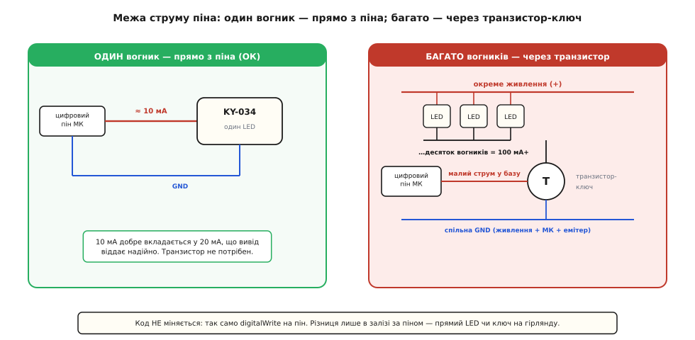

# ⚙️ Блимаємо KY-034 без `delay()`: неблокуючий вогник і пачки спалахів

Стаття про сам модуль зводить усе програмне керування KY-034 до одного речення: `digitalWrite` вмикає й вимикає весь вогник, кольором командувати не можна. Це правда, і водночас цього замало, щоб зробити щось живе. Бо щойно ти захочеш, аби вогник **блимав із певним ритмом і при цьому не паралізував решту програми**, наївний `delay()` зраджує — і починається та сама історія, що з будь-яким світлодіодом: чип завмирає, кнопки глухнуть, давачі мовчать. Тут ми зберемо невеликий, але чесний код: спершу неблокуючий блимач на таймері, тоді «пачку спалахів» на подію, а насамкінець згорнемо все в акуратну обгортку-клас, якою можна засіяти проєкт і забути про мороку. Керуємо, як домовились, **лише ввімкненням** — але робимо це так, щоб KY-034 вписався в реальну програму, а не в іграшковий приклад із порожнім `loop()`.

## Чому `delay()` — глухий кут, а не просто «повільно»

Почнімо з того, від чого тікаємо, бо без цього наступний код виглядатиме зайвим ускладненням. Найочевидніший спосіб блимати — увімкнути, поспати, вимкнути, поспати:

```cpp
digitalWrite(PIN_LED, HIGH);
delay(500);
digitalWrite(PIN_LED, LOW);
delay(500);
```

Це працює рівно доти, доки блимання — **єдина** справа чипа. Проблема не в тому, що `delay(500)` повільний; проблема в тому, що він **зупиняє геть усе**. Поки триває ця півсекунда, мікроконтролер не крутить `loop()`, не читає кнопку, не опитує давач, не відповідає по шині. Він сидить у порожньому циклі й рахує мілісекунди — глухий і сліпий. Для однієї лампочки байдуже. Але додай до того самого скетчу хоча б кнопку, яку треба чути, — і кнопка почне «не натискатися»: ти тиснеш саме в ту мить, коли чип спить у `delay`, і натиск просто зникає.

Правильний спосіб робити кілька справ одночасно на одному ядрі без операційної системи — не спати, а **дивитися на годинник**. Замість «поспати 500 мс» ми питаємо щоразу: «а чи минуло вже 500 мс від минулого перемикання?» Годинником служить `millis()` — лічильник мілісекунд від старту плати. `loop()` при цьому крутиться вільно, тисячі разів на секунду, і лише зрідка, коли надійшов час, перемикає вогник. Увесь інший час ядро вільне для решти роботи.

> 🔧 **Навіщо це.** Різниця між `delay()` і `millis()` — це різниця між іграшкою й вузлом реального пристрою. Скетч на `delay` неможливо «доростити»: кожна нова справа б'ється за ті самі паузи, і код швидко перетворюється на плутанину вкладених затримок, яку годі налагодити. Скетч на `millis()` росте лінійно — додаєш іще один незалежний таймер, і він живе своїм ритмом, не заважаючи попереднім. Для KY-034 це особливо доречно: сам вогник нічого не обчислює, тож майже завжди він — **не головна** справа скетчу, а декоративне тло поверх реальної логіки. Тло не має права красти час у логіки.

## Задача перша: рівний неблокуючий блимач

Найпростіша корисна поведінка — рівне блимання із заданим періодом, яке не заважає нічому іншому. Вся ідея вкладається в чотири рядки стану й одну перевірку часу в циклі.

**Умова.** Сигнал S модуля заведено на цифровий пін (D8 на Arduino Uno; GPIO 5 на ESP32), мінус — на GND. Хочемо, щоб вогник блимав із періодом пів секунди «увімкнено» / пів секунди «згасло», а `loop()` лишався вільним для іншої роботи.

:::tabs
```cpp
const uint8_t PIN_LED = 8;             // S модуля на цифровому виході

const unsigned long ON_MS  = 500;      // скільки триває «увімкнено»
const unsigned long OFF_MS = 500;      // скільки триває «згасло»

bool          ledOn      = false;      // поточний стан вогника
unsigned long lastChange = 0;          // коли востаннє перемикали (мс від старту)

void setup() {
  pinMode(PIN_LED, OUTPUT);
  digitalWrite(PIN_LED, LOW);          // старт зі згаслого — відомий початковий стан
}

void loop() {
  unsigned long now = millis();
  // скільки має тривати поточна фаза: якщо горить — ON_MS, якщо згас — OFF_MS
  unsigned long phase = ledOn ? ON_MS : OFF_MS;

  if (now - lastChange >= phase) {     // час перемкнути фазу?
    lastChange = now;
    ledOn = !ledOn;
    digitalWrite(PIN_LED, ledOn ? HIGH : LOW);
  }

  // тут loop() пролітає вільно — можна читати кнопки, опитувати давачі, крутити іншу логіку
}
```
```micropython
from machine import Pin
import time

PIN_LED = 5                            # S модуля на цифровому виході (ESP32: GPIO5)

ON_MS  = 500                           # скільки триває «увімкнено»
OFF_MS = 500                           # скільки триває «згасло»

led = Pin(PIN_LED, Pin.OUT)
led.value(0)                           # старт зі згаслого — відомий початковий стан

led_on = False
last_change = time.ticks_ms()          # коли востаннє перемикали

while True:
    now = time.ticks_ms()
    phase = ON_MS if led_on else OFF_MS
    # ticks_diff коректно рахує різницю навіть на переповненні лічильника
    if time.ticks_diff(now, last_change) >= phase:
        last_change = now
        led_on = not led_on
        led.value(1 if led_on else 0)

    # тут цикл пролітає вільно — можна читати давачі, крутити іншу логіку
```
:::

Розберімо, чому це працює й де ховаються тонкощі, бо саме вони відрізняють робочий код від того, що «майже працює».

Головний рядок — `now - lastChange >= phase`. Ми не питаємо «котра зараз година абсолютно», ми питаємо «скільки часу спливло від минулого перемикання». Різниця двох моментів — це тривалість, і саме її порівнюємо з потрібною фазою. Асиметрія `ON_MS` / `OFF_MS` тут безкоштовна: варто зробити `ON_MS = 60`, `OFF_MS = 940` — і замість рівного блимання дістанеш короткий проблиск раз на секунду, як у маячка. Період і шпаруватість керуються двома числами, і жоден `delay` для цього не потрібен.

Тепер про пастку, повз яку проходять усі, хто пише таймери на `millis()` уперше. Лічильник `millis()` — це `unsigned long`, тобто 32-бітне беззнакове число; він рахує до 4 294 967 295 і **переповнюється, обнуляючись, приблизно за 49.7 доби** безперервної роботи (це 2³² мілісекунд). Здавалося б, у мить переповнення `now` різко стане маленьким, а `lastChange` лишиться великим, і `now - lastChange` дасть безглузде від'ємне... але ні. І в цьому вся краса: **беззнакове віднімання переживає переповнення правильно**. Коли `now` уже перескочив через нуль, а `lastChange` іще з «дореволюційних» великих значень, різниця `now - lastChange` за правилами беззнакової арифметики дає саме ту кількість мілісекунд, що справді минула, — переповнення старшого біта просто відкидається й компенсує саме себе. Тому таймер не збоїть навіть у ту єдину мить на 49 діб.

> 🔧 **Навіщо це.** Це працює лише якщо тип змінних — **беззнаковий і достатньо широкий**. Візьмеш `int` замість `unsigned long` — і на Arduino Uno, де `int` лише 16-бітний (стеля 32767), таймер зламається вже за 33 секунди, бо `millis()` переросте `int` майже одразу. Візьмеш знаковий `long` — і в мить переповнення різниця стане від'ємною, а порівняння `>= phase` збрешеться. Правило залізне: **усі змінні для міток часу з `millis()` — `unsigned long`, і порівнюй різницю, а не самі мітки.** У MicroPython ту саму роль грає `time.ticks_diff(a, b)` — він навмисно зроблений так, щоб коректно рахувати різницю на переповненні лічильника `ticks_ms`; напряму віднімати `ticks_ms()` там **не можна**, бо діапазон лічильника платформозалежний.

Ще одна дрібниця, варта уваги: ми викликаємо `millis()` **один раз** на початку циклу й кладемо в `now`. Це не просто економія — це коректність. Якби ми питали `millis()` двічі в різних місцях циклу, між двома викликами міг би клацнути таймер, і два порівняння побачили б **різний** час. Один знімок `now` на весь прохід циклу гарантує, що всі рішення в цій ітерації спираються на одну й ту саму мить.

## Задача друга: пачка спалахів на подію

Рівне блимання — це тло. Куди частіше від сигнального вогника хочуть іншого: **блимнути задану кількість разів у відповідь на подію** — спрацював давач, натиснули кнопку, прийшов пакет — і затихнути. Тричі моргнув на підтвердження, п'ять разів на тривогу. Тут з'являється нова складність: у блимача тепер є **початок і кінець**, і лічильник спалахів, який треба довести до нуля, не блокуючи програму.

Спокуса написати це через `for` із `delay` усередині — і знову впертися в те, від чого тікаємо: поки триває пачка з п'яти спалахів по 400 мс, чип на дві секунди глухне. Якщо пачку запускає та сама подія, що надходить часто, вони почнуть накладатися й губитися. Тому пачку теж робимо неблокуючою — на тому самому таймері, але з лічильником фаз, що лишилися.

**Умова.** KY-034 на D8. За подією (тут — натиск кнопки на D2, замкнутої на землю) вогник має блимнути **тричі**: 200 мс горить, 200 мс згас, і так три цикли, після чого затихнути й чекати наступної події. Нові натиски під час пачки ігноруємо, доки вона не добіжить.

:::tabs
```cpp
const uint8_t PIN_LED = 8;
const uint8_t PIN_BTN = 2;             // кнопка між піном і землею

const unsigned long FLASH_MS = 200;    // тривалість кожної півфази (горить / згас)

uint8_t       flashesLeft = 0;         // скільки перемикань стану ще лишилось
bool          ledOn       = false;
unsigned long lastChange  = 0;

void setup() {
  pinMode(PIN_LED, OUTPUT);
  pinMode(PIN_BTN, INPUT_PULLUP);      // у спокої HIGH; натиск замикає на землю → LOW
  digitalWrite(PIN_LED, LOW);
}

// Запустити пачку з n спалахів. Один «спалах» = увімкнути + вимкнути = 2 перемикання.
void startBurst(uint8_t n) {
  flashesLeft = n * 2;                 // n спалахів = 2·n змін стану
  lastChange  = millis();
  ledOn       = true;                  // перше перемикання — одразу вмикаємо
  digitalWrite(PIN_LED, HIGH);
}

void loop() {
  unsigned long now = millis();

  // 1) подія: натиск запускає пачку, але лише коли попередня вже добігла
  static bool wasPressed = false;
  bool pressed = (digitalRead(PIN_BTN) == LOW);
  if (pressed && !wasPressed && flashesLeft == 0) {
    startBurst(3);                     // блимнути тричі
  }
  wasPressed = pressed;

  // 2) сам неблокуючий прогін пачки
  if (flashesLeft > 0 && now - lastChange >= FLASH_MS) {
    lastChange = now;
    flashesLeft--;
    if (flashesLeft == 0) {
      ledOn = false;                   // остання фаза — гарантовано гасимо
    } else {
      ledOn = !ledOn;                  // перемикаємо далі
    }
    digitalWrite(PIN_LED, ledOn ? HIGH : LOW);
  }

  // loop() лишається вільним увесь час, і під час пачки теж
}
```
```micropython
from machine import Pin
import time

PIN_LED = 5
PIN_BTN = 4                            # кнопка між піном і землею (ESP32: GPIO4)

FLASH_MS = 200                         # тривалість кожної півфази (горить / згас)

led = Pin(PIN_LED, Pin.OUT)
btn = Pin(PIN_BTN, Pin.IN, Pin.PULL_UP)  # у спокої 1; натиск замикає на землю → 0
led.value(0)

flashes_left = 0                       # скільки перемикань стану ще лишилось
led_on       = False
last_change  = time.ticks_ms()

def start_burst(n):
    global flashes_left, last_change, led_on
    flashes_left = n * 2               # n спалахів = 2·n змін стану
    last_change  = time.ticks_ms()
    led_on       = True                # перше перемикання — одразу вмикаємо
    led.value(1)

was_pressed = False
while True:
    now = time.ticks_ms()

    # 1) подія: натиск запускає пачку, лише коли попередня вже добігла
    pressed = (btn.value() == 0)
    if pressed and not was_pressed and flashes_left == 0:
        start_burst(3)                 # блимнути тричі
    was_pressed = pressed

    # 2) сам неблокуючий прогін пачки
    if flashes_left > 0 and time.ticks_diff(now, last_change) >= FLASH_MS:
        last_change = now
        flashes_left -= 1
        if flashes_left == 0:
            led_on = False             # остання фаза — гарантовано гасимо
        else:
            led_on = not led_on
        led.value(1 if led_on else 0)
```
:::

Тут кілька рішень, кожне з яких неочевидне, доки не наступиш на граблі.

**Чому лічильник рахує перемикання, а не спалахи.** Один «спалах» для ока — це «спалахнув і згас», тобто **два** перемикання стану. Тому `startBurst(3)` кладе `flashesLeft = 6`, і кожне спрацювання таймера зменшує лічильник на одиницю, послідовно перемикаючи `ledOn`. Так уся пачка стає рівномірним ланцюжком однакових кроків по `FLASH_MS`, і не треба окремо стежити «зараз я в фазі горіння чи згасання» — про це каже сама парність лічильника.

**Чому остання фаза гаситься примусово.** Якби ми просто чергували `ledOn = !ledOn`, результат залежав би від парності: за парного числа перемикань вогник урешті лишився б згаслим, за непарного — засвіченим. Явне `if (flashesLeft == 0) ledOn = false` прибирає цю залежність: **пачка завжди закінчується згаслим вогником**, скільки б спалахів ти не замовив. Дрібниця, але без неї «блимнути чотири рази» іноді лишало б лампу тихо світитися.

**Чому ловимо фронт натиску, а не рівень.** Умова `pressed && !wasPressed` спрацьовує лише в **мить переходу** з «не натиснуто» в «натиснуто» — це фронт. Якби ми запускали пачку просто за `pressed`, то поки палець тримає кнопку, `loop()` пролітав би тисячі разів і намагався б перезапускати пачку щоразу. Умова `flashesLeft == 0` додає друге запобіжне: нова пачка не почнеться, доки не добігла попередня. Разом вони роблять поведінку передбачуваною: один натиск — рівно одна пачка з трьох спалахів.

> 🔧 **Навіщо це.** Уважний читач помітить, що фронт ми ловимо «сирим» читанням, без усунення брязкоту (debounce) механічної кнопки — а вона в мить контакту деренчить кілька мілісекунд, і чип може побачити один натиск як кілька фронтів поспіль. Для KY-034 це рятує сама умова `flashesLeft == 0`: перший фронт запускає пачку, а всі дрязкітливі фронти в наступні мілісекунди відсіюються, бо пачка ще триває. Тобто **незалежний захист** «одна пачка за раз» побічно гасить і брязкіт. Якби подія була не кнопкою, а чистим цифровим сигналом (вихід іншого чипа, давача), брязкоту нема й це питання відпадає зовсім. Якщо ж захочеш ловити саме окремі швидкі натиски без пачки-запобіжника — тоді фронт таки треба фільтрувати за часом, як роблять для будь-якої тактової кнопки.

## Задача третя: обгортка-клас, щоб не тримати таймери в голові

Два попередні приклади робочі, але глобальні змінні `ledOn`, `lastChange`, `flashesLeft` розповзлися по всьому скетчу. Щойно тобі знадобиться **другий** такий вогник (два KY-034 на різних пінах, що блимають незалежно), доведеться дублювати весь набір змінних із новими іменами — і код одразу поплутається. Правильно спакувати весь стан і всю логіку блимача в **одну сутність**, якій ти лише кажеш «блимни тричі» чи «блимай рівно», а вона сама тримає свій час. У C++ це клас; у MicroPython — клас же.

Зберемо клас `Ky034`, який уміє три режими: постійно горіти, рівно блимати з періодом, і видати пачку з N спалахів. Уся неблокуюча механіка ховається всередину `tick()`, який ти просто смикаєш у кожному `loop()`.

:::tabs
```cpp
// --- Ky034: неблокуючий драйвер увімкнення для самограйного RGB-модуля ---
// Керує ЛИШЕ ввімкненням/вимкненням (кольором KY-034 керувати не можна).
class Ky034 {
public:
  explicit Ky034(uint8_t pin) : _pin(pin) {}

  void begin() {
    pinMode(_pin, OUTPUT);
    off();
  }

  // Постійно ввімкнути / вимкнути (скидає будь-який активний режим блимання)
  void on()  { _mode = SOLID; _write(true);  }
  void off() { _mode = SOLID; _write(false); }

  // Рівне блимання: onMs горить, offMs згас, доти доки не змінять режим
  void blink(unsigned long onMs, unsigned long offMs) {
    _onMs = onMs; _offMs = offMs;
    _mode = BLINK;
    _last = millis();
    _write(true);
  }

  // Пачка з n спалахів по halfMs на півфазу, тоді сама затихає
  void burst(uint8_t n, unsigned long halfMs) {
    _left = n * 2;                 // n спалахів = 2·n перемикань
    _halfMs = halfMs;
    _mode = BURST;
    _last = millis();
    _write(true);
  }

  bool busy() const { return _mode == BURST && _left > 0; }

  // Смикати в КОЖНОМУ loop(). Нічого не блокує.
  void tick() {
    if (_mode == SOLID) return;                 // постійний стан — нічого рахувати
    unsigned long now = millis();

    if (_mode == BLINK) {
      unsigned long phase = _isOn ? _onMs : _offMs;
      if (now - _last >= phase) {
        _last = now;
        _write(!_isOn);
      }
      return;
    }

    // BURST
    if (_left > 0 && now - _last >= _halfMs) {
      _last = now;
      _left--;
      if (_left == 0) { _write(false); _mode = SOLID; }  // пачка добігла — гасимо
      else            { _write(!_isOn); }
    }
  }

private:
  enum Mode { SOLID, BLINK, BURST };

  void _write(bool onState) {
    _isOn = onState;
    digitalWrite(_pin, onState ? HIGH : LOW);
  }

  uint8_t       _pin;
  Mode          _mode  = SOLID;
  bool          _isOn  = false;
  unsigned long _last  = 0;
  unsigned long _onMs  = 500, _offMs = 500, _halfMs = 200;
  uint8_t       _left  = 0;
};

// ---------- використання ----------
Ky034 lamp(8);                          // модуль на D8
const uint8_t PIN_BTN = 2;

void setup() {
  lamp.begin();
  pinMode(PIN_BTN, INPUT_PULLUP);
  lamp.blink(500, 500);                 // за замовчуванням — рівно блимає тлом
}

void loop() {
  static bool wasPressed = false;
  bool pressed = (digitalRead(PIN_BTN) == LOW);
  if (pressed && !wasPressed && !lamp.busy()) {
    lamp.burst(3, 150);                 // натиск → блимнути тричі поверх усього
  }
  wasPressed = pressed;

  lamp.tick();                          // єдиний обов'язок: смикати щоцикл
  // ...тут будь-яка інша логіка скетчу, вона не блокована
}
```
```micropython
# --- Ky034: неблокуючий драйвер увімкнення для самограйного RGB-модуля ---
# Керує ЛИШЕ ввімкненням/вимкненням (кольором KY-034 керувати не можна).
from machine import Pin
import time

SOLID, BLINK, BURST = 0, 1, 2

class Ky034:
    def __init__(self, pin):
        self._pin  = Pin(pin, Pin.OUT)
        self._mode = SOLID
        self._is_on = False
        self._last  = time.ticks_ms()
        self._on_ms = self._off_ms = 500
        self._half_ms = 200
        self._left  = 0
        self._write(False)

    def _write(self, on_state):
        self._is_on = on_state
        self._pin.value(1 if on_state else 0)

    # Постійно ввімкнути / вимкнути
    def on(self):  self._mode = SOLID; self._write(True)
    def off(self): self._mode = SOLID; self._write(False)

    # Рівне блимання: on_ms горить, off_ms згас
    def blink(self, on_ms, off_ms):
        self._on_ms, self._off_ms = on_ms, off_ms
        self._mode = BLINK
        self._last = time.ticks_ms()
        self._write(True)

    # Пачка з n спалахів по half_ms на півфазу, тоді сама затихає
    def burst(self, n, half_ms):
        self._left = n * 2             # n спалахів = 2·n перемикань
        self._half_ms = half_ms
        self._mode = BURST
        self._last = time.ticks_ms()
        self._write(True)

    def busy(self):
        return self._mode == BURST and self._left > 0

    # Смикати в КОЖНІЙ ітерації циклу. Нічого не блокує.
    def tick(self):
        if self._mode == SOLID:
            return
        now = time.ticks_ms()

        if self._mode == BLINK:
            phase = self._on_ms if self._is_on else self._off_ms
            if time.ticks_diff(now, self._last) >= phase:
                self._last = now
                self._write(not self._is_on)
            return

        # BURST
        if self._left > 0 and time.ticks_diff(now, self._last) >= self._half_ms:
            self._last = now
            self._left -= 1
            if self._left == 0:
                self._write(False); self._mode = SOLID   # пачка добігла — гасимо
            else:
                self._write(not self._is_on)

# ---------- використання ----------
lamp = Ky034(5)                        # модуль на GPIO5
btn  = Pin(4, Pin.IN, Pin.PULL_UP)
lamp.blink(500, 500)                   # тлом — рівно блимає

was_pressed = False
while True:
    pressed = (btn.value() == 0)
    if pressed and not was_pressed and not lamp.busy():
        lamp.burst(3, 150)             # натиск → блимнути тричі поверх усього
    was_pressed = pressed

    lamp.tick()                        # єдиний обов'язок: смикати щоцикл
    # ...тут будь-яка інша логіка, вона не блокована
```
:::

Що ця обгортка дає й чому вона краща за розсипані глобальні змінні.

По-перше, **увесь стан вогника живе в об'єкті**. Хочеш два незалежні вогники — оголошуєш `Ky034 lampA(8), lampB(9);`, кожен зі своїм таймером, і смикаєш обидва `tick()` у циклі. Жодного дублювання змінних, жодної плутанини, чий зараз `lastChange`. Кожен вогник — сам собі господар свого ритму.

По-друге, **зовні лишився чистий намір**: `lamp.blink(500, 500)`, `lamp.burst(3, 150)`, `lamp.on()`, `lamp.off()`. Читаючи `loop()`, ти бачиш **що** роблять із вогником, а не **як** влаштований його таймер. Уся неблокуюча механіка — розрахунок фаз, лічильник спалахів, примусове гасіння в кінці — сховалася за `tick()`, і в тіло скетчу вже не лізе.

По-третє, режими **чисто витісняють один одного**. Виклик `on()` чи `off()` перемикає `_mode` у `SOLID`, і `tick()` для такого режиму нічого не робить — вогник просто стоїть у заданому стані. Пачка `burst()` після завершення сама повертає режим у `SOLID`, тож не лишає по собі «завислого» таймера. Прапорець `busy()` дає зовнішньому коду спитати «пачка ще триває?» — саме ним ми не даємо натиску перезапустити пачку, доки попередня не добігла.

> 🔧 **Навіщо це.** Оцей візерунок — стан у полях, вся механіка в одному `tick()`, який смикаєш щоцикл, — це і є азбука неблокуючого коду на мікроконтролері без операційної системи. Він не про KY-034 зокрема: так само загортають блимання будь-якого світлодіода, опитування кнопки з усуненням брязкоту, читання давача за розкладом, керування сервоприводом. Навчишся бачити задачу як «маленький автомат зі станом, що просувається на кожному `tick()`» — і десяток таких автоматів мирно живуть в одному `loop()`, жоден не блокує іншого, і жоден `delay` більше не потрібен. KY-034 тут — найпростіший можливий приклад цього автомата: у нього всього два стани виходу, тож видно самий кістяк без зайвого м'яса.

## Один пін — один вогник: де ховається транзистор

Увесь код вище живить модуль **прямо з цифрового піна**, і для одного KY-034 це цілком безпечно — але варто знати межу, за якою так робити вже не можна, бо саме на ній спалюють піни.

Цифровий вивід мікроконтролера — це **сигнал керування, а не силове джерело**. Вивід ATmega328P (той, що на Arduino Uno) надійно віддає близько **20 мА**, і його абсолютна стеля — **40 мА**, за якою кремній ніжки руйнується; понад те, сумарний струм крізь усі виводи разом обмежений приблизно **200 мА** через спільні ноги живлення чипа. Один світлодіод крізь струмообмежувальний резистор бере одиниці — десяток міліампер, добре в межах 20, тож KY-034 можна живити прямо з піна без жодного ключа. Оце і є «один пін — один вогник».

Порахуймо, звідки береться той десяток міліампер, бо число не з повітря:

```
струм крізь LED = (напруга піна − падіння на світлодіоді) / опір резистора на платі
приклад (5 В на піні, падіння на світлодіоді ≈ 2 В, резистор ≈ 300 Ом):
  (5 − 2) / 300 = 3 / 300 = 0.01 А = 10 мА    — безпечно, вогник яскравий
```

Десять міліампер — надійно всередині двадцяти, пін цілий, вогник живий. А тепер уяви, що ти захотів увімкнути з **одного** піна **десять** таких модулів разом — гірлянду однаковим сигналом. Кожен бере свої 10 мА; десять беруть уже 100 мА — і це **вп'ятеро** за рекомендовані 20 мА на пін, за самою межею руйнування. Пін такого не витримає: у кращому разі напруга на ньому просяде й вогники ледь жеврітимуть, у гіршому — ніжка чипа вигорить.

Розв'язок класичний: пін не живить гірлянду сам, а лише **командує нею через транзистор** — маленький ключ, що слабким сигналом з піна вмикає й вимикає сильний струм від окремого джерела. Пін дає крихітний струм у базу транзистора; транзистор пропускає крізь себе весь струм вогників. Сила тече від блока живлення повз чип, а пін лише каже «відкрийся».



*Межа струму піна. Ліворуч — один KY-034 прямо на піні: десяток міліампер добре вкладається в 20 мА, що вивід віддає надійно, транзистор не потрібен. Праворуч — багато вогників від одного піна: їхній сумарний струм перевищує стелю виводу, тож живлення беруть від окремого джерела, а пін лише відкриває транзистор-ключ малим струмом у базу. Код керування при цьому не міняється — так само `digitalWrite` на пін бази.*

Найважливіше для нашого коду: **сам код від цього не міняється**. Хоч вогник живиться прямо з піна, хоч через транзистор десяток вогників — програма однаково смикає `digitalWrite(PIN_LED, HIGH/LOW)` (у класі — `on()`/`off()`, `tick()`). Уся різниця — в залізі за піном, не в логіці. Тому обгортка `Ky034` працює однаково в обох випадках: вона керує **сигналом на піні**, а що той сигнал вмикає — один світлодіод чи ключ на цілу гірлянду — їй байдуже.

> 🔧 **Навіщо це.** Для гірлянди в кілька ампер (багато модулів чи потужне навантаження) беруть не біполярний транзистор, а **польовий (MOSFET) логічного рівня** — той відкривається прямо напругою піна й майже не гріється завдяки мізерному опору у відкритому стані. Але принцип незмінний і його варто закарбувати раз назавжди: **пін командує, силу дає окреме джерело через ключ**. Плутанина тут коштує спалених пінів: людина бачить, що один модуль чудово живе на піні, і навісює на той самий пін десяток — а потім дивується, чому плата «померла». Не брак плати — перевищена межа виводу.

## Складність і пастки: що ловить у цьому коді

Код тут неважкий, але кілька місць чіпляють навіть тих, хто вже писав неблокуючі таймери. Зберімо їх докупи.

**Тип часу — тільки беззнаковий і широкий.** Найтихіша й найпідступніша пастка. Усі мітки часу з `millis()` — `unsigned long`, і порівнюй **різницю** `now - last`, а не самі мітки. Візьмеш `int` — зламається за 33 секунди; візьмеш знаковий `long` — збреше в мить переповнення на 49-й добі. У MicroPython напряму віднімати `ticks_ms()` не можна взагалі — тільки через `time.ticks_diff`, бо він єдиний коректно проходить переповнення платформозалежного лічильника.

**Кольором усе одно не покеруєш — код цього не додасть.** Хоч як гарно ти загорнеш блимання в клас, `digitalWrite(HIGH)` вмикає вогник **тим кольором, до якого дійшла черга** в заводському хороводі тієї миті. Жоден із цих прийомів не дає передбачуваного кольору в передбачувану мить — бо його фізично нема на що подати. Якщо в задачі свербить «блимнути саме **зеленим** на успіх», KY-034 не той модуль: тут беруть [RGB-світлодіод на три ноги](topic:cat-hw-actuators/ky-016-rgb) (керуєш кожним каналом через ШІМ) або [адресовані світлодіоди](topic:hw-motion/addressable-leds) (шлеш точний код кольору по шині). Наш код керує **фактом світіння**, і тільки ним.

**Момент увімкнення непередбачуваний за кольором, іноді й за фазою.** У дешевих екземплярах при короткому зникненні живлення внутрішній лічильник кольорів скидається, тож після ввімкнення хоровод часто стартує «з початку», — але покладатися на це як на керування **не можна**: це побічний ефект скидання, а не команда, і в іншій партії модуля він може поводитися інакше. Для «блимнути на увагу» це байдуже; для будь-чого, де колір мусить щось **означати**, — непридатно.

**Пачка має чисто закінчуватися.** Якщо чергувати `!_isOn` без явного гасіння в кінці, вогник за непарного числа перемикань лишиться світитися. Примусове `_write(false)` на останньому кроці робить кінець пачки детермінованим — **завжди згасло**, скільки б спалахів не замовили. Дрібниця, яку легко проґавити й потім довго ловити «чому лампа інколи не гасне».

**Запобіжник «одна пачка за раз» заразом гасить брязкіт кнопки.** Умова `!lamp.busy()` (або `flashesLeft == 0`) не дає новій пачці початися, доки не добігла попередня, — і це побічно відсіює дрязкітливі фронти механічної кнопки в перші мілісекунди контакту. Для чистого цифрового сигналу (не кнопки) брязкоту нема й питання відпадає. Але якщо колись захочеш ловити саме кожен окремий швидкий натиск **без** пачки-запобіжника — тоді фронт кнопки таки доведеться фільтрувати за часом окремо.

**`millis()` знімай раз на цикл.** Один `now = millis()` на початок ітерації, і всі рішення цієї ітерації спираються на одну мить. Питатимеш `millis()` кілька разів у різних місцях — між викликами може клацнути таймер, і два порівняння побачать різний час; за цим ловляться найдивніші «плаваючі» баги, яких ніяк не вдається відтворити.

**Один пін тримає один вогник; на багато — транзистор.** Прямо з піна живи **один** KY-034 (десяток міліампер — у межах 20 мА виводу). Кілька разом перевищать межу піна — тоді ключ-транзистор і окреме живлення, а пін лише командує. Код при цьому не міняється ані на рядок.

Оце, власне, і вся програмна робота з KY-034, зроблена чесно — так, щоб вогник вписався в живий скетч, а не в порожній `loop()`. Модуль уміє рівно одне: світити своїм візерунком, поки на нього подано плюс. Наша справа з боку коду — **керувати цим плюсом розумно**: блимати без `delay`, видавати пачки на подію, тримати весь стан в акуратній обгортці — і пам'ятати межу піна. Усе решта — колір, швидкість переходів, синхронізацію кількох — модуль вирішує сам усередині свого корпусу, і в це ми не втручаємось, бо й не можемо.
