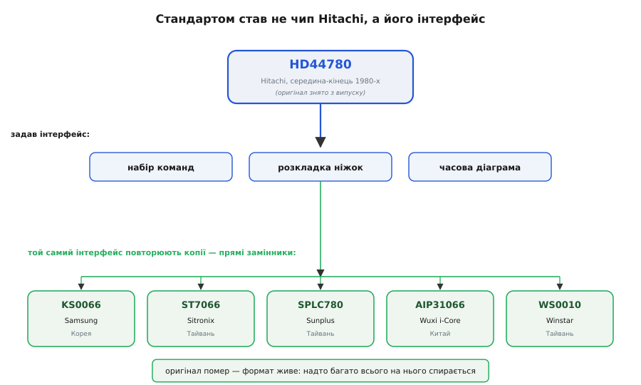

# 📜 Як HD44780 став мовою, якою досі говорять усі символьні дисплеї

Візьміть будь-який зелено-чорний екранчик 16×2 з ящика з деталями — китайський, тайванський, куплений учора чи виколупаний зі старого приладу дев'яностих — припаяйте до нього ту саму послідовність байтів, і всі вони покажуть один і той самий напис. Це дивовижно, якщо вдуматися. Зазвичай у електроніці кожен виробник тягне ковдру на себе: свої регістри, свій протокол, своя несумісність. А тут — сотні різних мікросхем від десятків фірм на трьох континентах слухаються **однакових команд**, розкладених по **однакових ніжках**, з **однаковими паузами**. Ніби всі домовилися. Насправді ніхто ні про що не домовлявся — просто одна мікросхема вгадала форму задачі так влучно, що решті світу виявилося дешевше її скопіювати, ніж вигадати щось своє. Ця мікросхема — **HD44780** від Hitachi. Історія про те, як вона з'явилася і чому пережила саму фірму, що її зробила, — це історія про те, як удало проведена межа стає стандартом на пів століття.

## Що бентежило до неї

Щоб відчути, яку задачу HD44780 закрив, треба уявити світ **без** нього.

Рідкі кристали вміли перекривати світло вже з початку 1970-х: перші наручні годинники й кишенькові калькулятори на РК-сегментах з'явилися саме тоді. Але сегментний індикатор — це кілька заздалегідь намальованих смужок, з яких складаються цифри у знайомій «вісімці». Він показує рівно те, під що його розвели на склі, і ні знака більше. Хочете вивести літери, а не лише цифри? Хочете **довільний** текст, який заздалегідь невідомий? Тоді сегменти не годяться — потрібна сітка з окремо керованих крапок, **точкова матриця** (англ. *dot matrix*), де з крапок можна скласти будь-яку літеру, як з мозаїки.

І ось тут починалося пекло. Дисплей 16×2 символів по сітці 5×8 крапок у клітинці — це **640 окремих крапок**, кожну з яких треба вчасно вмикати й вимикати. Рідкий кристал ще й не можна тримати під постійною напругою: він деградує, тож картинку доводиться безперервно **перемальовувати змінним сигналом**, рядок за рядком, десятки разів на секунду. Якби мікроконтролер керував крапками напряму, він тільки б і робив, що ганяв цей потік — на щось корисне сил би не лишалося. А головне: щоб перетворити літеру «A» на візерунок крапок, треба десь тримати **таблицю облич** усіх символів і щоразу з неї вибирати потрібне. Кожен виробник приладу мусив би винаходити все це сам — і розводку крапок, і генерацію змінного сигналу, і таблицю шрифту, і протокол. Символьний екран був розкішшю, яку кожен збирав наново.

> 🔧 **Навіщо це.** Ключ до всієї історії — усвідомити, що **важка частина в символьному дисплеї не скло, а керування**. Скло з рідкими кристалами саме собою німе: воно лише перекриває світло там, куди подали напругу. Уся кмітливість — «яку крапку зараз запалити, щоб на екрані була літера A» — це робота мозку, окремої мікросхеми. Хто зробить цей мозок дешевим і однаковим для всіх, той і задасть стандарт. Саме це й зробила Hitachi.

## Хід Hitachi: сховати всю морок у мікросхему

Hitachi (яп. 日立, «схід сонця») до 1980-х уже роками робила самі РК-панелі й непогано знала їхній норов. Її інженери зробили простий за задумом, але переломний за наслідками крок: узяли **всю** нудну частину — і таблицю облич символів, і пам'ять під те, що зараз на екрані, і генерацію змінного сигналу для скла, і командний інтерфейс — і запакували в **один кристал кремнію**. Ця мікросхема дістала ім'я **HD44780**.

Ідея була не в тому, щоб зробити щось хитромудре, а в тому, щоб **правильно провести межу** між «розумним» мікроконтролером приладу й «тупим» склом. По один бік межі — HD44780 бере на себе все, що стосується крапок і кристалів. По інший бік лишається до смішного проста задача для будь-якого, навіть найдешевшого чипа: **надіслати код символу**. Не візерунок крапок, не сигнали для скла — просто число, як-от 65 для «A». Усередині HD44780 тримав три шматки пам'яті, які й роблять цей фокус можливим — і саме навколо них збудований весь протокол.

**CGROM** (*Character Generator ROM* — постійна пам'ять генератора символів) — це і є та зашита на заводі **таблиця облич**. В оригінальному HD44780 в ній лежало **208 символів у матриці 5×7 крапок** плюс ще **32 символи у вищій матриці 5×10** — латинка, цифри, знаки пунктуації, дрібка спецзнаків і, у японській версії, катакана. Проблема «де взяти шрифт», що мучила кожного виробника приладу, зникла: шрифт уже всередині, назавжди.

**DDRAM** (*Display Data RAM* — пам'ять даних дисплея) на **80 байтів** тримає те, що зараз показано: у кожній комірці — код одного символу, а контролер сам щомиті перемальовує їх на склі. Мікроконтролер приладу пише в цю пам'ять і забуває; далі HD44780 крутить кадри без його участі.

**CGRAM** (*Character Generator RAM* — оперативна пам'ять генератора символів) дає намалювати **до восьми власних символів**, яких немає в заводській таблиці, — значок батареї, градуса, стрілку. Дрібниця, а розв'язує проблему «а якщо мені треба знак, якого немає в CGROM».

А керувати всім цим HD44780 дозволяв через жменю ніжок і невеликий **набір команд**: очистити екран, посунути курсор, увімкнути дисплей, задати режим. Байт на восьми (або, в ощадному режимі, чотирьох) лініях даних, три керувальні ніжки — вибір «команда чи символ», напрям, і строб, на спаді якого контролер клацає значення собі. Той самий набір команд і та сама розкладка ніжок опинилися в **кожній** мікросхемі, що потім прикидалася HD44780, — і саме тому екрани стали взаємозамінні.

> 🔧 **Навіщо це.** Геніальність тут не технічна, а **економічна**. HD44780 зробив символьний екран товаром «підключи-і-працює»: виробнику приладу більше не треба нічого знати про рідкі кристали. Один раз вивчив десяток команд — і будь-який дисплей на цьому контролері оживає тим самим кодом. Ця економія праці, помножена на мільйони приладів, і виштовхнула HD44780 у стандарт: не тому, що він найкращий, а тому, що навколо нього стало найдешевше працювати.

## Один HD44780 малий — і на це є HD44100

Була в HD44780 межа, про яку варто знати, бо вона пояснює, чому великі дисплеї влаштовані інакше. Сам контролер має власних виводів на скло рівно на **80 символів** — а це вже вісім клітинок на два рядки чи, розтягнуто, шістнадцять на два. Для 16×2 його якраз вистачає під зав'язку. А більше?

Hitachi передбачила це наперед і випустила напарника — **HD44100**, простий **драйвер-розширювач** сегментів. Він не має власного мозку: не тримає ні таблиці символів, ні пам'яті — лише додає HD44780 зайвих «рук», щоб дотягнутися до дальших стовпців скла. Ставите один-два таких драйвери поруч — і HD44780 керує ширшою панеллю, аж до 40 символів у рядку. А коли й 80 комірок замало (класика — дисплей **40×4**), у модуль ставлять **два окремі HD44780**, кожен зі своїми розширювачами, і адресують їх нарізно, як два півекрани.

> 🔧 **Навіщо це.** Ось чому величезний дисплей 40×4 у коді часто поводиться як **два дисплеї**: у ньому фізично два контролери HD44780, і кожному пишеш окремо. А ще це пояснює, чому на звороті великих модулів під чорною краплею компаунда видно не одну мікросхему, а кілька: один-два «мозки» HD44780 і поряд «тупі» помічники HD44100. Дрібний 1602A обходиться однією мікросхемою — тому й найдешевший.

## Коли саме — і чому дату варто брати обережно

З датою народження HD44780 треба бути акуратним, бо джерела розходяться. Багато вторинних оглядів (зокрема виробники дисплеїв) називають конкретний **1987 рік**. Водночас Вікіпедія й частина довідників обережніше пишуть просто «**у 1980-х**» або «на початку 1980-х», без точного року, і не наводять первинного документа під «1987». Тож чесний статус такий: **поява — середина-кінець 1980-х; конкретний «1987» — поширена, але не підтверджена первинним джерелом дата**. Це той випадок, коли красива цифра гуляє з сайту на сайт, а простежити її до заводського прес-релізу Hitachi не вдається. Важить інше й безсумнівне: до кінця 1980-х HD44780 уже був на ринку й уже ставав галузевим стандартом.

## Копії, які й зробили його безсмертним

Ось тут — головний поворот історії, і він контрінтуїтивний. HD44780 став вічним **не всупереч** копіям, а **завдяки** їм.

Коли одна мікросхема стає стандартом де-факто, довкола неї вибудовується ціла екосистема: бібліотеки для мікроконтролерів, готові приклади, статті, звичка інженерів. Ця екосистема — цінність сама по собі, і вона прив'язана не до Hitachi, а до **набору команд і розкладки ніжок**. Тож іншим виробникам мікросхем стало вигідно робити не «свій кращий контролер», а **точну копію інтерфейсу HD44780** — щоб їхня мікросхема вставала на місце оригіналу без жодної зміни коду. І вони її зробили — кожен свою:

```
Мікросхема-копія     Виробник           Країна
──────────────────────────────────────────────────────────
KS0066 / KS0073      Samsung            Корея
ST7066 / ST7070      Sitronix           Тайвань
SPLC780C / SPLC780D  Sunplus            Тайвань
AIP31066 / AIP31068  Wuxi i-Core        Китай
WS0010               Winstar Display    Тайвань
```

Усі вони повторюють **той самий набір команд, ту саму розкладку ніжок і ту саму часову діаграму** — це зроблені навмисне «прямі замінники». Дрібні відмінності бувають (інколи перевернута полярність підсвітки чи інший заводський контраст), але це питання розводки, а не коду: прошивка лишається спільною. Дехто з них іще й дописав корисного — наприклад AIP31068 додав керування по [шині I2C](root:com-devices/i2c-bus) поверх старого набору команд, а WS0010 вміє й OLED-скло, вдаючи для мікроконтролера все той самий HD44780.

Наслідок парадоксальний і красивий. **Hitachi давно припинила випускати сам HD44780** — фізично тієї мікросхеми в нових приладах немає. Але **інтерфейс** HD44780 живіший за всіх: він став тією спільною мовою, яку копії передають одна одній, покоління за поколінням. Мікросхема-оригінал померла — а формат, який вона задала, живе, бо надто багато всього на нього спирається, щоб від нього тепер відмовитися.


*Що насправді стало стандартом — не сама мікросхема Hitachi, а її інтерфейс: набір команд, розкладка ніжок і часова діаграма. Копії від Samsung, Sitronix, Sunplus та інших повторюють саме цей інтерфейс, тому лишаються прямими замінниками. Оригінал знято з виробництва — формат живе далі.*

## Чому саме він, а не хтось інший

Лишається питання: чому в стандарт вистрелив саме HD44780, а не якийсь із десятків інших контролерів, що теж існували? Тут немає одного магічного чинника — склалося кілька, і кожен окремо не вирішальний, а разом вони й дали ефект снігової кулі.

По-перше, **вдало проведена межа**: HD44780 попросив від мікроконтролера рівно те, що той і так легко дає, — короткий код символу, — і забрав собі все важке. Поріг входу впав майже до нуля.

По-друге, **самодостатність**: шрифт уже всередині (CGROM), пам'ять під екран уже всередині (DDRAM), місце під власні знаки теж (CGRAM). Нічого не треба довантажувати, нічим не треба годувати скло — підключив і пишеш.

По-третє — і це, мабуть, головне — **ефект мережі**. Щойно HD44780 набрав критичну масу, кожен наступний виробник опинявся перед вибором: зробити свій формат і жити без готових бібліотек та звички ринку — чи скопіювати HD44780 й одразу дістати всю екосистему задарма. Раціональний вибір щоразу один і той самий, і кожна нова копія тільки зміцнювала стандарт. Так формат замкнувся сам на себе: він поширений, **тому що** поширений.

Ось чому й сьогодні, купуючи дешевий 1602A, ви майже напевно тримаєте в руках нащадка рішення, яке Hitachi ухвалила ще за часів касетних плеєрів. Мозку тієї фірми в модулі, найпевніше, уже немає — а її **спосіб говорити з дисплеєм** ви щойно набрали в коді, навіть не помітивши, чиїм голосом.
