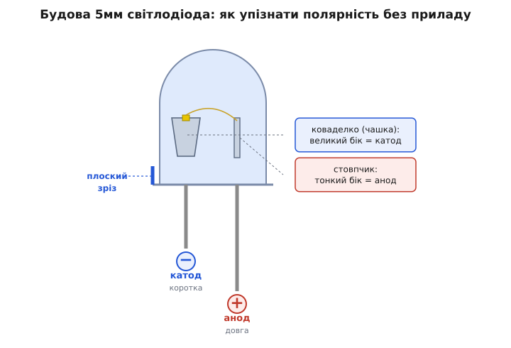
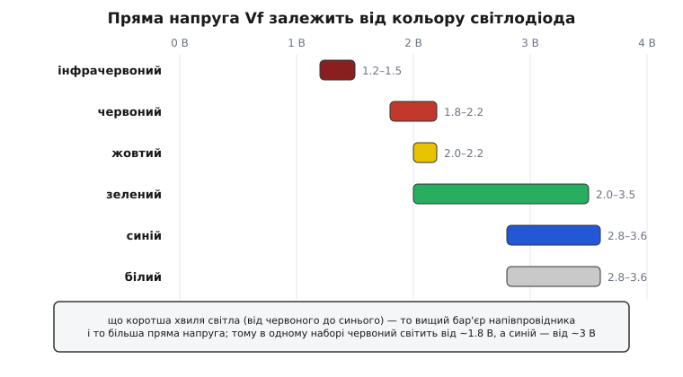
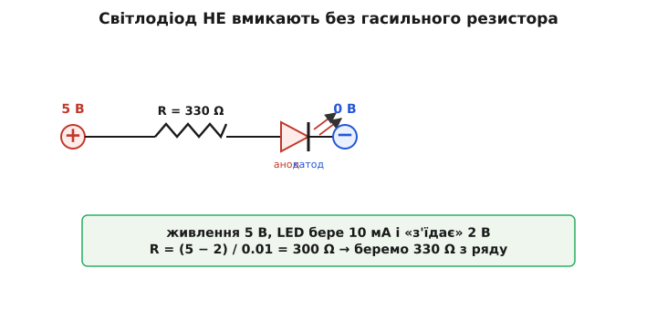

# Набір 5мм світлодіодів

<preknowlist>
- [LED](root:hw-motion/led) — світлодіод: діод, що світиться, коли струм тече в один бік; без розуміння, що це за деталь, набір безглуздий.
- [Закон Ома](root:hw-analog/ohms-law) — напруга = струм · опір; ним рахують гасильний резистор під світлодіод.
- [Драйвер LED](root:hw-power/led-driver) — чому світлодіод живлять обмеженим струмом, а не просто напругою; тут — лише практичний бік на прикладі резистора.
- [Набір резисторів](root:cat-hw-parts/resistor-kit) — з чого беруть гасильний опір; майже завжди йде в парі з набором світлодіодів.
</preknowlist>

Відкриваєш пакетик — і всередині розсип крихітних прозорих або матових «крапель» на двох тонких дротяних ніжках, кожна завбільшки з горошину, різних кольорів: жменя червоних, жменя зелених, кілька синіх, білі, жовті. Це **набір 5мм світлодіодів** (LED, від англ. *light-emitting diode* — світловипромінювальний діод) — не одна деталь, а впорядкована колекція однотипних індикаторних світлодіодів у найпоширенішому виводному корпусі діаметром п'ять міліметрів, зібраних докупи за кольорами. Такий пакетик лежить у шухляді поряд із [набором резисторів](root:cat-hw-parts/resistor-kit) у кожного, хто бодай раз збирав щось на макетній платі, бо світлодіод — це найпростіший спосіб побачити, що схема жива: подав живлення — засвітилося, вимкнув — згасло. Ніщо інше не дає такого миттєвого «воно працює» за копійку й дві ніжки.

Число «5мм» тут — не дрібниця, а сам типорозмір, за яким цю річ упізнають. Круглий корпус на п'ять міліметрів у поперечнику (є ще менші 3мм і більші 10мм, але саме 5мм став стандартом де-факто) — це та класична «крапля» з двома ногами, яку більшість людей і уявляє, почувши слово «світлодіод». Розберімо конкретний предмет — типовий набір таких світлодіодів — так, щоб упізнати кожен, зрозуміти, чим вони відрізняються, як не сплутати ніжки, як правильно ввімкнути, не спаливши, і за яким принципом обрати свій набір.

### Що це насправді: діод, який світиться

Щоб зрозуміти набір, треба спершу побачити, що таке одна деталь у ньому. Світлодіод — це **діод**, тобто напівпровідниковий прилад, що пропускає струм лише в один бік. Але не звичайний діод, а такий, у якого при протіканні струму місце зустрічі двох областей напівпровідника — p-n-перехід — не просто гріється, а **випромінює світло**. Електрон, перескакуючи через перехід, віддає свою зайву енергію не теплом, а порцією світла — фотоном. Ось і вся магія: струм тече в правильний бік — деталь світиться; тече в зворотний (або не тече взагалі) — темна. Глибше про сам механізм — у статті про [світлодіод](root:hw-motion/led); тут важливий практичний наслідок цього «в один бік».

Наслідок такий: **світлодіод має полярність**. У нього є плюсова нога (анод, від гр. *ánodos* — вхід угору) і мінусова (катод, від гр. *káthodos* — вхід униз). Увімкнеш правильно — світиться; переплутаєш ноги — просто не засвітиться (а часом і згорить від зворотної напруги). Це головна відмінність від резистора, який байдужий до того, яким боком його ставити. Тому перше вміння в роботі з набором — навчитися з першого погляду відрізняти анод від катода.

> 🔧 **Навіщо це.** Світлодіод у схемі — це насамперед **індикатор і засіб діагностики**. Поки код не працює й на екрані нічого, один світлодіод на виводі мікроконтролера скаже більше за годину роздумів: блимнув — значить, програма дійшла до цього рядка, живлення є, вивід перемикається. Знаменита перша програма для будь-якої плати так і зветься — «блималка» (*blink*): змусити світлодіод миготіти. Тому набір 5мм світлодіодів — не прикраса, а перший вимірювальний інструмент початківця, дешевший і наочніший за будь-який прилад.

### Як улаштована одна «крапля» і де в неї плюс

Візьми світлодіод проти світла — і крізь напівпрозорий корпус видно його нутро. Це не однорідна пластмаса, а лінза з двома металевими деталями всередині, і саме за їхньою формою читається полярність навіть тоді, коли ніжки вже підрізані врівень.


*Будова 5мм світлодіода в розрізі. Прозорий корпус — це водночас захист і лінза, що збирає світло в промінь. Усередині ліворуч — масивне коваделко (англ. anvil): металева чашка, у якій сидить крихітний кристал-кристалик власне світлодіода; це катод, мінус. Праворуч — тонкий стовпчик (англ. post): це анод, плюс, і від нього до кристала тягнеться майже невидимий золотий провідничок. Обідок біля основи з боку катода має плоский зріз — надійна прикмета мінуса.*

Корпус («крапля») — це прозора або матова епоксидна смола, і вона грає одразу дві ролі: захищає крихітний кристал усередині й водночас працює **лінзою**. Купол угорі збирає світло кристала у вужчий чи ширший промінь — тому світлодіод світить переважно «вперед», уздовж своєї осі, а не рівномірно навсібіч. Від форми купола залежить кут світіння: гострий купол дає вузький яскравий промінь, пласкіший — ширше, але тьмяніше розсіяне світло.

Полярність читають за трьома прикметами, від найнадійнішої до найзручнішої:

- **Довжина ніжок.** У нового, непідрізаного світлодіода **довга нога — це анод (плюс)**, коротка — катод (мінус). Мнемоніка: плюс «довший», бо в написанні «+» більше рисок. Прикмета проста, але зникає, щойно обидві ноги підріжуть під однакову довжину при монтажі.
- **Плоский зріз обідка.** Придивись до пластмасового обідка біля основи корпусу: з одного боку він ідеально круглий, а з іншого має маленьку **пласку грань-зріз**. Цей плаский бік — завжди **катод (мінус)**. Прикмета не зникає при підрізанні ніжок, тому вона надійніша за довжину, коли світлодіод уже в платі.
- **Форма нутра.** Крізь корпус видно дві металеві частини: більша, схожа на чашку чи коваделко, — це **катод**; тонший стовпчик — **анод**. Прикмета рятує, коли ніжки підрізані, а зріз стерся чи не видно; але треба світло й гострий зір.

Коли всі прикмети недоступні (наприклад, ноги врівень, зріз затерто, а нутро не роздивитися), лишається універсальний спосіб — **продзвонити мультиметром** у режимі перевірки діодів: прилад пропускає крихітний струм, і при правильній полярності світлодіод ледь-ледь світиться, а мультиметр показує пряме падіння напруги. Переплутав щупи — нічого, тільки зміни їх місцями.

> 🔧 **Навіщо це.** Помилка з полярністю — найчастіша причина «нового світлодіода, що не світиться». Половина розчарувань початківця («деталь бракована!») — це просто перевернутий світлодіод. Тому звичка одразу знаходити катод за пласким зрізом економить години марних пошуків неіснуючої несправності. А ще: у схемі катод майже завжди йде «вниз», до мінуса чи до виводу, що замикає струм на землю, — тож звичка бачити зріз допомагає читати чужі плати з першого погляду.

### Чому кольори різні — і чому це не просто фарба

Найпомітніша річ у наборі — що світлодіоди **різнокольорові**. І тут криється поширена помилка: багато хто думає, що колір задає забарвлена пластмаса корпусу, як у кольоровому склі. Це не так. Колір червоного світлодіода — не від червоної фарби, а від самого кристала: **колір народжується в напівпровіднику й задається його матеріалом**. Прозорий корпус лише пропускає те світло, яке вже утворив кристал; матовий чи забарвлений корпус може трохи підфарбувати відтінок і розсіяти промінь, але базовий колір — з кристала.

Причина — фізична й дуже красива. Енергія фотона, який вилітає при перескоку електрона через перехід, дорівнює висоті «бар'єра» в цьому конкретному напівпровіднику (його звуть шириною забороненої зони). А енергія фотона — це і є його колір: більша енергія — коротша хвиля, зсув до синього краю; менша енергія — довша хвиля, до червоного. Тому, щоб зробити світлодіод іншого кольору, беруть інший напівпровідниковий сплав з іншою висотою бар'єра. Червоний — це один сплав (історично арсенід-фосфід галію), синій — зовсім інший (нітрид галію), і саме тому синій світлодіод з'явився на десятиліття пізніше за червоний: потрібний матеріал ніяк не вдавалося приборкати. Історію того, як народилося це світло — від першого видимого червоного до синього, за який дали Нобеля, — розказано у [вставці про перший видимий світлодіод](root:cat-hw-actuators/led-5mm-kit/hist-first-visible-led.md).

Для роботи з набором із цієї фізики випливає один надзвичайно практичний факт: **різні кольори мають різну пряму напругу** (позначають Vf, від англ. *forward voltage*) — ту напругу, яку світлодіод «з'їдає» на собі, коли світиться. Вищий бар'єр (синій, білий) — більша напруга; нижчий (червоний) — менша.


*Типова пряма напруга Vf для 5мм світлодіодів різних кольорів при звичайному робочому струмі близько 20 мА. Що коротша хвиля світла (рух від червоного до синього краю), то вищий енергетичний бар'єр напівпровідника — і то більша напруга. Тому в одному наборі червоний починає світитися вже від ~1.8 В, а синій чи білий вимагають майже втричі більшого перепаду — близько 3 В. Числа орієнтовні: конкретний екземпляр може відхилятися на кілька десятих вольта, точне значення — у паспорті саме цього світлодіода.*

Ось приблизні орієнтири, які варто тримати в голові:

```
колір            пряма напруга Vf (при ~20 мА)
─────────────────────────────────────────────
червоний         1.8 … 2.2 В
жовтий           2.0 … 2.2 В
зелений          2.0 … 3.5 В   (залежить від типу кристала)
синій            2.8 … 3.6 В
білий            2.8 … 3.6 В   (це синій кристал + люмінофор)
```

*(Усталений факт: значення взяті з типових паспортів індикаторних 5мм світлодіодів; той самий колір у різних виробників може відрізнятися на кілька десятих вольта, тому для точного розрахунку дивляться datasheet конкретної деталі.)* Цікава деталь у цьому списку — **білий**: чисто білого світлодіода не існує, бо білий — це не одна довжина хвилі. Білий світлодіод усередині насправді **синій**, а поверх кристала нанесено шар люмінофора (жовтого порошку), який частину синього світла перетворює на жовте; синє плюс жовте око бачить як біле. Тому й напруга в білого — як у синього.

> 🔧 **Навіщо це.** Різниця Vf між кольорами — не абстракція, а те, що змінює розрахунок гасильного резистора для кожного кольору. Червоному від 5 В треба гасити ≈ 3 В, а синьому — лише ≈ 1.4 В, тобто резистор для синього має бути **меншого** опору при тому самому струмі. Поставиш під синій світлодіод резистор, порахований для червоного, — синій світитиме помітно тьмяніше. Ще практичніше: **білий чи синій світлодіод не запустиш від 3-вольтової батарейки через звичайний резистор** — напруги ледве вистачає на сам світлодіод, гасити нема чого, і яскравість «попливе» від найменшої зміни живлення. Червоний же від 3 В працює чудово. Тому колір диктує і схему живлення.

### Головне правило: без резистора — не вмикати

Тепер найважливіша річ у всій роботі зі світлодіодами, від якої залежить, житиме деталь роками чи згорить за секунду. **Світлодіод не можна вмикати просто на джерело напруги.** Його вмикають через послідовний **гасильний резистор**, який обмежує струм. Це не забаганка, а сама природа діода.

Причина — у тому, як світлодіод поводиться з напругою і струмом. Він не резистор: у резистора струм росте плавно й пропорційно напрузі (закон Ома), а у світлодіода — інакше. Поки напруга нижча за поріг Vf, струму майже немає, світлодіод темний. Але щойно напруга сягає порога, струм починає рости **лавиноподібно** — крихітний приріст напруги дає величезний стрибок струму. Характеристика стоїть майже вертикально. А струм — це те, що гріє й зношує кристал: забагато струму — і перехід перегрівається та деградує, світлодіод тьмяніє й гине.

Тепер уяви, що ти під'єднав червоний світлодіод (Vf ≈ 2 В) прямо до 5 В без нічого. П'ять вольтів набагато вищі за поріг два вольти, тож світлодіод намагатиметься «утримати» на собі свої два вольти, а вся різниця — три вольти — не має на чому впасти. Струм рвоне в десятки разів понад норму, обмежений хіба опором дротів і самого джерела. Спалах — і кристал мертвий. Саме тому потрібен резистор: він **бере на себе зайву напругу** й тим самим задає струм. Докладніше, чому струм у діода такий норовливий і чому його стабілізують, а не задають напругою, — у статті про [драйвер LED](root:hw-power/led-driver).


*Класичне й правильне ввімкнення одного світлодіода: джерело, послідовний гасильний резистор, сам світлодіод (анодом до плюса, катодом до мінуса). Резистор бере на себе різницю між напругою живлення й прямою напругою світлодіода, чим задає струм. Трикутник зі рискою — умовне позначення світлодіода: трикутник указує напрям струму (від анода до катода), риска — катод, стрілочки — випромінюване світло.*

Розрахунок гасильного резистора — простий приклад на закон Ома, і робиться він так:

**Умова: гасильний резистор для червоного світлодіода від 5 В**

```
дано:  напруга живлення   U_жив = 5 В
       пряма напруга LED   Vf    = 2 В    (червоний)
       бажаний струм       I     = 10 мА = 0.01 А

напруга, яку має погасити резистор:
   U_R = U_жив − Vf = 5 − 2 = 3 В

потрібний опір (закон Ома):
   R = U_R / I = 3 / 0.01 = 300 Ω
       → з ряду беремо найближче: 330 Ω

перевірка потужності на резисторі:
   P = U_R² / R = 3² / 330 = 9 / 330 ≈ 0.027 Вт
```

Опір 300 Ω точно не продають, тому беруть найближче переважне значення з [набору резисторів](root:cat-hw-parts/resistor-kit) — 330 Ω; кілька зайвих омів лише трохи зменшать струм, що байдуже. Потужність вийшла ≈ 27 мВт — мізерна проти 0.25 Вт, які тримає звичайний резистор, тож підійде будь-який. Заради швидкої прикидки досвідчені люди тримають у голові грубе правило: **на 5 В — резистор близько 220–330 Ω, на 3.3 В — близько 100–150 Ω**, і цього майже завжди досить для індикаторного світіння.

Який струм обирати? Для індикатора яскравості вистачає з надлишком уже **2–10 мА** — світлодіод добре видно навіть при кількох міліамперах, а око все одно погано відрізняє «яскраво» від «дуже яскраво» через логарифмічність зору. Гнати повні 20 мА заради простого індикатора немає сенсу — це марна витрата струму й зайвий нагрів. Ставити менший струм корисно й тому, що виводи мікроконтролера мають ліміт: типовий вивід ESP32 чи Arduino віддає безпечно близько 10–20 мА, тож помірний струм оберігає й сам світлодіод, і плату.

Окрема пастка, на якій спотикаються, — **паралельне ввімкнення кількох світлодіодів через один спільний резистор**. Здається логічним: три світлодіоди поруч, один резистор на всіх — економія. Насправді так робити не можна: через неминучий розкид Vf один зі світлодіодів «перетягне» на себе майже весь струм, спалахне яскравіше й швидше згорить, а решта світитимуться тьмяно. Правильно — **кожному світлодіоду свій резистор**. Чому саме так, як рахувати кілька світлодіодів послідовно й де межа, за якою напруги вже не вистачає, — розібрано у [математичній вставці про гасильний резистор](root:cat-hw-actuators/led-5mm-kit/math-led-resistor.md).

> 🔧 **Навіщо це.** Правило «світлодіод — тільки через резистор» — найдешевша страховка в електроніці: копійчаний резистор рятує світлодіод від миттєвої смерті. Забути його — класична помилка, після якої початківець дивується, чому «світлодіоди весь час перегорають». А зворотний бік монети: якщо світлодіод світиться підозріло **тьмяно**, перше, що варто перевірити, — чи не завеликий резистор поставлено (наприклад, 10 кΩ замість 330 Ω): деталь ціла, просто струму мало. Так одне правило пояснює і смерть від надлишку, і немічність від нестачі.

### Матові й прозорі, яскравість і кут світіння

Розкладаючи набір, помічаєш, що навіть світлодіоди одного кольору бувають двох різновидів на вигляд: одні **прозорі**, як скляна крапля, інші **матові** (дифузні, від лат. *diffusus* — розлитий, розсіяний). Різниця не косметична, а функціональна, і від неї залежить, для чого світлодіод зручний.

**Прозорий** (англ. *water-clear*) корпус не розсіює світло: уся яскравість збирається лінзою у вузький яскравий промінь уперед. Якщо дивитися прямо в такий світлодіод — сліпучо яскраво; збоку — майже нічого не видно. Це добре для дистанції та спрямованого світла (маячок, індикатор, який має бити в очі під певним кутом), але погано як рівна підсвітка: збоку крапка світла здається тьмяною, а сам кристал видно як гостру яскраву точку.

**Матовий** корпус має всередині розсіювальні частинки, які «розмазують» світло рівномірно по всьому куполу. Такий світлодіод світиться м'якше й рівно з усіх боків, його добре видно під широким кутом, а сам кристал не сліпить — світиться немов уся крапля. Це краще для індикаторів на панелі, які мають бути помітні звідусіль, і для рівномірного вигляду. Ціна — трохи менша яскравість «в лоб», бо світло розкидане навсібіч.

Дві супутні характеристики, які варто знати, читаючи паспорт:

- **Яскравість** міряють у міліканделах (мкд, mcd — тисячна частка кандели, одиниці сили світла). Але тут пастка: висока цифра в мкд у прозорого світлодіода може означати не «яскравіший», а лише «вужчий промінь» — та сама енергія втиснена у вужчий кут, тому в напрямку осі й видно більше мкд. Тому порівнювати мкд можна лише при однаковому куті світіння.
- **Кут світіння** (англ. *viewing angle*) — наскільки широко розходиться світло; типово від вузьких ≈ 20–30° у прозорих до широких ≈ 60° і більше в матових. Це другий бік тієї самої монети: вузький кут → яскравіше по осі, але видно лише спереду; широкий кут → рівномірно, але тьмяніше.

> 🔧 **Навіщо це.** Вибір «матовий чи прозорий» залежить від того, дивитимуться на світлодіод чи ним світитимуть. Для індикатора живлення на корпусі приладу, який має бути помітним з будь-якого боку, беруть **матовий** — його видно збоку й він не ріже око. Для маячка, спрямованого сигналу чи випадку, коли треба, щоб світлодіод було видно здалеку строго спереду, беруть **прозорий**. Плутанина тут дає типову скаргу «купив найяскравіші за паспортом світлодіоди, а на панелі їх ледве видно збоку» — бо взяли прозорі з вузьким променем туди, де потрібні були матові.

### Що кладуть у набір і як обрати свій

Знаючи логіку, легко «прочитати» будь-який набір і скласти правильний під себе. Набір 5мм світлодіодів — це майже завжди **асортимент за кольорами**: кілька десятків штук кожного основного кольору, розкладених по секціях коробочки чи по окремих пакетиках з підписами. Три речі варто перевірити.

**Які кольори й скільки кожного.** Базовий набір — це п'ять класичних кольорів: червоний, зелений, жовтий, синій, білий, зазвичай по 20–50 штук кожного. Ходові кольори (червоний, зелений — як «увімкнено/вимкнено», «добре/погано») витрачаються швидше за екзотику, тож їх корисно мати з запасом. Дорожчі набори додають ще й помаранчевий, рожевий, ультрафіолетовий (UV), інфрачервоний (ІЧ — невидимий оком, для пультів і давачів) чи навіть **RGB-світлодіоди** — три кристали в одному корпусі, здатні світити будь-яким кольором; але це вже окрема, складніша деталь із чотирма ногами, а не проста «крапля», і в базовий набір вона зазвичай не входить.

**Матові чи прозорі.** Дешеві набори часто складаються з прозорих світлодіодів (їх простіше й дешевше робити), і це може розчарувати, якщо потрібні рівні індикатори. Кращі набори або складаються з матових, або дають на вибір і ті, і ті. Для навчання й макетів зручніші **матові** — вони м'якші для ока при налагодженні, коли світлодіод часто дивиться просто в тебе.

**Чи йде в комплекті з резисторами.** Багато наборів світлодіодів продають разом із набором гасильних резисторів (типово по одному резистору на кожен світлодіод, номіналом близько 220–330 Ω під 5 В). Це зручно для старту: не треба окремо думати про резистори. Але якщо резистори не докладено — пам'ятай, що без них набір неповний, і бери [набір резисторів](root:cat-hw-parts/resistor-kit) окремо; без гасильного опору жоден світлодіод не ввімкнути безпечно.

Про що не варто турбуватися: точні паспортні мкд і кут для навчального набору не мають значення — будь-які індикаторні 5мм світлодіоди світитимуться цілком достатньо. Гнатися за «найяскравішими» немає сенсу, поки не будуєш щось, де яскравість справді критична; для «блималки» й індикації підійде найдешевший асортимент.

> 🔧 **Навіщо це.** Практичне правило вибору: **бери набір із п'ятьма основними кольорами по кілька десятків штук, бажано матові й із резисторами в комплекті** — цього вистачить на роки макетів і сотні «блималок». Окремо докупити варто хіба велику пачку червоних і зелених, бо саме вони йдуть як універсальні індикатори станів і закінчуються першими. А екзотику (UV, ІЧ, RGB) бери прицільно під конкретне завдання, а не «про запас», — вона рідко потрібна й лише захаращує коробку.

### Як зберігати й чого стерегтися

Світлодіоди — деталі майже вічні: не бояться ні часу, ні розумної вологи, не мають чого «висихати» чи псуватися на полиці. Тому єдиний реальний ворог набору — **безлад і плутанина кольорів**. Прозорі світлодіоди різних кольорів у вимкненому стані **виглядають однаково** — усі безбарвні краплі, і сказати, який з них червоний, а який синій, можна лише ввімкнувши. Тому головне правило зберігання: **не змішувати кольори в одній купі**. Тримай кожен колір у своїй підписаній секції чи пакетику; висипав усе разом — потім доведеться кожен світлодіод перевіряти під струмом, щоб дізнатися колір.

Дрібні застороги при роботі:

- **Полярність — щоразу.** Перед паянням перевір, де катод (пласкій зріз, коротка нога), особливо коли ноги вже підрізав. Перевернутий світлодіод — найчастіша причина «не світиться».
- **Не перегрій при паянні.** Кристал усередині боїться тривалого жару. Паяй швидко; для найкрихкіших випадків ногу можна притримати пінцетом, який відводить тепло. На практиці 5мм світлодіоди досить витривалі, але затягувати паяльник на ніжці по десять секунд не варто.
- **Резистор — завжди.** Повторюся, бо це головна пастка: жоден світлодіод не вмикай без гасильного резистора, навіть «на секунду перевірити». Одна секунда прямого підключення до 5 В — і деталі кінець.
- **Зворотна напруга.** Світлодіоди погано терплять велику зворотну напругу (типовий ліміт — лише кілька вольтів проти шерсті). У звичайних схемах з одним джерелом це не проблема, але в колах зі змінним чи реверсним живленням світлодіод захищають зустрічним діодом.

На цьому предмет і вичерпується: набір 5мм світлодіодів — це не «складна деталь», а розумно впорядкований запас найпростішого й найнаочнішого способу зробити електрику видимою. Уся хитрість — у трьох речах: знайти катод, підібрати кольору відповідну напругу й ніколи не забути гасильний резистор. Хто засвоїв ці три, тому пакетик різнокольорових крапель служитиме роками — від першої «блималки» до складних панелей, де десятки світлодіодів показують, що всередині діється насправді.
