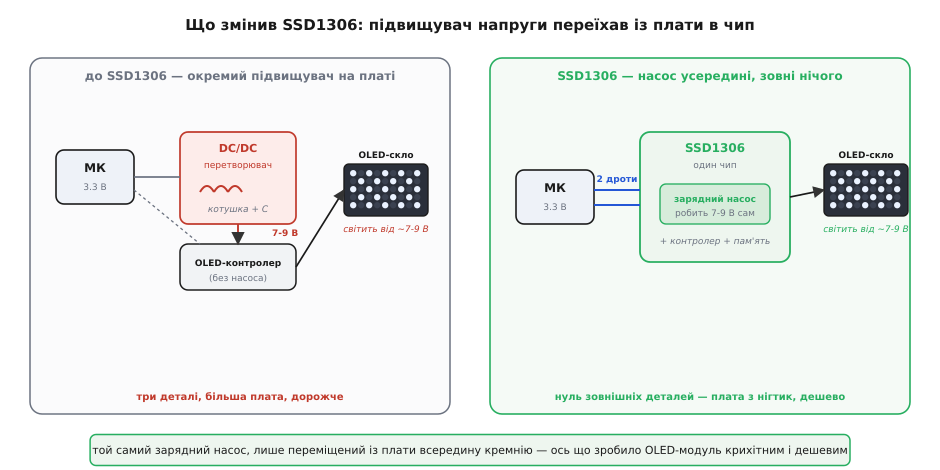

# 📜 Як один чип із Гонконгу зробив OLED дешевим: народження SSD1306

Тримаючи цей екранчик у руці, легко проґавити, який він насправді дивний. Органічний світлодіод — технологія, що десятиліттями була дорогою й примхливою, з якої роблять флагманські телевізори за тисячі доларів, — тут прилаштована до платки завбільшки з ніготь, яка коштує дрібні гроші й продається пачками. Як так сталося, що те саме сімейство дисплеїв, за яке в одному місці ринку правлять шалені ціни, в іншому валяється в коробці з дешевою дрібнотою поруч із резисторами? Відповідь майже цілком в одній мікросхемі — **SSD1306** від гонконзької **Solomon Systech**. І вся її суть — в одному хитрому рішенні: **не додати щось нове, а прибрати те, що доти сиділо зовні**. Це історія про те, як переніс схему з плати всередину кремнію — і цим відкрив цілий клас дешевих дисплеїв, яких до того просто не існувало.

## Чому OLED так важко засвітити дешево

Щоб зрозуміти, що́ саме прибрав SSD1306, треба спершу відчути незручність, яку доти терпіли всі. І корінь її — у самій фізиці органічного світлодіода.

Органічний світлодіод — це шар особливої органічної речовини між двома електродами; пропустиш крізь нього струм — він світиться сам. Явище знали давно: перші спостереження органічної електролюмінесценції сягають 1960-х. Але довго воно лишалося лабораторною цікавинкою через одну вперту перешкоду — **щоб уприснути в органічний кристал достатньо носіїв заряду й змусити його світитися, треба було подати надто високу напругу**, десятки, а то й сотні вольтів. Такий пристрій нікуди не встромиш.

Переломним був **1987 рік**: у дослідному центрі **Eastman Kodak** двоє хіміків — **Чін Ван Тан** (Ching Wan Tang, американський науковець родом із Гонконгу) і **Стівен Ван Слайк** (Steven Van Slyke) — зробили першу практичну тонкоплівкову OLED-структуру. Їхній хід — **два різні органічні шари** (один переносить дірки, другий електрони), так що світло народжується посередині, — різко збив робочу напругу й підняв ефективність. Тан за це заслужив прізвисько «батько OLED». *(Це добре задокументована, загальновизнана віха; за нею — публікація Tang & Van Slyke в Applied Physics Letters того ж року.)*

Але «різко збив» не означає «до рівня логіки». Навіть у зрілому вигляді монохромному OLED-склу, щоб яскраво світитися, треба десь **7–9 вольтів** — тоді як мікроконтролер, що ним керує, живе на 3.3 або 5 вольтах. Ось звідки й уся незручність: **у системі є два різні світи напруги**, і хтось мусить перекинути місток між ними.

> 🔧 **Навіщо це.** Тримайте цю думку — вона ключ до всієї історії. Проблема OLED ніколи не була в тому, «як його засвітити»: після Тана й Ван Слайка це вже вміли. Проблема була в тому, **як засвітити його дешево й на маленькій платі**. Скло хоче високу напругу; батарейка й логіка дають низьку; підняти одне до іншого — коштує деталей, місця й грошей. Хто прибере цей місток, той і здешевить дисплей. Саме цей місток SSD1306 і сховав усередину себе.

## Місток напруги: чому кожен OLED-модуль тягнув за собою зайву схему

Як же піднімали ці 3.3 вольта до потрібних 7–9? Класична відповідь електроніки — **підвищувальний перетворювач** (англ. *DC/DC boost converter*): схема з котушкою індуктивності, діодом, кількома конденсаторами й керувальним чипом, яка «перекачує» енергію так, що на виході напруга вища, ніж на вході. Річ звичайна й надійна — але вона займає місце на платі й складається з кількох окремих деталей, кожну з яких треба купити, поставити й розпаяти.

І ось у чому була халепа перших OLED-модулів. Мікросхема-контролер дисплея вміла багато: приймати дані від мікроконтролера, тримати пам'ять-картинку, розкладати її по пікселях. Але високу напругу вона робити **не вміла** — і тому поруч із нею на платі мусив сидіти **окремий DC/DC-перетворювач** зі своєю котушкою й обв'язкою. Виходило, що навіть найдрібніший OLED-екранчик тягнув за собою цілий вузол живлення: чип-контролер плюс перетворювач плюс жменя пасивних деталей навколо. Плата виходила більшою, дорожчою й складнішою, ніж мала б бути заради кількох тисяч пікселів.

*Обидва боки роблять те саме — піднімають 3.3 В до 7-9 В, потрібних органічному склу. Різниця лише в тому, де живе підвищувач. Ліворуч він зовні: окремий чип-перетворювач, котушка, конденсатори — три деталі, більша плата. Праворуч усе згорнуто в один кристал SSD1306; зовні не лишається нічого силового, і плата стискається до нігтика.*

Порівняйте це з тим, що робив тодішній рідкокристалічний [символьний LCD](topic:cat-hw-actuators/lcd-1602): там мороки з високою напругою взагалі не було (рідкі кристали керуються низькими рівнями), зате був свій хвіст із підсвітки й контрастної напруги. У кожної технології — свій зайвий багаж. OLED-багажем був цей перетворювач.

> 🔧 **Навіщо це.** Тут криється неочевидне: **дорогим OLED-модуль робило не саме скло, а те, що навколо нього**. Органічна матриця на дешевому монохромному дисплеї — не бозна-яка коштовність. Але поки поруч мусив сидіти окремий підвищувач напруги, уся плата була приречена бути більшою й дорожчою за LCD тієї ж ролі. OLED програвав не якістю — він програвав **зайвими деталями на платі**. Приберіть їх — і рівновага перевернеться.

## Solomon Systech: хто взявся за це

Тепер про тих, хто цей багаж прибрав. Компанія, чиє ім'я стоїть на чипі, — **Solomon Systech** (кит. 晶門科技), гонконзький розробник мікросхем для дисплеїв. Історія в неї показова: заснували її **1999 року** внаслідок **викупу менеджментом** (англ. *management buyout*) напівпровідникового підрозділу **Motorola** — команда досвідчених інженерів на чолі з **Гамфрі Люнгом** (Humphrey Leung) відкупила в американського гіганта готовий колектив розробників мікросхем разом із його напрацюваннями й правами. Тобто це не студентський стартап із нуля, а зрілий інженерний осередок, що від першого дня мав за плечима серйозну школу проєктування чипів. *(Рік заснування — 1999, походження від підрозділу Motorola й вихід на Гонконзьку біржу 2004 року (тікер 2878) — узгоджено підтверджують кілька джерел, зокрема профіль компанії та біржові довідники; статус — усталений факт.)*

Ключове ж для нашої історії — **на чому Solomon Systech зробила собі ім'я**. Фірма стала **піонером на світовому ринку драйверів PMOLED**-дисплеїв. Абревіатура **PMOLED** (англ. *Passive-Matrix OLED* — OLED із пасивною матрицею) означає простіший, дешевший різновид OLED-екранів: пікселі в ньому не мають кожен свого транзистора-«ключа» (як у дорогих AMOLED телефонів і телевізорів), а засвічуються рядок за рядком спільними драйверами. Саме такі — дрібні, монохромні, недорогі — дисплеї й потребують того чипа-драйвера, що ними керує. І в цьому вузькому, але масовому закутку Solomon Systech стала світовим лідером: за власними даними компанії, вона **першою у світі випустила однокристальний драйвер PMOLED із вбудованим контролером** і згодом тримала **понад 50% світового ринку** таких мікросхем. *(Це заяви самої компанії з її прес-матеріалів — статус: тверде твердження виробника, галуззю не спростоване; конкретна частка «понад 50%» — за версією Solomon Systech.)*

Розрізнімо тут два різні досягнення, бо їх легко змішати. **Однокристальний драйвер із контролером** — це вже велика зручність: коли приймач даних, пам'ять-картинка й драйвери пікселів зібрані в одному чипі, а не розкидані по кількох. Це Solomon Systech зробила ще раніше. Але навіть такий однокристальний драйвер сам високу напругу не робив — і поруч із ним усе одно сидів зовнішній перетворювач. Друга, окрема й пізніша перемога — прибрати вже й **його**. Саме її втілив SSD1306.

## Хід SSD1306: не додати, а прибрати

Отже, **близько 2008 року** Solomon Systech випускає **SSD1306** — однокристальний CMOS-драйвер із контролером для монохромного крапково-матричного OLED-скла на 128 сегментів і 64 спільні лінії (звідси й знайомі 128×64 пікселі). *(Рік появи — 2008 — прямо називає галузеве видання OLED-Info та випливає з прес-релізу самої компанії, що рахує поставки «2008–2016»; статус: підтверджено.)*

Сам собою «ще один однокристальний драйвер» нікого б не здивував — їх уже вміли робити. Переломною була **одна конкретна річ усередині**: SSD1306 став, за словами Solomon Systech, **першим у світі OLED-драйвером із вбудованим зарядним насосом**. *(Формулювання «world's first OLED driver IC with built-in charge pump» — дослівно з офіційного прес-релізу Solomon Systech і повторене OLED-Info; статус: заява виробника, широко відтворена, галуззю не спростована.)*

**Зарядний насос** (англ. *charge pump*) — це той самий місток напруги, але зроблений інакше, ніж класичний перетворювач. Замість котушки він піднімає напругу **самими конденсаторами**: заряджає їх паралельно від низької напруги, тоді перемикає в послідовне з'єднання — і напруги складаються. Керуючи перемиканням багато разів на секунду, дістаєш на виході стабільні кілька вольтів понад вхідні. Найголовніше для нашої історії: **насос на конденсаторах можна цілком умістити на кристалі кремнію**, бо він не потребує громіздкої котушки, яку в чип не запхаєш. Класичний DC/DC із котушкою всередину чипа не влазив — а насос на конденсаторах уліз. Докладніше про сам механізм — у [зарядному насосі](topic:hw-power/charge-pump); тут важливий саме наслідок.

А наслідок ось який. Той місток напруги, що доти обов'язково стирчав **зовні** окремими деталями, SSD1306 сховав **усередину себе**. Зовнішній DC/DC-перетворювач і вся його обв'язка — котушка, діод, конденсатори — стали **непотрібні**. За словами самої компанії, завдяки вбудованому насосу «зовнішній DC/DC-перетворювач і супутні пасивні компоненти більше не потрібні», що прямо **знижує повну вартість системи**. Чип тепер приймав свої 3.3 вольта — і **сам** робив із них 7–9 вольтів для скла, нічого не питаючи в плати.

> 🔧 **Навіщо це.** Ось точний момент, коли OLED-модуль став дешевим. Не тому, що подешевшало скло, і не тому, що винайшли якийсь новий піксель, — а тому, що **зникла ціла жменя деталей навколо чипа**. Плата, якій більше не треба нести перетворювач із котушкою, стискається до розміру самого скла плюс один чип — до того нігтика, що ви тримаєте. А менша плата з меншою кількістю деталей — це менше міді, менше монтажу, менше браку, нижча ціна. Уся дешевизна цього класу дисплеїв виросла з **одного рішення сховати підвищувач напруги в кремній**. Це і є та причина, чому OLED-екранчик опинився в коробці з дрібнотою поруч із резисторами.

І тут варто зробити чесну засторогу про причинність, бо спокуса перебільшити велика. SSD1306 не «винайшов OLED» і не «винайшов зарядний насос» — обидві речі існували до нього. Його заслуга вужча й точніша: він **першим поєднав** OLED-драйвер із насосом на одному кристалі й тим прибрав останню зовнішню силову деталь. Винахід тут — не в новому явищі, а в **правильно проведеній межі**: усе, що стосується живлення скла, тепер по один бік (усередині чипа), а зовні лишається до смішного просте — дві сигнальні лінії та живлення. Саме такі «межові» рішення, а не гучні відкриття, найчастіше й перевертають ринок.

## Чому саме він став стандартом «за замовчуванням»

Далі спрацював той самий механізм, що робить стандарти де-факто в усій електроніці, — і його варто розібрати, бо він пояснює, чому в мільйонах саморобок стоїть **саме** SSD1306, а не якийсь із десятків можливих аналогів.

Щойно модуль на SSD1306 став **найдешевшим і найменшим** способом дістати графічний екран, він почав розходитися масово. А масовість запускає снігову кулю. Виробники модулів роблять плати саме під цей чип, бо він дешевий. Автори бібліотек для мікроконтролерів пишуть підтримку саме під нього, бо таких модулів найбільше. Ті готові бібліотеки притягують нових користувачів, бо з ними екран оживає за п'ять рядків коду. Нові користувачі створюють іще більший попит — і виробники роблять іще більше плат саме під SSD1306. Кожен виток робить наступний вигіднішим; вибір щоразу той самий. Так чип, що дав рішенню поштовх, замикає ринок на себе: його ставлять, **тому що** його вже всюди ставлять.

Компанія й сама зафіксувала цей підсумок: за її формулюванням, вдале поєднання властивостей зробило SSD1306 **стандартом де-факто для проєктування PMOLED-модулів**, придатним для найрізноманітніших смарт-пристроїв — від носимої електроніки, кишенькових Wi-Fi-точок і додаткових екранчиків телефонів до промислових і навчальних приладів. *(«De facto standard for PMOLED module design» — знову формулювання з прес-релізу Solomon Systech; статус: заява виробника, що добре узгоджується зі спостережуваним засиллям цього чипа на ринку.)*

Масштаб цього засилля видно з однієї цифри. У січні 2017 року Solomon Systech оголосила, що SSD1306 **перевищив 200 мільйонів проданих штук** — сукупно за **2008–2016 роки**, — і назвала це рекордом поставок у своєму сімействі драйверів. *(Обсяг «200 млн штук» за 2008–2016 — з офіційного прес-релізу компанії від 13 січня 2017 року, продубльованого OLED-Info 24 січня 2017; статус: підтверджено первинним джерелом. Зауважте: цифра станом на 2016 рік — відтоді чип продавали ще роками, тож реальний сукупний наклад більший.)* Двісті мільйонів однакових чипів — це і є фізичне пояснення, чому будь-який приклад для будь-якого мікроконтролера так легко знаходить під рукою саме такий дисплей: їх зробили сотні мільйонів, вони скрізь.

## Що з цього лишилося в чипі, який ви тримаєте

Коли тепер повернутися до модуля в руці, його дивна двоїстість перестає бути загадкою. Дорогим OLED роблять не пікселі — а те, що доти мусило сидіти навколо них. SSD1306 прибрав це «навколо», згорнувши місток напруги в кремній, — і саме тому та сама органіка, що в телевізорі коштує статки, тут дісталася ціни жмені дрібних деталей.

Ба більше, головна практична пастка цього дисплея — **пряме відлуння** тієї самої історії. Зарядний насос у SSD1306 за замовчуванням **вимкнений**, і ввімкнути його треба окремою командою в ініціалізації. Забудеш — і чип чесно приймає дані по [шині I2C](topic:com-devices/i2c-bus), а екран лишається чорний: місток напруги на місці, всередині чипа, але не ввімкнений, тож світитися нічому. Виходить, та сама схема, що зробила цей дисплей дешевим, лишила по собі й найпідступніший спосіб його «не оживити». Зручність і пастка тут — дві сторони одного рішення: сховати підвищувач напруги всередину.

І остання, ширша думка. SSD1306 — приклад узагальненої ідеї [контролера дисплея](topic:hw-motion/display-controller), доведеної майже до межі: чипа, якому шлють картинку, а він сам робить усе інше, включно з живленням скла. Найдужче в цій історії те, що переломним виявився не якийсь блискучий винахід, а **скромне інженерне рішення прибрати зайве** — перенести давно відому схему з плати всередину кремнію. Часто саме так і рухається техніка вперед: не новим явищем, а тим, що хтось нарешті прибрав деталь, яку всі доти вважали неминучою.
