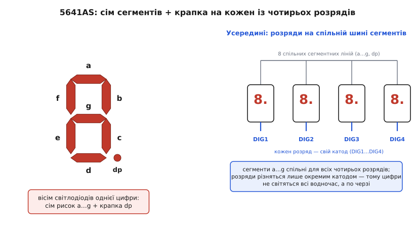
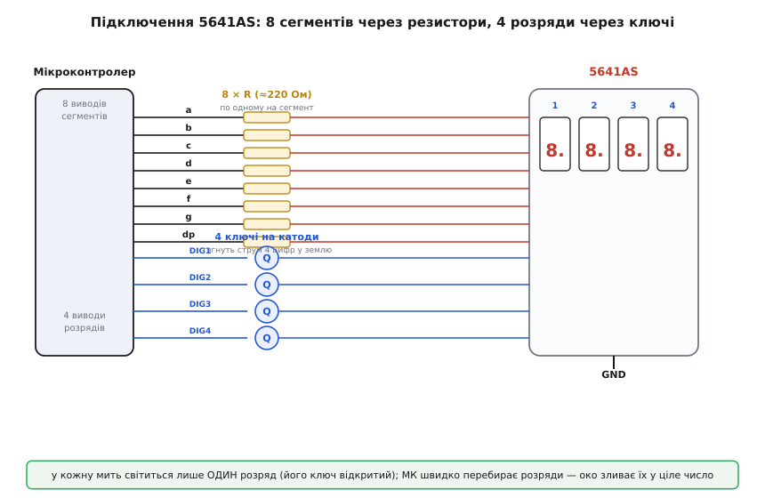

# Семисегментний індикатор 5641AS (4 розряди)

<preknowlist>
- [Світлодіод](topic:hw-motion/led) — світиться лише при струмі в один бік; має порогову пряму напругу, після якої струм різко зростає.
- [Резистор](topic:hw-components/resistor) — обмежує струм за законом Ома; без нього світлодіод спалахує й гине.
- [BJT-ключ](topic:hw-components/bjt-switch) — транзистор, що вмикається малим струмом бази й пропускає крізь себе великий струм; так слабкий вивід МК керує сильним навантаженням.
- [GPIO-регістри](topic:sf-devices/gpio-registers) — як прошивка виставляє логічну одиницю чи нуль на конкретному виводі мікроконтролера.
</preknowlist>

Червоні цифри на мікрохвильовці, на автомобільному годиннику, на дешевому вольтметрі-китайці — усе це майже напевно вони: **семисегментні індикатори**. 5641AS — найходовіший чотирирозрядний із них, той самий брусок завдовжки з фалангу пальця, з чотирма великими червоними «вісімками» під темним склом і гребінкою з дванадцяти ніжок знизу. Він коштує копійки, лежить у кожному наборі-конструкторі й показує будь-яке чотиризначне число: температуру, лічильник, час, покази давача. Літери «AS» у назві — не випадкові: вони кажуть, що всередині **спільний катод** (англ. *cathode* — той електрод, куди струм витікає), і від цього залежить геть усе, як його вмикати. Розберімо цей конкретний індикатор так, щоб упізнати його серед схожих, правильно розвести дванадцять ніжок і не спалити жоден із двадцяти восьми світлодіодів усередині.

Головна несподіванка чекає новачка одразу: ніжок дванадцять, а світних елементів — двадцять вісім (чотири цифри по сім сегментів плюс чотири крапки). Дванадцятьма дротами керувати двадцятьма вісьмома лампочками наче неможливо. Саме те, як 5641AS цю неможливість обходить, і є суть його влаштування — і причина половини помилок при першому підключенні.

## Що це таке: двадцять вісім світлодіодів на дванадцяти ногах

Почнімо з одного розряду. Кожна цифра — це вісім окремих [світлодіодів](topic:hw-motion/led), викладених так, щоб із них можна було скласти будь-яку цифру: сім довгих рисок-сегментів у формі вісімки плюс маленька кругла крапка збоку. Сегменти за домовленістю звуть літерами: верхня риска — `a`, далі за годинниковою стрілкою `b`, `c`, `d`, `e`, `f`, а перекладина посередині — `g`. Крапку звуть `dp` (англ. *decimal point* — десяткова кома). Засвітивши потрібні сегменти, дістаємо цифру: `a b c d e f` без середньої — це «0»; тільки `b c` — «1»; `a b g e d` — «2», і так далі.


*Зліва — одна цифра: сім рисок a…g складають вісімку, збоку крапка dp; разом вісім світлодіодів. Справа — усі чотири розряди висять на спільній шині з восьми сегментних ліній, а різняться тільки окремим катодом (DIG1…DIG4). Тому в кожну мить світиться лише один розряд.*

Тепер ключове. Усі вісім світлодіодів однієї цифри з'єднані **одним боком разом** — усі їхні катоди зведено в один спільний вивід цієї цифри. Це і є «спільний катод». А щоб не тягти вісім сегментних ліній до кожної з чотирьох цифр окремо (це були б 32 дроти), сегменти **спільні для всіх розрядів**: вивід сегмента `a` — це одна ніжка, і вона веде до сегмента `a` **всіх чотирьох** цифр одразу. Так само `b`, `c` і решта.

Порахуймо ноги. Вісім спільних сегментних ліній (`a`…`g` і `dp`) плюс чотири окремі катоди розрядів — разом дванадцять. Ось звідки дванадцять ніжок на двадцять вісім світлодіодів: сегменти діляться на всіх, а розряди розрізняються лише своїм катодом.

> 🔧 **Навіщо це.** Ця економія ніжок — не безкоштовна. Раз сегмент `a` спільний для всіх цифр, то, подавши на нього струм, ви засвітите верхню риску **одразу в усіх чотирьох** розрядах — там, де катод відкритий. Тобто «намалювати різні цифри в різних розрядах одночасно» ця схема фізично не вміє. Вона вміє лише показувати **одну цифру за раз** — ту, чий катод зараз під'єднано до землі. Уся хитрість виводу чотиризначного числа зводиться до того, щоб швидко цю єдину активну цифру перемикати.

## Головна ідея: розгортка й інерція зору

Отже, індикатор уміє показувати лише один розряд у кожну мить. Як тоді на ньому світяться чотири різні цифри водночас? Відповідь — **вони не світяться водночас**. Вони блимають по черзі так швидко, що око не встигає помітити мерехтіння й зливає окремі спалахи в суцільну картинку. Цей прийом зветься **мультиплексна розгортка** (англ. *multiplexing* — ущільнення, поділ спільного ресурсу в часі), а обманює нас **інерція зору**: світло, що згасло, ще якусь мить «горить» на сітківці.

Працює це так. Мікроконтролер виставляє на восьми спільних сегментних лініях візерунок для **першої** цифри — скажімо, «3». Одночасно він відкриває **тільки катод першого розряду**, а катоди решти трьох тримає відключеними. Струм тече лише крізь перший розряд — на ньому спалахує «3», решта темні. За частку мілісекунди МК гасить усе, ставить на сегментах візерунок **другої** цифри, відкриває катод **другого** розряду — і «3» зникає, а в другій позиції спалахує, скажімо, «7». Потім третя, четверта, і знову по колу.

Якщо пробігати всі чотири розряди досить швидко — приблизно від сотні разів на секунду й частіше, — око не бачить окремих спалахів. Воно бачить рівне число «3 7 …», яке ніби горить усе разом. Насправді ж будь-якої миті реально світиться **рівно один** розряд.

```
Час →   0.0 мс      2.5 мс      5.0 мс      7.5 мс     10.0 мс ...
        ┌────────┐  ┌────────┐  ┌────────┐  ┌────────┐
Розряд  │  DIG1  │  │  DIG2  │  │  DIG3  │  │  DIG4  │  →  знову DIG1
активн. │ «3»    │  │ «7»    │  │ «2»    │  │ «5»    │
        └────────┘  └────────┘  └────────┘  └────────┘
        решта       решта       решта       решта
        темні       темні       темні       темні
```

Один повний оберт по чотирьох розрядах за 10 мс — це 100 повних кадрів за секунду. Такого достатньо, щоб мерехтіння зникло. Звідси одразу два практичні наслідки, які визначають якість картинки.

По-перше, **чим повільніша розгортка, тим помітніше блимання**. Якщо код відволікся на довгу операцію й не встиг вчасно перемкнути розряд, з'являється видиме тремтіння. Тому оновлення дисплея зазвичай вішають на апаратний таймер, а не на «коли дійдуть руки в головному циклі».

По-друге — і це важить для яскравості, — кожен розряд світиться лише **чверть часу** (поки активний він, решта три темні). Виходить, середня яскравість учетверо нижча, ніж якби цифра горіла постійно. Компенсують це тим, що під час свого короткого вікна сегмент женуть **сильнішим струмом**, ніж дозволено в тривалому режимі, — саме тому в даташиті поряд із «тривалим» струмом 30 мА стоїть окремий «піковий» 200 мА для імпульсного режиму. Око бачить середнє, а короткий яскравий спалах виглядає яскравіше, ніж дало б те саме середнє рівним світлом.

> Розгортка тут — окремий випадок [мультиплексування виводів](topic:sf-devices/pin-multiplexing): один набір ліній обслуговує багато споживачів, розділяючись між ними в часі. Це той самий принцип, яким клавіатури опитують матрицю клавіш, а індикатори — керують багатьма сегментами кількома дротами: ущільнити ресурс, платячи за це швидким перебором.

## Розпіновка: яка ніжка за що

Тепер до конкретики цього індикатора — дванадцяти ніжок. Тримаючи 5641AS написом до себе, крапками донизу, ніжки рахують **проти годинникової стрілки, починаючи з лівої нижньої**: пін 1 — лівий нижній, далі вправо по нижньому ряду до піна 6, тоді пін 7 — правий верхній, і вліво по верхньому ряду до піна 12 над піном 1. Розкладка виходить така:

```
Пін   Функція        Пін   Функція
────────────────     ────────────────
 1    сегмент  e       7    сегмент  b
 2    сегмент  d       8    катод DIG3
 3    крапка   dp      9    катод DIG2
 4    сегмент  c      10    сегмент  f
 5    сегмент  g      11    сегмент  a
 6    катод DIG4      12    катод DIG1
```

Отже, **вісім сегментних ніжок** — 11(`a`), 7(`b`), 4(`c`), 2(`d`), 1(`e`), 10(`f`), 5(`g`), 3(`dp`) — і **чотири катодні ніжки** розрядів: 12(DIG1), 9(DIG2), 8(DIG3), 6(DIG4). Розряди рахують зліва направо: DIG1 — крайня ліва цифра, DIG4 — крайня права.

Порядок ніжок навмисно «перемішаний» — сегменти й катоди чергуються, а не йдуть підряд. Це наслідок того, як зручніше розвести доріжки всередині корпусу, і воно нічого не означає для схеми, крім одного: **звірятися з цією таблицею обов'язково**, бо «на око» вгадати, де тут `a`, а де катод, неможливо. Числа в таблиці — для класичного 5641AS; варіанти від інших виробників у тому самому корпусі майже завжди повторюють цю розкладку, але перед розведенням варто глянути в даташит саме своєї партії, надто якщо на кристалі інший колір.

> 🔧 **Навіщо це.** Найшвидший спосіб перевірити невідомий екземпляр, не лізучи в даташит, — «продзвонити» його. Візьміть 3-вольтову батарейку-таблетку з послідовним резистором на кількасот ом, торкніться мінусом однієї з ніжок-кандидатів на катод, а плюсом пройдіться по інших: щойно якийсь сегмент спалахне — ви знайшли пару «сегмент — катод розряду». Пройшовши так усі ніжки, відновите розкладку за п'ять хвилин навіть для індикатора без маркування. Резистор тут обов'язковий — без нього ви женете крізь один світлодіод весь струм батарейки й ризикуєте його спалити.

## Підключення: резистор на кожен сегмент і ключ на кожен розряд

Схема підключення прямо випливає з розгортки. До восьми сегментних ліній ідуть виводи мікроконтролера, а чотирма катодами хтось має по черзі «замикати» розряди на землю. Тут два вузли, які не можна пропустити.


*Вісім сегментних ліній ідуть від МК кожна через свій струмообмежувальний резистор на спільні сегментні виводи індикатора. Чотири катоди розрядів заведено на транзисторні ключі, які по черзі притягують потрібний розряд до землі. У кожну мить відкритий лише один ключ — світиться лише його цифра.*

**Резистор на кожен сегмент.** Світлодіод не можна вмикати напряму до виводу — він [обмежує струм](topic:hw-components/resistor) сам ніяк, і без баласту миттєво згорить. Тому в розрив кожної сегментної лінії ставлять струмообмежувальний резистор. Оцінити його номінал легко з закону Ома. Вивід мікроконтролера дає, скажімо, 3.3 В, на червоному світлодіоді падає його пряма напруга близько 1.8 В, решта — на резисторі:

```
U_рез = U_живл − U_світлодіода = 3.3 − 1.8 = 1.5 В
```

Задавши бажаний струм сегмента, дістаємо опір. Візьмімо помірні 10 мА:

```
R = U_рез / I = 1.5 В / 0.010 А = 150 Ом
```

Звідси й береться той самий «220 Ом», що радять у кожному підручнику: він дає струм із запасом униз (близько 7 мА), світить трохи тьмяніше, зате гарантовано береже і світлодіод, і вивід МК. Важлива дрібниця: **резистор потрібен саме на сегментній лінії, а не на катоді розряду**. Якби ви поставили один резистор на спільний катод, струм крізь нього залежав би від того, скільки сегментів зараз горить, — і «1» (два сегменти) світилася б помітно яскравіше за «8» (усі сім). Резистор на кожному сегменті тримає струм кожної риски незалежним від сусідів.

**Ключ на кожен розряд.** Тепер про катоди. Здавалося б, катод можна просто завести на вивід МК, налаштований на нуль. Але порахуймо струм. Коли на розряді «8», світяться всі вісім сегментів, і крізь спільний катод тече сума їхніх струмів — вісім разів по, скажімо, 10 мА, а в імпульсному режимі й більше: сотня-дві міліампер. Стільки один вивід мікроконтролера безпечно **прийняти в себе не може** — допустимий струм на вивід зазвичай десятки міліампер, не більше. Тому катод заводять не прямо на МК, а на [транзисторний ключ](topic:hw-components/bjt-switch): слабкий вивід лише керує базою, а весь струм розряду тече крізь транзистор у землю. Для спільного катода потрібен ключ, що замикає лінію **на землю**, — це npn-транзистор (або n-канальний польовий) у нижньому плечі.

Виходить чотири ключі — по одному на розряд, — і код у кожну мить відкриває рівно один. Разом схема така: вісім ліній «сегменти через резистори» задають, *що* показати, а чотири лінії «розряди через ключі» задають, *де* це показати. Це рівно розділення на візерунок і позицію, з якого починалася розгортка.

## Керування з коду

Логіка прошивки повторює картинку розгортки один-в-один. Спершу заводять **таблицю візерунків**: для кожної цифри 0–9 — байт, у якому кожен біт відповідає одному сегменту. Потім переривання таймера раз на кілька мілісекунд робить один крок: гасить попередній розряд, викладає на сегментні виводи байт наступної цифри, вмикає ключ наступного розряду.

**Таблиця сегментів для спільного катода.** У спільному катоді сегмент світиться, коли на його лінію подано **логічну одиницю** (плюс), бо катод притягнуто до землі ключем. Тож байт цифри — це просто набір одиниць у розрядах тих сегментів, що мають горіти. Ось шматок такої таблиці й один крок розгортки:

```c
// Порядок бітів у байті: dp g f e d c b a  (біт0 = a ... біт7 = dp)
// Спільний катод: 1 = сегмент горить.
const uint8_t DIGIT[10] = {
    0b00111111, // 0 : a b c d e f
    0b00000110, // 1 : b c
    0b01011011, // 2 : a b g e d
    0b01001111, // 3 : a b g c d
    0b01100110, // 4 : f g b c
    0b01101101, // 5 : a f g c d
    0b01111101, // 6 : a f g e d c
    0b00000111, // 7 : a b c
    0b01111111, // 8 : усі сім
    0b01101111, // 9 : a b c d f g
};

volatile uint8_t buf[4] = {1, 2, 3, 4};   // що показати в кожному розряді
volatile uint8_t pos = 0;                 // який розряд зараз активний

// Викликається таймером, напр. кожні 2.5 мс (→ 100 Гц на 4 розряди)
void refresh_isr(void)
{
    all_digits_off();                 // 1) погасити всі катодні ключі
    put_segments(DIGIT[buf[pos]]);    // 2) виставити байт сегментів
    digit_on(pos);                    // 3) відкрити ключ цього розряду
    pos = (pos + 1) & 3;              // наступний розряд по колу (0..3)
}
```

Тут `put_segments()` розкладає вісім бітів по восьми сегментних виводах, `digit_on()` відкриває ключ потрібного розряду, а `all_digits_off()` перед тим гасить усі — це критично: якщо не погасити старий розряд **до** зміни сегментів, устигне блимнути неправильна комбінація на сусідній цифрі (так званий *ghosting* — примарне світіння). Повна робоча реалізація з поправкою на конкретні виводи, обчисленням крапок і виводом довільного числа винесена в окремий приклад [керування 5641AS у коді](topic:cat-hw-actuators/seg-5641as/api-scan-driver.md): там і таблиця з крапкою, і розкладка бітів на реальні GPIO, і boротьба з ghosting-ом.

> 🔧 **Навіщо це.** Порядок трьох дій у перериванні — не формальність, а захист від примар. Пропустите «погасити все» на початку — і поки нові сегменти вже виставлені, а старий розряд ще відкритий частку мікросекунди, він устигне показати чужу цифру блідою тінню. Око зловить це як брудні, розмиті цифри. Тому залізне правило розгортки: **спочатку вимкни, потім перемалюй, потім увімкни** — саме в такому порядку.

## Граблі, на яких спотикаються

Зберімо в одному місці те, на чому губиться найбільше часу з цим індикатором.

**Переплутаний тип: катод чи анод.** 5641AS — спільний **катод**, і код під нього подає на сегменти одиницю, а розряд замикає на землю. Його брат-близнюк 5641**BS** — спільний **анод**: там усе дзеркально, розряд підключають до плюса, а сегмент запалюють нулем. Візерунки цифр у таблиці для анода — інвертовані. Якщо ви взяли код для одного, а індикатор іншого типу — не засвітиться нічого або засвітиться маячня. Літера в назві (`AS` проти `BS`) — перше, що треба звірити; на око вони не відрізняються.

**Немає резисторів або один спільний.** Без струмообмежувальних резисторів сегменти спершу світять сліпуче яскраво, а тоді вигорають — і вивід МК разом із ними. Один резистор на спільному катоді замість восьми на сегментах дає нерівну яскравість: цифри з малою кількістю сегментів («1») світяться яскравіше за «8». Правильно — **свій резистор на кожну з восьми сегментних ліній**.

**Катод напряму на вивід МК.** Спокуса завести катод розряду просто на ніжку мікроконтролера закінчується перевантаженням: сумарний струм восьми сегментів «8» перевищує допустимий струм виводу. Через тиждень такий вивід деградує. Катоди — **тільки через транзисторні ключі**.

**Видиме блимання.** Якщо розгортка йде з головного циклу й код часом надовго відволікається, розряди перемикаються нерівномірно — з'являється тремтіння. Ліки: вішати `refresh_isr()` на апаратний таймер, щоб перемикання йшло рівно, незалежно від того, чим зайнятий головний код.

**Примарне світіння (ghosting).** Бліді «тіні» чужих сегментів на сусідніх цифрах — ознака того, що розряд перемикають, не погасивши попередній. Порядок «вимкнув → перемалював → увімкнув» усуває це.

**Занадто тьмяно.** Раз кожен розряд світиться лише чверть часу, повне число вчетверо тьмяніше за постійно ввімкнений сегмент. Якщо мало — підніміть струм сегмента (менший резистор, у межах пікового струму з даташита) або переконайтеся, що частота розгортки не завелика: надто короткі спалахи теж крадуть яскравість.

## Чим 5641AS відрізняється від сусідів

5641AS — не єдиний індикатор цього роду, і корисно знати, серед чого його впізнавати.

**За кількістю розрядів.** 5641AS — чотири цифри. Одноцифровий брат [5161AS](topic:cat-hw-actuators/seg-5161as) має ту саму логіку, але один розряд і десять ніжок (вісім сегментів плюс, як правило, два з'єднані спільні катоди); розгортка йому не потрібна взагалі — цифра світиться постійно. Бувають дво- й трирозрядні варіанти; принцип той самий, змінюється лише кількість катодних ліній.

**За типом спільного виводу.** `AS` — спільний катод, `BS` — спільний анод (той самий корпус, дзеркальне керування). Вибір диктує схема: якщо ваші ключі зручніше ставити в нижнє плече (на землю) — беріть катод; якщо у верхнє (до плюса) — анод.

**За висотою й кольором.** «56» у назві — це висота цифри **0.56 дюйма** (14 мм); є більші (0.8″, 1″) і менші. Колір червоний — найдешевший і найяскравіший на однаковому струмі; зелені, сині, білі коштують дорожче й мають вищу пряму напругу, тож резистори під них рахують заново.

**За способом керування.** Голий 5641AS вимагає від вас усієї розгортки в коді й вісьмох-дванадцятьох виводів. Якщо виводів шкода, між МК і індикатором ставлять [зсувний регістр](topic:hw-digital/shift-register) на кшталт [74HC595](topic:cat-hw-parts/74hc595): він приймає дані по трьох дротах послідовно й віддає їх на вісім сегментних ліній паралельно, економлячи ноги мікроконтролера. А готові модулі на спеціальних драйверах (TM1637 та подібні) беруть розгортку цілком на себе — їм ви шлете просто число по двох дротах, і вони самі женуть мультиплекс. Але це вже інші вироби; сам 5641AS — саме голий індикатор, який усю цю роботу лишає вашій прошивці.

> 🔧 **Навіщо це.** Практичне правило вибору коротке. Треба показати число, виводів вистачає, і не шкода написати десяток рядків розгортки — беріть **голий 5641AS** із вісьмома резисторами й чотирма ключами, це найдешевше. Виводів мало — додайте **зсувний регістр** на сегменти. Не хочете морочитися з розгорткою взагалі — беріть **модуль із драйвером** (TM1637 тощо), він приховає весь мультиплекс, але коштуватиме дорожче й зробить вивід трохи менш гнучким.
