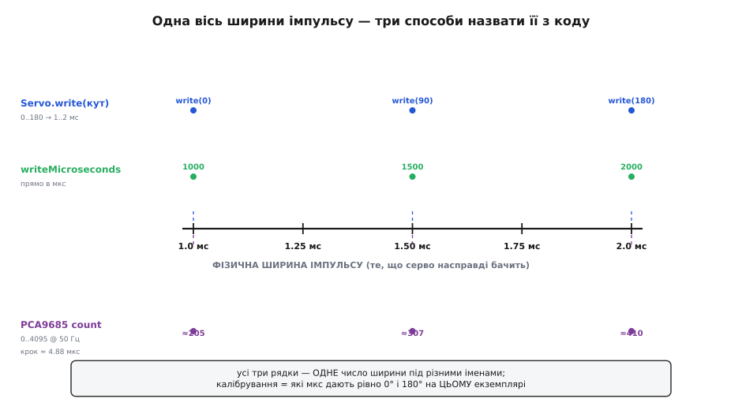

# ⚙️ Керуємо SG90 з коду: від першого `write()` до купи серв на PCA9685

Серво вже під'єднане: сигнальний дріт на вивід мікроконтролера, живлення — від окремого джерела 5 В, земля плати й джерела зведені в один вузол. Лишилося сказати валу кут — і саме тут, у коді, ховаються всі дрібні розчарування, через які новачок думає, що серво «бракове»: воно недокручує пару градусів, смикається на переходах, тремтить, коли до нього чіпляєш ще одне. Жодне з цих явищ не поломка — усі вони прямо випливають із того, як формується керувальний імпульс. Розберімо керування шар за шаром: спершу найпростіший робочий скетч, потім чому він трохи бреше й як це виправити, далі плавний рух, і нарешті два способи для випадків, коли одного `Servo.write()` замало — прямий апаратний ШІМ і окремий драйвер на багато каналів.

Уся мова тут — **ширина позитивного імпульсу, що повторюється кожні 20 мілісекунд** (частота 50 Гц). Приблизно 1.0 мс жене вал в одне крайнє, 1.5 мс — на нейтраль (середину), 2.0 мс — в інше крайнє; проміжні ширини дають проміжні кути лінійно. Усе, що робить будь-яка бібліотека чи будь-який драйвер, — це різними зручними іменами (кут, мікросекунди, лічильник) називати те саме одне число: скільки часу тримати сигнал «високим».


*Три способи назвати одне число. Бібліотека `Servo` бере кут 0..180 і сама розкладає його в 1..2 мс; `writeMicroseconds()` задає ту саму ширину прямо; PCA9685 рахує її у своїх дискретних кроках (12 біт, ≈4.88 мкс на крок при 50 Гц). Калібрування — це не що інше, як з'ясувати, які саме мікросекунди дають рівно 0° і 180° на конкретному екземплярі.*

> 🔧 **Навіщо це.** Тримаючи в голові одну картину «код → ширина імпульсу → кут», ви перестаєте гадати. Серво стало не туди — питаєте себе: яку ширину я насправді послав? Смикнулося — де в коді з'явився блокувальний `delay`, що збив рівний потік імпульсів? Затремтіло, щойно додав друге, — чи не просів струм? Кожен симптом читається як наслідок конкретного рядка, а не як норов пластикової коробочки.

## Найпростіше, що працює: готовий шар над таймером

Хоч би яке було середовище, першу серву запускають однаково: беруть **апаратний таймер** мікроконтролера, вішають на нього ніжку й доручають йому тримати рівний потік імпульсів кожні 20 мс у фоні, не займаючи головний цикл. Різниця лише в тому, скільки того таймера видно. В Arduino його ховає стандартна бібліотека `Servo`, лишаючи два виклики — `attach()` (сказати, на якій ніжці серво) і `write()` (задати кут). В ESP-IDF готової «серви» нема: беруть ШІМ-блок **LEDC** і самі кажуть йому 50 Гц. На STM32 таймер ставлять у режим PWM, і ширина імпульсу лежить прямо в регістрі порівняння. Ось той самий приклад, що ставить вал на кілька позицій по черзі:

:::tabs
```arduino
#include <Servo.h>

Servo sg90;                 // об'єкт-серво

void setup() {
  sg90.attach(9);           // сигнальний дріт SG90 — на цифровий вивід D9
  // (вивід має вміти PWM не обов'язково: бібліотека сама смикає ніжку по таймеру)
}

void loop() {
  sg90.write(0);            // одне крайнє (≈0°)
  delay(1000);             // дати серву час доїхати (~0.4 с) і постояти
  sg90.write(90);           // нейтраль (середина)
  delay(1000);
  sg90.write(180);          // інше крайнє (≈180°)
  delay(1000);
}
```
```esp-idf
#include "driver/ledc.h"
#include "freertos/FreeRTOS.h"
#include "freertos/task.h"

#define SERVO_GPIO  18
#define PERIOD_US   20000               // 20 мс = 50 Гц
#define MAX_DUTY    65535               // лічильник 16 біт

static void servo_init(void) {
  ledc_timer_config_t t = {
    .speed_mode      = LEDC_LOW_SPEED_MODE,
    .duty_resolution = LEDC_TIMER_16_BIT,
    .timer_num       = LEDC_TIMER_0,
    .freq_hz         = 50,              // період 20 мс — головна умова
    .clk_cfg         = LEDC_AUTO_CLK,
  };
  ESP_ERROR_CHECK(ledc_timer_config(&t));

  ledc_channel_config_t c = {
    .gpio_num   = SERVO_GPIO,           // сигнальний дріт SG90
    .speed_mode = LEDC_LOW_SPEED_MODE,
    .channel    = LEDC_CHANNEL_0,
    .timer_sel  = LEDC_TIMER_0,
    .duty = 0, .hpoint = 0,
  };
  ESP_ERROR_CHECK(ledc_channel_config(&c));
}

static void servo_write_us(int us) {    // ширина імпульсу → код заповнення
  uint32_t duty = (uint32_t)((int64_t)us * MAX_DUTY / PERIOD_US);
  ledc_set_duty(LEDC_LOW_SPEED_MODE, LEDC_CHANNEL_0, duty);
  ledc_update_duty(LEDC_LOW_SPEED_MODE, LEDC_CHANNEL_0);
}

static void servo_write_deg(int deg) {  // градусів у залізі нема — рахуємо самі
  servo_write_us(1000 + deg * (2000 - 1000) / 180);
}

void app_main(void) {
  servo_init();
  while (1) {
    servo_write_deg(0);   vTaskDelay(pdMS_TO_TICKS(1000));  // одне крайнє
    servo_write_deg(90);  vTaskDelay(pdMS_TO_TICKS(1000));  // нейтраль
    servo_write_deg(180); vTaskDelay(pdMS_TO_TICKS(1000));  // інше крайнє
  }
}
```
```stm32
/* TIM3_CH1 у режимі PWM, налаштований так, щоб один тік лічильника = 1 мкс,
   а період = 20 000 тіків: Prescaler = f_таймера/1 МГц − 1, ARR = 20000 − 1.
   Тоді регістр порівняння CCR1 і є ширина імпульсу в мікросекундах. */
#include "main.h"

extern TIM_HandleTypeDef htim3;

static void servo_write_us(uint16_t us) {
  __HAL_TIM_SET_COMPARE(&htim3, TIM_CHANNEL_1, us);   // CCR1 = мкс напряму
}

static void servo_write_deg(int deg) {                // градусів у залізі нема
  servo_write_us(1000 + deg * (2000 - 1000) / 180);
}

int main(void) {
  HAL_Init();
  SystemClock_Config();
  MX_GPIO_Init();
  MX_TIM3_Init();
  HAL_TIM_PWM_Start(&htim3, TIM_CHANNEL_1);           // пустити генерацію 50 Гц

  while (1) {
    servo_write_deg(0);   HAL_Delay(1000);            // одне крайнє
    servo_write_deg(90);  HAL_Delay(1000);            // нейтраль
    servo_write_deg(180); HAL_Delay(1000);            // інше крайнє
  }
}
```
:::

Розберімо варіант із бібліотекою, бо за трьома рядками ховається все важливе. Виклик `attach(9)` не просто «запам'ятовує ніжку»: він каже бібліотеці почати генерувати на D9 імпульси й одразу ставить серво в нейтраль (типово ~1.5 мс). Далі `write(90)` перекладає число «90» у ширину імпульсу — бібліотека лінійно відображає діапазон кутів `0..180` у діапазон мікросекунд, який за замовчуванням становить **544..2400 мкс** (константи `MIN_PULSE_WIDTH` і `MAX_PULSE_WIDTH` у бібліотеці). Тобто `write(90)` дає приблизно 1472 мкс, а не рівно 1500. Це вже перший натяк, чому кут трохи «не той», — до цього повернемося.

Критично важливий тут `delay(1000)`. Серво **не стрибає** в позицію миттєво: SG90 перекладає вал на 60° приблизно за 0.1..0.12 с, на повні 180° — за 0.3..0.4 с. Якщо викликати `write(0)` і зразу `write(180)` без паузи, серво навіть не встигне зрушити на перший кут, як уже отримає другий — ви побачите тільки рух до останнього. Пауза дає валу доїхати. У цьому навчальному прикладі `delay` доречний; але саме він стане ворогом, щойно нам знадобиться робити щось іще, поки серво їде, — про це в розділі про плавний рух.

> 🔧 **Навіщо це.** `Servo` — правильний перший інструмент саме тому, що бере на себе тайминг. Новачок, який пробує «сам смикати ніжку» через `digitalWrite` і `delay`, майже завжди помиляється з періодом і отримує серво, що коливається як навіжене. Бібліотека тримає 50 Гц залізно й у фоні; ви думаєте кутами, а не мікросекундами. Обмеження цього зручного шару вилазять пізніше — коли кут треба точний до градуса або коли серв багато, — і тоді ми спускаємося на рівень нижче.

Один нюанс сумісності. Класична `Servo` писана під 8-бітні AVR (Uno, Nano, Mega) і смикає ніжку по таймеру мікроконтролера. На інших платах API той самий, а реалізація інша: на ESP32 роль виконує бібліотека `ESP32Servo` (сумісний інтерфейс `attach`/`write`/`writeMicroseconds`, але під капотом — апаратний ШІМ-блок LEDC), на платах RP2040 — свій порт. Скетч вище переноситься майже дослівно; змінюється лише рядок `#include`.

## Чому `write(90)` бреше — і як його випрямити

Тепер найкорисніше знання про SG90 у коді. Ви пишете `write(90)`, очікуючи рівну середину ходу, а вал стає трохи не там — на пару-трійку градусів убік. Це не дефект серва й не помилка бібліотеки; це **складання двох незалежних неточностей**, і кожну можна прибрати.

Перша неточність — у самій бібліотеці. Як ми бачили, `Servo` за замовчуванням розкладає кути `0..180` у мікросекунди `544..2400`. Але це **каталожний, теоретичний діапазон** із даташита Tower Pro, а не реальний механічний хід вашого екземпляра. Реальний SG90 звичайно ходить у вужчому вікні — приблизно `1000..2000` мкс, а часто ще й не симетрично: в одного нейтраль на 1500 мкс, в іншого на 1450. Тож коли бібліотека для `write(90)` видає ~1472 мкс, вона влучає не в реальну середину конкретного серва, а в середину теоретичного діапазону — звідси й промах.

Друга неточність — у самому серві. Дешевий потенціометр і мертва зона ~1..2° означають, що навіть ідеально правильну ширину серво відпрацює «десь коло» цілі. З цим нічого не вдієш — це клас пристрою. Але першу неточність прибрати легко: **говоріть із серво прямо в мікросекундах, оминаючи перерахунок через кути.** В Arduino для цього є `writeMicroseconds()`; там, де ви самі налаштовуєте таймер, цієї неточності просто нема звідки взятися — нічого, крім мікросекунд, у коді й не було:

:::tabs
```arduino
#include <Servo.h>
Servo sg90;

void setup() {
  sg90.attach(9);
}

void loop() {
  sg90.writeMicroseconds(1000);   // одне крайнє — задаємо ширину НАПРЯМУ
  delay(1000);
  sg90.writeMicroseconds(1500);   // справжня нейтраль (для цього екземпляра)
  delay(1000);
  sg90.writeMicroseconds(2000);   // інше крайнє
  delay(1000);
}
```
```esp-idf
// LEDC знає лише кроки лічильника, тож servo_write_us() з попереднього
// прикладу — і є весь «прямий» рівень: жодних кутів між вами й імпульсом.
void app_main(void) {
  servo_init();
  while (1) {
    servo_write_us(1000);   vTaskDelay(pdMS_TO_TICKS(1000));  // одне крайнє
    servo_write_us(1500);   vTaskDelay(pdMS_TO_TICKS(1000));  // справжня нейтраль
    servo_write_us(2000);   vTaskDelay(pdMS_TO_TICKS(1000));  // інше крайнє
  }
}
```
```stm32
/* CCR1 таймера і є ширина імпульсу в мікросекундах — «кутів»,
   у яких можна було б помилитися, у цьому шарі не існує взагалі. */
while (1) {
  servo_write_us(1000);   HAL_Delay(1000);   // одне крайнє
  servo_write_us(1500);   HAL_Delay(1000);   // справжня нейтраль
  servo_write_us(2000);   HAL_Delay(1000);   // інше крайнє
}
```
:::

`writeMicroseconds(1500)` каже недвозначно: «тримай імпульс 1500 мікросекунд». Жодного перерахунку через кути, жодної залежності від внутрішніх констант бібліотеки — ви керуєте фізичною шириною імпульсу, тобто рівно тим числом, яке серво насправді вимірює.

Але справжня перемога — **відкалібрувати конкретний екземпляр**. Ідея проста: дослідом знайти дві мікросекунди, за яких *цей* SG90 стає точно в бажані крайні положення (не гудучи об упори), і далі перераховувати кут у мікросекунди самому, вашими числами, а не бібліотечними. Потрібен той самий простий інструмент у будь-якому середовищі: приймати число з послідовного порту й одразу слати відповідну ширину, а вухом ловити край. Ось він утрьох:

:::tabs
```arduino
#include <Servo.h>
Servo sg90;

// Калібрувальні межі КОНКРЕТНОГО серва — знайдені дослідом (див. нижче).
// Стартові безпечні значення; уточніть під свій екземпляр.
const int US_MIN = 1000;   // ширина для 0°
const int US_MAX = 2000;   // ширина для 180°

void setup() {
  Serial.begin(115200);
  sg90.attach(9);
}

// Наш власний перерахунок кут → мікросекунди за ВІДКАЛІБРОВАНИМИ межами.
int angleToUs(int deg) {
  deg = constrain(deg, 0, 180);
  return map(deg, 0, 180, US_MIN, US_MAX);   // лінійно між нашими межами
}

void writeAngle(int deg) {
  sg90.writeMicroseconds(angleToUs(deg));
}

void loop() {
  // Приймаємо кут із монітора порту: надрукуйте число 0..180 і Enter.
  if (Serial.available()) {
    int deg = Serial.parseInt();
    if (deg >= 0 && deg <= 180) {
      writeAngle(deg);
      Serial.print("кут ");
      Serial.print(deg);
      Serial.print("° -> ");
      Serial.print(angleToUs(deg));
      Serial.println(" мкс");
    }
  }
}
```
```esp-idf
#include "driver/uart.h"
#include "esp_log.h"
#include <stdlib.h>

static const char *TAG = "servo";

// Калібрувальні межі КОНКРЕТНОГО серва — знайдені дослідом (див. нижче).
#define US_MIN 1000                 // ширина для 0°
#define US_MAX 2000                 // ширина для 180°

// Наш власний перерахунок кут → мікросекунди за ВІДКАЛІБРОВАНИМИ межами.
static int deg_to_us(int deg) {
  if (deg < 0)   deg = 0;
  if (deg > 180) deg = 180;
  return US_MIN + deg * (US_MAX - US_MIN) / 180;   // лінійно між нашими межами
}

void app_main(void) {
  servo_init();
  uart_driver_install(UART_NUM_0, 256, 0, 0, NULL, 0);   // консольний UART на читання

  uint8_t buf[16];
  while (1) {
    // Приймаємо кут із консолі: надішліть число 0..180 і Enter.
    int n = uart_read_bytes(UART_NUM_0, buf, sizeof(buf) - 1, pdMS_TO_TICKS(100));
    if (n <= 0) continue;
    buf[n] = 0;
    int deg = atoi((char *)buf);
    if (deg < 0 || deg > 180) continue;
    servo_write_us(deg_to_us(deg));
    ESP_LOGI(TAG, "кут %d° -> %d мкс", deg, deg_to_us(deg));
  }
}
```
```stm32
#include "main.h"
#include <stdlib.h>
#include <stdio.h>

extern TIM_HandleTypeDef  htim3;
extern UART_HandleTypeDef huart2;

// Калібрувальні межі КОНКРЕТНОГО серва — знайдені дослідом (див. нижче).
#define US_MIN 1000                 // ширина для 0°
#define US_MAX 2000                 // ширина для 180°

// Наш власний перерахунок кут → мікросекунди за ВІДКАЛІБРОВАНИМИ межами.
static int deg_to_us(int deg) {
  if (deg < 0)   deg = 0;
  if (deg > 180) deg = 180;
  return US_MIN + deg * (US_MAX - US_MIN) / 180;   // лінійно між нашими межами
}

int main(void) {
  HAL_Init(); SystemClock_Config();
  MX_GPIO_Init(); MX_TIM3_Init(); MX_USART2_UART_Init();
  HAL_TIM_PWM_Start(&htim3, TIM_CHANNEL_1);

  char line[8], msg[48];
  uint8_t len = 0, ch;
  while (1) {
    // Приймаємо кут із порту посимвольно: число 0..180 і Enter.
    if (HAL_UART_Receive(&huart2, &ch, 1, 10) != HAL_OK) continue;
    if (ch != '\r' && ch != '\n') {
      if (len < sizeof(line) - 1) line[len++] = ch;
      continue;
    }
    if (len == 0) continue;
    line[len] = 0; len = 0;
    int deg = atoi(line);
    if (deg < 0 || deg > 180) continue;
    int us = deg_to_us(deg);
    servo_write_us(us);
    int m = snprintf(msg, sizeof(msg), "кут %d -> %d мкс\r\n", deg, us);
    HAL_UART_Transmit(&huart2, (uint8_t *)msg, m, 100);
  }
}
```
:::

Процедура калібрування на слух і на око така. Тимчасово поставте `US_MIN`/`US_MAX` ширші (скажімо, 900 і 2100) і шліть у монітор порту крайні кути. Слухайте: щойно серво доходить до упору й починає **тихо гудіти, стоячи на місці** (мотор жене струм, а вал далі не йде), — ви перескочили механічну межу. Відступіть на 20..50 мкс усередину, доки гудіння зникне, а хід лишиться повним. Ці два числа й впишіть у `US_MIN`/`US_MAX`. Тепер ваш `writeAngle(0)` і `writeAngle(180)` влучають у справжні краї саме цього серва, а не в теоретичні.

> 🔧 **Навіщо це.** Калібрування — межа між «якось крутиться» і «слухається точно». Без нього кожен ваш кут зсунутий на випадкову похибку екземпляра, і два однакові з вигляду SG90 стануть під різними реальними кутами від того самого `write(90)`. З відкаліброваними `US_MIN`/`US_MAX` серво стає передбачуваним, а головне — ви перестаєте бити його об упори повними 544..2400 мкс, які радо шле бібліотека за замовчуванням. Серйозні проєкти калібрують кожне серво окремо й зберігають ці числа поряд із кодом.

Про рідну мову цих 1..2 мс — звідки взявся сам протокол ширини імпульсу й чому «нейтраль» саме півтори мілісекунди — докладно розказано в описі [PWM-протоколу сервомашинки](topic:com-devices/pwm-servo-protocol): це домовленість, якій кориться будь-яке хобі-серво, і саме її ми тут експлуатуємо.

## Плавний рух без ривків

Дотепер серво стрибало між позиціями якнайшвидше: дали новий кут — воно рвонуло до нього на повній швидкості й гальмнуло об ціль. Для «озирнутися камерою» це різко й негарно, а для механіки — ще й ударно: різкий старт і стоп навантажують пластиковий редуктор і розхитують конструкцію. Плавність роблять просто — **не стрибати одразу в ціль, а йти до неї маленькими кроками**, щоразу трохи змінюючи кут і чекаючи мить, щоб серво встигло за командою.

Наївний варіант «в лоб» — цикл із блокувальною паузою:

:::tabs
```arduino
// Плавно перевести вал з кута from у кут to (наївно, з delay).
void sweepBlocking(int from, int to) {
  int step = (to > from) ? 1 : -1;
  for (int a = from; a != to; a += step) {
    sg90.write(a);
    delay(15);              // 15 мс на градус ≈ комфортна швидкість
  }
  sg90.write(to);
}
```
```esp-idf
// Те саме наївно: vTaskDelay() присипляє задачу, що крутить цикл.
static void sweep_blocking(int from, int to) {
  int step = (to > from) ? 1 : -1;
  for (int a = from; a != to; a += step) {
    servo_write_us(deg_to_us(a));
    vTaskDelay(pdMS_TO_TICKS(15));   // 15 мс на градус ≈ комфортна швидкість
  }
  servo_write_us(deg_to_us(to));
}
```
```stm32
// Те саме наївно: HAL_Delay() крутить порожній цикл до потрібного тіку.
static void sweep_blocking(int from, int to) {
  int step = (to > from) ? 1 : -1;
  for (int a = from; a != to; a += step) {
    servo_write_us(deg_to_us(a));
    HAL_Delay(15);                   // 15 мс на градус ≈ комфортна швидкість
  }
  servo_write_us(deg_to_us(to));
}
```
:::

Логіка правильна: між сусідніми кутами — пауза 15 мс, тож повний хід 0→180 займе ~2.7 с рівного, керованого руху замість різкого ривка. Але тут зачаїлася головна пастка плавного руху — **блокувальний `delay`**. Поки крутиться цей цикл, уся програма **стоїть**: не читаються кнопки, не опитуються давачі, не відповідає ніщо інше. (Під RTOS завмирає лише ця задача, решта живе далі — але сама вона на час руху так само глуха до команд.) На простому демо це непомітно, а в реальному пристрої — камера, що повертається дві секунди й на цей час глухне до всіх команд, — це вже дефект. Гірше: якщо десь поруч інший `delay` уриває рівний потік імпульсів, серво може смикнутися.

Правильний спосіб — **рух без блокування, за годинником**. Замість «зупинити все й почекати» ми щоразу в головному циклі питаємо: «чи минуло вже 15 мс від останнього кроку? якщо так — зробити наступний крок, якщо ні — нічого не робити й летіти далі по циклу». Годинник у кожного свій — `millis()` в Arduino, `HAL_GetTick()` на STM32, — а під RTOS ту саму роботу природніше віддати окремій задачі, що прокидається рівно раз на 15 мс. Так серво повзе до цілі, а програма між кроками вільна робити будь-що:

:::tabs
```arduino
#include <Servo.h>
Servo sg90;

int   curAngle = 90;          // де серво зараз (наша модель)
int   tgtAngle = 90;          // куди хочемо
unsigned long lastStep = 0;   // коли робили крок востаннє
const unsigned long STEP_MS = 15;   // темп: 15 мс на градус

void setServoTarget(int deg) {        // задати нову ціль (миттєво повертається)
  tgtAngle = constrain(deg, 0, 180);
}

void updateServo() {                  // кликати ЩОРАЗУ в loop — рухає на 1 крок за раз
  if (curAngle == tgtAngle) return;                 // уже на місці — нема що робити
  unsigned long now = millis();
  if (now - lastStep < STEP_MS) return;             // ще рано для кроку
  lastStep = now;
  curAngle += (tgtAngle > curAngle) ? 1 : -1;       // один градус у бік цілі
  sg90.write(curAngle);
}

void setup() {
  sg90.attach(9);
  sg90.write(curAngle);
}

void loop() {
  updateServo();            // рух серва — неблокувальний, крок за кроком

  // ...тут вільно робимо будь-що інше: читаємо кнопки, давачі, мигаємо LED...
  // приклад: за командою з порту задаємо нову ціль — рух почнеться сам собою
  if (Serial.available()) {
    int deg = Serial.parseInt();
    if (deg >= 0 && deg <= 180) setServoTarget(deg);
  }
}
```
```esp-idf
#include "freertos/FreeRTOS.h"
#include "freertos/task.h"

#define STEP_MS 15                        // темп: 15 мс на градус

static volatile int cur_angle = 90;       // де серво зараз (наша модель)
static volatile int tgt_angle = 90;       // куди хочемо

void servo_set_target(int deg) {          // задати нову ціль (миттєво повертається)
  if (deg < 0)   deg = 0;
  if (deg > 180) deg = 180;
  tgt_angle = deg;
}

static void servo_task(void *arg) {       // окрема задача: 1 крок за прокидання
  TickType_t last = xTaskGetTickCount();
  for (;;) {
    if (cur_angle != tgt_angle) {
      cur_angle += (tgt_angle > cur_angle) ? 1 : -1;   // один градус у бік цілі
      servo_write_us(deg_to_us(cur_angle));
    }
    vTaskDelayUntil(&last, pdMS_TO_TICKS(STEP_MS));    // рівний темп, без дрейфу
  }
}

void app_main(void) {
  servo_init();
  servo_write_us(deg_to_us(cur_angle));
  xTaskCreate(servo_task, "servo", 2048, NULL, 5, NULL);
  // ...решта задач вільно робить будь-що: кнопки, давачі, зв'язок...
  // будь-коли й звідки завгодно: servo_set_target(deg) — рух почнеться сам
}
```
```stm32
#define STEP_MS 15                        // темп: 15 мс на градус

static int cur_angle = 90;                // де серво зараз (наша модель)
static int tgt_angle = 90;                // куди хочемо
static uint32_t last_step;                // коли робили крок востаннє

void servo_set_target(int deg) {          // задати нову ціль (миттєво повертається)
  if (deg < 0)   deg = 0;
  if (deg > 180) deg = 180;
  tgt_angle = deg;
}

static void servo_update(void) {          // кликати ЩОРАЗУ в головному циклі
  if (cur_angle == tgt_angle) return;               // уже на місці — нема що робити
  uint32_t now = HAL_GetTick();                     // мілісекунди від старту
  if (now - last_step < STEP_MS) return;            // ще рано для кроку
  last_step = now;
  cur_angle += (tgt_angle > cur_angle) ? 1 : -1;    // один градус у бік цілі
  servo_write_us(deg_to_us(cur_angle));
}

int main(void) {
  HAL_Init(); SystemClock_Config();
  MX_GPIO_Init(); MX_TIM3_Init();
  HAL_TIM_PWM_Start(&htim3, TIM_CHANNEL_1);
  servo_write_us(deg_to_us(cur_angle));

  while (1) {
    servo_update();          // рух серва — неблокувальний, крок за кроком
    // ...тут вільно робимо будь-що інше: кнопки, давачі, зв'язок...
  }
}
```
:::

Різниця між двома підходами не косметична, а принципова. У блокувальному варіанті керує **цикл `for`**: доки він не докрутиться, нічого іншого не існує. У неблокувальному керує **годинник**: `updateServo()` за один захід або робить рівно один крок, або миттєво повертається, і головний цикл крутиться далі тисячі разів на секунду, встигаючи й серво посувати, і на все реагувати. Швидкість руху задаєте константою `STEP_MS` — більше значення дає повільніший, плавніший рух; менше — швидший. А `setServoTarget()` можна викликати будь-коли: серво само плавно поповзе до нової цілі з поточного місця, навіть якщо ще не доїхало до попередньої.

> 🔧 **Навіщо це.** Неблокувальний рух — вододіл між скетчем-іграшкою й пристроєм, що робить кілька справ одночасно. Той самий підхід на `millis()` рухає скільки завгодно серв «паралельно» (кожному — свої `curAngle`/`tgtAngle`/`lastStep`), поки поруч блимають світлодіоди й опитуються давачі. `delay` у бойовому коді з рухом — майже завжди помилка: він крадає час у всього іншого й рве рівність імпульсів. Навчитеся мислити годинником замість пауз — і серво перестане «підвішувати» решту програми.

## Апаратний ШІМ напряму: 50 Гц своїми руками

Бібліотека `Servo` зручна, та інколи хочеться (чи треба) формувати імпульс **самим апаратним ШІМ-блоком** мікроконтролера: коли бібліотека конфліктує за таймер із чимось іще, коли потрібен максимально стабільний сигнал без участі процесора, або просто щоб зрозуміти, що там усередині. Ключова умова одна й та сама: **період — 20 мс (50 Гц), а керована ширина «високого» лежить у вузькому вікні 1..2 мс.** У термінах заповнення (duty) це лише 5..10% періоду — саме тому не можна взяти «якийсь» ШІМ на кілограмі кілогерц і подати 50% заповнення: серво чекає на імпульс раз на 20 мс, а не двадцять разів на мілісекунду.

Найчистіше це виходить на ESP32, чий блок **LEDC** (LED Control) дозволяє задати і частоту, і роздільність незалежно. Домовимося про роздільність 16 біт: тоді весь період 20 мс ділиться на 65536 кроків, і потрібну ширину рахуємо як частку. Імпульс тривалістю `t_us` при періоді 20000 мкс займає частку `t_us / 20000` від повного лічильника:

```
duty = ширина_мкс / період_мкс · (2^роздільність − 1)

Для 1500 мкс, періоду 20000 мкс, 16 біт:
    duty = 1500 / 20000 · 65535 = 0.075 · 65535 ≈ 4915
```

На сучасному ядрі Arduino-ESP32 (версія 3.x) API об'єднав налаштування й прив'язку ніжки в один виклик `ledcAttach(pin, freq, resolution)`, а `ledcWrite(pin, duty)` задає заповнення. Ось той самий прямий драйвер SG90 у трьох виглядах: через LEDC на Arduino-ESP32, через блок MCPWM в ESP-IDF і через таймер STM32 на рівні LL-регістрів — у двох останніх лічильник можна змусити цокати рівно раз на мікросекунду, і тоді перерахунок зникає зовсім:

:::tabs
```arduino
// ESP32, Arduino-core 3.x. Прямий апаратний ШІМ через LEDC, без бібліотеки Servo.
const int  SERVO_PIN  = 18;
const int  SERVO_FREQ = 50;        // 50 Гц = період 20 мс
const int  SERVO_BITS = 16;        // роздільність лічильника
const long PERIOD_US  = 20000;     // 1/50 Гц у мікросекундах

// перерахунок ширини імпульсу (мкс) у код заповнення LEDC
uint32_t usToDuty(int us) {
  long maxCount = (1L << SERVO_BITS) - 1;     // 65535 для 16 біт
  return (uint32_t)((long)us * maxCount / PERIOD_US);
}

void servoWriteUs(int us) {
  us = constrain(us, 1000, 2000);             // не гнати за реальні межі!
  ledcWrite(SERVO_PIN, usToDuty(us));
}

void setup() {
  ledcAttach(SERVO_PIN, SERVO_FREQ, SERVO_BITS);   // частота + роздільність + ніжка
  servoWriteUs(1500);                              // нейтраль
}

void loop() {
  servoWriteUs(1000); delay(1000);   // 0°
  servoWriteUs(1500); delay(1000);   // 90°
  servoWriteUs(2000); delay(1000);   // 180°
}
```
```esp-idf
// ESP-IDF, блок MCPWM: лічильник ставимо на 1 МГц, тож тік = 1 мкс.
#include "driver/mcpwm_prelude.h"
#include "freertos/FreeRTOS.h"
#include "freertos/task.h"

#define SERVO_GPIO 18

static mcpwm_cmpr_handle_t cmpr;      // регістр порівняння = ширина імпульсу

static void servo_init(void) {
  mcpwm_timer_config_t tcfg = {
    .group_id      = 0,
    .clk_src       = MCPWM_TIMER_CLK_SRC_DEFAULT,
    .resolution_hz = 1000000,         // 1 тік = 1 мкс
    .period_ticks  = 20000,           // кадр 20 000 мкс = 50 Гц
    .count_mode    = MCPWM_TIMER_COUNT_MODE_UP,
  };
  mcpwm_timer_handle_t timer;
  ESP_ERROR_CHECK(mcpwm_new_timer(&tcfg, &timer));

  mcpwm_operator_config_t ocfg = { .group_id = 0 };
  mcpwm_oper_handle_t oper;
  ESP_ERROR_CHECK(mcpwm_new_operator(&ocfg, &oper));
  ESP_ERROR_CHECK(mcpwm_operator_connect_timer(oper, timer));

  mcpwm_comparator_config_t ccfg = { .flags.update_cmp_on_tez = true };
  ESP_ERROR_CHECK(mcpwm_new_comparator(oper, &ccfg, &cmpr));

  mcpwm_generator_config_t gcfg = { .gen_gpio_num = SERVO_GPIO };
  mcpwm_gen_handle_t gen;
  ESP_ERROR_CHECK(mcpwm_new_generator(oper, &gcfg, &gen));

  // на початку кадру — високий рівень, на збігу з порівнянням — низький
  ESP_ERROR_CHECK(mcpwm_generator_set_action_on_timer_event(gen,
      MCPWM_GEN_TIMER_EVENT_ACTION(MCPWM_TIMER_DIRECTION_UP,
                                   MCPWM_TIMER_EVENT_EMPTY, MCPWM_GEN_ACTION_HIGH)));
  ESP_ERROR_CHECK(mcpwm_generator_set_action_on_compare_event(gen,
      MCPWM_GEN_COMPARE_EVENT_ACTION(MCPWM_TIMER_DIRECTION_UP,
                                     cmpr, MCPWM_GEN_ACTION_LOW)));

  ESP_ERROR_CHECK(mcpwm_timer_enable(timer));
  ESP_ERROR_CHECK(mcpwm_timer_start_stop(timer, MCPWM_TIMER_START_NO_STOP));
}

static void servo_write_us(int us) {
  if (us < 1000) us = 1000;           // не гнати за реальні межі!
  if (us > 2000) us = 2000;
  ESP_ERROR_CHECK(mcpwm_comparator_set_compare_value(cmpr, us));  // мкс напряму
}

void app_main(void) {
  servo_init();
  servo_write_us(1500);                                      // нейтраль
  while (1) {
    servo_write_us(1000); vTaskDelay(pdMS_TO_TICKS(1000));   // 0°
    servo_write_us(1500); vTaskDelay(pdMS_TO_TICKS(1000));   // 90°
    servo_write_us(2000); vTaskDelay(pdMS_TO_TICKS(1000));   // 180°
  }
}
```
```stm32-ll
/* STM32F4, TIM3_CH1 на PA6. Рівень LL — видно кожен регістр. */
#include "stm32f4xx_ll_bus.h"
#include "stm32f4xx_ll_gpio.h"
#include "stm32f4xx_ll_tim.h"
#include "stm32f4xx_ll_utils.h"

static void servo_init(void) {
  LL_AHB1_GRP1_EnableClock(LL_AHB1_GRP1_PERIPH_GPIOA);
  LL_APB1_GRP1_EnableClock(LL_APB1_GRP1_PERIPH_TIM3);
  LL_GPIO_SetPinMode(GPIOA, LL_GPIO_PIN_6, LL_GPIO_MODE_ALTERNATE);
  LL_GPIO_SetAFPin_0_7(GPIOA, LL_GPIO_PIN_6, LL_GPIO_AF_2);   // PA6 → TIM3_CH1

  /* Тік лічильника = 1 мкс: PSC = f_таймера/1 МГц − 1 (для 84 МГц → 83) */
  LL_TIM_SetPrescaler(TIM3, 84 - 1);
  LL_TIM_SetAutoReload(TIM3, 20000 - 1);      // 20 000 тіків = кадр 20 мс

  LL_TIM_OC_SetMode(TIM3, LL_TIM_CHANNEL_CH1, LL_TIM_OCMODE_PWM1);
  LL_TIM_OC_EnablePreload(TIM3, LL_TIM_CHANNEL_CH1);
  LL_TIM_OC_SetCompareCH1(TIM3, 1500);        // нейтраль — прямо в мікросекундах
  LL_TIM_CC_EnableChannel(TIM3, LL_TIM_CHANNEL_CH1);

  LL_TIM_EnableARRPreload(TIM3);
  LL_TIM_GenerateEvent_UPDATE(TIM3);          // перенести PSC/ARR у робочі регістри
  LL_TIM_EnableCounter(TIM3);
}

static void servo_write_us(uint16_t us) {
  if (us < 1000) us = 1000;                   // не гнати за реальні межі!
  if (us > 2000) us = 2000;
  LL_TIM_OC_SetCompareCH1(TIM3, us);          // CCR1 = ширина імпульсу в мкс
}

int main(void) {
  servo_init();
  while (1) {
    servo_write_us(1000); LL_mDelay(1000);    // 0°
    servo_write_us(1500); LL_mDelay(1000);    // 90°
    servo_write_us(2000); LL_mDelay(1000);    // 180°
  }
}
```
:::

Зверніть увагу на дві речі, спільні для всіх трьох. По-перше, вся «магія» — в ініціалізації: задали період 20 мс і роздільність лічильника, і далі апаратний блок сам, без участі процесора, генерує рівний імпульс, хоч би що робила решта програми. По-друге, у двох останніх вкладках перерахунку взагалі нема — там лічильник цокає рівно раз на мікросекунду, тож «ширина імпульсу» і «число в регістрі» — буквально одне й те саме число. Де так зробити не вийшло (16-бітний LEDC), його заміняє `usToDuty` — та сама пропорція «ширина / період», тільки виражена в кроках лічильника; вона робить те, що для нас робила бібліотека, але явно й у нас на очах.

Історична пастка сумісності, на якій зараз спотикаються всі: до версії 3.0 ядро ESP32 мало **інший** LEDC-API — розділений на `ledcSetup(channel, freq, bits)`, `ledcAttachPin(pin, channel)` і `ledcWrite(channel, duty)`, де ви оперували номером *каналу*, а не ніжкою. Старі приклади з інтернету писані саме так і на новому ядрі не компілюються (`'ledcSetup' was not declared`). Якщо бачите код із `ledcSetup`/`ledcAttachPin` — це до-3.0 діалект; на новому ядрі його заміняють на `ledcAttach`/`ledcWrite` з ніжкою. (Верифіковано за офіційним посібником міграції Arduino-ESP32 2.x → 3.0.)

На 8-бітних Arduino (Uno/Nano) отримати рівно 50 Гц із заповненням у вікні 5..10% штатним `analogWrite` не вийде — його частота фіксована (сотні герц чи ~490/980 Гц залежно від таймера) і не збігається з потрібними 50 Гц. Там або лишаються з бібліотекою `Servo` (вона й є правильний «прямий ШІМ» для AVR, реалізований на таймері), або програмують таймер вручну на рівні регістрів — але це вже доменно-замкнена робота під конкретний чип, і для SG90 гра не варта заходу: `Servo` робить те саме надійно.

> 🔧 **Навіщо це.** Уміння сформувати сервоімпульс апаратним ШІМ напряму знімає залежність від бібліотеки й дає найстабільніший можливий сигнал: лічильник цокає від кварцу, а не від того, чи не забарився ваш код. Але та сама сила — джерело класичної помилки: узяти ШІМ із неправильним періодом. Формула `duty = ширина / період · макс_лічильник` — весь місток між «мілісекундами імпульсу» і «числом у регістрі»; тримайте її в голові, і жоден ШІМ-блок вас не здивує.

## Коли серв багато: драйвер PCA9685

Один мікроконтролер має лічені ніжки з апаратним ШІМ — на роборуку з шести серв чи на гексапода з вісімнадцяти їх просто не вистачить, а смикати стільки каналів програмно означає з'їсти весь процесорний час на тайминг. Розв'язок — **винести генерацію імпульсів на окрему мікросхему**. Найпоширеніша така — **PCA9685**: 16-канальний 12-бітний ШІМ-контролер із інтерфейсом [I²C](topic:com-devices/i2c), який має власний генератор і сам, без участі процесора, тримає 16 незалежних імпульсів. Мікроконтролер лише зрідка шле по двох дротах (SDA/SCL) команду «канал 3 — оцю ширину», а PCA9685 далі генерує її сам.

Верифіковані числа для розуміння коду (за даташитом NXP і документацією Adafruit): базова [I²C](topic:com-devices/i2c)-адреса плати — **0x40** (перемичками-адресами на платі можна зробити до 62 різних адрес на одній шині, тобто теоретично сотні каналів); лічильник кожного каналу — **12-бітний**, тобто період ділиться на **4096** кроків (0..4095); частота спільна на всі канали й програмується приблизно від 24 Гц до 1526 Гц — для серв ставимо 50 Гц. При 50 Гц один крок лічильника триває `20000 мкс / 4096 ≈ 4.88 мкс`, тож ширину імпульсу перекладаємо в кроки діленням на 4.88 (або, що те саме, `ширина_мкс · 4096 / 20000`).

З боку шини PCA9685 — це просто набір регістрів: на кожен канал по чотири байти, у яких записано, на якому кроці лічильника (0..4095) імпульс вмикається (`on`, звичайно 0) і на якому вимикається (`off`) — різниця й є ширина в кроках. В Arduino ці регістри ховає бібліотека `Adafruit_PWMServoDriver` зі своїм `setPWM(channel, on, off)`; в ESP-IDF і на STM32 ті самі чотири байти пишуть у мікросхему напряму звичайним I²C-записом, і тоді видно навіть дільник частоти. Ось прямий, «чесний» варіант, де ми самі рахуємо кроки з мікросекунд:

:::tabs
```arduino
#include <Wire.h>
#include <Adafruit_PWMServoDriver.h>

Adafruit_PWMServoDriver pca = Adafruit_PWMServoDriver(0x40);  // адреса за замовчуванням

const float STEP_US = 20000.0 / 4096.0;   // ≈ 4.88 мкс на крок при 50 Гц

// ширина імпульсу (мкс) -> момент вимкнення лічильника (0..4095)
uint16_t usToTicks(int us) {
  return (uint16_t)(us / STEP_US + 0.5);   // округлення до найближчого кроку
}

void servoUs(uint8_t ch, int us) {
  us = constrain(us, 1000, 2000);          // тримаємось безпечних меж SG90
  pca.setPWM(ch, 0, usToTicks(us));        // імпульс: увімк на кроці 0, вимк на usToTicks
}

void setup() {
  Wire.begin();
  pca.begin();
  pca.setPWMFreq(50);        // 50 Гц на ВСІ 16 каналів одразу
  // приклад: розвести три серва по нейтралі
  servoUs(0, 1500);
  servoUs(1, 1500);
  servoUs(2, 1500);
}

void loop() {
  // махнути каналом 0 туди-сюди, решта стоять
  servoUs(0, 1000); delay(800);
  servoUs(0, 2000); delay(800);
}
```
```esp-idf
#include "driver/i2c.h"
#include "freertos/FreeRTOS.h"
#include "freertos/task.h"

#define PCA_ADDR      0x40        // адреса за замовчуванням
#define REG_MODE1     0x00
#define REG_PRESCALE  0xFE
#define REG_LED0_ON_L 0x06        // далі — по 4 регістри на канал

static esp_err_t pca_write(uint8_t reg, uint8_t val) {
  uint8_t buf[2] = { reg, val };
  return i2c_master_write_to_device(I2C_NUM_0, PCA_ADDR, buf, 2, pdMS_TO_TICKS(100));
}

static void pca_set_freq(int hz) {
  // дільник = round(25 МГц / (4096 · f)) − 1; для 50 Гц це 121
  uint8_t prescale = (uint8_t)(25000000.0 / (4096.0 * hz) + 0.5) - 1;
  pca_write(REG_MODE1, 0x10);     // SLEEP: дільник міняють лише зі сплячим генератором
  pca_write(REG_PRESCALE, prescale);
  pca_write(REG_MODE1, 0x00);     // прокинутись
  vTaskDelay(pdMS_TO_TICKS(1));   // ≥500 мкс на розгін генератора
  pca_write(REG_MODE1, 0xA0);     // RESTART + автоінкремент регістрів
}

static void servo_us(uint8_t ch, int us) {
  if (us < 1000) us = 1000;                       // тримаємось безпечних меж SG90
  if (us > 2000) us = 2000;
  uint16_t off = (uint16_t)(us * 4096 / 20000);   // ≈ 4.88 мкс на крок
  uint8_t base = REG_LED0_ON_L + 4 * ch;
  pca_write(base + 0, 0);                         // ON_L  = 0
  pca_write(base + 1, 0);                         // ON_H  = 0
  pca_write(base + 2, off & 0xFF);                // OFF_L
  pca_write(base + 3, off >> 8);                  // OFF_H
}

void app_main(void) {
  i2c_config_t cfg = {
    .mode = I2C_MODE_MASTER,
    .sda_io_num = 21, .scl_io_num = 22,
    .sda_pullup_en = GPIO_PULLUP_ENABLE,
    .scl_pullup_en = GPIO_PULLUP_ENABLE,
    .master.clk_speed = 400000,
  };
  ESP_ERROR_CHECK(i2c_param_config(I2C_NUM_0, &cfg));
  ESP_ERROR_CHECK(i2c_driver_install(I2C_NUM_0, I2C_MODE_MASTER, 0, 0, 0));

  pca_set_freq(50);               // 50 Гц на ВСІ 16 каналів одразу
  servo_us(0, 1500); servo_us(1, 1500); servo_us(2, 1500);   // три серва по нейтралі

  while (1) {                     // махнути каналом 0, решта стоять
    servo_us(0, 1000); vTaskDelay(pdMS_TO_TICKS(800));
    servo_us(0, 2000); vTaskDelay(pdMS_TO_TICKS(800));
  }
}
```
```stm32
#include "main.h"

extern I2C_HandleTypeDef hi2c1;

#define PCA_ADDR      (0x40 << 1)  // HAL чекає 8-бітну адресу — 7-бітну зсуваємо
#define REG_MODE1     0x00
#define REG_PRESCALE  0xFE
#define REG_LED0_ON_L 0x06         // далі — по 4 регістри на канал

static void pca_write(uint8_t reg, uint8_t val) {
  HAL_I2C_Mem_Write(&hi2c1, PCA_ADDR, reg, I2C_MEMADD_SIZE_8BIT, &val, 1, 100);
}

static void pca_set_freq(int hz) {
  // дільник = round(25 МГц / (4096 · f)) − 1; для 50 Гц це 121
  uint8_t prescale = (uint8_t)(25000000.0 / (4096.0 * hz) + 0.5) - 1;
  pca_write(REG_MODE1, 0x10);      // SLEEP: дільник міняють лише зі сплячим генератором
  pca_write(REG_PRESCALE, prescale);
  pca_write(REG_MODE1, 0x00);      // прокинутись
  HAL_Delay(1);                    // ≥500 мкс на розгін генератора
  pca_write(REG_MODE1, 0xA0);      // RESTART + автоінкремент регістрів
}

static void servo_us(uint8_t ch, int us) {
  if (us < 1000) us = 1000;                        // тримаємось безпечних меж SG90
  if (us > 2000) us = 2000;
  uint16_t off = (uint16_t)(us * 4096 / 20000);    // ≈ 4.88 мкс на крок
  uint8_t p[4] = { 0, 0, off & 0xFF, off >> 8 };   // ON_L, ON_H, OFF_L, OFF_H
  HAL_I2C_Mem_Write(&hi2c1, PCA_ADDR, REG_LED0_ON_L + 4 * ch,
                    I2C_MEMADD_SIZE_8BIT, p, 4, 100);   // автоінкремент допише решту
}

int main(void) {
  HAL_Init(); SystemClock_Config();
  MX_GPIO_Init(); MX_I2C1_Init();

  pca_set_freq(50);                // 50 Гц на ВСІ 16 каналів одразу
  servo_us(0, 1500); servo_us(1, 1500); servo_us(2, 1500);   // три серва по нейтралі

  while (1) {                      // махнути каналом 0, решта стоять
    servo_us(0, 1000); HAL_Delay(800);
    servo_us(0, 2000); HAL_Delay(800);
  }
}
```
:::

Логіка та сама, що й скрізь у цій статті, лише «вихід» тепер — не ніжка мікроконтролера, а канал чужої мікросхеми. `usToTicks(1500)` дає `1500 / 4.88 ≈ 307`, тож `setPWM(0, 0, 307)` означає «на каналі 0 тримай високий рівень від кроку 0 до кроку 307» — це і є імпульс ~1.5 мс. Одна деталь про частоту: реальний кварц... точніше, внутрішній генератор PCA9685 (номінально близько 25 МГц) у кожного екземпляра трохи свій, тож фактична частота може відхилятися від рівно 50 Гц на кілька відсотків. Для SG90 це неважливо (серво стерпить), але якщо треба точно, бібліотека дозволяє підкрутити калібрувальну частоту генератора методом `setOscillatorFrequency()` — уточнюють її, вимірявши реальний період осцилографом.

Arduino-бібліотека має й вищий, зручніший рівень — `setPWM` через готовий перерахунок або окремий приклад `servo`, де межі задаються одразу в «тіках» під ваш екземпляр. Але «чесний» варіант вище наочніший для розуміння: видно, що PCA9685 не робить нічого магічного — він рахує ту саму ширину імпульсу у своїх 4096 кроках, рівно як апаратний ШІМ мікроконтролера рахував її у своїх.

> 🔧 **Навіщо це.** PCA9685 знімає з мікроконтролера і брак ніжок, і тягар таймингу: 16 серв рухаються самі по собі, а процесор лиш зрідка шле короткі I²C-команди й вільний робити решту. Плата з кількох таких мікросхем на різних адресах веде десятки серв однією парою дротів. І та сама наскрізна ідея тримається до кінця: хоч `Servo.write`, хоч `writeMicroseconds`, хоч LEDC-`duty`, хоч PCA9685-«тіки» — усе це різні імена одного числа, ширини імпульсу 1..2 мс. Опанувавши переклад між ними, ви керуєте будь-яким серво будь-яким способом.

## Пастки й складність: де губиться час

Керування SG90 нескладне, але помилки тут однотипні й дорого коштують — від зіпсованого вечора до спаленого серва чи плати. Зберімо їх в одному місці, кожну з причиною й ліками.

**Живлення серва з ніжки плати.** Спокуса взяти `+5V` прямо з Arduino чи модуля — і серво смикається, тремтить, плата перезавантажується посеред руху. Причина суто електрична: SG90 у русі тягне сотні міліампер, а на старті чи в упорі — до ~0.7 А, чого логічна ніжка (особливо через USB) не віддає; напруга просідає, мікроконтролер збоїть. Код тут ні до чого — **живлення тільки від окремого джерела 5 В**, плата дає серву самий сигнал. Жодна правка скетчу не полагодить проблему живлення.

**Забута спільна земля.** Окреме джерело поставили, а «мінус» джерела з `GND` плати не звели — серво мовчить або сіпається хаотично, хоч код правильний. Сигнальний імпульс міряється **відносно землі**; нема спільної точки відліку — серво не бачить рівнів. **Земля джерела й плати — обов'язково в один вузол.**

**Гон за межі 1..2 мс.** Найпідступніша, бо йде прямо з коду. Бібліотека `Servo` за замовчуванням радо шле 544..2400 мкс; повний `write(0)`/`write(180)` жене серво в теоретичні межі, яких його механіка не має, — вал упирається в упор, мотор жене струм, серво **гуде на місці й гріється**, редуктор зношується, пластикові зуби можуть тріснути. Ознака в коді — відсутній `constrain` і не відкалібровані межі. Ліки — калібрувати `US_MIN`/`US_MAX` під екземпляр і затискати `constrain(us, 1000, 2000)` у кожній функції запису, як у прикладах вище. Якщо серво гуде, стоячи, — **негайно зніміть команду** й перевірте межі та механіку.

**Тремтіння від блокувального `delay`.** Серво здригається на переходах або поводиться нерівно, коли в скетчі багато `delay`. Причина: довгі паузи рвуть рівний потік імпульсів кожні 20 мс, і серво на мить лишається без свіжої команди. Ліки — **неблокувальний рух на `millis()`** (розділ про плавність): жодних довгих `delay` у коді з рухом, усе за годинником.

**Неправильний період прямого ШІМ.** Спроба формувати імпульс апаратним ШІМ не на 50 Гц, а на «якійсь» частоті із заповненням 50% — серво коливається як навіжене, не тримає кут. Причина понятійна: команду несе **ширина в мілісекундах при періоді 20 мс**, а не заповнення довільної частоти. Ліки — задавати саме 50 Гц і рахувати `duty` через пропорцію «ширина / період» (розділ про LEDC).

**Старий LEDC-API на новому ядрі ESP32.** Приклад із `ledcSetup`/`ledcAttachPin`/`ledcWrite(channel, …)` не компілюється на Arduino-ESP32 3.x (`'ledcSetup' was not declared`). Причина — зміна API у версії 3.0: замість каналів тепер ніжка. Ліки — `ledcAttach(pin, freq, bits)` і `ledcWrite(pin, duty)`.

**Очікування точності, якої немає.** Просите SG90 стати рівно на 90.5° і рахуєте похибку дефектом. Дешевий потенціометр і мертва зона ~1..2° цього не дадуть жодним кодом — це клас пристрою. Треба точність до частки градуса — беріть цифрове серво, а не боріться з аналоговим у коді.

Складність керування SG90, як бачите, майже вся не в алгоритмі, а в **фізиці навколо коду**: живлення, земля, механічні межі, рівність таймингу. Сам код короткий — кілька рядків на будь-який зі способів. Тому найдешевша інвестиція — раз відкалібрувати екземпляр, обгорнути запис у `constrain`, рухати серво неблокувально й ніколи не живити його з ніжки плати; після цього SG90 слухається так само чесно, як велить його скромний, але цілком передбачуваний характер.
