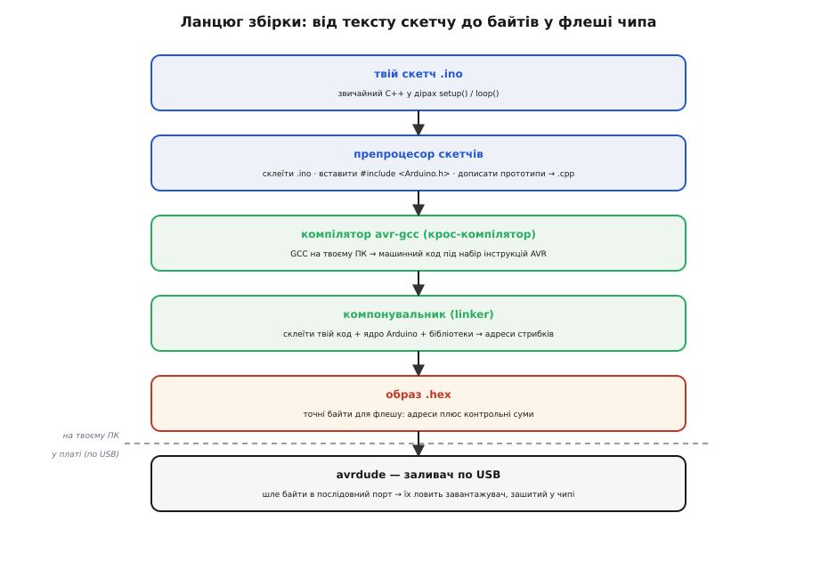

# ⚙️ Що насправді робить фреймворк Arduino

Візьми найвідомішу програму на світі для мікроконтролера — оту, що блимає світлодіодом. Два рядки в `loop()`, кнопка «Завантажити», кабель USB — і за кілька секунд на платі мигає вогник. Жодного програматора, жодного даташита, жодного рядка про регістри. Здається магією. Але магії тут немає: є акуратно вибудуваний ланцюг із чотирьох механізмів, кожен із яких можна розібрати до дна. Розберемо всі чотири — і від «магії» лишиться інженерія, яку ти зможеш обійти, коли вона стане на заваді.

Задача цієї вставки конкретна: показати, **що діється між твоїм текстом і кремнієм**. Як `setup()`/`loop()` перетворюються на справжню програму. Чому «мова Arduino» — це слова, за якими ховається звичайний C++. Яким шляхом твій скетч доїжджає до флешу чипа. Чому для цього досить кабелю, а не залізяки-програматора. І як той самий `digitalWrite(13, HIGH)` виконується на чипі, у якому немає жодного біта від Arduino. А наприкінці — де цей затишний шар протікає й що з цим робити.

## Ідея: обгортка, яка не замикає

Головна думка, з якої випливає все інше: фреймворк Arduino **нічого не приховує назавжди**. Він додає зручний шар над залізом — але під тим шаром лишається повний доступ до кремнію, і ти будь-коли можеш крізь нього продертися. Це не пісочниця з бетонними стінами, а ганок із дверима: заходь легко, а як переріс — виходь глибше, у той самий проєкт, у той самий файл.

Щоб це стало відчутним, а не гаслом, треба побачити механіку. Почнімо з найпершого питання, яке спантеличує кожного, хто прийшов із «великого» програмування: **де тут `main()`?**

## Механізм 1: setup()/loop() — це обгортка над main() і while(1)

У звичайній програмі на C чи C++ вхідна точка одна — `int main()`. Її викликає система, з неї починається все. А у скетчі Arduino її немає й близько: є дві голі функції, які ти ніде не викликаєш сам. Хто ж їх запускає?

Відповідь проста й гарна: `main()` існує — просто його написали за тебе й сховали в ядрі фреймворку. Ось він, справжній, майже незмінний із 2005 року файл `main.cpp` ядра AVR (я лишаю його точно таким, як він є):

```cpp
int main(void)
{
	init();          // налаштувати таймери, АЦП, лічильник millis() — усе «нутро»

	initVariant();   // гак для конкретної плати (порожній, якщо нема потреби)

#if defined(USBCON)
	USBDevice.attach();   // на чипах із власним USB (Leonardo) — підняти USB-стек
#endif

	setup();         // ← ТВОЯ підготовка: один раз

	for (;;) {       // вічний цикл — серце мікроконтролера
		loop();                        // ← ТВОЯ робота: знову і знову
		if (serialEventRun) serialEventRun();
	}

	return 0;        // сюди не дійдемо ніколи
}
```

Ось і вся «магія» моделі `setup()`/`loop()`. Твій `setup()` — це рядок усередині чужого `main()`, який викликається раз. Твій `loop()` — тіло вічного `for(;;)`. Замість того щоб самому писати `int main()`, ставити ініціалізацію заліза й закручувати `while(1)`, ти отримуєш це готовим і дописуєш лише дві діри, залишені спеціально під тебе.

Чому саме `for(;;)`, а не одноразовий прохід? Бо в цьому — сама природа мікроконтролера. Він не програма, що «відпрацювала й вийшла до операційної системи», — операційної системи під ним зазвичай і немає. Він **вічний виконавець**: доки подано живлення, процесор мусить щось робити щотакту, інакше він просто зупиниться. Тож нескінченний цикл — не примха фреймворку, а єдиний природний спосіб жити на голому залізі. Arduino лише позбавляє тебе клопоту писати його щоразу власноруч.

> 🔧 **Навіщо це.** Раз `setup()` і `loop()` — це рядки чужого `main()`, зникає ореол таємниці: ти можеш точно передбачити порядок подій. Спершу ядро підніме таймери (без них не працюватимуть ні `delay()`, ні `millis()`), тоді — рівно один раз — твій `setup()`, і лише потім почнеться вічне коло `loop()`. І якщо колись схочеш повний контроль — можна написати власний `int main()` замість `setup()`/`loop()`, і фреймворк це дозволить: діри під тебе не обов'язкові, вони просто зручні.

Ще одна дрібниця, яку варто зауважити відразу: `loop()` викликається **не з фіксованою частотою**. Тіло циклу відпрацювало — його одразу викликають знову, впритул. Якщо в тілі `delay(500)`, то між викликами пройде півсекунди; якщо тіло порожнє, `loop()` крутитиметься мільйони разів на секунду. «Цикл» тут означає «знову і знову без пауз», а не «раз на такт» чи «раз на мілісекунду». Це джерело частої плутанини новачка, який чекає рівних інтервалів дарма.

## Механізм 2: «мова Arduino» = C++ + бібліотеки + маленький препроцесор

Тепер розчепимо друге непорозуміння. Часто кажуть «мова Arduino», ніби це окрема мова зі своїми правилами. Її немає. Те, що ти пишеш, — **звичайний C++**, дослівно той самий, що й на настільному комп'ютері: ті самі `if`, `for`, класи, шаблони, покажчики, `struct`. «Мова Arduino» — маркетингова назва для C++ плюс купа готових функцій (`digitalWrite`, `analogRead`, `Serial.begin`, `delay`), які хтось уже написав і поклав у стандартну бібліотеку ядра. Ти не вивчаєш нову мову — ти користуєшся чужою бібліотекою поверх знайомої.

Але між файлом `.ino`, що ти редагуєш, і чистим C++, який побачить компілятор, є один тонкий крок — легкий препроцесор скетчів. Він робить рівно три речі, і знати їх корисно, бо саме вони пояснюють, чому `.ino` — «майже C++, але не зовсім»:

- **Склеює файли.** Усі `.ino`-файли теки зшиваються в один (перший — той, що зветься як тека, далі решта за абеткою), і до результату дописується розширення `.cpp`. Ось чому у скетчі можна викликати функцію з іншого `.ino`-файлу, не пишучи `#include`, — після склейки вони в одному файлі.
- **Вставляє `#include <Arduino.h>`** на самий верх, якщо його там немає. Саме цей заголовок і приносить усі ті `digitalWrite` та `HIGH`/`LOW`. Тому в скетчі вони «просто є» без жодного підключення — фреймворк підключив їх за тебе.
- **Сам дописує прототипи функцій.** У чистому C++ функцію треба оголосити раніше, ніж викликати. Препроцесор сканує твої функції й додає їхні прототипи (forward declarations) на початок, щоб ти міг вільно розставляти `setup()`, `loop()` і свої функції в будь-якому порядку, не думаючи про оголошення наперед. (Плюс він додає директиви `#line`, щоб номери рядків у помилках указували на твій оригінальний скетч, а не на склеєний файл.)

Після цих трьох дрібних послуг маємо звичайнісінький `.cpp`, який іде на звичайну [компіляцію](root:sf-lang/compilation). Ніякої магії мови — лише кмітливе прибирання формальностей C++, щоб новачок не спіткнувся об них у перші п'ять хвилин.

Ось той самий Blink, розкладений так, щоб було видно: це C++, і нічого крім C++.

```cpp
// Пін, до якого припаяно світлодіод. На UNO вбудований — 13.
const uint8_t LED = 13;

void setup() {
  pinMode(LED, OUTPUT);      // налаштувати пін на вихід
}

void loop() {
  digitalWrite(LED, HIGH);   // подати ~5 В → світлодіод горить
  delay(500);                // чекати 500 мс, нічого не роблячи
  digitalWrite(LED, LOW);    // подати 0 В → гасне
  delay(500);
}
```

Тепер найцікавіше — зазирнути **всередину** `digitalWrite`, бо там видно ціну зручності. Спрощено функція робить приблизно таке:

```cpp
void digitalWrite(uint8_t pin, uint8_t val) {
  uint8_t timer = digitalPinToTimer(pin);   // а раптом на цьому піні ШІМ?
  uint8_t bit   = digitalPinToBitMask(pin);  // яка це ніжка порту (маска біта)?
  uint8_t port  = digitalPinToPort(pin);     // якого саме порту (B, C, D)?
  volatile uint8_t *out = portOutputRegister(port);

  if (timer != NOT_ON_TIMER) turnOffPWM(timer);  // якщо ШІМ — вимкнути його

  uint8_t oldSREG = SREG;   // зберегти стан переривань
  cli();                    // заборонити переривання (щоб запис був цілісним)
  if (val == LOW)  *out &= ~bit;
  else             *out |=  bit;
  SREG = oldSREG;           // відновити переривання
}
```

Подивись, скільки роботи ховається за одним викликом: три пошуки у таблицях (пін → таймер, → маска, → порт), перевірка на ШІМ, можливе його вимкнення, захист від переривань. Усе це — заради зручності: ти пишеш номер піна `13`, а не пам'ятаєш, що це біт 5 порту B. За цю зручність платиш десятками тактів на кожен виклик. Виміряно: один `digitalWrite` — це близько **сорока машинних інструкцій**, тимчасом як прямий запис у регістр порту — **один-два такти**.

Коли сорок тактів проти двох починають муляти (треба гнати сигнал швидко — генерувати частоту, стукати по швидкому протоколу вручну), спускаєшся рівнем нижче, у той самий скетч:

```cpp
void setup() {
  DDRB |= (1 << DDB5);       // пін 13 = біт 5 порту B → на вихід
}

void loop() {
  PORTB |=  (1 << PORTB5);   // засвітити — 1–2 такти замість ~40
  PORTB &= ~(1 << PORTB5);   // згасити
}
```

Ці рядки — теж звичайний C++ у тому самому файлі. `PORTB`, `DDB5` — це імена, оголошені в заголовках AVR, які [ядро підключає](root:sf-lang/linking) разом з усім іншим. Різниця в швидкості колосальна: на UNO з тактом 16 МГц прямий доступ дозволяє смикати пін швидше за 8 МГц, а через `digitalWrite` ти впираєшся в частоту в десятки разів нижчу. Обидва способи — Arduino. Ось що означає «обгортка, яка не замикає»: зручний вхід і повний доступ живуть в одному й тому ж скетчі, і ти сам вирішуєш, на якій глибині зараз працювати.

> 🔧 **Навіщо це.** Не поспішай тікати в регістри «заради швидкості» — у 95 % проєктів `digitalWrite` цілком годиться, а читабельність дорожча за такти. Але знай, що двері є: коли профайлер чи осцилограф покаже, що вузьке місце саме тут, ти опустишся до `PORTB` в одному рядку й не мінятимеш ні плату, ні мову, ні проєкт. Уся сила C++ і все залізо — під рукою, тільки простягни її.

## Механізм 3: ланцюг збірки — від .ino до байтів у флеші

Отже, після препроцесора маємо чистий C++. Що з ним діється далі, доки він не стане вогником на платі? Ланцюг короткий і цілком традиційний для C++ — просто націлений на інший процесор, ніж той, що в твоєму комп'ютері.



*Шлях від тексту до кремнію. Твій `.ino` препроцесор перетворює на `.cpp`, avr-gcc компілює його під набір інструкцій AVR, компонувальник склеює з ядром і бібліотеками в один образ `.hex`, а avrdude заливає ці точні байти по USB у флеш чипа — де їх приймає зашитий там завантажувач.*

Розкладімо ланки:

**Компілятор — avr-gcc.** Це той самий славнозвісний GCC, лише зібраний як **крос-компілятор**: працює на твоєму x86-комп'ютері, а машинний код видає для архітектури **AVR** — набору інструкцій, які розуміє ATmega328P на UNO. «Крос» означає «компілюю на одному процесорі під інший»: у мікроконтролера замало сил, щоб компілювати самому, тож важку роботу робить твій ПК, а плід її призначений уже для чипа. Слово перед `-gcc` буквально каже, під яку архітектуру: `avr-gcc` — під AVR.

**Компонувальник (linker).** Твій код сам по собі неповний: він кличе `digitalWrite`, `Serial.print`, `delay` — а їхні тіла лежать окремо, у скомпільованому ядрі й бібліотеках. [Компонувальник](root:sf-lang/linking) зшиває всі шматки — твій код, ядро Arduino, потрібні бібліотеки — в один суцільний образ, розставляючи адреси так, щоб кожен виклик знав, куди стрибати. На виході — **файл `.hex`**: текстове подання точних байтів, які лягатимуть у флеш-пам'ять чипа, з адресами й контрольними сумами.

**Заливач — avrdude.** Останню ланку тягне окрема утиліта `avrdude` (AVR Downloader/UploaDEr). Вона відкриває послідовний порт, що з'явився, коли ти встромив USB-кабель, і за спеціальним протоколом віддає байти з `.hex` на плату — байт за байтом, зі звіркою. Саме avrdude бачить смужку прогресу й миготіння світлодіодів RX/TX під час заливання.

І тут виникає питання, від якого все й тримається: avrdude шле байти в **послідовний порт** — а хто на платі їх приймає й записує у флеш? Флеш сам себе не пише. Ось ми й дійшли до четвертого, найхитрішого механізму.

## Механізм 4: завантажувач — чому досить самого кабелю

Спитай будь-кого, чому Arduino програмують «просто кабелем», а «серйозні» мікроконтролери потребують окремої залізяки-програматора. Відповідь уміщається в одне слово — **завантажувач** (англ. *bootloader*) — і в неї варто вникнути, бо це і є ключ до масовості Arduino.

Спершу — суть проблеми. Голий, щойно з заводу мікроконтролер порожній: у флеші нічого, послухати послідовний порт нема кому. Щоб уперше залити в нього код, потрібен зовнішній **програматор** — прилад, що під'єднується до особливих ніжок чипа (інтерфейс SPI/ISP) і фізично вписує байти у флеш, обходячись без будь-якої програми всередині. Програматор коштує грошей, вимагає дротів і лякає новачка. Саме цей бар'єр Arduino й прибирає.

Хитрість ось у чому. У флеш ATmega328P **один раз, ще на фабриці плати**, за допомогою справжнього програматора вписують крихітну програмку — завантажувач. Вона займає окремий, спеціально відгороджений куточок флешу — на UNO це **512 байтів** (сучасний завантажувач *Optiboot*). Порівняй: увесь флеш чипа — 32 768 байтів, тож завантажувач з'їдає менше двох відсотків, лишаючи тобі під скетч ~31,5 КБ. (Старіший завантажувач ATmegaBOOT був у чотири рази більший — 2 КБ; перехід на Optiboot повернув користувачам півтора кілобайта.)

Що робить ця програмка? Вона влаштована так, що при **кожному скиданні** чипа процесор починає не з твого коду, а з неї — завантажувач бере керування першим. І перше, що він робить: коротку мить (десяту частку секунди) слухає послідовний порт — чи не стукає туди комп'ютер із новою прошивкою?

- **Стукає** (avrdude саме заливає) — завантажувач приймає байти й власноруч вписує їх у головну частину флешу, а тоді передає керування свіжозалитому скетчу.
- **Тиша** — завантажувач знизує плечима й одразу віддає керування тому скетчу, що вже лежить у флеші. Пристрій просто стартує й працює.

Ось звідки береться те коротке блимання при подачі живлення й та мить затримки перед стартом скетчу: це завантажувач слухає порт. І ось чому досить кабелю: **приймач прошивки вже сидить у чипі**. Роль зовнішнього програматора (слухати й писати флеш) узяв на себе крихітний резидент усередині. USB-кабель дає лише два: живлення й послідовну лінію, якою avrdude спілкується із завантажувачем.

А що ж USB? Адже ATmega328P на UNO сам по собі USB не вміє. На класичних платах на дорозі між роз'ємом USB і чипом стоїть окрема мікросхема-**міст USB↔UART**: комп'ютер бачить її як послідовний порт, а вона перекладає потік USB у прості сигнали [асинхронної послідовної лінії](root:com-devices/async-serial), зрозумілі й завантажувачу, і твоєму `Serial`. Ось чому в описах клонів мигтять назви CH340 чи FT232 — це і є той міст. (А от плати на ATmega32U4, як-от Leonardo, USB вміють самим чипом, тому й у `main.cpp` ти бачив рядок `USBDevice.attach()` під `#if defined(USBCON)` — там міст не потрібен, чип сам вдає послідовний порт.)

> 🔧 **Навіщо це.** Знання про завантажувач рятує в трьох реальних ситуаціях. Перше: ти «випадково стер завантажувач» (залив код напряму через програматор) — плата перестала приймати скетчі кабелем; лік — «прошити завантажувач» ще раз, і USB-заливання оживе. Друге: тобі шкода й тих 512 байтів або потрібен старт без затримки — можна залити скетч програматором через роз'єм ICSP взагалі без завантажувача, звільнивши куточок флешу (ціною того самого кабельного зручності). Третє: перші секунди після скидання порт зайнятий завантажувачем — тому власний обмін по `Serial` іноді має сенс починати з невеличкої паузи, щоб не влізти в його «вікно слухання».

## Механізм 5: ядра для чужих чипів — як той самий digitalWrite їде на іншу архітектуру

Тепер найдивовижніше — і саме заради нього ця родина зветься родиною, дарма що чипи в ній чужі. Той самий скетч зі `setup()`/`loop()`, той самий `digitalWrite(13, HIGH)` можна залити на **ESP32 чи ESP8266** — кристали від тайванської Espressif, у яких немає жодного біта архітектури AVR (усередині ядра Xtensa або RISC-V, зовсім інший набір інструкцій). Як текст, написаний під один процесор, оживає на геть іншому?

Секрет — у тому, що фреймворк Arduino це насправді **інтерфейс, а не реалізація**. `digitalWrite`, `pinMode`, `Serial` — це обіцянки: «дай номер піна й рівень — я його виставлю». А *як саме* виставити — залежить від чипа, і цю частину пише окреме **ядро** (англ. *core*): набір файлів, що виконують ті самі обіцянки на конкретному залізі. Для AVR є одне ядро (те, чий `digitalWrite` ми щойно розбирали), для ESP32 — інше, для ESP8266 — третє. Скетч бачить лише обіцянки — тому й переїжджає між чипами майже без змін.

Подивись, у що перетворюється той самий виклик на ESP32. Там під `digitalWrite` лежить не запис у `PORTB`, а звертання до системного шару чипа (ESP-IDF), спрощено:

```cpp
// AVR-ядро:    digitalWrite(pin, val)  →  *out |= bit;   (прямий запис у порт)
// ESP32-ядро:  digitalWrite(pin, val)  →  gpio_set_level((gpio_num_t)pin, val);
```

Обіцянка та сама — «виставити рівень на піні». Виконання різне: на AVR це один порт-регістр, на ESP32 — виклик функції `gpio_set_level` із фірмової бібліотеки Espressif, яка вже сама смикає потрібний регістр Xtensa-чипа. Твій скетч цієї різниці не бачить зовсім. Він каже «виставити пін» — а який саме шлях під цим, вирішує встановлене ядро.

Як це ядро потрапляє до тебе? Через **менеджер плат** (Boards Manager). Espressif (та інші виробники) публікують своє ядро як пакет за відомою адресою в інтернеті. Ти вставляєш це посилання в налаштування середовища, менеджер плат завантажує пакет — і в списку плат з'являються ESP32 та ESP8266. Разом із ядром приходить і **свій крос-компілятор** (не `avr-gcc`, а компілятор під Xtensa/RISC-V), і свій заливач замість avrdude. Тобто менеджер плат — це магазин, що доставляє цілий набір «перекладачів» під нову архітектуру: ядро (реалізацію обіцянок) + компілятор + заливач. Натиснув «встановити» — і той самий Blink компілюється вже під ESP32.

> 🔧 **Навіщо це.** Оце й є практична межа слів «плата Arduino» та «сумісна з Arduino». Espressiv-плата — чуже залізо, до якого спільнота написала ядро-перекладач; вона програмується як Arduino, але живе за своїми правилами: логіка 3.3 В (5 В на пін може вбити чип), інша карта пам'яті, вбудоване радіо, свій набір здатних-на-щось пінів. Тому переносячи скетч із UNO на ESP32, спокійно бери код (`setup`/`loop`/`digitalWrite` поїдуть), але **перевір напруги й номери пінів**: обіцянки однакові, а залізо під ними — різне.

## Складність і пастки: де затишок протікає

Ми пройшли всі чотири-п'ять механізмів — і скрізь бачили ту саму рису: фреймворк додає шар заради зручності, а шар має ціну. Настав час чесно зібрати місця, де ця ціна кусає. Пастки Arduino — не привід тікати від нього, а мапа, де ступати обережно.

**Пастка перша — оперативна пам'ять, а не флеш.** Новачок звик боятися за флеш: «чи влізе програма?». Але на класичних Arduino першою кінчається **оперативна пам'ять (SRAM)**, і її смішно мало: на UNO — **2 КБ**, дві тисячі байтів на все живе під час роботи. Коли її бракує, плата не видає чесної помилки — вона починає **тихо божеволіти**: зависає, перезавантажується, видає сміття в порт. Це найпідступніший клас багів, бо симптом ніяк не вказує на причину. Тому на 8-бітних Arduino думати про пам'ять — не примха, а необхідність.

Найчастіший пожирач цих двох кілобайтів — **рядки-літерали**. Ось невинний рядок:

```cpp
Serial.println("Температура перевищила поріг, вимикаю нагрівач");
```

За звичкою C++ цей текст лягає у флеш і **копіюється в оперативну пам'ять** при старті, бо процесор AVR читає дані саме звідти. Кілька десятків таких повідомлень — і скупі 2 КБ SRAM вичерпано ще до першого корисного байта. Рятунок — макрос `F()`:

```cpp
Serial.println(F("Температура перевищила поріг, вимикаю нагрівач"));  // лишити у флеші
```

`F()` каже: «тримай цей рядок у флеші й читай прямо звідти, не копіюй в SRAM». Один символ обгортки — і десятки байтів дорогої оперативної пам'яті лишаються вільними. Для великих масивів сталих даних (таблиці, шрифти, ноти мелодії) є ширший інструмент — `PROGMEM`: він теж лишає дані у флеші, а ти читаєш їх спеціальними функціями. Ціна — трохи більше мороки в коді; виграш — дорогоцінні байти SRAM. Це коріниться в самій будові AVR: у нього **окремі простори** для програми (флеш) і даних (SRAM) — так звана гарвардська архітектура, — і за замовчуванням сталі мандрують з першого в другий. `F()` і `PROGMEM` просто скасовують цю мандрівку.

> 🔧 **Навіщо це.** Правило-рефлекс для 8-бітних Arduino: **кожен рядок у `Serial.print`/`println` обгортай у `F()`**, це найдешевший спосіб не впертися в стіну SRAM. Якщо плата поводиться незрозуміло — зависає, циклічно перезавантажується, плює абракадаброю — перша підозра завжди на пам'ять, а не на «зламану плату». На 32-бітних (ARM, ESP) пам'яті значно більше й `F()` зазвичай зайвий — але звичка не шкодить.

**Пастка друга — накладні витрати шару.** Ми вже бачили: `digitalWrite` — це ~40 інструкцій там, де прямий запис коштує 1–2. Так само `analogRead`, `Serial.print`, `delay` роблять «зайву» роботу заради зручності й безпеки. У навчанні й прототипах це невидимо. Але щойно тобі потрібна точна швидкість — рівна частота, тонкий тайминг, швидкий програмний протокол — цей запас тактів стає перешкодою. Тоді або спускаєшся до регістрів (як показано вище), або пильно вибираєш, що робити у гарячому циклі. Різниця між [голим залізом і фреймворком](root:embedded/baremetal-vs-framework) саме тут перестає бути академічною.

**Пастка третя — `delay()` зупиняє все.** `delay(500)` — це не «поспати», а **зайняти процесор нічим на 500 мс**. Увесь цей час `loop()` стоїть: інші дії не виконуються, кнопки не читаються, ніщо не рухається. У Blink це байдуже, але в реальному пристрої, де треба стежити за кількома речами водночас, `delay()` швидко стає ворогом: поки ти «чекаєш» пів секунди в одному місці, пропускаєш подію в іншому. Дорослий підхід — не зупиняти час, а **дивитися на годинник**: замість `delay()` запам'ятовуй, коли востаннє щось робив (через `millis()`), і в кожному проході `loop()` перевіряй, чи вже пора. Тоді один `loop()` спокійно жонглює багатьма справами, бо ніде не застигає.

**Пастка четверта — вона з'являється саме на ESP32.** Пам'ятаєш AVR-шний `for(;;)`, що просто крутив `loop()`? На ESP32 цей самий `loop()` крутиться **не в голому циклі, а всередині завдання операційної системи** (FreeRTOS-задача `loopTask`). Наслідок несподіваний: у тому світі є **сторож** (task watchdog) із таймером ~5 секунд, і він чекає, що завдання час від часу «поступиться» — віддасть процесор системі. Якщо твій `loop()` зробить довгу роботу без пауз і не поступиться довше за 5 с — сторож вирішить, що завдання зависло, і **перезавантажить чип**. На AVR такий код просто повільно крутився б; на ESP32 він приводить до раптових перезапусків. Ліки прості — час від часу дати системі вдихнути: короткий `delay(1)` чи `yield()` у довгих циклах. Той самий скетч, та сама модель `loop()` — а поведінка різна, бо під обгорткою вже інша машинерія. Це найяскравіший доказ головної думки: обіцянки фреймворку однакові, реалізації — ні, і саме на стиках реалізацій ховаються найхитріші пастки.

> 🔧 **Навіщо це.** Переносячи налагоджений AVR-скетч на ESP32, окремо переглянь **довгі цикли без пауз**: те, що на UNO лише гальмувало, на ESP32 може перезавантажувати плату через сторожа. Вкинь `yield()` або `delay(1)` у важкі місця. І пам'ятай ширший урок: коли той самий код по-різному поводиться на різних чипах, причину шукай не у своєму скетчі, а в **ядрі під ним** — реалізації обіцянок різні, і поведінка тече саме з них.

## Що з цього винести

Фреймворк Arduino — це чотири акуратні механізми, зшиті в одне відчуття легкості. Модель `setup()`/`loop()` — це діри у чужому `main()`, де `for(;;)` дає тобі вічний цикл мікроконтролера задарма. «Мова Arduino» — звичайний C++ плюс бібліотеки, який маленький препроцесор лише злегка причісує; уся сила C++ і весь доступ до регістрів лишаються під рукою в тому ж скетчі. Ланцюг збірки — традиційний для C++ (крос-компілятор → компонувальник → образ), просто націлений на інший процесор і завершений заливачем avrdude. А завантажувач — крихітний резидент у флеші — робить зайвим програматор, бо приймач прошивки вже сидить у чипі: тому й досить кабелю. І та сама обгортка їде на чуже залізо через ядра-перекладачі: скетч бачить обіцянки, а ядро виконує їх на своїй архітектурі.

Наскрізна нитка всього — обгортка, яка не замикає. Скрізь фреймворк додає зручний шар, скрізь той шар має ціну (такти, байти SRAM, накладні витрати), і скрізь під ним лишаються відчинені двері вниз. Знати ці двері — і де фреймворк протікає (пам'ять, `delay()`, сторож на ESP32) — означає користуватися легкістю Arduino, коли вона доречна, і спокійно продиратися глибше, коли переріс. Саме через цю чесну поєднаність «легко почати» й «є куди рости» Arduino й лишається найкращим місцем, щоб уперше змусити кремній тебе слухатися.
