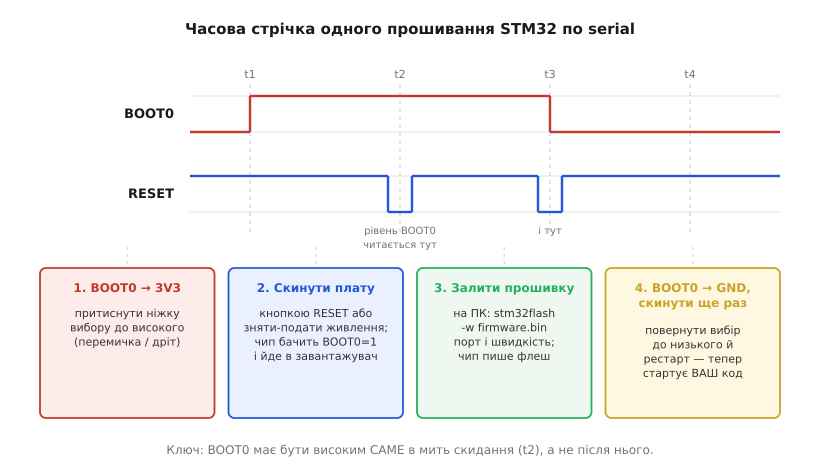

# ⚙️ Майстерня: три задачі через USB-UART у коді

Адаптер на CP2102 не має «свого API»: для комп'ютера він — звичайний COM-порт, для плати — рідні `TX`/`RX`. Тому весь код тут — не про якийсь особливий чип, а про дві прості дії з двох боків дроту. З боку комп'ютера: відкрий послідовний порт за іменем, задай швидкість, читай і пиши байти. З боку мікроконтролера: виштовхни символ у периферію UART. І третя дія — прошивка голого чипа тим самим дротом, коли в нього ще немає жодного власного коду.

Розберемо три задачі справжнім кодом, який запуститься як є, а не переказом документації. Перша — читати serial-консоль на комп'ютері (дивитися, що друкує пристрій). Друга — навчити мікроконтролер друкувати, щоб було що читати. Третя — залити прошивку в голу STM32 через `BOOT0`, а поряд — той самий фокус для ESP-01. Наприкінці кожної — не «і все запрацює», а чесний розбір, де воно ламається і чому.

## Задача 1. Читати serial-консоль на комп'ютері

**Задача.** Пристрій під'єднаний адаптером, у системі з'явився COM-порт (у Windows `COM7`, у Linux `/dev/ttyUSB0`, у macOS `/dev/cu.SLAB_USBtoUART`). Треба відкрити цей порт на потрібній швидкості й побачити потік тексту, який пристрій друкує, — а за бажання ще й відповідати йому.

**Ідея.** Операційна система вже завела під адаптер файл-порт; лишається його відкрити з тими самими налаштуваннями, з якими говорить пристрій, і крутити цикл читання. Ключових налаштувань п'ять, і всі п'ять мусять збігтися з іншим боком, інакше зв'язку не буде або в термінал полізе каша: **швидкість** (бод, напр. 115200), **біти даних** (майже завжди 8), **парність** (найчастіше немає — `N`), **стоп-біти** (один), **керування потоком** (для простого пристрою — вимкнене). Скорочено цей набір пишуть `115200 8N1`.

Це загальний код для комп'ютера, не регістри заліза, тож писати його природно мовами прикладного стеку. Той самий приклад однаково добре лягає трьома мовами — Python (канонічний спосіб через `pyserial`), Node/TypeScript і Rust; подаю їх вкладками. Кожна вкладка — не переклад рядок-у-рядок, а ідіоматичний варіант тією мовою.

:::tabs
```py
# pip install pyserial
import serial

PORT = "COM7"        # Windows; на Linux — "/dev/ttyUSB0", на macOS — "/dev/cu.SLAB_USBtoUART"
BAUD = 115200

# with-блок гарантує, що порт закриється навіть при винятку чи Ctrl+C
with serial.Serial(PORT, BAUD, bytesize=8, parity="N", stopbits=1, timeout=1) as ser:
    print(f"Відкрито {ser.name} на {BAUD} бод. Ctrl+C — вихід.")
    # надіслати пристрою команду (не забути перевід рядка, якщо він його чекає)
    ser.write(b"status\n")

    while True:
        line = ser.readline()          # читає до \n або поки не спрацює timeout
        if line:                        # порожньо = timeout без даних, просто чекаємо далі
            # decode із errors="replace": один битий байт не завалить увесь рядок
            print(line.decode("utf-8", errors="replace").rstrip())
```
```ts
// npm install serialport
import { SerialPort } from "serialport";
import { ReadlineParser } from "@serialport/parser-readline";

const PORT = "COM7"; // Linux: "/dev/ttyUSB0", macOS: "/dev/cu.SLAB_USBtoUART"
const BAUD = 115200;

const port = new SerialPort({
  path: PORT,
  baudRate: BAUD,
  dataBits: 8,
  parity: "none",
  stopBits: 1,
});

// парсер сам ріже потік на рядки по \n — не доводиться склеювати шматки вручну
const parser = port.pipe(new ReadlineParser({ delimiter: "\n" }));
parser.on("data", (line: string) => console.log(line.trimEnd()));

port.on("open", () => {
  console.log(`Відкрито ${PORT} на ${BAUD} бод.`);
  port.write("status\n"); // надіслати команду пристрою
});
port.on("error", (err) => console.error("Помилка порту:", err.message));
```
```rust
// Cargo.toml: serialport = "4"
use std::io::{BufRead, BufReader, Write};
use std::time::Duration;

fn main() -> Result<(), Box<dyn std::error::Error>> {
    let path = "COM7"; // Linux: "/dev/ttyUSB0", macOS: "/dev/cu.SLAB_USBtoUART"
    let baud = 115_200;

    let mut port = serialport::new(path, baud)
        .data_bits(serialport::DataBits::Eight)
        .parity(serialport::Parity::None)
        .stop_bits(serialport::StopBits::One)
        .timeout(Duration::from_millis(1000))
        .open()?;

    println!("Відкрито {path} на {baud} бод.");
    port.write_all(b"status\n")?;          // надіслати команду

    // окремий читач для рядкового буферування; клон даскриптора порту
    let reader = port.try_clone()?;
    let mut buf = BufReader::new(reader);
    let mut line = String::new();
    loop {
        line.clear();
        match buf.read_line(&mut line) {
            Ok(0) => break,                       // порт закрито
            Ok(_) => print!("{line}"),
            Err(ref e) if e.kind() == std::io::ErrorKind::TimedOut => continue,
            Err(e) => return Err(e.into()),
        }
    }
    Ok(())
}
```
:::

Три деталі, які роблять цей код робочим, а не іграшковим. Перша — **`timeout`**: без нього читання блокується назавжди, і програму не перервати, поки не прийде байт; з таймаутом цикл дихає — прокидається раз на секунду, навіть коли пристрій мовчить. Друга — **читання рядками, а не байтами**: `readline`/`ReadlineParser`/`read_line` збирають потік до символу переводу рядка, тож ви бачите цілі повідомлення, а не рвані шматки (UART віддає байти як прийде, і одне повідомлення легко приходить двома порціями). Третя — **декодування з заміною битих байтів**: перший-ліпший збій на лінії дасть байт, що не є валідним UTF-8; `errors="replace"` (та її аналоги) підмінить його знаком-замінником замість того, щоб завалити весь рядок винятком.

> 🔧 **Навіщо це.** Дев'яносто відсотків роботи з таким адаптером — саме цей цикл: відкрив порт, дивишся, що пристрій пише, зрідка шлеш йому команду. Для щоденного «просто подивитися» готовий термінал (у різних екосистемах свій) швидший за власний скрипт. Але щойно треба **щось із потоком зробити** — розпарсити телеметрію, записати лог у файл, побудувати графік, автоматично прогнати тест, — код вище стає каркасом: та сама трійця «порт → рядок → обробка», а замість `print` — ваша логіка.

**Складність і пастки.**

**«Порт зайнятий» (`access denied` / `resource busy`).** Найчастіша й найприкріша: у двох програмах порт відкрити не можна — він ексклюзивний. Відкритий монітор у середовищі розробки, друге вікно термінала, підвислий після падіння процес — усі тримають `COM7`, і ваш скрипт дістає відмову. Лік простий, коли знаєш причину: **закрий усе інше, що тримає порт**. На Linux додається друга гілка тієї ж біди — доступ: `/dev/ttyUSB0` належить групі `dialout`, і якщо вашого користувача в ній немає, отримаєте `Permission denied`; додайте себе (`sudo usermod -aG dialout $USER`) і перезайдіть, а не роздавайте права наосліп через `sudo`.

**Невірний номер COM.** Номер порту не прибитий цвяхами: перевтикнули адаптер в інше гніздо — і `COM7` став `COM11`; на Linux після іншого serial-пристрою `ttyUSB0` стає `ttyUSB1`. Скрипт, у якому ім'я порту зашите константою, після переткнення відкриває не той порт (або неіснуючий) і мовчить. Правильний рефлекс — **не вгадувати номер, а спитати систему**. `pyserial` уміє перелічити порти сам:

```py
from serial.tools import list_ports

for p in list_ports.comports():
    # p.device — ім'я порту; p.vid/p.pid — ідентифікатори чипа
    print(p.device, p.description, hex(p.vid or 0), hex(p.pid or 0))
    # класичний CP2102 має VID 0x10C4, PID 0xEA60 — за ними його впізнати надійніше за ім'я
    if p.vid == 0x10C4 and p.pid == 0xEA60:
        print("  ↑ це наш CP2102")
```

Ідентифікатори `VID 0x10C4` / `PID 0xEA60` — паспорт класичного CP2102 від Silicon Labs; шукати адаптер за ними надійніше, ніж за назвою порту, яка гуляє.

**Каша в терміналі.** Замість читабельного тексту сиплються випадкові символи — `▒`, `ÿ`, обірвані слова. Причина майже завжди одна: **незбіг швидкості або формату** між боками. Пристрій друкує на 9600, а ви відкрили порт на 115200 — біти нарізаються не там, де треба, і виходить сміття. Перша перевірка при будь-якій каші — **швидкість**: переберіть типові значення (9600, 19200, 38400, 57600, 115200), поки текст не стане читабельним. Якщо швидкість певно правильна, а каша лишилася — гляньте на решту формату (біти даних, парність, стоп-біти): рідкісний пристрій хоче не `8N1`, а, скажімо, `8E1` (вісім біт, парність even, один стоп). І окремий, менш очевидний випадок: якщо у вивід закрадаються поодинокі биті символи серед загалом читабельного тексту — це вже не незбіг формату, а завади на лінії (довгі дроти, немає спільної землі, наведення), і лікується це не в коді, а в дротах.

## Задача 2. Навчити мікроконтролер друкувати в UART

**Задача.** Щоб було що читати в консолі, пристрій має щось писати. Найпростіший спосіб зазирнути мікроконтролеру «в голову» — навчити його друкувати текст у свій UART: значення змінної, крок алгоритму, повідомлення про помилку. Треба, щоб звичний виклик `printf("темп = %d\n", t)` виходив байтами на ніжку `TX`, звідки їх підхопить адаптер.

**Ідея.** UART передавач мікроконтролера вміє одне: віддай йому байт — він викине його на лінію бітами. Уся хитрість `printf` зводиться до того, щоб форматований текст, який стандартна бібліотека вже вміє складати, скеровувати не «в нікуди», а в цей передавач. У мові C для цього є акуратний гачок: `printf` під капотом складає рядок і віддає його символ за символом у низькорівневу функцію виводу; достатньо цю функцію **перевизначити** так, щоб вона штовхала символ у UART, — і весь звичний `printf` починає друкувати в порт.

Це вже інший бік дроту — залізо, регістри периферії, конкретний мікроконтролер. Тут доречна саме C/C++: код прив'язаний до апаратури й пишеться мовою, якою ця апаратура програмується; переписувати регістри STM32 умовним Python-ом було б безглуздям. Тому — один блок мовою домену. Візьмімо STM32 з бібліотекою HAL (той самий сімейний чип, що й у прикладі прошивання нижче):

```c
#include <stdio.h>
#include "stm32f0xx_hal.h"

extern UART_HandleTypeDef huart1;   // USART1 налаштований у CubeMX: 115200 8N1

// Гачок стандартної бібліотеки: printf врешті кличе саме сюди для КОЖНОГО символу.
// Перевизначаємо його — і весь printf/putchar починає йти в UART.
// (Ім'я функції залежить від toolchain: у newlib це _write, у деяких — __io_putchar.)
int __io_putchar(int ch)
{
    // блокуюча передача одного байта; HAL_MAX_DELAY = чекати, поки передавач звільниться
    HAL_UART_Transmit(&huart1, (uint8_t *)&ch, 1, HAL_MAX_DELAY);
    return ch;
}

int main(void)
{
    HAL_Init();
    SystemClock_Config();   // згенеровано CubeMX
    MX_GPIO_Init();
    MX_USART1_UART_Init();  // тут USART1 і піднімається на 115200 8N1

    int t = 0;
    while (1) {
        // звичайнісінький printf — а рядок виходить на ніжку TX (PA9)
        printf("темп = %d C\r\n", t);
        t = (t + 1) % 100;
        HAL_Delay(1000);    // раз на секунду
    }
}
```

Механізм короткий, тож варто назвати його чесно. `HAL_UART_Transmit` — це «поклади байт і чекай, поки передасться»: проста, надійна, блокуюча передача. Для налагоджувального `printf`, що спрацьовує зрідка, блокування на кілька десятків мікросекунд неважливе. `\r\n` замість самого `\n` — щоб рядки рівно лягали в термінал, який очікує «повернення каретки + новий рядок» (класична консольна звичка). А поділ «`printf` складає — `__io_putchar` віддає в залізо» — це і є вся суть: ви пишете звичний код, а бібліотека сама розбирає рядок на символи й несе кожен у ваш перевизначений вихід.

> 🔧 **Навіщо це.** Serial-`printf` — головний інструмент налагодження вбудованих програм, поки під рукою немає повноцінного відлагоджувача (а часто й разом із ним). Він дає відповідь на два питання, які мучать найбільше: **чи дійшла програма сюди** (`printf("тут\r\n")` на початку функції) і **яке зараз значення** (`printf("adc=%d\r\n", v)`). Побачити живий потік цих рядків через USB-UART — це буквально очі розробника всередині чипа: видно, де програма зависла, яке число в змінній, чи взагалі виконався потрібний шматок.

**Складність і пастки.**

**Не той UART / не та ніжка.** У чипа кілька USART, і `printf` піде туди, куди вказує ваш `huart`. Якщо дріт від адаптера сидить на ніжках `USART1` (`PA9`/`PA10`), а код друкує в `huart2` — на екрані буде тиша. Звірте: до якого USART підключений адаптер фізично і який USART відкриває код — мусить бути один і той самий.

**`float` у `printf` мовчить.** Класичний головолам новачка: `printf("%d", n)` друкує, а `printf("%.2f", x)` — ні (виходить порожньо або сміття). Причина в тому, що підтримка `float` у `printf` на маленьких чипах за замовчуванням **вимкнена**, щоб не тягнути важкий код у крихітну флеш-пам'ять. Вмикається вона опцією лінкера (у GCC-toolchain — прапорець на кшталт `-u _printf_float`). Не хочете морочитися — обійдіть друком цілих: замість `%.2f` від `x` друкуйте цілу й дробову частини окремо як `int`.

**Каша через незбіг швидкості — з боку прошивки.** Та сама «каша в терміналі» з першої задачі, але причина тут інша: швидкість, зашита в **прошивці** (у `MX_USART1_UART_Init`), не збігається з тим, що відкрив термінал. Поставили в коді 115200, а термінал відкрили на 9600 — читатимете сміття. Обидва боки мають називати одне число; правило те саме, просто пам'ятайте, що один із «боків» — це рядок налаштування вашого ж мікроконтролера.

## Задача 3. Прошити голу STM32 по serial через `BOOT0`

**Задача.** У руках мікроконтролер без жодного власного USB і без програматора ST-LINK — гола STM32 на макетці. Треба залити в неї прошивку, маючи лише USB-UART адаптер і кілька дротів.

**Ідея.** Кожна STM32 несе **вбудований завантажувач** — маленьку програму, зашиту виробником у системну область пам'яті прямо на заводі (ST описує її в нотатці AN2606). Цей завантажувач уміє прийняти нову прошивку по USART і записати її у флеш; протокол обміну ST задокументувала окремо (AN3155). Активують завантажувач ніжкою `BOOT0`: якщо **в мить скидання** `BOOT0` тримається високим (3.3 В), процесор стартує не з вашої програми, а з цього заводського завантажувача — і починає слухати USART, чекаючи на прошивку. З боку комп'ютера з ним говорить утиліта `stm32flash`.

Одна технічна деталь, яку корисно знати, бо вона рятує від зайвих питань: заводський завантажувач слухає USART у форматі **8E1** — вісім біт даних, парність **even**, один стоп-біт (не звичне `8N1`!), а швидкість визначає сам, автоматично, за першим надісланим байтом `0x7F`. `stm32flash` виставляє цей формат і надсилає `0x7F` за вас, тож руками про парність думати не треба — але якщо колись писатимете власний заливач, `8E1` не забудьте.

Домен тут — командний рядок і залізо, тож «код» цієї задачі — послідовність shell-команд. Спершу мінімальна розводка (чотири-п'ять дротів), потім самі команди.

Розводка пін-у-пін:

```text
CP2102 (адаптер)            STM32 (гола плата)
   3V3  ───────────────────  3V3      живлення (голий чип бере одиниці мА)
   GND  ───────────────────  GND      спільна земля — обов'язково
   TXD  ───────────────────  PA10     RX завантажувача  (перехрестя!)
   RXD  ───────────────────  PA9      TX завантажувача  (перехрестя!)
                             BOOT0 ──  3V3   на час прошивання → режим завантажувача
```

Дані йдуть **перехрестям**: `TXD` адаптера на `RX` плати, `RXD` адаптера на `TX` плати (для багатьох STM32 завантажувач сидить саме на `PA9`=`TX`, `PA10`=`RX`). `BOOT0` на час заливки притягнутий до 3.3 В.

Часову послідовність — коли що робити — найкраще видно на стрічці: `BOOT0` мусить бути високим саме тоді, коли чип скидається, а не «взагалі колись».


*Дві доріжки — `BOOT0` і `RESET`. Рівень `BOOT0` читається чипом лише в мить скидання (провали `RESET` у `t2` і `t3`). Порядок: підняти `BOOT0` → скинути (чип іде в завантажувач) → залити прошивку по USART → опустити `BOOT0` → скинути ще раз, тепер стартує ваш код.*

Тепер самі команди. Спершу переконаймося, що зв'язок із завантажувачем є — `stm32flash` без дій просто читає й друкує ідентифікацію чипа:

```bash
# 1) Зібрати схему з BOOT0 на 3.3 В і скинути плату (кнопкою RESET або пере-подачею живлення).
#    Тепер чип у завантажувачі й слухає USART.

# 2) Перевірити зв'язок: прочитати ідентифікацію (нічого не пишемо).
#    Порт: Linux — /dev/ttyUSB0, Windows — COM7, macOS — /dev/cu.SLAB_USBtoUART
stm32flash /dev/ttyUSB0
# Успіх виглядає приблизно так:
#   Version      : 0x31
#   Device ID    : 0x0440 (STM32F03xx4/6)
#   ...
# Якщо замість цього "Failed to init device" — чип НЕ в завантажувачі (див. пастки).

# 3) Залити прошивку (сирий .bin), перевірити запис і одразу запустити з початку флеш:
#      -w  — записати файл у флеш          -v — звірити записане
#      -g 0x0 — після запису стрибнути на початок флеш (0x08000000) і виконати
stm32flash -w firmware.bin -v -g 0x0 /dev/ttyUSB0

# 4) Перевести BOOT0 назад на GND і скинути плату ще раз — тепер стартує ваша прошивка.
```

Кілька практичних штрихів до команд. Швидкість завантажувач визначає сам, тож задавати `-b` зазвичай не треба; якщо ж хочете швидше або зв'язок хисткий — додайте, скажімо, `-b 57600` (типове усталене значення `stm32flash`). Формат файлу — сирий `.bin` або Intel HEX — утиліта розпізнає сама. Хочете спершу стерти флеш повністю — це відбувається автоматично перед записом, але за потреби керується окремо. І найзручніше: якщо на платі й адаптері виведені лінії `RESET` і `BOOT0` на ніжки `DTR`/`RTS` адаптера, `stm32flash` уміє смикати їх сам — тоді не доведеться тиснути кнопки руками:

```bash
# Автоматичне керування BOOT0/RESET через DTR/RTS адаптера (якщо вони підключені до плати):
# рядок -i описує, якими лініями і в якому порядку ввести чип у завантажувач і вийти з нього.
stm32flash -w firmware.bin -v -g 0x0 \
  -i 'rts,-dtr,dtr:-dtr,rts' /dev/ttyUSB0
# Точну послідовність підбирають під схему конкретної плати; сенс -i — "перед роботою
# зроби ось таку комбінацію ліній (вхід у завантажувач), а після — ось таку (вихід)".
```

Дешеві модулі з Micro-USB часто виводять на гребінку лише `5V/3V3/TXD/RXD/GND` **без** `DTR`/`RTS`, тож базовий, завжди робочий шлях — ручний: підняв `BOOT0`, натиснув `RESET`. Автоскидання через `-i` — приємний бонус там, де потрібні лінії розведені.

**Той самий фокус для ESP-01.** Механізм скрізь один — «у момент скидання чип читає рівень ніжки-бюлетеня й вирішує, звідки брати програму», — але полярність і ніжка різні. У [ESP-01](root:cat-hw-boards/esp-01) роль `BOOT0` грає `GPIO0`, і садять його **на землю** (а не на високий): `GPIO0` низький у мить скидання → ESP8266 стартує в serial-завантажувач і чекає прошивку. Дротова частина така сама (спільна земля, дані перехрестям, живлення — але ESP-01 у піку Wi-Fi смикає до 300 мА, тож `3V3` адаптера зі стелею 100 мА його не потягне, потрібне окреме джерело). Заливає ESP уже інша утиліта — `esptool`:

```bash
# ESP-01: GPIO0 на GND + скидання → serial-завантажувач. Живлення 3.3 В — ОКРЕМЕ, потужне.
esptool --port /dev/ttyUSB0 --baud 115200 write-flash 0x0 firmware.bin
```

> 🔧 **Навіщо це.** Пара «USB-UART + `BOOT0`» — найдешевший спосіб прошити голу STM32 у світі: жодного програматора, лише копійчаний адаптер і три дроти даних. Та сама логіка вводить у режим заливки будь-яку плату без native-USB — треба лише знати її «ніжку-бюлетень» і полярність: у STM32 це `BOOT0` на високий, у ESP8266 — `GPIO0` на землю. Хто зрозумів сам принцип «рівень ніжки, прочитаний у мить скидання, обирає джерело коду», той прошиє незнайомий чип, лише глянувши в його довідник, який пін за це відповідає.

**Складність і пастки.**

**Плата не входить у завантажувач** (`Failed to init device`, `stm32flash` не бачить чип). Найтонша пастка всієї задачі, і майже завжди причина одна: **`BOOT0` не був високим саме в мить скидання**. Рівень цієї ніжки читається лише в момент старту процесора — притиснули `BOOT0` до 3.3 В **після** того, як плата вже завантажилася, і нічого не станеться: чип уже вибрав джерело коду й побіг вашу стару програму. Правильний порядок жорсткий: спершу `BOOT0` на високий, **потім** скидання (кнопкою `RESET` або зняттям-подачею живлення). Якщо кнопки `RESET` немає — просто вимкніть і ввімкніть живлення плати, тримаючи `BOOT0` високим. Друга, рідша причина того ж симптому — `BOOT0` «висить у повітрі»: ніжка нікуди не притягнута, і рівень на ній плаває від наведень. `BOOT0` треба **явно** з'єднати з 3.3 В (для режиму завантажувача) або з землею (для звичайного запуску), а не лишати неприєднаною.

**Перехрестя `TX`/`RX` переплутане.** Другий кандидат на «завантажувач не відповідає». З'єднали `TXD` адаптера з `TX` плати (а не з `RX`) — і обидва боки штовхають один в одного виходи, жоден нічого не чує; `stm32flash` упреться в мовчанку. Якщо зв'язку немає, а `BOOT0` та скидання ви зробили правильно — **поміняйте `TXD` і `RXD` місцями** на боці плати; переплутати їх легко, а перевірити — секунда.

**Немає спільної землі.** Дані можуть бути заведені ідеально, `BOOT0` високий вчасно — а зв'язку все одно нема, бо забули з'єднати `GND` адаптера з `GND` плати. Без спільної землі немає спільної точки відліку для «високого» й «низького» рівня, і жоден біт не прочитається правильно. Земля з'єднується завжди, у будь-якій serial-схемі — це перше, що варто перевірити, коли «все правильно, а не працює».

**Живлення й рівні — тихі вбивці.** Голий STM32 бере одиниці міліампер, тож стелі 100 мА виводу `3V3` вистачає з головою — тут проблем не буде. А от рівні варто тримати в голові: якщо ваш адаптер видає на лініях 5 В (є й такі модулі), його `TXD` б'є п'ятьма вольтами по входу `RX` 3.3-вольтового чипа — формально це перевищення того, що вхід має терпіти. Для 3.3-вольтового адаптера з 3.3-вольтовою STM32 усе збігається напряму; якщо адаптер 5-вольтовий, ставте [зсув рівнів](root:hw-digital/voltage-domain-interface) на лінії, що заходить у чип, або перемкніть адаптер на 3.3 В перемичкою вибору напруги, якщо вона є.

## Що з цього забрати

Весь код навколо CP2102 — це дві прості дії з двох боків дроту, плюс один трюк для першого запису. З боку комп'ютера: відкрий COM-порт за іменем, задай `115200 8N1`, читай рядками з таймаутом — і ти бачиш пристрій; хочеш більше, ніж «подивитися», — той самий цикл стає каркасом під парсинг, лог чи графік. З боку мікроконтролера: перевизнач гачок виводу стандартної бібліотеки на UART — і звичний `printf` починає друкувати в порт, даючи тобі очі всередині чипа. А перший запис у голий чип, у якого ще нема ані коду, ані USB, робиться завантажувачем, зашитим на заводі: підняв ніжку-бюлетень (`BOOT0` на високий у STM32, `GPIO0` на землю в ESP-01), скинув у цю мить, залив по serial утилітою — і повернув ніжку назад.

Пастки, на яких горять найчастіше, теж вкладаються в коротку пам'ятку. **Порт зайнятий** — закрий інший монітор/термінал (на Linux ще перевір групу `dialout`). **Невірний COM** — не вгадуй номер, спитай систему й шукай адаптер за `VID 0x10C4`/`PID 0xEA60`. **Каша в терміналі** — перебери швидкість (незбіг бод — причина номер один), потім формат. **Плата не входить у завантажувач** — `BOOT0` мусить бути високим **у мить скидання**, а не після нього. І три вічні перевірки будь-якого serial-зв'язку, коли «все правильно, а мовчить»: спільна земля, не переплутане перехрестя `TX`/`RX`, збіг налаштувань порту. Хто тримає цю трійцю в пальцях, той під'єднає й прошиє будь-що за хвилину.
