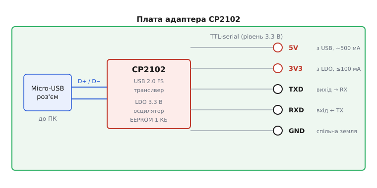
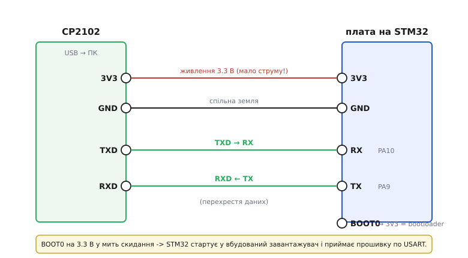

# USB-UART адаптер CP2102 (Micro-USB)

<preknowlist>
- [Асинхронний послідовний обмін (UART)](root:com-devices/async-serial) — TX/RX, як два пристрої говорять по двох дротах без окремого такту; це і є той «serial», у який адаптер перетворює USB.
- [Кадр UART](root:com-devices/uart-frame) — старт-біт, дані, парність, стоп-біт; чому обидва боки мусять збігтися в налаштуваннях, інакше на екрані сміття.
- [Швидкість передачі (бод)](root:com-devices/baud-rate) — що таке 115200 бод і чому неспівпадіння швидкості дає «кракозябри».
- [Логічні рівні як діапазони](root:hw-digital/logic-levels-as-ranges) — що вважається «0» і «1» за напругою; звідси вся драма 3.3 В проти 5 В на лініях.
- [Зсув рівнів](root:hw-digital/voltage-domain-interface) — як безпечно з'єднати 5-вольтову й 3.3-вольтову логіку; коли дільник чи мікросхема-перетворювач обов'язкові.
- [Лінійний стабілізатор (LDO)](root:hw-power/ldo) — як із 5 В USB роблять 3.3 В і чому в такого регулятора є стеля струму.
</preknowlist>

На долоні лежить продовгувата платка завбільшки з половину великого пальця. З одного її краю — металевий язичок роз'єму **Micro-USB**, з протилежного — гребінка на п'ять-шість штирків із дрібними підписами `5V`, `3V3`, `TXD`, `RXD`, `GND`. У центрі — крихітна чорна мікросхема, а більше на платі майже нічого й немає. Це **USB-UART адаптер на чипі CP2102** — містток між світом USB, яким говорить комп'ютер, і світом простого послідовного порту (TTL-serial), яким говорить майже кожен мікроконтролер. Устромили в USB — з боку комп'ютера з'явився звичайний COM-порт; під'єднали гребінку до плати — і ви розмовляєте з нею напряму.

Ця дрібничка розв'язує проблему, яку новачок спершу навіть не помічає, а потім раптом упирається в неї лобом. Багато плат **не мають власного USB**: гола мікросхема STM32 на макетці, крихітний [ESP-01](root:cat-hw-boards/esp-01) з вісьмома ніжками, старий давач із виведеним лише послідовним портом. Такий пристрій нікуди не встромиш у комп'ютер — у нього немає ні роз'єму, ні мікросхеми, що вміла б говорити протоколом USB. А поговорити треба: побачити, що він друкує в консоль, або залити в нього нову прошивку. Ось тут і виходить на сцену CP2102: він бере на себе всю складність USB, а плату частує простими двома дротами `TXD`/`RXD`, які та розуміє від народження. Розберімо цей адаптер так, щоб упізнати свій серед десятка схожих, зрозуміти, що в ньому всередині, правильно під'єднати й не спалити при цьому 3.3-вольтову плату п'ятьма вольтами.

### Навіщо взагалі потрібен місток

Щоб оцінити адаптер, треба спершу побачити прірву, яку він перекидає. З одного боку — **USB**: швидкий, пакетний, із хостом, що опитує пристрої, роздачею адрес, дескрипторами, контрольними сумами. Щоб пристрій умів у це, у нього має бути або окрема мікросхема-контролер USB, або процесор із вбудованим USB-блоком. З іншого боку — **UART**, він же TTL-serial: гранично простий [асинхронний послідовний обмін](root:com-devices/async-serial) по двох дротах. Один вивід `TX` передає, другий `RX` приймає, спільна земля — третій; ніякого такту, ніякого хоста, боки просто домовилися про [швидкість у бодах](root:com-devices/baud-rate) і сиплють один одному байти. UART уміє геть кожен мікроконтролер, бо це найдешевший спосіб винести назовні кілька слів.

Прірва в тому, що комп'ютер із коробки говорить USB, а не TTL-serial. У сучасному ноутбуку немає ані старого COM-порту, ані ніжок `TX`/`RX` — лише USB-гнізда. Тому, щоб з'єднати комп'ютер із голим UART мікроконтролера, хтось посередині мусить **перекладати USB на serial і назад**. Саме це й робить CP2102: усередині нього повноцінний USB-контролер, який для комп'ютера прикидається послідовним портом, а назовні виставляє звичайні `TXD`/`RXD` на логічному рівні. Комп'ютер бачить «ще один COM-порт» і шле в нього байти так, ніби це старий модем; адаптер ловить ці байти з USB і викидає їх на ніжку `TXD` — а плата приймає їх своїм `RX`, не підозрюючи, що на іншому кінці USB.

> 🔧 **Навіщо це.** Ключова причина існування таких адаптерів — плати **без native-USB**. Якщо у вашої плати є свій USB-роз'єм і на ній стоїть мікросхема-перехідник (як на Arduino UNO чи платах ESP32), окремий адаптер вам не потрібен — місток уже впаяний. Але щойно ви берете голу STM32, ESP-01 чи будь-що з виведеним лише послідовним портом — без зовнішнього USB-UART до нього просто не достукатися. Це не «зручний аксесуар», а обов'язкова ланка для цілого класу плат.

### Чип CP2102: хто його зробив і що він уміє

Уся плата побудована навколо однієї мікросхеми — **CP2102** компанії **Silicon Labs** (повна назва Silicon Laboratories). Це американська напівпровідникова фірма з Остіна, штат Техас; заснували її 1996 року троє інженерів — Нав Суч, Дейв Велланд і Джефф Скотт (за компанійською легендою, рішення створювати власну фірму вони ухвалили підкиданням монети). Serial-міст CP2102 з'явився в її каталозі в середині 2000-х і став одним із найпоширеніших «USB-на-serial» чипів у світі саморобної електроніки — поряд із FTDI FT232 і пізнішим дешевим китайським CH340.

Хитрість CP2102 у тому, що він **самодостатній**: в одному корпусі QFN-28 розміром 5×5 мм зібрано все, що треба для перекладу USB↔UART, і зовні майже нічого не потрібно допаювати. Усередині:

- **USB 2.0 full-speed контролер із трансивером** — та частина, що говорить із комп'ютером на 12 Мбіт/с і прикидається послідовним портом;
- **UART-блок** — власне `TX`/`RX` та повний набір керуючих ліній модему (`RTS`, `CTS`, `DTR`, `DSR`, `DCD`, `RI`), успадкованих від старих COM-портів;
- **вбудований осцилятор** — тактове джерело, тож зовнішній кварц не потрібен;
- **внутрішній стабілізатор на 3.3 В** — робить із п'яти вольтів USB акуратні 3.3 В для власного живлення й для виводу `3V3` на гребінку;
- **1 КБ EEPROM** — крихітна перезаписувана пам'ять, де лежать ідентифікатори пристрою (про них — далі) і серійний номер.

UART у CP2102 програмований: він тягне широкий діапазон швидкостей — **до 921 600 бод**, а типово ви ганяєте 115200 чи 9600. Формат кадру (біти даних, парність, стоп-біти) комп'ютер задає при відкритті COM-порту, і чип слухняно його відтворює.

Тут варто чесно розмежувати назви, бо їх легко сплутати. **CP2102** — конкретна класична мікросхема. У неї є молодші й новіші родичі: **CP2104** (компактніший, із додатковими GPIO), **CP2105** (два порти), а також окрема сучасна лінійка **CP2102N** — це вже інший, новіший кристал, а не просто «CP2102 з буквою». Дешеві модулі з Micro-USB, про які тут ідеться, майже завжди несуть саме класичний **CP2102**. Для практики різниця мала: усі вони — USB↔UART-містки з однаковою логікою підключення; відрізняються дрібницями цоколівки й максимальною швидкістю.

### Що на платі та її гребінка виводів

Плата адаптера навмисне бідна: роз'єм Micro-USB, мікросхема CP2102, кілька пасивних деталей навколо неї та гребінка виводів. Придивімося, як сигнали течуть крізь неї.

*Комп'ютер по USB тримає з чипом пару диференційних ліній `D+`/`D−`. CP2102 усередині перекладає цей потік на простий послідовний порт і виставляє його назовні: `TXD` — вихід (те, що чип передає плáті), `RXD` — вхід (те, що чип від плати слухає). Живлення роздає два виводи: `5V` — це майже напряму п'ять вольтів із USB, а `3V3` — вихід внутрішнього стабілізатора з жорсткою стелею струму.*

Тепер по виводах гребінки — саме плутанина в їхніх ролях народжує більшість бід.

**`GND` — земля.** Найголовніший і найчастіше забутий провід. Два пристрої, що спілкуються по serial, мусять мати **спільну землю** — інакше немає спільної точки відліку, від якої міряти «високий» і «низький» рівень, і зв'язку не буде взагалі. Землю з'єднують завжди, у будь-якій схемі.

**`TXD` і `RXD` — послідовний порт.** `TXD` (transmit data) — це **вихід** адаптера: сюди він виштовхує байти, що прийшли з USB. `RXD` (receive data) — **вхід**: те, що адаптер слухає й пересилає в комп'ютер. З платою вони з'єднуються **перехрестям**: `TXD` адаптера йде на `RX` плати, а `RXD` адаптера — на `TX` плати. Логіка проста: те, що один передає, другий має приймати. Пряме з'єднання «`TX` у `TX`» — найтиповіша помилка, за якої обидва боки мовчки штовхають один в одного виходи, і жоден нічого не чує.

**`5V` та `3V3` — два різні живлення.** І ось тут — головна пастка всієї платки, тож розберемо її окремо.

### Рівні напруги: 3.3 В проти 5 В — головна пастка

CP2102 живиться від п'яти вольтів USB, але **самі лінії `TXD`/`RXD` у більшості дешевих модулів працюють на рівні 3.3 В** (внутрішній стабілізатор чипа якраз і живить його логіку 3.3 вольтами). Це чудова новина для сучасних 3.3-вольтових плат — ESP, STM32, Raspberry Pi Pico: рівні збігаються, з'єднуй напряму. Але щойно поряд опиняється **5-вольтовий світ**, треба бути пильним, бо помилка тут коштує тихо вбитого входу.

Небезпека однобока, і її треба відчувати за напрямком сигналу. Вихід адаптера `TXD` віддає 3.3 В — і 5-вольтовий вхід (класичний Arduino UNO) впевнено читає ці 3.3 В як логічну одиницю, бо його поріг «високого» нижчий. У цьому напрямку перетворювати нічого. А от **вхід адаптера `RXD`** — інша річ: якщо на нього приходить `TX` 5-вольтової плати, то на 3.3-вольтовий вивід чипа лягають п'ять вольтів. Це перевищення того, на що [логічні входи розраховані терпіти](root:hw-digital/logic-levels-as-ranges); часто чип це переживає роками, але формально це повільна руйнація кристала. Дзеркальна й гостріша небезпека — коли **5-вольтовий адаптер** (є й такі модулі, з рівнем ліній 5 В) під'єднують до 3.3-вольтової плати: тоді вже адаптер б'є п'ятьма вольтами по входу `RX` ніжного STM32 чи ESP.

> 🔧 **Навіщо це.** Правило-рятівник просте: **дивись, чиї 5 вольтів заходять у 3.3-вольтовий вхід — і саме там став перетворювач**. Найдешевше — [зсув рівнів](root:hw-digital/voltage-domain-interface) дільником напруги з двох резисторів (наприклад, 1 кОм послідовно й 2 кОм на землю опускають 5 В до ≈3.3 В), а для двобічних ліній — окрема мікросхема-перетворювач рівнів. Найгірший вибір — «воно ж працює» напряму: працює, поки одного дня не відмовить вхід, і ви шукатимете зламану плату, а винне було з'єднання. Багато сучасних модулів CP2102 мають на платі **перемичку або майданчик вибору `VCCIO`**, що перемикає рівень ліній між 3.3 і 5 В, — тоді достатньо виставити його під плату-співрозмовника, і зовнішній перетворювач не потрібен.

Друга частина тієї самої пастки — **вивід `3V3` не для живлення ненажерливих плат**. Внутрішній стабілізатор CP2102 гарантує свої 3.3 В лише **до 100 мА** навантаження — це його стеля за паспортом. Такого струму досить, щоб живити сам чип і легку логіку. Але спробуйте запитати від цього виводу [ESP-01](root:cat-hw-boards/esp-01), який у пік передавання по Wi-Fi смикає до 300 мА, — напруга просяде, ESP скинеться, і плата вічно крутитиметься в перезавантаженнях. Тому радіомодулі й будь-що з великими сплесками струму живіть **окремим потужним джерелом 3.3 В**, а `3V3` адаптера лишіть для дрібниці. Живлення від виводу `5V` теж не безмежне — це струм, що йде крізь USB-порт комп'ютера, типово до кількох сотень міліампер; для середньої плати досить, для потужного навантаження — окреме джерело.

### Розводка пін-у-пін: прошити голу STM32 через UART-bootloader

Тепер найпоказовіший приклад, заради якого адаптер часто й купують: **залити прошивку в мікросхему, у якої немає USB**. Візьмімо голу STM32 (той самий сценарій, що й для плати [STM32F072B-DISCO](root:cat-hw-boards/stm32f072b-disco), чий вбудований програматор ST-LINK/V2 не дає віртуального COM-порту, тож для serial-консолі однаково потрібен окремий USB-UART).

Фокус у тому, що кожен мікроконтролер STM32 має **вбудований завантажувач (bootloader)** — маленьку програму, зашиту виробником у системну область пам'яті (system memory) прямо на заводі. Вона вміє одне: прийняти нову прошивку по послідовному порту (USART) і записати її у флеш. Активують її ніжкою **`BOOT0`**: якщо в момент скидання `BOOT0` притиснутий до високого рівня (3.3 В), процесор стартує **не** з вашої програми, а з цього заводського завантажувача й починає слухати `USART`, чекаючи на прошивку. Це стандартний, документований механізм ST (він описаний в її нотатці AN2606), і саме він дозволяє прошити голий чип, не маючи жодного програматора — лише USB-UART.

*Чотири-п'ять дротів. `3V3` і `GND` адаптера дають плáті живлення й спільну землю (пам'ятайте про стелю 100 мА — для голого чипа її досить). Дані йдуть **перехрестям**: `TXD` адаптера → `RX` плати (у STM32 це `PA10`), `RXD` адаптера ← `TX` плати (`PA9`). Ніжка `BOOT0`, притягнута до 3.3 В у мить скидання, і вводить чип у вбудований завантажувач, який приймає прошивку по цьому ж `USART`.*

Розберемо з'єднання й чому саме так:

- **`3V3` → живлення плати, `GND` → `GND`.** Голий мікроконтролер бере одиниці міліампер, тож стелі 100 мА виводу `3V3` вистачає з головою. Землю з'єднуємо обов'язково — це спільна точка відліку.
- **`TXD` адаптера → `RX` плати** і **`RXD` адаптера → `TX` плати** — послідовний порт **перехрестям**. На STM32 заводський завантажувач слухає конкретний `USART` (для багатьох чипів це ніжки `PA9`=`TX` і `PA10`=`RX`); саме до них і йдуть дроти. Переплутали перехрестя — завантажувач вас не почує.
- **`BOOT0` → 3.3 В** на час прошивання: притиснутий до високого при старті, він і перемикає чип у режим завантажувача. Після заливки `BOOT0` повертають до землі (робочий режим), інакше після скидання плата знову ввійде в завантажувач замість запуску вашого коду.

Порядок дій: зібрати схему з `BOOT0` на 3.3 В → скинути плату (кнопкою `RESET` або зняттям-подачею живлення) → запустити на комп'ютері утиліту-заливач по serial → після успіху повернути `BOOT0` до землі → скинути ще раз, щоб стартувала вже ваша прошивка. Та сама логіка «притисни ніжку вибору режиму й скинь» працює і з іншими платами без USB: у [ESP-01](root:cat-hw-boards/esp-01), наприклад, роль `BOOT0` грає `GPIO0`, який на час прошивання садять на **землю**. Механізм скрізь один: у момент скидання чип читає рівень «ніжки-бюлетеня» й вирішує, звідки брати програму.

> 🔧 **Навіщо це.** Ця пара — USB-UART плюс `BOOT0` — це найдешевший спосіб прошити голий STM32 у світі: жодного програматора ST-LINK, лише копійчаний адаптер і три дроти даних. Практичне правило проти найчастіших «не прошивається»: перевірте три речі, перш ніж винуватити плату — (1) чи спільна земля, (2) чи не переплутане перехрестя `TX`/`RX`, (3) чи справді `BOOT0` тримається високим **у момент скидання**, а не після нього (рівень читається саме на скиданні). Ці три перевірки знімають більшість проблем ще до діагностики.

### Друга робота: serial-консоль для `printf` і монітора

Прошивка — не єдине, для чого потрібен адаптер. Друга, щоденна його робота — бути **вікном у пристрій**, коли той працює. Мікроконтролер не має екрана, тож найпростіший спосіб зазирнути йому «в голову» — навчити його друкувати текст у свій `UART`: `printf("темп = %d\n", t)`, повідомлення про помилку, крок алгоритму. Ці рядки виходять на ніжку `TX` плати, адаптер ловить їх своїм `RXD`, перекидає в USB — і на комп'ютері у вікні термінала (serial monitor) ви бачите живий потік того, що пристрій про себе розповідає.

Схема тут ще простіша, ніж для прошивання: `GND` — спільна, `TX` плати → `RXD` адаптера (щоб бачити, що плата друкує), і за потреби `RXD` плати ← `TXD` адаптера (щоб слати плáті команди назад). Живлення часто взагалі окреме — плата живиться своїм джерелом, а від адаптера беруть лише землю й лінію `TX`. Головне — **збіг налаштувань порту** на обох боках: та сама [швидкість у бодах](root:com-devices/baud-rate) і той самий формат [кадру](root:com-devices/uart-frame) (типово `115200 8N1` — вісім біт даних, без парності, один стоп-біт). Не збіглася швидкість — і замість читабельного тексту в термінал сиплеться каша з випадкових символів; це перше, що треба перевірити, побачивши «кракозябри».

> 🔧 **Навіщо це.** Serial-консоль — головний інструмент налагодження вбудованих програм. Поки немає повноцінного відлагоджувача, `printf` у `UART` через USB-UART — це очі розробника: видно, чи дійшла програма до потрібного місця, яке значення в змінній, де вона зависла. Тому USB-UART тримають під рукою навіть для плат, у яких USB є: окремий адаптер дає **незалежний** канал спостереження, що не пропадає, коли основний USB плати зайнятий прошивкою чи перезавантаженням.

### COM-порт і драйвер: як комп'ютер бачить адаптер

Коли ви встромляєте адаптер у USB, комп'ютер має якось зрозуміти, що це «послідовний порт», і завести під нього віртуальний COM. Пізнає він пристрій за парою чисел, зашитих у той самий 1-КБ EEPROM чипа: **VID** (Vendor ID — ідентифікатор виробника) і **PID** (Product ID — ідентифікатор виробу). У класичного CP2102 це `VID 0x10C4` (Silicon Labs) і `PID 0xEA60`. За цією парою операційна система добирає **драйвер** — для CP210x це «VCP-драйвер» (Virtual COM Port) від Silicon Labs; сучасні Windows, Linux і macOS здебільшого підхоплюють його самі, зрідка (на старих системах) доводиться доставити вручну з сайту виробника.

Коли драйвер став, у системі з'являється новий COM-порт (у Windows — щось на кшталт `COM7`, у Linux — `/dev/ttyUSB0`). Саме його ім'я ви й указуєте терміналу чи заливачу прошивки. Тут криється дрібна практична незручність: номер порту може **змінюватися** при перевтиканні в інше гніздо чи після іншого пристрою. Тому, якщо адаптерів кілька або порт «переїжджає», орієнтуйтеся не на голий номер, а на опис пристрою в системі; а серійний номер у EEPROM (за бажання перепрограмований утилітою Silicon Labs) дозволяє намертво прив'язати конкретний адаптер до фіксованого імені порту.

### Як ним керувати в коді

З боку комп'ютера жодного «особливого API CP2102» для звичайної роботи не треба: адаптер прикидається стандартним COM-портом, і ви користуєтеся ним будь-якою бібліотекою послідовного порту — відкрити порт за іменем, задати швидкість, читати й писати байти. Так само з боку плати: вона просто працює зі своїм `UART`, не знаючи, що на іншому кінці USB. Уся конкретика — як відкрити порт і не наступити на класичні граблі — винесена в окрему [майстерню з роботи через USB-UART](root:cat-hw-boards/cp2102-usb-uart/api-serial-console.md): там і читання serial-консолі з комп'ютера, і мінімальний `printf`-вивід із мікроконтролера, і практична послідовність прошивання STM32 через `BOOT0`, і розбір пасток на кшталт «порт зайнятий», «каша в терміналі» та «плата не входить у завантажувач».

### Що варто запам'ятати

USB-UART адаптер на **CP2102** — це маленький місток, що перекладає USB, яким говорить комп'ютер, на простий послідовний порт (TTL-serial), яким говорить мікроконтролер. Усередині — самодостатня мікросхема Silicon Labs: USB-контролер, UART, свій осцилятор, стабілізатор 3.3 В і крихітна EEPROM з ідентифікаторами `VID 0x10C4`/`PID 0xEA60`. Комп'ютер бачить його як звичайний COM-порт; плата — як рідні `TX`/`RX`. Дві його головні роботи — **serial-консоль** (бачити, що пристрій друкує, і слати йому команди) і **прошивка через UART-завантажувач** плат без native-USB: гола STM32 через `BOOT0`, ESP-01 через `GPIO0`.

Три речі, на яких найчастіше горять. Перша — **перехрестя `TX`/`RX`**: `TXD` адаптера завжди йде на `RX` співрозмовника, а не «`TX` у `TX`»; і не забудьте спільну землю. Друга — **рівні напруги**: лінії дешевих модулів зазвичай 3.3-вольтові, тож із 3.3-вольтовою платою з'єднуй напряму, а от 5-вольтові сигнали в 3.3-вольтовий вхід пускай лише через перетворювач рівнів або перемичкою `VCCIO` під потрібну напругу. Третя — **вивід `3V3` слабкий**: його стеля 100 мА не потягне радіомодуль на кшталт ESP-01 зі сплесками до 300 мА, тож ненажерливе живіть окремим джерелом. Хто розуміє цю трійцю, той під'єднає будь-який такий адаптер за хвилину — і не спалить при цьому плату.
