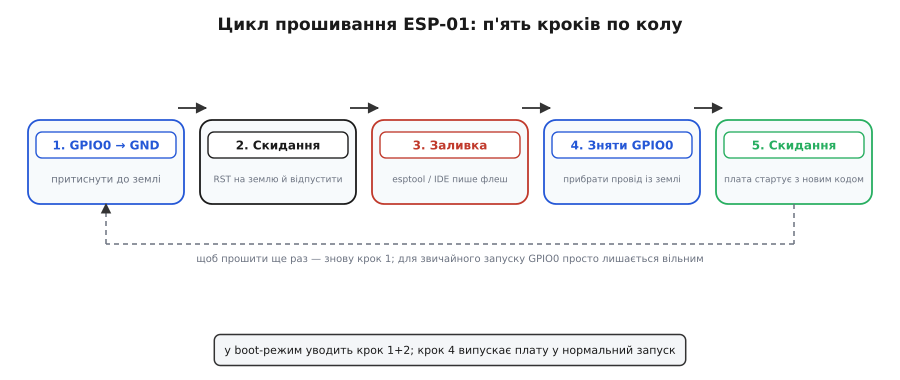

# 📋 Прошивання ESP-01: esptool, Arduino IDE й вхід у завантажувач

<preknowlist>
- [Асинхронний послідовний обмін (UART)](root:com-devices/async-serial) — TX/RX, перехрестя, як плата й комп'ютер говорять двома дротами; уся заливка йде через цей канал.
- [Швидкість передачі (бод)](root:com-devices/baud-rate) — що таке 115200 бод і чому неспівпадіння дає сміття замість відповідей.
- [Логічні рівні як діапазони](root:hw-digital/logic-levels-as-ranges) — що вважається «0» і «1» за напругою; чому 3.3-вольтовий вхід не любить 5 вольтів.
- [Плаваючий вхід і підтяжка](root:hw-digital/floating-pullups) — чому CH_PD не можна лишати «в повітрі», інакше чип спить і завантажувач мовчить.
</preknowlist>

Тримати в руках ESP-01 і не знати, як залити в нього код, — те саме, що мати ключ без замка. На платі немає USB, тож напряму комп'ютер її не бачить, а завантажувач ESP8266 приймає нову прошивку лише в особливому режимі — і саме тут початківець застряє найчастіше. Ця довідка збирає практику прошивання докупи: дві утиліти, якими образ пишуть у флеш, їхні точні команди, адреси й режими флеша — і карту типових «плата не прошивається» з розбором кожного випадку.

## Два способи залити й один спосіб запустити

Оскільки на ESP-01 **немає USB**, комп'ютер не бачить її напряму. Між ними ставлять **місток USB↔послідовний порт** (USB-UART) на 3.3-вольтовому рівні. Через цей місток комп'ютер і «розмовляє» з чипом. А завантажувач у ESP8266 приймає нову прошивку лише тоді, коли в момент скидання вивід **GPIO0 притиснуто до землі** — це і є той «бюлетень», яким чипові кажуть «не запускай стару програму, чекай нову». Схема під'єднання пін-у-пін (перехрестя TX/RX, спільна земля, CH_PD на плюс, GPIO0 на землю) описана в самій статті про плату; тут ми беремо її як готову й зосереджуємось на **командах**.

Записати образ у флеш можна двома шляхами, і вони не суперечать один одному — це просто різні інструменти над тим самим завантажувачем:

- **`esptool`** — офіційна консольна утиліта Espressif. Ви даєте їй готовий файл `.bin` і кажете, у який порт і за якою адресою його писати. Це «сира» заливка: точна, передбачувана, чудова для готових образів (та-таки заводська AT-прошивка, Tasmota, ESPHome) і для розуміння, що відбувається під капотом.
- **Arduino IDE з ESP8266-core** — середовище, яке саме **компілює** ваш скетч у `.bin` і саме викликає той-таки `esptool` під капотом. Це шлях «написав код → натиснув Завантажити». Зручно для власних прошивок, бо не треба вручну гнати файли.

Запуск же в обох випадках однаковий: **зняти GPIO0 із землі й скинути** — і чип цього разу піде по програму у флеш і виконає ваш код.


*Цикл прошивання. Кроки 1–2 (GPIO0 на землю, коротке скидання) вводять чип у завантажувач; крок 3 — власне запис флеша інструментом; кроки 4–5 (зняти GPIO0, ще одне скидання) випускають плату в нормальний запуск. Щоб прошити ще раз — знову з кроку 1; для звичайних наступних вмикань GPIO0 просто лишається вільним, і чип щоразу стартує з коду.*

> 🔧 **Навіщо це.** Розділення «залити» і «запустити» — головний ключ до спокою. Якщо світлодіод не блимає, спершу спитайте себе, на якому ви етапі: заливка навіть не почалася (плата не ввійшла в завантажувач — винен GPIO0 чи скидання), заливка йде з помилкою (порт, швидкість, живлення), чи заливка пройшла, але плата не стартувала (забули зняти GPIO0). Кожен етап ламається по-своєму, і плутати їхні симптоми — марнувати час.

## Шлях A: заливка через esptool

`esptool` — це програма на Python; ставлять її одним рядком через пакетний менеджер Python:

```
pip install esptool
```

Далі треба знати дві речі: **який порт** зайняв ваш USB-UART і **який файл** заливати.

**Порт.** Місток USB-UART з'являється в системі як віртуальний послідовний порт. У Windows це `COM3`, `COM4` тощо (номер видно в Диспетчері пристроїв, розділ «Порти (COM і LPT)»). У Linux — `/dev/ttyUSB0`, `/dev/ttyUSB1`. У macOS — щось на кшталт `/dev/tty.usbserial-0001`. Найпростіше визначити: подивитися список портів до того, як увімкнули місток, і після — новий рядок і є ваш. `esptool` уміє й сам перебрати всі порти, якщо не вказати `--port`, але явно вказати надійніше.

**Перевірка зв'язку.** Перш ніж щось писати, переконаймося, що комп'ютер узагалі «бачить» чип. Зберіть схему з GPIO0 на землі, скиньте плату (RST коротко на землю й відпустіть) і виконайте:

```
esptool --port COM3 chip_id
```

Якщо все гаразд, `esptool` відрапортує тип чипа (`ESP8266`), MAC-адресу й розмір флеша. Це найцінніша перевірка на світі: вона окремо доводить, що **живлення, земля, TX/RX-перехрестя й режим завантажувача** — усі справні, ще до того, як ви ризикнули записом. Побачили `Chip is ESP8266EX` — половину шляху пройдено.

**Читання того, що вже є (за бажанням).** Перед першим записом розумно зберегти заводський образ, щоб мати куди відкотитися:

```
esptool --port COM3 -b 115200 read_flash 0x00000 0x80000 backup-original.bin
```

Тут `0x00000` — початкова адреса, `0x80000` — довжина (512 кБ = 0x80000 байт для класичного ESP-01; для 1-мегабайтної плати беріть `0x100000`).

**Запис прошивки.** Власне заливка готового образу виглядає так:

```
esptool --port COM3 -b 115200 write_flash 0x00000 firmware.bin
```

Розберемо кожен шматок, бо саме тут ховаються граблі:

- **`--port COM3`** — куди писати. Помилилися портом — `esptool` або мовчить у таймаут, або пише в чужий пристрій.
- **`-b 115200`** — швидкість обміну. Це не швидкість роботи чипа, а темп заливки. Початковий контакт із завантажувачем ESP8266 завжди йде на **115200** — на вищі швидкості (`-b 460800`) `esptool` перемикається лише для самих даних, і то не на кожному містку. Якщо заливка рветься посередині — **знизьте** швидкість, а не підвищуйте: кволий місток чи довгі дроти на 460800 просто губить байти.
- **`write_flash`** — команда «пиши у флеш».
- **`0x00000`** — адреса, з якої лягає образ. Для прошивок, зібраних під ESP8266 як єдиний `.bin` (усе, що робить Arduino-core, а також Tasmota/ESPHome), це **нуль**: весь образ — один суцільний файл від початку флеша. (Багатофайлові збірки ESP-IDF/RTOS-SDK кладуть окремі шматки за різними адресами — але то інший клас образів.)
- **`firmware.bin`** — сам файл.

**Режим флеша.** Тут криється підступна деталь, різна для різних плат. Флеш можна читати в кількох режимах: `qio`, `qout`, `dio`, `dout` — вони відрізняються тим, скільки ліній чип використовує для читання. Класичний ESP-01 (512 кБ) зазвичай працює в **`qio`**, тоді як більші модулі (ESP-12, ESP32) — у **`dio`**. За замовчуванням `esptool` лишає режим, зашитий у самому образі (`keep`). Симптом неправильного режиму дуже характерний: **заливка проходить успішно, а плата на старті мовчить** — бо чип не може прочитати назад те, що записав. Якщо після успішної заливки плата «мертва», спробуйте примусово задати режим, додавши прапорець **після** `write_flash`:

```
esptool --port COM3 -b 115200 write_flash --flash-mode dio 0x00000 firmware.bin
```

`dio` — найбезпечніший вибір «якщо не запускається»: він повільніший, зате працює майже скрізь. Порядок важливий: `--flash-mode` мусить стояти **після** слова `write_flash`, інакше `esptool` його не прийме.

**Стерти начисто (коли зовсім клинить).** Якщо плата поводиться дивно після невдалих спроб, іноді рятує повне стирання флеша перед записом:

```
esptool --port COM3 erase_flash
```

Після цього чип чистий, як з магазину, — і наступний `write_flash` лягає без спадку старих байтів.

## Шлях B: заливка з Arduino IDE

Для **власної** прошивки (як-от [демо-скетчу з блиманням і веб-сервером](root:cat-hw-boards/esp-01/proj-blink-web.md)) зручніше не гнати файли руками, а дати Arduino IDE зробити все: скомпілювати код у `.bin` і залити тим-таки `esptool` під капотом. Потрібна лише разова настройка — навчити IDE розуміти ESP8266.

**Крок 1 — додати індекс плат.** У `Файл → Параметри → Додаткові посилання для менеджера плат` вставте рядок:

```
https://arduino.esp8266.com/stable/package_esp8266com_index.json
```

Це офіційний індекс ESP8266-core від спільноти. IDE тепер знає, звідки брати компілятор і бібліотеки під цей чип.

**Крок 2 — установити core.** У `Інструменти → Плата → Менеджер плат` знайдіть **esp8266** (автор — «ESP8266 Community») і встановіть. Тягнеться кількасот мегабайт компілятора — це нормально.

**Крок 3 — вибрати плату й параметри.** У `Інструменти → Плата` виберіть **Generic ESP8266 Module** (окремого пункту «ESP-01» немає — узагальнений модуль і є він). Далі виставте параметри, критичні саме для класичного ESP-01:

- **Flash Size: `512KB`** (для 1-мегабайтної плати — `1MB`). Помилка тут — найкоротший шлях до образу, що не влазить або не запускається.
- **Flash Mode: `DIO`** — безпечний вибір; `QIO` теж зазвичай працює, але DIO надійніший «щоб точно стартувало».
- **CPU Frequency: `80 MHz`**, **Flash Frequency: `40 MHz`** — типові значення.
- **Upload Speed: `115200`** — почніть саме з цього; вищі значення дають збої на слабких містках.
- **Port** — той самий COM/ttyUSB, що й для esptool.

**Крок 4 — залити.** Уведіть плату в завантажувач (GPIO0 на землю → скидання), відкрийте скетч і натисніть **Завантажити (Upload)**. IDE скомпілює код, викличе esptool і заллє образ. Побачили внизу відсотки й `Hard resetting…` — успіх. Тепер зніміть GPIO0 із землі, скиньте плату — і код запуститься.

> 🔧 **Навіщо це.** Дві дороги ведуть до того самого флеша через той самий esptool — різниця лише в тому, хто готує `.bin`. Готовий образ (AT, Tasmota) заливайте esptool напряму: менше зайвих ланок, легше діагностувати. Власний код пишіть в Arduino IDE: вона сама компілює й заливає, тож ви правите лише скетч. Плутати не треба, але й «або-або» тут немає — це один механізм із двома зручними ручками.

## Пастки прошивання

Найцінніше в прошиванні — карта збоїв, розкладена за тим, **на якому кроці** ви застрягли: заливка не починається, починається й рветься, або проходить — та плата все одно мовчить. Кожен крок ламається по-своєму.

**Плата взагалі не входить у завантажувач (заливка не починається).** Симптом: `esptool` пише `Failed to connect… Timed out waiting for packet header`, або Arduino IDE висне на `Connecting…`. Причини, від найчастішої:

- **GPIO0 не притиснуто до землі в момент скидання.** Це умова №1 входу в завантажувач. Спершу з'єднайте GPIO0 із землею, і **тільки потім** скидайте (RST коротко на землю й відпустіть). Порядок важливий: чип читає GPIO0 саме в мить скидання. Відпустити GPIO0 до скидання — і плата стартує в звичайному режимі.
- **Забутий CH_PD.** Якщо CH_PD не підтягнуто до 3.3 В, **весь чип спить**, і жоден завантажувач не відгукнеться. Плата виглядає «мертвою». Перевірте цей провід першим — його забувають найчастіше.
- **Не скинули після притискання GPIO0.** Притиснути GPIO0 замало — треба, щоб чип **перечитав** рівні, а це буває лише на скиданні. Немає скидання — немає входу в завантажувач.

**Переплутані TX і RX (зв'язку немає зовсім).** Симптом той самий — таймаут з'єднання. Послідовний порт з'єднується **перехрестям**: TX містка → RX плати, RX містка → TX плати. З'єднання «TX у TX» — класична помилка, за якої обидва боки говорять в одне вухо й слухають порожнечу. Якщо перевірили GPIO0 і CH_PD, а зв'язку все нема — **поміняйте TX і RX місцями**: у половині випадків це і є ліки. (Плутанина в тому, що на різних платах підпис буває «з погляду плати» або «з погляду містка».)

**Обірвана посеред відсотків заливка.** Симптом: контакт із чипом установився, заливка пішла — і зірвалася на півдорозі. Два винуватці. Перший — **надто висока швидкість**: `-b 460800` на слабкому містку чи довгих дротах губить байти, тож знижуйте до `115200`, а не навпаки. Другий — **живлення**: різкий струм чипа просаджує кволе джерело, і зв'язок губиться серед передавання. Повний розбір живлення (окремий стабілізатор + конденсатор упритул до VCC/GND) — у розділі про живлення самої плати; тут досить знати, що обірвана заливка частіше винить дроти й струм, ніж утиліту.

**Заливка пройшла, а плата мовчить (образ записано, та код не стартує).** Симптом: `esptool` відрапортував успіх, відсотки дійшли до 100 % — а після скидання нічого. Причини:

- **Забули зняти GPIO0 із землі.** Якщо GPIO0 лишився на землі, після скидання плата **знову ввійде в завантажувач** замість запуску коду. Зніміть провід GPIO0 і скиньте ще раз — код піде.
- **Невірний режим флеша.** Як описано вище: заливка в чужому режимі (`qio` там, де треба `dio`, чи навпаки) проходить, але чип не може прочитати образ назад. Спробуйте `write_flash --flash-mode dio`.
- **Невірний розмір флеша в Arduino IDE.** Виставили `1MB` там, де реально 512 кБ, — образ вважає, що місця більше, і на старті все летить. Перевірте `Flash Size`.

> 🔧 **Навіщо це.** Майже все «ESP-01 не прошивається» знімають чотири механічні перевірки, які варто робити перш ніж винуватити плату чи прошивач: (1) CH_PD на плюсі? (2) GPIO0 на землі **й** скидання зроблено — для заливки; **знято** — для запуску? (3) TX/RX перехрестям? (4) якщо заливка обірвалася — швидкість не завищена, живлення міцне? Пройдіть цей список зверху вниз — і більшість того, що здавалося поломкою, виявиться однією забутою дротинкою.
