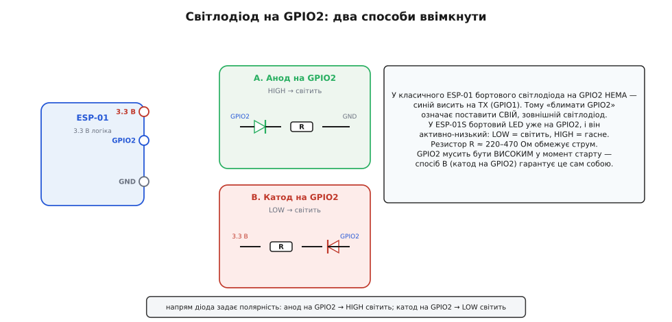

# ⚙️ Майстерня: перший скетч на ESP-01 — блимання, Wi-Fi і веб-сторінка

<preknowlist>
- [Асинхронний послідовний обмін (UART)](root:com-devices/async-serial) — TX/RX і монітор порту, у який плата друкує свій стан та IP-адресу.
- [Швидкість передачі (бод)](root:com-devices/baud-rate) — що таке 115200 бод і чому монітор треба налаштувати на ту саму швидкість.
- [Плаваючий вхід і підтяжка](root:hw-digital/floating-pullups) — чому GPIO2 при старті мусить бути високим і як світлодіод способу B тримає його підтягнутим.
- [Wi-Fi](root:com-transport/wifi) — радіо на 2.4 ГГц, до точки доступу якого скетч приєднується як клієнт.
</preknowlist>

Прошивка, залита в ESP-01, — ще не результат; результат — коли плата щось робить. Ця майстерня доводить крихітну платку до першого «живого» стану власним кодом: світлодіод рівномірно моргає, плата сама заходить у домашній Wi-Fi, а на запит із браузера віддає коротку веб-сторінку зі станом. Усе — справжнім кодом під ESP8266, без псевдокоду, і одразу в трьох середовищах: Arduino-core, ESP8266 RTOS SDK (ESP-IDF-стиль) і MicroPython. Як залити цей скетч у флеш (команди, режими, вхід у завантажувач) — в окремій [довідці з прошивання](root:cat-hw-boards/esp-01/api-flashing.md); тут ми беремо залиту плату як даність і зосереджуємось на самому коді та на пастках його виконання.

## Задача, яку розв'язуємо

Зведемо ціль до трьох простих спостережних фактів, щоб було ясно, коли ми перемогли:

1. Після ввімкнення на платі рівномірно блимає світлодіод на **GPIO2** — це видимий пульс, який каже «код працює, чип не в перезавантаженні».
2. Плата сама приєднується до заданої Wi-Fi-мережі й отримує IP-адресу — її видно в послідовному моніторі.
3. Якщо в браузері відкрити цю IP-адресу, ESP-01 віддає коротку сторінку зі станом (скільки секунд працює, чи ввімкнено світлодіод) — доказ, що всередині крутиться справжній веб-сервер.

Щоб цього досягти, плату спершу прошивають — цю процедуру винесено в окрему довідку, — а тоді вона сама, після скидання, виконує залитий код. Саме поведінку коду: блимання, приєднання до мережі, відповідь браузеру — ми й розбираємо далі.

## Робочий скетч: блимання, Wi-Fi і крихітний веб-сервер

Тепер сам код. Одразу важлива правда про світлодіод на цій платі, бо вона економить години здивування.

**У класичного ESP-01 бортового світлодіода на GPIO2 немає.** Синій світлодіод, що моргає на цій платі, зазвичай висить на лінії **TX (GPIO1)** — він мигає від самого послідовного трафіку, а не від вашого коду. (Це відрізняє ESP-01 від наступника [ESP-01S](root:cat-hw-boards/esp-01s), де один синій світлодіод справді посаджено на GPIO2 і він активно-низький: `LOW` — світить, `HIGH` — гасне.) Тому «блимати GPIO2» на класичному ESP-01 означає **поставити свій, зовнішній світлодіод** на цей вивід. Схема проста, і в неї є два варіанти полярності.


*Зовнішній світлодіод на GPIO2. Спосіб A: GPIO2 → анод світлодіода → резистор ≈ 220–470 Ом → земля; тоді `HIGH` світить. Спосіб B: 3.3 В → резистор → катод... анод на GPIO2 (вістря діода до виводу); тоді `LOW` світить. Спосіб B ще й тримає GPIO2 підтягнутим до плюса через світлодіод, тож на старті вивід «високий» — а саме цього вимагає завантаження. Резистор обов'язковий: без нього світлодіод спалить і себе, і, можливо, вивід.*

Чому взагалі є два варіанти й чому спосіб B часто кращий? GPIO2 при завантаженні **мусить бути високим** — інакше чип не стартує. У способі A (анод на GPIO2) вивід у спокої нічим не тримається, і треба покластися на внутрішню підтяжку чипа. У способі B світлодіод із резистором самі тягнуть GPIO2 до 3.3 В, тож умова завантаження виконується «безкоштовно». Плата за це — інверсна логіка: щоб засвітити, треба подати `LOW`. Це та сама активно-низька логіка, що й у бортового світлодіода ESP-01S, тож звикнути варто одразу.

Візьмемо спосіб B (катод на GPIO2, активно-низький) — він дружніший до завантаження й одразу привчає до логіки ESP-01S. Задача для будь-якого середовища однакова: налаштувати GPIO2 на вихід, підняти радіо в режимі клієнта, дочекатися адреси, підняти HTTP-сервер на 80-му порту й перемикати вивід за годинником — не глушачи обробку запитів. Нижче та сама програма трьома шляхами: Arduino-core (найкоротший вхід), ESP8266 RTOS SDK в ESP-IDF-стилі та MicroPython.

:::tabs
```arduino
#include <ESP8266WiFi.h>
#include <ESP8266WebServer.h>

// --- Налаштування мережі: підставте свої ---
const char* SSID     = "MyHomeWiFi";
const char* PASSWORD  = "supersecret";

// GPIO2: катод світлодіода тут (спосіб B), тож логіка ІНВЕРСНА:
//   LOW  -> світлодіод світить
//   HIGH -> світлодіод гасне
const uint8_t LED = 2;

ESP8266WebServer server(80);   // веб-сервер на 80-му порту

bool ledOn = false;            // поточний стан світлодіода
unsigned long lastToggle = 0;  // коли востаннє перемкнули
const unsigned long BLINK_MS = 1000;  // період блимання, мс

// Обробник кореневої сторінки: віддаємо стан коротким HTML
void handleRoot() {
  unsigned long upSec = millis() / 1000;
  String html = "<!DOCTYPE html><html><head><meta charset='utf-8'>";
  html += "<title>ESP-01</title></head><body>";
  html += "<h2>ESP-01 живий</h2>";
  html += "<p>Працює: " + String(upSec) + " с</p>";
  html += "<p>Світлодіод: " + String(ledOn ? "увімкнено" : "вимкнено") + "</p>";
  html += "</body></html>";
  server.send(200, "text/html; charset=utf-8", html);
}

void setup() {
  // ВАЖЛИВО: 115200 — та сама швидкість, що й у заводському завантажувачі,
  // тож монітор не сипле сміттям одразу після старту.
  Serial.begin(115200);
  delay(10);

  pinMode(LED, OUTPUT);
  digitalWrite(LED, HIGH);      // старт: світлодіод вимкнено (HIGH = гасне)

  Serial.println();
  Serial.print("Приєднуюся до ");
  Serial.println(SSID);

  WiFi.mode(WIFI_STA);          // режим клієнта (station), не точки доступу
  WiFi.begin(SSID, PASSWORD);   // запускаємо приєднання

  // Чекаємо з'єднання, підморгуючи, щоб було видно «я живий, але ще не в мережі»
  while (WiFi.status() != WL_CONNECTED) {
    digitalWrite(LED, LOW);     // блимнули (LOW = світить)
    delay(100);
    digitalWrite(LED, HIGH);
    delay(400);
    Serial.print(".");
  }

  Serial.println();
  Serial.print("Приєднано. IP: ");
  Serial.println(WiFi.localIP());   // ось цю адресу відкриваємо в браузері

  server.on("/", handleRoot);   // маршрут: корінь -> handleRoot
  server.begin();
  Serial.println("Веб-сервер запущено");
}

void loop() {
  server.handleClient();        // обслуговуємо запити браузера

  // Неблокуюче блимання: без delay(), щоб веб-сервер не «глух» на секунду
  unsigned long now = millis();
  if (now - lastToggle >= BLINK_MS) {
    lastToggle = now;
    ledOn = !ledOn;
    digitalWrite(LED, ledOn ? LOW : HIGH);  // LOW світить (спосіб B)
  }
}
```

```esp-idf
// ESP8266 RTOS SDK (ESP-IDF-стиль): те саме, але блимання — окрема задача FreeRTOS,
// тож блокувальна пауза в ній нікому не заважає.
#include "freertos/FreeRTOS.h"
#include "freertos/task.h"
#include "driver/gpio.h"
#include "esp_wifi.h"
#include "esp_event.h"
#include "esp_log.h"
#include "esp_http_server.h"
#include "nvs_flash.h"
#include "tcpip_adapter.h"

#define LED_GPIO   GPIO_NUM_2       // катод світлодіода тут: 0 -> світить, 1 -> гасне
#define BLINK_MS   1000

static const char *TAG = "esp01";
static bool led_on = false;

// Блимання власною задачею: vTaskDelay присипляє ЛИШЕ її, сервер працює далі
static void blink_task(void *arg) {
    for (;;) {
        led_on = !led_on;
        gpio_set_level(LED_GPIO, led_on ? 0 : 1);
        vTaskDelay(pdMS_TO_TICKS(BLINK_MS));
    }
}

// Обробник кореневої сторінки: віддаємо стан коротким HTML
static esp_err_t root_get(httpd_req_t *req) {
    uint32_t up_sec = xTaskGetTickCount() * portTICK_PERIOD_MS / 1000;
    char html[256];
    int n = snprintf(html, sizeof(html),
        "<!DOCTYPE html><html><head><meta charset='utf-8'><title>ESP-01</title>"
        "</head><body><h2>ESP-01 живий</h2><p>Працює: %u с</p>"
        "<p>Світлодіод: %s</p></body></html>",
        (unsigned) up_sec, led_on ? "увімкнено" : "вимкнено");
    httpd_resp_set_type(req, "text/html; charset=utf-8");
    return httpd_resp_send(req, html, n);
}

// Адресу дає стек — подією, а не поверненням функції приєднання
static void on_got_ip(void *arg, esp_event_base_t base, int32_t id, void *data) {
    ip_event_got_ip_t *e = (ip_event_got_ip_t *) data;
    ESP_LOGI(TAG, "Приєднано. IP: " IPSTR, IP2STR(&e->ip_info.ip));

    static httpd_handle_t srv = NULL;
    httpd_config_t cfg = HTTPD_DEFAULT_CONFIG();
    if (httpd_start(&srv, &cfg) == ESP_OK) {
        httpd_uri_t root = { .uri = "/", .method = HTTP_GET,
                             .handler = root_get, .user_ctx = NULL };
        httpd_register_uri_handler(srv, &root);
        ESP_LOGI(TAG, "Веб-сервер запущено");
    }
}

void app_main(void) {
    ESP_ERROR_CHECK(nvs_flash_init());     // Wi-Fi зберігає калібрування у NVS
    tcpip_adapter_init();
    ESP_ERROR_CHECK(esp_event_loop_create_default());

    gpio_config_t io = {
        .pin_bit_mask = 1ULL << LED_GPIO,
        .mode         = GPIO_MODE_OUTPUT,
        .pull_up_en   = GPIO_PULLUP_DISABLE,
        .pull_down_en = GPIO_PULLDOWN_DISABLE,
        .intr_type    = GPIO_INTR_DISABLE,
    };
    ESP_ERROR_CHECK(gpio_config(&io));
    gpio_set_level(LED_GPIO, 1);           // старт: вимкнено

    ESP_ERROR_CHECK(esp_event_handler_register(
        IP_EVENT, IP_EVENT_STA_GOT_IP, &on_got_ip, NULL));

    wifi_init_config_t wcfg = WIFI_INIT_CONFIG_DEFAULT();
    ESP_ERROR_CHECK(esp_wifi_init(&wcfg));
    wifi_config_t sta = { .sta = { .ssid = "MyHomeWiFi", .password = "supersecret" } };
    ESP_ERROR_CHECK(esp_wifi_set_mode(WIFI_MODE_STA));   // режим клієнта
    ESP_ERROR_CHECK(esp_wifi_set_config(ESP_IF_WIFI_STA, &sta));
    ESP_ERROR_CHECK(esp_wifi_start());
    ESP_ERROR_CHECK(esp_wifi_connect());

    xTaskCreate(blink_task, "blink", 2048, NULL, 5, NULL);
}
```

```micropython
# MicroPython на ESP-01: сокет видно наскрізь, тож обидві справи в одному циклі.
import network, socket, select, time
from machine import Pin

SSID, PASSWORD = "MyHomeWiFi", "supersecret"
BLINK_MS = 1000

# GPIO2: катод світлодіода тут (спосіб B), логіка ІНВЕРСНА: 0 світить, 1 гасне
led = Pin(2, Pin.OUT, value=1)
led_on = False

wlan = network.WLAN(network.STA_IF)     # режим клієнта, не точки доступу
wlan.active(True)
print("Приєднуюся до", SSID)
wlan.connect(SSID, PASSWORD)
while not wlan.isconnected():           # приєднання йде у фоні — чекаємо й підморгуємо
    led.value(0); time.sleep_ms(100)
    led.value(1); time.sleep_ms(400)
    print(".", end="")
print("\nПриєднано. IP:", wlan.ifconfig()[0])

srv = socket.socket()
srv.setsockopt(socket.SOL_SOCKET, socket.SO_REUSEADDR, 1)
srv.bind(("0.0.0.0", 80))
srv.listen(1)
poller = select.poll()
poller.register(srv, select.POLLIN)
print("Веб-сервер запущено")

t0 = time.ticks_ms()
last = t0
while True:
    # Чекаємо запит щонайбільше 20 мс — цикл лишається чуйним і до годинника
    if poller.poll(20):
        cl, _ = srv.accept()
        cl.recv(512)
        up_sec = time.ticks_diff(time.ticks_ms(), t0) // 1000
        html = ("<!DOCTYPE html><html><head><meta charset='utf-8'><title>ESP-01</title>"
                "</head><body><h2>ESP-01 живий</h2><p>Працює: %d с</p>"
                "<p>Світлодіод: %s</p></body></html>"
                % (up_sec, "увімкнено" if led_on else "вимкнено"))
        cl.send("HTTP/1.1 200 OK\r\nContent-Type: text/html; charset=utf-8\r\n"
                "Connection: close\r\n\r\n")
        cl.send(html)
        cl.close()

    now = time.ticks_ms()
    if time.ticks_diff(now, last) >= BLINK_MS:
        last = now
        led_on = not led_on
        led.value(0 if led_on else 1)    # 0 світить (спосіб B)
```
:::

Пройдімо ключові рішення, бо кожне тут — з практичного досвіду, а не для краси.

**Чому 115200 бод, а не менше.** Заводський завантажувач ESP8266 на старті сам сипле діагностику в порт на **74880** бод (химерна швидкість від внутрішнього тактування) чи на 115200 — і якщо ваш монітор налаштований інакше, перші рядки будуть сміттям. Тримати `115200` — найзвичніший компроміс: збігається з типовою заливкою й читається монітором чисто після першого рядка вашого коду.

**Чому інверсна логіка `LOW = світить`.** Це прямий наслідок способу B (катод на GPIO2). Якби ви взяли спосіб A (анод на GPIO2), логіку треба перевернути: `HIGH` світить, `LOW` гасне — тоді в коді скрізь поміняйте рівень на протилежний, хоч би як його записувало ваше середовище. Головне — узгодити код зі схемою; неузгодженість дає «світлодіод поводиться навпаки».

**Чому блимання не через блокувальну паузу.** Спокуса поставити паузу просто між перемиканнями рівня велика — і хибна. Блокувальна пауза **заморожує весь потік** на пів секунди, і весь цей час запити нікому обробляти: браузер стукає в закриті двері й отримує таймаут. Вихід скрізь той самий — розчепити блимання й обслуговування. Або **неблокуючий** головний цикл, що крутиться швидко й лише звіряється з годинником (Arduino: `loop()` + `millis()`, MicroPython: `ticks_ms()` і сокет із коротким опитуванням). Або **окрема задача** під блимання, поки сервер живе своїм життям (RTOS SDK: `vTaskDelay` усередині власної задачі — там пауза законна, бо присипляє лише її). Так веб-сервер лишається чуйним, а світло рівно моргає.

**Чому режим клієнта задають явно.** ESP8266 уміє бути і клієнтом (приєднуватися до чужої точки), і сам роздавати мережу (точка доступу), і одночасно тим і тим. Явно задати режим **клієнта** (station: `WIFI_STA` в Arduino, `WIFI_MODE_STA` в RTOS SDK, `STA_IF` у MicroPython) прибирає несподіванки: без цього чип іноді підіймає паралельну точку доступу з ім'ям на кшталт `ESP_XXXXXX`, яка нам тут ні до чого й лише плутає.

**Чому приєднання доводиться чекати.** Команда приєднання лише **запускає** процес і одразу повертає керування — з'єднання встановлюється у фоні за секунди. Тому програма мусить дочекатися факту: або опитуванням стану (Arduino — `WiFi.status()` до `WL_CONNECTED`, MicroPython — `wlan.isconnected()`), або подією від стека (RTOS SDK — `IP_EVENT_STA_GOT_IP`). Ми при цьому підморгуємо, щоб було видно різницю між «завис» і «ще шукаю мережу». Коли адреса отримана — її друкують у монітор: саме її й вбивають у браузер.

**Мінімальний веб-відгук.** Схема всюди однакова: слухаємо TCP-порт 80, прив'язуємо до шляху `/` обробник і на кожен запит збираємо коротку HTML-сторінку та віддаємо її з типом `text/html`. Різниця лише в тому, скільки цього вже написано за вас: Arduino дає готовий `ESP8266WebServer` із core, RTOS SDK — `esp_http_server` із реєстрацією маршруту (`httpd_register_uri_handler`), а MicroPython не приховує нічого — сокет, `accept()` і відповідь звичайним рядком. Це «доказ життя»: сторінка показує час роботи й стан світлодіода — отже, і мережа, і код, і сервер працюють разом.

Скетч свідомо крихітний — саме таку роль ESP-01 і виконує найкраще: одна маленька річ по радіо, зроблена дешево. Розширювати його (керувати світлодіодом із веб-кнопки, читати давач) — питання ще кількох рядків у `handleRoot` і `loop`.

## Пастки застосунку

Коли прошивка вже у флеші, свій набір граблів чекає на етапі **виконання** коду — вони не мають нічого спільного з процедурою заливки.

**Кволе живлення й вічні перезавантаження.** Симптом: код запустився, монітор почав друкувати крапки очікування мережі — і плата раптом скидається, знову й знову, щойно доходить до `WiFi.begin()`. Причина майже завжди — **струм**. У пік передавання Wi-Fi ESP8266 смикає до **300 мА** різкими сплесками, і кволе джерело (особливо вивід `3V3` самого USB-містка чи ніжка `3V3` Arduino, що дають лише десятки міліампер) просідає, чип бачить провал напруги й скидається — саме в мить, коли вмикається радіо. Ліки:

- Живіть ESP-01 **окремим стабілізатором 3.3 В** на щонайменше 300–500 мА, а не логічним виводом `3V3`.
- Поставте **конденсатор упритул до VCC/GND**: керамічний 100 нФ плюс більший на 100–470 мкФ поряд. Він гасить сплеск швидше, ніж встигає відреагувати стабілізатор. Багато історій «ESP-01 нестабільний» лікуються одним допаяним конденсатором.

Це — найпоширеніша причина мук, і водночас найдешевше усувна: провал напруги не має нічого спільного з кодом, тож правити скетч тут марно.

**GPIO2 тягне плату вниз при старті (боот падає).** Симптом: варто під'єднати щось до GPIO2 — і плата перестає завантажуватися. GPIO2 при старті **мусить бути високим**. Якщо ваш зовнішній світлодіод чи давач у момент увімкнення тягне GPIO2 до землі — чип не стартує. Спосіб B (катод на GPIO2) цього уникає сам, бо тримає вивід підтягнутим до плюса; спосіб A потребує певності, що ніщо не садить GPIO2 у землю на старті.

**Зайнятий послідовний порт при роботі з TX/GPIO1.** Тонка пастка про яку легко забути: **TX плати — це GPIO1**. Поки ви ведете обмін по послідовному порту (заливаєте, читаєте монітор), GPIO1 зайнятий передаванням і **використати його як звичайний вивід не можна** — ваш запис рівня в GPIO1 зіпсує потік або сам загубиться в трафіку. І навпаки: якщо в коді ви задієте GPIO1 як вивід, то втратите `Serial`-друк — монітор замовкне. Тому в цій майстерні ми свідомо взяли **GPIO2**, а не GPIO1: він вільний від послідовного порту й не конфліктує з `Serial`. Правило: на ESP-01 для власної периферії беріть **GPIO2** (з умовою «високий на старті»), а GPIO0 і GPIO1 чіпайте лише свідомо, розуміючи їхні побічні ролі.

> 🔧 **Навіщо це.** Коли заливка вже позаду, а плата все одно вередує, свій короткий список знімає майже все: (1) живлення міцне й конденсатор біля VCC/GND стоїть? (2) на GPIO2 ніщо не тягне його вниз на старті? (3) для власної периферії взято GPIO2, а не зайнятий послідовним портом GPIO1? Ці збої вже про код і обв'язку, а не про прошивання, тож і шукати їх треба тут, а не в командах заливки.

Коли світлодіод рівно моргає, монітор показує IP, а браузер відкриває сторінку зі станом — крихітна платка з поштову марку стала повноцінним пристроєм у мережі. Це і є той поріг, за яким ESP-01 із загадкової вісімки ніжок перетворюється на робочий інструмент: далі — лише ваша фантазія й ще кілька рядків коду.
