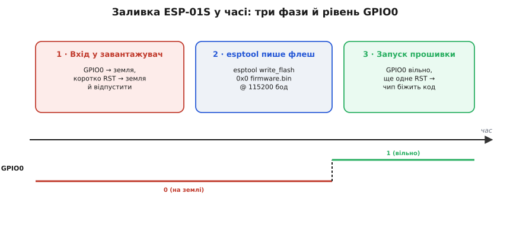

# 📋 Прошивка ESP-01S: конфігурація IDE, вхід у завантажувач, рецепт esptool

На «голій» ESP-01S немає ні USB, ні кнопок, тож звична дія «натиснути Upload» тут сама не спрацює: чип доводиться вручну заганяти в режим завантажувача, а середовище — правильно налаштовувати під його флеш. Зібрано весь інтерфейс прошивки цієї плати в одному місці: які параметри виставити в Arduino IDE, якою послідовністю GPIO0 і скидання ввести чип у завантажувач, які команди `esptool` шлють образ у флеш і як прочитати найчастішу помилку «Failed to connect». Це довідка-рецепт — маючи її під рукою, ви заллєте на ESP-01S будь-який скетч, не гадаючи, чому воно не заводиться першого разу.

Домовимося про інструмент. Прошивати будемо через **Arduino IDE з ядром ESP8266** — найкоротший шлях: ядро дає опис плат, компілятор і саме кличе `esptool`, щоб залити зібране. Той самий образ можна залити й з командного рядка — `esptool` напряму; обидва шляхи покажемо, бо розуміти, що робить IDE «під капотом», варто хоча б для того, щоб полагодити, коли IDE мовчить.

## Наставити Arduino IDE на ESP8266

«Із коробки» Arduino IDE не знає про ESP8266 — вона вміє лише класичні AVR-плати. Треба доставити ядро — набір компілятора, бібліотек і опису плат для цього чипа.

У налаштуваннях IDE є поле **Additional Boards Manager URLs**; туди вписують адресу індексу пакунків спільноти ESP8266:

```
http://arduino.esp8266.com/stable/package_esp8266com_index.json
```

Після цього в **Boards Manager** з'являється пакунок «esp8266 by ESP8266 Community» — ставимо його. Це верифікований, офіційний спосіб (репозиторій `esp8266/Arduino` на GitHub, він же тримає й документацію ядра). Тепер у списку плат є десятки варіантів ESP8266, і тут перша тонкість вибору.

**Яку плату обрати в меню.** Окремого пункту «ESP-01S» немає й не треба — це лише носій навколо чипа. Беремо **Generic ESP8266 Module** (узагальнена плата на цьому чипі) і в її параметрах виставляємо те, що стосується саме нашої плати:

```
Board:        Generic ESP8266 Module
Flash Size:   1MB (FS:none OTA:~500KB)   ← у ESP-01S зазвичай 1 МБ
Flash Mode:   DOUT   ← найбезпечніший для дрібних модулів; QIO ESP-01S часто не тягне
Upload Speed: 115200 ← починайте з поміркованої; вище — коли впевнитесь
```

Три речі варто пояснити, бо вони не косметичні.

**Flash Size** має відповідати реальній мікросхемі пам'яті. У ESP-01S це майже завжди 1 МБ, але трапляються партії з 2–4 МБ; надійніше не вгадувати з напису, а спитати сам чип — про це нижче, у рецепті `esptool`. Якщо тут збрехати (сказати 4 МБ там, де 1 МБ), файлова система й дані опиняться за межами наявної флеші, і пристрій поводитиметься примхливо.

**Flash Mode** — це скільки ліній чип читає з флеші паралельно. `QIO` (чотири лінії) швидший, але на дрібних модулях типу ESP-01S ті додаткові лінії часто розведені так, що швидкий режим збоїть. `DOUT` (дві лінії на читання) повільніший на частки секунди при старті, зате заводиться всюди. Правило просте: **не заводиться після заливки — першим ділом переставте на `DOUT`**.

> 🔧 **Навіщо ці три поля.** Це три найчастіші причини «залилося, а не працює» саме на ESP-01S. Неправильний розмір флеші губить дані; агресивний `QIO` дає плату, що вічно перезавантажується; зависока швидкість заливки рве зв'язок посеред запису. Виставили консервативно — `1MB`, `DOUT`, `115200` — і зняли три класи проблем ще до першого рядка коду.

## Перевірочний скетч: чи справний ланцюг заливки

Перш ніж мудрувати з логікою, залиймо найдрібнішу можливу програму — просто блимання світлодіодом. Якщо *воно* заллється й побіжить, значить, увесь ланцюг «IDE → перехідник → GPIO0-танець → флеш» справний, і далі можна нарощувати код, не гадаючи, чи то програма погана, чи то плата не прошилась.

Ось цей скетч. Він уже враховує головну тонкість плати — світлодіод на GPIO2 світиться **навпаки**:

:::tabs
```cpp
// Найдрібніший скетч: блимаємо вбудованим синім LED на ESP-01S.
// LED сидить на GPIO2 і УВІМКНЕНО ЗА НИЗЬКИМ РІВНЕМ:
//   LOW  → світиться,   HIGH → гасне.

const int LED = 2;              // GPIO2 — до нього припаяно синій світлодіод

void setup() {
  pinMode(LED, OUTPUT);         // ніжка працює на вихід
  digitalWrite(LED, HIGH);      // старт із погашеним (HIGH = вимкнено!)
}

void loop() {
  digitalWrite(LED, LOW);       // світиться
  delay(500);                   // 0.5 с
  digitalWrite(LED, HIGH);      // гасне
  delay(500);
}
```
```micropython
# Найдрібніший скрипт: блимаємо вбудованим синім LED на ESP-01S.
# LED сидить на GPIO2 і УВІМКНЕНО ЗА НИЗЬКИМ РІВНЕМ:
#   value(0) → світиться,   value(1) → гасне.

from machine import Pin
from time import sleep_ms

led = Pin(2, Pin.OUT)      # GPIO2 — до нього припаяно синій світлодіод
led.value(1)               # старт із погашеним (1 = вимкнено!)

while True:
    led.value(0)           # світиться
    sleep_ms(500)          # 0.5 с
    led.value(1)           # гасне
    sleep_ms(500)
```
:::

Зверніть увагу на `digitalWrite(LED, HIGH)` як стан «вимкнено». Той, хто звик до звичайних плат, де `HIGH` світить, тут отримає світлодіод, що горить, коли має бути темно, і навпаки, — і півгодини шукатиме проблему в коді, якої там немає. **Активний низький рівень** (active-low): струм тече через LED, коли ніжка тягне його до землі, тож нуль — це «увімкнено». Ця дрібниця повторюється в кожному скетчі для ESP-01S, тож звикайте одразу.

### Танець із GPIO0: як реально залити

Тиснемо в IDE **Upload** — і тут вступає в дію те, чим ESP-01S відрізняється від Arduino. На Arduino заливка автоматична: плата сама вміє скинутись у режим прийому. На голому ESP-01S кнопок немає, і чип треба **вручну загнати в завантажувач**.

Механізм такий. При кожному скиданні ESP8266 дивиться на ніжку GPIO0: якщо вона притиснута до землі — чип входить у режим завантажувача (bootloader) і чекає нову прошивку по UART; якщо вільна — біжить те, що вже у флеші. Отже, послідовність фіксована:


*Три фази заливки в часі. Спершу GPIO0 притискають до землі й коротко скидають чип (RST на землю й назад) — чип входить у завантажувач. Поки esptool пише флеш, GPIO0 лишається на землі. Аж коли запис завершився, GPIO0 відпускають і скидають ще раз — тепер чип бачить вільну ніжку й запускає свіжу прошивку. Червона доріжка знизу — коли GPIO0 має бути на нулі.*

Словами той самий рецепт:

```
1. Притиснути GPIO0 до землі (джампером або дротом).
2. Коротко замкнути RST на землю й відпустити  → чип у завантажувачі.
3. У IDE натиснути Upload (або запустити esptool).
4. Коли запис завершився — прибрати GPIO0 із землі.
5. Ще раз коротко замкнути RST на землю      → чип біжить нову прошивку.
```

Це та сама процедура, що описана в [книзі про прошивку у Flash](topic:sys-ide/flashing): будь-який чип, у якого програма живе в окремій флеш-пам'яті, потребує способу сказати йому «зараз приймай нове, а не виконуй старе», і завантажувач із стрепінг-ніжкою — класична відповідь. На ESP8266 цю роль грає саме GPIO0.

> 🔧 **Навіщо руками.** Готові USB-перехідники «під ESP-01» часто мають дві кнопки — RST і FLASH (вона ж GPIO0), — які роблять цей танець самі: тримаєш FLASH, тиснеш RST, відпускаєш RST, відпускаєш FLASH. З таким перехідником заливка стає двома натисканнями. На зовсім голій платі ті самі два дроти доводиться замикати пінцетом — незручно, але один раз, поки не спаяєте собі колодку з кнопками.

### Коли IDE каже «Failed to connect»

Це найчастіше повідомлення на старті, і воно майже ніколи не про те, що здається. Розшифрую за спаданням імовірності — саме в такому порядку й перевіряйте:

**GPIO0 не був на землі в момент скидання.** Дев'ять із десяти випадків. Чип просто не ввійшов у завантажувач, тож нема кому відповідати. Повторіть танець: землю на GPIO0 → скидання → *тоді* Upload. Ключове — порядок: спершу земля й скидання, аж потім заливка.

**Лінії TX/RX переплутані.** Послідовний порт з'єднується **навхрест**: TX перехідника йде на RX плати, а TX плати — на RX перехідника. Якщо з'єднати «прямо», обидва пристрої передають назустріч і жоден не чує іншого. Помінялися ролями дротів — і зв'язок з'явився. Механіку самого перехрещення розбирає [асинхронна передача (UART)](topic:com-devices/async-serial): передавач одного боку мусить дивитися у приймач іншого.

**Не той COM-порт.** У списку портів IDE виберіть саме той, що з'явився, коли ви ввімкнули перехідник у USB (від'єднайте-під'єднайте й подивіться, який пункт зникає-з'являється).

**Кволе живлення.** Навіть заливка вимагає струму, а якщо годувати плату від 3.3-вольтового виводу самого перехідника, його часто бракує вже на стадії завантажувача. Дайте окреме чисте 3.3 В із запасом струму.

**Зависока швидкість.** Довгий чи шумний дріт не тягне 115200 бод. Спробуйте у налаштуваннях повільніше; `esptool` це вміє прямо: `--baud 9600`. Повільно, зате доходить.

Той самий діагноз мовою `esptool`, якщо заливаєте з командного рядка (адреса `0x0`, бо на ESP8266 образ пишеться від початку флеші):

```
# спершу спитаймо сам чип — скільки в нього флеші й що він за один
esptool --port COM4 flash_id
#   → у відповіді буде розмір (напр. "Detected flash size: 1MB")
#     і MAC — так ви ПЕРЕВІРИТЕ реальний обсяг, а не вгадуєте з напису

# заливка зібраного образу від початку флеші
esptool --port COM4 --baud 115200 write_flash 0x0 firmware.bin
```

Дрібна, але свіжа деталь: у нових версіях (`esptool` 5) команди перейменували з підкреслень на дефіси — `write_flash` → `write-flash`, `flash_id` → `flash-id`. Стара форма з підкресленням поки працює, але друкує попередження «deprecated». Це верифіковано за нотатками випуску `esptool`; Arduino IDE донедавна кликала саме форму з підкресленням, тож ви побачите обидві — вони роблять те саме.

## Швидка діагностика: заливка й старт

Майже всі збої прошивки лежать не в коді, а в дротах і порядку натискань. Ось перша перевірка за симптомом — саме на етапах заливки й першого старту:

```
Етап              Що ламається                     Перша перевірка
────────────────────────────────────────────────────────────────────────
Заливка           «Failed to connect»              GPIO0 на землі ПЕРЕД скиданням?
                                                    TX/RX навхрест? той COM-порт?
Старт після       чип зависає / не біжить код       GPIO2 не притиснутий до землі?
заливки                                             Flash Mode = DOUT? розмір флеші вірний?
```

Пройшли обидва рядки — і плата гарантовано прошита й біжить ваш код; далі вся робота вже в самій програмі.
