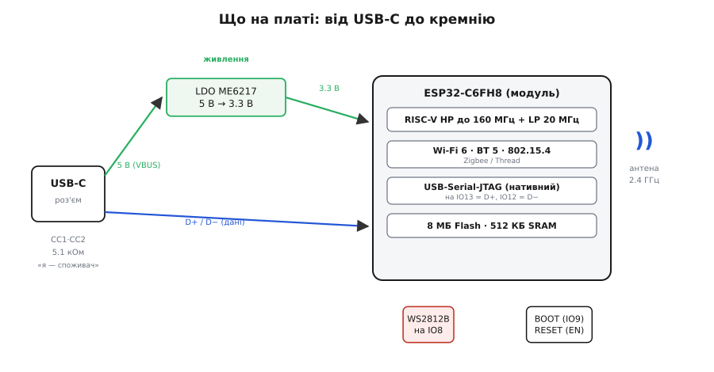
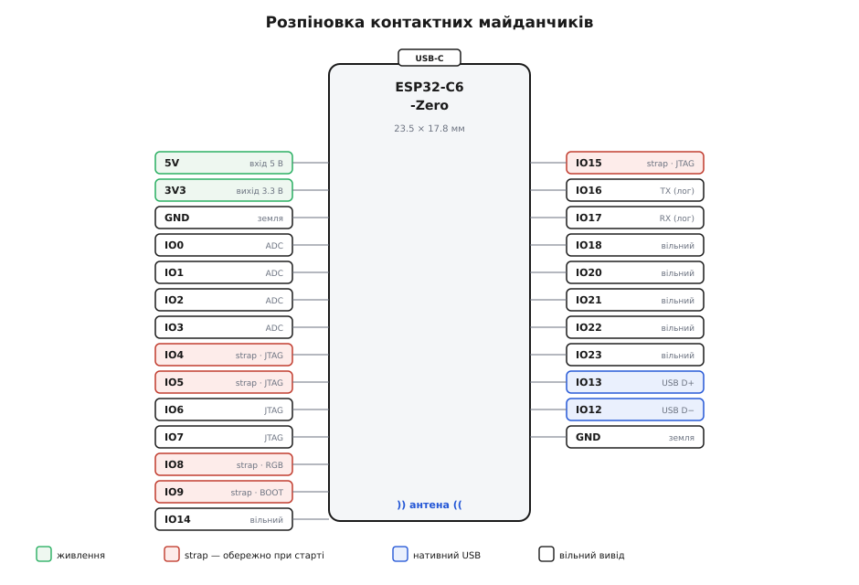

# Waveshare ESP32-C6-Zero

<preknowlist>
- [Мікроконтролер: блоки всередині](topic:hw-arch/mcu-blocks) — що ядро, пам'ять і периферія живуть на одному кристалі й спілкуються по внутрішній шині.
- [GPIO: вивід як регістр](topic:sf-devices/gpio-registers) — нога мікроконтролера керується бітами регістра; той самий пін уміє різні функції.
- [Логічні рівні як діапазони](topic:hw-digital/logic-levels-as-ranges) — «нуль» і «одиниця» — це смуги напруг; 3.3 В проти 5 В.
- [Flash проти RAM](topic:hw-arch/flash-vs-ram) — код живе у flash і лишається без живлення; RAM швидка, але зникає при вимкненні.
- [Прошивання у Flash](topic:sys-ide/flashing) — як образ потрапляє в мікроконтролер через завантажувач і послідовний потік.
- [Родина ESP32](topic:cat-hw-boards/esp32-family) — чим відрізняються C-, S- і оригінальні лінійки; що дає RISC-V-ядро.
</preknowlist>

На долоні лежить прямокутник менший за поштову марку — 23.5 на 17.8 міліметра. По двох довгих краях — рядки срібних напівкруглих виїмок, ніби половинки отворів, розсічені навпіл. Зверху — гніздо USB-C, збоку блищить біла керамічна цятка антени, а посередині світиться крихітний різнокольоровий вогник. Це **Waveshare ESP32-C6-Zero** — повноцінний комп'ютер із бездротовим зв'язком, стиснутий до розміру, за якого його можна впаяти в чужу плату, як звичайну мікросхему.

Слово «Zero» тут не про потужність, а про **форм-фактор**: серія крихітних плат, де прибрано все зайве, а виводи винесено не штирями, а **напівотворами по краю** (їх називають *castellated* — від італ. *castellato*, «зубчастий, як мур замку»). Такий край можна покласти на контактні майданчики власної плати й пропаяти хвилею чи феном — модуль сідає пласко, без гребінок. Це не «плата для макетки в першу чергу», а **готовий радіомодуль із мозком**, який ви вбудовуєте у власний виріб.

Розберімо цю плату так, щоб упізнати її серед десятка схожих, зрозуміти, що всередині, як її прошити й підключити і на яких дрібницях спотикаються ті, хто бачить її вперше.

### Що це і навіщо саме воно

У серці плати — система-на-кристалі **ESP32-C6** від Espressif (конкретно модуль на чипі ESP32-C6FH8). Одне речення, а в ньому три важливі слова.

**«C6»** означає покоління на ядрі **RISC-V** — відкритій системі команд, а не на закритій Xtensa, як старші ESP32. Практично для вас це майже невидимо: той самий Arduino-код, той самий ESP-IDF. Але це показник напряму, у який Espressif веде свої дешеві чипи.

**«Система-на-кристалі»** (SoC, *system on a chip*) означає, що процесор, пам'ять і — головне — **радіо** сидять на одному шматку кремнію. Саме радіо робить цю плату цікавою: вона не просто рахує, вона **сама виходить у мережу**. І не одним способом, а трьома одразу.

> 🔧 **Навіщо це.** Коли пристрою треба «бачити» мережу — віддавати показники давача в застосунок на телефоні, приймати команди з домашньої автоматики, скластися в сітку з іншими такими ж — ESP32-C6-Zero дає це «з коробки», без окремого радіомодуля поряд. Ви паяєте одну річ розміром із марку, а отримуєте і обчислення, і Wi-Fi, і Bluetooth, і промислову сітку. Це прибирає з плати цілий вузол.

### Три радіо в одній цятці

Керамічна антена на краю обслуговує три різні світи бездротового зв'язку, і всі три — сучасних поколінь.

Перше — **Wi-Fi 6** (стандарт 802.11ax у смузі 2.4 ГГц). Це та сама мережа, до якої під'єднаний ваш телефон; плата може бути і клієнтом (заходити у ваш роутер), і власною точкою доступу (роздавати сторінку налаштувань). «6» — не маркетинг заради цифри: новіший стандарт краще поводиться там, де в ефірі багато пристроїв, а це саме випадок розумного дому.

Друге — **Bluetooth 5** (низькоенергетичний, BLE). Ним зручно віддати смартфону невеликий потік — показник, налаштування, команду — без окремого застосунку-сервера в хмарі: телефон говорить із платою напряму, поруч.

Третє — і саме воно вирізняє C6 серед братів — **IEEE 802.15.4**. Це радіо для **Zigbee** та **Thread**: протоколів сіткової (mesh) автоматики, де десятки дрібних вузлів (лампи, датчики, розетки) переказують пакети одне одному, покриваючи весь будинок без потужного передавача в кожному. Саме на 802.15.4 стоїть відкритий стандарт розумного дому Matter. Старші ESP32 цього радіо не мали — щоб зайти в Zigbee-світ, потрібен був окремий чип; C6 несе його всередині.

### Що всередині: від USB-C до кремнію

Плата виглядає порожньою, але кожна дрібниця на ній має роль. Простежмо шлях від гнізда живлення до процесора.


*Живлення (зелене): 5 В із USB-C заходять на лінійний стабілізатор ME6217, що робить 3.3 В для всього кремнію. Дані (синє): лінії D+/D− з USB-C ідуть напряму в модуль — на нативний USB-контролер чипа, повз стабілізатор. Пара резисторів CC на 5.1 кОм — це «підпис» плати як споживача енергії для USB-C. RGB-світлодіод сидить на IO8, кнопки BOOT і RESET керують запуском.*

Живлення заходить із **USB-C** як 5 вольтів. Але кремній ESP32 п'яти вольтів не терпить — йому потрібні **3.3 В**. Тому одразу за роз'ємом стоїть **лінійний стабілізатор** (LDO, *low-dropout regulator*) — на цій платі це ME6217C33M5G, що віддає до 800 мА. Він зрізає 5 В до стабільних 3.3 В, якими живиться і сам чип, і все, що ви повісите на вивід `3V3`.

Дрібниця, яку легко проґавити: біля роз'єму стоять **два резистори по 5.1 кОм** на лініях CC. У світі USB-C це не випадковість, а **обов'язковий підпис**: саме цими резисторами пристрій повідомляє джерелу «я споживач, дай мені 5 В». Без них деякі зарядки й павербанки просто не подадуть живлення в порт. На готовій платі вони вже є — але якщо ви колись розводитимете власну плату навколо такого модуля, про них треба пам'ятати.

Тепер найцікавіше — **дані**. На багатьох дешевих платах USB-роз'єм служить лише для живлення, а щоб прошити чип, потрібен окремий перехідник [USB↔UART](root:embedded/usb-uart-bridge). Тут не так. ESP32-C6 має **вбудований USB-контролер** (USB Serial/JTAG) прямо в кремнії, і Waveshare завела лінії D+/D− з роз'єму просто на нього: **D+ на IO13, D− на IO12**. Наслідок практичний і приємний: **плата прошивається одним кабелем USB-C, без жодного зовнішнього перехідника**. Комп'ютер бачить її як послідовний порт сам собою.

> 🔧 **Навіщо це.** Нативний USB економить не лише перехідник. Той самий контролер уміє прикидатися і послідовним портом (для журналу й прошивки), і JTAG-зневаджувачем (для покрокового налагодження), і будь-яким USB-пристроєм — клавіатурою, мишкою, флешкою, — якщо ви так запрограмуєте. Плата розміром із марку може стати USB-гаджетом без жодної додаткової мікросхеми.

Ще на платі — **RGB-світлодіод** типу WS2812B на виводі **IO8**. Це не простий світлодіод із двома ногами, а «розумний» піксель: усередині — власний контролер, і колір задається однопровідним цифровим потоком за суворим таймінгом. Один вивід — і в вас керований мільйоном відтінків вогник для індикації станів. І дві кнопки: **RESET** (перезапуск, лінія EN) та **BOOT** (вибір режиму завантаження, лінія IO9) — разом вони керують тим, у якому режимі чип стартує.

### Розпіновка: два ряди напівотворів

По краях модуля — контактні майданчики. Розберімо, що на них виведено, бо саме тут вирішується, куди що паяти.


*По кутах — живлення (зелене): вхід 5 В, вихід 3.3 В і кілька земель. Червоним позначено strapping-піни (IO4, IO5, IO8, IO9, IO15) — їх стан у момент увімкнення чип читає як команду, тож зовнішні кола на них ставлять обережно. Синім — IO12/IO13: вони зайняті нативним USB. Решта виводів (IO0–IO3, IO14, IO18, IO20–IO23) — вільні для будь-чого; IO0–IO6 додатково вміють вимірювати напругу (ADC).*

Логіка проста. Два виводи — **живлення**: `5V` (сюди можна подати зовнішні 5 В, якщо не через USB) і `3V3` (звідси береться готова 3.3-вольтова напруга для ваших давачів). Кілька `GND` — спільна земля. Решта — **цифрові виводи** `IOxx`, кожен із яких можна зробити входом чи виходом і, у більшості, перепризначити на різну периферію (UART, SPI, I2C, ШІМ, ADC). Це і є [мультиплексування виводів](root:embedded/pin-mux): майже будь-яку функцію можна вивести майже на будь-яку ногу.

Але «майже» ховає дві пастки, і обидві позначені на схемі кольором.

Перша — **strapping-піни** (від англ. *strap*, «перемичка»): IO4, IO5, IO8, IO9 та IO15. У перші миті після подачі живлення, ще до вашого коду, чип **зчитує рівень на цих ногах** і трактує його як налаштування — зокрема, звідки завантажуватись. Якщо ви повісите на такий вивід зовнішнє коло, що тягне його в «неправильний» бік під час старту, плата може не завантажитись або піти в режим прошивки замість роботи. Тому: strapping-піни беруть для звичайного вводу-виводу **лише свідомо**, розуміючи, що на них не має бути сильної підтяжки в момент увімкнення.

Особливо підступний тут **IO8**: на ньому висить **той самий RGB-світлодіод**, і він же — strapping-пін. WS2812 у спокої ставить лінію в стан, сумісний із нормальним завантаженням, тож штатно все працює; але якщо ви захочете забрати IO8 під власне зовнішнє коло, робіть це з розумінням, що ділите ногу з завантажувальною логікою.

Друга пастка — **IO12 і IO13**: вони віддані нативному USB (D− і D+). Формально їх виведено на майданчики, і теоретично ними можна користуватись як звичайними ногами — але щойно ви це зробите, **зникне прошивка через USB-C**. Тож на практиці ці два виводи вважайте зайнятими роз'ємом і не чіпайте, поки покладаєтесь на USB.

Окремо варто знати про два майданчики, підписані **TX** і **RX**, — це виводи IO16 та IO17, стандартний UART0. Саме на них чип **вивалює текстовий журнал** під час завантаження й роботи: якщо щось піде не так і USB замовкне, підключивши сюди перехідник USB-UART, ви побачите, що модуль каже про себе. Це резервний канал і вікно в його думки.

### Як її прошити

Найчастіший перший крок — залити прошивку. Тут ESP32-C6-Zero поводиться майже ідеально, але одна дрібниця відрізняє її від «плат для новачка».

У щасливому випадку все тривіально: під'єднали USB-C, вибрали в середовищі плату (у термінах ESP-IDF/Arduino ціль — просто `esp32-c6`) і потрібний порт, натиснули «прошити». Вбудований USB-контролер сам уводить чип у режим завантаження, приймає образ і перезапускає його. Жодних кнопок.

Дрібниця в тому, що іноді — надто коли поточна прошивка «зависла» й глушить USB, або при **найпершому** заливанні — автоматичний вхід у режим прошивки не спрацьовує. Тоді режим завантаження вмикають **руками, двома кнопками**, у чіткому порядку:

```
1. Затиснути й тримати BOOT.
2. Коротко натиснути й відпустити RESET (не відпускаючи BOOT).
3. Відпустити BOOT.
→ Чип у режимі завантаження, чекає на прошивку через USB.
```

Механізм видно з розпіновки. Кнопка RESET смикає лінію EN — чип перезапускається. У цю мить він зчитує strapping-пін IO9 (кнопка BOOT): якщо той притиснутий до землі (кнопка натиснута) — чип іде не в звичайний запуск, а в **режим завантаження** й слухає порт. Відпустили BOOT після RESET — і момент вибору вже минув, чип лишається чекати образ. Це та сама послідовність, що й на всіх ESP32; знаючи, *чому* саме такий порядок, ви ніколи її не переплутаєте.

Далі роботу зі шматками образу, стиранням і записом бере на себе інструмент esptool — вам лишається натискати кнопку в середовищі; як він розбиває [прошивання у Flash](topic:sys-ide/flashing) на стирання й запис за адресами, описано окремо. А сам образ прошивки — це не «файл програми» у звичному сенсі, а [цілісний двійковий зліпок](topic:sf-lang/firmware-image) із завантажувачем, таблицею розділів і вашим кодом, який лягає у flash за фіксованими адресами.

### Живлення без сюрпризів

Плату можна годувати трьома шляхами, і плутанина між ними — часте джерело диму.

Найпростіше — **USB-C**: 5 В із комп'ютера чи зарядки, стабілізатор робить із них 3.3 В. Другий шлях — подати свої **5 В на майданчик `5V`** (від власного блока живлення), тоді все проходить через той самий стабілізатор. Третій — якщо у вашій системі вже є чисті **3.3 В**, подати їх напряму на `3V3`, **оминаючи стабілізатор**.

І тут головне правило, порушення якого вбиває чип: **не подавайте більше за 3.3 В на вивід `3V3`**. Цей майданчик під'єднаний прямо до кремнію; п'ять вольтів сюди — і модуль згорить. П'ять вольтів мають право заходити **лише** через USB-C або майданчик `5V`, де їх зустріне стабілізатор.

> 🔧 **Навіщо це.** Виводи ESP32 не «п'ятивольтотерпимі»: вхідна нога витримує приблизно до 3.3 В плюс невеликий запас, не 5 В. Тому давач, енкодер чи логічний сигнал, що працює від 5 В, не можна вішати прямо на IOxx — треба узгодити [логічні рівні](topic:hw-digital/logic-levels-as-ranges) через перетворювач або дільник напруги. Це стосується і сигналів, і живлення: 3.3 В — робочий світ цієї плати, і виходити за нього не можна ніде, крім спеціально відзначених 5-вольтових входів.

Ще про струм. Стабілізатор віддає до 800 мА — цього з головою для самого чипа (у піках передавання Wi-Fi він смикає сотні міліампер короткими сплесками) і кількох давачів. Але живити від `3V3` щось прожерливе — стрічку світлодіодів, мотор, дисплей із підсвіткою — не варто: просадите напругу, і Wi-Fi почне відвалюватись саме в моменти передавання. Прожерливе живіть окремо, поділивши з платою лише землю.

### Де вона доречна, а де ні

ESP32-C6-Zero — це вибір, коли потрібні **малий розмір і сучасне радіо разом**. Вона світить там, де плату треба **вбудувати**: у корпус давача, у розумну розетку, у носимий пристрій, у сітку Zigbee/Thread-вузлів по будинку. Напівотвори по краю кажуть прямо: мене задумали впаювати у ваш виріб, а не тримати роками на макетці (хоча з припаяною гребінкою вона й на макетці працює).

Де вона **не** найкращий вибір: якщо вам потрібні аналогові виходи (DAC), багато аналогових входів чи екзотична периферія — придивіться до інших членів [родини ESP32](topic:cat-hw-boards/esp32-family); C6 навмисне ощадливий. Якщо потрібна велика обчислювальна міць чи камера — це вже не про Zero-плату. А якщо радіо взагалі не треба — простіший і дешевший 8-бітний контролер зробить те саме дешевше.

Але для типової задачі «дай маленькому пристрою вийти в мережу сучасним способом і не займи при цьому місця» — цей прямокутник із марку розміром робить рівно те, що обіцяє.

Практична робота з платою — від першого миготіння вбудованим світлодіодом до під'єднання давача й виходу в мережу — з реальним C/C++ під ESP-IDF та Arduino зібрана окремо: [як керувати ESP32-C6-Zero у коді](topic:cat-hw-boards/esp32-c6-zero/api-quickstart.md) — налаштування середовища, RGB-світлодіод на IO8, читання виводів і типові пастки з прикладами.
