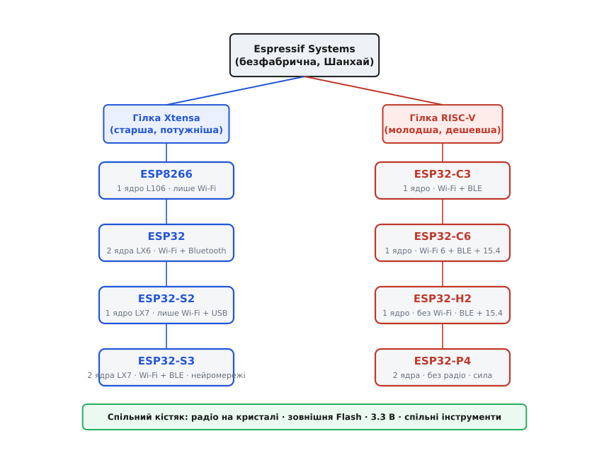
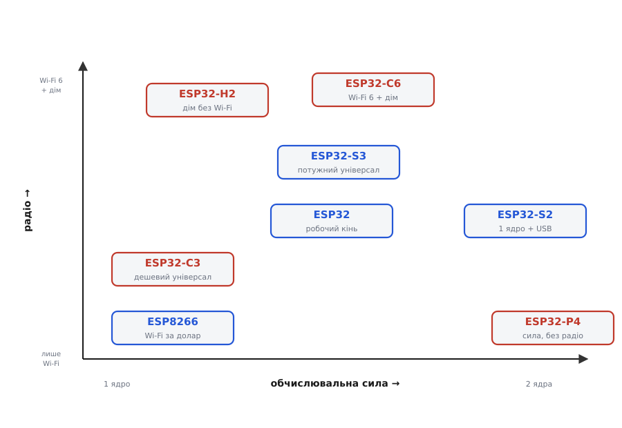

# Родина ESP32/ESP8266 (Espressif)

<preknowlist>
- [Архітектура ESP32](topic:hw-arch/esp32-architecture) — що взагалі всередині цих чипів: ядро, пам'ять на кристалі, зовнішня Flash, вбудоване радіо.
- [Wi-Fi](topic:com-transport/wifi) — радіо на 2.4 ГГц, заради якого цю родину й купують; що це за мережа й навіщо.
- [Радіо на чипі](topic:com-transport/on-chip-radio) — чому передавач можна впаяти в той самий кристал, що й процесор, і що це дає.
- [Асинхронний послідовний обмін (UART)](topic:com-devices/async-serial) — TX/RX, головний спосіб говорити з платою й заливати прошивку.
- [Логічні рівні як діапазони](topic:hw-digital/logic-levels-as-ranges) — чому вся родина 3.3-вольтова й що буває, коли на вхід приходять 5 В.
</preknowlist>

Зайдіть у будь-який магазин саморобної електроніки, наберіть у пошуку «ESP» — і на вас висиплеться десяток плат, зовні майже однакових: чорний чи синій прямокутник із металевою коробочкою чипа посередині й зубчастою міддю антени по краю. Одна коштує долар, інша п'ять; на одній написано `ESP-01`, на іншій `ESP32-S3`, на третій `ESP32-C6`. Усі вони — з однієї стайні шанхайської компанії **Espressif Systems**, і всі роблять по суті те саме диво: дають вашому пристрою повноцінний 32-бітний процесор із бездротовим зв'язком за ціну чашки кави. Це і є **родина ESP32/ESP8266** — фактичний стандарт «розумних речей» у мільйонах майстерень світу.

Але за цією зовнішньою схожістю ховається дерево, у якому легко заблукати. Плати діляться на **чипи** (сам кремній: ESP8266, ESP32, S2, S3, C3, C6, H2, P4) і **модулі-плати** навколо них (ESP-01, DevKit, SuperMini, ESP32-CAM…). Чипи діляться на дві архітектурні гілки, що навіть говорять різними машинними мовами. І помилка на цьому дереві коштує дорого: код, зібраний під один чип, просто не запуститься на іншому, а розводка з чужого посібника переплутає вам виводи. Розберімо цю родину так, щоб ви впізнавали, хто є хто, розуміли, що всіх їх ріднить, і могли впевнено обрати свій чип під конкретну задачу — а по деталі кожної окремої плати підете вже за посиланням.

## Чип проти плати: перше, що треба розділити

Найпоширеніша плутанина новачка — змішати в голові дві різні речі, які обидві звуть «ESP».

**Чип** — це система-на-кристалі (*system-on-chip*, SoC): один кремнієвий кристал, де в одному корпусі сидять і процесор, і пам'ять, і радіомодем. Це те, що знає компілятор: коли ви шукаєте бібліотеку чи приклад коду, орієнтир — **назва чипа** (ESP8266, ESP32-S3). Чип сам собою — крихітний квадратик із ніжками, паяти який руками незручно.

**Модуль** — це вже маленька плата, на яку той чип розведено разом із мінімальною обв'язкою: кварцовий резонатор (задає такт), мікросхема Flash-пам'яті (тримає прошивку — у самому чипі місця під програму зазвичай немає) і антена. Модуль зазвичай екранований бляшаною коробочкою — вона тримає радіо від завад. Приклад — модуль `ESP32-WROOM`.

**Плата розробника** (*development board*) — це модуль плюс те, що робить його зручним для людини: гніздо USB, мікросхема живлення, кнопки, гребінки виводів. Це те, що ви тримаєте в руках і встромляєте в комп'ютер. Коли ви шукаєте розпіновку, розміри, чим живити й куди паяти — орієнтир **назва плати** (ESP-01, DevKit, SuperMini).

> 🔧 **Навіщо це.** Розрізняти ці три рівні треба з суто практичних причин. Той самий чип ESP32-S3 живе і на крихітному [SuperMini](topic:cat-hw-boards/esp32-s3-supermini), і на [Pico](topic:cat-hw-boards/esp32-s3-pico) — код однаковий, а виводи, живлення й розмір різні. І навпаки: дві плати з однаковим написом «ESP32» на корпусі можуть нести всередині зовсім різні чипи (класичний ESP32 проти ESP32-S3) — з різною нумерацією виводів і несумісними бібліотеками. Тому перше, що робиш із новою платою, — читаєш напис коло чипа, а не назву на упаковці.

Чому взагалі виникає такий «зоопарк» плат навколо одного кремнію? Тому що Espressif — **безфабрична** (*fabless*) фірма: вона лише проєктує чипи, а виготовляють їх на чужих заводах. Сторонні майстерні (найвідоміша — китайська **Ai-Thinker**) беруть готовий чип і клепають із нього копійчані модулі й плати десятками різновидів. Цей поділ праці й дає на виході і смішну ціну, і строкате різноманіття плат довкола одного й того ж чипа. Як безіменна дешева крихта з Шанхаю за два роки стала світовим стандартом — окрема детективна історія про [те, як дешевий Wi-Fi-чип підкорив аматорів](topic:hw-arch/esp32-architecture/hist-esp.md): випадкове відкриття, глобальна спільнота, що зробила за рік роботу цілого відділу, і рідкісна мудрість фірми, яка обійняла власних хакерів.

## Що ріднить усю родину

Попри розгалуження, у всіх ESP є спільний кістяк — саме він робить їх «однією родиною», а не просто вісьмома різними мікроконтролерами.

**32-бітний процесор на кристалі.** Це не 8-бітні малюки рівня класичного [Arduino](topic:cat-hw-boards/arduino-family): усередині повноцінне 32-бітне ядро на десятки, а то й сотні мегагерц. Йому під силу тримати мережевий стек, крутити веб-сервер, обробляти дані з давачів — те, від чого 8-бітний контролер захлинувся б.

**Радіо в тому самому кремнії.** Головна риса родини — [радіомодем прямо на кристалі процесора](topic:com-transport/on-chip-radio). Не окрема мікросхема, яку треба докуповувати й розводити, а вбудований блок: у переважної більшості ESP це **Wi-Fi** на 2.4 ГГц, у більшості — ще й **Bluetooth**. Саме це й коштувало колись 30–40 доларів окремою платою розширення, а тут іде «безкоштовним» додатком до процесора.

**Зовнішня Flash-пам'ять під прошивку.** У самому чипі постійної пам'яті під вашу програму зазвичай нема — вона живе в **окремій мікросхемі Flash** поряд (типово 4 МБ, буває 2, 8, 16). Після скидання процесор читає програму звідти. Тому «прошити ESP» насправді означає «записати новий образ у той чип Flash» — і розмір Flash прямо визначає, скільки коду й даних влізе.

**Живлення 3.3 вольта.** Уся родина живиться від **3.3 В**, і всі її виводи очікують 3.3-вольтові [логічні рівні](topic:hw-digital/logic-levels-as-ranges). П'ять вольтів на вхід — це перевантаження, від якого вивід деградує чи гине. Тому на платах стоїть [лінійний регулятор (LDO)](topic:hw-power/ldo), що робить 3.3 В із 5 В USB, а стик із 5-вольтовою електронікою (класичний Arduino) вимагає зниження рівня.

**Апетит до струму ривками.** Спільна вроджена риса — і спільна пастка. Коли вмикається передавач Wi-Fi, споживання **стрибає до сотень міліампер** різкими короткими сплесками — саме в такт із передаванням пакетів. Кволе живлення або тонкі довгі дроти не встигають віддати такий ривок, напруга просідає, спрацьовує вбудований [сторож напруги](topic:hw-power/battery-to-controller) (*brownout detector*) — і плата йде на перезавантаження саме тоді, коли пробує вийти в мережу. Ліки в усій родині однакові: міцне джерело й керамічний конденсатор на кількасот мікрофарад поряд із платою.

**Спільна екосистема інструментів.** І, мабуть, найголовніше з погляду зручності: усі ESP програмуються одним і тим самим набором засобів. Є офіційний **ESP-IDF** (*IoT Development Framework*) на [операційній системі реального часу FreeRTOS](topic:sf-devices/freertos) — для серйозних проєктів; є **ядро Arduino для ESP** — прошарок, що дозволяє писати для будь-якого ESP звичними `setup()` і `loop()`. Бібліотека, написана під родину, з невеликими правками переходить з чипа на чип. Ця спільна екосистема — не дрібниця, а половина причини, чому родину так люблять.

> 🔧 **Навіщо це.** Спільний кістяк означає, що навички переносні. Навчилися заливати прошивку в один ESP, підключати давач по [I²C](topic:com-devices/i2c-bus), піднімати веб-сервер — і це майже без змін працює на будь-якому іншому члені родини. Ви вчите не «плату», а «родину»; конкретна плата додає лише свою розводку виводів і свої дрібні капризи при завантаженні.

## Дві гілки родини: Xtensa проти RISC-V

Тепер головне розгалуження, без якого в родині не зорієнтуватися. Усі ESP діляться на дві архітектурні гілки за тим, **яке процесорне ядро** всередині, — і ці гілки говорять різними машинними мовами.

**Гілка Xtensa** — старша. Ядро тут — **Tensilica Xtensa** (ліцензована розробка, нині частина Cadence): у ESP8266 це L106, у класичному ESP32 — LX6, у S-серії — LX7. Це потужніші, «дорожчі» ядра; саме на них стоять найздатніші чипи родини.

**Гілка RISC-V** — молодша. Тут ядро — **RISC-V** (*Reduced Instruction Set Computer*, «п'ятий»): відкрита, вільна від ліцензійних відрахувань система команд. Espressif перейшла на неї в дешевших і енергоощадних чипах C- і H-серій. Це прямо позначилося на ціні: RISC-V-плати часто найдешевші в родині.

*Родина ESP розходиться від спільного кореня на дві гілки за архітектурою ядра. Зліва гілка Xtensa: піонер ESP8266 (одне ядро L106), класичний ESP32 (два ядра LX6) і S-серія (LX7). Справа молодша гілка RISC-V: одноядерні C-серія та H-серія й потужна двоядерна P-серія. Спільний кістяк — радіо на кристалі, зовнішня Flash, живлення 3.3 В, спільні інструменти — тримає всіх разом попри різні машинні мови.*

> 🔧 **Навіщо це.** Практичний бік цього поділу — сумісність коду. Двійковий образ, зібраний під Xtensa, **фізично не запуститься** на RISC-V-чипі й навпаки: це різні набори машинних команд, як різні мови. На рівні вихідного коду й ядра Arduino різницю здебільшого приховано (ви пишете той самий `setup()`/`loop()`), але скомпільовану прошивку треба збирати **під свій конкретний чип**. Найчастіша помилка новачка тут — узяти S3 і C3 за взаємозамінні, бо вони однакові на вигляд і майже однакові ціною: насправді це різні гілки з різним числом ядер і різною розводкою.

## Як читати назву чипа

Назви ESP спершу здаються шифром, але в них є проста система — навчившись її читати, ви з самого імені розумієте, що за чип перед вами.

**`ESP8266`** — піонер родини, стоїть окремо: одне ядро Xtensa L106 на 80/160 МГц, лише Wi-Fi, без Bluetooth. Історична назва без наступної системи.

**`ESP32`** — сама по собі (без літери після числа) означає **класичний** чип 2016 року: два ядра Xtensa LX6, Wi-Fi і Bluetooth. Заразом слово «ESP32» вживають і ширше — як назву всієї сучасної родини після ESP8266. Контекст підказує, що мають на увазі.

**Літера після `ESP32-`** задає серію, і в ній закладено головну підказку:

- **`S`** (*standard/Xtensa*) — гілка Xtensa LX7: **S2** (одне ядро, лише Wi-Fi), **S3** (два ядра, Wi-Fi + Bluetooth, апаратні інструкції для нейромереж). Найздатніші чипи для важких задач.
- **`C`** (*RISC-V, compact/cost*) — гілка RISC-V, одне ядро, дешеві й компактні: **C3** (Wi-Fi + Bluetooth, перший RISC-V у родині), **C6** (Wi-Fi 6 + Bluetooth + радіо для «розумного дому»).
- **`H`** (*RISC-V, без Wi-Fi*) — RISC-V **без** Wi-Fi: **H2** несе тільки Bluetooth і радіо стандарту 802.15.4 (Thread/Zigbee) для мереж «розумного дому».
- **`P`** (*performance*) — RISC-V-важковаговик: **P4** — два швидкі ядра для обробки зображень і звуку, але **зовсім без радіо**.

Числа далі (`WROOM`, `WROVER`, `-N4`, `-N8`) — це вже про модуль, не про чип: тип корпусу, наявність додаткової пам'яті PSRAM, обсяг Flash. Так, `ESP32-S3-WROOM-1-N8R8` означає: чип S3, модуль WROOM-1, 8 МБ Flash (`N8`), 8 МБ PSRAM (`R8`).

Повний розбір, який чип коли з'явився і що кожна серія додала попередникам, — в [історії поколінь родини](topic:cat-hw-boards/esp32-family/hist-generations.md): від піонера 2014-го через класичний ESP32 до розгалуження на Xtensa- й RISC-V-гілки.

## Хто на що здатний: коротка мапа для вибору

Зведімо родину в практичну картину — не заради повноти, а щоб під конкретну задачу ви знали, куди дивитися. Головні осі вибору три: **скільки обчислювальної сили**, **яке радіо** і **скільки виводів/пам'яті** треба.

*Родина на двох осях. По горизонталі — обчислювальна сила (від одноядерного ESP8266 ліворуч до двоядерного P4 праворуч). По вертикалі — радіо (від «лише Wi-Fi» знизу через «Wi-Fi + Bluetooth» до «Wi-Fi 6 + радіо розумного дому» зверху; P4 стоїть осторонь — без радіо взагалі). Кожен чип сідає у свою нішу: дешевий базовий зв'язок, універсальний робочий кінь, важкі обчислення, мережі розумного дому.*

Читати мапу так:

- **Треба просто дати пристрою Wi-Fi найдешевше, виводів майже не треба** — піонер **ESP8266** (плати [ESP-01](topic:cat-hw-boards/esp-01), [ESP-01S](topic:cat-hw-boards/esp-01s)) або дешевий RISC-V **C3**. Це «дай речі мережу за долар».
- **Універсальний робочий кінь — Wi-Fi, Bluetooth, багато виводів, два ядра** — **класичний ESP32** або **S3**. Це типовий вибір «під що завгодно»: давачі, дисплеї, керування, веб-панель. S3 до того ж має нативний USB (прошивається без окремого перехідника) і апаратне прискорення нейромереж.
- **Камера, звук, важка обробка даних, великий буфер у пам'яті** — **S3 із PSRAM** (як на [ESP32-CAM](topic:cat-hw-boards/esp32-cam)) або важковаговик **P4** (але P4 сам радіо не має — зв'язок йому дає окремий ESP-компаньйон).
- **Найновіший Wi-Fi 6 чи мережа «розумного дому» (Thread/Zigbee, Matter)** — **C6** (Wi-Fi 6 + радіо 802.15.4) чи **H2** (тільки 802.15.4 + Bluetooth, без Wi-Fi). Приклад — плата [ESP32-C6-Zero](topic:cat-hw-boards/esp32-c6-zero).

> 🔧 **Навіщо це.** Три типові помилки вибору. **Перша** — узяти найпотужніший чип «про запас»: для вимикача світла по Wi-Fi P4 чи навіть S3 — марна переплата й зайвий клопіт, вистачить ESP8266 чи C3. **Друга** — забути про радіо: купити H2 чи P4 під проєкт, де потрібен саме Wi-Fi, і виявити, що його там нема. **Третя** — забути про PSRAM: узяти голий S3 без додаткової пам'яті під камеру чи звук і впертися в те, що великий буфер нікуди покласти. Спершу задача — тоді чип; не навпаки.

## Спільні пастки всієї родини

Оскільки в усіх ESP один кістяк, у них і спільні граблі. Знаючи їх раз, ви впізнаєте їх на будь-якій платі родини.

**Виводи з подвійною роллю (стрепінг).** У кожного ESP є кілька виводів, чий рівень **у момент скидання** вирішує, звідки завантажуватись — із Flash чи в режим прошивки. Найвідоміший — **GPIO0** (він же кнопка BOOT): притиснутий до землі при старті — чип чекає нову прошивку. Повісите на такий вивід зовнішній сигнал із «неправильним» рівнем при вмиканні — плата не завантажиться. Тому давачі й навантаження чіпляють на **вільні** виводи, а не «в перший-ліпший із номером».

**Прошивка через режим завантаження.** Заливка образу в Flash завжди йде через один механізм: чип треба ввести в **режим завантаження** й говорити з ним по [послідовному порту (UART)](topic:com-devices/async-serial). На платах із нативним USB чи перехідником це робиться само; де ні (як на ESP-01 чи [ESP32-CAM](topic:cat-hw-boards/esp32-cam)) — руками, перемичкою GPIO0 на землю. Універсальний рятівний прийом, коли плата «більше не прошивається»: **тримай BOOT, коротко тицьни RESET, відпусти BOOT** — і чип чекає прошивку. Як образ узагалі потрапляє у Flash — тема [прошивання ESP32](topic:sys-ide/flashing).

**Три-три вольти проти п'яти.** Уся родина 3.3-вольтова. Що заходить у ESP із 5-вольтового світу (RX, керувальні лінії) — треба **знижувати до 3.3 В** [зсувом рівня](topic:hw-digital/voltage-domain-interface); що виходить із ESP — 5-вольтовий вхід читає без проблем. Плутанина тут коштує тихо померлого входу.

**Живлення й антена.** Кволе живлення → перезавантаження на сплесках Wi-Fi (лікується конденсатором і товстими дротами). Затулений металом чи покладений на землю край плати з друкованою антеною → «Wi-Fi осліп». Обидві біди — родові, не ознака браку плати.

## Коротко: як тримати родину в голові

Родина ESP32/ESP8266 — це один спільний винахід у багатьох виданнях: 32-бітний процесор із радіо на кристалі й зовнішньою Flash, живлений 3.3 вольтами й програмований спільним набором інструментів. Спершу розділіть три рівні — **чип** (що знає компілятор), **модуль** і **плату** (що тримаєте в руках); напис коло чипа важливіший за назву на упаковці. Далі — дві гілки: старша, потужніша **Xtensa** (8266, класичний ESP32, S-серія) і молодша, дешевша **RISC-V** (C-, H-, P-серії); двійкова прошивка не переходить між гілками. Назва підказує суть: `S` — потужні Xtensa, `C` — дешеві RISC-V із Wi-Fi, `H` — RISC-V без Wi-Fi для «розумного дому», `P` — обчислювальний важковаговик без радіо. Вибирайте від задачі: базовий зв'язок за долар (8266, C3), універсал (ESP32, S3), важка обробка (S3+PSRAM, P4), нове радіо дому (C6, H2). А спільні пастки — стрепінг-виводи, режим прошивки, 3.3 В проти 5 В, живлення й антена — вивчивши раз, ви впізнаєте на будь-якому члені цієї великої й напрочуд здатної родини. По конкретну плату — розпіновку, розміри, приклад коду — ідіть у її власний опис; тут була карта всього роду.
