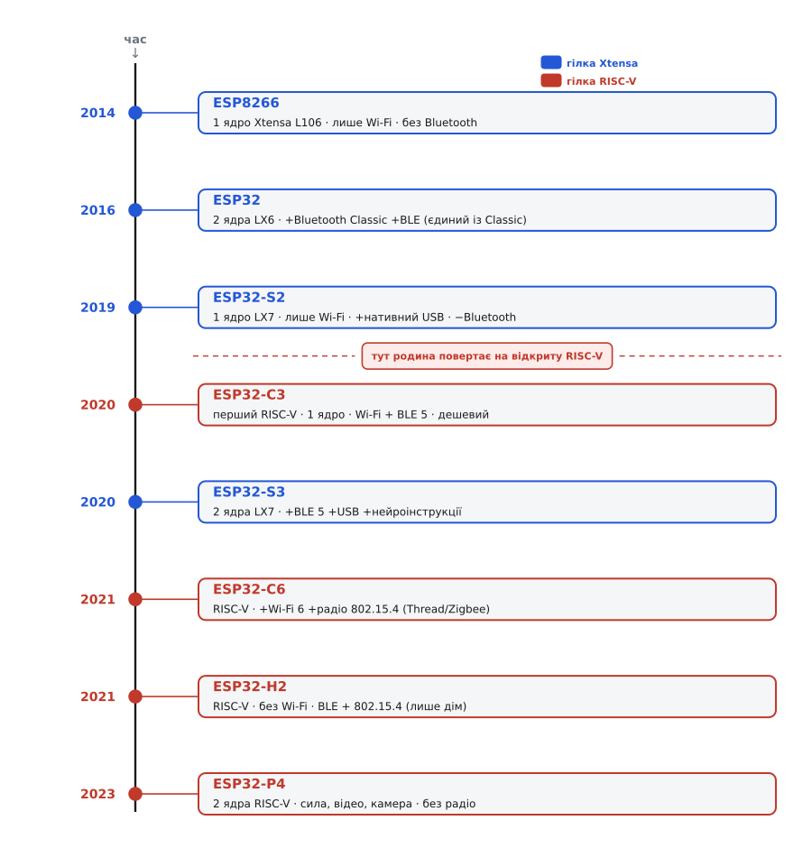

# 📜 Хроніка поколінь кремнію ESP

Коли дивишся на сьогоднішній прайс Espressif — ESP8266, ESP32, S2, S3, C3, C6, H2, P4, — здається, що це просто розсип моделей, як буває в будь-якого виробника чипів: бери що дешевше або що потужніше. Насправді ж це рівна **лінія в часі**, де кожне покоління народилося з конкретної потреби, дописало щось до попереднього або, навпаки, свідомо щось прибрало. Прочитати цю лінію варто не заради колекціонерської точності дат, а тому, що вона пояснює головне: **чому саме ці чипи існують і чим один відрізняється від іншого не за таблицею, а за задумом**. Хто зрозумів послідовність, той більше не плутає S3 із C3 і не купує H2 туди, де потрібен Wi-Fi.

Домовимося одразу про одну тонкість, бо без неї в датах легко заплутатися. У чипа є **два дні народження**: день, коли Espressif його **оголосила** (показала світові, роздала першим партнерам), і день, коли він **реально з'явився на полицях** — коли модуль на ньому можна купити на AliExpress і зібрати проєкт. Для деяких поколінь ці дати збіглися майже день у день; для інших між оголошенням і масовим кремнієм пройшло **майже два роки**. Далі я щоразу кажу, про яку саме дату йдеться, бо це не педантизм — саме розрив між «показали» і «продали» пояснює, чому дехто «пропустив» цілий чип.

*Хроніка кремнію ESP згори вниз за роками. Верхня половина — гілка Xtensa (сині): піонер ESP8266, класичний ESP32, одноядерний S2, двоядерний S3. Нижня — гілка RISC-V (червоні): C3, C6, H2, P4. Пунктирна риска між S2 і C3 — момент, коли родина повернула на відкриту систему команд. Праворуч від кожного чипа — що саме він додав до попередників або прибрав. Роки — за датами оголошення Espressif.*

## ESP8266 (2014): випадковий піонер, який усе почав

Усе почалося не з ESP32, а з крихітного чипа, який Espressif спершу й не мислила як зірку для аматорів. У **травні 2014 року** компанія випустила свій перший бездротовий SoC — **ESP8266EX** *(усталено; за офіційним переліком віх Espressif)*. Кремній був гранично простий: **одне 32-бітне ядро Tensilica Xtensa L106** на 80 МГц (розганялося до 160), трохи пам'яті на кристалі й одне-єдине радіо — **Wi-Fi на 2.4 ГГц, і більше нічого**. Ні Bluetooth, ні другого ядра, ні USB. Постійної пам'яті під програму в чипі теж по суті не було — її, як і в усій майбутній родині, тримала окрема мікросхема Flash поряд.

Задум був вузький і прозаїчний: дати вже наявним пристроям **дешевий місток у Wi-Fi**. Уявіть якийсь простий контролер — термостат, лічильник, іграшку, — що вміє все, крім виходу в мережу. ESP8266 у первісному задумі був саме «модемом»: до нього під'єднували головний мікроконтролер по [послідовному порту](topic:com-devices/async-serial) й ганяли текстові команди (`AT+…`), а чип за них ходив у Wi-Fi. Тому й перший модуль на ньому — легендарний **ESP-01** від сторонньої майстерні **Ai-Thinker**, що дійшов до західних любителів у **серпні 2014-го** — має всього-на-всього вісім ніжок: живлення, скидання й пару ліній того самого послідовного порту. Це не «плата для проєктів», це буквально причеплений збоку Wi-Fi-адаптер.

> 🔧 **Навіщо це.** Цей «модемний» родовід пояснює дивацтва ESP8266, які досі спантеличують новачків: чому в нього так мало виводів, чому вони незручно розкидані й чому частина з них норовисто веде себе при завантаженні. Чип не проєктували як самостійний мозок пристрою — його добудували до цієї ролі вже руки спільноти. Хто це знає, той не дивується, а просто обходить граблі.

Те, як цей безіменний дешевий чип за якісь два роки перетворився на світовий стандарт саморобної електроніки — окрема захоплива історія про випадкове відкриття, армію ентузіастів і рідкісну мудрість фірми, що обійняла власних хакерів; вона розказана в [історії про те, як дешевий Wi-Fi-чип підкорив аматорів](topic:hw-arch/esp32-architecture/hist-esp.md). Нам тут важливий інший бік: ESP8266 задав **генетичний код** усієї майбутньої родини. Радіо в тому самому кремнії, що й процесор; зовнішня Flash під прошивку; живлення 3.3 вольта; жадібні до струму сплески в момент передавання. Усе це — від піонера. Наступні покоління це успадкували й лише розбудовували.

## ESP32 (2016): два ядра, Bluetooth і початок справжньої родини

ESP8266 показав, що ринок дешевого Wi-Fi-кремнію величезний. Espressif зробила висновок і **6 вересня 2016 року** випустила чип, який уже проєктувався не як модем, а як **самостійний мозок** пристрою — **ESP32** *(усталено; дата з офіційних матеріалів Espressif)*. Це той чип, який сьогодні звуть «класичним ESP32», щоб відрізнити від пізніших серій із літерами.

Стрибок був разючий. Замість одного ядра — **два ядра Tensilica Xtensa LX6** на 240 МГц: одне могло крутити мережевий стек, друге — вашу логіку, і вони не заважали одне одному. Замість самого лише Wi-Fi — **Wi-Fi плюс Bluetooth**, причому в повному обсязі: і сучасний енергоощадний **Bluetooth Low Energy (BLE)**, і старий добрий **Bluetooth Classic (BR/EDR)** — той самий, яким говорять бездротові навушники й колонки. Додалося вдосталь виводів, апаратних інтерфейсів, ємнісних сенсорних входів, апаратне шифрування.

Одну деталь варто закарбувати, бо вона робить класичний ESP32 **унікальним у всій родині донині**: він **єдиний ESP із Bluetooth Classic**. Усі до нього (ESP8266) Bluetooth не мали взагалі; усі після нього несуть **лише BLE**, а Classic — ні. Тому якщо проєкту потрібен саме класичний Bluetooth — скажімо, вивести звук на звичайну Bluetooth-колонку профілем A2DP або прикинутися дротовою гарнітурою, — вибору серед ESP фактично немає: тільки класичний ESP32 2016 року.

> 🔧 **Навіщо це.** Ця унікальність — жива пастка при виборі чипа «на заміну». Здавалося б, візьми новіший S3 замість старого ESP32 — він швидший і сучасніший. Але якщо старий проєкт спирався на Bluetooth Classic (передача звуку, з'єднання зі старим телефоном), S3 його **просто не вміє** — у нього тільки BLE. «Новіше» тут не означає «сумісніше»; спершу дивишся, яке саме радіо треба, а тоді вже на рік випуску.

Саме ESP32 2016 року зробив назву «ESP32» подвійною. Строго це **конкретний чип**; але в мові спільноти «ESP32» розрослося до імені **всієї сучасної родини** після ESP8266 — з усіма S, C, H і P разом. Далі в цій хроніці, коли я кажу «ESP32» без літери, я маю на увазі саме той класичний двоядерний чип 2016-го.

## S-серія (2019–2020): гілка Xtensa доростає — і по-різному

Три роки після ESP32 родина не розросталася: класичний чип покривав майже все, і потреби плодити нові кремнії не було. Але накопичилися дві різні незручності, і Espressif відповіла на них **двома різними чипами** — так постала **S-серія** на оновленому ядрі **Tensilica Xtensa LX7**. Літера `S` тут — від «standard», старша Xtensa-лінія; але два її члени вийшли навмисно несхожими, і сплутати їхній задум було б помилкою.

**ESP32-S2** Espressif оголосила в **липні 2019 року** *(усталено; за переліком віх Espressif; перші згадки в пресі — травень 2019)*. На перший погляд це крок **назад**: замість двох ядер класичного ESP32 — **одне** ядро LX7, а Bluetooth **прибрали зовсім** — лишився самий Wi-Fi, як колись у ESP8266. Навіщо ж випускати «урізаний» чип через три роки після повноцінного? Тому що S2 розв'язував інші задачі: він був **дешевший і ощадніший** за класичний ESP32 там, де другого ядра й Bluetooth не треба, ніс **більше пам'яті на кристалі** й, найголовніше, отримав **вбудований USB**. Це не дрібниця: класичний ESP32 сам по USB говорити не вміє, і на платах поряд із ним завжди стоїть окрема мікросхема-перехідник USB↔послідовний порт, щоб залити прошивку. S2 міг **прикидатися USB-пристроєм напряму** — клавіатурою, накопичувачем, — і прошиватися без того перехідника. Це був чіткий сигнал, куди Espressif хоче вести родину.

**ESP32-S3** з'явився пізніше — оголошений у **грудні 2020 року**, з реальними модулями впродовж 2021-го *(усталено; оголошення Espressif — грудень 2020)*. Ось він уже **крок уперед** від класичного ESP32: знову **два ядра** LX7 на 240 МГц, повернутий **Bluetooth (тепер BLE 5)**, той самий зручний вбудований USB від S2 — і головна новинка, заради якої його й робили: **апаратні інструкції для нейромереж і обробки сигналів**. У ядро додали векторні операції, що на порядок пришвидшують типові обрахунки машинного навчання — розпізнавання слів голосом, простий зір із камери. Світ саме входив у моду «розумних» пристроїв на межі мережі (це називають *edge AI* — обчислення штучного інтелекту прямо на пристрої, без хмари), і S3 став відповіддю Espressif на цей запит. Саме тому S3 із додатковою пам'яттю PSRAM — типовий вибір під камеру й звук, як на [ESP32-CAM](topic:cat-hw-boards/esp32-cam).

> 🔧 **Навіщо це.** S2 і S3 — наочний урок, чому **більше число не означає «просто новіша версія того самого».** S2 — одноядерний, без Bluetooth, ощадний; S3 — двоядерний, з BLE і нейроприскоренням. Це два різні інструменти під два різні класи задач, а не «S3 кращий за S2 в усьому». Плутанина тут — класична: людина бере S2 під проєкт, де потрібен Bluetooth, і впирається в те, що його там фізично нема.

## Перелом: чому Espressif пішла з Xtensa на RISC-V

Досі всі ESP говорили однією машинною мовою — **Tensilica Xtensa**. Це ядро Espressif не проєктувала сама, а **ліцензувала** в компанії Tensilica (яку згодом купила Cadence Design Systems). Схема звична для галузі: фірма-розробник чипів бере готове перевірене ядро, вбудовує його у свій кремній і **платить за це** — і разовий ліцензійний внесок, і подеколи відрахування з кожного проданого чипа (**роялті**).

І тут постає проста арифметика, від якої й залежала доля родини. ESP-чипи продаються **сотнями мільйонів** штук за копійчаною ціною. Коли пристрій коштує долар-два, кожен цент собівартості — це мільйони втрат на обсязі. Роялті за пропрієтарне ядро в такій моделі болить **особливо гостро**: воно масштабується прямо з тиражем, з'їдаючи маржу саме там, де вона найтонша. А ще ліцензія прив'язує тебе до одного постачальника ядра — його дорожньої карти, його умов, його дозволів на те, що можна змінити всередині.

Приблизно в цей час дозріла альтернатива — **RISC-V** *(вимовляється «риск-файв», «RISC п'ятий»)*: система команд, розроблена в академічному середовищі (початок — Каліфорнійський університет у Берклі, 2010) і віддана світові **відкрито й безоплатно**. Її специфікація опублікована під вільною ліцензією; будь-хто може збудувати процесорне ядро за нею **без ліцензійних внесків і без роялті** *(усталено; політика RISC-V International)*. Для виробника, що робить дешевий кремній величезними тиражами, це прямий і відчутний виграш: **прибираєш із собівартості цілу статтю витрат** — і одразу можеш віддати чип дешевше або лишити собі більшу маржу. До того ж відкрита система команд дає **свободу**: ядро можна проєктувати й дописувати самому, ні в кого не питаючи дозволу й ні від кого не залежачи.

Espressif пішла цим шляхом рішуче. Спершу RISC-V з'явився в нових чипах як **основне ядро** дешевої лінії; а до **березня 2022 року** компанія фактично оголосила, що надалі робитиме нові чипи **на RISC-V за замовчуванням**, лишаючи стару Xtensa хіба для окремих особливих потреб *(усталено; повідомлено пресою в березні 2022, підтверджено керівництвом Espressif)*. Це і є той перелом, що ділить родину на дві гілки не за віком, а за **машинною мовою**: двійкова прошивка, зібрана під Xtensa, на RISC-V-чипі просто не запуститься, і навпаки.

> 🔧 **Навіщо це.** Практичний слід цього економічного рішення видно прямо в магазині: **RISC-V-плати родини — часто найдешевші**. Коли бачите, що C3 коштує менше за старенький класичний ESP32 при схожих можливостях, — це не акція, а наслідок прибраних роялті. І це ж пояснює, чому нові радіомодні чипи (Wi-Fi 6, «розумний дім») Espressif випускає **тільки** на RISC-V: назад на платну Xtensa для масового кремнію повертатися сенсу нема.

## C-серія (2020–2023): відкрита архітектура виходить у люди

Першим **серійним** носієм нової архітектури став **ESP32-C3**, оголошений **30 листопада 2020 року** *(усталено; дата анонсу Espressif; тоді ж — витоки в пресу)*. Літера `C` — від «cost/compact», дешевий і компактний; і це **перший ESP на ядрі RISC-V**. Одне 32-бітне RISC-V-ядро на 160 МГц, Wi-Fi і сучасний **BLE 5** — за можливостями C3 приблизно як одноядерний ESP32, але **дешевший** завдяки відкритому ядру. Espressif навіть зробила його по виводах близьким до старого ESP8266, щоб C3 міг стати прямою заміною піонерові на старих платах. По суті C3 — це «дай речі Wi-Fi за долар» з піонерської епохи, але вже на сучасному кремнії й із Bluetooth на додачу.

Далі відкрита гілка потяглася туди, куди стара Xtensa не ходила зовсім, — у **радіо «розумного дому»**. **ESP32-C6** Espressif оголосила ще в **квітні 2021-го**, але реальні модулі на ньому дійшли до полиць лише в **січні 2023 року** *(усталено; анонс 2021, модуль ESP32-C6-WROOM-1 у продажу з січня 2023 — саме той розрив «показали ↔ продали»)*. C6 приніс одразу дві новинки. Перша — **Wi-Fi 6** (802.11ax), новіше покоління Wi-Fi, ощадніше й краще в завантажених мережах; C6 став **першим ESP із Wi-Fi 6**. Друга, важливіша для «розумного дому», — окреме радіо стандарту **IEEE 802.15.4**. Це не Wi-Fi і не Bluetooth, а основа малоспоживних комірчастих мереж **Thread і Zigbee**, якими говорять сучасні розумні лампи, давачі й замки, зокрема під єдиним стандартом **Matter**. Тобто в одному кристалі C6 несе аж три різні радіо: Wi-Fi 6 як магістраль, BLE для першого налаштування, 802.15.4 для самої комірчастої мережі. Приклад плати на ньому — [ESP32-C6-Zero](topic:cat-hw-boards/esp32-c6-zero).

> 🔧 **Навіщо це.** Розрив між анонсом C6 (2021) і його реальною появою (2023) — не курйоз, а причина плутанини. Хто читав новини 2021-го, міг вирішити, що C6 «давно є», і не розуміти, чому його ніде не купити. Мораль практична: **чип існує для вас не тоді, коли його показали, а тоді, коли є модуль і підтримка в інструментах.** Дивіться не на прес-реліз, а на наявність плати й бібліотек.

## H-серія (2021–2023): радіо дому без Wi-Fi зовсім

Логіка «розумного дому» породила чип, який на тлі всієї родини виглядає парадоксально: **ESP32-H2**, оголошений у **серпні 2021 року** й доведений до серії у 2023-му *(усталено; анонс Espressif — серпень 2021)*. Парадокс у тому, що це ESP **без Wi-Fi узагалі**. Літера `H` тут якраз і натякає на «домашню» комірчасту нішу.

Навіщо свідомо викидати Wi-Fi — головну фішку всієї родини? Через **живлення**. Wi-Fi-радіо, навіть ощадне, споживає помітно, а його сплески в момент передавання — це ті самі жадібні ривки струму, що змушують ставити міцне джерело. Для пристрою, який має **роками жити від однієї батарейки-таблетки** — давача відчинених дверей, кнопки, термометра в кутку кімнати, — Wi-Fi просто зайвий тягар. Такому пристрою треба лише зрідка кинути коротке повідомлення в комірчасту мережу — і знову заснути. Тож H2 несе **тільки** те, що для цього потрібне: те саме радіо **802.15.4** (Thread/Zigbee) плюс **BLE** для налаштування — і жодного Wi-Fi. Менше радіо — менший апетит до струму — довше життя від батарейки. Це не урізаний C6, а чип під зовсім інший сценарій: не «магістральний вузол», а «крихітний листок» комірчастої мережі, що спить майже завжди.

## ESP32-P4 (2023): чиста сила — і жодного радіо

І, нарешті, чип, що остаточно ламає уявлення, ніби ESP — це неодмінно «щось із Wi-Fi». **ESP32-P4** Espressif показала в **січні 2023 року**, з дослідними зразками впродовж 2024-го *(усталено; анонс Espressif — січень 2023)*. Літера `P` — «performance», продуктивність; і це найпотужніший чип родини **без жодного бездротового радіо взагалі**.

Задум інший, ніж у всіх попередників. P4 — це вже не «мозок із зв'язком», а **обчислювальний двигун** для важких задач на межі мережі: обробка зображень із камери, звук, графічний інтерфейс на екрані. Усередині — **два швидкі ядра RISC-V** до 400 МГц (плюс окреме ощадне ядро на 40 МГц для сну), а поряд — те, чого в родині не бувало: інтерфейси **MIPI** для під'єднання **камери** (MIPI-CSI) і **дисплея** (MIPI-DSI) напряму, вбудований **обробник зображень (ISP)**, апаратне стиснення відео (H.264), прискорювач графіки для екранних інтерфейсів. Це кремній під смарт-дисплеї, розумні панелі, прості відеопристрої.

А от радіо в P4 **немає жодного** — ні Wi-Fi, ні Bluetooth. Espressif міркувала так: якщо пристрою з важкою обробкою потрібен ще й зв'язок, до P4 ставлять **компаньйона** — дешевий C-чип (скажімо, C6), що бере на себе Wi-Fi чи Bluetooth, поки P4 займається обчисленнями. Розподіл праці: один чип рахує, другий зв'язує. Тому побачити самотній P4 без пари в реальному пристрої — рідкість; його типове місце — поруч із маленьким радіо-компаньйоном.

> 🔧 **Навіщо це.** P4 — найпотужніший капкан «візьму найкраще про запас». Купити P4 в проєкт, де насправді треба просто Wi-Fi-вимикач, — означає взяти дорогий обчислювальний чип, **який сам у мережу вийти не може**, і лишитися взагалі без зв'язку. У родині ESP «найпотужніший» і «найздатніший до зв'язку» — **різні осі**, і P4 стоїть на першій, майже не торкаючись другої. Спершу питай, яке радіо треба, — і тільки в задачах чистих обчислень P4 доречний.

## Уся лінія однією думкою

Тепер уся хроніка складається в один ланцюг причин. **ESP8266 (2014)** був випадковим піонером — дешевий Wi-Fi-модем на одному ядрі Xtensa, що задав генетичний код усій родині. **ESP32 (2016)** зробив із модема самостійний мозок: два ядра, повний Bluetooth — і донині лишився **єдиним із Bluetooth Classic**. Далі гілка Xtensa доросла **S-серією (2019–2020)**: ощадний одноядерний **S2** з вбудованим USB і потужний двоядерний **S3** із BLE й нейроприскоренням — два різні інструменти, а не дві версії одного.

Потім настав перелом. Роялті за пропрієтарну Xtensa нестерпно тиснули на копійчаний масовий кремній — і Espressif повернула на відкриту, безоплатну **RISC-V**. Так виросла молодша гілка: **C3 (2020)** — перший RISC-V, дешевий універсал; **C6 (анонс 2021, серія 2023)** — Wi-Fi 6 і радіо «розумного дому»; **H2 (анонс 2021, серія 2023)** — радіо дому **зовсім без Wi-Fi**, під роки життя від батарейки; **P4 (2023)** — обчислювальний важковаговик **без радіо взагалі**, у парі з компаньйоном.

Прочитавши цю лінію, ви більше не бачите розсипу моделей. Ви бачите одне рішення, що дорослішало: спершу дати речам Wi-Fi, тоді — повноцінний мозок, тоді розвести його на «потужний» і «ощадний», перевести все на дешеву відкриту архітектуру й розгалузити під конкретні світи — базовий зв'язок, розумний дім, важкі обчислення. Кожна літера в назві — це відповідь на конкретну потребу свого року; а рік і потреба разом і кажуть вам, що це за чип насправді.
