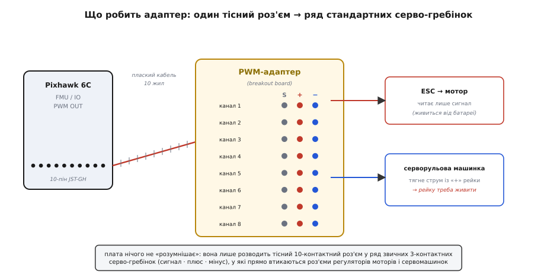
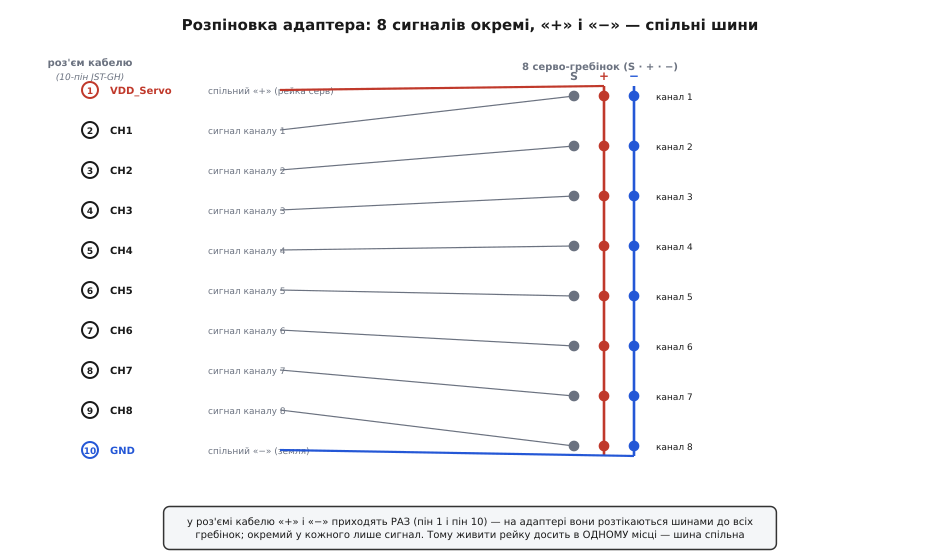
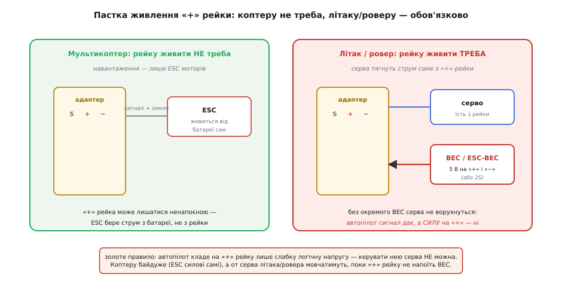

# PWM-адаптер для Pixhawk

<preknowlist>
- [Pixhawk 6C](topic:cat-hw-boards/pixhawk-6c) — автопілот, до якого цей адаптер під'єднують; звідки на ньому беруться виходи FMU PWM OUT та I/O PWM OUT.
- [PWM-протокол сервомашинки](topic:com-devices/pwm-servo-protocol) — керування шириною імпульсу 1–2 мс; що саме за сигнал біжить кожним каналом адаптера.
- [ESC-регулятор](topic:hw-motion/esc) — читає PWM як «скільки газу» й крутить мотор; чому йому досить самого сигналу, а живлення він бере окремо.
- [Живлення від BEC](topic:hw-power/companion-power-thermal/comp-bec.md) — маленький перетворювач, що робить із напруги батареї стабільні 5 В; ним доводиться живити рейку серв.
</preknowlist>

Візьміть у руки крихітну плату — сантиметрів п'ять завдовжки, з одним чи двома вузькими білими роз'ємами на одному боці й довгим рядом триконтактних штирьових гребінок на іншому. Це **PWM-адаптер для Pixhawk** — непоказна, найдешевша деталь у всій збірці дрона, яку легко списати з рахунку. І все ж без неї автопілот [Pixhawk 6C](topic:cat-hw-boards/pixhawk-6c) не крутне жодного мотора: його виходи на мотори й серва сховані в тісному роз'ємі, у який ані регулятор, ані сервомашинка **прямо не втикаються**. Адаптер — це перекладач роз'ємів: він бере один щільний багатожильний роз'єм автопілота й розкладає його на ряд звичних гребінок, у які входять роз'єми ESC і серв так само, як у будь-якому радіокерованому апараті.

Назва «адаптер» тут буквальна (лат. *adaptare* — прилаштовувати): плата нічого не обчислює й не перетворює сигнал, вона лише **прилаштовує один тип роз'єму до іншого**. У документації її ще звуть **breakout board** (англ. *break out* — «вивести назовні»): розводить приховані контакти назовні у зручну форму. Обидві назви — про одне: місток між роз'ємом автопілота й світом стандартних серво-роз'ємів.

> 🔧 **Навіщо це.** Стандартний Pixhawk 6C свідомо зроблено **без вбудованих серво-гребінок** — заради компактності всі 16 виходів виведено у два маленькі роз'єми. Це заощаджує місце на платі, але означає, що між автопілотом і моторами **обов'язково** стоїть щось, що ці роз'єми розкриє. Саме тому адаптер кладуть у коробку разом із платою: без нього 6C фізично нема куди під'єднати навантаження. У молодшої моделі 6C Mini гребінки навпаки **напаяно прямо на плату** — там адаптер не потрібен, і це головна видима різниця між двома платами.

## Навіщо взагалі потрібен перехідник

Питання природне: чому не зробити на автопілоті одразу нормальні гребінки, як на дешевих польотних контролерах? Причина — у стандарті роз'ємів усього сімейства. Pixhawk будують за спільним [стандартом роз'ємів](topic:cat-hw-boards/pixhawk-6c), де всі порти — це маленькі роз'єми JST-GH із кроком контактів 1.25 мм. Вони крихітні, з «ключем» проти неправильного вставляння, і чудові для GPS, телеметрії, давачів — усього, що з'єднують раз і надовго тонким кабелем. Але серво-роз'єми в радіокеруванні історично інші: це грубші гребінки з кроком 2.54 мм — удвічі ширший крок, товщі штирі, розраховані на струм сервоприводів і на те, що їх смикають руками в полі.

Ці два світи не стикуються напряму: роз'єм ESC не налазить на JST-GH, а робити на автопілоті великі гребінки під кожен із 16 каналів — це рядок завдовжки з половину плати. Тому виходи стиснули в компактний формат, а розкриття у «великий» формат винесли в окрему дешеву деталь. Логіка тут та сама, що з перехідником розетки в подорожі: прилад не переробляють під кожну країну — возять маленький адаптер.

Є й практичний бонус такого поділу. Гребінки в польоті іноді ламаються — штир гнеться, паяння тріскається від вібрації. Якби вони були напаяні на автопілот, поломка означала б ремонт дорогої плати. А так страждає **дешевий адаптер**, який просто міняють на новий, лишивши автопілот цілим.

## Що це фізично: один роз'єм у ряд гребінок

Розберімо, що саме адаптер робить, на найпростішому рівні. З боку автопілота на нього приходить **плаский кабель** — стрічка з десяти жил, обтиснута в роз'єм JST-GH. Ці десять жил несуть **вісім каналів керування** плюс дві спільні лінії: «плюс» і «мінус». Плата-адаптер розводить цей пучок у **вісім триконтактних гребінок**, кожна з яких повторює звичний для радіокерування порядок: **сигнал · плюс · мінус** (англ. *signal, power, ground*; часто підписані S, +, −). У таку гребінку роз'єм ESC чи серва входить прямо, без перепайки.


*Ліворуч — автопілот, у якого виходи на мотори сховані в десятиконтактному роз'ємі JST-GH. Плаский кабель веде цей пучок на адаптер, а той розкладає його у вісім гребінок «сигнал · плюс · мінус». Праворуч — споживачі: регулятор мотора (ESC) читає лише сигнальну жилу, а живлення бере від батареї; сервомашинка ж тягне струм саме зі спільної «плюсової» рейки адаптера.*

Ключова тонкість — у тому, як розкладено ці десять жил. Вісім сигнальних ліній **окремі**: кожен канал іде своїм проводом, бо кожен несе свою команду — цьому моторові стільки газу, тому серву такий кут. А от «плюс» і «мінус» у роз'ємі приходять **по одному разу** (перший і останній контакт), і на адаптері вони **розтікаються спільними шинами** до всіх восьми гребінок. Це не дрібниця, а те, від чого залежить, як плату живити: якщо всі гребінки ділять одну «плюсову» рейку, то **напоїти її досить в одному місці** — струм розійдеться по спільній шині до решти.


*Ліворуч — десять контактів роз'єму кабелю: контакт 1 — спільний «плюс» рейки серв (VDD_Servo), контакти 2–9 — вісім окремих сигналів каналів, контакт 10 — спільний «мінус» (земля). Праворуч кожен сигнал іде до свого штиря «S» окремою лінією, тоді як «плюс» і «мінус» ідуть суцільними шинами вздовж усього ряду гребінок. Тому живлення рейки в одній точці добігає до всіх каналів.*

## Виходи автопілота: два роз'єми, два процесори

Тепер про те, до чого адаптер під'єднують з боку Pixhawk. У 6C виходів на навантаження **шістнадцять**, і вони поділені на два роз'єми, бо їх формують [два різні процесори автопілота](topic:cat-hw-boards/pixhawk-6c). Роз'єм **I/O PWM OUT** (у прошивці — головні виходи, MAIN) віддає вісім каналів простого процесора вводу-виводу; роз'єм **FMU PWM OUT** (допоміжні виходи, AUX) — вісім каналів головного процесора. Кожен роз'єм — це рівно десять контактів JST-GH, і кожен потребує **свого адаптера** (тому в коробці їх часто два, або один адаптер на дві групи).

Розпіновка кожного роз'єму однакова й варта того, щоб її запам'ятати, бо на ній тримається все живлення:

```
контакт  1  →  VDD_Servo   (спільний «+» — рейка серв)
контакт  2  →  CH1         (сигнал каналу 1)
контакт  3  →  CH2         (сигнал каналу 2)
   …            …
контакт  9  →  CH8         (сигнал каналу 8)
контакт 10  →  GND         (спільний «−» — земля)
```

Найважливіше в цій таблиці — що криється за назвою першого контакту, **VDD_Servo**. Це не вихід живлення від автопілота, як можна подумати. Це **вхід** спільної рейки: контакт, куди живлення для серв треба **подати ззовні**. Сам автопілот на нього силу **не кладе**. Ось тут і живе головна пастка всієї цієї деталі.

## Головна пастка: «плюсову» рейку автопілот не живить

Розберімо це повільно, бо на цьому спотикаються майже всі новачки, і помилка тиха: усе під'єднано, автопілот живий, а апарат не рухається.

Коли автопілот дає команду на канал, він формує на **сигнальному** штирі [імпульс потрібної ширини](topic:com-devices/pwm-servo-protocol) — 1 мілісекунда «мало», 2 мілісекунди «багато». Це слабкий логічний сигнал, лічені міліампери. А от **силу** — той струм, яким реально працює навантаження, — автопілот на «плюсову» рейку **не подає взагалі**. VDD_Servo лишається знеструмленим, поки ви самі його не напоїте.

Чому так зроблено? Тому що потужне навантаження й тонка електроніка автопілота **мусять бути розв'язані**. Сервоприводи — прожерливі й брудні споживачі: у момент ривка серво просаджує напругу й вкидає в лінію перешкоди. Якби «плюсова» рейка серв живилася з тієї самої 5-вольтової лінії, що й процесори автопілота, то кожен ривок керма трусив би мозок польотного контролера — аж до перезавантаження в повітрі. Тому силову рейку навантаження **навмисно відрізали** від живлення логіки: автопілот дає лише команду, а звідки взяти силу — вирішуєте ви, і бажано з окремого джерела.

А тепер — головне, чому наслідок цього різний для різних апаратів:


*Ліворуч — мультикоптер: єдине навантаження на виходах — регулятори моторів, а вони читають лише сигнальну жилу й живляться прямо від польотної батареї. «Плюсова» рейка адаптера може лишатися ненапоєною — ESC бере струм не з неї. Праворуч — літак чи ровер із сервомашинками: серво тягне робочий струм саме зі спільної «плюсової» рейки, тож її обов'язково живить окремий перетворювач BEC (чи BEC усередині ESC, чи 2-баночна батарея). Без цього автопілот сигнал дає, а серва мовчать.*

**Мультикоптер.** На квадрокоптері до виходів під'єднані самі [регулятори моторів (ESC)](topic:hw-motion/esc). Регулятор — розумний споживач: він читає **лише сигнальну жилу**, а величезний струм мотора бере окремими товстими проводами прямо від батареї. Із трьох контактів гребінки йому потрібні тільки сигнал і земля-опора; «плюсова» жила йому байдужа. Тому на чистому мультикоптері «плюсову» рейку можна взагалі **не живити** — і все працює. Саме тому багато хто збирає перший коптер, ніколи не задумавшись про цю рейку, і в нього все летить.

**Літак або ровер.** А от щойно на виходи стають **сервомашинки** — керма літака, поворот коліс ровера, заслінка, — картина міняється докорінно. Серво не має власного живлення: воно бере робочий струм **саме з «плюсової» рейки** через ту саму гребінку. Якщо рейка не напоєна, серво отримує команду-сигнал, але не має чим її виконати — і **не ворухнеться**. Автопілот справний, сигнал іде, а керма стоять колом. Ось де та тиха, найдорожча помилка.

> 🔧 **Навіщо це.** Правило, яке рятує від годин пошуку неіснуючої «поломки»: **автопілот кладе на «плюсову» рейку лише слабку логічну напругу — керувати нею серва не можна.** На коптері це не заважає (ESC силові самі), а на будь-чому із сервами треба окремо **напоїти рейку**. Живлять її від [BEC](topic:hw-power/companion-power-thermal/comp-bec.md) — маленького перетворювача, що робить із напруги батареї стабільні 5 вольтів. BEC часто вбудований у сам ESC (тоді досить лишити «плюсову» жилу в роз'ємі того ESC під'єднаною), або ставлять окремий BEC, або живлять рейку від невеликої 2-баночної батареї. Головне — джерело для серв має бути **своє**, а не спільне з живленням автопілота.

Ще одна тонкість про цю рейку — **скільки вольтів на неї можна подавати**. Робочий діапазон рейки серв на Pixhawk — приблизно 4.1–5.7 вольта в нормі; звичайні аналогові серва живляться від 5–6 В, тож 5-вольтовий BEC — типовий вибір. Плата терпить на рейці й вищі напруги (деякі серва хочуть до ~10 В), але тут є пастка навпаки: цією рейкою **не можна живити сам автопілот**. Подавати вище ~5.7 В без спеціальних застережень не можна — це шлях спалити електроніку. Тобто рейка серв — це вхід **для серв**, а не запасний спосіб нагодувати польотний контролер.

## Як цим користуватися в коді

Сам адаптер програмувати нема чого — це пасивна плата без жодного чипа. Але «як користуватися ним у коді» — питання не порожнє: воно про те, **як автопілот керує тими виходами, що адаптер розкриває**. Тут є що знати, бо канали не працюють «самі»: треба сказати прошивці, який фізичний вихід за що відповідає (цей — мотор 1, той — кермо висоти), у яких межах ширини імпульсу він ходить (1000–2000 мкс — типово, але серва й ESC бувають вибагливі), і як його безпечно ввімкнути. Керувати виходами можна й із власної програми по протоколу MAVLink — примусово задати ширину імпульсу на конкретному каналі, обійшовши штатне змішування. Це корисно для наземних перевірок і нестандартних механізмів, але й небезпечно, якщо переплутати канал. Практику — прив'язку каналів у PX4 та ArduPilot, безпечні межі PWM, приклад примусового керування каналом по MAVLink на C++ і типові пастки — зібрано у [налаштуванні й керуванні PWM-виходами](topic:cat-hw-boards/pixhawk-pwm-adapter/api-pwm-config.md).

Один короткий приклад, щоб відчути суть — примусово вигнати серво на конкретному каналі в нейтраль (1500 мкс) по MAVLink, як роблять під час перевірки керма на столі:

:::tabs
```c
// Примусово задати ширину імпульсу на каналі серворульової машинки.
// УВАГА: команда обходить штатне змішування — на реальному апараті з
// увімкненими моторами так робити НЕ можна. Лише перевірка на столі.
mavlink_message_t msg;
uint8_t buf[MAVLINK_MAX_PACKET_LEN];

const uint8_t  servo_channel = 5;      // фізичний вихід (гребінка) № 5
const uint16_t pulse_us      = 1500;   // 1500 мкс = нейтраль серва

mavlink_msg_command_long_pack(
    255, 0,                            // хто шле: id наземної станції
    &msg,
    1, 1,                              // кому: система 1, автопілот
    MAV_CMD_DO_SET_SERVO,              // команда «задати вихід серва»
    0,                                 // не повтор
    servo_channel,                     // param1: номер каналу
    pulse_us,                          // param2: ширина імпульсу, мкс
    0, 0, 0, 0, 0);                    // решта параметрів не потрібні

int len = mavlink_msg_to_send_buffer(buf, &msg);
serial_write(buf, len);               // відправити в порт телеметрії
```
```py
# Примусово задати ширину імпульсу на каналі серворульової машинки.
# УВАГА: команда обходить штатне змішування — на реальному апараті з
# увімкненими моторами так робити НЕ можна. Лише перевірка на столі.
from pymavlink import mavutil

servo_channel = 5      # фізичний вихід (гребінка) № 5
pulse_us      = 1500   # 1500 мкс = нейтраль серва

# master — уже відкрите з'єднання (mavutil.mavlink_connection),
# у нього наша наземна станція має sysid 255, а target_system=1 — автопілот
master.mav.command_long_send(
    1, 1,                                       # кому: система 1, автопілот
    mavutil.mavlink.MAV_CMD_DO_SET_SERVO,       # команда «задати вихід серва»
    0,                                          # не повтор
    servo_channel,                              # param1: номер каналу
    pulse_us,                                   # param2: ширина імпульсу, мкс
    0, 0, 0, 0, 0)                              # решта параметрів не потрібні
```
:::

Тут видно головну ідею: у команді є **номер каналу** (яку гребінку смикнути) і **ширина імпульсу** (яку команду на неї покласти). Автопілот сформує на сигнальному штирі цього каналу імпульс 1500 мкс, серво піде в нейтраль — але тільки якщо «плюсову» рейку живлено, інакше команда піде «в нікуди».

## Як під'єднати без помилок

Зберемо докупи те, чого варто стерегтися саме з цією платою — не абстрактно, а по кроках складання:

**Не переплутайте роз'єми I/O та FMU.** Обидва — десятиконтактні JST-GH, зовні однакові, але це **різні групи виходів** від різних процесорів. У типовому квадрокоптері мотори чіпляють на групу I/O (головні виходи, MAIN), а FMU (допоміжні, AUX) лишають під серва підвісу камери чи інше. Якщо переплутати, апарат не полетить так, як налаштовано, бо номери каналів «поїдуть». Дивіться на підпис роз'єму на платі автопілота.

**Стежте за «ключем» кабелю.** Роз'єм JST-GH має захист від перевороту, але дешеві кабелі бувають обтиснуті недбало. Перший контакт (VDD_Servo, «плюс») зазвичай позначено кольором жили (червона) чи крапкою — звіряйте, щоб «плюс» кабелю ліг на «плюс» адаптера, а не навпаки.

**Земля має бути спільна.** Навіть на коптері, де «плюсову» рейку не живлять, **земляна жила має лишатися під'єднаною**: вона — опора для сигналу. Без спільної землі між автопілотом і ESC імпульс «немає відносно чого» міряти, і регулятор читає сміття. Тому землю (контакт 10) не викидайте ніколи.

**Рейку серв живіть окремим джерелом.** Повторимо, бо це найважче: для серв напоїть «плюсову» рейку від BEC чи ESC-BEC, і **не намагайтеся** живити нею автопілот. Тримайте живлення логіки (через модуль живлення в порт POWER) і живлення серв (BEC на рейку) **роздільними** — так, як їх і задумали розв'язати.

**Не перевищуйте струм гребінок.** Гребінки й доріжки адаптера тонкі; тягнути крізь одну рейку струм кількох потужних серв одразу — ризик перегріти доріжку. Якщо серв багато й сильні, живіть рейку товстим проводом ближче до середини ряду, щоб струм не йшов увесь через один край.

## Різновиди й підсумок

Плати-адаптери під Pixhawk бувають кількох форм. Найпростіший — **гола гребінкова плата** з коробки 6C: рядок штирів і роз'єм під кабель, більше нічого. Складніший варіант поєднує в собі кілька функцій: наприклад, **плата розподілу живлення** (power distribution board) типу Holybro PM07 одночасно роздає живлення на моторні ESC, міряє струм і напругу батареї для автопілота **і** несе на собі ті самі PWM-гребінки — тобто виконує роль адаптера як частину ширшої плати. Але й на такій платі діє те саме правило: «плюсову» рейку серв вона сама не живить, для планера чи ровера її треба напоїти окремо. Тобто хоч би яку форму мав адаптер, суть незмінна — він **лише розводить сигнали**, а силу на серва дає хтось інший.

Підсумок простий. PWM-адаптер для Pixhawk — найдешевша й найнепомітніша деталь збірки, і саме тому найкоротший шлях до тихої, дратівливої помилки. Запам'ятати про нього треба дві речі, і обидві — про роз'єми та живлення. Перша: він **пасивний перекладач** — розкриває тісний десятиконтактний роз'єм автопілота в ряд звичних серво-гребінок «сигнал · плюс · мінус», і більше нічого не робить. Друга, важливіша: автопілот кладе на «плюсову» рейку **лише слабкий сигнал, а не силу**, тож для мультикоптера рейку живити не треба (регулятори моторів силові самі), а для літака чи ровера її **обов'язково** живить окремий BEC — інакше серва отримують команду, але не мають чим її виконати. Хто тримає в голові ці дві речі, той не витратить вечір на пошук «поломки» там, де просто не напоєно рейку.
