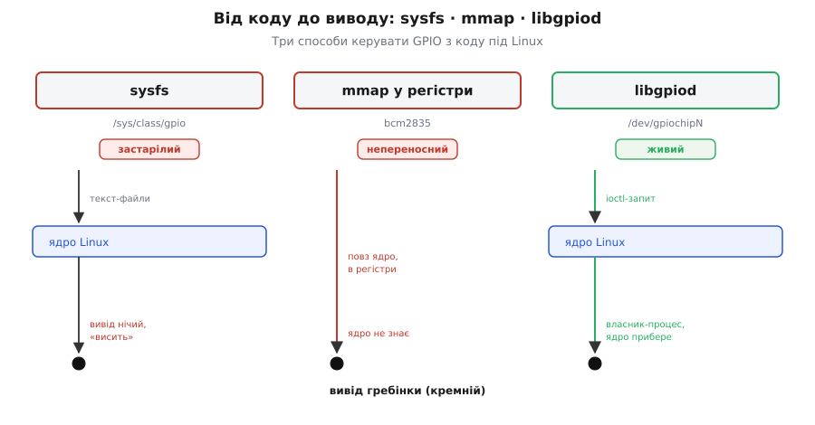
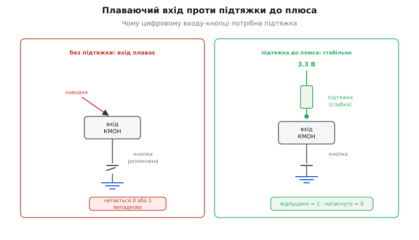

# ⚙️ Керування 40-pin GPIO з коду: libgpiod, C/C++, блимаємо й читаємо кнопку

Плата вантажить Linux, а керувати нею залізом хочеться так само прямо, як мікроконтролером: «постав одиницю на цьому виводі», «прочитай, натиснута кнопка чи ні». Але тут між вашим кодом і кремнієм стоїть **операційна система**, і саме вона диктує, як до того виводу дотягтися. Через це в світі Raspberry Pi накопичилося аж три різні способи керувати GPIO, з яких сьогодні правильний — лише один, а два старіші живуть по інтернету в мільйоні прикладів і збивають початківця з пантелику. Розберімо задачу до дна: чому старі шляхи мертві, як влаштований живий, і напишімо робочий код, що блимає світлодіодом і читає кнопку — так, щоб він скомпілювався й пішов на будь-якій сучасній Raspberry Pi OS без правок і без магії.

## Задача й три способи до неї підступитися

Задача мінімальна й показова: **запалити світлодіод на одному виводі гребінки й прочитати кнопку на іншому** — класичне «Hello, world» заліза. На мікроконтролері це два рядки: `pinMode` + `digitalWrite`. На Pi під Linux тих двох рядків немає, бо код у просторі користувача (англ. *userspace*) не має права сам собі писати в регістри процесора — між ним і залізом стоїть ядро. Тож усе питання в тому, **через який інтерфейс ядра** ви попросите його смикнути вивід. Історично таких інтерфейсів три, і їх треба розрізняти, бо вибір неправильного отруює весь проєкт.

**Спосіб перший, мертвий: sysfs (`/sys/class/gpio`).** Найстаріший і найпростіший на вигляд: ядро виставляло виводи як **файли** у псевдо-файловій системі. Щоб керувати виводом, ви писали числа в текстові файли:

```sh
echo 17 > /sys/class/gpio/export          # «віддай мені вивід 17»
echo out > /sys/class/gpio/gpio17/direction   # зробити виходом
echo 1  > /sys/class/gpio/gpio17/value     # запалити
```

Спокусливо просто — і саме тому цим забиті старі підручники. Але цей інтерфейс **офіційно застарілий**: у ядрі Linux його позначили «deprecated» ще з версії **4.8** (2016 рік), перевели документацію в теку `obsolete` й планували викинути після 2020-го (усталений факт — це записано в самому дереві ядра, ABI переїхав у `Documentation/ABI/obsolete/sysfs-gpio`). Він і досі часто присутній, але писати нове на ньому — будувати на тому, що поховане. Чому його ховають — стане ясно за хвилину, коли побачимо, що він зроблено принципово криво.

> 🔧 **Навіщо це.** Якщо гуглите «raspberry pi gpio C» і бачите `echo … > /sys/class/gpio/…` або `open("/sys/class/gpio/export")` — ви дивитесь на **мертвий приклад**. Він може навіть запрацювати сьогодні, але це технічний борг з першого рядка: на новішому ядрі теки може вже не бути, а кривизна інтерфейсу (нижче) підкладе вам свиню в будь-якому серйознішому за блимання проєкті. Розпізнати цей спосіб і **не брати його** — половина справи.

**Спосіб другий, теж хибний: пряма робота з регістрами (mmap).** Протилежна крайність. Замість просити ядро — обійти його: відкрити `/dev/mem` (або `/dev/gpiomem`), відобразити (англ. *memory-map*, `mmap`) фізичні регістри контролера GPIO прямо у свій адресний простір і **писати в них бітами**, точнісінько як на голому мікроконтролері. Саме так працює знаменита бібліотека **bcm2835** і чимало «швидких» прикладів. І воно справді найшвидше — жодного посередника, запис у регістр за наносекунди.

Ціна цієї швидкості — прив'язка до конкретного заліза й повна відсутність порядку. Ви **хардкодите фізичні адреси регістрів** саме цього чипа: для BCM2835 (Pi 1) одні, для BCM2711 (Pi 4) — інші, для RP1 (Pi 5) регістрів у тому вигляді взагалі немає. Код, написаний під один чип, **мовчки псує пам'ять** на іншому, бо пише не туди. Ба гірше — ядро **не знає**, що ви крутите ті виводи: два процеси залізуть в один регістр і поб'ються, драйвер шини I²C і ваш `mmap` посваряться за той самий вивід, і ніхто нікого не спинить. Це доступ в обхід усіх запобіжників операційної системи.

> 🔧 **Навіщо це.** Пряма робота з регістрами виправдана рівно в одному випадку: коли вам **край потрібна швидкість** — смикати вивід мегагерцами, бітбенгом (англ. *bit-banging*) вигнати протокол, на який не вистачає апаратної периферії. Тоді, свідомо, ціною переносності. Для **99% задач** — блимнути, прочитати, поговорити по шині — це передчасна оптимізація, що ламає переносність і безпеку заради швидкості, якої задача не просить. Raspberry Pi офіційно **не радить** цей шлях для звичайного коду саме тому.

**Спосіб третій, правильний: символьний пристрій GPIO і бібліотека libgpiod.** Золота середина, і єдиний, на якому варто писати нове. Ядро виставляє кожен контролер GPIO як **символьний пристрій** (англ. *character device*) — файл `/dev/gpiochipN` (нумеровані з нуля). Керуєте виводами не через текстові файли й не через сирі регістри, а через **`ioctl`-виклики** до цього пристрою — впорядкований двійковий інтерфейс, що прийшов у ядро в версіях 4.6–4.8 саме на заміну sysfs. Писати сирі `ioctl` руками болісно, тож поверх них є офіційна бібліотека **libgpiod** (від *GPIO device*) з людськими викликами на C, а також обгортками на C++, Python та інших мовах. Її ж утилітами командного рядка (`gpioinfo`, `gpioget`, `gpioset`, `gpiomon`) зручно мацати виводи прямо з термінала, не пишучи ані рядка коду.

Чому саме цей спосіб — правильний, найкраще видно, коли зрозуміти, **що криве** в перших двох і як символьний пристрій це лікує.

## Ідея: чому символьний пристрій, а не файли й не регістри

Корінь проблеми sysfs — у тому, що **вивід там не має власника**. Ви «експортували» вивід 17 у спільну для всієї системи теку `/sys/class/gpio/gpio17` — і він тепер стирчить там **глобально**, доступний будь-кому, поки хтось його не «розекспортує». Якщо ваша програма впала, не прибравши за собою, вивід лишається захопленим — «висить» назавжди, і наступний запуск спотикається об «уже експортовано». Немає зв'язку «цей вивід належить цьому процесу»; є лише глобальний смітник імен. Плюс кожна дія — це **окремий** `open`/`write`/`close` текстового файлу: повільно (розбір рядків, перемикання в ядро на кожен байт) і не атомарно — виставити вісім виводів одночасно однією дією не можна, вони перемкнуться по черзі.

Символьний пристрій перевертає модель: ви **запитуєте лінію (line) у володіння** й отримуєте **дескриптор** — свій особистий пульт саме до цих виводів. Ось три властивості, що з цього випливають, і кожна лікує конкретну болячку sysfs:

**Володіння прив'язане до процесу.** Захопивши лінію, ваш процес стає її господарем; ядро запам'ятовує ім'я-мітку (англ. *consumer*), яке ви лишили. Ніхто інший цю лінію вже не візьме — `gpioinfo` покаже «used», і чужий запит відпаде з помилкою. А головне — щойно ваш процес завершився (навіть аварійно, навіть `kill -9`), ядро **само звільняє** лінію. Немає осиротілих «висячих» виводів; немає «уже експортовано» після падіння. Це та сама логіка, що з відкритим файлом: закрився процес — ядро прибрало його дескриптори.

**Конфігурація — цілісна й багата.** Запитуючи лінію, ви одразу задаєте **все** про неї однією дією: напрям (вхід/вихід), початкове значення, підтяжку (pull-up/pull-down), режим виходу (двотактний чи відкритий стік), активний рівень. Не «спершу export, потім окремо direction, потім окремо value» — а один цілісний запит. І кілька ліній можна взяти **разом**, виставити чи прочитати **однією** атомарною дією — важливо, коли вивід має мінятися синхронно.

**Порядок замість номерів.** Символьний пристрій дає шукати контролери й лінії **за іменем**, а не за голим числом, тож код може сам знайти потрібний чип, не покладаючись на те, що він завжди «нульовий» (а це, як побачимо, на Pi не гарантовано).


*Три шляхи від коду до виводу. Ліворуч — sysfs: пишемо в глобальні текстові файли, вивід нічий, після падіння «висить». Посередині — mmap: обходимо ядро й пишемо прямо в регістри чипа, найшвидше, але прив'язано до конкретного кремнію й ядро про це не знає. Праворуч — libgpiod: просимо лінію у ядра через символьний пристрій /dev/gpiochipN, отримуємо особистий дескриптор із власником-процесом; ядро стереже конфлікти й прибирає за нами. Живий — правий; два ліві веде або в застарілість, або в непереносність.*

> 🔧 **Навіщо це.** Практична вигода володіння-за-процесом видно з першої ж помилки новачка. На sysfs типовий сценарій: запустив програму, вона впала на виключенні, вивід лишився за нею — перезапускаєш, а воно «Device or resource busy», і треба руками чистити `/sys`. З libgpiod цього класу проблем **не існує**: упав процес — лінія вільна, запускай знову. Ви позбуваєтеся цілої категорії багів просто вибором правильного інтерфейсу.

Тепер найважливіша пастка, суто про **libgpiod, а не про Pi**: у бібліотеки є **дві несумісні версії API**, і код під одну **не збереться** під іншу.

## Дві версії libgpiod: чому чужий приклад не компілюється

Ви берете приклад з інтернету, ставите `libgpiod`, компілюєте — і сиплються помилки «немає такої функції». Причина майже завжди та сама: **libgpiod пережила злам API між гілками 1.x і 2.x**, і половина прикладів у мережі — під стару, а у вас стоїть нова (або навпаки). Це не тонкість — це перше, об що спотикаються.

У **гілці 1.x** робота була проста й пласка: відкрив чип, узяв **одну лінію** об'єктом, запросив її на вхід чи вихід, читав/писав прямо на цьому об'єкті лінії:

:::tabs
```c
// libgpiod v1.x — СТАРЕ API. Багато прикладів у мережі — саме таке.
struct gpiod_chip *chip = gpiod_chip_open_by_name("gpiochip0");
struct gpiod_line *line = gpiod_chip_get_line(chip, 17);
gpiod_line_request_output(line, "blink", 0);   // запит + напрям одним махом
gpiod_line_set_value(line, 1);                  // писати прямо на лінію
```
```py
# libgpiod v1.x, прив'язка на Python — СТАРЕ API. У мережі його теж повно.
import gpiod

chip = gpiod.Chip("gpiochip0")
line = chip.get_line(17)
line.request(consumer="blink", type=gpiod.LINE_REQ_DIR_OUT)  # запит + напрям
line.set_value(1)                                            # писати прямо на лінію
```
:::

У **гілці 2.x** (сучасна, саме її ставить свіжа Raspberry Pi OS) усе переписали під об'єктну модель: окремо **налаштування лінії** (`line settings`), окремо **конфіг** (яка лінія які налаштування бере), окремо **запит** (`request`), і читаєте/пишете вже не «на лінію», а **на об'єкт-запит** за зсувом. Функцій `gpiod_chip_get_line`, `gpiod_line_request_output`, `gpiod_line_set_value` у 2.x **просто немає** — тому старий приклад і не збирається.

Розрізнити версії легко: `gpiod_chip_open_by_name(...)` і `gpiod_line_request_output(...)` — це **v1**; `gpiod_chip_open("/dev/gpiochip0")` (шлях, не ім'я) разом із `gpiod_line_settings_new()`, `gpiod_line_config_new()`, `gpiod_chip_request_lines(...)` — це **v2**. Версію встановленого пакета показує `gpiodetect --version`.

> 🔧 **Навіщо це.** Не звинувачуйте свій код — звіряйте версію бібліотеки з версією прикладу. Це **найчастіша** причина «в мене не компілюється те, що в статті працює». Оскільки нове ми пишемо під те, що ставить сучасна система, **весь код нижче — під libgpiod v2** (перевірено за офіційними прикладами й заголовком `gpiod.h` бібліотеки). Якщо вам конче треба зібрати старий код, а система дає лише v2 — або перепишіть під v2 (тут є повний зразок), або поставте пакет сумісності зі старою гілкою.

Перш ніж писати код, лишається одне питання, унікальне саме для Raspberry Pi: **який `/dev/gpiochipN` наш?**

## Який чип наш: не хардкодьте нуль

Здавалося б, дрібниця: `/dev/gpiochip0` — і по всьому. Але на Pi це **пастка**, і ось чому. У системі кілька контролерів GPIO: крім головного, що виведений на гребінку, є ще внутрішні (наприклад, для власних потреб плати). Нам потрібен **той, що керує 40 штирками гребінки**, а його номер **не гарантовано** нульовий і **мінявся** між моделями та версіями ядра.

Конкретика (усталено, за офіційними матеріалами Raspberry Pi): на **Pi 4** гребінку тримає контролер із міткою **`pinctrl-bcm2711`**, і сучасні ядра виставляють його як `gpiochip0`. А от на **Pi 5** той самий «гребінковий» контролер зветься вже **`pinctrl-rp1`** (бо виводами там завідує окремий чип RP1), і **старіші** ядра Pi 5 показували його як **`gpiochip4`**, а не нульовий — від чого код із хардкодом `gpiochip0` мовчки бив мимо. У липні 2024-го Raspberry Pi поправила дерево пристроїв Pi 5, щоб гребінка знову лягла на `gpiochip0`, як на старих моделях, — але старі образи ще ходять по світу, і покладатися на номер **ненадійно**.

Правильно — **знайти чип за міткою**, а не за номером. Символьний пристрій це й дозволяє: перебрати всі `/dev/gpiochip*`, спитати в кожного мітку (`gpiod_chip_get_info` → `gpiod_chip_info_get_label`) і взяти той, що зветься `pinctrl-…`. Тоді той самий бінарник поїде і на Pi 4, і на Pi 5, і переживе перенумерацію. З термінала ту саму мітку показує `gpiodetect` (перелік чипів з їхніми мітками) і `gpioinfo` (усі лінії з іменами).

Прояснімо ще й **нумерацію ліній усередині чипа**, бо це джерело плутанини. У libgpiod лінія адресується **зсувом (offset)** усередині свого чипа. На щастя, для головного контролера Pi цей зсув **збігається з номером BCM** — тобто «GPIO17» у звичній розкладці Pi — це offset 17 на `pinctrl-bcm2711`. Тож коли всюди в довідниках Pi пишуть «GPIO17», у коді libgpiod це прямо offset 17. **Але** не плутайте це з номерами **фізичних штирків** гребінки (1…40): фізичний штир 11 — це GPIO17, штир 12 — GPIO18 і так далі; libgpiod оперує **номерами GPIO (BCM)**, а не позиціями на гребінці. Плутанина «штир проти GPIO» — класичне джерело «блимає не той світлодіод».

Тепер маємо все, щоб писати: знаємо правильний спосіб (символьний пристрій), правильну версію (v2), правильний чип (за міткою) і правильну адресацію лінії (offset = номер BCM). Складаймо код.

## Робочий код: блимаємо світлодіодом (libgpiod v2, C)

Почнімо з найпростішого корисного — блимати світлодіодом на **GPIO17** (фізичний штир 11). Схема тривіальна: анод світлодіода через **резистор на 220–330 Ом** до GPIO17, катод — на землю (будь-який GND-штир гребінки); вивід у стані «1» дає 3.3 В, струм крізь резистор запалює діод. Резистор обов'язковий — без нього діод візьме забагато струму й перевантажить вивід (про межі струму — окремо нижче).

Ось повна, компільована програма під **libgpiod v2**. Вона знаходить потрібний чип за міткою, запитує лінію на вихід і блимає в циклі:

:::tabs
```c
// blink.c — блимаємо світлодіодом на GPIO17. libgpiod v2.
// Збірка:  gcc blink.c -o blink -lgpiod
#include <gpiod.h>
#include <stdio.h>
#include <stdlib.h>
#include <unistd.h>     // usleep()
#include <dirent.h>
#include <string.h>

#define LED_OFFSET   17        // GPIO17 = фізичний штир 11 (номер BCM, не штир!)

// Знайти символьний пристрій контролера гребінки за міткою pinctrl-*.
// Повертає відкритий chip або NULL. Так код не залежить від номера gpiochipN.
static struct gpiod_chip *open_header_chip(void) {
    DIR *d = opendir("/dev");
    if (!d) return NULL;
    struct dirent *e;
    struct gpiod_chip *chip = NULL;
    while ((e = readdir(d)) != NULL) {
        if (strncmp(e->d_name, "gpiochip", 8) != 0) continue;
        char path[64];
        snprintf(path, sizeof path, "/dev/%s", e->d_name);
        struct gpiod_chip *c = gpiod_chip_open(path);
        if (!c) continue;
        struct gpiod_chip_info *info = gpiod_chip_get_info(c);
        if (info) {
            const char *label = gpiod_chip_info_get_label(info);
            // Контролер гребінки має мітку pinctrl-* (bcm2711 на Pi4, rp1 на Pi5).
            if (label && strncmp(label, "pinctrl", 7) == 0) {
                gpiod_chip_info_free(info);
                chip = c;
                break;
            }
            gpiod_chip_info_free(info);
        }
        gpiod_chip_close(c);
    }
    closedir(d);
    return chip;
}

int main(void) {
    struct gpiod_chip *chip = open_header_chip();
    if (!chip) {
        fprintf(stderr, "не знайшов контролер гребінки (pinctrl-*)\n");
        return 1;
    }

    // 1. Налаштування лінії: напрям — вихід, початкове значення — 0 (згашено).
    struct gpiod_line_settings *settings = gpiod_line_settings_new();
    gpiod_line_settings_set_direction(settings, GPIOD_LINE_DIRECTION_OUTPUT);
    gpiod_line_settings_set_output_value(settings, GPIOD_LINE_VALUE_INACTIVE);

    // 2. Конфіг: прив'язати ці налаштування до нашого зсуву (offset = 17).
    struct gpiod_line_config *line_cfg = gpiod_line_config_new();
    unsigned int offset = LED_OFFSET;
    gpiod_line_config_add_line_settings(line_cfg, &offset, 1, settings);

    // 3. Запит на володіння: лишаємо мітку-ім'я "blink" (її покаже gpioinfo).
    struct gpiod_request_config *req_cfg = gpiod_request_config_new();
    gpiod_request_config_set_consumer(req_cfg, "blink");

    struct gpiod_line_request *request =
        gpiod_chip_request_lines(chip, req_cfg, line_cfg);
    if (!request) {
        fprintf(stderr, "не вдалося запросити GPIO%d (зайнято?)\n", LED_OFFSET);
        return 1;
    }

    // 4. Блимаємо: 10 разів, по 0.5 с у кожному стані.
    for (int i = 0; i < 10; i++) {
        gpiod_line_request_set_value(request, offset, GPIOD_LINE_VALUE_ACTIVE);
        usleep(500000);   // 500 000 мкс = 0.5 с
        gpiod_line_request_set_value(request, offset, GPIOD_LINE_VALUE_INACTIVE);
        usleep(500000);
    }

    // 5. Прибираємо за собою (ядро зробило б це й само при виході).
    gpiod_line_request_release(request);
    gpiod_request_config_free(req_cfg);
    gpiod_line_config_free(line_cfg);
    gpiod_line_settings_free(settings);
    gpiod_chip_close(chip);
    return 0;
}
```
```py
# blink.py — блимаємо світлодіодом на GPIO17. Прив'язка gpiod v2 на Python.
# Встановити:  sudo apt install python3-libgpiod   (або: pip install gpiod)
import glob
import time
import gpiod
from gpiod.line import Direction, Value

LED_OFFSET = 17        # GPIO17 = фізичний штир 11 (номер BCM, не штир!)


def open_header_chip():
    # Знайти символьний пристрій контролера гребінки за міткою pinctrl-*.
    # Повертає шлях /dev/gpiochipN або None — код не залежить від номера чипа.
    for path in sorted(glob.glob("/dev/gpiochip*")):
        with gpiod.Chip(path) as chip:
            # Контролер гребінки має мітку pinctrl-* (bcm2711 на Pi4, rp1 на Pi5).
            if chip.get_info().label.startswith("pinctrl"):
                return path
    return None


def main():
    path = open_header_chip()
    if path is None:
        print("не знайшов контролер гребінки (pinctrl-*)")
        return 1

    # Запит на володіння: напрям — вихід, старт із нуля (згашено),
    # мітка-ім'я "blink" (її покаже gpioinfo). Одна дія замість набору об'єктів C.
    with gpiod.request_lines(
        path,
        consumer="blink",
        config={
            LED_OFFSET: gpiod.LineSettings(
                direction=Direction.OUTPUT,
                output_value=Value.INACTIVE,
            )
        },
    ) as request:
        # Блимаємо: 10 разів, по 0.5 с у кожному стані.
        for _ in range(10):
            request.set_value(LED_OFFSET, Value.ACTIVE)
            time.sleep(0.5)
            request.set_value(LED_OFFSET, Value.INACTIVE)
            time.sleep(0.5)
    # Вихід із `with` сам звільняє лінію (ядро зробило б це й само при виході).
    return 0


if __name__ == "__main__":
    raise SystemExit(main())
```
:::

Прочитаймо, що тут відбувається, бо саме ця послідовність — весь v2. Спершу `open_header_chip()` перебирає `/dev/gpiochip*`, питає в кожного мітку й бере той, що починається на `pinctrl` — так ми **не хардкодимо номер** і код переносний між моделями. Далі — чотири об'єкти, і кожен має свою роль:

- **`gpiod_line_settings`** — *які* властивості: напрям, значення, підтяжка. Тут «вихід, стартувати з нуля».
- **`gpiod_line_config`** — *яка лінія* бере ці властивості: `add_line_settings` в'яже наш `offset = 17` з налаштуваннями. Сюди можна додати кілька ліній із різними налаштуваннями.
- **`gpiod_request_config`** — метадані запиту, головне тут — **мітка-ім'я** `consumer` («blink»), яку ядро запам'ятає й покаже в `gpioinfo`, щоб було видно, хто зайняв вивід.
- **`gpiod_line_request`** — результат `gpiod_chip_request_lines`: **дескриптор володіння**, ваш пульт. Саме на ньому працює `gpiod_line_request_set_value(request, offset, …)` — писати за зсувом.

Значення задаються не «0/1», а перелічуваними **`GPIOD_LINE_VALUE_ACTIVE` / `GPIOD_LINE_VALUE_INACTIVE`** (активна/неактивна) — це важлива тонкість: «активний» не завжди «високий». Якщо лінію оголосити **активно-низькою** (`active-low`, є таке налаштування), то `ACTIVE` дасть на виводі логічний **нуль**, а не одиницю. Бібліотека мислить у термінах «активно/неактивно» щодо вашої логіки, а фізичний рівень виводить сама. Для звичайного світлодіода анодом до виводу лишаємо типове (активний = високий), і `ACTIVE` = 3.3 В = світиться.

Наприкінці ми чесно звільняємо все у зворотному порядку. Ядро прибрало б лінію й само при завершенні процесу (у цьому вся краса володіння-за-процесом), але явне `release` — гарна звичка, надто в довгих програмах.

> 🔧 **Навіщо це.** Мітка-`consumer` — не косметика. Коли на плату наліплено кілька програм і щось «не бере вивід», рятує `gpioinfo`: він поряд із кожною зайнятою лінією друкує саме цю мітку — і ви миттю бачите, **хто** її тримає («used by blink»), замість гадати. Завжди давайте осмислену мітку — це ваш майбутній діагностичний слід.

Тепер додаймо другу половину задачі — **читання кнопки**, і саме тут криється вся сіль цифрового входу.

## Робочий код: читаємо кнопку з підтяжкою

Кнопка на вигляд простіша за світлодіод — вона ж просто замикає й розмикає. Насправді цифровий вхід має **приховану пастку**, і хто її не знає, отримує «кнопку-привида», що спрацьовує сама.

Уявімо найнаївнішу схему: кнопка одним контактом на GPIO, другим — на землю. Натиснули — вивід сів на землю, читається **нуль**. Відпустили — і вивід **висить у повітрі**, ні до чого не приєднаний. А вхід КМОН-логіки (як у Pi) має **дуже високий вхідний опір** і сам напруги не задає — тож «висячий» вивід ловить наводки з повітря, як антена, і показує то нуль, то одиницю **випадково**. Це стан «плаваючого входу» (англ. *floating input*), і саме він дає примарні натискання.

Ліки — **підтяжка** (англ. *pull resistor*): слабкий резистор, що тягне вивід до певного рівня, коли кнопка розімкнена. Ставимо **підтяжку до плюса** (pull-up): поки кнопку не чіпають, вивід підтягнутий до 3.3 В і читається **одиниця**; натиснули — кнопка перемагає слабку підтяжку й садить вивід на землю, читається **нуль**. Логіка виходить «перевернута»: **відпущено = 1, натиснуто = 0** (активно-низька кнопка) — і це найпоширеніша, найнадійніша схема, бо не треба зовнішнього резистора: підтяжку **вмикає сам чип**, а libgpiod дозволяє попросити її одним рядком.

> 🔧 **Навіщо це.** «Кнопка натискається сама», «показання скачуть» — майже завжди це **плаваючий вхід без підтяжки**. Перш ніж винуватити кнопку чи код, спитайте себе: а чи заданий рівень входу, коли контакт розімкнений? Якщо ні — вхід плаває, і жоден код не дасть стабільного читання. Підтяжка (внутрішня чи зовнішня) — **обов'язкова** для будь-якого входу-кнопки, це не опція.

Ось програма, що читає кнопку на **GPIO27** (фізичний штир 13) із **внутрішньою підтяжкою до плюса** й друкує стан при кожній зміні. Функцію пошуку чипа беремо ту саму (`open_header_chip` з попереднього прикладу):

:::tabs
```c
// button.c — читаємо кнопку на GPIO27 з внутрішньою підтяжкою до плюса.
// Кнопка: один контакт на GPIO27, другий на GND. Натиснуто = 0, відпущено = 1.
// Збірка:  gcc button.c -o button -lgpiod
#include <gpiod.h>
#include <stdio.h>
#include <unistd.h>

#define BTN_OFFSET   27        // GPIO27 = фізичний штир 13

int main(void) {
    struct gpiod_chip *chip = open_header_chip();   // з blink.c
    if (!chip) { fprintf(stderr, "немає контролера гребінки\n"); return 1; }

    // Вхід + внутрішня підтяжка до плюса (PULL_UP).
    struct gpiod_line_settings *settings = gpiod_line_settings_new();
    gpiod_line_settings_set_direction(settings, GPIOD_LINE_DIRECTION_INPUT);
    gpiod_line_settings_set_bias(settings, GPIOD_LINE_BIAS_PULL_UP);

    struct gpiod_line_config *line_cfg = gpiod_line_config_new();
    unsigned int offset = BTN_OFFSET;
    gpiod_line_config_add_line_settings(line_cfg, &offset, 1, settings);

    struct gpiod_request_config *req_cfg = gpiod_request_config_new();
    gpiod_request_config_set_consumer(req_cfg, "button");

    struct gpiod_line_request *request =
        gpiod_chip_request_lines(chip, req_cfg, line_cfg);
    if (!request) { fprintf(stderr, "не вдалося запросити GPIO%d\n", BTN_OFFSET); return 1; }

    // Опитуємо кнопку й друкуємо лише ЗМІНИ стану (щоб не залити термінал).
    enum gpiod_line_value prev = GPIOD_LINE_VALUE_ACTIVE;   // відпущено на старті
    for (;;) {
        enum gpiod_line_value v = gpiod_line_request_get_value(request, offset);
        if (v != prev) {
            // ACTIVE = високий = 3.3 В = відпущено; INACTIVE = 0 = натиснуто.
            printf("%s\n", (v == GPIOD_LINE_VALUE_INACTIVE) ? "натиснуто" : "відпущено");
            prev = v;
        }
        usleep(5000);   // опитувати раз на 5 мс
    }

    gpiod_line_request_release(request);
    gpiod_chip_close(chip);   // (до сюди не дійде — цикл вічний; для повноти)
    return 0;
}
```
```py
# button.py — читаємо кнопку на GPIO27 з внутрішньою підтяжкою до плюса.
# Кнопка: один контакт на GPIO27, другий на GND. Натиснуто = 0, відпущено = 1.
# Прив'язка gpiod v2 на Python.
import time
import gpiod
from gpiod.line import Direction, Bias, Value

from blink import open_header_chip   # ту саму функцію пошуку чипа беремо з blink.py

BTN_OFFSET = 27        # GPIO27 = фізичний штир 13


def main():
    path = open_header_chip()
    if path is None:
        print("немає контролера гребінки")
        return 1

    # Запит: вхід + внутрішня підтяжка до плюса (PULL_UP).
    with gpiod.request_lines(
        path,
        consumer="button",
        config={
            BTN_OFFSET: gpiod.LineSettings(
                direction=Direction.INPUT,
                bias=Bias.PULL_UP,
            )
        },
    ) as request:
        # Опитуємо кнопку й друкуємо лише ЗМІНИ стану (щоб не залити термінал).
        prev = Value.ACTIVE   # відпущено на старті
        while True:
            v = request.get_value(BTN_OFFSET)
            if v != prev:
                # ACTIVE = високий = 3.3 В = відпущено; INACTIVE = 0 = натиснуто.
                print("натиснуто" if v == Value.INACTIVE else "відпущено")
                prev = v
            time.sleep(0.005)   # опитувати раз на 5 мс


if __name__ == "__main__":
    raise SystemExit(main())
```
:::

Ключ тут — рядок `gpiod_line_settings_set_bias(settings, GPIOD_LINE_BIAS_PULL_UP)`. Це і є та сама внутрішня підтяжка, увімкнена **всередині чипа**, без жодного зовнішнього резистора. Значення підтяжки — з переліку `gpiod_line_bias`: `GPIOD_LINE_BIAS_PULL_UP` (до плюса), `GPIOD_LINE_BIAS_PULL_DOWN` (до землі), `GPIOD_LINE_BIAS_DISABLED` (без підтяжки), `GPIOD_LINE_BIAS_AS_IS` (не чіпати, лишити як є). Читаємо `gpiod_line_request_get_value`, що повертає `ACTIVE`/`INACTIVE` — і, оскільки кнопка активно-низька, `INACTIVE` (нуль на виводі) означає **натиснуто**.

Зверніть увагу: код друкує лише **зміни** (`v != prev`), а не стан щоразу — інакше термінал заллє тисячами рядків, поки кнопку тримають. Це вже підводить до наступного — до брязкоту контактів.


*Чому кнопці потрібна підтяжка. Ліворуч: кнопка без підтяжки, розімкнена — вхід ні до чого не приєднаний, «плаває», і високоомний КМОН-вхід ловить із повітря то 0, то 1 (звідси примарні натискання). Праворуч: слабка підтяжка до плюса тримає вхід на 3.3 В, поки кнопку не чіпають (читається 1); натиснули — кнопка садить вхід на землю (читається 0), бо її пряме з'єднання із землею дужче за слабку підтяжку. Схема активно-низька: відпущено = 1, натиснуто = 0.*

Обидві половини — блимання й читання — це кістяк будь-якого GPIO-проєкту. Об'єднати їх (кнопка гасить/запалює світлодіод) — це просто взяти **обидві** лінії в один запит: додати в `gpiod_line_config` два `add_line_settings` (одну на вихід-LED, одну на вхід-кнопку) і працювати одним `request`. Цілісний запит кількох ліній — рівно та перевага символьного пристрою, якої не давав sysfs.

Тепер — де воно все спотикається об реальність, бо саме пастки відрізняють код, що «блимнув на столі», від коду, що працює.

## Складність і пастки

Задача проста лише на позір. Ось місця, де вона кусає — від електрики, що псує залізо, до самої природи Linux, що не дає обіцянок реального часу.

**Рівні строго 3.3 В — 5 В убиває вивід.** Найдорожча пастка. Виводи гребінки працюють на **3.3 вольта** й **не терплять 5 В** — вони не п'ятивольтостійкі. Якщо завести на вхід Pi сигнал від 5-вольтового давача чи модуля напряму, ви подаєте 5 В на 3.3-вольтовий вхід і **псуєте вивід**, а то й весь SoC, який коштує як уся плата. Той самий рефлекс, що безкарно проходить на 5-вольтовому [мікроконтролері](root:hw-arch/microcontroller) Arduino, тут — диверсія проти власної машини. Правило залізне: між 5-вольтовим пристроєм і виводом Pi має стояти **перетворювач рівнів** (англ. *level shifter*) або, для входу, дільник напруги. Це — механізм [логічних рівнів як діапазонів](root:hw-digital/logic-levels-as-ranges): «одиниця» для 3.3-вольтового входу лежить у своєму вікні, і 5 В із нього вилітає з запасом, що й палить кремній. Виняток — коли Pi сам господар лінії й **видає** лише 3.3 В на 3.3-вольтову периферію; тоді все чисто.

**Лінія 3.3 В слабка, і сам вивід — не силач.** Два різні обмеження струму, які часто плутають. Перше — **живлення**: піни «3V3» на гребінці дають готові 3.3 В від внутрішнього регулятора плати, але сумарно **кількадесят міліампер** — навісити на них ненажерливий модуль (потужний радіопередавач, стрічку світлодіодів) не вийде, регулятор просяде або захистом вимкнеться. Друге — **вивід GPIO як джерело струму**: один вивід безпечно віддає (source) чи приймає (sink) орієнтовно **до 16 мА** (типовий орієнтир для BCM), а **сумарно по всіх** виводах — близько **50 мА**; перевищення перегріває вихідні транзистори чипа. Тому світлодіод — **обов'язково через резистор** (220–330 Ом дають ~10 мА, у межах), а будь-яке потужніше навантаження (реле, мотор, багато діодів) — через зовнішній ключ: [транзистор чи драйвер](root:hw-motion/relay-driver), який бере струм на себе, а вивід лише **керує** ним слабким сигналом. Вивід Pi — це **сигнал, а не силова лінія**.

> 🔧 **Навіщо це.** Дуже поширене «спалив Pi, вмикаючи реле/мотор прямо з виводу». GPIO не тягне силове навантаження — і не тому, що «слабкий», а тому, що це **керувальний** вивід. Схема-рятівник завжди та сама: вивід → резистор у базу/затвор транзистора → транзистор комутує навантаження від **окремого** живлення, а спільна лише земля. Індуктивне навантаження (реле, мотор) — ще й гасник-діод проти викиду напруги при вимкненні. Один транзистор між виводом і навантаженням рятує плату.

**Права доступу до `/dev/gpiochipN`.** Символьний пристрій — це файл, і на нього діють **права Linux**. Запустите код звичайним користувачем без потрібних прав — `gpiod_chip_open` поверне «Permission denied», і запит не пройде. На Raspberry Pi OS для цього є група **`gpio`**: додайте користувача (`sudo usermod -aG gpio $USER`, тоді перезайдіть) — і доступ з'явиться без `sudo`. Спокуса «просто запускати через `sudo`» працює, але це погана звичка: код заліза не повинен ходити під root заради одного відкриття файлу. Правильно — членство в групі й коректні правила, а не молот `sudo`.

**Немає жорсткого реального часу — це Linux, не мікроконтролер.** Найглибша, концептуальна пастка. На [мікроконтролері](root:hw-arch/microcontroller) ваш код — єдиний господар кремнію: сказали «затримка 10 мкс» — буде рівно 10 мкс. На Pi між вашим кодом і виводом стоїть **операційна система з витісняльним плануванням**: у будь-яку мить ядро може відібрати процесор у вашого циклу й віддати іншому процесу — на мілісекунди, а під навантаженням і довше. Тому `usleep(500000)` — це «**не менш ніж** 0.5 с», а не «рівно»; а спроба вигнати з циклу точний сигнал на кілька мегагерц дасть **тремтіння** (англ. *jitter*) — імпульси гулятимуть завширшки, бо між ними втручається планувальник. Практичні наслідки:

- Блимання, опитування кнопки, повільні протоколи — **байдужі** до джитера, працюють чудово.
- Точні часові речі (біт-бенг швидкого протоколу, генерація рівного ШІМ, читання давача з мікросекундними вікнами на кшталт DHT чи стрічки WS2812) — **ненадійні** з простого userspace-циклу: Linux не гарантує моменту.
- Ліки: віддати часокритичне **апаратній периферії** (апаратний ШІМ, DMA, SPI/I²C-контролери — вони тактуються залізом, не планувальником), або взагалі **другому чипу** — дешевому [мікроконтролеру](root:hw-arch/microcontroller) поряд, який стереже реальний час, поки Pi робить «комп'ютерну» роботу; спілкуються по [I²C](root:com-devices/i2c-bus) чи UART. Здорове правило поділу: **комп'ютерна робота — на Pi, робота реального часу — на мікроконтролері**.

**Брязкіт контактів (дребезг).** Механічна кнопка при натисканні **не замикається чисто** — контакти кілька мілісекунд стукаються, і вхід читає чергу «0-1-0-1-0», перш ніж устаканитись. Наш простий приклад це частково ховає (друкує зміни, опитує раз на 5 мс), але для точного лічення натискань брязкіт дасть **кілька спрацювань замість одного**. Лік — **усунення брязкоту** (англ. *debounce*): прийняти нове значення лише коли воно протрималося стабільним якийсь час (скажімо, 20–50 мс), а не з першого читання. Це та сама інженерія стабільного рішення з шумного входу, що й [гістерезис у двопозиційному керуванні](root:embedded/smart-home-node/proj-hysteresis-control.md) — по суті, фільтр проти дрібного швидкого тремтіння сигналу перед тим, як на нього реагувати.

**Опитування проти подій.** Наш приклад **опитує** кнопку в циклі (`usleep` + читання) — просто, але марно жере процесор і має затримку до періоду опитування. Символьний пристрій уміє краще: **чекати на подію** (англ. *edge event*) — фронт сигналу (натиснення/відпускання) — і будити код лише коли лінія реально змінилася. У libgpiod v2 це `gpiod_line_settings_set_edge_detection(...)` + очікування на дескрипторі запиту; процес **спить**, доки нічого не діється, і прокидається точно на зміні. Для кнопок, лічильників, давачів-переривань це і економніше, і чутливіше за опитування; опитування лишаємо там, де так простіше й процесор не шкода.

**Гребінки не вистачить — I²C, SPI, UART уже на ній.** Часте здивування: «виводів мало». Насправді частина з 40 штирків **зайнята шинами**, і це не втрата, а вихід. На гребінці штатно виведені: [**I²C**](root:com-devices/i2c-bus) (лінії SDA/SCL — два дроти, десятки давачів на одній парі за адресами), [**SPI**](root:com-devices/spi-bus) (MOSI/MISO/SCLK/CE — швидкий обмін із дисплеями, АЦП, пам'яттю) і **UART** (TXD/RXD — послідовний порт, консоль або зв'язок із іншим пристроєм). Коли треба **багато** давачів чи периферії, їх вішають **не на окремі GPIO, а на шину**: одна пара I²C обслуговує хоч десяток модулів, і виводи не закінчуються. Ці лінії теж підіймаються програмно (у libgpiod — як звичайні лінії, коли шина вимкнена; або через драйвери ядра `/dev/i2c-*`, `/dev/spidev*`, коли шина ввімкнена в конфігурації). Тобто «мало ніжок» — майже завжди сигнал, що пора з окремих виводів переходити **на шину**.

Зведімо нитку. Керувати гребінкою Pi з коду треба через **символьний пристрій** `/dev/gpiochipN` і бібліотеку **libgpiod** — а не через мертвий sysfs (`/sys/class/gpio`, застарілий з ядра 4.8) і не через непереносний mmap прямо в регістри (bcm2835). У libgpiod є **дві несумісні версії**: нове пишемо під **v2** (об'єкти `line_settings` → `line_config` → `request`, читання/запис за offset, значення `ACTIVE`/`INACTIVE`). Чип гребінки **шукаємо за міткою** `pinctrl-*`, а не хардкодимо `gpiochip0`, бо номер мінявся між Pi 4 і Pi 5. Вивід — це **сигнал 3.3 В**: 5 В на вхід — смерть кремнію; струм понад ~16 мА на вивід чи ~50 мА сумарно — теж; силове навантаження — тільки через транзистор. Кнопці **обов'язкова підтяжка** (внутрішня `PULL_UP` одним рядком), інакше плаваючий вхід дає привидів; брязкіт контактів гасять затримкою-фільтром; замість опитування краще **чекати на фронт**. І над усім — Linux **не дає жорсткого реального часу**: точні мікросекунди віддавайте апаратній периферії або сусідньому мікроконтролеру, а на Pi лишайте те, у чому він сильний, — «комп'ютерну» частину задачі. Тоді сорок штирків гребінки служать надійно, а не підкидають ані примарних натискань, ані спалених виводів.
