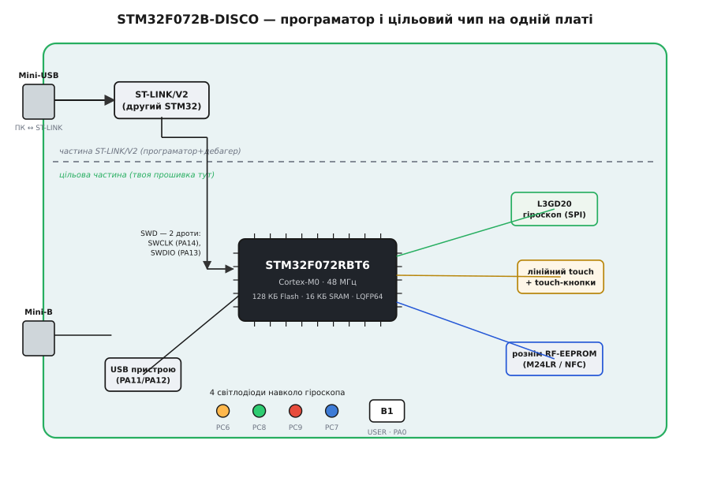
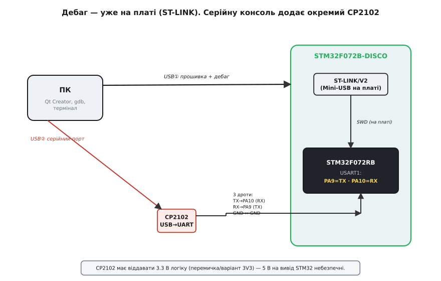

# STM32F072B-DISCO (Discovery, Cortex-M0)

<preknowlist>
- [Мікроконтролер: що всередині](root:hw-arch/mcu-blocks) — процесор, пам'ять і периферія на одному кристалі; чому це «комп'ютер на чипі».
- [STM32-клас](root:hw-arch/stm32) — родина мікроконтролерів ST на ядрі Cortex-M з багатою провідною периферією; спільна архітектура, до якої належить чип цієї плати.
- [Ядро ARM Cortex-M](root:hw-arch/cortex-m) — 32-бітне ліцензоване ядро, що його ST обвішує периферією; Cortex-M0 — його найпростіший, найдешевший варіант.
- [Логічні рівні як діапазони](root:hw-digital/logic-levels-as-ranges) — що таке 3.3 В логіка й чому 5 В на її вивід небезпечні.
- [Асинхронна послідовна лінія (UART)](root:com-devices/async-serial) — як два пристрої обмінюються байтами по двох дротах; на цьому тримається серійна консоль.
</preknowlist>

Невелика прямокутна плата з двома роз'ємами Mini-USB на одному торці, чорним квадратним чипом посередині, чотирма світлодіодами кружком і смужкою мідних майданчиків уздовж краю, до якої тягнеться палець, — це **STM32F072B-DISCO**, оцінна («discovery» — англ. «відкриття», «розвідка») плата від STMicroelectronics. Її призначення — дати помацати мікроконтролер STM32 руками: не в симуляторі, а на живому кристалі, з реальним дебагером, за ціну обіду.

Якщо перший дотик до заліза часто починається з Arduino, де все сховано за дружніми `pinMode` і `digitalWrite`, то ця плата — крок у інший бік: до **голого 32-бітного ARM**, де ти сам вмикаєш тактування, сам чіпляєш дебагер по протоколу SWD, сам збираєш прошивку крос-компілятором. Тут немає завантажувача, що ловить прошивку по USB, і немає готового «монітора порту» — і саме тому на цій платі видно, як усе працює насправді. Розберімо її так, щоб упізнати серед інших Discovery, зрозуміти, з чого вона складається і що робить кожен вузол, правильно під'єднати до неї світ — і не спіткнутися на тому, на чому спотикаються всі, хто перейшов сюди з Arduino.

### Що це таке насправді

Плата ділиться на **дві логічно різні половини**, і зрозуміти цей поділ — половина справи. Одна половина — **цільова**: сам мікроконтролер STM32F072RBT6 зі своєю обв'язкою, той чип, у який лягає твоя прошивка й який керує світлодіодами, гіроскопом, сенсором дотику. Друга половина — **вбудований програматор-дебагер ST-LINK/V2**: це фактично *другий* мікроконтролер на тій самій платі, чия єдина робота — приймати з комп'ютера прошивку й заливати її в цільовий чип, а заодно давати дебаг: ставити точки зупину, читати регістри, крокувати по коду.

> Оцінна плата (evaluation board) — це не кінцевий пристрій, а стенд, щоб виробник показав свій чип «у ділі», а розробник спробував його перед тим, як ставити у власний виріб. Тому на ній зумисне виведено назовні все цікаве — сенсори, роз'єми, тестові майданчики — і додано програматор, щоб узагалі не треба було докуповувати обладнання. ST роздає такі плати дешево свідомо: що більше людей навчиться на STM32, то більше їх поставить ці чипи у свої прилади.

Ключова риса, з якої випливає багато що: **STM32F072 працює на логіці 3.3 вольта**, не п'яти. Одиниця для нього — 3.3 В, і подати на його вивід 5 В означає повільно чи миттєво його псувати. Це протилежність старій 5-вольтовій Arduino UNO, і саме звідси перша пастка для тих, хто звик тицяти 5-вольтові модулі куди завгодно.

І друга наскрізна риса: **чип належить до великої родини STM32**, тож усе про його ядро, периферію й філософію — таймери, DMA, синхронні АЦП — це не про «саме цю плату», а про [STM32-клас](root:hw-arch/stm32) загалом. Тут ми не переказуємо архітектуру родини, а дивимось на конкретну плату: що на ній розпаяно, як воно з'єднане й як цим користуватися.

### Мозок: STM32F072RBT6

Чорний квадрат посередині з ніжками по всіх чотирьох боках — це [мікроконтролер](root:hw-arch/mcu-blocks) **STM32F072RBT6** у корпусі **LQFP64** (Low-profile Quad Flat Package, 64 виводи — по шістнадцять з кожного боку). На відміну від Arduino, де чип сидить у панельці й міняється пінцетом, тут він **припаяний намертво**: спалив — плату на смітник. Тому обережність з рівнями й живленням тут не забаганка, а бережливість.

Розшифруємо саму назву, бо вона стисло описує чип:

```
STM32 F0 72 R B T 6
│     │  │  │ │ │ └ температурний діапазон (6 = −40…+85 °C)
│     │  │  │ │ └── корпус (T = LQFP)
│     │  │  │ └──── розмір Flash (B = 128 КБ)
│     │  │  └────── виводів (R = 64)
│     │  └───────── лінія в межах серії
│     └──────────── серія F0 — найпростіша, на ядрі Cortex-M0
└────────────────── STM32: 32-бітний мікроконтролер ST
```

Всередині — рівно стільки, скільки треба для навчання й для простих реальних задач; числа варто пам'ятати, бо в них упираєшся:

```
Ядро     ARM Cortex-M0, 32-біт     — найпростіше ядро лінійки Cortex-M
Такт     до 48 МГц                 — стеля частоти саме цього чипа
Flash    128 КБ (пам'ять програм)  — сюди лягає прошивка
SRAM     16 КБ (оперативна)        — тут живуть змінні під час роботи
```

**Ядро — [ARM Cortex-M0](root:hw-arch/cortex-m)**, найскромніший і найдешевший член сімейства Cortex-M. У ньому немає ні апаратного ділення, ні операцій з рухомою комою, ні складних інструкцій — тільки базовий набір. Але саме ця простота робить його передбачуваним і дешевим, а 32 біти й лінійна карта пам'яті вже дають величезний крок над 8-бітними AVR: адресуй хоч мегабайти, рахуй 32-бітними числами без вивертів.

Стеля такту — **48 МГц**. Тут ховається дрібна, але корисна деталь: на самій платі **немає кварцового резонатора** для цільового чипа. Звідки ж береться такт? З внутрішнього RC-генератора чипа на 8 МГц (**HSI** — High-Speed Internal), помноженого множником фазового автопідстроювання (PLL) на шість: 8 × 6 = 48 МГц. Тобто плата з коробки тактується сама від себе, без зовнішнього кристала.

> 🔧 **Навіщо це.** Внутрішній RC-генератор зручний (менше деталей, менше грошей), але він не такий точний, як кварц: його частота гуляє з температурою на відсотки. Для блимання світлодіодом чи опитування сенсора байдуже. А от точний UART на високій швидкості чи годинник реального часу від такого такту вже кульгають — там кварц потрібен. STM32F072 має ще й окремий внутрішній генератор на 48 МГц (**HSI48**) з автопідстроюванням від USB-кадрів — саме він дозволяє цьому чипу працювати повноцінним USB-пристроєм **без жодного кварцу**, що для USB рідкість.

### ST-LINK/V2: програматор, якого не треба докуповувати

Тепер про половину плати, що робить її самодостатньою. Голий STM32 сам собою не візьме прошивку з повітря — його треба **запрограмувати**, а це вимагає окремого приладу-програматора, що говорить із чипом по спеціальному дебаг-протоколу. На цій платі такий прилад **уже впаяний** — це **ST-LINK/V2**, і саме тому для старту не треба нічого, крім USB-кабелю.

Працює він так. Ти під'єднуєш **Mini-USB-роз'єм з боку ST-LINK** (той, що ближче до краю з написом ST-LINK) до комп'ютера. Для комп'ютера з'являється пристрій-програматор. Середовище (Qt Creator із плагіном, чи `st-flash`, чи OpenOCD) віддає йому зібрану прошивку, а ST-LINK **заливає її в цільовий чип по двох дротах протоколу SWD** — і ці два дроти вже розведені всередині плати від ST-LINK до STM32, тобі їх чіпати не треба.

**SWD** (Serial Wire Debug — послідовний дротовий дебаг) — це двопровідний дебаг-інтерфейс ARM: одна лінія такту (**SWCLK**, на виводі PA14 чипа), одна двонапрямлена лінія даних (**SWDIO**, на PA13). Дві ниточки замість громіздкого JTAG на десяток ліній — і по них можна не лише залити код, а й **зупинити ядро на будь-якій інструкції, прочитати всі регістри, крокувати рядок за рядком**. Це вже не «залив і молись», як з голим завантажувачем, а справжнє налагодження на живому залізі.

> 🔧 **Навіщо це.** Апаратний дебаг через SWD — головна причина брати STM32-плату для серйозного навчання, а не лишатися на «залив і дивись, чи блимає». Коли прошивка зависає чи поводиться дивно, ти ставиш точку зупину, дивишся точне значення кожної змінної й кожного регістра периферії в мить збою — замість того щоб вгадувати, друкуючи щось у порт. Один цей інструмент економить години здогадів. Як влаштований сам протокол — у [деталях SWD/JTAG](root:sys-ide/swd-jtag-internals/detail).

Тут — **найважливіша пастка саме цієї плати**, і про неї треба знати заздалегідь. **ST-LINK/V2 на STM32F072B-DISCO не має віртуального COM-порту.** Це означає: коли твоя прошивка хоче щось надрукувати в консоль — вивести число з датчика, повідомлення для налагодження — цей текст **нікуди не піде через USB ST-LINK**. Новіші плати ST зі свіжішим ST-LINK/V2-1 уміють підсовувати системі ще й серійний порт (virtual COM port) поверх того самого USB, і `printf` з прошивки видно в терміналі одразу. Ця плата — старіша, її ST-LINK/V2 такого не вміє: він **тільки** програматор і дебагер, і нічого не переганяє з UART чипа в USB.

Наслідок практичний: щоб побачити серійний вивід прошивки, доведеться **докупити окремий USB-UART перехідник** — типово на мікросхемі [CP2102](root:cat-hw-boards/cp2102-usb-uart) — і з'єднати його трьома дротами з виводами UART мікроконтролера. Як саме — нижче, у розділі про підключення. Хто цього не знає, той годину дивується, чому «`printf` не працює», хоча плата ціла й прошивка йде.


*Плата — це два мікроконтролери на одній підкладці. Угорі, за пунктиром, — ST-LINK/V2 зі своїм Mini-USB: він приймає прошивку з ПК і заливає її по двох дротах SWD у цільовий чип. Унизу — STM32F072RBT6 (Cortex-M0, 48 МГц), навколо якого розпаяно гіроскоп L3GD20 по SPI, лінійний touch-сенсор із touch-кнопками, рознім RF-EEPROM для NFC-мітки та власний USB-роз'єм пристрою на PA11/PA12. Чотири світлодіоди (PC6-PC9) стоять кружком навколо гіроскопа, кнопка USER сидить на PA0.*

### Що навколо чипа: сенсори й роз'єми

Плата зумисне обвішана периферією, щоб було що спробувати з коробки. Пройдімося по тому, що розпаяно навколо цільового чипа.

**Гіроскоп L3GD20.** Маленький квадратний давач поряд зі світлодіодами — це [гіроскоп](root:hw-sensing/gyroscope) **L3GD20**, трьохосьовий MEMS-давач кутової швидкості від тієї ж ST. Він міряє, **як швидко плата обертається** навколо трьох осей (не нахил, а саме швидкість повороту, у градусах за секунду; діапазон перемикається — ±250, ±500 або ±2000 °/с). Спілкується він із чипом по шині **[SPI](root:com-devices/spi-bus)** — швидкій синхронній послідовній шині на кількох лініях, — а вибір давача (chip select) висить на виводі **PC0**. Заводський демо-приклад робить із гіроскопа й чотирьох світлодіодів наочну іграшку: нахиляєш плату — біжить вогник у бік нахилу.

> MEMS (Micro-Electro-Mechanical Systems — мікроелектромеханічні системи) — це мікроскопічні механічні структури, витравлені в кремнії поряд з електронікою. У гіроскопі всередині коливається крихітна маса, а поворот плати через силу Коріоліса зміщує її коливання — це зміщення давач і перетворює на число. Ціла механічна лабораторія розміром з макове зерно на одному чипі.

**Лінійний touch-сенсор і touch-кнопки.** Смужка мідних майданчиків і кілька окремих майданчиків уздовж краю — це **ємнісний сенсор дотику**: палець змінює електричну ємність майданчика, і чип це відчуває **без жодної механічної кнопки**. Плата дає на вибір або **лінійну смугу** (проводиш пальцем — читається позиція, як повзунок гучності), або **чотири окремі touch-кнопки**. Працює це через бібліотеку STMTouch і периферійний блок чипа, що заміряє час заряду майданчика; палець збільшує ємність — заряд іде повільніше — блок це ловить.

**Рознім RF-EEPROM.** Окремий гребінець контактів — це **рознім для зовнішньої антенної плати з чипом M24LR**. M24LR — це **пам'ять із двома дверима**: з одного боку звичайна EEPROM по шині I²C для самого мікроконтролера, з іншого — **безконтактний радіоінтерфейс (NFC/RFID)**, через який ту саму пам'ять можна прочитати чи записати смартфоном або зчитувачем, піднісши антену. Сюди штатно чіпляють плату-антену **ANT7-M24LR-A**. Демонстрація проста й ефектна: телефон записує в мітку кілька байтів, а мікроконтролер їх звідти вичитує (чи навпаки) — обмін даними геть без дротів і навіть без живлення на боці мітки.

**USB-роз'єм пристрою.** Другий Mini-USB (з боку, протилежного ST-LINK) веде на **власний USB цільового чипа** — на виводи **PA11 (D−) і PA12 (D+)**. Це не програматор, а справжній USB-периферійний інтерфейс: прошивка може зробити плату USB-пристроєм — вдавати мишку, послідовний порт, накопичувач. І саме тут згадується та особливість чипа: завдяки внутрішньому генератору HSI48 з підстроюванням від USB **цей USB працює без зовнішнього кварцу**, чого більшість мікроконтролерів не вміють.

**Світлодіоди й кнопка.** Чотири світлодіоди різного кольору стоять кружком навколо гіроскопа — щоб наочно показувати напрям нахилу. Їхні кольори й виводи варто знати, бо перше «Hello, world» на цій платі — саме блимання одним із них:

```
LD3  жовтогарячий   PC6
LD4  зелений        PC8
LD5  червоний       PC9
LD6  синій          PC7
```

Кнопка **USER (позначена B1)** сидить на виводі **PA0** — це та кнопка, якою запускають демо й читають натиск у своїх прошивках. Поряд є окрема кнопка **RESET**, що просто перезапускає цільовий чип.

### Тактування 48 МГц: маленький worked-приклад

Щоб відчути, що на цій платі ти сам вмикаєш те, що на Arduino вмикається за тебе, порахуймо той самий такт 48 МГц з внутрішнього генератора. Мікроконтролер після скидання стартує **не на 48 МГц**, а на голому внутрішньому генераторі HSI **8 МГц** — розігнати його до стелі мусить сама прошивка, налаштувавши PLL:

**Умова: з внутрішніх 8 МГц HSI дістати 48 МГц системного такту через PLL.**

```
Джерело PLL:           HSI 8 МГц
Множник PLL:           ×6
Частота на виході:     8 МГц × 6 = 48 МГц   ← стеля цього чипа
Джерело системного такту: перемкнути з HSI на PLL
```

У регістрах чипа це кілька кроків, і кожен має свій сенс — саме тому голий STM32 повчальніший за Arduino, де ця послідовність схована:

```c
// 1. Налаштувати PLL. У F0 джерело від HSI спершу ДІЛИТЬСЯ на 2 (8→4 МГц),
//    тож у регістрі множник = 12: 4 МГц × 12 = 48 МГц (те саме, що 8 МГц ефективно ×6).
RCC->CFGR |= (10 << 18);        // PLLMUL = ×12  (біти CFGR.PLLMUL; код 10 = множник 12)
// 2. Увімкнути PLL і дочекатися, поки він «захопиться» (стане стабільним).
RCC->CR |= RCC_CR_PLLON;
while (!(RCC->CR & RCC_CR_PLLRDY)) { }
// 3. Перемкнути системний такт із HSI на PLL і дочекатися підтвердження.
RCC->CFGR |= RCC_CFGR_SW_PLL;
while ((RCC->CFGR & RCC_CFGR_SWS) != RCC_CFGR_SWS_PLL) { }
// Тепер ядро йде на 48 МГц.
```

Два цикли `while` — не формальність: PLL і перемикання такту **фізично потребують часу**, і поки апаратура не підняла прапорець готовності, рушати далі не можна. Пропустиш очікування — ризикуєш перемкнутися на ще нестабільне джерело й повісити чип. Ось цю «дисципліну очікування прапорців» на Arduino не видно взагалі, а тут вона — основа роботи з будь-якою периферією.

> 🔧 **Навіщо це.** Реально ці регістри рідко чіпають руками — за них це робить згенерований код (STM32CubeMX) або бібліотека HAL. Але **побачити раз, що саме там відбувається**, безцінно: стає ясно, чому мікроконтролер стартує повільніше за очікуване (доки не піднято такт), чому периферія мовчить, якщо забув увімкнути її тактування, і що означають «магічні» рядки ініціалізації у згенерованому проєкті. Хто це бачив, той не боїться заглянути в регістри, коли бібліотека підводить. Регістрова робота з виводами — у [деталях GPIO STM32](root:sf-devices/gpio-registers).

### Тулчейн: як прошивка сюди потрапляє

Оскільки завантажувача по USB тут немає, шлях від коду до чипа інший, ніж на Arduino, — і його варто розуміти, бо на ньому будується вся робота з платою.

Код для цього чипа збирає **крос-компілятор** — компілятор, що працює на твоєму ПК (x86), а машинний код видає **для чужої архітектури**, ARM Cortex-M0. Стандартний безкоштовний набір для цього — **arm-none-eabi-gcc**: та сама GCC, але націлена на «bare-metal» ARM без операційної системи (звідси `none` у назві — немає ОС; `eabi` — угода про бінарний інтерфейс).

> 🔧 **Навіщо це.** Слово «крос» тут — не ускладнення, а необхідність: на самому мікроконтролері компілятора не запустиш (16 КБ пам'яті!), тож збирати доводиться на великому ПК, а націлювати на маленький чип. Через це в наборі окремі `arm-none-eabi-gcc`, `arm-none-eabi-objcopy` (робить із зібраного файлу «сирий» образ прошивки), `arm-none-eabi-gdb` (дебагер, що по SWD говорить із живим чипом). Як цей ланцюг влаштований цілком — у [тулчейні embedded-розробки](root:sys-bsystem/toolchain).

Складання зручно тримати на **CMake** — описовому інструменті збірки, що вміє націлити компіляцію на ARM і потоваришувати з **Qt Creator** як середовищем: підсвітка, навігація по коду, кнопки збирання й — головне — **дебаг по SWD прямо з вікна редактора**, з точками зупину й переглядом змінних. Робочий кістяк такого проєкту — CMake-файл із крос-тулчейном, мінімальний startup-код, налаштування такту й перший блимаючий світлодіод, разом із під'єднанням гіроскопа по SPI — зібрано в [проєкті-довіднику API цієї плати](root:cat-hw-boards/stm32f072b-disco/proj-firmware.md): що куди кладеться, робочий код і типові пастки саме під STM32F072B-DISCO.

### Підключення: дебаг уже є, консоль треба додати

Найважливіше в щоденній роботі — правильно з'єднати плату з комп'ютером. Тут два різні USB-кабелі роблять дві різні речі, і плутати їх — класична втрата часу.

**Кабель ①: у роз'єм ST-LINK.** Це головний кабель — по ньому йде і **прошивка**, і **дебаг**. Під'єднав Mini-USB з боку ST-LINK до ПК — і можеш заливати код та крокувати по ньому. Для більшості роботи цього одного кабелю досить.

**Кабель ②: серійна консоль через окремий CP2102.** А ось коли треба бачити текстовий вивід прошивки (`printf`-налагодження, показ значень датчика), згадується та сама пастка: **ST-LINK/V2 тут не дає віртуального COM-порту**. Тому серійний вивід організують окремо — через зовнішній USB-UART перехідник на [CP2102](root:cat-hw-boards/cp2102-usb-uart), з'єднаний **трьома дротами** з UART-виводами мікроконтролера. Ось як лягають дроти, якщо вести консоль через USART1 (виводи PA9/PA10):

```
CP2102            STM32F072 (USART1)
──────            ──────────────────
TX      ───────►  PA10  (RX чипа)     перехрестя: вихід одного йде на вхід іншого
RX      ◄───────  PA9   (TX чипа)
GND     ───────   GND                 спільна земля — обов'язково
3V3               (живлення НЕ дублювати — плата вже живиться від ST-LINK USB)
```

Правило з'єднання UART завжди одне: **передавач одного йде на приймач іншого** (TX↔RX «навхрест»), а земля має бути **спільною**, інакше рівні сигналу нема від чого відлічувати й лінія читає сміття.


*Кабель ① з боку ST-LINK несе і прошивку, і дебаг: усередині плати ST-LINK уже з'єднаний по SWD із цільовим чипом, тобі це чіпати не треба. Серійна консоль — окремо: кабель ② йде на зовнішній CP2102, а той трьома дротами (TX→PA10, RX→PA9, спільна земля) чіпляється до USART1 мікроконтролера. CP2102 має віддавати 3.3-вольтову логіку — п'ять вольтів на вивід STM32 небезпечні.*

> 🔧 **Навіщо це.** Пильнуй рівень CP2102: багато цих перехідників за замовчуванням дають **5-вольтову** логіку на лінії TX, а вивід STM32 терпить лише 3.3 В. Подаси 5 В на PA10 — псуватимеш чип. Бери перехідник із перемичкою 3V3 (чи варіант, що вже 3.3-вольтовий) і став його в 3.3 В. І не живи плату **вдруге** через CP2102, якщо вона вже під ST-LINK-кабелем: двоє джерел на одну шину живлення — зайвий ризик, вистачить землі й двох сигнальних дротів.

### Живлення й рівні

Живиться плата **найпростіше — від USB**: будь-який із двох Mini-USB-кабелів (частіше з боку ST-LINK) дає їй 5 В, а внутрішній стабілізатор робить з них потрібні чипу 3.3 В. Для навчальних задач більше нічого не треба. За потреби плату можна нагодувати й зовнішніми 5 В через відповідні виводи, але для столу USB вистачає з головою.

На гребінцях виведено робочі напруги **3 В і 5 В** для зовнішніх схем — ними живлять причеплені модулі. Але **сигнальна логіка чипа — 3.3-вольтова**, і це та межа, яку не можна переступати: вивід STM32 видає 0 або 3.3 В і чекає на вході не більше 3.3 В. З'єднуєш плату з чимось 5-вольтовим — постав перетворювач рівнів, інакше псуєш чип. Це дзеркальна пастка до Arduino: там небезпечно було 3.3-вольтовому модулю ловити 5 В від UNO, тут — навпаки, самому STM32 ловити 5 В на вхід.

### Де ця плата серед рідні й коли її брати

STM32F072B-DISCO — один із багатьох представників лінійки **Discovery**: у ST є така плата майже під кожну серію STM32, від крихітних F0 до потужних H7, і всі вони збудовані за однією ідеєю — цільовий чип плюс вбудований ST-LINK плюс якась показова периферія. Різняться вони чипом (а отже потужністю й ціною) і тим, чим обвішані: одна несе гіроскоп, інша — екран, третя — аудіокодек. Ця конкретна — з **найпростішим і найдешевшим ядром Cortex-M0**, гіроскопом, сенсором дотику й NFC-міткою; усе про сам клас чипів — у статті про [STM32-клас](root:hw-arch/stm32).

Коли має сенс брати саме її:

- **Перший крок у «голий» ARM.** Найдешевший спосіб перейти від Arduino-абстракцій до справжньої роботи з 32-бітним мікроконтролером: тактування, регістри, дебаг по SWD — усе руками, але на простому й прощаючому чипі.
- **Заради вбудованого дебагера.** Навіть якщо цільовий чип тобі не цікавий, на платі є повноцінний ST-LINK/V2 — ним можна прошивати й **інші** STM32-плати, вивівши SWD назовні.
- **Спробувати ємнісний дотик і NFC.** Лінійний touch-сенсор і рознім M24LR дають готовий стенд, щоб помацати ємнісні кнопки й безконтактну пам'ять, не паяючи нічого свого.

А не варто чекати від неї бездротового зв'язку (радіо тут немає — це не ESP32) чи великої обчислювальної сили: 48 МГц і 16 КБ SRAM — це рівень «керувати, міряти, блимати», а не «крутити відео».

### Коротко про пастки

Зберемо в одному місці те, на чому губиться найбільше часу саме з цією платою.

**«`printf` не працює», хоча прошивка йде.** Найголовніша пастка: **ST-LINK/V2 тут без віртуального COM-порту**. Серійну консоль дає лише окремий USB-UART перехідник (CP2102), з'єднаний трьома дротами з UART чипа. Це не поломка — це особливість старішого ST-LINK.

**Спалений вивід або чип.** Логіка **3.3-вольтова**: 5 В на будь-який вивід (від CP2102 з невимкненою перемичкою 5 В, від 5-вольтового модуля) псують чип, а він **припаяний** — заміні не підлягає. Перед з'єднанням завжди перевіряй рівень того, що чіпляєш.

**Плата ніби «не стартує» на повній швидкості.** Після скидання чип іде на голих 8 МГц HSI; 48 МГц треба **самому підняти в прошивці** через PLL, з очікуванням прапорців готовності. Забув — усе працює, але вшестеро повільніше, або периферія мовчить, бо не ввімкнено її тактування.

**Не той кабель / не той роз'єм.** Прошивка й дебаг — тільки через Mini-USB **з боку ST-LINK**; другий Mini-USB — це USB *пристрою*, для нього окрема прошивка, і код у чип він не заливає. Ще — банальний «кабель тільки для заряджання» без ліній даних: плата не з'явиться, спробуй інший кабель насамперед.

Ця плата не прощає рівнів так, як прощала Arduino, і не веде за руку завантажувачем — але саме тому на ній видно мікроконтролер **як він є**: сам увімкни такт, сам почепи дебагер, сам заведи периферію. Пройди цей поріг один раз — і будь-який STM32 у власному приладі перестане бути чорною скринькою.
