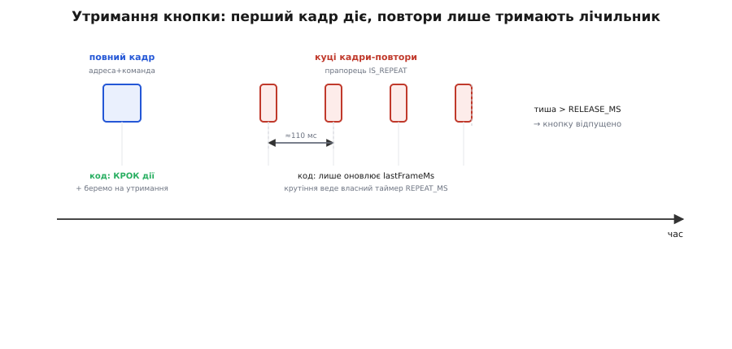

# ⚙️ proj: меню яскравості на кнопках ІЧ-пульта — натиск, утримання, автоповтор

Впіймати код кнопки — це ще не керування. Керування починається тоді, коли пульт робить щось справжнє: короткий натиск перемикає режим, а **утримання** плавно крутить яскравість, поки тримаєш палець. Ось задача, яка відрізняє іграшку «надрукувати код у монітор» від живого пристрою, — і саме на ній новачок спотикається найчастіше. Зберемо тут робоче меню на кнопках звичайного ІЧ-пульта, яке коректно реагує і на короткі натиски, і на утримання.

Від заліза задача просить скрізь те саме: один пін, здатний на переривання, лічильник із мікросекундною роздільністю та жменю стану в пам'яті. Різниця лише в тому, хто розбирає кадр на адресу й команду: на Arduino це робить бібліотека IRremote, на ESP-IDF — периферія RMT з власним розбором NEC, на STM32 — EXTI плюс вільний таймер. Тому кожен приклад нижче йде трьома вкладками, які роблять одне й те саме. Контракт IRremote — виклики `begin`/`decode`/`resume`, поля `decodedIRData`, прапорець повтору, конфлікти таймерів — зібрано в [довіднику API IRremote](topic:cat-hw-connect/ky-022-ir-rx/api-irremote-decode.md); тут ми на ньому будуємо застосунок і не переказуємо його.

## Задача: чого хочемо від меню

На вивід S приймача, заведений на будь-який пін, здатний на переривання (у прикладах це D2 на Arduino, GPIO4 на ESP32, PA2 на STM32), прилітають кадри від пульта. Ми хочемо на кожен **новий** натиск виконати дію — переключити режим, збільшити яскравість, увімкнути реле — і при цьому:

- **розпізнавати кнопку незалежно від пульта**: не «сирі мілісекунди», а осмислені число-адресу пристрою й число-команду кнопки (це дає бібліотека або власний розбір кадру);
- **не плутати утримання з повторним натиском**: коли тримаєш кнопку гучності, пульт шле не «кнопку знову і знову», а куций кадр-повтор; для меню це різниця між «збільшити на один» і «плавно крутити вгору»;
- **не реагувати на чужі пульти**: клацнув хтось поряд пультом від іншого пристрою — меню має це відсіяти;
- **лишатися живим**: після кожного кадру приймальний тракт треба явно звільнити під наступний, інакше він застигне на першому — на Arduino це `resume()`, на ESP-IDF повторний `rmt_receive()`, на STM32 скинутий прапорець готовності.

Будуймо шар за шаром.

## Крок 1: зняти коди кнопок свого пульта

Числа-команди **не вгадують і не переписують з чужого туторіалу** — їх знімають зі **свого** пульта. Заливаєш мінімальний скелет, що друкує протокол/адресу/команду (на Arduino — той із [довідника API](topic:cat-hw-connect/ky-022-ir-rx/api-irremote-decode.md), на ESP-IDF чи STM32 — розбір із наступного кроку з друком у лог), тиснеш по черзі потрібні кнопки й записуєш, який `command` друкується для кожної. Умовно вийде таке (у тебе будуть свої числа):

```
кнопка «1»      → command = 0x45
кнопка «2»      → command = 0x46
кнопка «►/❚❚»    → command = 0x40   (play/pause)
кнопка «+»       → command = 0x15   (гучність вгору)
кнопка «−»       → command = 0x07   (гучність вниз)
```

Заодно занотуй `address` — вона стала для всього пульта й знадобиться, щоб відсіювати чужі кадри.

## Крок 2: switch-меню й фільтр адреси

Маючи таблицю, меню — це просто `switch` по команді. Щоб код не розповзався магічними числами, винесемо коди кнопок в іменовані константи:

:::tabs
```arduino
#include <IRremote.hpp>

const uint8_t IR_PIN = 2;
const uint16_t MY_REMOTE = 0x00;   // адреса ТВОГО пульта (знята скелетом)

// коди кнопок ЦЬОГО пульта
enum Button : uint16_t {
  BTN_1     = 0x45,
  BTN_2     = 0x46,
  BTN_PLAY  = 0x40,
  BTN_UP    = 0x15,
  BTN_DOWN  = 0x07,
};

uint8_t brightness = 128;          // стан, яким керуємо (0..255)

void applyBrightness() {
  analogWrite(9, brightness);      // реальна дія: яскравість LED на піні D9
  Serial.print("яскравість = ");
  Serial.println(brightness);
}

void setup() {
  Serial.begin(115200);
  pinMode(9, OUTPUT);
  IrReceiver.begin(IR_PIN, ENABLE_LED_FEEDBACK);
  applyBrightness();
}

void loop() {
  if (IrReceiver.decode()) {
    // чужий пульт? — ігноруємо, але буфер звільнити ОБОВ'ЯЗКОВО
    if (IrReceiver.decodedIRData.address != MY_REMOTE) {
      IrReceiver.resume();
      return;
    }

    switch (IrReceiver.decodedIRData.command) {
      case BTN_UP:
        if (brightness <= 245) brightness += 10;
        applyBrightness();
        break;
      case BTN_DOWN:
        if (brightness >= 10) brightness -= 10;
        applyBrightness();
        break;
      case BTN_PLAY:
        brightness = (brightness == 0) ? 128 : 0;   // вимк/увімк
        applyBrightness();
        break;
      case BTN_1: Serial.println("режим 1"); break;
      case BTN_2: Serial.println("режим 2"); break;
      default:
        Serial.print("невідома кнопка: 0x");
        Serial.println(IrReceiver.decodedIRData.command, HEX);
        break;
    }
    IrReceiver.resume();
  }
}
```
```esp-idf
// Те саме на ESP-IDF 5.x: кадр ловить периферія RMT, NEC розбираємо самі
#include "driver/rmt_rx.h"
#include "driver/ledc.h"
#include "freertos/FreeRTOS.h"
#include "freertos/queue.h"
#include "esp_log.h"

#define IR_GPIO   GPIO_NUM_4          // будь-який GPIO, придатний під вхід RMT
#define MY_REMOTE 0x00                // адреса ТВОГО пульта (знята скелетом)

// коди кнопок ЦЬОГО пульта
enum { BTN_1 = 0x45, BTN_2 = 0x46, BTN_PLAY = 0x40, BTN_UP = 0x15, BTN_DOWN = 0x07 };

static const char *TAG = "ir-menu";
static uint8_t brightness = 128;      // стан, яким керуємо (0..255)

static void apply_brightness(void) {
    ledc_set_duty(LEDC_LOW_SPEED_MODE, LEDC_CHANNEL_0, brightness);
    ledc_update_duty(LEDC_LOW_SPEED_MODE, LEDC_CHANNEL_0);
    ESP_LOGI(TAG, "яскравість = %u", brightness);
}

static bool near_us(uint32_t d, uint32_t want) { return d + 250 > want && d < want + 250; }

// розбір NEC із таймінгів RMT; на кадрі-повторі поля беремо з попереднього кадру
static bool nec_parse(const rmt_symbol_word_t *s, size_t n,
                      uint16_t *addr, uint16_t *cmd, bool *repeat) {
    static uint16_t last_addr, last_cmd;
    if (n < 2 || !near_us(s[0].duration0, 9000)) return false;       // преамбула 9 мс
    if (near_us(s[0].duration1, 2250)) {                             // куций кадр-повтор
        *addr = last_addr; *cmd = last_cmd; *repeat = true; return true;
    }
    if (!near_us(s[0].duration1, 4500) || n < 33) return false;
    uint32_t bits = 0;
    for (int i = 0; i < 32; i++) bits |= (uint32_t)(s[i + 1].duration1 > 1000) << i;
    *addr = last_addr = bits & 0xFF;          // молодшим бітом уперед: addr, ~addr, cmd, ~cmd
    *cmd  = last_cmd  = (bits >> 16) & 0xFF;
    *repeat = false;
    return true;
}

static bool IRAM_ATTR rx_done(rmt_channel_handle_t ch,
                              const rmt_rx_done_event_data_t *ev, void *q) {
    BaseType_t woken = pdFALSE;
    xQueueSendFromISR((QueueHandle_t)q, ev, &woken);
    return woken == pdTRUE;
}

static QueueHandle_t        q;
static rmt_channel_handle_t rx;
static rmt_symbol_word_t    syms[64];
static rmt_receive_config_t rc = { .signal_range_min_ns = 1250,
                                   .signal_range_max_ns = 12000000 };

void app_main(void) {
    ledc_init_pwm();                          // таймер+канал LEDC_CHANNEL_0 під світлодіод
    q = xQueueCreate(4, sizeof(rmt_rx_done_event_data_t));
    rmt_rx_channel_config_t rx_cfg = {
        .clk_src         = RMT_CLK_SRC_DEFAULT,
        .resolution_hz   = 1000000,           // 1 тік = 1 мкс
        .mem_block_symbols = 64,
        .gpio_num        = IR_GPIO,
    };
    ESP_ERROR_CHECK(rmt_new_rx_channel(&rx_cfg, &rx));
    rmt_rx_event_callbacks_t cbs = { .on_recv_done = rx_done };
    ESP_ERROR_CHECK(rmt_rx_register_event_callbacks(rx, &cbs, q));
    ESP_ERROR_CHECK(rmt_enable(rx));
    apply_brightness();
    ESP_ERROR_CHECK(rmt_receive(rx, syms, sizeof(syms), &rc));   // «озброїли» приймач

    rmt_rx_done_event_data_t ev;
    while (xQueueReceive(q, &ev, portMAX_DELAY) == pdPASS) {
        uint16_t addr = 0, cmd = 0; bool repeat = false;
        // чужий пульт? — ігноруємо, але приймач переозброїти ОБОВ'ЯЗКОВО (нижче)
        if (nec_parse(ev.received_symbols, ev.num_symbols, &addr, &cmd, &repeat)
            && addr == MY_REMOTE) {
            switch (cmd) {
            case BTN_UP:   if (brightness <= 245) brightness += 10; apply_brightness(); break;
            case BTN_DOWN: if (brightness >= 10)  brightness -= 10; apply_brightness(); break;
            case BTN_PLAY: brightness = brightness ? 0 : 128;       apply_brightness(); break;
            case BTN_1: ESP_LOGI(TAG, "режим 1"); break;
            case BTN_2: ESP_LOGI(TAG, "режим 2"); break;
            default:    ESP_LOGW(TAG, "невідома кнопка: 0x%02X", cmd); break;
            }
        }
        rmt_receive(rx, syms, sizeof(syms), &rc);   // ← тут аналог resume()
    }
}
```
```stm32
// Те саме на STM32 HAL: EXTI по спаду + вільний таймер на 1 мкс, NEC розбираємо самі
#include "main.h"
#include <stdio.h>

extern TIM_HandleTypeDef htim2;    // вільний лічильник, 1 тік = 1 мкс
extern TIM_HandleTypeDef htim3;    // ШІМ яскравості, канал 1, період 255

#define IR_PORT   GPIOA
#define IR_PIN    GPIO_PIN_2       // будь-який пін із EXTI, налаштований по спаду
#define MY_REMOTE 0x00             // адреса ТВОГО пульта (знята скелетом)

// коди кнопок ЦЬОГО пульта
enum { BTN_1 = 0x45, BTN_2 = 0x46, BTN_PLAY = 0x40, BTN_UP = 0x15, BTN_DOWN = 0x07 };

static volatile uint16_t rx_addr, rx_cmd;
static volatile uint8_t  rx_ready, rx_repeat;
static uint8_t brightness = 128;   // стан, яким керуємо (0..255)

static void apply_brightness(void) {
    __HAL_TIM_SET_COMPARE(&htim3, TIM_CHANNEL_1, brightness);
    printf("яскравість = %u\r\n", brightness);
}

// увесь розбір NEC — за інтервалами МІЖ СПАДАМИ: 13.5 мс преамбула повного кадру,
// 11.25 мс кадр-повтор, 1.125 мс — біт «0», 2.25 мс — біт «1»
void HAL_GPIO_EXTI_Callback(uint16_t pin) {
    static uint16_t prev; static uint8_t bit; static uint32_t bits;
    if (pin != IR_PIN) return;
    uint16_t now = __HAL_TIM_GET_COUNTER(&htim2);
    uint16_t dt  = now - prev;                  // мкс від попереднього спаду
    prev = now;

    if (dt > 12000 && dt < 15000) { bit = 0; bits = 0; return; }           // повний кадр
    if (dt > 10500 && dt < 12000) { rx_repeat = 1; rx_ready = 1; return; } // кадр-повтор
    if (dt < 900 || dt > 2600) return;                                     // шум
    bits |= (uint32_t)(dt > 1700) << bit;       // молодшим бітом уперед: addr, ~addr, cmd, ~cmd
    if (++bit < 32) return;
    rx_addr   = bits & 0xFF;
    rx_cmd    = (bits >> 16) & 0xFF;
    rx_repeat = 0;
    rx_ready  = 1;
}

int main(void) {
    HAL_Init(); SystemClock_Config();
    MX_GPIO_Init(); MX_TIM2_Init(); MX_TIM3_Init();
    HAL_TIM_Base_Start(&htim2);                 // лічильник мікросекунд для EXTI
    HAL_TIM_PWM_Start(&htim3, TIM_CHANNEL_1);   // ШІМ яскравості
    apply_brightness();

    while (1) {
        if (!rx_ready) continue;
        rx_ready = 0;                    // ← тут аналог resume(): місце під наступний кадр
        if (rx_addr != MY_REMOTE) continue;      // чужий пульт — прапорець уже скинуто

        switch (rx_cmd) {
        case BTN_UP:   if (brightness <= 245) brightness += 10; apply_brightness(); break;
        case BTN_DOWN: if (brightness >= 10)  brightness -= 10; apply_brightness(); break;
        case BTN_PLAY: brightness = brightness ? 0 : 128;       apply_brightness(); break;
        case BTN_1: printf("режим 1\r\n"); break;
        case BTN_2: printf("режим 2\r\n"); break;
        default:    printf("невідома кнопка: 0x%02X\r\n", rx_cmd); break;
        }
    }
}
```
:::

Два місця варті окремої уваги.

**Фільтр адреси.** Наш `switch` дивиться лише на `command`. Якби поряд хтось клацнув пультом від іншого пристрою, що випадково має той самий протокол і команду `0x15`, меню сприйняло б це за «гучність вгору». Перевірка `address != MY_REMOTE` на вході відсіює чужі кадри. Зверни увагу, що приймач звільняється **навіть на викинутому кадрі** — `resume()` перед `return` на Arduino, повторний `rmt_receive()` на ESP-IDF, скинутий `rx_ready` перед перевіркою адреси на STM32: інакше приймач застигне, і це та сама пастка забутого звільнення, лише замаскована раннім виходом.

**ШІМ і таймери.** Яскравість крутить апаратний ШІМ: `analogWrite(9, …)` на Arduino, канал LEDC на ESP32, канал таймера на STM32. На Uno такий `analogWrite` нешкідливий, але на деяких платах пін ШІМ і таймер приймача можуть зіштовхнутися за спільний апаратний ресурс — про цей клас конфліктів див. [довідник API](topic:cat-hw-connect/ky-022-ir-rx/api-irremote-decode.md).

Це вже робоче меню — але поки що воно «двоїться» на утриманні: затиснеш «+», і яскравість стрибне не на один крок, а на кілька, бо в `switch` влітають і перший кадр, і кадри-повтори як окремі натиски. Розберімо це.

## Крок 3: утримання проти повторного натиску

Натисни кнопку гучності раз — гучність смикнеться на крок. **Затисни** — очікуєш, що поповзе вгору плавно, поки тримаєш. Як мікроконтролер відрізнить «тримаю три секунди» від «натиснув тридцять разів дуже швидко»?

Через те, як влаштований протокол. У найпоширенішому **NEC** пульт при утриманні шле повний кадр **один раз**, а далі — куций **кадр-повтор**: «та сама кнопка ще тримається», без номера. Впізнати повтор — обов'язок приймального шару: IRremote піднімає на ньому прапорець `IRDATA_FLAGS_IS_REPEAT` і сама відновлює `command`/`address` з першого кадру, тож поля на повторі валідні (деталі в [довіднику API](topic:cat-hw-connect/ky-022-ir-rx/api-irremote-decode.md)); власний розбір на RMT чи EXTI впізнає повтор за куцою преамбулою — 9 мс імпульсу й 2.25 мс паузи замість 4.5 мс — і мусить сам пам'ятати останню команду. Звідси три стратегії, і вибір між ними — це і є суть дизайну меню.

**Стратегія А — «лише перший натиск, повтори ігнорувати».** Для кнопок, де утримання не має сенсу: перемикання режиму, «ОК», цифри каналів. Тримаєш — спрацьовує один раз, скільки не тримай.

:::tabs
```arduino
if (IrReceiver.decode()) {
  bool isRepeat = IrReceiver.decodedIRData.flags & IRDATA_FLAGS_IS_REPEAT;
  if (!isRepeat) handleButton(IrReceiver.decodedIRData.command);   // діємо ЛИШЕ на перший
  IrReceiver.resume();
}
```
```esp-idf
if (xQueueReceive(q, &ev, portMAX_DELAY) == pdPASS) {
    uint16_t addr = 0, cmd = 0; bool repeat = false;
    if (nec_parse(ev.received_symbols, ev.num_symbols, &addr, &cmd, &repeat) && !repeat)
        handle_button(cmd);                          // діємо ЛИШЕ на перший
    rmt_receive(rx, syms, sizeof(syms), &rc);        // переозброїти приймач
}
```
```stm32
if (rx_ready) {
    uint16_t cmd = rx_cmd; uint8_t repeat = rx_repeat;
    rx_ready = 0;                                    // звільнили місце під наступний кадр
    if (!repeat) handle_button(cmd);                 // діємо ЛИШЕ на перший
}
```
:::

**Стратегія Б — «повтор = теж дія».** Для гучності/яскравості: тримаєш — значення повзе. Реагуємо і на перший кадр, і на кожен повтор однаково:

:::tabs
```arduino
if (IrReceiver.decode()) {
  uint16_t cmd = IrReceiver.decodedIRData.command;   // на повторі теж валідне
  if (cmd == BTN_UP)   { if (brightness <= 245) brightness += 5; applyBrightness(); }
  if (cmd == BTN_DOWN) { if (brightness >= 5)   brightness -= 5; applyBrightness(); }
  IrReceiver.resume();
}
```
```esp-idf
if (xQueueReceive(q, &ev, portMAX_DELAY) == pdPASS) {
    uint16_t addr = 0, cmd = 0; bool repeat = false;   // на повторі cmd — з першого кадру
    if (nec_parse(ev.received_symbols, ev.num_symbols, &addr, &cmd, &repeat)) {
        if (cmd == BTN_UP)   { if (brightness <= 245) brightness += 5; apply_brightness(); }
        if (cmd == BTN_DOWN) { if (brightness >= 5)   brightness -= 5; apply_brightness(); }
    }
    rmt_receive(rx, syms, sizeof(syms), &rc);
}
```
```stm32
if (rx_ready) {
    uint16_t cmd = rx_cmd;                 // на повторі лишається з першого кадру
    rx_ready = 0;
    if (cmd == BTN_UP)   { if (brightness <= 245) brightness += 5; apply_brightness(); }
    if (cmd == BTN_DOWN) { if (brightness >= 5)   brightness -= 5; apply_brightness(); }
}
```
:::

Але тут причаїлася підступність: **темп повторів диктує протокол, а не ти**. У NEC перший повтор приходить приблизно через **40 мс** після кінця першого кадру, а далі повтори йдуть із періодом близько **110 мс**. Це жорсткі ~9 кроків на секунду, хоч крути темп у коді, хоч ні: значення повзе рівно так, як зволить протокол. Для грубої гучності терпимо, для плавного чи, навпаки, повільнішого регулювання — ні. Тому часто беруть третю стратегію, де темп задаєш сам.

**Стратегія В — «власне автоповторення, від бібліотеки беремо лише факт утримання».** Ти сам вирішуєш темп повторення й не залежиш від капризної першої паузи протоколу. Ідея: запам'ятати, яку кнопку тримають, і поки летять повтори — крутити значення зі своїм інтервалом.

:::tabs
```arduino
#include <IRremote.hpp>

const uint8_t IR_PIN = 2;
const uint16_t BTN_UP = 0x15, BTN_DOWN = 0x07;
const uint16_t MY_REMOTE = 0x00;

uint8_t  brightness   = 128;
uint16_t heldCommand  = 0;          // яку кнопку тримають (0 = жодну)
uint32_t lastActionMs = 0;          // коли востаннє крутили значення
uint32_t lastFrameMs  = 0;          // коли ОСТАННІЙ РАЗ прилетів наш кадр/повтор
const uint16_t REPEAT_MS  = 120;    // ВЛАСНИЙ темп автоповтору, мс
const uint16_t RELEASE_MS = 250;    // тиша довша за це = кнопку відпустили

void applyBrightness() {
  analogWrite(9, brightness);
  Serial.println(brightness);
}

// одна «дія кнопки» — крок регулювання
void stepButton(uint16_t cmd) {
  if (cmd == BTN_UP   && brightness <= 250) brightness += 5;
  if (cmd == BTN_DOWN && brightness >= 5)   brightness -= 5;
  applyBrightness();
}

void setup() {
  Serial.begin(115200);
  pinMode(9, OUTPUT);
  IrReceiver.begin(IR_PIN, ENABLE_LED_FEEDBACK);
}

void loop() {
  // 1) прийшов кадр (перший чи повтор) — відзначаємо, що кнопку ще тримають
  if (IrReceiver.decode()) {
    if (IrReceiver.decodedIRData.address == MY_REMOTE) {
      uint16_t cmd = IrReceiver.decodedIRData.command;   // на повторі теж валідне
      bool isRepeat = IrReceiver.decodedIRData.flags & IRDATA_FLAGS_IS_REPEAT;

      lastFrameMs = millis();        // будь-який наш кадр = «кнопка ще жива»
      if (!isRepeat) {               // новий натиск: діємо одразу й беремо кнопку «на утримання»
        heldCommand  = cmd;
        stepButton(cmd);
        lastActionMs = millis();
      }
      // повтор сам нічого не крутить — темп автоповтору тримаємо нижче, за часом
    }
    IrReceiver.resume();
  }

  // 2) поки кнопку тримають — крутимо значення СВОЇМ темпом
  if (heldCommand != 0 && millis() - lastActionMs >= REPEAT_MS) {
    stepButton(heldCommand);
    lastActionMs = millis();
  }

  // 3) якщо кадрів/повторів давно нема — кнопку відпустили
  if (heldCommand != 0 && millis() - lastFrameMs > RELEASE_MS) {
    heldCommand = 0;                 // тиша → рух спиняється
  }
}
```
```esp-idf
// Той самий автоповтор на ESP-IDF: таймаут черги і є тиком власного темпу
#include "driver/rmt_rx.h"
#include "freertos/FreeRTOS.h"
#include "freertos/queue.h"
#include "esp_timer.h"

#define MY_REMOTE  0x00
#define REPEAT_MS  120                  // ВЛАСНИЙ темп автоповтору, мс
#define RELEASE_MS 250                  // тиша довша за це = кнопку відпустили
enum { BTN_UP = 0x15, BTN_DOWN = 0x07 };

static uint8_t  brightness   = 128;
static uint16_t held_command = 0;       // яку кнопку тримають (0 = жодну)

static uint32_t now_ms(void) { return (uint32_t)(esp_timer_get_time() / 1000); }

// одна «дія кнопки» — крок регулювання
static void step_button(uint16_t cmd) {
    if (cmd == BTN_UP   && brightness <= 250) brightness += 5;
    if (cmd == BTN_DOWN && brightness >= 5)   brightness -= 5;
    apply_brightness();
}

void app_main(void) {
    ir_rx_start();                      // RMT + LEDC, налаштовані як у кроці 2
    uint32_t last_action = 0, last_frame = 0;
    rmt_rx_done_event_data_t ev;

    while (1) {
        // 1) чекаємо кадр НЕ довше за REPEAT_MS — таймаут і є тиком автоповтору
        if (xQueueReceive(q, &ev, pdMS_TO_TICKS(REPEAT_MS)) == pdPASS) {
            uint16_t addr = 0, cmd = 0; bool repeat = false;
            if (nec_parse(ev.received_symbols, ev.num_symbols, &addr, &cmd, &repeat)
                && addr == MY_REMOTE) {
                last_frame = now_ms();  // будь-який наш кадр = «кнопка ще жива»
                if (!repeat) {          // новий натиск: діємо одразу й беремо «на утримання»
                    held_command = cmd;
                    step_button(cmd);
                    last_action = now_ms();
                }
            }
            rmt_receive(rx, syms, sizeof(syms), &rc);
        }

        // 2) поки кнопку тримають — крутимо значення СВОЇМ темпом
        if (held_command && now_ms() - last_action >= REPEAT_MS) {
            step_button(held_command);
            last_action = now_ms();
        }

        // 3) якщо кадрів/повторів давно нема — кнопку відпустили
        if (held_command && now_ms() - last_frame > RELEASE_MS) held_command = 0;
    }
}
```
```stm32
// Той самий автоповтор на STM32 HAL: мілісекунди дає HAL_GetTick(), розбір NEC — з кроку 2
#include "main.h"

#define MY_REMOTE  0x00
#define REPEAT_MS  120                  // ВЛАСНИЙ темп автоповтору, мс
#define RELEASE_MS 250                  // тиша довша за це = кнопку відпустили
enum { BTN_UP = 0x15, BTN_DOWN = 0x07 };

static uint8_t  brightness   = 128;
static uint16_t held_command = 0;       // яку кнопку тримають (0 = жодну)

// одна «дія кнопки» — крок регулювання
static void step_button(uint16_t cmd) {
    if (cmd == BTN_UP   && brightness <= 250) brightness += 5;
    if (cmd == BTN_DOWN && brightness >= 5)   brightness -= 5;
    apply_brightness();
}

int main(void) {
    HAL_Init(); SystemClock_Config();
    MX_GPIO_Init(); MX_TIM2_Init(); MX_TIM3_Init();
    HAL_TIM_Base_Start(&htim2);
    HAL_TIM_PWM_Start(&htim3, TIM_CHANNEL_1);
    uint32_t last_action = 0, last_frame = 0;

    while (1) {
        // 1) прийшов кадр (перший чи повтор) — відзначаємо, що кнопку ще тримають
        if (rx_ready) {
            uint16_t cmd = rx_cmd;
            uint8_t  repeat = rx_repeat, mine = (rx_addr == MY_REMOTE);
            rx_ready = 0;               // звільнили приймач під наступний кадр
            if (mine) {
                last_frame = HAL_GetTick();   // будь-який наш кадр = «кнопка ще жива»
                if (!repeat) {          // новий натиск: діємо одразу й беремо «на утримання»
                    held_command = cmd;
                    step_button(cmd);
                    last_action = HAL_GetTick();
                }
            }
        }

        // 2) поки кнопку тримають — крутимо значення СВОЇМ темпом
        if (held_command && HAL_GetTick() - last_action >= REPEAT_MS) {
            step_button(held_command);
            last_action = HAL_GetTick();
        }

        // 3) якщо кадрів/повторів давно нема — кнопку відпустили
        if (held_command && HAL_GetTick() - last_frame > RELEASE_MS) held_command = 0;
    }
}
```
:::

Логіка трьох частин `loop()` варта одного погляду цілком. Частина (1) слухає пульт: на **новий** натиск одразу робить крок і запам'ятовує кнопку в `heldCommand`; будь-який наш кадр — і перший, і повтор — оновлює `lastFrameMs` (мітку «кнопка ще жива»). Частина (2) не залежить від пульта зовсім: поки `heldCommand` не нуль, вона крутить значення рівно зі **своїм** темпом `REPEAT_MS`, ігноруючи капризну першу паузу протоколу. Частина (3) ловить відпущення — і тут ключова тонкість: **пульт не шле «кнопку відпустили»**, він просто перестає слати повтори. Тож «відпущено» визначаємо **за тишею**: якщо довше за `RELEASE_MS` (трохи більше за інтервал між повторами) не прилетіло ні кадру, ні повтору — вважаємо кнопку відпущеною, скидаємо `heldCommand`, і рух спиняється.



*Що прилітає від пульта при утриманні (верхня стрічка) і що з цим робить код (нижня). Перший — повний кадр із адресою й командою; далі йдуть куці кадри-повтори з прапорцем `IS_REPEAT`, приблизно кожні 110 мс. Код реагує дією лише на перший, а повтори тільки оновлюють мітку часу «кнопку ще тримають»; саме крутіння веде окремий власний лічильник `REPEAT_MS`. Коли повтори зникають надовше за `RELEASE_MS` — кнопку відпущено.*

Тепер поведінка та, якої й хотіли: коротке натискання дає один крок; утримання — рівний рух зі **своїм** темпом `REPEAT_MS`, а не з нав'язаними протоколом ~110 мс; відпустив — рух одразу спинився.

> 🔧 **Навіщо це.** Може здатися, що Стратегія В — надмір заради дрібниці. Але саме вона розв'язує тобі руки з темпом. Протокол шле повтори зі своїм фіксованим періодом (у NEC — близько 110 мс), і якщо чіпляти дію просто на кожен повтор, швидкість регулювання буде рівно такою, якою її задав інженер пульта десятиліття тому, — ні швидшою, ні повільнішою. А в реальному пристрої одне значення хочеться крутити жваво (яскравість), інше — обережно (уставка температури). Відв'язавши свій `REPEAT_MS` від протоколу, ти обираєш темп під кожну ручку окремо.

## Пастки меню

Зберемо граблі саме цього застосунку — місця, де скетч компілюється, схема зібрана правильно, а поведінка не та.

- **Забуте звільнення приймача** — він оглухне після першого кадру. На кожен прийнятий кадр — рівно одне звільнення (`resume()` на Arduino, повторний `rmt_receive()` на ESP-IDF, скинутий прапорець на STM32), у тому числі перед раннім `return` на чужому пульті.
- **Плутанина утримання й натиску** — меню «двоїться»: один фізичний натиск дає кілька спрацювань, бо зловив і перший кадр, і повтори як окремі натиски. Ліки: для разової дії — Стратегія А (лише не-повтор); для регулювання — Стратегія В із власним темпом. Ніколи не покладайся, що «повтор не прийде швидко» — прийде.
- **Реакція на чужий пульт** — без фільтра `address` меню смикається від сусідського клацання. Спершу звір адресу, і лише потім заходь у `switch`.
- **Незнайомий пульт** — якщо `protocol == UNKNOWN`, поля `.command`/`.address` не мають сенсу, і `switch (command)` ловитиме шум; як помітити цей стан і розрізняти кнопки за `decodedRawData` — у [довіднику API](topic:cat-hw-connect/ky-022-ir-rx/api-irremote-decode.md).

## Що лишається в руках

Меню на пульті — це три кроки контракту (прийняли кадр → прочитали поля → звільнили приймач), обгорнуті сенсом: `switch` по команді дає власне меню; фільтр адреси відсікає чужі пульти; ознака повтору (прапорець `IRDATA_FLAGS_IS_REPEAT` в IRremote, куца преамбула у власному розборі) відрізняє утримання від натиску, а власний лічильник `REPEAT_MS` робить регулювання таким плавним чи повільним, як хочеш ти, а не як зволив інженер пульта десятиліття тому. Ось де ховається різниця між дешевим і дорогим відчуттям пристрою — за ті самі три дроти й той самий приймач.
