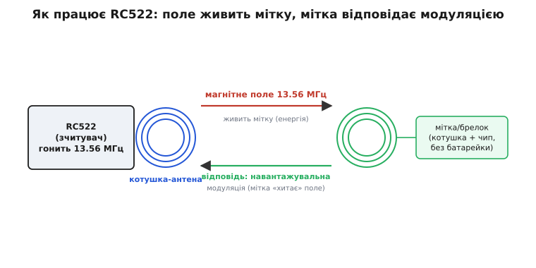
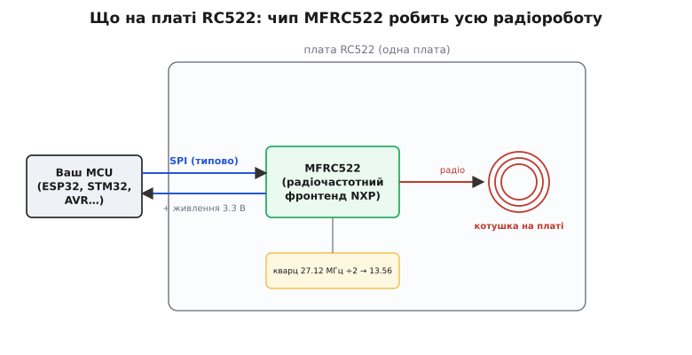
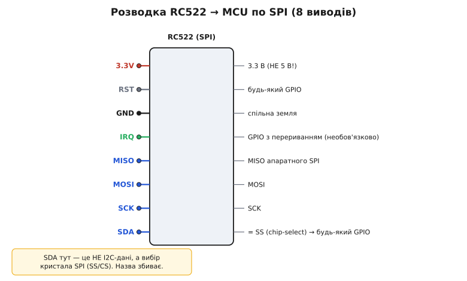

# RFID-RC522 — зчитувач 13.56 МГц

<preknowlist>
- [Шина SPI](root:com-devices/spi-bus) — як ведучий обмінюється з веденим по чотирьох лініях (SCK, MOSI, MISO, SS); саме нею RC522 говорить із мікроконтролером.
- [Опір котушки](root:hw-components/inductive-reactance) — чому котушка на змінному струмі має реактивний опір і як змінне поле наводить струм у сусідній котушці; на цьому тримається живлення мітки без батарейки.
</preknowlist>

Це маленька червона платка з пласкою мідною спіраллю по краю — саме та, що лежить у кожному наборі «Arduino для початківців» разом із білою карткою й синім брелоком. Її робота — впізнавати ці картки: піднесли до платки — вона за частку секунди зчитала унікальний номер тієї картки, а часто й прочитала чи перезаписала кілька байтів у її пам'яті. На цьому будують дверні замки, облік робочого часу, «поповнення» іграшкових проїзних і сотні саморобних проєктів, де треба відрізнити «свого» від «чужого» дотиком.

Уся хитрість у тому, що картка **не має живлення**. У ній немає ні батарейки, ні дроту — лише така сама пласка котушка й крихітний чип. Енергію їй дає сам зчитувач: RC522 гонить у свою котушку змінний струм на частоті 13.56 МГц, а це змінне магнітне поле наводить струм у котушці картки, коли ту підносять близько. Наведеного струму саме вистачає, щоб оживити чип картки на ті кілька мілісекунд, поки вона в полі. Тобто зчитувач і мітка — це фактично **трансформатор без осердя**, дві котушки, що зв'язані повітрям на відстані сантиметрів.

> 🔧 **Навіщо це розуміти.** З цього одразу випливають межі приладу. Дальність — сантиметри, а не метри: поле спадає з відстанню дуже швидко (ближня зона, не радіохвиля, що летить). Це не вада, а суть класу — 13.56 МГц навмисне зроблено для «дотику». Хочете зчитувати за метри — це вже зовсім інша фізика й інші модулі; RC522 фізично на таке не здатен, хоч скільки крути код.

Відповідає картка теж хитро. Власного передавача в неї нема, тож вона **змінює навантаження на свою котушку** — то підмикає, то відмикає крихітний опір усередині. Це ледь-ледь хитає поле, яке її ж і живить, а зчитувач цю зміну на своїй котушці помічає. Так, «навантажувальною модуляцією» (англ. *load modulation*), картка й передає біти назад. Зчитувач слухає власне поле й читає в ньому відповідь.


*Дві котушки, зв'язані повітрям. RC522 гонить поле 13.56 МГц — воно наводить струм у котушці мітки й живить її чип. Мітка не має передавача: вона відповідає, підмикаючи-відмикаючи внутрішнє навантаження, а зчитувач читає цю зміну у власному полі. Тому дальність — сантиметри, і мітці не потрібна батарейка.*

## Що це за клас і чого від нього не варто чекати

RC522 — це **зчитувач ближнього поля на 13.56 МГц** із родини, яку задає стандарт **ISO/IEC 14443 тип A**. Простіше: він працює з тими картками й брелоками, що звуть «MIFARE» та сумісними з ними. Це найпоширеніший у аматорстві діапазон, бо саме на ньому працюють банківські безконтактні картки, транспортні квитки й перепустки — тож дешевих сумісних міток довкола повно.

Важливо одразу розвести дві речі, які через RC522 постійно плутають, — **13.56 МГц (HF)** і **125 кГц (LF)**. Це різні світи, несумісні між собою. Низькочастотні (125 кГц) мітки — це старі товсті білі брелоки-«таблетки» для домофонів (EM4100 і подібні); їх читає зовсім інший модуль (RDM6300 і рідня), і RC522 їх **не бачить узагалі**. Якщо ваш брелок від під'їзду не читається — майже напевно він на 125 кГц, а не на 13.56. Ознака проста: під RC522 йдуть тонкі картки й брелоки з написом MIFARE / NFC / 13.56 MHz; усе, що для домофона на 125 кГц, — повз.

> Мітка, яку читає RC522, — це пасивна пара «котушка + чип» на 13.56 МГц, найчастіше сімейства MIFARE. Ключове, що знадобиться: кожна така мітка має незмінний заводський **UID** (unique identifier — унікальний номер, 4 або 7 байтів), а всередині — розбиту на сектори пам'ять, доступ до якої закритий ключами. Що це фізично й чим 1K відрізняється від 4K — у сусідній статті [RFID-брелок (13.56 МГц)](root:cat-hw-connect/rfid-tag).

Друге, чого не варто чекати, — **дистанції**. Реально RC522 бере мітку з 1–3 см, у найкращому разі до 5 см великою карткою впритул. Це через маленьку антену на платі й скромну потужність. Для дверного замка чи «приклав картку» цього досить; для «зчитати на проході за півметра» — ні.

## Що на платі й куди йдуть сигнали

Серце модуля — одна мікросхема, **MFRC522** фірми NXP (нащадка нідерландської Philips Semiconductors). Саме її ім'я й дало модулю назву «RC522». Ця мікросхема — увесь радіочастотний фронтенд: вона сама формує поле 13.56 МГц, сама його модулює на передачу, сама демодулює слабку відповідь мітки й складає прийняте у свій внутрішній буфер. Ваш мікроконтролер радіо не торкається — він лише командує чипом по шині й забирає готові байти.


*Плата як одне ціле. MCU обмінюється з чипом MFRC522 по шині (типово SPI) і живить його 3.3 В. Усередині чип сам гонить поле в котушку на платі й демодулює відповідь. Кварц 27.12 МГц ділиться навпіл — звідси й робочі 13.56 МГц.*

Поряд із чипом — **кварц на 27.12 МГц**. Число не випадкове: це рівно подвоєна робоча частота, і чип ділить його навпіл, щоб отримати точні 13.56 МГц. Далі — сама **котушка-антена**, розведена доріжками просто по краю плати, з ланцюжком підстроювальних конденсаторів. Оце й уся радіокухня; чіпати її вам не треба.

Назовні на типовій червоній платі виходить **вісім виводів**, і всі, крім двох, — звичні для будь-якого SPI-пристрою:

```
Живлення
  3.3V   живлення чипа — рівно 3.3 В (НЕ 5 В!)
  GND    спільна земля з мікроконтролером

Шина SPI (обмін із чипом)
  SCK    тактовий сигнал
  MOSI   дані в модуль   (master → module)
  MISO   дані з модуля   (module → master)
  SDA    вибір кристала (chip-select, SS) — активний у 0

Керування й події
  RST    апаратне скидання чипа
  IRQ    переривання: «є подія» (напр. з'явилась мітка) — часто не потрібне
```

Два виводи тут варті окремого слова, бо саме на них спотикаються.

**SDA** — головна пастка нейминга. На цій платі напис «SDA» **не має нічого спільного з даними I2C**, хоча так називають лінію даних у I2C. Тут це просто **chip-select** шини SPI (той самий SS/CS): лінія, якою мікроконтролер каже «зараз говорю саме з тобою». Плутанина з того, що чип MFRC522 уміє й SPI, і I2C, і UART, а виробник плати підписав пін універсально. На червоному RC522 інтерфейс апаратно виставлений на **SPI**, і «SDA» — це його CS. Просто заведіть його на будь-який вільний GPIO й назвіть бібліотеці як SS.

**IRQ** — лінія переривання: чип може сам смикнути її, коли настала подія (наприклад, у полі з'явилася мітка), щоб мікроконтролер не крутився в порожньому опитуванні. Річ корисна для економних, «сплячих» пристроїв, але **переважна більшість прикладів її не використовує** — вони просто в циклі питають чип «є картка?». Тому IRQ на більшості схем лишають непідключеним; це нормально.

## Як підключити

Схема мінімальна: чотири лінії SPI на апаратний SPI вашого мікроконтролера, RST і SS — на будь-які вільні цифрові виводи (їх потім назвете бібліотеці), живлення 3.3 В, земля спільна. IRQ можна не чіпати.


*Вісім виводів RC522 і куди їх вести. Чотири лінії SPI йдуть на апаратний SPI мікроконтролера; SDA — це насправді SS (chip-select), а не I2C-дані. RST і SS — на будь-які GPIO. IRQ необов'язковий: більшість коду опитує чип у циклі. Живлення — строго 3.3 В.*

Ось конкретна розводка на популярний ESP32 (номери GPIO — приклад, у коді вони й називаються):

```
RC522        ESP32 (приклад)
  3.3V  ───  3.3 В   (НЕ 5 В!)
  GND   ───  GND
  SCK   ───  GPIO18  (апаратний SPI, VSPI)
  MOSI  ───  GPIO23
  MISO  ───  GPIO19
  SDA   ───  GPIO5   (будь-який GPIO — це SS/CS)
  RST   ───  GPIO4   (будь-який GPIO)
  IRQ   ───  —       (можна не підключати)
```

У коді ви лише віддаєте драйверу апаратний SPI, називаєте дві вільні ніжки (SS і RST) і кажете «читай». Уся робота з регістрами чипа й з протоколом мітки схована в бібліотеці — у кожному середовищі своїй: `MFRC522` Мікі Балболи в Arduino, компонент `rc522` в ESP-IDF, порт `MFRC522.c` під HAL у STM32. Кроки скрізь ті самі: підняти SPI, ініціалізувати чип, спитати «чи є мітка в полі», забрати UID, відпустити мітку.

:::tabs
```arduino
#include <SPI.h>
#include <MFRC522.h>

#define SS_PIN   5     // «SDA» на платі — це chip-select
#define RST_PIN  4

MFRC522 reader(SS_PIN, RST_PIN);

void setup() {
  Serial.begin(115200);
  SPI.begin();                 // піднімаємо апаратний SPI
  reader.PCD_Init();           // ініціалізуємо чип MFRC522
}

void loop() {
  // чи є нова мітка в полі?
  if (!reader.PICC_IsNewCardPresent()) return;
  // чи вдалося прочитати її UID?
  if (!reader.PICC_ReadCardSerial()) return;

  Serial.print("UID:");
  for (byte i = 0; i < reader.uid.size; i++) {
    Serial.print(reader.uid.uidByte[i] < 0x10 ? " 0" : " ");
    Serial.print(reader.uid.uidByte[i], HEX);   // друкуємо номер картки
  }
  Serial.println();

  reader.PICC_HaltA();         // відпускаємо мітку, щоб не читати без кінця
}
```
```esp-idf
// Компонент rc522 з реєстру:  idf.py add-dependency "abobija/rc522"
// Опитування крутить сам драйвер у своїй задачі FreeRTOS і шле події.
#include "esp_log.h"
#include "rc522.h"
#include "driver/rc522_spi.h"

#define PIN_MISO 19
#define PIN_MOSI 23
#define PIN_SCLK 18
#define PIN_SDA   5            // «SDA» на платі — це chip-select
#define PIN_RST   4

static const char *TAG = "rc522";

static rc522_spi_config_t driver_config = {
    .host_id = SPI3_HOST,
    .bus_config = &(spi_bus_config_t){
        .miso_io_num = PIN_MISO,
        .mosi_io_num = PIN_MOSI,
        .sclk_io_num = PIN_SCLK,
    },
    .dev_config = { .spics_io_num = PIN_SDA },
    .rst_io_num = PIN_RST,
};

static rc522_driver_handle_t driver;
static rc522_handle_t scanner;

// подія від драйвера: мітка увійшла в поле й стала активною
static void on_picc(void *arg, esp_event_base_t base, int32_t id, void *data)
{
    rc522_picc_state_changed_event_t *e = (rc522_picc_state_changed_event_t *)data;
    if (e->picc->state == RC522_PICC_STATE_ACTIVE) {
        rc522_picc_print(e->picc);          // друкує тип мітки та її UID
    }
}

void app_main(void)
{
    ESP_ERROR_CHECK(rc522_spi_create(&driver_config, &driver));
    ESP_ERROR_CHECK(rc522_driver_install(driver));

    rc522_config_t scanner_config = { .driver = driver };
    ESP_ERROR_CHECK(rc522_create(&scanner_config, &scanner));
    rc522_register_events(scanner, RC522_EVENT_PICC_STATE_CHANGED, on_picc, NULL);
    ESP_ERROR_CHECK(rc522_start(scanner));
    ESP_LOGI(TAG, "сканер запущено");
}
```
```stm32
/* STM32 HAL + порт бібліотеки MFRC522 (MFRC522.c/.h у проєкті).
   SPI, CS і RST розводить CubeMX; порт бере їх із MFRC522_conf.h. */
#include "main.h"
#include "MFRC522.h"
#include <stdio.h>
#include <string.h>

extern SPI_HandleTypeDef  hspi1;     // апаратний SPI до модуля
extern UART_HandleTypeDef huart2;    // куди друкуємо UID

int main(void)
{
  HAL_Init();
  SystemClock_Config();
  MX_GPIO_Init();
  MX_SPI1_Init();                    // SCK/MOSI/MISO
  MX_USART2_UART_Init();

  MFRC522_Init();                    // ініціалізуємо чип MFRC522

  uint8_t type[2], uid[5];
  char line[32];

  while (1) {
    // чи є нова мітка в полі? (REQA — «озвіться, хто в полі»)
    if (MFRC522_Request(PICC_REQIDL, type) != MI_OK) { HAL_Delay(50); continue; }
    // антиколізія: витягуємо UID однієї мітки
    if (MFRC522_Anticoll(uid) != MI_OK)              { HAL_Delay(50); continue; }

    int n = snprintf(line, sizeof line, "UID: %02X %02X %02X %02X\r\n",
                     uid[0], uid[1], uid[2], uid[3]);
    HAL_UART_Transmit(&huart2, (uint8_t *)line, n, HAL_MAX_DELAY);

    MFRC522_Halt();                  // відпускаємо мітку, щоб не читати без кінця
    HAL_Delay(500);
  }
}
```
:::

Піднесли картку — у порт капнув її UID на кшталт `UID: DE AD BE EF`. Цього вже досить для найпростішого «свій/чужий»: тримаєте список дозволених номерів і порівнюєте. Читати й писати байти в пам'ять мітки (з ключами доступу), робити копії, працювати з NTAG — це наступний шар; його з робочим кодом і типовими пастками розібрано у вставці-проєкті [API RC522: читаємо UID і блоки пам'яті](root:cat-hw-connect/rfid-rc522/api-rc522.md).

## Живлення й рівні — головна пастка

Тут ховається те, на чому RC522 «не працює без причини» найчастіше. Два правила, і обидва варті механізму, а не заучування.

**Живлення — строго 3.3 В.** Чип MFRC522 живиться від 3.3 В і виводу VCC **не терпить 5 В**. Подасте 5 В на живлення — з великою ймовірністю зіпсуєте плату. Це перше, що треба перевірити, коли модуль «мертвий із коробки».

А ось із **логічними рівнями** тонше, і саме тут беруть найбільше плутанини. Входи MFRC522 розраховані на 3.3-вольтову логіку — байдуже, хто на тому кінці шини. Тож будь-який 5-вольтовий хост (класика — ATmega-плати Arduino Uno/Nano) строго кажучи вимагає знижувати рівні ліній, що йдуть **у модуль** (SCK, MOSI, SS, RST), перетворювачем рівнів. На практиці левова частка дешевих RC522 роками працює під'єднаною до 5-вольтового Arduino напряму й не згорає — входи виявляються терпимими, — але це **щастя, а не гарантія**: різні партії поводяться по-різному, і покладатися на це в надійному пристрої не варто. Лінію MISO (від модуля до МК) знижувати не треба: 3.3 В на ній 5-вольтова логіка й так прочитає як одиницю. На 3.3-вольтових платах (ESP32, STM32, RP2040, більшість сучасних) усе з'єднується напряму й без зайвих думок — ще одна причина, чому RC522 найкраще заводиться саме з ними.

> 🔧 **Навіщо це.** Половина скарг «RC522 не бачить карток / читає через раз / завис» — це не радіо й не код, а живлення й рівні: або на VCC помилково подали 5 В, або дешева плата на межі толерантності до логіки, або просіла напруга через кепський контакт на макетці. Перевірте ці три речі **перш** ніж лізти в бібліотеку — заощадите години.

І ще дрібниця, що коштує багатьом вечора: **дешеві плати RC522 сумно відомі поганою пайкою гребінки виводів**. Дуже часто перше, що треба зробити з новою платою, — акуратно пропаяти вісім контактів наново. Симптом брудної пайки — модуль то бачить картку, то ні, реагує на постукування пальцем чи ворушіння дротів. Якщо поводиться «примхливо» — почніть із паяльника, а не з коду.

## Чого стерегтися в застосуванні

RC522 чудовий, щоб **упізнати** мітку, але є межа, яку легко переступити недосвідченому: **на його безпеку не можна покладатися**. Найпоширеніші дешеві мітки, які він читає, — MIFARE Classic — використовують старий шифр Crypto-1, зламаний ще 2008 року; ключі до такої картки дістають за секунди, а саму картку клонують копеечним обладнанням. Тобто RC522 годиться, щоб відчинити ящик з іграшками чи ввімкнути світло «своєю» карткою, але **не** для дверей, за якими щось цінне, чи для будь-чого, що імітує платіж. Як саме зламали Crypto-1 і чому це урок для всієї галузі — коротко в історичній вставці [Як зламали MIFARE Classic](root:cat-hw-connect/rfid-rc522/hist-mifare-crypto1.md).

Друге обмеження випливає з фізики поля: **дві мітки в полі одночасно** — це проблема. Коли їх кілька, їхні відповіді накладаються й глушать одна одну; щоб виокремити одну, потрібна процедура «антиколізії» (зчитувач по черзі «вимикає» мітки за бітами UID, поки не лишиться одна). Бібліотека це вміє, але практичний висновок простий: **підносьте по одній картці**. Стос карток RC522 надійно не розбере.

І третє, суто механічне: **металева поверхня вбиває поле**. Приклеїте RC522 (чи мітку) впритул до металу — той наведе в собі струми, які поглинуть енергію поля, і дальність упаде до нуля. Тому в реальному корпусі тримайте антену подалі від металевих деталей, а для наклейок на метал беруть спеціальні «on-metal» мітки з феритовою підкладкою.

## Короткий чек-лист першого запуску

Звівши все докупи, ось де найчастіше спотикається перший старт RC522 і чому:

```
Симптом                          Найімовірніша причина
─────────────────────────────────────────────────────────────────
Модуль «мертвий», не ініт.       на VCC подано 5 В замість 3.3 В;
                                 непропаяна гребінка виводів
Бачить картку через раз          холодна пайка; поганий контакт на
                                 макетці; ворушіння дротів
Не бачить певний брелок          він на 125 кГц (LF), а не 13.56 МГц —
                                 RC522 такі не читає в принципі
Читає лише впритул               мала антена — це норма (1–3 см);
                                 поряд метал, що глушить поле
begin/init не проходить          переплутані MISO/MOSI; не той SS;
                                 5-вольтова логіка на межі толерантності
Кілька карток разом не читає     їх треба підносити по одній
```

Майже все зводиться до чотирьох банальних речей: живлення рівно 3.3 В, чесно пропаяна гребінка, узгоджені (або хоч терпимі) рівні логіки й одна мітка потрібного діапазону в полі за раз. Полагодьте їх — і ця копійчана червона платка робить рівно те, заради чого її беруть: перетворює дотик картки на впізнаваний номер, на якому можна будувати замок, облік чи будь-яку саморобку, де треба відрізнити свого від чужого.
