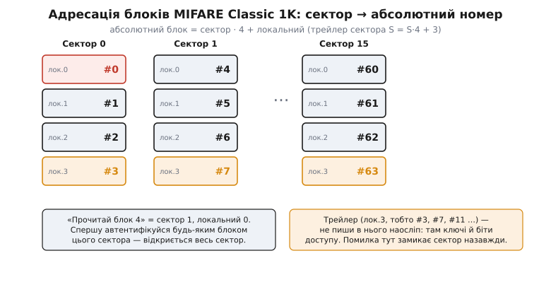
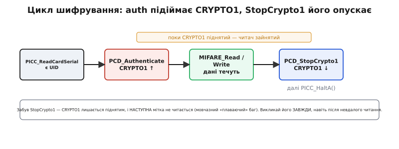

# ⚙️ Читаємо й пишемо брелок: повний проєкт із читачем MFRC522

<preknowlist>
- [Шина SPI](root:com-devices/spi-bus) — чотири лінії (SCK, MOSI, MISO, SS), якими мікроконтролер командує читачем; уся робота з брелком іде через неї.
- [Біти, байти, порядок](root:sf-algorithms/bits-bytes-endianness) — байт, шістнадцятковий запис, маска `& 0x0F`, зсув; UID і блоки читаються й пишуться саме в байтах.
- [ASCII і UTF-8](root:sf-data/ascii-utf8) — літера в пам'яті це число-код; коли пишемо в блок текст, у брелок лягають саме коди символів.
</preknowlist>

Брелок пасивний — сам він мертвий. Щоб прочитати з нього UID або записати 16 байтів у блок, потрібен **читач**: аматорський модуль на чипі MFRC522, під'єднаний до мікроконтролера по SPI. Ваш код звертається не до брелка, а до читача: «дай номер найближчої мітки», «автентифікуйся ключем сектора 1», «поклади ці 16 байтів у блок 4». Читач жене поле, будить мітку, веде за неї весь протокол ISO 14443A і повертає вам байти.

Тут зібрано **повний робочий проєкт** саме роботи з брелком через цей читач: прочитати UID будь-якого чипа, розпізнати, який це чип, автентифікуватися ключем потрібного сектора, прочитати й **записати** блок, зняти дамп усієї картки — і не наступити на грабки, якими бібліотека `MFRC522` славна. Код тут — залізний рівень: регістри чипа, протокол мітки, hex-байти. Платформозалежного в ньому мало: треба SPI-майстер, вивід chip-select і вивід скидання — це є на будь-якому мікроконтролері, а весь протокол мітки однаковий скрізь. Різниця лише в тому, **хто пише регістри чипа**: на Arduino це готова бібліотека `miguelbalboa/rfid` (з неї й почнемо — вона найкоротша), в ESP-IDF чи STM32 HAL — два десятки рядків власного транспорту поверх їхнього SPI-драйвера, а далі той самий код мітки.

> 🔧 **Навіщо це.** Різниця між «зчитати UID» і «читати-писати блоки» — це різниця між брелоком-ключем і брелоком-носієм даних. UID дає вам лише «свій/чужий» (і той, як ми побачимо, підробний за долар). А блоки — це вже баланс на картці лояльності, лічильник входів, будь-який ваш стан, який мандрує на самому брелку. Щойно ви навчилися автентифікуватися й писати блок, брелок з «пропуску» перетворюється на крихітну базу даних на 752 корисні байти, яку носять на ключах.

---

## Задача: від «хто ти?» до «запам'ятай це»

Візьмімо конкретну ціль, до якої йтиме весь код, — маленьку систему на брелках MIFARE Classic 1K (той самий синій брелок із набору). Прилад має вміти чотири речі, і кожна складніша за попередню рівно на один крок протоколу.

**Перше — впізнати.** Піднесли брелок — прочитати його UID і сказати, чи він у списку своїх. Це не вимагає ключів: UID віддається відкрито.

**Друге — розпізнати чип.** Той самий читач бачить і Classic 1K, і Ultralight, і DESFire, а працюють вони по-різному. Треба з відповіді мітки зрозуміти, що саме піднесли, щоб не намагатися автентифікуватися ключем там, де ключів немає.

**Третє — прочитати дані.** У картці лояльності баланс лежить, скажімо, у блоці 4. Щоб його дістати, треба спершу довести знання ключа сектора, тоді прочитати 16 байтів блока.

**Четверте — записати.** Нарахували бонус — треба покласти новий баланс назад у той самий блок 4, теж під ключем.

І понад це — **дамп**: службова команда «покажи всю картку», якою ви одного разу дивитеся, що взагалі лежить у брелку й яка в нього структура. Розберемо кожен крок від першопричини, бо в кожному сидить своя пастка, на якій новачок губить вечір.

---

## Ідея: читач — це «уста й вуха», а вся логіка захисту — у мітці

Перш ніж писати код, треба чітко уявити **розподіл ролей**, бо тоді кожен виклик стає прозорим, а кожна помилка — локалізованою.

Чип MFRC522 — це радіочастотний фронт і нічого більше. Він жене поле 13.56 МГц, модулює його на передачу, ловить слабку відповідь мітки навантажувальною модуляцією й складає прийняте у свій буфер. Він **не знає** ні про сектори, ні про ключі, ні про те, MIFARE це чи щось інше — він просто передавач-приймач. А ось **логіка захисту сидить у самій мітці**: це вона перевіряє ключ, вирішує, віддати блок чи змовчати, і шифрує обмін своїм CRYPTO1. Між вами й чипом стоїть **драйвер**: ви кажете йому «автентифікуйся», він перекладає це в потрібні регістрові команди чипу, чип жене їх у мітку, мітка звіряє ключ. На Arduino цим драйвером служить бібліотека `MFRC522`, поза ним — ваші власні функції поверх SPI; імена викликів нижче бібліотечні, але сама четвірка кроків однакова в будь-якому середовищі.

Тому будь-яка операція з даними брелка розпадається на **строгу послідовність**, яку не можна порушити:

1. **Знайти мітку** й прочитати її UID (`PICC_IsNewCardPresent` + `PICC_ReadCardSerial`).
2. **Автентифікуватися** ключем того сектора, який вас цікавить (`PCD_Authenticate`) — довести мітці знання ключа. Без цього кроку мітка на читання блока просто змовчить.
3. **Прочитати або записати** блок (`MIFARE_Read` / `MIFARE_Write`) — тепер, коли сектор відкритий.
4. **Опустити шифрування** в читачі (`PCD_StopCrypto1`) — і відпустити мітку (`PICC_HaltA`).

Кроки 2 і 4 — парні, як «відчинити» й «зачинити». І саме на четвертому найчастіше спотикаються, бо його легко забути, а наслідок — не помилка, а мовчазне зависання наступного читання.

> 🔧 **Навіщо це.** Тримаючи цю четвірку в голові, ви миттєво локалізуєте будь-яку ваду. UID є, а блок не читається? Збоїть крок 2 — не той ключ або не той сектор. Перша мітка читається, друга ні? Забули крок 4 — шифрування лишилося піднятим. Запис «проходить», а в блоці сміття? Дали в крок 3 не 16 байтів. Ви не гадаєте — ви дивитеся, який із чотирьох кроків міг збитися.

---

## Крок 1: прочитати UID і розпізнати чип

Почнемо з найпростішого, що вміє будь-яка система, — впізнати мітку в полі. Але одразу зробимо це **розумно**: не лише витягнемо UID, а й з'ясуємо, що за чип піднесли. Мітка в самій відповіді на перше опитування (у байтах ATQA і SAK) видає натяк на свій тип, і бібліотека вміє його розкодувати.

:::tabs
```arduino
#include <SPI.h>
#include <MFRC522.h>            // бібліотека miguelbalboa/rfid

#define RST_PIN  9
#define SS_PIN   10             // «SDA» на червоній платі — це chip-select

MFRC522 reader(SS_PIN, RST_PIN);

void setup() {
  Serial.begin(115200);
  SPI.begin();
  reader.PCD_Init();            // підняти чип MFRC522 по SPI
  Serial.println(F("Піднесіть мітку..."));
}

void loop() {
  // чи є нова мітка в полі? (не крутимо ту саму по колу)
  if (!reader.PICC_IsNewCardPresent()) return;
  // чи прочитався її серійний номер (UID)?
  if (!reader.PICC_ReadCardSerial()) return;

  // --- UID: байти лежать у reader.uid.uidByte[], довжина в reader.uid.size ---
  Serial.print(F("UID ("));
  Serial.print(reader.uid.size);            // 4 або 7
  Serial.print(F(" байт):"));
  for (byte i = 0; i < reader.uid.size; i++) {
    Serial.print(reader.uid.uidByte[i] < 0x10 ? " 0" : " ");
    Serial.print(reader.uid.uidByte[i], HEX);
  }
  Serial.println();

  // --- тип чипа: розкодувати з SAK (байт reader.uid.sak) ---
  MFRC522::PICC_Type type = reader.PICC_GetType(reader.uid.sak);
  Serial.print(F("Чип: "));
  Serial.println(reader.PICC_GetTypeName(type));   // напр. "MIFARE 1KB"

  reader.PICC_HaltA();         // відпустити мітку
}
```
```esp-idf
#include "driver/spi_master.h"
#include "esp_log.h"
#include "freertos/FreeRTOS.h"
#include "freertos/task.h"

static const char *TAG = "rc522";
static spi_device_handle_t rc;

// УВЕСЬ платформозалежний код — оці дві функції. Адреса регістра в SPI-кадрі:
// запис (reg << 1) & 0x7E, читання — той самий байт із піднятим 0x80.
static void pcd_write(uint8_t reg, uint8_t val) {
    uint8_t tx[2] = { (uint8_t)((reg << 1) & 0x7E), val };
    spi_transaction_t t = { .length = 16, .tx_buffer = tx };
    ESP_ERROR_CHECK(spi_device_polling_transmit(rc, &t));
}
static uint8_t pcd_read(uint8_t reg) {
    uint8_t tx[2] = { (uint8_t)(((reg << 1) & 0x7E) | 0x80), 0 }, rx[2];
    spi_transaction_t t = { .length = 16, .tx_buffer = tx, .rx_buffer = rx };
    ESP_ERROR_CHECK(spi_device_polling_transmit(rc, &t));
    return rx[1];
}

void app_main(void) {
    spi_bus_config_t bus = { .miso_io_num = 19, .mosi_io_num = 23, .sclk_io_num = 18,
                             .quadwp_io_num = -1, .quadhd_io_num = -1 };
    ESP_ERROR_CHECK(spi_bus_initialize(SPI2_HOST, &bus, SPI_DMA_CH_AUTO));
    spi_device_interface_config_t dev = { .clock_speed_hz = 5 * 1000 * 1000, .mode = 0,
                                          .spics_io_num = 5,   // «SDA» плати — це chip-select
                                          .queue_size = 4 };
    ESP_ERROR_CHECK(spi_bus_add_device(SPI2_HOST, &dev, &rc));

    pcd_write(0x01, 0x0F);                        // CommandReg ← SoftReset
    vTaskDelay(pdMS_TO_TICKS(50));
    pcd_write(0x2A, 0x80); pcd_write(0x2B, 0xA9); // таймер очікування відповіді мітки
    pcd_write(0x2C, 0x03); pcd_write(0x2D, 0xE8);
    pcd_write(0x15, 0x40); pcd_write(0x11, 0x3D); // 100% ASK, CRC-preset 0x6363
    pcd_write(0x14, pcd_read(0x14) | 0x03);       // TxControlReg: антена на

    uint8_t uid[10], uid_len, sak;
    while (1) {
        // picc_select — код протоколу ISO 14443A поверх pcd_write/pcd_read.
        // Він однаковий на будь-якому МК; платформа міняє лише транспорт вище.
        if (picc_select(uid, &uid_len, &sak) != ESP_OK) { vTaskDelay(pdMS_TO_TICKS(50)); continue; }
        ESP_LOG_BUFFER_HEX(TAG, uid, uid_len);            // UID: 4 або 7 байтів
        ESP_LOGI(TAG, "Чип: %s", picc_type_name(sak));    // тип із SAK, напр. "MIFARE 1KB"
        picc_halt_a();
    }
}
```
```stm32
#include "stm32f4xx_hal.h"
#include <stdio.h>

extern SPI_HandleTypeDef  hspi1;
extern UART_HandleTypeDef huart2;
#define CS_PORT GPIOB
#define CS_PIN  GPIO_PIN_6            // «SDA» плати — це chip-select

// УВЕСЬ платформозалежний код — оці дві функції: опустити CS і прогнати два
// байти. Адреса регістра: запис (reg << 1) & 0x7E, читання — те саме | 0x80.
static void pcd_write(uint8_t reg, uint8_t val) {
    uint8_t tx[2] = { (reg << 1) & 0x7E, val };
    HAL_GPIO_WritePin(CS_PORT, CS_PIN, GPIO_PIN_RESET);
    HAL_SPI_Transmit(&hspi1, tx, 2, HAL_MAX_DELAY);
    HAL_GPIO_WritePin(CS_PORT, CS_PIN, GPIO_PIN_SET);
}
static uint8_t pcd_read(uint8_t reg) {
    uint8_t tx[2] = { ((reg << 1) & 0x7E) | 0x80, 0 }, rx[2];
    HAL_GPIO_WritePin(CS_PORT, CS_PIN, GPIO_PIN_RESET);
    HAL_SPI_TransmitReceive(&hspi1, tx, rx, 2, HAL_MAX_DELAY);
    HAL_GPIO_WritePin(CS_PORT, CS_PIN, GPIO_PIN_SET);
    return rx[1];
}

void rc522_init(void) {                           // те, що на Arduino робить PCD_Init()
    pcd_write(0x01, 0x0F);                        // CommandReg ← SoftReset
    HAL_Delay(50);
    pcd_write(0x2A, 0x80); pcd_write(0x2B, 0xA9); // таймер очікування відповіді мітки
    pcd_write(0x2C, 0x03); pcd_write(0x2D, 0xE8);
    pcd_write(0x15, 0x40); pcd_write(0x11, 0x3D); // 100% ASK, CRC-preset 0x6363
    pcd_write(0x14, pcd_read(0x14) | 0x03);       // TxControlReg: антена на
}

void rc522_poll(void) {                           // кличемо з головного циклу
    uint8_t uid[10], uid_len, sak, line[80];
    // picc_select — код протоколу ISO 14443A поверх pcd_write/pcd_read: він
    // однаковий скрізь, платформа міняє лише транспорт вище.
    if (picc_select(uid, &uid_len, &sak) != PICC_OK) return;
    int k = snprintf((char *)line, sizeof line, "UID (%u байт):", uid_len);
    for (uint8_t i = 0; i < uid_len; i++)         // саме uid_len, не жорсткі 4
        k += snprintf((char *)line + k, sizeof line - k, " %02X", uid[i]);
    k += snprintf((char *)line + k, sizeof line - k, "\r\nЧип: %s\r\n", picc_type_name(sak));
    HAL_UART_Transmit(&huart2, line, k, HAL_MAX_DELAY);
    picc_halt_a();
}
```
:::

Піднесли брелок — у порт вивалюється щось на кшталт:

```
UID (4 байт): A4 3F 2C 91
Чип: MIFARE 1KB
```

Тут два тонкі місця, і обидва варті пояснення, бо на них будується все подальше.

**UID буває 4 або 7 байтів — і код мусить це витримувати.** Історично MIFARE Classic мав 4-байтовий UID. Але 4 байти — це лише 4 мільярди комбінацій, їх на всі мітки світу не вистачає, тож пізніші чипи (і всі 7-байтові серії) віддають **7-байтовий** UID. Мітка сигналізує довжину під час процедури анти-колізії (для 7 байтів вона йде у два «каскади», і в проміжній відповіді стоїть біт «UID ще не повний»), а бібліотека складає повний номер і кладе його довжину у `reader.uid.size`. **Практичний висновок:** ніколи не пишіть жорстко `for (i = 0; i < 4; i++)` — беріть `reader.uid.size`, інакше на 7-байтовій мітці ви візьмете лише перші 4 байти й сплутаєте різні брелки в один. Це класична пастка систем, які «раптом» перестають розрізняти нові картки.

**Тип чипа беруть із SAK, а не з ATQA.** Мітка на активацію відповідає двома службовими значеннями: ATQA (відповідь на запит) і SAK (відповідь на вибір). Спокуса — визначати чип по ATQA, але цього робити **не можна**: ATQA може «колідувати» між різними чипами й вводити в оману. Надійний дискримінатор — саме **SAK**, і бібліотечна `PICC_GetType(sak)` іде рівно за цим правилом (те саме радить офіційна процедура ідентифікації NXP). Ось як SAK розводить найпоширеніші чипи:

```
SAK    Чип                    що це означає для коду
──────────────────────────────────────────────────────────────
0x08   MIFARE Classic 1K      є сектори й ключі — можна авт-ся
0x18   MIFARE Classic 4K      те саме, 40 секторів
0x00   MIFARE Ultralight      КЛЮЧІВ НЕМА — авт-ся нічим, читаємо прямо
0x20   ISO 14443-4 (DESFire…) інша логіка — потрібні APDU-команди, не блоки
```

Практична вага цього кроку: **розпізнавши чип, ви знаєте, як із ним говорити далі**. До Classic — автентифікуватися ключем і читати блоки (нижче). До Ultralight — читати сторінки без жодного ключа. До DESFire — узагалі інший протокол, блоками його не візьмеш. Спроба автентифікуватися ключем на Ultralight поверне помилку не тому, що ключ «не той», а тому, що самого механізму ключів там немає, — і не знаючи типу, ви шукатимете неіснуючу проблему.

---

## Крок 2: адресація блоків — де саме лежить «блок 4»

Перш ніж читати, треба розібратися з **нумерацією**, бо тут ховається найтихіша й найзліша плутанина всієї роботи з MIFARE Classic. У бібліотеці всі блоки нумеруються **наскрізно, від 0**, а не «сектор такий-то, блок такий-то». Тобто коли ви кажете `MIFARE_Read(4, ...)`, ви читаєте **абсолютний блок 4**, який фізично є **першим блоком (локальним 0) сектора 1**.

Арифметика проста, але її треба тримати перед очима:

```
абсолютний блок = номер_сектора · 4 + локальний_блок   (локальний 0..3)
трейлер сектора S (де ключі) = S · 4 + 3
```


*Адресація блоків MIFARE Classic 1K. Бібліотека нумерує блоки наскрізно від 0: «блок 4» — це локальний блок 0 сектора 1. Трейлер (де лежать ключі й біти доступу) — завжди останній, локальний блок 3 кожного сектора, тобто абсолютні #3, #7, #11 … Автентифікація відкриває весь сектор, тож авт-ся можна за будь-яким його блоком.*

Звідси кілька залізних правил, які вбережуть від зіпсованих карток:

**Блок 0 — недоторканний UID.** Абсолютний блок 0 (локальний 0 сектора 0) — це той самий заводський UID, лише для читання. Писати в нього на звичайній мітці не можна (мітка мовчки відмовить), а на «магічній» — можна, і саме так роблять клони, про що нижче.

**Трейлери — не для наївного запису.** Блоки #3, #7, #11, … #63 — це трейлери секторів: у них ключі A/B і біти доступу. Записати туди «дані» означає **перезаписати ключі** — і якщо ви покладете туди сміття або неправильні біти доступу, сектор може замкнутися **назавжди**, без жодного шансу відновити. Тому в трейлер пишуть лише свідомо й лише правильно сформований 16-байтовий блок (6 байтів ключа A + 4 байти доступу + 6 байтів ключа B).

**Дані — усе інше.** У Classic 1K корисних блоків даних — 47 (з 64 усього: мінус 16 трейлерів, мінус блок 0-UID), тобто 47 × 16 = 752 байти, з яких ви вільно читаєте й пишете. Для нашого прикладу баланс кладемо в блок 4 — це чисто-дата блок, писати в нього безпечно.

> 🔧 **Навіщо це.** 90% зіпсованих «наглухо» брелків — це запис у трейлер за неуважності: людина хотіла в блок 3 покласти дані, а блок 3 — це трейлер сектора 0, і вона поклала туди сміття замість ключів. Мітка тепер вимагає ключа, якого ніхто не знає. Правило просте: **пишіть тільки в блоки, де `локальний != 3`, і ніколи в блок 0.** Дамп (нижче) наочно показує, який блок чим є, — знімайте його перш ніж писати в незнайому картку.

---

## Крок 3: автентифікуватися й прочитати блок

Тепер, знаючи адресу, дістаємося захищених даних. Логіка MIFARE тут непорушна: **спершу ключ, тоді дані**. Ви доводите мітці знання ключа сектора — і лише тоді вона віддає блоки цього сектора.

:::tabs
```arduino
// Прочитати блок 4 (сектор 1, локальний 0) ключем A.
// Новий брелок із заводу має на всіх секторах ключ FF FF FF FF FF FF.
MFRC522::MIFARE_Key key;
for (byte i = 0; i < 6; i++) key.keyByte[i] = 0xFF;   // заводський ключ, 6 байтів FF

byte block  = 4;
byte buffer[18];                 // 16 байтів даних + 2 байти CRC — МУСИТЬ бути 18
byte size   = sizeof(buffer);    // передаємо ЄМНІСТЬ буфера (18), не 16

// КРОК 2: довести знання ключа A саме цього сектора.
// blockAddr тут — будь-який блок сектора; беремо той, що читатимемо.
MFRC522::StatusCode st = reader.PCD_Authenticate(
    MFRC522::PICC_CMD_MF_AUTH_KEY_A, block, &key, &(reader.uid));
if (st != MFRC522::STATUS_OK) {
  Serial.print(F("Автентифікація не вдалась: "));
  Serial.println(reader.GetStatusCodeName(st));   // читабельна причина
  reader.PICC_HaltA();
  reader.PCD_StopCrypto1();     // навіть після невдачі — опустити шифрування
  return;
}

// КРОК 3: сектор відкрито — читаємо 16 байтів блока
st = reader.MIFARE_Read(block, buffer, &size);
if (st == MFRC522::STATUS_OK) {
  Serial.print(F("Блок "));
  Serial.print(block);
  Serial.print(F(":"));
  for (byte i = 0; i < 16; i++) {          // друкуємо ЛИШЕ 16, не 18
    Serial.print(buffer[i] < 0x10 ? " 0" : " ");
    Serial.print(buffer[i], HEX);
  }
  Serial.println();
} else {
  Serial.print(F("Читання не вдалось: "));
  Serial.println(reader.GetStatusCodeName(st));
}

reader.PICC_HaltA();             // відпустити мітку
reader.PCD_StopCrypto1();        // ОБОВ'ЯЗКОВО опустити шифрування
```
```esp-idf
// Ті самі чотири кроки поверх нашого транспорту; причина невдачі їде в esp_err_t.
static const uint8_t key_a[6] = { 0xFF, 0xFF, 0xFF, 0xFF, 0xFF, 0xFF };  // заводський ключ

uint8_t block = 4;
uint8_t buf[18];                  // 16 байтів даних + 2 байти CRC — МУСИТЬ бути 18
uint8_t size = sizeof(buf);       // передаємо ЄМНІСТЬ буфера (18), не 16

// КРОК 2: довести знання ключа A саме цього сектора (команда чипа MFAuthent).
esp_err_t err = pcd_authenticate(PICC_CMD_MF_AUTH_KEY_A, block, key_a, uid, uid_len);
if (err != ESP_OK) {
    ESP_LOGE(TAG, "Автентифікація не вдалась: %s", esp_err_to_name(err));
    picc_halt_a();
    pcd_stop_crypto1();           // навіть після невдачі — опустити шифрування
    return;
}

// КРОК 3: сектор відкрито — читаємо 16 байтів блока
err = mifare_read(block, buf, &size);
if (err == ESP_OK) {
    ESP_LOGI(TAG, "Блок %u:", block);
    ESP_LOG_BUFFER_HEX(TAG, buf, 16);          // друкуємо ЛИШЕ 16, не 18
} else {
    ESP_LOGE(TAG, "Читання не вдалось: %s", esp_err_to_name(err));
}

picc_halt_a();                    // відпустити мітку
pcd_stop_crypto1();               // ОБОВ'ЯЗКОВО опустити шифрування
```
```stm32
// Ті самі чотири кроки; замість Serial — UART, замість StatusCode — свій enum.
static const uint8_t key_a[6] = { 0xFF, 0xFF, 0xFF, 0xFF, 0xFF, 0xFF };  // заводський ключ

uint8_t block = 4;
uint8_t buf[18];                  // 16 байтів даних + 2 байти CRC — МУСИТЬ бути 18
uint8_t size = sizeof(buf);       // передаємо ЄМНІСТЬ буфера (18), не 16
char    line[80];
int     k;

// КРОК 2: довести знання ключа A саме цього сектора (команда чипа MFAuthent).
picc_status_t st = pcd_authenticate(PICC_CMD_MF_AUTH_KEY_A, block, key_a, uid, uid_len);
if (st != PICC_OK) {
    k = snprintf(line, sizeof line, "Автентифікація не вдалась: %s\r\n", picc_status_name(st));
    HAL_UART_Transmit(&huart2, (uint8_t *)line, k, HAL_MAX_DELAY);
    picc_halt_a();
    pcd_stop_crypto1();           // навіть після невдачі — опустити шифрування
    return;
}

// КРОК 3: сектор відкрито — читаємо 16 байтів блока
st = mifare_read(block, buf, &size);
if (st == PICC_OK) {
    k = snprintf(line, sizeof line, "Блок %u:", block);
    for (uint8_t i = 0; i < 16; i++)           // друкуємо ЛИШЕ 16, не 18
        k += snprintf(line + k, sizeof line - k, " %02X", buf[i]);
    k += snprintf(line + k, sizeof line - k, "\r\n");
} else {
    k = snprintf(line, sizeof line, "Читання не вдалось: %s\r\n", picc_status_name(st));
}
HAL_UART_Transmit(&huart2, (uint8_t *)line, k, HAL_MAX_DELAY);

picc_halt_a();                    // відпустити мітку
pcd_stop_crypto1();               // ОБОВ'ЯЗКОВО опустити шифрування
```
:::

Три деталі тут — не косметика, а причина половини багів.

**Буфер читання — рівно 18 байтів, не 16.** `MIFARE_Read` кладе вам 16 байтів даних **плюс 2 байти контрольної суми CRC**, яку мітка додає, щоб читач переконався в цілості. Тому масив мусить бути `byte buffer[18]`, а в `size` ви передаєте його **ємність** (18). Дасте 16 — бібліотека побачить, що місця під CRC нема, і поверне `STATUS_NO_ROOM`, а ви годину шукатимете «чому не читає». Самі корисні дані — перші 16 байтів; CRC читача цікавить лише для перевірки, друкувати його не треба.

**Автентифікація — на сектор, не на блок.** Хоч ви й передаєте `PCD_Authenticate` номер конкретного блока, мітка відмикає **весь сектор** цього блока за раз. Тобто, автентифікувавшись «блоком 4», ви можете тоді читати й блоки 5, 6 (і навіть трейлер 7) того ж сектора без нової автентифікації. Але щойно ви захотіли блок з **іншого** сектора — потрібна нова `PCD_Authenticate` вже його ключем. Дуже поширена помилка: автентифікувалися сектором 1, а лізете читати блок 8 (сектор 2) — мітка мовчить, бо цей сектор ви не відмикали.

**Читайте `GetStatusCodeName`, а не гадайте.** Кожна операція повертає `StatusCode`, і бібліотека вміє перекласти його в слова: `STATUS_OK`, `STATUS_TIMEOUT` (мітку прибрали з поля), `STATUS_CRC_WRONG` (завади, слабкий контакт), `STATUS_MIFARE_NACK` (мітка відмовила — часто не той ключ). Друкуючи `reader.GetStatusCodeName(st)`, ви бачите **причину**, а не мовчазний провал, — це найшвидший шлях від «не працює» до «ага, не той ключ».

---

## Крок 4: записати блок

Запис — дзеркало читання, з тими самими двома кроками (ключ, тоді дія), але з власними трьома пастками. Запишемо в блок 4 наш «новий баланс».

:::tabs
```arduino
// Записати 16 байтів у блок 4. Спершу — та сама автентифікація.
MFRC522::MIFARE_Key key;
for (byte i = 0; i < 6; i++) key.keyByte[i] = 0xFF;

byte block = 4;

// Дані на запис — РІВНО 16 байтів. Тут: рядок-мітка + число балансу.
byte data[16] = {
  'B','A','L', 0x00,                 // сигнатура «BAL» + роздільник
  0x00, 0x00, 0x27, 0x10,            // баланс = 0x2710 = 10000 (напр. копійок)
  0x00, 0x00, 0x00, 0x00,            // решта — про запас, нулі
  0x00, 0x00, 0x00, 0x00
};

MFRC522::StatusCode st = reader.PCD_Authenticate(
    MFRC522::PICC_CMD_MF_AUTH_KEY_A, block, &key, &(reader.uid));
if (st != MFRC522::STATUS_OK) {
  Serial.print(F("Авт. перед записом не вдалась: "));
  Serial.println(reader.GetStatusCodeName(st));
  reader.PICC_HaltA(); reader.PCD_StopCrypto1();
  return;
}

// Запис: РІВНО 16 байтів, розмір передаємо 16 (не 18 — CRC тут додає бібліотека сама)
st = reader.MIFARE_Write(block, data, 16);
if (st == MFRC522::STATUS_OK) {
  Serial.println(F("Записано."));
} else {
  Serial.print(F("Запис не вдався: "));
  Serial.println(reader.GetStatusCodeName(st));   // напр. NACK, якщо ключ дозволяє лише читання
}

reader.PICC_HaltA();
reader.PCD_StopCrypto1();
```
```esp-idf
// Записати 16 байтів у блок 4. Спершу — та сама автентифікація.
static const uint8_t key_a[6] = { 0xFF, 0xFF, 0xFF, 0xFF, 0xFF, 0xFF };

uint8_t block = 4;

// Дані на запис — РІВНО 16 байтів. Тут: рядок-мітка + число балансу.
uint8_t data[16] = {
    'B', 'A', 'L', 0x00,               // сигнатура «BAL» + роздільник
    0x00, 0x00, 0x27, 0x10,            // баланс = 0x2710 = 10000 (напр. копійок)
    0x00, 0x00, 0x00, 0x00,            // решта — про запас, нулі
    0x00, 0x00, 0x00, 0x00
};

esp_err_t err = pcd_authenticate(PICC_CMD_MF_AUTH_KEY_A, block, key_a, uid, uid_len);
if (err != ESP_OK) {
    ESP_LOGE(TAG, "Авт. перед записом не вдалась: %s", esp_err_to_name(err));
    picc_halt_a();
    pcd_stop_crypto1();
    return;
}

// Запис: РІВНО 16 байтів, розмір теж 16 — CRC додає рівень протоколу
err = mifare_write(block, data, 16);
if (err == ESP_OK) ESP_LOGI(TAG, "Записано.");
else               ESP_LOGE(TAG, "Запис не вдався: %s", esp_err_to_name(err));

picc_halt_a();
pcd_stop_crypto1();
```
```stm32
// Записати 16 байтів у блок 4. Спершу — та сама автентифікація.
static const uint8_t key_a[6] = { 0xFF, 0xFF, 0xFF, 0xFF, 0xFF, 0xFF };

uint8_t block = 4;

// Дані на запис — РІВНО 16 байтів. Тут: рядок-мітка + число балансу.
uint8_t data[16] = {
    'B', 'A', 'L', 0x00,               // сигнатура «BAL» + роздільник
    0x00, 0x00, 0x27, 0x10,            // баланс = 0x2710 = 10000 (напр. копійок)
    0x00, 0x00, 0x00, 0x00,            // решта — про запас, нулі
    0x00, 0x00, 0x00, 0x00
};
char line[80];
int  k;

picc_status_t st = pcd_authenticate(PICC_CMD_MF_AUTH_KEY_A, block, key_a, uid, uid_len);
if (st != PICC_OK) {
    k = snprintf(line, sizeof line, "Авт. перед записом не вдалась: %s\r\n", picc_status_name(st));
    HAL_UART_Transmit(&huart2, (uint8_t *)line, k, HAL_MAX_DELAY);
    picc_halt_a();
    pcd_stop_crypto1();
    return;
}

// Запис: РІВНО 16 байтів, розмір теж 16 — CRC додає рівень протоколу
st = mifare_write(block, data, 16);
k = (st == PICC_OK)
      ? snprintf(line, sizeof line, "Записано.\r\n")
      : snprintf(line, sizeof line, "Запис не вдався: %s\r\n", picc_status_name(st));
HAL_UART_Transmit(&huart2, (uint8_t *)line, k, HAL_MAX_DELAY);

picc_halt_a();
pcd_stop_crypto1();
```
:::

Асиметрія розмірів — головне, що плутає між читанням і записом.

**На запис — рівно 16, і третій аргумент теж 16.** Тут навпаки до читання: `MIFARE_Write` приймає масив **16 байтів** (не 18) і `bufferSize` теж **16**. CRC на запис бібліотека формує й додає сама — вам його чіпати не треба. У бібліотеці стоїть перевірка «`bufferSize < 16` → `STATUS_INVALID`», тобто менший буфер вона відхилить одразу; а от **більший** (18) вона теж прийме, але запише лише перші 16 — тож просто звикніть: **на запис завжди 16**.

**Запис — атомарний на весь блок.** Не можна «дописати один байт» — MIFARE пише блок цілком, усі 16 байтів за раз. Хочете змінити один байт у блоці — треба **прочитати** блок, поміняти байт у буфері, **записати** весь блок назад. Забудете прочитати спочатку — і решту 15 байтів затрете нулями (або тим сміттям, що було в масиві).

**Мітка може дозволяти читання, але забороняти запис.** Біти доступу в трейлері вміють настроїти сектор так, що ключ A читає, а пише лише ключ B (або запис узагалі заборонено). Тоді автентифікація пройде, а `MIFARE_Write` поверне `STATUS_MIFARE_NACK` — мітка мовчки відмовила. Це не баг коду: це мітка робить рівно те, що велять її біти доступу. Якщо запис уперто не йде, а ключ вірний — гляньте в дамп на біти доступу цього сектора: можливо, писати треба ключем B.

---

## Дамп: побачити всю картку

Коли берете **незнайому** картку, перше корисне — зняти з неї повний дамп: усі 64 блоки, ключі, біти доступу, тип чипа. На Arduino бібліотека вміє це одним викликом; де готового дампера немає — це звичайний цикл по секторах, який пишуть раз і носять із проєкту в проєкт.

:::tabs
```arduino
void loop() {
  if (!reader.PICC_IsNewCardPresent()) return;
  if (!reader.PICC_ReadCardSerial()) return;

  MFRC522::MIFARE_Key key;
  for (byte i = 0; i < 6; i++) key.keyByte[i] = 0xFF;   // пробуємо заводський ключ

  // Повний дамп: UID, SAK, тип чипа й ВЕСЬ вміст (для Classic — усі сектори).
  // PICC_DumpToSerial сам автентифікується цим ключем на кожному секторі.
  reader.PICC_DumpToSerial(&(reader.uid));

  // PICC_DumpToSerial наприкінці САМ кличе HaltA і StopCrypto1 — тут добавляти не треба.
}
```
```esp-idf
// Готового дампера тут нема — і не треба: це цикл по 16 секторах Classic 1K.
// Автентифікація відкриває весь сектор, тож ключ подаємо раз на сектор.
static const uint8_t key_a[6] = { 0xFF, 0xFF, 0xFF, 0xFF, 0xFF, 0xFF };

void dump_classic_1k(const uint8_t *uid, uint8_t uid_len) {
    for (uint8_t sector = 0; sector < 16; sector++) {
        uint8_t trailer = sector * 4 + 3;              // трейлер = S · 4 + 3
        if (pcd_authenticate(PICC_CMD_MF_AUTH_KEY_A, trailer, key_a, uid, uid_len) != ESP_OK) {
            ESP_LOGW(TAG, "Сектор %u: ключ не підійшов", sector);
            continue;                                  // не-заводський ключ — нормально
        }
        for (uint8_t local = 0; local < 4; local++) {
            uint8_t block = sector * 4 + local;        // наскрізний номер блока
            uint8_t buf[18], size = sizeof(buf);       // 16 даних + 2 CRC
            if (mifare_read(block, buf, &size) != ESP_OK) continue;
            ESP_LOGI(TAG, "Сектор %u, блок %2u%s", sector, block, local == 3 ? "  ← трейлер" : "");
            ESP_LOG_BUFFER_HEX(TAG, buf, 16);
        }
    }
    picc_halt_a();
    pcd_stop_crypto1();                                // пара до останньої автентифікації
}
```
```stm32
// Готового дампера тут нема — і не треба: це цикл по 16 секторах Classic 1K.
// Автентифікація відкриває весь сектор, тож ключ подаємо раз на сектор.
static const uint8_t key_a[6] = { 0xFF, 0xFF, 0xFF, 0xFF, 0xFF, 0xFF };

void dump_classic_1k(const uint8_t *uid, uint8_t uid_len) {
    char line[96];
    int  k;
    for (uint8_t sector = 0; sector < 16; sector++) {
        uint8_t trailer = sector * 4 + 3;              // трейлер = S · 4 + 3
        if (pcd_authenticate(PICC_CMD_MF_AUTH_KEY_A, trailer, key_a, uid, uid_len) != PICC_OK) {
            k = snprintf(line, sizeof line, "Сектор %u: ключ не підійшов\r\n", sector);
            HAL_UART_Transmit(&huart2, (uint8_t *)line, k, HAL_MAX_DELAY);
            continue;                                  // не-заводський ключ — нормально
        }
        for (uint8_t local = 0; local < 4; local++) {
            uint8_t block = sector * 4 + local;        // наскрізний номер блока
            uint8_t buf[18], size = sizeof(buf);       // 16 даних + 2 CRC
            if (mifare_read(block, buf, &size) != PICC_OK) continue;
            k = snprintf(line, sizeof line, "%2u:", block);
            for (uint8_t i = 0; i < 16; i++)
                k += snprintf(line + k, sizeof line - k, " %02X", buf[i]);
            k += snprintf(line + k, sizeof line - k, "%s\r\n", local == 3 ? "  <- трейлер" : "");
            HAL_UART_Transmit(&huart2, (uint8_t *)line, k, HAL_MAX_DELAY);
        }
    }
    picc_halt_a();
    pcd_stop_crypto1();                                // пара до останньої автентифікації
}
```
:::

`PICC_DumpToSerial` — службова, «важка» функція: вона друкує UID, розпізнаний тип чипа, а для MIFARE Classic проходить кожен сектор, автентифікується переданим ключем і вивалює вміст усіх блоків разом із розшифрованими бітами доступу. Виглядає дамп приблизно так (скорочено):

```
Card UID: A4 3F 2C 91
PICC type: MIFARE 1KB
Sector Block   0  1  2  3   4  5  6  7   8 ...  AccessBits
  1     7     00 00 00 00  00 00 FF 07  80 69 FF FF FF FF FF FF  [ 0 0 1 ]  ← трейлер
        6     00 00 00 00  00 00 00 00  00 00 00 00 00 00 00 00  [ 0 0 0 ]
        5     00 00 00 00  ...
        4     42 41 4C 00  00 00 27 10  00 00 00 00 00 00 00 00  [ 0 0 0 ]  ← наш блок
  0     3     ...трейлер сектора 0...
        1     ...
        0     A4 3F 2C 91  <UID + BCC + виробничі байти>          [ 0 0 0 ]  ← блок 0
```

Дві речі, які дамп робить наочними.

**Дамп друкує сектори від старшого до молодшого** (сектор 15 угорі, сектор 0 внизу), а блоки в секторі — теж згори вниз від трейлера. Це збиває з пантелику, поки не звикнеш; орієнтуйтеся не на порядок рядків, а на стовпчик «Block» (абсолютний номер) і «Sector».

**Якщо сектор закритий не-заводським ключем** — у дампі на його місці буде помилка автентифікації (`PCD_Authenticate() failed`), а не дані. Це нормально: заводський `FF·6` відмикає лише цілинні або нечіпані сектори; де ключ змінено на свій, дамп заводським ключем не пройде. Щоб побачити такий сектор, треба підставити в `key` уже ваш ключ.

> Дамп — ваш «рентген» брелка. Одного погляду на нього досить, щоб зрозуміти: який чип, які сектори цілинні (ключ `FF·6`), а які вже кимось зайняті, де ваш блок і чи не зачепили ви ненароком трейлер. Беручи в роботу незнайому картку, **починайте з дампу** — і половина «незрозумілих» проблем зникає ще до першого запису.

---

## Складність і пастки: де бібліотека кусає

Код вище — робочий, але навколо нього розкидані грабки, кожні з яких коштували комусь вечора. Зберемо їх докупи з поясненням механізму, бо заучувати список марно — треба розуміти корінь.

**`PCD_StopCrypto1` — обов'язковий, інакше наступна мітка мертва.** Це найзліша й найтихіша пастка всієї роботи з MFRC522, і сидить вона не в бібліотеці, а в самому чипі — тож дістає однаково на Arduino, ESP-IDF і STM32. Коли ви автентифікуєтеся, читач **піднімає** внутрішній стан шифрування CRYPTO1 і тримає його, поки йде обмін із цією міткою. Якщо ви не опустите його викликом `PCD_StopCrypto1()`, читач лишається в «зашифрованому» стані — і **наступну мітку просто не побачить**, `PICC_IsNewCardPresent` мовчатиме. Симптом класичний: перша картка читається чудово, друга — ні, доки не перезавантажиш мікроконтролер. Причому опускати шифрування треба **навіть після невдалої автентифікації чи читання** — стан міг піднятися частково. Дивіться на це як на пару дужок: кожен `PCD_Authenticate` мусить мати свій `PCD_StopCrypto1`, на всіх шляхах виходу.


*Життєвий цикл шифрування. `PCD_Authenticate` піднімає CRYPTO1 у читачі; поки він піднятий, читач зайнятий поточною міткою. `PCD_StopCrypto1` опускає його — і лише тоді читач вільний для наступної мітки. Пропустили StopCrypto1 (навіть на шляху помилки) — і наступне читання мовчить.*

**Заводський ключ — `FF FF FF FF FF FF`, але не сподівайтеся на нього в чужій картці.** Нова, «цілинна» мітка з магазину має на всіх секторах ключ із шести байтів `FF` — тому приклади й читаються «з коробки». Але щойно картку хтось налаштував під свою систему, ключі змінені, і `FF·6` не відкриє нічого. Тримайте це як два різні світи: **свої** мітки, які ви форматуєте самі (ключ ваш, ви його знаєте), і **чужі** (транспортна, робоча перепустка), де ключа ви не знаєте й дістати його чесно не можете. Ще один частий «стандартний» ключ — `A0 A1 A2 A3 A4 A5` (ключ B за замовчуванням у деяких прикладах NXP), варто спробувати і його, якщо `FF·6` не пройшов на нібито цілинній мітці.

**`PICC_HaltA` — щоб не читати ту саму мітку по колу.** Поки мітка в полі, вона активна, і без `PICC_HaltA` ваш цикл читатиме її знову й знову щомілісекунди, засипаючи порт. `PICC_HaltA` переводить мітку в стан спокою — вона «замовкає», доки її не приберуть з поля й не піднесуть знову (тоді `PICC_IsNewCardPresent` дасть свіже «так»). У парі з `PICC_ReadCardSerial`, який спрацьовує лише на **нову** мітку, це дає природну логіку «одне піднесення — одна дія».

**UID — не секрет, і «за одним UID» система беззахисна.** UID віддається відкрито, без ключа, будь-якому читачу. І в продажу є **«магічні» брелки** (китайські gen1a/gen2), у яких блок 0, усупереч правилам, **перезаписуваний**, — на них пишуть чужий UID. Прочитав UID вашого пропуску за пів секунди, записав на магічну картку — клон готовий. Тому контроль доступу «звіряємо лише UID» ламається будь-ким за долар. Якщо треба надійніше — звіряйте не UID, а **дані із захищеного ключем сектора** (планка вища), а для по-справжньому серйозного — беріть чип із нормальною криптографією (DESFire на AES), бо CRYPTO1 у Classic давно зламано й ключі з нього дістають спеціальним обладнанням за хвилини.

**Не той чип — не той протокол.** Якщо `PICC_GetType` каже `MIFARE Ultralight` — не намагайтеся `PCD_Authenticate`: там ключів немає, читайте сторінки прямо (`MIFARE_Read` без автентифікації, по 4 байти на сторінку, які бібліотека віддає теж у 16-байтовому буфері — чотири сторінки за раз). Якщо `ISO 14443-4` (DESFire) — блоками його не візьмеш узагалі, потрібні APDU-команди й зовсім інша бібліотека. Спроба говорити з чипом «не його мовою» дає помилки, які виглядають як «поганий контакт», а насправді — неправильний протокол.

**Дешева плата й живлення — перш ніж винити код.** Половина «не читає / читає через раз» — це не бібліотека, а залізо читача: 5 В замість 3.3 В на живленні, непропаяна гребінка виводів, просіла напруга на макетці. Розводку читача пін-у-пін, його логічні рівні й ці апаратні пастки розібрано у статті [RFID-RC522 — зчитувач 13.56 МГц](root:cat-hw-connect/rfid-rc522) — якщо код бездоганний, а мітка все одно мовчить, шукайте там.

Звівши все докупи: робота з брелком через MFRC522 — це завжди одна й та сама четвірка «знайти → ключ → дані → закрити», а всі грабки ростуть із двох коренів. Перший — **асиметрія читання й запису** (18 байтів на читання проти 16 на запис) і наскрізна нумерація блоків, де «блок 4» — не там, де здається. Другий — **парність шифрування**: кожен `Authenticate` мусить мати свій `StopCrypto1`, бо інакше читач тихо глухне. Тримаючи ці два корені в голові, ви напишете надійну роботу з будь-яким брелком MIFARE Classic — від простого «свій/чужий» до крихітної бази даних на 752 байти, яку носять на ключах.
