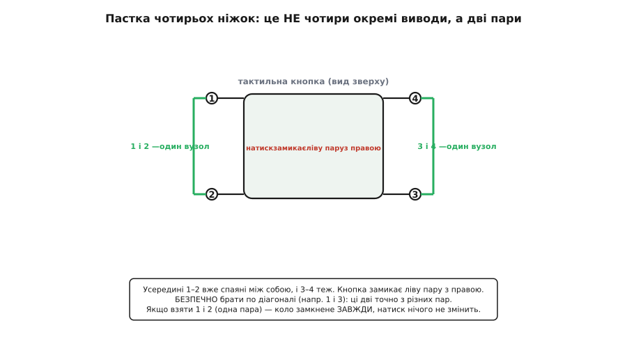
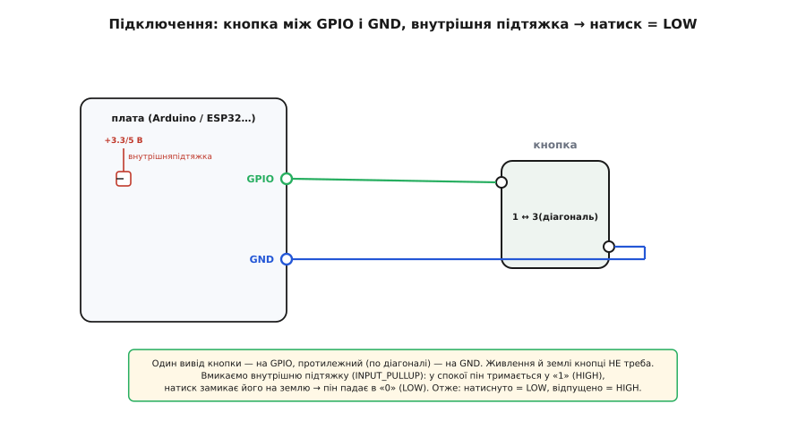

# Тактильні кнопки з ковпачками

<preknowlist>
- [GPIO](topic:hw-digital/gpio) — вивід мікроконтролера, який програмно роблять входом і читають на ньому «0» чи «1»; кнопку читають саме так.
- [Підтяжки](topic:hw-digital/floating-pullups) — резистор, що тримає вхід у певному стані, поки його ніхто активно не тягне; без підтяжки вхід із кнопкою «пливе» й читається сміттям.
- [Брязкіт контактів](topic:hw-digital/contact-debounce) — механічний контакт у мить замикання кілька разів відскакує, даючи пачку хибних перемикань за 1–10 мс; це буде на кожному натиску.
- [Рівні «0» і «1»](topic:hw-digital/logic-levels-as-ranges) — що вхід читає як HIGH, а що як LOW, і чому натиск дасть саме LOW при типовій схемі.
</preknowlist>

Ти натискав таку кнопку тисячі разів, навіть не думаючи про неї: увімкнув мишу, скинув лічильник на калькуляторі, розбудив монітор, викликав ліфт. Це маленький квадратний вимикач, що клацає під пальцем, — **тактильна кнопка** (англ. *tactile* — «дотиковий», бо натиск відчувається пальцем як чіткий поштовх). Її кладуть на кожну другу плату, де людині треба щось «натиснути», і саме її ти встромлятимеш у макетку, коли робитимеш свій перший «увімкни світлодіод кнопкою». Розберімо, з чого вона зроблена, звідки береться той приємний «клац», яка підступна дрібниця чекає на тебе з її ніжками — і як одну й ту саму кнопку зробити червоною, зеленою чи будь-якою іншою, надівши **ковпачок**.

## Що це і звідки «клац»

Перед тобою крихітний вимикач, типово **6×6 мм** заввишки кілька міліметрів, із квадратним пластиковим корпусом і **чотирма ніжками**, що стирчать по кутах під плату. Згори — рухомий **штовхач**, на який тиснеш. Це **момент-кнопка** (англ. *momentary* — «на мить»): вона замикає коло, лише **доки** її тримаєш, і сама відпускається, щойно прибереш палець. Не перемикач із фіксацією (натиснув — лишилось увімкнено), а саме миттєвий контакт.

Найцікавіше — усередині, і воно пояснює той характерний «клац». Під штовхачем сидить крихітний **металевий куполок** — пружна пластинка, вигнута вгору, як половинка кульки. У спокої вона стоїть дашком і **не торкається** двох нерухомих контактів під нею — коло розімкнене. Коли тиснеш, штовхач продавлює купол, і в певну мить той **різко пролускує** з опуклого стану у вгнутий — так, як прогинається всередину денце жерстяної банки. Цей стрибок і замикає контакти, і дає пальцю відчутний поштовх, і породжує тихий звук — усе водночас. Прибрав палець — пружний купол сам вискакує назад дашком, коло знову розмикається.


*Уся механіка — в одній пружній пластині. Спокій: купол дашком, коло розімкнене. Натиск: купол пролускує вниз, замикає два контакти й дає відчутний та чутний «клац». Це «пролускування» — те саме, що клацання денця жерстяної банки, тому відгук різкий, а не в'ялий.*

Саме за цей відгук клас і назвали. Різкий стрибок пружини замість плавного стискання — це **тактильний зворотний зв'язок**: палець *чує* момент спрацювання, тож не треба дивитися на екран, щоб знати, що натиск зарахований. Промислово ці кнопки пішли в широкий світ побутової й аудіотехніки з середини 1970-х (японська Alps випускає їх під торговою назвою *TACT Switch* із 1976 року й наробила їх уже понад сотню мільярдів) — і відтоді формат майже не змінився. *(Статус: усталено — датування й обсяг випуску за даними самого виробника.)*

> 🔧 **Навіщо це.** Клац — не забаганка, а надійність вводу. Кнопка без чіткого відгуку змушує людину тиснути «на віру» й перевіряти очима, чи спрацювало; на панелі приладу, у ліфті, на пульті це дратує й породжує подвійні натиски. Тактильний купол дає однозначне «спрацювало» пальцю — тому ці кнопки й стоять усюди, де людина керує наосліп чи поспіхом. Для тебе ж головне практичне: це найдешевший, найпростіший орган «натиснув — сталася подія», з якого починають майже всі проєкти.

## Пастка чотирьох ніжок

А тепер дрібниця, на якій спотикається кожен новачок, бо вона суперечить очевидному. Ніжок **чотири** — і здається природним, що це чотири окремі виводи. Насправді **ні**. Усередині корпусу вони спаяні попарно: дві ніжки з одного боку — це **один** вузол, дві з протилежного — **другий**. Тобто електрично в кнопки лише **два** виводи, просто кожен продубльований на дві ніжки.

Навіщо дублювати? З двох дуже практичних причин. По-перше, **механічне кріплення**: чотири ніжки, впаяні в плату, тримають кнопку набагато міцніше, ніж дві, — її не відламаєш пальцем при натиску. По-друге, **зручність розводки**: оскільки протилежні ніжки — той самий вузол, доріжку можна завести з одного боку, а зняти з іншого, «перестрибнувши» кнопкою через інші доріжки на платі без окремого містка.



*Чотири ніжки — це насправді дві пари. 1–2 вже спаяні між собою всередині, 3–4 теж. Натиск замикає ліву пару з правою. Візьмеш два виводи по діагоналі (як 1 і 3) — вони точно з різних пар, і кнопка працює. Візьмеш два з однієї пари (1 і 2) — коло замкнене завжди, натиск нічого не змінить.*

Звідси випливає **правило вибору ніжок**, і воно рятує години намарного пошуку «чому не працює». Бери два виводи **по діагоналі** — вони гарантовано з різних пар, і кнопка чесно розмикає та замикає коло. Якщо ж випадково під'єднатися до **двох ніжок однієї пари** (двох сусідніх з одного боку), коло виявиться замкненим **завжди**, ще до всякого натиску, — і кнопка просто не «працюватиме», хоч сама справна. Не впевнений у геометрії конкретної кнопки — задзвони тестером у режимі прозвонки: дві ніжки, між якими опір нуль **без натиску**, — це одна пара; бери по одній із кожної. Помилка тут нічого не спалює (кнопка — просто механічний контакт, без жодної електроніки), лише збиває з пантелику.

## Ковпачки: одне тіло — багато кнопок

Гола кнопка має тісний пластиковий штовхач — маленький і однаковий у всіх, натискати незручно й ніяк не підписати. Це розв'язує **ковпачок** (англ. *cap* — «ковпак, шапочка»): знімна кольорова кнопка, що просто **надівається на штовхач тертям**. Ковпачки бувають червоні, зелені, сині, жовті, білі, чорні; на них друкують стрілки, цифри чи піктограми. Хочеш «пуск» зелений, «стоп» червоний — береш ті самі кнопки й надіваєш різні ковпачки.

Головна вигода тут не косметична, а інженерна: **тіло кнопки лишається одне для всіх**. На плату йде однаковий вимикач, а зовнішній вигляд і напис задає ковпачок, який можна поміняти, не чіпаючи паяння. Тому у виробництві не тримають десяток різних кнопок — тримають одну кнопку й набір ковпачків.

Одна практична сумісність, про яку варто знати наперед. Круглі ковпачки для найпоширенішої кнопки **6×6 мм** мають отвір під штовхач діаметром близько **3.5 мм** — і сідають лише на кнопки з таким штовхачем. Є й більша кнопка **12×12 мм**, у якої штовхач квадратний, а ковпачки — прямокутні, іншого посадкового розміру. Ковпачки цих двох родин **не взаємозамінні**: перш ніж купувати шапочки, звір розмір кнопки й тип штовхача, інакше ковпачок або не налізе, або бовтатиметься. *(Статус: усталено — типові розміри за каталогами постачальників; конкретні міліметри залежать від серії.)*

> 🔧 **Навіщо це.** Ковпачки — це те, що перетворює однакові чорні квадратики на зрозумілу панель керування. Замість підписувати плату фарбою чи тримати склад різнокольорових кнопок, ставиш скрізь одну кнопку й «одягаєш» її під функцію: колір і символ ковпачка кажуть користувачеві, що робить кнопка. Для аматорського проєкту це ще й спосіб зробити акуратний вигляд без зусиль — рівні кольорові кнопки замість голих штовхачів.

## Підключення пін-у-пін

Підключати тут майже нема про що розповідати, і це чудово. Кнопка — **просто механічний контакт**: жодної електроніки, жодного живлення й землі їй не треба. Уся схема — два дроти: **один вивід кнопки на цифровий GPIO, протилежний (по діагоналі) — на землю (GND)**.

Але одразу постає питання: а що плата читатиме на цьому GPIO, поки кнопку **не** натиснуто? Якщо просто лишити пін входом, він **«висить»** — ні до чого не під'єднаний, ловить наводки й читається як випадкові «0» і «1». Тому вхід треба **підтягнути** до відомого рівня. Найзручніше — увімкнути **внутрішню підтяжку** до плюса, ту, що вже вбудована в мікроконтролер (`INPUT_PULLUP`), — жодного зовнішнього резистора.

Тепер логіка стає простою й трохи «перевернутою». Підтяжка легенько тримає пін у **HIGH** («1»), поки кнопку не чіпають. Натиск замикає пін на землю — і пін **падає в LOW** («0»), бо пряме з'єднання із землею перемагає слабку підтяжку. Отже:

```
відпущено → пін у HIGH («1»)   ← підтяжка тримає біля плюса
натиснуто → пін у LOW  («0»)   ← кнопка коротить пін на землю
```

Ця «перевернутість» (натиснуто = 0, а не 1) спершу дивує, але вона природна: підтягуєш до плюса, коротиш на землю. Саме так читають більшість кнопок у мікроконтролерах.



*Два дроти й нічого більше. Внутрішня підтяжка (INPUT_PULLUP) тримає пін у «1», поки кнопку не чіпають; натиск замикає пін на землю, і той падає в «0». Виводи кнопки беремо по діагоналі — щоб гарантовано з різних пар. Живлення й землі кнопці не потрібно: вона лише замикає ніжку на ніжку.*

Про напругу можна не турбуватися зовсім. Кнопка сама рівнів **не задає** — вона тільки з'єднує GPIO із землею, а земля однакова хоч на 5-вольтовій платі, хоч на 3.3-вольтовій. Тому та сама кнопка без змін працює і на Arduino Uno (5 В), і на [ESP32](topic:cat-hw-boards/esp32-family) (3.3 В): «0» на землі — це нуль вольтів усюди. Це вигідно відрізняє її від активних модулів, яким рівні часто доводиться узгоджувати.

## Читання в коді

Оскільки на піні — чисті цифрові рівні, «прочитати кнопку» — це один `digitalRead`. Ось найпростіший робочий скетч: кнопка вмикає й вимикає світлодіод.

**Умова.** Кнопка одним виводом на пін D2 Arduino Uno, протилежним — на GND. Світлодіод на D13. Натиск має перемикати світлодіод (увімк./вимк.).

:::tabs
```cpp
const uint8_t PIN_BTN = 2;    // вивід кнопки; другий вивід — на GND
const uint8_t PIN_LED = 13;

bool ledOn = false;           // поточний стан світлодіода
bool prev  = HIGH;            // попередній рівень піна (HIGH = відпущено)

void setup() {
  pinMode(PIN_BTN, INPUT_PULLUP);  // підтяжка до плюса: спокій = HIGH
  pinMode(PIN_LED, OUTPUT);
}

void loop() {
  bool now = digitalRead(PIN_BTN);        // LOW = натиснуто, HIGH = відпущено
  if (prev == HIGH && now == LOW) {       // спіймали перехід «відпущено → натиснуто»
    ledOn = !ledOn;                       // перемкнули стан на фронті натиску
    digitalWrite(PIN_LED, ledOn);
    delay(20);                            // груба пауза, щоб проскочити брязкіт
  }
  prev = now;
}
```
```micropython
from machine import Pin
import time

btn = Pin(2, Pin.IN, Pin.PULL_UP)   # підтяжка до плюса: спокій = HIGH
led = Pin(13, Pin.OUT)

led_on = False          # поточний стан світлодіода
prev = 1                # попередній рівень піна (1 = відпущено)

while True:
    now = btn.value()                   # 0 = натиснуто, 1 = відпущено
    if prev == 1 and now == 0:          # спіймали перехід «відпущено → натиснуто»
        led_on = not led_on             # перемкнули стан на фронті натиску
        led.value(led_on)
        time.sleep_ms(20)               # груба пауза, щоб проскочити брязкіт
    prev = now
```
:::

Зверни увагу на два місця. Перше: ми ловимо не «пін у LOW», а саме **перехід** з HIGH у LOW — інакше, поки палець тримає кнопку, `loop` промчить тисячі разів і світлодіод шалено миготітиме замість одного перемикання. Друге, важливіше: рядок `delay(20)`. Контакти кнопки [**брязкають**](topic:hw-digital/contact-debounce) — у мить замикання пружний метал кілька разів відскакує, і за перші 1–10 мс пін устигає стрибнути «0-1-0-1» пачку разів. Наївний код без паузи порахував би цю пачку за кілька натисків: один тиск — а світлодіод перемкнувся двічі й лишився як був. Груба пауза після спрацювання пропускає брязкіт повз.

> 🔧 **Навіщо це.** `delay(20)` — найпростіші, але грубі ліки: він заодно гальмує всю програму на 20 мс, а це погано, коли поряд крутяться інші справи. Надійніше гасити брязкіт **за часом**, не спиняючи цикл: запам'ятати мить останньої зміни й зараховувати натиск, лише коли рівень протримався стабільним кілька мілісекунд. Готовий прийом, чому саме так і як це написати без єдиного `delay`, — у темі про [брязкіт контактів](topic:hw-digital/contact-debounce) та її [приклад-нотатці про антибрязкіт кнопки](topic:hw-digital/contact-debounce/comp-tact-button.md), де ця сама тактова кнопка розібрана як узагальнений клас.

## Де це стоїть і що винести

Тактильні кнопки — найпоширеніший орган «натиснути» взагалі: скидання й режими на платах, панелі приладів, пульти, іграшки, клавіші пристроїв. З тих самих кнопок складають і сітки: [матрична клавіатура 4×4](topic:cat-hw-controls/keypad-4x4-tactile) — це рівно шістнадцять таких кнопок на одній платі, з'єднаних сіткою «рядок × стовпець». Коли кнопку хочуть на готовій платці з уже впаяним резистором і зручними штирями — беруть [KY-004](topic:cat-hw-controls/ky-004-button), той самий вимикач, доведений до «встромив три дроти й читай».

Головне, що варто винести. Тактильна кнопка — це **момент-контакт із пружним куполом**, що клацає при натиску й сам відпускається; клац — не звук заради звуку, а відчутний сигнал «спрацювало». Її чотири ніжки — насправді **дві пари**, спаяні всередині, тож виводи бери **по діагоналі**, інакше коло замкнене завжди. Живлення їй не треба — це просто замикання ніжки на ніжку; читаєш через `INPUT_PULLUP`, де **натиснуто = LOW**, а брязкіт **гасиш у коді**. А колір і напис кнопки задає знімний **ковпачок**: одне тіло кнопки на плату — будь-яка «шапочка» зверху, аби збігся розмір штовхача. Це та цеглинка вводу, з якої починається майже кожен проєкт, — і, розібравшись у ній до кінця, ти впізнаєш ту саму механіку в кнопці миші, клавіші пульта й скиданні на будь-якій платі.
