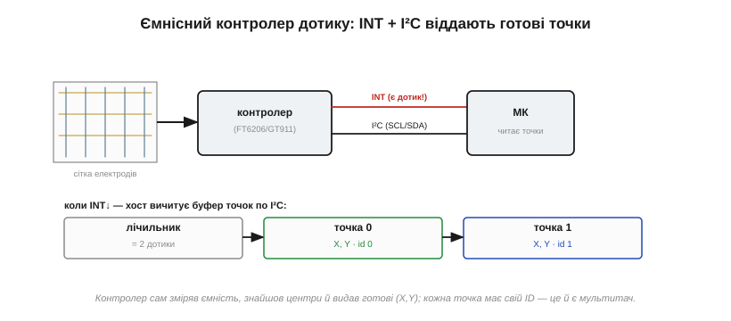

# 🔌 Ємнісні контролери дотику FT6206/GT911-класу: I²C і мультитач

### Що це за клас

Це спеціалізовані **контролери ємнісного дотику** (capacitive touch controller; канонічні приклади — **FT6206/FT6236** і **GT911**), які сидять просто на шлейфі сенсорної панелі, ведуть і слухають сітку електродів, ловлять зміни [ємности](topic:ph-electromagnetism/capacitance) в одиниці фемтофарад, знаходять центри дотиків і віддають мікроконтролерові готові координати по [I²C](topic:com-devices/i2c-bus). Уся «важка» аналогова робота — всередину чипа; хост лише читає результат.

Щоб зрозуміти, навіщо взагалі окремий чип і чому хост сам цього не зробить, треба спершу побачити, який крихітний сигнал тут вимірюється. Саме мізерність зміни ємности — корінь усього: і складности аналогової частини, і чутливости до шуму, і потреби в калібруванні. Усе інше випливає з цієї фізики поля.

### Фізика: чому дотик — це зміна ємности в фемтофаради

Палець не замикає жодного контакту й нічого не натискає механічно. Він просто **відводить частину електричного поля** на себе. Щоб побачити, чому це працює, уявімо один електрод сітки. Контролер періодично заряджає його й дивиться, скільки заряду на ньому втримується, — тобто міряє його ємність відносно землі. Поки над електродом нічого немає, ця ємність — якесь стале фонове значення (паразитна ємність доріжки, скла, сусідів). Щойно над ним зʼявляється палець, картина змінюється, і саме цю зміну чип і ловить.

Тут важливо розрізнити **дві схеми**, бо вони дають протилежний знак зміни.

У схемі **self-capacitance** (власна ємність) контролер міряє ємність електрода відносно землі. Палець — це провідник, заземлений через тіло людини; піднесений до електрода, він додає паралельну ємність «електрод → палець → земля». Загальна ємність **зростає**. Це проста й чутлива схема, але вона погано розрізняє кілька одночасних дотиків (звідси «два пальці» у FT6206-класі).

У схемі **mutual-capacitance** (взаємна ємність) є дві окремі сітки — рядки-передавачі (Tx) і стовпці-приймачі (Rx). На перетині кожного рядка зі стовпцем утворюється крихітний конденсатор: поле йде від Tx до Rx крізь скло. Палець, піднесений до перетину, **перехоплює** частину цих силових ліній на себе й на землю — і до Rx доходить **менше** заряду. Тобто взаємна ємність у точці дотику **падає**. Платою є те, що кожен вузол сітки адресується окремо (рядок × стовпець), тому схема бачить багато незалежних дотиків одночасно — звідси справжній мультитач GT911-класу на пʼять і більше пальців.

Тепер про порядок величин, бо саме він пояснює, чому це окремий аналоговий чип. Фонова ємність вузла — десятки пікофарад (1 пФ = 10⁻¹² Ф). Палець змінює її лише на **одиниці фемтофарад** (1 фФ = 10⁻¹⁵ Ф), тобто на тисячні частки від фону:

```
C_фон   ≈ 10 пФ      = 10 000 фФ
ΔC_палець ≈ 1…10 фФ
відносна зміна ≈ ΔC / C_фон ≈ 1…10 / 10 000 ≈ 0.01…0.1 %
```

Виміряти **0.01–0.1 %** зміни ємности на тлі електромагнітного шуму від самого ж дисплея, від мережі 50/60 Гц, від заряджання — це задача, заради якої й існує контролер. Усередині нього — генератор-збудник, синхронний детектор/інтегратор заряду й [АЦП](topic:hw-analog/adc), що накопичує сигнал за багато циклів, аби витягти ці фемтофаради з-під шуму. Жоден GPIO мікроконтролера такого не вміє; саме тому фізику віддали окремому кристалу.

> 🔧 **Навіщо це.** Коли дотик «не ловиться» крізь товсте захисне скло або в рукавичці, причина саме тут: ΔC і так фемтофарадна, а зайвий зазор чи діелектрик додатково послаблює зв'язок «палець–електрод». У конфізі контролера тому є поріг чутливости й коефіцієнт підсилення — їх піднімають під товсте скло й опускають, коли сітка ловить хибні дотики від шуму.

### Плата й розпіновка

На сенсорній панелі — прозора сітка електродів з **ITO** (indium tin oxide, оксид індію-олова): це провідник, що пропускає світло, тому доріжки сітки можна покласти прямо поверх екрана, не затуляючи його. Контролер часто посаджений прямо на шлейф (кристал на плівці, COF). Назовні, до хоста, він виставляє небагато: **VCC**, **GND**, **SCL**, **SDA** (шина I²C), **INT** (переривання — «є нові дані») і **RST** (скидання).


*Контролер сам опитує сітку. Знайшовши дотик, він смикає лінію INT, а хост по I²C вичитує буфер: спершу лічильник дотиків, потім для кожного — координати X, Y та ідентифікатор пальця. Готові точки, жодної аналогової мороки на боці МК.*

### Як ITO-сітка перетворюється на координати

Сама собою ITO-сітка дає лише набір «сирих» значень ємности по електродах — а хост хоче дві цілі координати (X, Y) у пікселях. Проміжок між цими двома світами і є друга велика робота контролера, і саме вона пояснює, звідки взагалі беруться X і Y.

Електроди сітки покладені двома напрямками: одна група йде вздовж осі X (визначає горизонталь дотику), друга — вздовж осі Y (вертикаль). Палець ніколи не накриває рівно один електрод — його «пляма» зачіпає **кілька сусідніх** ліній з різною силою: точно під центром пальця ΔC найбільша, по краях — менша, далі сходить нанівець. Виходить такий собі «горб» сигналу по сусідніх електродах.

Координату контролер знаходить як **центр ваги** (centroid) цього горба — зважене середнє позицій електродів, де вагою є виміряна ΔC кожного. Покажемо на одному напрямку. Хай палець засвітив три сусідні X-електроди з однаковим кроком між ними, а їхні відгуки — ΔC:

```
електрод:   X=40    X=50    X=60      (позиції, умовні од.)
ΔC:          8       20       6       (сила відгуку)

центр = Σ(позиція·ΔC) / Σ(ΔC)
      = (40·8 + 50·20 + 60·6) / (8 + 20 + 6)
      = (320 + 1000 + 360) / 34
      = 1680 / 34
      ≈ 49.4
```

Хоча електроди стоять із кроком 10 одиниць, центр ваги дав **49.4** — між вузлами сітки. Саме завдяки цій інтерполяції контролер видає координату **тонше за крок сітки**: фізичних електродів десятки, а роздільність по виходу — сотні «кроків». Так само рахується Y по другій групі електродів, і пара (X, Y) і є готова точка дотику. Тому в буфері лежать саме цілі X та Y, а не сирі ємности: важку математику центроїда чип уже зробив усередині.

### Підключення

Живлення — 3.3 В (інколи 1.8 В), на лінії I²C — підтяжки (контролер дотику ділить шину з іншими пристроями, але має **свою** адресу, окрему від дисплея). Лінію **INT** заводять на вхід-[переривання](topic:hw-arch/interrupts) мікроконтролера, **RST** — на звичайний вивід, щоб коректно скинути чип при старті. Чому RST окремою лінією, а не просто «висить»: у GT911-класі рівень RST разом з INT у момент відпускання скидання **задає I²C-адресу**, тож хост мусить керувати обома навмисно, а не лишати на волю підтяжок.

### Як заговорити: читання по перериванню

Модель проста й типова. Доки пальців немає, контролер мовчить — і це навмисно: він не смикає хост даремно, поки немає чого віддавати, тому МК може спати. Щойно зʼявився дотик, він смикає **INT**, і хост іде читати його [регістри](topic:com-devices/register-map) по I²C: спочатку реєстр кількости точок, далі для кожної точки — байти координат X і Y (старший/молодший) та прапорці події (дотик/відпускання/рух) і **ID** пальця. Координати — це вже готовий результат центроїда (зважений центр ваги сигналу по електродах), а не сирі ємности. Наприклад, у FT6206-класі це реєстр лічильника й слідом блоки по кілька байтів на точку; у GT911-класі — статусний реєстр і буфер точок (після читання прапорець «дані готові» треба скинути, інакше чип вважатиме, що ви ще не забрали попередню порцію). Прочитав — і маєш готові координати, які лишається тільки накласти на свій інтерфейс.

**Worked example: читання однієї точки з FT6206-класу по I²C.**
Хост дістав переривання на INT і читає буфер дотику. Координати лежать у двох байтах кожна, причому старші біти старшого байта зайняті прапорцями події, тому їх треба замаскувати:

:::tabs
```c
// ESP32, I²C вже ініціалізовано. Адреса FT6206-класу — 0x38.
#define TS_ADDR     0x38
#define REG_NUM     0x02   // кількість активних точок
#define REG_P1_XH   0x03   // далі XH, XL, YH, YL для точки 1

uint8_t buf[5];
i2c_read(TS_ADDR, REG_NUM, buf, 5);    // читаємо лічильник + 4 байти точки

uint8_t touches = buf[0] & 0x0F;        // молодші 4 біти — кількість дотиків
if (touches > 0) {
    // XH: біти 7..6 — прапорець події, біти 3..0 — старші біти X
    uint16_t x = ((buf[1] & 0x0F) << 8) | buf[2];
    uint16_t y = ((buf[3] & 0x0F) << 8) | buf[4];
    // тепер (x, y) — сирі координати контролера
}
```
```micropython
# MicroPython, i2c = machine.I2C(...) уже створено. Адреса FT6206-класу — 0x38.
TS_ADDR = 0x38
REG_NUM = 0x02   # кількість активних точок
REG_P1_XH = 0x03  # далі XH, XL, YH, YL для точки 1

buf = i2c.readfrom_mem(TS_ADDR, REG_NUM, 5)  # лічильник + 4 байти точки

touches = buf[0] & 0x0F               # молодші 4 біти — кількість дотиків
if touches > 0:
    # XH: біти 7..6 — прапорець події, біти 3..0 — старші біти X
    x = ((buf[1] & 0x0F) << 8) | buf[2]
    y = ((buf[3] & 0x0F) << 8) | buf[4]
    # тепер (x, y) — сирі координати контролера
```
:::

```
маска X: (0x0F << 8) | XL   → 12 значущих біт → діапазон 0…4095
для панелі 320×480 типово: x ∈ 0…319, y ∈ 0…479
```

Чому маска `0x0F`, а не повний байт: у старшому байті фізично лише чотири молодші біти несуть координату, а два старших — це код події (натиск / відпускання / контакт). Забув замаскувати — і при відпусканні пальця координата X раптом «стрибне» на кілька тисяч, бо в старші біти просочився прапорець. Це класична причина «привидів» на краю екрана.

### Мультитач

Саме звідси береться мультитач: контролер віддає **кілька** точок за раз (FT6206-клас — близько двох, GT911-клас — пʼять і більше), і кожна несе свій **ID**. Чому одні чипи бачать два пальці, а інші пʼять, — пряме наслідок схеми вимірювання: self-capacitance плутає кілька дотиків (вони зливаються в проєкціях на осі), а mutual-capacitance адресує кожен вузол сітки окремо й тому розрізняє багато незалежних плям. Завдяки ID хост відстежує той самий палець між послідовними читаннями — і може скласти жест на кшталт щипка, бо знає, котра точка куди поїхала. Без ID два пальці, що зближуються, неможливо було б відрізнити від двох, що міняються місцями.

### Типові граблі

- **Адреса на старті.** У GT911-класі адресу I²C обирають **рівнями ліній INT і RST у момент скидання** — це навмисний механізм: чип читає INT/RST під час підняття скидання й фіксує адресу (типово 0x5D або 0x14). Переплутав timing — і чип на іншій адресі або німий. Класична перша морока саме тому, що адреса залежить не від конфігу, а від поведінки двох ліній у вузькому вікні старту.
- **Polling проти INT.** Лінію INT можна налаштувати на короткий імпульс чи утримання рівня; як саме — задають у конфігу, інакше переривання «не ловиться» (фронт, на який налаштований МК, не збігається з тим, що дає чип).
- **Координати не збігаються з екраном.** (X, Y) дотику часто треба **перевернути чи поміняти місцями**, щоб збіглися з орієнтацією дисплея — бо нуль осі сітки фізично може лежати в іншому куті, ніж нуль дисплея, а при повороті екрана X і Y взагалі міняються ролями. Інакше палець ліворуч, а курсор праворуч.
- **Конфіг під панель.** Контролер треба налаштувати під конкретний сенсор (розміри сітки, поріг чутливости, підсилення, відсікання води) — і це прямо випливає з фемтофарадної фізики: та сама ΔC при іншому склі чи іншій сітці дає інший сирий сигнал. Дешевий «поставив і працює» тут радше виняток.
- **Спільна I²C.** Конфлікт адрес із дисплеєм чи іншим пристроєм на тій самій шині — німий дотик.

### Варіації класу

Для більших панелей і більшої кількости пальців беруть **FT5x06** (пʼять і більше точок) чи старші **GT9xx** (Goodix) — усі вони працюють на mutual-capacitance, тому й тримають багато точок. А найзручніше — **комбіновані** модулі, де на одному шлейфі і [дисплей зі своїм контролером](topic:hw-motion/display-controller), і дотик, кожен зі своєю I²C-адресою: під'єднав одну шину — маєш і екран, і сенсор.

> 🔧 **Навіщо це.** Ємнісний контролер FT6206/GT911-класу віддає готові дотики: він ловить фемтофарадну зміну ємности (ΔC ≈ 1–10 фФ на тлі ~10 пФ фону), рахує центр ваги по ITO-сітці й кладе в буфер уже цілі (X, Y, ID). INT будить хост, той по I²C читає лічильник і блоки точок. Три перевірки на старті: правильна **адреса** (у GT911 її задають рівні INT/RST при скиданні), збіг **координат** з орієнтацією дисплея (інколи треба перевернути осі та замаскувати прапорцеві біти) і окрема **адреса** на спільній I²C. Мультитач — задарма: кожна точка має ID, лишилось зібрати з них жести.
