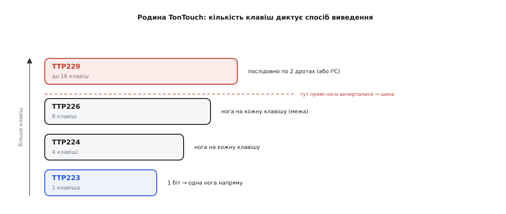

# 📜 Як кнопка стала краплею припою: Tontek і родина TonTouch

Є речі настільки буденні, що ім'я їхнього автора стирається геть. Купуєш сенсорну кнопку — синеньку пластинку з квадратиком міді, яку в крамницях звично підписують «для Arduino», хоч самій платці байдуже, що з нею з'єднано: назовні вона віддає звичайний цифровий рівень, який однаково читає і Arduino, і ESP32, і STM32, і Raspberry Pi. Гуглиш «TTP223», за секунду маєш цоколівку, приклад коду й десяток форумних гілок. Усе працює, звідки б платка не приїхала. І майже ніхто не спиняється спитати: а що це за чотири літери й одне число? Хто зробив ту крихітну мікросхему, завдяки якій механічна кнопка з пружиною й контактами перетворилася на квадратик міді під лаком? І чому саме **ця** мікросхема, а не котрась із десятка схожих, стала тим, що аматор бере не думаючи?

Ця розповідь — про тайванську фірму, чиєї назви більшість власників тих синіх платок ніколи не чули, і про одне тихе інженерне рішення, яке зробило дотик дешевим. Драми тут менше, ніж в історії транзистора, зате видно рідкісну річ: **як складна аналогова задача — виміряти пікофарадну зміну ємності від пальця — спакувалася в корпус завбільшки з рисове зерно й розчинилася у звичці.** І як усередині однієї родини мікросхем один-єдиний, найдешевший її представник обійшов усіх родичів і став для хобі синонімом самого поняття «сенсорна кнопка».

## Компанія, якої не видно: Tontek Design Technology

Почнімо з винуватця. На корпусі мікросхеми стоїть «TTP223», на модулі — часом нічого крім цього рядка. Автор ховається за трьома літерами префікса: **TT** — це **Tontek**.

**Tontek Design Technology Ltd.** (кит. 通泰積體電路) — тайванська компанія з проєктування мікросхем, заснована **1986 року**, зі штаб-квартирою в місті Нова Тайбей (New Taipei City). Вона торгується на тайванській позабіржовій площадці TPEX під тікером **5487**; це невелика фірма — близько сімдесяти працівників. *(Рік заснування, місце й тікер збігаються в кількох незалежних бізнес-довідниках — статус: усталено.)* Тобто це не «якийсь безіменний Китай наштампував», як часто думають про дешеві платки, а конкретний тайванський **дизайн-хаус** зі своєю історією, який проєктує кремній уже майже сорок років.

Слово «дизайн-хаус» тут не випадкове й багато пояснює. Tontek не володіє власним заводом-фабрикою, що плавить кремній, — вона **проєктує** мікросхеми, а виготовлення замовляє на чужих потужностях. Така модель називається **fabless** (англ. *fab-less* — «без фабрики»): фірма тримає в себе найдорожче й найрозумніше — інженерів-схемотехніків, — а капіталомістке виробництво пластин віддає спеціалізованим ливарням. Для Тайваню це рідна стихія: саме там стоять найбільші контрактні ливарні світу, тож дрібному дизайн-хаусу не треба будувати завод за мільярди — досить придумати гарну схему й замовити тираж. Ось чому крихітна фірма на сімдесят людей може постачати мікросхеми мільйонними партіями по всьому світу.

> 🔧 **Навіщо це.** Розуміти, що за дешевою платкою стоїть fabless-дизайн-хаус, а не «безликий завод», — це та сама звичка розрізняти ідею, реалізацію й виробництво, що рятує від легенд у великій історії техніки. Схему TTP223 хтось конкретний **придумав** (Tontek, Тайвань), її фізично **виготовляє** чужа ливарня, а на модуль її **розпаює** вже третя сторона десь у Шеньчжені. Три різні ролі, три різні місця — і плутати їх означає приписувати заслугу або провину не тому, хто причетний.

Каталог Tontek насправді ширший, ніж може здатися по одній сенсорній кнопці. Фірма робить мультимедійні мікросхеми (звукові процесори, дрібну пам'ять, чипи для простих ігор), давачі температури й пульсу, драйвери світлодіодів, енергоощадну автоматику на пасивних інфрачервоних давачах руху — і **серію сенсорних контролерів дотику**. Саме остання зробила ім'я Tontek упізнаваним у світі хобі-електроніки, хоч самого імені ніхто й не запам'ятав. І в цієї серії є власна торгова назва.

## TonTouch: коли кнопку роблять мікросхемою

Серія сенсорних контролерів Tontek носить марку **TonTouch™** (гра слів: *Ton*(tek) + *touch* — дотик). Це ім'я не побачиш на дешевому модулі й не почуєш у форумній розмові — воно живе лише у фірмових документах. Відкрий будь-який офіційний даташит Tontek на цю мікросхему — і в шапці, поряд із номером, стоятиме саме `TonTouchTM`. Тобто «TTP223» — це номер конкретної моделі, а «TonTouch» — назва всього сімейства, до якого вона належить, як «Core» у Intel чи «Ryzen» у AMD. *(Марку TonTouch™ видно в шапці офіційних даташитів Tontek на TTP223, TTP229 та інші моделі серії — статус: усталено.)*

Тепер — головна ідея, заради якої ця історія й пишеться. Що взагалі означає «зробити кнопку мікросхемою»?

Уяви, що тобі треба зробити сенсорну кнопку **самотужки**, без готового чипа. Фізика проста й відома: палець поруч із мідною пластинкою трохи збільшує її [ємність](root:ph-electromagnetism/capacitance) — здатність тримати заряд. Але «трохи» тут — це одиниці пікофарад (10⁻¹² Ф) на тлі власної ємності пластинки, теж мізерної. Виміряти таку крихітну зміну — задача геть не тривіальна. Треба збудувати генератор, чия частота чи час заряду залежать від ємності; треба цю залежність оцифрувати; треба відрізнити справжній дотик від дрейфу, бо ємність пластинки повзе сама собою — від вологи, тепла, налиплого пилу; треба поставити поріг і весь час його підстроювати під цей дрейф, інакше кнопка з ранку до вечора то «залипатиме», то глухнутиме. Загальний принцип цього вимірювання — окрема тема; його розібрано у статті про [ємнісне зондування](root:hw-sensing/capacitive-sensing), і сам по собі він не простий.

Зробити все це на розсипу — генератор, компаратор, підстроювальний гвинтик, логіка автопідлаштування — можливо, але виходить ціла плата, яку треба налагоджувати щоразу заново. І ось що зробив TonTouch: **усе це — генератор-вимірювач ємності, вузол автокалібрування, поріг, логіку виходу — сховали в один кремнієвий кристал** розміром із рисове зерно. Ззовні лишилися три речі: дві ноги живлення, одна нога на пластинку, одна на вихід. Складна аналогова робота зникла всередину; назовні вийшла кнопка.

> 🔧 **Навіщо це.** Ось у чому справжня новина TonTouch — і чому це історія, а не просто «ще один чип». Цінність не в новому *принципі* (ємнісне зондування знали задовго до Tontek), а в **інтеграції**: узяти купу аналогової мороки й спакувати її так, щоб зовні лишилася тривіальна річ. Той самий тип перемоги, що й у багатьох поворотних мікросхем, — не «придумали нове явище», а «зробили відоме явище дешевим і зручним настільки, що ним може скористатися будь-хто, нічого не знаючи про його нутрощі». Механічна кнопка з пружиною коштувала копійки; TonTouch зробив так, що й **безконтактна** кнопка стала коштувати копійки — і тоді сенс лишати механіку зник у цілих класах приладів.

Наслідок цього видно всюди, де торкаються скла замість того, щоб тиснути клавішу: кухонна плита з гладкою панеллю без жодної дірки, кнопки на витяжці, сенсорний вимикач світла, панель у душовій, медичний прилад, який треба мити цілком. Скрізь, де інженер хотів кнопку без рухомих частин під суцільною поверхнею, TonTouch (чи його прямі конкуренти — а їх теж багато) давав готову відповідь: приклей мідну пластинку, заведи її на одну ногу мікросхеми — і маєш кнопку, яку не видно й нема чого зношувати.

## Родина за числом клавіш

TonTouch — не одна мікросхема, а сімейство, і влаштоване воно навдивовижу логічно. Різні його представники відрізняються насамперед **однією віссю: скільки сенсорних клавіш обслуговує один чип.** Що більше клавіш — то більше треба виводити, то складніший спосіб віддати результат назовні. Проглянемо цю драбину знизу вгору — вона добре показує, чому TTP223 займає в родині особливе місце.

**TTP223 — одна клавіша.** Найпростіший представник: один сенсорний вхід, один цифровий вихід. Торкнувся пластинки — на нозі рівень. Виводити нема чого хитрого: один біт віддається однією ногою напряму. Саме ця крайня простота — і мінімальний корпус — зробили TTP223 таким дешевим.

**TTP224 — чотири клавіші.** Чотири сенсорні входи, чотири окремі виходи. Ще можна дозволити собі «одна клавіша — одна нога виходу»: чотири біти — чотири ноги, читаються так само прямо, як в одноклавішного.

**TTP226 — вісім клавіш.** Вісім входів, вісім виходів. Це вже межа зручного «пряме виведення»: восьми ніг тільки на виходи — багато, корпус росте, а мікроконтролеру треба вісім своїх входів, щоб усе прочитати.

**TTP229 — до шістнадцяти клавіш.** Тут прямим виведенням уже не обійтися: шістнадцять окремих ніг — це задорого й за корпусом, і за виводами мікроконтролера. Тому TTP229 віддає результат **послідовно**: замість «нога на кожну клавішу» він по двох дротах (такт і дані) передає стан усіх клавіш одне за одним, а мікроконтролер їх зчитує. Є й варіант із виведенням по стандартній двопровідній шині [I²C](root:com-devices/i2c). Один чип, шістнадцять клавіш, а дротів до мікроконтролера — жменька.

Ось ця сама драбина, від однієї клавіші до шістнадцяти, і перелом на TTP229, де прямі ноги поступаються послідовній передачі:


*Одна вісь упорядковує сімейство — скільки клавіш на чип. Знизу вгору росте кількість клавіш і разом із нею — спосіб віддати результат: від «один біт однією ногою» (TTP223) через «нога на клавішу» (TTP224, TTP226) до послідовної передачі всіх клавіш по двох дротах (TTP229). Пунктир на TTP229 — перелом: прямі ноги вичерпалися, далі тільки шина.*

Ця логіка «кількість клавіш диктує спосіб виведення» — не примха Tontek, а загальна закономірність. Поки виходів мало, найпростіше дати кожному свою ногу: читати легко, коду нуль. Коли виходів багато, ноги стають дефіцитом — і вигідніше витратити один раз зусилля на послідовний протокол, зате звести дроти до пари. Той самий вибір «багато прямих ліній проти одного розумного каналу» повторюється в електроніці постійно, від клавіатур до дисплеїв; родина TonTouch показує його в мініатюрі, на одній зрозумілій осі.

> 🔧 **Навіщо це.** Практичний висновок для того, хто обирає чип під свій пристрій: **рахуй клавіші наперед і бери відповідного члена родини.** Одна кнопка «увімк/вимк» під панеллю — TTP223, дешево й без коду. Маленька панель на чотири-вісім сенсорів (умовна варильна поверхня) — TTP224 чи TTP226, ще пряме читання. Повноцінна сенсорна клавіатура на дюжину-півтори клавіш — TTP229 з послідовним виведенням, бо ноги інакше скінчаться. Знати цю драбину — значить не тягти зайвого мікроконтролера туди, де вистачить одного чипа, і не мучитися з шістнадцятьма дротами там, де достатньо двох.

## Чому саме TTP223 став народним

І ось тут — головна інтрига всієї історії. У родині чотири (а насправді й більше — є ще TTP232 на дві клавіші й інші) представники. Але коли аматор каже «сенсорна кнопка», він майже завжди має на увазі саме **TTP223**. Не TTP224, не TTP229 — саме одноклавішний TTP223 став для хобі-електроніки де-факто стандартом, синонімом самого поняття. Чому переміг найпростіший?

Причина перша й головна — **корпус і ціна**. Найпоширеніший TTP223 приходить у корпусі **SOT-23-6** — крихітний шестиногий прямокутник завбільшки менше сірникової голівки. Це один із найдешевших і найтехнологічніших корпусів узагалі: мало виводів, крихітна площа кремнію (одна клавіша не потребує складної логіки), мінімум матеріалу. Одноклавішний чип у такому корпусі коштує центи. Модуль на його основі — трохи більше, але все одно копійки. Для новачка, який хоче «просто спробувати сенсорну кнопку», ціновий поріг практично нульовий.

Причина друга — **достатність однієї клавіші**. Переважна більшість аматорських задач із дотиком — це саме **одна** кнопка. Увімкнути світлодіодну стрічку. Перемкнути режим. Розбудити пристрій. Дати сигнал мікроконтролеру. Для всього цього не треба ні чотирьох, ні шістнадцяти клавіш — треба одна. TTP223 покриває цю найчастішу потребу рівно й без надлишку: один вхід, один вихід, жодного протоколу для читання — вихід заходить прямо в цифрову ногу будь-якого мікроконтролера, і далі це або опитування рівня, або переривання на фронт (у Arduino це `digitalRead` та `attachInterrupt`, в ESP-IDF — `gpio_get_level` та `gpio_isr_handler_add`, у STM32 HAL — `HAL_GPIO_ReadPin` та `HAL_GPIO_EXTI_Callback`).

Причина третя, і саме вона перетворює «дешевий і достатній» на **стандарт**, — **мережевий ефект документації**. Щойно в мережі назбиралася критична маса гайдів, відео й прикладів коду під конкретний номер «TTP223», сам цей номер став цінністю, незалежною від виробника модуля. Новому продавцеві сенсорних платок невигідно ставити рідкісніший чип: тоді на його товар не знайдеться готових прикладів. Вигідно навпаки — узяти рівно **TTP223**, бо на нього вже є вся гора чужих гайдів, і вона автоматично працюватиме й на його модуль. Стандарт закріплював сам себе: що більше людей ним користувалося, то дорожче було з нього виходити й то дешевше — приєднуватися. Точно той самий механізм, яким колись ставали неписаними стандартами розмір гвинта чи ширина колії, тільки стиснутий у кілька років і в один сегмент хобі.

```
у родині TonTouch:          у хобі-електроніці:

TTP229  (16 клавіш)         │
TTP226  (8 клавіш)          │   переміг найпростіший:
TTP224  (4 клавіші)         │   TTP223 = «сенсорна кнопка»
TTP223  (1 клавіша)  ───────┘   (дешевий корпус + достатність
                                 однієї клавіші + гора гайдів)
```

Тут важливо не переплутати дві різні «перемоги». У **промисловості** кожен член родини має своє законне місце: хто робить сенсорну клавіатуру, візьме TTP229, і для нього «народний» саме він. А от у **хобі**, де задача майже завжди — одна кнопка, а ціна й наявність прикладів вирішують усе, беззастережно переміг TTP223. Це не «TTP223 кращий за TTP229» — це «TTP223 точніше влучив у найчастішу аматорську потребу». Найпростіший інструмент виграє не тому, що досконаліший, а тому, що частіше саме він і потрібен.

> 🔧 **Навіщо це.** Звідси — практична порада, дзеркальна до історії KY-модулів: **шукай по номеру чипа, а не по бренду модуля.** Якщо тобі в руки потрапила синя сенсорна платка, не має значення, чиє на ній лого й чи є воно взагалі, — важливо, що на кристалі написано «TTP223». Уся мережа документації світу відкривається цим номером, бо всі складачі модулів ставлять один і той самий чип і копіюють один одного до дрібниць. Ім'я виробника платки сьогодні майже декоративне; ім'я чипа — ключ до всього.

## Що з цієї історії варто винести

Може здатися, що це розповідь про дешеву синеньку платку — дрібниця, не варта окремої історії. Насправді в ній сходиться кілька уроків, ширших за долю однієї мікросхеми.

Перший — **справжня новина часто в інтеграції, а не в принципі**. Ємнісне зондування дотику знали задовго до Tontek; фізика пальця біля пластинки — стара. Поворот зробило не нове *явище*, а вдале *пакування*: сховати всю аналогову мороку в один крихітний кристал так, щоб зовні лишилася тривіальна кнопка на три-чотири ноги. Це часта картина в історії техніки — перемагає не той, хто перший описав ефект, а той, хто перший зробив його дешевим і невидимим для користувача. Транзистор змінив світ не в лабораторії, а на конвеєрі; сенсорна кнопка — так само, коли вся її складність з'їхала в SOT-23-6.

Другий — **найпростіший член родини часто й перемагає, коли ціль масова**. Родина TonTouch логічно розкладена за кількістю клавіш, і кожен її представник по-своєму розумний. Але масовий аматорський ужиток витягнув нагору саме крайню, найдешевшу, найпростішу ланку — одноклавішний TTP223, — бо вона рівно влучила в найчастішу потребу й мала найнижчий поріг ціни. Це корисно пам'ятати ширше: коли обираєш під власний проєкт, питай не «що найпотужніше в лінійці», а «що найточніше під мою реальну задачу» — і часто відповіддю буде найскромніший варіант.

Третій — **звичка розкладати твердження по полицях доказовості**, корисна далеко за межами цієї теми. У межах однієї короткої історії ми маємо і тверді факти з документів (Tontek заснована 1986-го, Тайвань, тікер 5487; марка TonTouch™ у шапці офіційних даташитів; TTP229 віддає до шістнадцяти клавіш послідовно), і загальну закономірність, виведену з принципу (кількість клавіш диктує спосіб виведення), і чесно названий механізм популярності (мережевий ефект документації — спостережуваний, а не міфічний). Розкладати будь-яке твердження по цих полицях, а не вірити гуртом усьому, що «всі знають», — та сама дисципліна, що рятує від імперських «хто-перший»-легенд у великій історії науки.

І наостанок — практичне. Тримаючи в руці синю сенсорну платку за копійки, ти тримаєш кінцеву точку тихого ланцюга: тайванський дизайн-хаус, що майже сорок років проєктує кремній; вдале рішення спакувати складне ємнісне вимірювання в рисове зерно корпусу; логічна родина, розкладена за числом клавіш; і масовий ужиток, що витягнув нагору найпростішого її представника. Дешевина в руці — не випадковість і не «просто наштампували». Це слід конкретного інженерного вибору конкретної фірми, який спрацював аж настільки добре, що і сам чип, і його автор стали невидимими.
