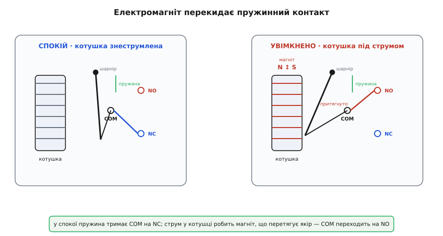
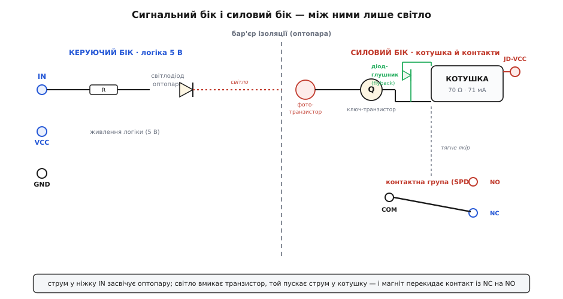
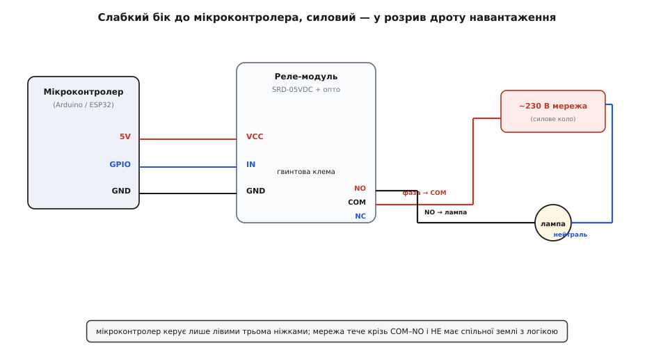

# 5V реле-модуль (Songle SRD-05VDC)

<preknowlist>
- [Реле](topic:hw-components/relay) — електромагнітний вимикач: слабкий струм у котушці замикає окреме, потужніше коло; без цього поняття модуль не має сенсу.
- [Електромагніт](topic:ph-electromagnetism/electromagnet) — струм у котушці на залізному осерді робить магніт, що притягує залізо; це сила, яка перекидає контакт.
- [GPIO](topic:hw-digital/gpio) — цифровий вивід мікроконтролера, що видає 0 або 3.3/5 В; саме ним керують модулем.
- [BJT-транзистори](topic:hw-components/bjt) — біполярний транзистор як ключ: малий струм у базі відмикає більший струм колектора; ним підсилюють кволий сигнал GPIO до струму котушки.
- [Оптопара](topic:hw-components/optocoupler) — світлодіод і фототранзистор в одному корпусі передають сигнал світлом, без спільного дроту; на модулі вона розриває землю між логікою й реле.
</preknowlist>

Візьміть у руки цю синю (або чорну) платку завбільшки зі сірникову коробку. З одного краю — три штирі під гребінку, підписані `VCC`, `IN`, `GND`; з протилежного — масивна блакитна **гвинтова клема** на три гнізда, а між ними, у центрі, кубик синього пластику з великою білою написом на боці: **SONGLE  SRD-05VDC-SL-C**. Поряд — світлодіод, чорний прямокутник мікросхеми-оптопари, транзистор, діод і кілька резисторів. Це і є **5-вольтовий реле-модуль** — маленька плата, чия єдина задача: дати кволому виводу мікроконтролера керувати справжнім, «дорослим» струмом — лампою, помпою, вентилятором, замком, що живляться від мережі 230 В або окремого блока.

Уся хитрість у тому кубику по центрі. Всередині нього — [реле](topic:hw-components/relay): електромагнітний перемикач, де слабкий струм у котушці фізично перекидає металевий контакт у зовсім іншому, потужному колі. Мікроконтролер не має жодного електричного зв'язку з навантаженням; він лише «просить» котушку спрацювати, а вже вона механічно замикає мережеве коло. Ця стаття — про те, як упізнати такий модуль, що стоїть на платі навколо реле й навіщо, як його правильно під'єднати, у чому підступ «активного нуля» та ізоляції, і чого категорично не можна робити з мережевим боком.

> 🔧 **Навіщо це.** Пряме питання: чому не смикнути навантаження просто з ніжки мікроконтролера? Бо ніжка віддає одиниці міліампер при 3.3 чи 5 вольтах, а лампа тягне ампери при 230 вольтах. Це різниця в тисячі разів по потужності й у сотні по напрузі. Спроба «підключити напряму» спалить вивід тієї ж миті. Реле-модуль — це перекладач між двома світами: світом логіки, де рахують мілівати, і світом сили, де рахують кіловати.

### Що це за реле і як прочитати його назву

Серце модуля — електромеханічне реле **Songle SRD-05VDC-SL-C**. Виробник — китайська **Ningbo Songle Relay Co.** Назва не випадковий набір літер, а код за таблицею замовлення з даташита, і кожне поле щось означає:

```
SRD  – 05VDC – S  – L    – C
 │        │     │    │      └─ форма контакту: C = 1 Form C (перекидний, SPDT)
 │        │     │    └─ чутливість котушки: L = 0.36 Вт (економна)
 │        │     └─ конструкція: S = Sealed (герметичний корпус)
 │        └─ номінальна напруга котушки: 05 = 5 В постійного струму
 └─ модель реле (серія SRD)
```

Тобто перед нами герметичне реле серії SRD із **5-вольтовою** котушкою, економною за струмом, з одним **перекидним** контактом. «Перекидний» (англ. *Single Pole Double Throw*, SPDT, у документації Songle — *1 Form C*) означає: один спільний вивід, який у спокої притиснутий до одного контакту, а спрацювавши — перескакує на інший. Три силові виводи так і підписані на клемі:

```
COM  (Common)          — спільний, рухомий контакт
NC   (Normally Closed) — замкнений із COM, ПОКИ реле в спокої
NO   (Normally Open)   — розімкнений із COM у спокої, замикається під струмом
```

У спокої струм тече крізь `COM`–`NC`. Дали струм у котушку — контакт перекинувся, і тепер живе коло `COM`–`NO`, а `COM`–`NC` розірване. Ця «нормальність» — важлива інженерна деталь: якщо ваш пристрій має бути ВИМКНЕНИЙ, коли керування пропало (обірвався дріт, завис контролер), вішайте навантаження на `NO` — воно живиться лише доти, доки реле свідомо тримають увімкненим. А те, що має лишатися УВІМКНЕНИМ при відмові (скажімо, аварійне світло), — на `NC`.

> 🔧 **Навіщо це.** Вибір між `NO` і `NC` — це вибір безпечного стану за замовчуванням. Нагрівач на `NO`: контролер завис — нагрівач згас, нічого не спалахне. Це «нормально-розімкнена» логіка, яку люблять там, де ціна залиплого «увімкнено» — пожежа. Загальний принцип «нормального стану» реле — у статті про [реле](topic:hw-components/relay); тут важливо лише запам'ятати, що на клемі три гнізда, і `COM` іде на джерело, а навантаження — на `NO` (звичний випадок) або на `NC`.

### Що всередині кубика: механізм

Щоб не боятися реле, треба один раз побачити, як воно клацає. Усередині синього кубика — котушка з тонкого дроту, намотана на залізне осердя, поряд — рухома залізна пластинка (**якір**), яку відтягує пружинка, і на кінці якоря — той самий рухомий контакт `COM`.

Поки котушка знеструмлена, пружина тримає якір відведеним, і `COM` притиснутий до `NC`. Щойно крізь котушку пускають струм, вона стає [електромагнітом](topic:ph-electromagnetism/electromagnet): осердя намагнічується й притягує якір до себе, долаючи пружину. Якір повертається на своєму шарнірі — і `COM` відривається від `NC` та притискається до `NO`. Прибрали струм — магнітне поле зникає, пружина повертає якір назад, `COM` знову лягає на `NC`. Ось і весь фокус: **електрику перетворили на маленький механічний рух, а рухом замкнули інше коло.**


*Той самий якір на шарнірі в двох станах. Струм у котушці робить магніт, магніт перетягує якір проти пружини, і спільний контакт `COM` перескакує з `NC` на `NO`. Приберіть струм — пружина поверне все назад.*

Саме тому реле «клацає»: якір фізично б'ється об осердя. І саме тому реле не любить дуже швидкого перемикання — це механіка, вона зношується. За даташитом Songle таке реле витримує близько **10 000 000** спрацювань без навантаження (це межа механіки) і близько **100 000** спрацювань під повним струмом (тут контакти вигорають від іскри). Час на одне спрацювання — до **10 мс** увімкнутися і до **5 мс** відпустити; для механічного пристрою це швидко, але в тисячі разів повільніше за транзистор. Реле — не для широтно-імпульсної модуляції й не для швидкого мигтіння; його стихія — вмикати й вимикати надовго.

Контакти цього реле розраховані на серйозний струм. З даташита, при **резистивному** навантаженні вони тримають **10 А при 250 В змінного** струму або **10 А при 30 В постійного**; при **індуктивному** (мотор, трансформатор) — уже лише **5 А**, бо індуктивне навантаження дає власну іскру при розриві. Гранична межа контактів — **250 В змінного / 110 В постійного**, комутована потужність до **1200 ВА** (або 300 Вт на постійному струмі), а самі контакти покриті сплавом срібла з оксидом кадмію (**AgCdO**), стійким до підгоряння.

> 🔧 **Навіщо це.** Різниця «10 А резистивних проти 5 А індуктивних» — не бюрократія, а фізика розриву. Лампа розжарення чи нагрівач — чисто резистивні: розірвали коло, струм миттю впав до нуля. А мотор чи котушка іншого реле при розриві намагаються **проштовхнути струм далі** (індуктивність не любить різкої зміни струму) — і на контактах спалахує дуга, що їх випалює. Тому паспортний струм для моторів удвічі менший, а для по-справжньому індуктивного навантаження контакт бажано ще й берегти зовнішнім гасником іскри. Не ставте на це реле мотор «на 10 А» лише тому, що на клемі написано 10 А.

### Чому просто реле мало: обв'язка на платі

Голе реле мікроконтролеру не по зубах з двох причин, і саме через них навколо кубика напаяно решту деталей.

**Причина перша — струм котушки.** Котушка цього реле має опір близько **70 Ом** і на своїх 5 вольтах тягне за законом Ома **I = 5 / 70 ≈ 71 мА** (даташит дає точні 71.4 мА, потужність ≈ 0.36 Вт). А типовий вивід мікроконтролера безпечно віддає 10–20 мА, ESP32 — до 40 мА на пік. Просити ніжку тягнути 71 мА — це перевантаження, яке її повільно вбиває. Тож між ніжкою й котушкою ставлять **транзистор-ключ**: кволий сигнал GPIO лише відмикає [транзистор](topic:hw-components/bjt) (звичайно це NPN на кшталт S8050), а вже той пропускає крізь себе повні 71 мА з окремого живлення. Ніжка керує, транзистор працює.

**Причина друга — стрибок напруги при вимкненні.** Котушка — це індуктивність, а індуктивність при різкому обриві струму відповідає **величезним стрибком напруги протилежної полярності** (це та сама самоіндукція, що іскрить на контактах). Обірвав транзистор струм у 71 мА — і на котушці спалахує викид у десятки, а то й сотні вольтів, який миттю проб'є той самий транзистор. Щоб цього не сталося, паралельно котушці ставлять **діод-глушник** (англ. *flyback diode*, або *freewheeling* — «діод вільного ходу»), увімкнений «навпаки»: у нормальній роботі він закритий і не заважає, а в мить обриву відкривається й дає струмові котушки замкнутися сам на себе й тихо згаснути, замість того щоб пробивати транзистор. Механізм цього викиду й чому саме діод його гасить — у статті про [індуктивний викид](topic:hw-components/inductor-kickback).

**Причина третя, необов'язкова, але часта — розв'язка світлом.** На кращих модулях між входом і транзистором стоїть [оптопара](topic:hw-components/optocoupler): вхідний струм засвічує в ній світлодіод, а світло вмикає фототранзистор по інший бік. Сигнал перестрибує бар'єр **світлом, без жодного спільного дроту** — тож брудні перешкоди від реле й навантаження не лізуть назад у ніжки мікроконтролера. Ціна за це — окреме живлення силового боку (до цього дійдемо, бо саме тут ховається перемичка `JD-VCC`).


*Шлях сигналу зліва направо. Струм у `IN` крізь резистор світить світлодіодом оптопари; світло вмикає фототранзистор; той відмикає ключ-транзистор `Q`, і крізь котушку (70 Ω, 71 мА) тече струм від `JD-VCC`. Діод-глушник паралельно котушці гасить викид при вимкненні. Котушка-магніт перекидає контакт `COM` з `NC` на `NO`. Пунктир посередині — бар'єр ізоляції: між лівим і правим боком лише світло.*

### Три штирі керування й підступ «активного нуля»

На боці мікроконтролера все зводиться до трьох виводів гребінки:

```
VCC  — живлення логічної частини (5 В; звідси горить світлодіод оптопари)
IN   — керуючий сигнал від GPIO
GND  — спільна земля з мікроконтролером
```

І тут головна пастка новачка. На переважній більшості таких модулів вхід **активний нулем** (англ. *active-low*): реле вмикається, коли на `IN` подано **логічний НУЛЬ**, а не одиницю. Причина — в оптопарі: щоб її світлодіод засвітився, струм має **витікати з ніжки в модуль**, а це відбувається, коли ніжка притягує лінію до землі (стан LOW). Тобто:

```
IN = LOW  (0 В)     → світлодіод горить → реле УВІМКНЕНЕ  (COM на NO)
IN = HIGH (5/3.3 В) → світлодіод згас   → реле ВИМКНЕНЕ   (COM на NC)
```

Це збиває з пантелику, бо суперечить інтуїції «одиниця = увімкнено». У коді доводиться писати `digitalWrite(pin, LOW)`, щоб увімкнути, і `HIGH`, щоб вимкнути. Ще підступніше поводиться модуль **у мить перезавантаження** контролера: поки ніжки ще не налаштовані (стан «висить у повітрі»), лінія `IN` може випадково просісти до нуля — і реле **клацне саме собою** на частку секунди. Тому надійна схема вмикання: **спершу виставити ніжку в HIGH (вимкнено), а вже потім перемикати її в режим виходу** — інакше під час завантаження навантаження мигне.

Утім, трапляються й модулі, активні одиницею (без оптопари, з голим транзистором — як плата стилю KY-019), і модулі з перемичкою вибору полярності. Тому золоте правило: **не вгадуйте, а перевірте на столі** — під'єднайте, подайте нуль, послухайте, чи клацнуло, і вже тоді пишіть логіку. Клацання при нулі — активний нуль; клацання при одиниці — активна одиниця.

> 🔧 **Навіщо це.** «Активний нуль» — не примха, а прямий наслідок того, як увімкнена оптопара, і про нього спотикаються найчастіше. Якщо реле «працює навпаки» — вмикається, коли ви його вимикаєте, — не шукайте помилку в паянні: майже напевно у вас active-low модуль, і треба лише поміняти `HIGH` на `LOW` у коді. А якщо реле коротко клацає щоразу при ввімкненні живлення плати — це та сама пастка «висячої ніжки»; лікується підтяжкою лінії `IN` до живлення й правильним порядком ініціалізації.

### Перемичка JD-VCC: справжня ізоляція чи її видимість

Придивіться до модуля з оптопарою: часто ви побачите **чотири** контакти живлення (`VCC`, `JD-VCC`, `GND`) і накинуту між двома з них жовту **перемичку** (джампер). Це і є вимикач ізоляції — і зрозуміти його важливо, бо саме він вирішує, чи оптопара насправді щось розв'язує.

Річ у тім, що на платі **два** живлення: `VCC` живить логічний бік (світлодіоди оптопар), а `JD-VCC` — силовий бік (котушки реле). Перемичка просто з'єднує `JD-VCC` із `VCC`.

- **Перемичка накинута (як з коробки).** `JD-VCC` = `VCC`: обидва боки живляться від однієї 5-вольтової шини мікроконтролера. Зручно — один блок живлення, — але оптопара тоді розв'язує **лише сигнал, а не живлення**: перешкоди від котушки все одно повертаються по спільному дроту живлення. Це «ізоляція для галочки».
- **Перемичку знято, `JD-VCC` живиться від ОКРЕМОГО 5-вольтового джерела.** Ось тепер оптопара працює по-справжньому: логічний бік живиться від контролера, силовий — від свого блока, спільної землі між ними нема, і брудні стрибки реле фізично не мають дороги назад у ніжки. Ціна — **два окремі джерела 5 В**.

> 🔧 **Навіщо це.** Ізоляція має сенс саме тоді, коли реле комутує щось важке чи шумне — мотор, помпу, довгий провід до мережі, — і ці перешкоди інакше «б'ють» по контролеру, аж до випадкових перезавантажень і зависань. Знята перемичка + окреме живлення силового боку — це коли ви серйозно захищаєте керування. Якщо ж реле вмикає щось нешкідливе (світлодіодну стрічку від того самого блока), перемичку лишають на місці й живлять усе разом. Головне — розуміти, що з накинутою перемичкою «повна гальванічна розв'язка» на картинці продавця перетворюється на напівзахід.

### Як під'єднати: слабкий бік і силовий бік

Найважливіше в підключенні — тримати в голові, що модуль складається з **двох незалежних кіл**, і плутати їх смертельно небезпечно.

**Слабкий (керуючий) бік** — три штирі до мікроконтролера:

```
Модуль        Мікроконтролер
──────────────────────────────────
VCC   ──────  5V     (живлення логіки; на 3.3 В плату теж заводять, див. нижче)
IN    ──────  GPIO   (будь-який цифровий вивід)
GND   ──────  GND    (спільна земля)
```

**Силовий бік** — гвинтова клема, у **розрив** одного з дротів навантаження, як звичайний вимикач:

```
Джерело сили  ──→ COM        (наприклад, фаза мережі 230 В)
              NO ──→ навантаження   (лампа, помпа…)  ← звичний випадок
              NC — вільний, або туди «нормально ввімкнене» навантаження
навантаження  ──→ назад до нейтралі джерела
```


*Два світи на одній платі. Ліворуч — три тонкі дроти до мікроконтролера. Праворуч — товсте коло мережі: фаза заходить на `COM`, з `NO` іде на лампу, лампа повертається на нейтраль. Реле лише замикає й розмикає це коло; спільної землі між логікою й мережею тут немає — у цьому й захист.*

Ключова думка розводки: реле стоїть у колі навантаження **точно так само, як настінний вимикач** — розриває один провід і замикає його на команду. Джерело сили (мережа чи окремий блок) заходить на `COM`, навантаження висить між `NO` і зворотним проводом джерела. Мікроконтролер до цього кола **не торкається жодним дротом** — він лише через котушку керує, замкнути його чи ні.

### Небезпека, яку не можна недооцінити

Поки реле комутує 5 чи 12 вольтів від блока живлення — це нешкідлива іграшка. Але щойно на клему заходить **мережа 230 вольтів**, модуль стає пристроєм, який **убиває**. Кілька залізних правил:

Мережевий бік і плата логіки **не мають спільної землі** — і не повинні мати. Уся суть реле в тому, що воно фізично розриває цей зв'язок. Ніколи не міряйте мультиметром «між ніжкою GPIO і фазою», не з'єднуйте землю Arduino з мережевим проводом — це знищить і плату, і, можливо, вас.

Доріжки на дешевій платі й зазори між `COM`/`NO`/`NC` розраховані на побутову напругу, але **впритул**; не заводьте на цей модуль трифазку, промислові 400 В чи великі індуктивні навантаження без зовнішнього захисту. Голі контакти клеми під напругою мережі **закривайте корпусом** — випадковий дотик пальцем до гвинта під 230 В смертельний.

І остання, підступна дрібниця: пам'ятайте про **індуктивний характер** реального навантаження. Помпа, компресор, навіть довга котушка контактора при вимкненні дають власну іскру на контактах реле — і 100 000 паспортних циклів перетворюються на кілька тисяч, а контакти можуть **залипнути** в замкненому стані. Тоді навантаження вже не вимкнути командою — воно горить, доки не смикнути живлення вручну. Для такого ставлять зовнішній гасник (RC-снабер чи варистор паралельно контактам) або беруть реле із запасом.

> 🔧 **Навіщо це.** Найгірша відмова реле — це **залиплий контакт у стані «увімкнено»**. Уявіть насос, який мав вимкнутися, але контакт зварився — вода тече, поки хтось не помітить. Тому в серйозних застосуваннях реле дублюють, ставлять на `NO` (щоб відмова знеструмлювала), а критичне навантаження контролюють ще й окремим давачем. Дешевий модуль за пів долара чудовий для настільних дослідів і легкого світла, але не варто вішати на нього те, чия несподівана відмова коштує дорого.

### Як ним керувати в коді

Програмний бік — найпростіша частина: жодних бібліотек не треба, реле для контролера — це звичайний вихід. Уся тонкість зводиться до двох речей, які ми вже розібрали: **полярність** (на активному нулі вмикаємо `LOW`) і **безпечний початковий стан** (спершу вимкнути, потім налаштовувати вихід, щоб не клацнуло при старті).

Готовий скелет для Arduino/ESP32 — з правильним порядком ініціалізації, поправкою на активний нуль, простим захистом від деренчання при швидкому перемиканні й прикладом таймера «увімкнути на N секунд» — винесено в окремий [приклад коду для реле-модуля](topic:cat-hw-drivers/relay-5v/api-relay-control.md): там і мінімальний скетч «клац раз на секунду», і чому не можна смикати реле в тісному циклі, і як розвести живлення при знятій перемичці `JD-VCC`.

### Одна щілина — і захист, і всі обмеження

Варто побачити одну річ, що зшиває докупи всі дивацтва цього модуля. Реле замикає силове коло не електрично, а механічно: магніт котушки перекидає рухомий шматок металу, і між керуванням та силою лишається **повітряний зазор**. Саме цей зазор не пускає 230 вольтів до ніжки GPIO — у ньому вся безпека реле. Але той самий зазор змушує контакт фізично літати від `NC` до `NO`, і звідси випливає геть усе інше: реле клацає, вмикається цілих 10 мілісекунд, зношується за сотні тисяч циклів і плює іскрою, що випалює й залипляє контакти. Швидкий транзистор, у якого зазору немає, усіх цих вад позбавлений — і саме тому не здатен сам розірвати мережеве коло.

Тримайте в голові цей зв'язок «ізоляція — це механіка, а механіка — це обмеження», і вибір робиться сам собою: реле незамінне там, де треба по-справжньому відірвати силу від логіки й перемкнути надовго, і недоречне там, де треба часто, швидко чи безшумно — туди ставлять напівпровідниковий ключ, а не механічний контакт, що зношується.
