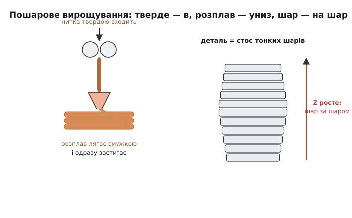
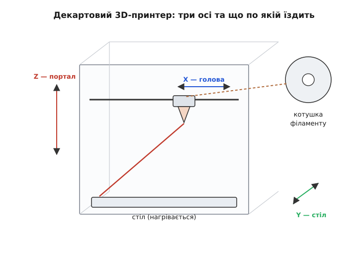

# 3D-принтер (настільний, FFF)

<preknowlist>
- [Кроковий мотор](topic:hw-motion/stepper-motor) — крутиться не плавно, а порахованими кроками; на цьому тримається вся точність руху принтера по осях.
- [Драйвер крокового мотора](topic:hw-motion/stepper-driver) — силовий посередник, що приймає слабкі сигнали «крок/напрям» і жене крізь обмотки великий струм; без нього мотор не зрушити з контролера.
- [NTC-термістор](topic:hw-sensing/ntc-thermistor) — резистор, чий опір різко падає з нагрівом; саме ним принтер вимірює температуру сопла й столу.
- [ШІМ](topic:electronics/pwm) — керування потужністю швидким вмиканням-вимиканням; так дозовано гріють нагрівач і крутять вентилятори.
- [Теплопередача](topic:ph-thermodynamics/heat-transfer) — тепло тече від гарячого до холодного; звідси і плавлення пластику в соплі, і те, чому деталь коробиться, вистигаючи нерівномірно.
</preknowlist>

Уявіть коробку заввишки з тумбочку — сталевий чи алюмінієвий каркас, усередині якого висить друкувальна голова, а знизу лежить пласка платформа-стіл. Голова їздить над столом туди-сюди, з неї тягнеться тонка блискуча ниточка розплавленого пластику й лягає на стіл смужка за смужкою. Викладе один тонкий шар — і піднімається на частку міліметра, щоб покласти наступний **поверх** попереднього. Годину-другу вона снує так над одним місцем, і на порожньому столі, з нічого, поступово виростає готова річ — тримач для навушників, шестерня, корпус для плати, фігурка. Це **настільний 3D-принтер** — машина, що вирощує тривимірні предмети, наклеюючи розплавлений пластик шар на шар за цифровим кресленням.

Слово «принтер» тут не метафора й не маркетинг. Звичайний струменевий принтер кладе на папір крапки чорнила рядок за рядком і так «малює» пласку, двовимірну картинку. Ця машина робить те саме, але додає **третій вимір**: виклавши весь пласкій контур одного шару, вона піднімає голову й кладе наступний шар зверху — і за багато таких шарів пласка картинка перетворюється на об'ємне тіло. Звідси й «3D»: те саме пошарове «друкування», тільки не на площині, а вгору.

Різновидів таких машин багато, але той, що стоїть на столах у школах, майстернях і вдома, майже завжди один — **FFF** (англ. *Fused Filament Fabrication* — «виготовлення сплавленою ниткою»). Саме його ми й розбираємо: як він улаштований, чому саме так, як ним керувати й де його межі. Спершу — звідки взялася сама ця дивна назва з трьох літер, бо в ній схована повчальна історія.

### FFF, FDM і чому дві назви для одного

Якщо погортати описи принтерів, натрапиш на дві абревіатури — **FDM** і **FFF** — і спершу здається, що це різні технології. Насправді це **та сама** технологія під двома іменами, і те, чому імен два, розповідає всю коротку історію настільного 3D-друку.

Технологію винайшов у 1980-х американський інженер **Скотт Крамп** (Scott Crump; співавторка патенту — його дружина Ліза Крамп), назвав її **Fused Deposition Modeling** (FDM — «моделювання наплавленням») і заснував компанію **Stratasys**, що робила великі промислові машини за десятки тисяч доларів (усталений факт). Назву **FDM** Stratasys зареєструвала як **торгову марку** — тобто законно вживати слово «FDM» для своїх виробів може лише вона.

Довго технологія лишалася дорогою й закритою. Перелом стався коли **термін дії ключового патенту Крампа сплив у 2009 році** (патент діє 20 років від подання — усталений факт): відтоді будь-хто отримав право будувати такі машини. І тут спрацював уже запущений раніше поштовх — рух **RepRap**.

У 2005 році **Едріан Бойєр** (Adrian Bowyer), викладач машинобудування в **Університеті Бата** (Англія), запустив відкритий проєкт RepRap із зухвалою метою: зробити 3D-принтер, здатний **надрукувати більшість власних деталей**, і викласти всі його креслення вільно, щоб один друкар «розмножувався» через інших (усталений факт; звідси й назва — *replicating rapid prototyper*, «саморозмножувальний швидкий прототипувальник»). Оскільки марку «FDM» вживати було не можна, спільнота RepRap вигадала власну, юридично вільну назву для тієї самої технології — **Fused Filament Fabrication, FFF** (усталений факт: термін уведено саме як незалежну від торгової марки заміну).

Коли 2009-го патент упав, стримана пружина розпрямилася: за лічені роки з'явилися **MakerBot**, **Ultimaker**, **Prusa** та десятки інших, і принтер, що коштував понад десять тисяч доларів, подешевшав до сотень (усталений факт). Тому сьогодні:

- **FDM** — те саме, але це **марка Stratasys**; строго кажучи, так звуться лише її машини;
- **FFF** — та сама технологія **вільною назвою**; так звуть настільні принтери всі інші.

Практично це одне й те саме — розплавлену пластикову нитку викладають шарами. Просто на побутовому принтері коректніше писати **FFF**, і саме цю назву ви бачите в описах Prusa, Bambu Lab, Creality й решти. [Як саме народжувалися FDM і RepRap і чому відкритий рух так швидко здешевив друк](topic:cat-hw-instruments/3d-printer/hist-reprap.md) — окрема історія варта переказу; тут важливо запам'ятати головне: **FFF = FDM за суттю, різниця лише в праві на назву**.

### Головна ідея: вирощувати, а не вирізати

Щоб зрозуміти будь-який 3D-принтер, спершу треба вловити, **чим він принципово відрізняється** від звичного способу робити деталі. Століттями предмети виготовляли **відніманням**: брали брусок металу чи дерева й **прибирали зайве** — точили, фрезерували, свердлили, поки з болванки не проступала потрібна форма. Усе, що не деталь, ішло в стружку.

3D-принтер робить рівно **навпаки**. Він нічого не прибирає — він **додає** матеріал там, де його треба, і не додає там, де не треба. Порожнього простору всередині деталі він просто не заповнює. Тому цей клас технологій і зветься **адитивним** (лат. *additivus* — доданий): форма не виступає з болванки, а **вирощується з нічого**, крапля за краплею, лінія за лінією.

> 🔧 **Навіщо це.** Адитивність — не просто інша механіка, а інша **економіка форми**. Точити складну деталь з отворами й порожнинами дорого: що хитріша форма, то більше різати й то більше відходів. Друкові навпаки байдуже до складності: порожниста ажурна деталь друкується **швидше й дешевше** за суцільну, бо на неї йде менше пластику й менше рухів. Тому 3D-друк перемагає саме там, де традиційне виробництво страждає — унікальні, складні, порожнисті деталі поштучно, без дорогого оснащення. І програє там, де традиційне сильне: тисячі однакових простих деталей дешевше відлити.

А як саме «вирощувати з нічого»? Тіло будь-якої форми подумки ріжуть **горизонтальними скибками**, як батон, — на сотні тонких пласких шарів. Кожен окремий шар — це вже проста **двовимірна** фігура, пласкій контур, який неважко обвести й заповнити ниткою на площині столу. Принтер викладає цей шар, піднімається на його товщину й кладе наступний **поверх**. Стос таких пласких шарів і дає об'ємне тіло.


*Уся хитрість зведена до двох дій, повторених тисячі разів: покласти на площині одну тонку смужку розплаву (він застигає майже миттєво) — і, обвівши весь контур шару, піднятися на його товщину, щоб класти наступний шар зверху. Складне тривимірне тіло так зводиться до багатьох простих двовимірних шарів.*

Уся машина, по суті, служить цим двом діям: **точно возити сопло по площині** (викласти шар) і **точно міняти висоту** (перейти на наступний шар). Розгляньмо, як це влаштовано залізно.

### Як принтер рухається: три осі

Щоб покласти нитку в будь-яку точку об'єму, соплу треба вміти стати над будь-якою точкою **площини** (це дві координати — вздовж і впоперек столу) і на будь-якій **висоті** (третя координата). Три незалежні напрями руху — три **осі**, які за традицією звуть **X**, **Y** і **Z**.


*Найпоширеніша, декартова схема: голова відповідає за рух ліворуч-праворуч (X), стіл возить деталь вперед-назад (Y), а вся горизонтальна балка з головою повільно повзе вгору (Z) — на товщину шару після кожного пройденого шару. Три мотори, три осі, і сопло дістає будь-яку точку об'єму.*

Найзрозуміліша й найпоширеніша схема зветься **декартовою** (за декартовими координатами — трьома взаємно перпендикулярними осями): кожен мотор відповідає рівно за один напрям. У класичному настільному принтері (як-от Prusa чи більшість Creality Ender) голова їздить ліворуч-праворуч (**X**), стіл із деталлю ковзає вперед-назад (**Y**), а вся балка з головою піднімається (**Z**). Викладання йде швидко по X та Y — це рух **у межах** одного шару; повільний рух по Z стається лише коли шар закінчено, щоб піднятися на його товщину, зазвичай **0.2 міліметра**.

Рух по кожній осі має бути **точним і повторюваним** — інакше нитка ляже не туди, і шари поїдуть один відносно одного. Тому осями крутять не звичайні моторчики (що просто «крутяться, поки є напруга»), а [крокові мотори](topic:hw-motion/stepper-motor): вони обертаються порахованими кроками, тож контролер точно знає, на скільки повернувся вал, **не міряючи** його положення. Обертання мотора перетворюють на прямий рух каретки — або зубчастим ременем, накинутим на шків мотора (швидкі осі X, Y), або гвинтом-шпилькою, що вкручується в гайку каретки (повільна, силова вісь Z).

Крокові мотори тягнуть на себе більше струму, ніж витримує ніжка контролера, тож між платою й кожним мотором стоїть силовий [драйвер крокового мотора](topic:hw-motion/stepper-driver) — він приймає слабенькі сигнали «зроби крок» / «напрям» і сам жене крізь обмотки потрібний струм. Разом виходить ланцюжок: контролер рахує кроки → драйвер живить обмотки → мотор крутить вал → ремінь чи гвинт возить каретку → сопло стає точно куди треба.

> 🔧 **Навіщо це.** Точність принтера по осі впирається саме в те, **наскільки дрібний рух** дає один крок мотора. Типово це виходить на кілька сотих міліметра — тонше за людську волосину, тому зазор між сусідніми проходами сопла ви очима й не побачите. Але звідси й межа: якщо ремінь розтягнутий чи погано натягнутий, кроки «пливуть», каретка не доїжджає туди, куди наказано, і на деталі проступають хвилі й сходинки. Багато проблем із якістю друку — це насправді проблеми **механіки осей**, а не пластику: розхитана вісь спотворить будь-яку, хоч найкращу, нитку.

Декартова схема — не єдина. Є **дельта**-принтери (три вертикальні стійки, голова висить на трьох тягах — рухи осей складаються хитріше, зате голова легка й прудка) і **CoreXY** (стіл лише опускається, а голову по площині водять два ремені спільно). Але принцип усюди той самий — три ступені свободи, три мотори, точне позиціювання сопла в об'ємі; відрізняється лише **механіка**, як ці три рухи розподілити. Для розуміння суті досить декартової.

### Серце машини: хотенд, де нитка плавиться

Найважливіший і найтонший вузол принтера — той, де тверда пластикова нитка стає рідким розплавом і виходить тонкою цівкою. Його звуть **хотенд** (англ. *hot end* — «гарячий кінець», на противагу холодному, подавальному). Тут зосереджена вся фізика FFF, і саме тут найчастіше все йде не так.

Пластик, з якого друкують, — **термопласт** (гр. *thérmē* — тепло + *plastós* — ліпний): полімер, що при нагріві **розм'якшується й тече**, а при остиганні знову **твердне**, і так практично скільки завгодно разів. Це головна властивість, на якій усе тримається: нитку можна розплавити, видавити в потрібне місце — і вона там застигне, зберігши форму. Метал так не вміє (плавиться при сотнях градусів і не «застигає в потрібну лінію»), звичайне скло теж — а термопласт саме такий, і тому він, а не щось інше, — робоче тіло настільного друку.

Хотенд треба спроєктувати так, щоб пластик плавився **рівно там, де сопло**, і **ніде вище**. Це складніше, ніж здається: тепло від нагрівача так і норовить розповзтися вгору по каналу, розм'якшити нитку раніше часу — і тоді вона розбухне, застрягне в каналі й заб'є його намертво (цю біду звуть *heat creep* — «повзучість тепла»). Тому хотенд — це, по суті, ретельно керована межа між гарячим і холодним.


*Уся конструкція служить одному: щоб пластик був твердий і жорсткий якомога нижче — і різко став рідким лише в нагрівальному блоці над самим соплом. Радіатор із вентилятором тримають верх холодним; тонке горло майже не пропускає тепло вгору; нагрівач гріє блок, а термістор безперервно доповідає його температуру, щоб контролер утримував її точно.*

Розберімо хотенд згори вниз, бо кожна частина стоїть там невипадково.

**Холодний кінець** — угорі. Це радіатор із ребрами, який обдуває невеликий [вентилятор](topic:cat-hw-actuators/fan-5v). Його робота — **відводити** тепло, що просочується вгору, і тримати верхню частину каналу холодною. Тут нитка ще тверда й жорстка, тому її можна впевнено **штовхати** вниз, як поршень.

**Горло** (англ. *heat-break* — «тепловий розрив») — тонкий перешийок між холодним верхом і гарячим низом. Його роблять навмисне **тонкостінним** (часто з нержавіючої сталі, що погано проводить тепло): вузький тонкий місток різко **обмежує потік тепла** вгору. Саме на горлі проходить межа — вище нитка тверда, нижче за мить стане рідкою. Це найважливіша конструктивна хитрість хотенда.

**Нагрівальний блок** — масивний металевий (зазвичай алюмінієвий) кубик унизу. У нього вкручено дві речі. Перша — **картридж-нагрівач**: товстий резистор у металевій оболонці, який гріється, коли крізь нього женуть струм (те саме джоулеве тепло, що й у будь-якій спіралі). Друга — **термістор**, крихітний [NTC-давач температури](topic:hw-sensing/ntc-thermistor), чий опір різко падає з нагрівом; контролер весь час міряє цей опір і так **знає температуру блоку** з точністю до градуса. Нитка, доходячи сюди, повністю плавиться.

**Сопло** (англ. *nozzle*) — латунний чи сталевий наконечник із крихітним отвором, типово **0.4 міліметра**, вкручений у низ блоку. Крізь цей отвір розплав і виходить тонкою цівкою. Діаметр отвору задає товщину лінії, яку кладе принтер: 0.4 мм — золота середина між швидкістю й деталізацією, тому й стандарт.

Тепер видно всю логіку хотенда як ланцюжок: **тверда нитка** входить згори → холодний кінець тримає її твердою й жорсткою, щоб було чим штовхати → горло не пускає тепло вгору → у блоці нитка **плавиться** → крізь сопло **виходить розплавом** і лягає на деталь. Зламай будь-яку ланку — заклинить: перегрієш верх (сядь вентилятор) — нитку роздує в горлі й заб'є; недогрієш блок — розплав загустіє й не протиснеться крізь сопло.

Температуру блоку тримають не «увімкнув і забув», а **дозовано**: контролер читає термістор, порівнює з бажаною (скажімо, 210 °C) і підливає нагрівачу рівно стільки потужності, скільки треба, щоб утримати цю позначку, — швидким вмиканням-вимиканням, [широтно-імпульсною модуляцією (ШІМ)](topic:electronics/pwm). Якщо термістор відвалиться чи збреше, а нагрівач лишиться ввімкненим наглухо, блок піде в [тепловий розгін](topic:hw-components/thermal-runaway) — розжариться до небезпечного. Тому у прошивці **обов'язково** живе захист: помітивши, що температура не слухається команд, вона аварійно все вимикає. З 3D-принтером це не дрібниця — на кону справжній вогонь.

> 🔧 **Навіщо це.** Температура сопла — головна ручка, якою крутить кожен, хто друкує. Замало — розплав густий, погано злипається шар із шаром, деталь виходить крихка й розшаровується. Забагато — пластик стає надто рідким, тягне за соплом павутинки-соплі (англ. *stringing*), а дрібні деталі «пливуть», не встигаючи застигнути. У кожного пластику своє вікно: **PLA** — десь 190–220 °C, тепліші інженерні пластики — за 240 °C і вище. Тому першим ділом під новий матеріал підбирають саме температуру — і половина проблем із якістю лікується цими кількома градусами.

### Подавач: що штовхає нитку

Хотенд плавить нитку, але хтось має її туди **заганяти** — рівно, дозовано, з контрольованою швидкістю. Це робить **подавач** (англ. *extruder* — «видавлювач»): маленький кроковий мотор із зубчастим коліщам, яке притискає нитку до підпружиненого ролика й, обертаючись, тягне її з котушки й **штовхає** в хотенд, як зубчаста рейка.

Тонкість у тому, що подавач штовхає **тверду** нитку зверху, а виходить крізь сопло вже **розплав**. Виходить, що стовпчик твердого пластику працює **сам собі поршнем**: коліща тисне на холодну жорстку нитку, тиск передається вниз по каналу — і виштовхує розплав із сопла. Ось чому холодний кінець хотенда конче має тримати нитку **твердою**: розм'якни вона зарано — і поршень «розкисне», перестане передавати тиск, розплав не піде. Штовхати можна лише тверде.

Керуючи, **скільки** нитки заштовхати й **як швидко**, принтер дозує, скільки пластику ляже в кожну точку. Тому подача — це, по суті, **четверта вісь** (її звуть **E**, від *extruder*): нарівні з рухом сопла по X, Y, Z контролер рахує ще й скільки міліметрів нитки згодувати. Синхронність тут вирішує все: голова їде вздовж лінії з певною швидкістю — рівно під неї подавач має видавати рівно стільки розплаву, щоб лінія вийшла суцільна й однакова. Забагато нитки — горби й напливи; замало — рвана лінія з дірками. Це узгодження між рухом голови й подачею — серцевина того, як виходить рівний друк.

### Стіл: на чому росте деталь і чому вона тримається

Знизу — **стіл** (англ. *bed*, «ложе»): пласка платформа, на якій викладається перший шар і росте вся деталь. Здавалося б, проста річ — але саме з першим шаром на столі пов'язана чи не найбільша частка невдалих друків, і причин дві: **прилипання** й **короблення**.

Перший шар мусить **міцно прилипнути** до столу — інакше, щойно голова зачепить деталь, та відірветься й поїде, а друк перетвориться на купу пластикових шмарклів. Але прилипнути він мусить **рівно настільки**, щоб готову деталь потім можна було зняти, не ламаючи. Балансують це кількома способами разом. Найголовніший — **підігрів столу**: більшість принтерів гріють ложе до 50–60 °C. Тепла поверхня не дає нижньому шару різко вистигнути й **зіщулитися**, тримає його м'яким і липким, поки він розтікається й хапається за стіл. Понад те, стіл має бути **точно вивірений** — на однаковій відстані від сопла по всій площі: якщо він перекошений, з одного краю сопло розчавить нитку в стіл, а з іншого лишить зазор, і шар там не прилипне. Тому перед серйозним друком стіл **вирівнюють** (звіряють зазор до сопла в кутах і центрі), а сучасні принтери роблять це самі давачем.

Друга біда — **короблення** (англ. *warping*): пластик, застигаючи, трохи **стискається**, і якщо низ деталі вже прилип і охолов, а щойно покладений верх ще гарячий, різниця в усадці **вигинає** деталь, задираючи їй кути від столу. Це та сама [теплопередача](topic:ph-thermodynamics/heat-transfer): нерівномірне вистигання породжує внутрішні напруження, і вони рвуть деталь від ложа. Гарячий стіл рятує й тут — тримає низ теплим, зменшуючи різницю температур. Найгірше кородяться пластики з великою усадкою (як-от ABS) — їх часто друкують у закритій камері, щоб деталь остигала повільно й рівномірно; поступливий PLA кородиться слабко, тому з нього й радять починати.

> 🔧 **Навіщо це.** Перший шар — це фундамент; хибний фундамент завалить будь-який, хоч найдосконаліший, друк згори. Тому досвідчені друкарі витрачають найбільше уваги саме на нього: рівний стіл, правильний зазор сопла, підігрів під матеріал, чиста від жиру поверхня. Якщо перший шар ліг рівно й міцно — далі майже завжди все йде добре; якщо ні — марно чекати гарного результату. Це головне практичне правило FFF: **виграй перший шар — виграєш друк**.

### Як принтеру задають форму: слайсер і G-код

Досі ми говорили про залізо. Але принтер не знає, що таке «шестерня» чи «тримач» — він уміє лише тупі елементарні дії: перемісти сопло в точку (X, Y, Z), видави стільки-то нитки (E), нагрійся до такої-то температури. Тому між тривимірною моделлю й машиною стоїть окремий крок — **розкрій на шари й переклад у команди**.

Спочатку модель майбутньої деталі малюють у програмі тривимірного моделювання (або беруть готову з інтернету) — це файл із **формою** тіла, зазвичай `.stl`. Потім цю модель віддають особливій програмі — **слайсеру** (англ. *slicer*, «різальник», від *slice* — скибка). Слайсер робить рівно те, з чого ми почали: **ріже** тіло горизонтальними площинами на сотні шарів заданої товщини (ті самі 0.2 мм) і для **кожного** шару обчислює, якими саме рухами сопло обведе його контур і заповне середину. Він же вирішує безліч практичних питань: яким візерунком заповнити нутро (суцільно пластик витрачати марно — усередині плетуть рідку сітку-**заповнення**), де потрібні тимчасові **підпори** під навислі частини (розплав не можна класти в повітря — під козирком чи аркою потрібна опора, яку потім відламують), з якою швидкістю й температурою все це вести.

Результат роботи слайсера — довжелезний текстовий файл на десятки й сотні тисяч рядків найпростіших наказів, мовою під назвою **G-код** (англ. *G-code*). Кожен рядок — одна елементарна дія машини. Виглядає вона по-спартанському просто:

```
G28              ; вернутися в нуль по всіх осях (знайти край)
M104 S210        ; почати гріти сопло до 210 °C
M140 S60         ; почати гріти стіл до 60 °C
G1 X20 Y20 Z0.2 F1500   ; переїхати в точку (20,20), висота шару 0.2 мм
G1 X80 Y20 E5 F1200      ; вести лінію до X=80, видавлюючи 5 мм нитки
```

Тут `G1` — «рухайся по прямій», `X`/`Y`/`Z` — куди, `E` — скільки нитки видати дорогою, `F` — з якою швидкістю; `M104`/`M140` — команди нагріву, `G28` — «поїхати в нульовий кут і звіритися». Уся деталь, хоч яка складна, зводиться до тисяч таких рядків — і принтер тупо, один за одним, їх виконує. Він **не бачить** цілої форми; він лише йде туди, куди каже поточний рядок, і видавлює скільки сказано. Форма живе не в машині — вона захована в **порядку** цих рухів, який наперед обчислив слайсер.

Отже, повний шлях від задуму до речі такий: **модель** (форма) → **слайсер** ріже її на шари й планує рухи → **G-код** (тисячі елементарних наказів) → **принтер** виконує їх один за одним → **деталь**. Найтонше в цьому ланцюгу — не залізо, а слайсер: ті самі мотори й той самий пластик дадуть чудову або нікчемну деталь **залежно від того, як їх запрограмували**. Тому опанувати друк — це передусім навчитися **готувати G-код** слайсером під конкретну деталь. [Сама мова — словник команд і протокол зв'язку з принтером](topic:cat-hw-instruments/3d-printer/api-gcode.md) виявляється до сміховинного простою: плаский список наказів «літера-адреса плюс число». А [як згенерувати G-код власним скриптом і надіслати його на принтер напряму](topic:cat-hw-instruments/3d-printer/proj-gcode.md) — окрема практична тема з робочими прикладами.

### Чого стерегтися й де межі FFF

FFF-принтер — чудовий інструмент, але з чіткими межами, і чесно знати їх наперед.

**Сходинки на похилих поверхнях.** Деталь складено з пласких шарів скінченної товщини, тож будь-яка похила чи кругла поверхня виходить **сходинками**, як контурна карта. Дрібнішими шарами (0.1 мм замість 0.2) сходинки менші, зате друк удвічі довший. Ідеально гладку косу поверхню FFF не дає в принципі — це плата за пошаровість.

**Слабкість між шарами.** Деталь міцна **вздовж** шарів, але **між** ними тримається лише злипанням розплаву — це слабша ланка. Тому надрукована річ найлегше ламається **по шарах**, як листковий пиріг за напрямом розшарування. Проєктуючи навантажену деталь, шари орієнтують так, щоб сила не рвала їх один від одного.

**Потрібні підпори під навислим.** Розплав не можна класти в порожнє повітря — під козирком, аркою чи горизонтальним виступом слайсер мусить підставити тимчасові **підпори**, які потім відламують, лишаючи шорсткий слід. Тому форми з великими навислими частинами друкувати марудно; це враховують ще на етапі моделювання.

**Короблення й відлипання.** Як уже сказано, велика пласка деталь любить задирати кути від столу через нерівномірну усадку. Що більша площа й що «усадкуватіший» пластик — то гостріша біда; лікують підігрівом столу, закритою камерою, добрим прилипанням першого шару.

**Це повільно.** Деталь росте буквально шар за шаром — типова річ друкується **годинами**. Для одиничних виробів і прототипів це чудово; тисячу однакових деталей дешевше й швидше **відлити** у формі. FFF — про унікальне й складне поштучно, не про масовість.

**Точність — частки міліметра, не мікрони.** Настільний FFF тримає розмір із похибкою десь у десяті частки міліметра — чудово для корпусів, тримачів, іграшок, чернеток. Для деталей, де критичні мікрони (точна механіка, оптика), беруть інші технології.

Насамкінець — головна думка, яку варто винести. 3D-принтер здається складним, але вся його суть — у двох простих діях, повторених тисячі разів: **точно поставити сопло** над потрібною точкою й **видавити дозу розплаву**, який одразу застигне; а складне тіло зведене до стосу простих пласких шарів, порізаних слайсером наперед. Зрозумівши, чому нитка мусить бути термопластом (плавиться й твердне), чому хотенд — це керована межа гарячого й холодного (інакше заклинить), чому осями крутять саме крокові мотори (точний рахований рух без давача), і чому форма живе в G-коді, а не в машині (принтер лише слухняно виконує рядки), — ви розібралися не в одній моделі принтера, а в тому, як узагалі влаштоване адитивне вирощування речей із пластику.
