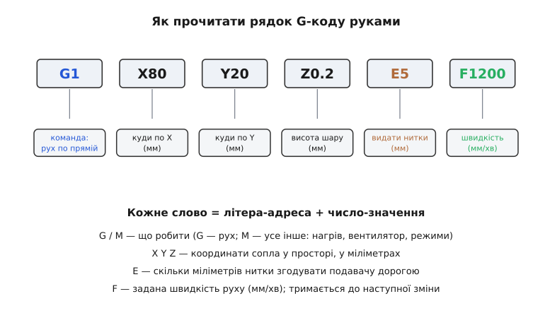
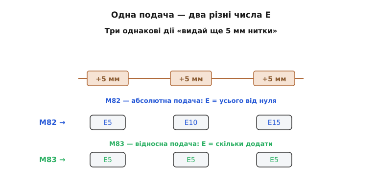

# 📋 G-код: словник команд і протокол зв'язку з принтером

G-код — це проста текстова мова, якою і слайсер, і людина диктують 3D-принтеру, що робити: кожен рядок — один короткий наказ на кшталт «їдь сюди» чи «грій до 210». Тут зібрано **довідник** до неї: як улаштований рядок, що означає кожна команда й кожна літера-число в ній, чим різняться абсолютний і відносний режими — і за яким протоколом ці рядки шлють у принтер по кабелю. Це не оповідь, а полиця, до якої зазирають, коли треба згадати, що робить `M109` або чому `E` то росте, то ні. Робочий приклад — власний генератор G-коду й відправник — живе окремо, у [практичній вставці про написання G-коду руками](topic:cat-hw-instruments/3d-printer/proj-gcode.md); тут — сама мова.

## Рядок як слово-адреса

Будь-який `.gcode`-файл — це плаский стовпчик рядків, який машина виконує згори вниз, ніколи не озираючись: ні змінних, ні циклів, ні умов, лише список наказів «зроби це, потім оте».

```gcode
G28
M104 S210
M140 S60
G1 X20 Y20 Z0.2 F1500
G1 X80 Y20 E5 F1200
```

Кожен рядок — **одна команда**, і читається як телеграма: перше слово каже, **що робити**, решта слів уточнюють **подробиці**. Кожне слово — це літера з приліпленим числом: `X80` — «по осі X значення 80», `S210` — «параметр S дорівнює 210», `F1500` — «швидкість 1500». Літера каже, **про що йдеться**, число — **скільки саме**. Цей спосіб запису — літера-адреса плюс число — зветься **word-address** (англ. «слово-адреса») і не змінився з 1950-х, коли G-код народився для металорізальних верстатів, задовго до принтерів.


*Один рядок читається як телеграма: перше слово — що робити, решта — числа-подробиці, кожне з літерою-адресою попереду. Літера каже, про який параметр мова, число — його значення. Уся мова зведена до цього.*

Літери-адреси, з яких складено накази, — усього жменя:

| Літера | Що задає |
|:------:|:---------|
| `X`, `Y`, `Z` | координати точки в міліметрах (X, Y — по столу, Z — висота) |
| `E` | подача: скільки міліметрів нитки згодувати (четверта «вісь», від *extruder*) |
| `F` | швидкість подачі (feedrate) у міліметрах **за хвилину** |
| `S` | параметр команди: °C для нагріву, 0–255 для сили вентилятора |

Самі команди діляться на два роди, і рід видно з першої літери:

- **G-команди** (від *General* / *Geometry* — тлумачать по-різному) — усе про **рух**: їхати, вертатися в нуль, вибрати режим координат. Це «геометрія» — де опиниться сопло.
- **M-команди** (від *Miscellaneous* — «різне») — усе **решта**: увімкнути нагрів, крутнути вентилятор, знеструмити мотори.

Ось чому мова зветься «G-код», а не «GM-код»: G-команди головні, бо саме вони водять сопло, а M-команди їм прислуговують.

## Словник команд

Півтора десятка слів покривають 99 % будь-якого друкованого файлу.

| Команда | Що робить | Головні параметри |
|:-------|:----------|:------------------|
| `G0` | швидкий переїзд **без** друку | `X Y Z F` |
| `G1` | робочий хід **із** видавкою нитки | `X Y Z E F` |
| `G28` | «додому»: гнати осі до кінцевих вимикачів і оголосити там нуль | осі або без них |
| `G90` | далі координати руху — **абсолютні** | — |
| `G91` | далі координати руху — **відносні** | — |
| `G92` | оголосити поточну позицію заданим числом (звично `G92 E0`) | `E X Y Z` |
| `M82` | далі подача `E` — **абсолютна** | — |
| `M83` | далі подача `E` — **відносна** | — |
| `M104` | задати t° сопла й **їхати далі** | `S` (°C) |
| `M109` | задати t° сопла й **чекати** нагріву | `S` (°C) |
| `M140` | задати t° столу й **їхати далі** | `S` (°C) |
| `M190` | задати t° столу й **чекати** нагріву | `S` (°C) |
| `M106` | увімкнути вентилятор обдуву деталі | `S` (0–255) |
| `M107` | вимкнути вентилятор обдуву деталі | — |
| `M84` | знеструмити крокові мотори (осі стають вільні) | — |

Кілька тонкощів, без яких таблиця бреше:

**`G0` проти `G1` — різниця в намірі.** `G0` — «просто дійди туди» (голова летить якнайшвидше, нічого не кладучи), `G1` — «проведи лінію туди» (дорогою видавлюється нитка). Багато прошивок виконують їх однаково, але розділяти корисно: читаючи файл, одразу видно, де друк, а де переставляння голови.

**`F` — липке.** Задали швидкість раз — вона тримається для всіх наступних рухів, поки не зміните. Тому у файлі `F` трапляється рідко, лише на зміні темпу. Одиниця — міліметри **за хвилину** (традиція верстатів): `F1200` — це 20 мм/с.

**Нагрів буває «задати» і «задати й чекати».** `M104`/`M140` вмикають нагрів і **одразу** віддають керування наступному рядку — залізо гріється **паралельно** з тим, що йде далі. `M109`/`M190` — те саме, але **блокують**: принтер стоїть, поки не догріється. Пара версій існує, щоб не гаяти час: спершу `M104` (сопло **починає** грітися), тоді `M190` (чекаємо повільний масивний стіл) — і сопло встигає догрітися **заразом**, а не по черзі.

**`G92 E0` — не рух, а переписування лічильника.** Команда каже: «те місце, де подавач зараз, вважай нулем». В абсолютному режимі подачі число `E` інакше росло б безкінечно (після метра друку — `E1000` і далі); `G92 E0` дає скинути його у зручний момент, щоб числа лишалися малими.

## Режими координат: абсолютне й відносне

Найкаверзніша частина мови — і найчастіша причина зіпсутого саморобного G-коду. Диктувати рух можна двома способами. **Абсолютний**: «стань у точці 5 см від краю», потім «стань у точці 10 см від краю» — щоразу позиція **від однієї нерухомої точки**. **Відносний**: «зроби 5 кроків уперед», потім «ще 5 кроків уперед» — щоразу зсув **від того, де ти зараз**. Обидва доводять у те саме місце, але числа різні.

Принтер розуміє обидва — і **окремо** для руху (`G90`/`G91`), і для подачі нитки (`M82`/`M83`). Рух майже завжди тримають абсолютним (`G90` — так простіше думати про координати столу), а от подачу різні слайсери ведуть по-різному, і саме тут ламаються скрипти.


*Дія фізично однакова — щоразу через сопло проходить рівно 5 мм нитки. Але число E, яким її записують, залежить від режиму: абсолютний рахує «усього від нуля» (5, 10, 15), відносний — «скільки додати» (5, 5, 5). Плутанина режиму — найтихіша й найбридкіша помилка в саморобному G-коді.*

- **Абсолютна подача (`M82`)** — `E` означає «скільки нитки згодовано **всього від нуля**». Три порції по 5 мм: `E5`, `E10`, `E15`. Число росте.
- **Відносна подача (`M83`)** — `E` означає «скільки додати **цим рухом**». Ті самі три порції: `E5`, `E5`, `E5`. Число щоразу те саме.

Дія фізично однакова — щоразу крізь сопло проходить рівно 5 мм нитки; відрізняється лише число, яким її записують. Звідси найтихіша помилка: наладналися на відносну логіку, а принтер стоїть в абсолютному режимі за замовчуванням — і `E5, E5, E5` він прочитає як «стань на 5, лишайся на 5, лишайся на 5», тобто друга й третя лінії видавлять **нуль**, деталь вийде з дірками при «правильних» числах. Дзеркально: наладналися на абсолютну (`E5, E10, E15`), а принтер у відносному — і кожен рядок **додасть** ці числа, забивши сопло горою пластику. Звідси залізне правило: **не покладайтеся на режим за замовчуванням — виставте його самі першим рядком і думайте лише в ньому** (принтер стартує в абсолютному).

## Протокол зв'язку: рядок → ok → рядок

Щоб віддати файл машині напряму, обійшовши флешку, принтер під'єднують до комп'ютера **USB-кабелем**. Усередині цього USB захована звичайна послідовна лінія — [той самий UART, загорнутий у USB перехідником на платі принтера](root:embedded/usb-uart-bridge). Для комп'ютера принтер виглядає як **послідовний порт** (`COM3` у Windows, `/dev/ttyUSB0` у Linux), у який пишуть рядки тексту й читають відповіді. Швидкість порту (baud) має **збігатися** з тою, що зашита в прошивці, — типово **115200**.

Протокол спілкування — простий рукостискальний танець:

**шлеш один рядок G-коду → принтер, виконавши його, відповідає `ok` → аж тоді шлеш наступний.**

Оце «чекай на `ok`» — **головне правило**, і ось чому. У принтера крихітний буфер команд. Женеш рядки без упину — буфер переповнюється, зайві команди **пропадають**, і деталь виходить спотворена, з проваленими шматками. `ok` — це розписка «попередній рядок прийняв, давай наступний»; дочекавшись її, ти **синхронізуєшся** з реальним темпом машини. Відповідь буває з довіском: поки принтер гріється, він досилає до `ok` поточні температури (`ok T:24.1 /0 B:41.3 /60`), а на біду відповідає рядком, що починається з `Error` або `!!`.

Друга тонкість, об яку спотикаються всі: **щойно комп'ютер відкриває послідовний порт, більшість принтерів перезавантажуються**. Так улаштований USB-перехідник — сигнал відкриття лінії смикає ніжку скидання плати. Тому кілька перших секунд після відкриття порту принтер мовчить і **очунює**; писати в ці секунди марно — команди згинуть у завантажувальному базіканні. Треба **зачекати**, скинути вхідний буфер — і аж тоді починати діалог «рядок → `ok`».
