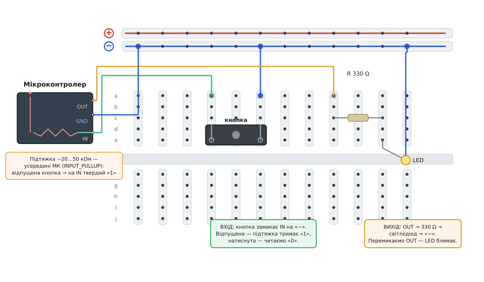

# ⚙️ Кнопка запалює світлодіод: «Hello, world» заліза

Схему на макетній платі зібрано, дроти встромлено, живлення подано — і плата мовчить. Металу мало: щоб він ожив, мікроконтролеру треба сказати, **що робити з ніжками**. Зберемо найпростіший осмислений ланцюг, у якому і вхід, і вихід: **натиснув кнопку — засвітився світлодіод, відпустив — згас**. У світі заліза це той самий обряд, що `print("Hello, world")` у програмуванні: якщо кнопка гасить і запалює діод, то ланцюг живлення цілий, ніжки налаштовано правильно, код заливається й крутиться. Далі на цьому фундаменті виростає будь-що — від давача до мотора.

Уся стаття тримається на одній думці, яку легко проґавити за синтаксисом: **ніжка мікроконтролера — це не «просто провід», а керований пристрій**. Вона вміє бути **виходом** (сама виставляє на собі напругу — 0 або живлення) або **входом** (нічого не нав'язує, лише міряє, що на ній коїться). Половина помилок новачка на макеті — від того, що ніжку налаштували не в той бік або лишили вхід «висіти в повітрі». Тож ідемо повільно й від першопричин.


*Дві половини одного макета. Ліворуч **вхід**: ніжка IN заходить у стовпчик поля, туди ж сідає одна нога кнопки; друга нога кнопки перемичкою йде на шину «−». Усередині мікроконтролера намальовано **внутрішню підтяжку** до «+» — резистор на 20…50 кОм, який умикають налаштуванням ніжки (в Arduino — `INPUT_PULLUP`). Праворуч **вихід**: ніжка OUT → резистор 330 Ω → світлодіод → шина «−». Кружечки — куди саме встромлено кінці дротів.*

## Ідея: вихід нав'язує, вхід підслуховує

Перш ніж писати код, треба чітко бачити, що фізично роблять дві ніжки, бо код лише повторює цю фізику словами.

**Вихід — це керований вимикач усередині чипа.** Коли ніжку оголошено виходом, до неї всередині під'єднано два ключі: один тягне ніжку до живлення (стан **HIGH**, на ніжці з'являється напруга логіки — 3.3 або 5 В), другий тягне до землі (стан **LOW**, на ніжці 0 В). Ви кодом кажете, який ключ замкнути. Світлодіод, підвішений між цією ніжкою і землею через резистор, світиться, коли ніжка в HIGH (є різниця напруг — тече струм), і гасне в LOW (обидва кінці ланцюга на нулі — струму нема). Блимання — це просто «HIGH, зачекав, LOW, зачекав» по колу.

**Вхід — це вольтметр із дуже великим опором.** Коли ніжку оголошено входом, вона нічого не нав'язує: усередині майже розрив, ніжка лише **міряє**, яка на ній напруга, і повертає одне з двох — HIGH (близько до живлення) чи LOW (близько до нуля). Здавалося б, кнопки досить: один її контакт на ніжку, другий — на щось. Але тут причаїлася головна пастка, і саме через неї існує підтяжка.

> 🔧 **Навіщо це.** Розрізняти «ніжка-вихід нав'язує напругу» і «ніжка-вхід лише міряє» — не формальність, а робочий інструмент діагностики. Коли схема поводиться дивно, перше питання завжди те саме: ця ніжка зараз вхід чи вихід, і хто на цьому вузлі задає напругу? Половина «примарних» збоїв на макеті знімається цією одною думкою.

## Пастка входу: чому без підтяжки нічого не працює

Уявімо наївне під'єднання: кнопка одним контактом на ніжку-вхід, другим — на живлення. Натиснули — на вході живлення, чіп читає HIGH, ясно. **Відпустили — і що на вході?** А нічого. Кнопка розімкнена, ніжка ні до чого не під'єднана — вона **висить у повітрі** (англ. *floating*, «плавучий вхід»). Дуже великий вхідний опір ніжки означає, що навіть мікроскопічні наведення — від мережі 50 Гц, від сусіднього дроту, від вашої руки за півметра — розгойдують на ній напругу як завгодно. Чіп читає то HIGH, то LOW, випадково. Кнопка ніби «сама натискається».

Лік — **підтяжка** (англ. *pull-up* / *pull-down*): резистор, що м'яко притягує плавучий вхід до певного рівня, поки кнопка мовчить. «М'яко» — бо опір великий (десятки кілоом): він задає рівень, коли більше нікому, але легко «здається», щойно кнопка жорстко з'єднає вхід із протилежним рівнем.

Найзручніший варіант робить сам мікроконтролер. Усередині кожної ніжки-входу вже є **підтяжка до живлення** — її досить увімкнути в налаштуванні ніжки (в Arduino — режим `INPUT_PULLUP`, в ESP-IDF — поле `.pull_up_en`, на STM32 — `GPIO_PULLUP`), і зовнішній резистор не потрібен. У ATmega328 (серце класичних Arduino Uno/Nano) ця внутрішня підтяжка за даташитом лежить у межах **20…50 кОм** (нормально виміряні значення частіше близько 30…50 кОм; факт усталений). Умикаєш її — і відпущений вхід твердо тримає HIGH.

Звідси випливає розводка, яка спершу здається «догори дриґом», а насправді найпростіша: кнопку вішають **між ніжкою і землею**, а вгору ніжку тримає внутрішня підтяжка.

```
Стан входу з увімкненою підтяжкою і кнопкою на землю:

   кнопка відпущена → підтяжка тягне вхід до «+» → читаємо HIGH (1)
   кнопка натиснута → вхід замкнено на «−» напряму → читаємо LOW  (0)
```

Логіка перевернута — **натиснуто = 0** — і це називають «активний нуль» (англ. *active-low*). Трохи незвично, зате не треба жодного зовнішнього резистора й жодного дроту на «+» для кнопки: одна нога в поле до ніжки, друга — на шину «−». На фігурі саме так: кнопка сидить у стовпчиках поля, і з сусіднього стовпчика коротка синя перемичка йде на «−».

Порахуймо, що коїться зі струмом у натиснутому стані, щоб переконатися: підтяжка нічого не палить. Струм крізь підтяжку — це проста напруга поділити на опір за [законом Ома](root:hw-analog/ohms-law): струм у ділянці дорівнює прикладеній напрузі, поділеній на її опір.

**Умова.** Живлення 5 В, внутрішня підтяжка беремо для оцінки 40 кОм, кнопку натиснуто (вхід замкнено на землю через підтяжку).

```
Через підтяжку тече струм із «+» на «−»:
   I = U / R = 5 В / 40000 Ом ≈ 0.000125 А = 0.125 мА

Потужність, що гріє підтяжку:
   P = U · I = 5 В · 0.000125 А ≈ 0.6 мВт
```

Чверть міліампера, менш як міліват — мізер, чіпу байдуже. Ось чому підтяжку роблять великим опором: у спокої (кнопка відпущена) через неї взагалі нічого не тече, а в натиснутому стані — крихітний струм, що лише «саджає» вхід на нуль, не навантажуючи ніжку.

## Крок 1: змусити світлодіод блимати

Почнемо з половини простішої — з виходу, без кнопки. Мета: ніжка OUT блимає світлодіодом раз на секунду. Це перевіряє, що вихід і ланцюг діода живі.

Програма для мікроконтролера скрізь має однаковий кістяк: **разове налаштування на старті** (задати напрямок ніжок) і **нескінченний цикл** роботи. Однакові й дві дії з ніжкою-виходом: **оголосити її виходом** і **виставити на ній рівень**. Різняться лише назви. В Arduino це функції `setup()`/`loop()` і виклики `pinMode()`/`digitalWrite()`; в ESP-IDF — `app_main()` з власним `while (1)`, `gpio_config()`/`gpio_set_level()`; на STM32 з HAL — `main()` з `while (1)`, налаштування ніжки в `MX_GPIO_Init()` і `HAL_GPIO_WritePin()`.

:::tabs
```arduino
const uint8_t PIN_LED = 8;   // ніжка OUT зі схеми — до неї резистор і світлодіод

void setup() {
    pinMode(PIN_LED, OUTPUT); // оголошуємо ніжку виходом: тепер вона НАВ'ЯЗУЄ напругу
}

void loop() {
    digitalWrite(PIN_LED, HIGH); // ніжка тягне до живлення → через резистор тече струм → LED світиться
    delay(500);                  // тримаємо так 500 мс
    digitalWrite(PIN_LED, LOW);  // ніжка тягне до нуля → різниці напруг нема → LED гасне
    delay(500);                  // тримаємо темряву 500 мс
}
```
```esp-idf
#include "driver/gpio.h"
#include "freertos/FreeRTOS.h"
#include "freertos/task.h"

#define PIN_LED  GPIO_NUM_18     // ніжка OUT зі схеми — до неї резистор і світлодіод

void app_main(void) {
    gpio_config_t out = {
        .pin_bit_mask = 1ULL << PIN_LED,
        .mode = GPIO_MODE_OUTPUT,
    };
    gpio_config(&out);           // те саме оголошення: ніжка — вихід, тепер вона НАВ'ЯЗУЄ напругу

    while (1) {
        gpio_set_level(PIN_LED, 1);      // ніжка тягне до живлення → тече струм → LED світиться
        vTaskDelay(pdMS_TO_TICKS(500));  // тримаємо так 500 мс
        gpio_set_level(PIN_LED, 0);      // ніжка тягне до нуля → різниці напруг нема → LED гасне
        vTaskDelay(pdMS_TO_TICKS(500));  // тримаємо темряву 500 мс
    }
}
```
```stm32
// Ногу PB8 у CubeMX задано як GPIO_Output, push-pull, без підтяжки.
#define LED_PORT  GPIOB
#define LED_PIN   GPIO_PIN_8

int main(void) {
  HAL_Init();
  SystemClock_Config();
  MX_GPIO_Init();               // тут увімкнено такт порту й ніжку оголошено виходом

  while (1) {
    HAL_GPIO_WritePin(LED_PORT, LED_PIN, GPIO_PIN_SET);    // тягне до живлення → LED світиться
    HAL_Delay(500);                                        // тримаємо так 500 мс
    HAL_GPIO_WritePin(LED_PORT, LED_PIN, GPIO_PIN_RESET);  // тягне до нуля → LED гасне
    HAL_Delay(500);                                        // тримаємо темряву 500 мс
  }
}
```
:::

Три рядки логіки, і в них уся суть виходу: оголошення ніжки виходом дає їй право нав'язувати напругу, а запис рівня вибирає, яку саме. Якщо світлодіод не блимає — дивись не в код, а в залізо: чи не переплутано анод із катодом (діод пропускає струм лише в один бік), чи стоїть резистор, чи не сів дріт повз стовпчик.

> 🔧 **Навіщо це.** **Блокувальна пауза** (`delay(500)` в Arduino, `HAL_Delay(500)` на STM32) **зупиняє геть усе** на пів секунди — чіп у цей час сліпий і глухий, не читає кнопок, не рахує. В ESP-IDF `vTaskDelay()` бодай віддає час іншим задачам ОС, але сама ця задача так само сліпа. Для одного блимання дарма, але щойно поряд з'явиться кнопка, ця «пауза-параліч» стане проблемою: натиск, що припав на паузу, чіп прогавить. Тому далі від блокувальної паузи доведеться відмовитися.

## Крок 2: прочитати кнопку

Тепер друга ніжка — вхід із кнопкою. Дій знову дві, і вони однакові скрізь: **оголосити ніжку входом з увімкненою внутрішньою підтяжкою** й **прочитати з неї рівень**. В Arduino це `pinMode(ніжка, INPUT_PULLUP)` і `digitalRead(ніжка)`; в ESP-IDF — поле `.pull_up_en` у `gpio_config()` і `gpio_get_level()`; на STM32 — режим входу з `GPIO_PULLUP` і `HAL_GPIO_ReadPin()`. Підтяжка ввімкнена — і відпущена кнопка дає стабільний HIGH.

:::tabs
```arduino
const uint8_t PIN_LED = 8;
const uint8_t PIN_BTN = 3;   // ніжка IN зі схеми: сюди одна нога кнопки, друга — на «−»

void setup() {
    pinMode(PIN_LED, OUTPUT);
    pinMode(PIN_BTN, INPUT_PULLUP); // вхід + внутрішня підтяжка до «+»
}

void loop() {
    // active-low: натиснуто = LOW. Тож "світло є" ⇔ "на вході LOW".
    if (digitalRead(PIN_BTN) == LOW) {
        digitalWrite(PIN_LED, HIGH); // кнопку тримають → світимо
    } else {
        digitalWrite(PIN_LED, LOW);  // відпущено → гасимо
    }
}
```
```esp-idf
#include "driver/gpio.h"
#include "freertos/FreeRTOS.h"
#include "freertos/task.h"

#define PIN_LED  GPIO_NUM_18
#define PIN_BTN  GPIO_NUM_19     // ніжка IN зі схеми: сюди одна нога кнопки, друга — на «−»

void app_main(void) {
    gpio_config_t out = {
        .pin_bit_mask = 1ULL << PIN_LED,
        .mode = GPIO_MODE_OUTPUT,
    };
    gpio_config(&out);

    gpio_config_t in = {
        .pin_bit_mask = 1ULL << PIN_BTN,
        .mode = GPIO_MODE_INPUT,
        .pull_up_en = GPIO_PULLUP_ENABLE,   // вхід + внутрішня підтяжка до «+»
    };
    gpio_config(&in);

    while (1) {
        // active-low: натиснуто = 0. Тож "світло є" ⇔ "на вході 0".
        if (gpio_get_level(PIN_BTN) == 0) {
            gpio_set_level(PIN_LED, 1);     // кнопку тримають → світимо
        } else {
            gpio_set_level(PIN_LED, 0);     // відпущено → гасимо
        }
        vTaskDelay(pdMS_TO_TICKS(5));       // опитуємо часто, але віддаємо час іншим задачам
    }
}
```
```stm32
// PB8 у CubeMX — GPIO_Output; PB9 — GPIO_Input із Pull-up (внутрішня підтяжка до «+»).
#define LED_PORT  GPIOB
#define LED_PIN   GPIO_PIN_8
#define BTN_PORT  GPIOB
#define BTN_PIN   GPIO_PIN_9

int main(void) {
  HAL_Init();
  SystemClock_Config();
  MX_GPIO_Init();               // тут задано напрямки ніжок і ввімкнено підтяжку на BTN_PIN

  while (1) {
    // active-low: натиснуто = RESET. Тож "світло є" ⇔ "на вході RESET".
    if (HAL_GPIO_ReadPin(BTN_PORT, BTN_PIN) == GPIO_PIN_RESET) {
      HAL_GPIO_WritePin(LED_PORT, LED_PIN, GPIO_PIN_SET);    // кнопку тримають → світимо
    } else {
      HAL_GPIO_WritePin(LED_PORT, LED_PIN, GPIO_PIN_RESET);  // відпущено → гасимо
    }
  }
}
```
:::

Це вже повний «кнопка → світлодіод»: тримаєш кнопку — горить, відпустив — згасло. Зверни увагу на перевернуту логіку: `== LOW` означає «натиснуто», бо підтяжка тримає відпущений вхід у HIGH. Тут пауза не потрібна зовсім — головний цикл крутиться тисячі разів на секунду й щоразу свіжо питає кнопку, тож реакція миттєва.

Часто хочуть інакше: не «світить, поки тримаєш», а **перемикач** — натиснув і відпустив, світло лишилось; натиснув ще раз — згасло. Ось тут наївний код спотикається об фізику кнопки, і ми впритул підходимо до головної макетної (і взагалі механічної) пастки.

## Крок 3: брязкіт контактів і навіщо антидребезг

Здавалося б, «перемикач» пишеться просто: ловимо мить, коли кнопку щойно натиснули (вхід перейшов з HIGH у LOW), і на кожен такий перехід міняємо стан світла на протилежний. Пишемо — і світло смикається як навіжене: іноді на один натиск умикається, іноді ні, іноді блимне двічі. Код правильний. Винна кнопка.

**Механічний контакт не замикається чисто.** Усередині кнопки дві пружні металеві пластинки; коли вони сходяться, то не «клац і тримаються», а кілька разів **відскакують** одна від одної за частки мілісекунди, перш ніж уляжуться. Це називають **брязкіт контактів** (англ. *contact bounce*). Для ока — один натиск; для мікроконтролера, що встигає опитати ніжку мільйони разів на секунду, — черга з десятка швидких HIGH-LOW-HIGH-LOW. Ваш код чесно порахував кожен перехід і перемкнув світло кілька разів замість одного.

Наскільки це швидко? За вимірами реальних кнопок брязкіт триває здебільшого **лічені мілісекунди** (типово одиниці мс, у окремих поганих зразків — десятки мс; усталено з вимірів). Тому ліки — **антидребезг** (англ. *debounce*): після першої зміни на вході **зачекати трохи** (типово **10…50 мс**) і лише тоді повірити новому стану, бо за цей час брязкіт устигає влягтися.

Найгірший спосіб «зачекати» — блокувальна пауза на 30 мс: вона знову паралізує чіп. Правильно рахувати час, не спиняючи роботу, — за **монотонним годинником**, який є в кожної платформи й робить те саме: каже, скільки часу минуло від старту (`millis()` в Arduino, `esp_timer_get_time()` в ESP-IDF — у мікросекундах, `HAL_GetTick()` на STM32). Ідея: запам'ятати мить останньої зміни на вході й приймати новий стан, лише коли від неї минуло більше за поріг.

:::tabs
```arduino
const uint8_t PIN_LED = 8;
const uint8_t PIN_BTN = 3;

const unsigned long DEBOUNCE_MS = 30;  // поріг: скільки чекати, поки брязкіт уляжеться

bool     ledOn        = false;         // поточний стан світла (перемикач)
int      btnStable     = HIGH;         // останній «усталений» стан кнопки (відпущена = HIGH)
int      btnLastRead   = HIGH;         // що прочитали минулого разу (для лову зміни)
unsigned long lastEdge = 0;            // мить останнього дрижання на вході

void setup() {
    pinMode(PIN_LED, OUTPUT);
    pinMode(PIN_BTN, INPUT_PULLUP);
}

void loop() {
    int reading = digitalRead(PIN_BTN);

    // помітили будь-яку зміну на вході — це може бути і корисний натиск, і брязкіт.
    // Заводимо годинник наново: чекатимемо, поки вхід ПОСТОЇТЬ незмінним DEBOUNCE_MS.
    if (reading != btnLastRead) {
        lastEdge = millis();
    }

    // якщо від останнього дрижання минуло досить — вхід уже усталився, йому можна вірити
    if (millis() - lastEdge > DEBOUNCE_MS) {
        if (reading != btnStable) {          // усталений стан справді змінився
            btnStable = reading;
            if (btnStable == LOW) {          // саме натиснули (active-low) — момент перемикання
                ledOn = !ledOn;              // перевертаємо світло
                digitalWrite(PIN_LED, ledOn ? HIGH : LOW);
            }
        }
    }

    btnLastRead = reading; // запам'ятали для наступного кола
}
```
```esp-idf
#include "driver/gpio.h"
#include "esp_timer.h"
#include "freertos/FreeRTOS.h"
#include "freertos/task.h"

#define PIN_LED  GPIO_NUM_18
#define PIN_BTN  GPIO_NUM_19

#define DEBOUNCE_MS  30                 // поріг: скільки чекати, поки брязкіт уляжеться

static uint32_t now_ms(void) {          // монотонний годинник від старту, у мілісекундах
    return (uint32_t)(esp_timer_get_time() / 1000);
}

void app_main(void) {
    gpio_config_t out = { .pin_bit_mask = 1ULL << PIN_LED, .mode = GPIO_MODE_OUTPUT };
    gpio_config(&out);
    gpio_config_t in = {
        .pin_bit_mask = 1ULL << PIN_BTN,
        .mode = GPIO_MODE_INPUT,
        .pull_up_en = GPIO_PULLUP_ENABLE,
    };
    gpio_config(&in);

    bool     led_on    = false;         // поточний стан світла (перемикач)
    int      btn_stable = 1;            // останній «усталений» стан кнопки (відпущена = 1)
    int      btn_last   = 1;            // що прочитали минулого разу (для лову зміни)
    uint32_t last_edge  = 0;            // мить останнього дрижання на вході

    while (1) {
        int reading = gpio_get_level(PIN_BTN);

        // будь-яка зміна на вході — чи то натиск, чи то брязкіт — заводить годинник наново
        if (reading != btn_last) {
            last_edge = now_ms();
        }

        // вхід постояв незмінним досить довго — йому вже можна вірити
        if (now_ms() - last_edge > DEBOUNCE_MS) {
            if (reading != btn_stable) {
                btn_stable = reading;
                if (btn_stable == 0) {          // саме натиснули (active-low)
                    led_on = !led_on;           // перевертаємо світло
                    gpio_set_level(PIN_LED, led_on ? 1 : 0);
                }
            }
        }

        btn_last = reading;             // запам'ятали для наступного кола
        vTaskDelay(pdMS_TO_TICKS(2));   // опитуємо часто, але віддаємо час іншим задачам
    }
}
```
```stm32
// PB8 — GPIO_Output (LED); PB9 — GPIO_Input із Pull-up (кнопка на «−»).
#define LED_PORT  GPIOB
#define LED_PIN   GPIO_PIN_8
#define BTN_PORT  GPIOB
#define BTN_PIN   GPIO_PIN_9

#define DEBOUNCE_MS  30u              // поріг: скільки чекати, поки брязкіт уляжеться

int main(void) {
  HAL_Init();
  SystemClock_Config();
  MX_GPIO_Init();                     // LED — вихід, кнопка — вхід із підтяжкою до «+»

  bool          led_on     = false;            // поточний стан світла (перемикач)
  GPIO_PinState btn_stable = GPIO_PIN_SET;     // усталений стан кнопки (відпущена = SET)
  GPIO_PinState btn_last   = GPIO_PIN_SET;     // що прочитали минулого разу
  uint32_t      last_edge  = 0;                // мить останнього дрижання на вході

  while (1) {
    GPIO_PinState reading = HAL_GPIO_ReadPin(BTN_PORT, BTN_PIN);

    // будь-яка зміна на вході — чи то натиск, чи то брязкіт — заводить годинник наново
    if (reading != btn_last) {
      last_edge = HAL_GetTick();
    }

    // вхід постояв незмінним досить довго — йому вже можна вірити
    if (HAL_GetTick() - last_edge > DEBOUNCE_MS) {
      if (reading != btn_stable) {
        btn_stable = reading;
        if (btn_stable == GPIO_PIN_RESET) {    // саме натиснули (active-low)
          led_on = !led_on;                    // перевертаємо світло
          HAL_GPIO_WritePin(LED_PORT, LED_PIN, led_on ? GPIO_PIN_SET : GPIO_PIN_RESET);
        }
      }
    }

    btn_last = reading;               // запам'ятали для наступного кола
  }
}
```
:::

Тепер натиск перемикає світло рівно раз, хоч би скільки разів контакт брязнув: перші дрижання щоразу «переводять годинник» `lastEdge`, і поки вхід не постоїть спокійно цілих 30 мс, код нового стану не приймає. головний цикл при цьому ніде не спиняється — чіп вільний робити ще хоч десять справ між опитуваннями кнопки. Це канонічний неблокувальний антидребезг, і саме його варто мати в пам'яті як заготовку: будь-яка механічна кнопка в будь-якому проєкті просить того самого.

Поріг 30 мс — золота середина: досить, щоб проковтнути брязкіт звичайної тактової кнопки, і замало, щоб людина відчула затримку (людський «клац» триває довше за 100 мс). Для геть «дзвінких» кнопок або промислових поштовхачів поріг піднімають до 50…100 мс.

## Складність і пастки саме макета

Код вище правильний — і все одно на макетній платі ланцюг може капризувати з причин, яких у коді не видно. Це специфіка **макета**, і знати її треба, бо інакше годинами шукаєш баг у бездоганній програмі.

**Плавучий вхід — забули підтяжку.** Класика: оголосили ніжку входом **без підтяжки** (в Arduino — `INPUT` замість `INPUT_PULLUP`) і повісили кнопку на землю. Відпущена кнопка лишає вхід у повітрі, і світло «саме» вмикається від наведень або коли підносиш руку. Симптом — реакція на дотик до дротів, на рух поряд. Лік один: увімкнути внутрішню підтяжку (або поставити зовнішній резистор-підтяжку). Якщо десь бачите кнопку, що «привиджається», перше підозра — саме плавучий вхід.

**Брязкіт, який ви не чекали.** Навіть із антидребезгом у коді легко наступити на граблі, поставивши поріг замалим (5 мс — крізь нього просочуються дрижання поганої кнопки) або, навпаки, забувши антидребезг там, де він потрібен. Лічильники, що «перескакують» через кілька, меню, що «пролітає» два пункти на один натиск, — усе це брязкіт. Тримайте неблокувальну заготовку напоготові й не спокушайтеся «просто порахувати переходи».

**Плавучий контакт у зношеному гнізді — найпідступніше.** Це вже не про код і не про кнопку, а про саму плату. Гнізда макетки з часом розношуються, пружинки під отворами слабшають від багатьох втиків — і ніжка деталі чи кінець дроту тримається **нещільно**. Контакт то є, то нема: схема «то працює, то ні», особливо коли торкнутися дротів чи хитнути стіл. Ніжка коду тут ні до чого — просто в конкретну мить вузол фізично розірвано в гнізді. Симптом підступний саме тим, що **виглядає як плаваючий баг у програмі**: натиснув кнопку — спрацювало, натиснув ще раз під іншим кутом — ні. Перш ніж винуватити код, **переткніть підозрілий дріт у сусідній стовпчик** тієї самої смужки й поворушіть з'єднання: якщо поведінка міняється від дотику — винне гніздо, а не програма. Зношену під точну роботу плату міняють.

**Дроти вивалюються.** Легкі перемички погано сидять у розношених гніздах і випадають від поштовху. Кнопку на макеті ще й тиснуть пальцем — а від натиску плата здригається, і сусідній ледь-ледь триманий дріт може підскочити. Тому кнопку добре ставити на короткі жорсткі перемички «літерою П», що лягають упритул до плати, а не на довгі «макаронини».

Спільна мораль цих пасток одна: на макетній платі **половина «програмних» збоїв — насправді залізні**. Дисципліна діагностики проста — спершу виключи фізику (підтяжка на місці? контакти щільні? дроти сидять?), і лише тоді копай код. Саме тому «кнопка → світлодіод» і цінна як перший ланцюг: вона мала настільки, що коду в ній майже нема помилитися, — і кожен її каприз чесно вказує на розводку, привчаючи бачити межу між світом коду й світом металу.
