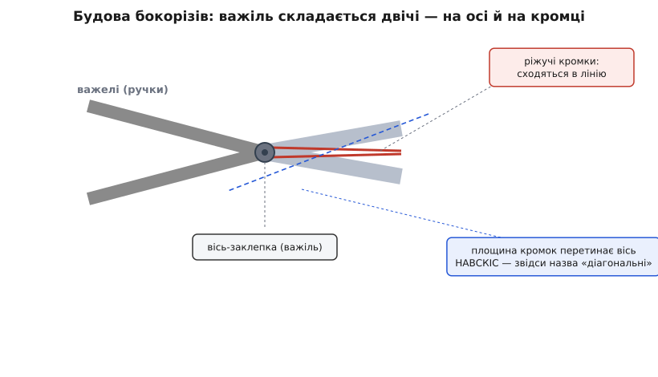
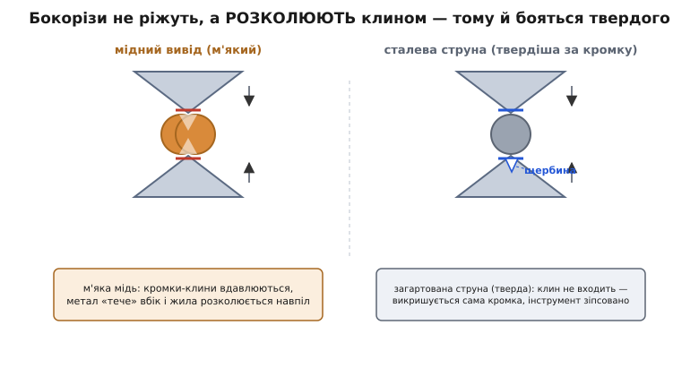
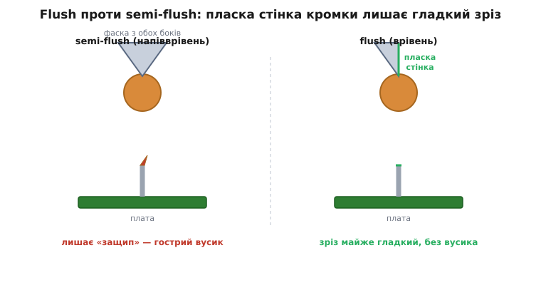

# Бокорізи

<preknowlist>
- [Набір Dupont дротів](root:cat-hw-parts/dupont-wires) — сполучні дроти макетника, які цим інструментом і вкорочують; головний «клієнт» бокорізів на столі.
- [Набір резисторів](root:cat-hw-parts/resistor-kit) — типова деталь із довгими виводами, які після паяння відкушують урівень із платою.
- [Припій / олово](root:cat-hw-instruments/solder-tin) — чому вивід відкушують саме ПІСЛЯ паяння: спершу пайка тримає деталь, потім прибираєш зайве.
</preknowlist>

Витягаєш із коробки короткий важіль на дві ручки — схожий на маленькі плоскогубці, але голова не пласка, а зрізана навскіс, і замість губок для захвату там дві гострі кромки, що сходяться в лінію. Це **бокорізи** (у технічній мові — *діагональні кусачки*, англ. *diagonal cutters*, *side cutters*): ручний інструмент, єдине завдання якого — **перекушувати дріт і виводи деталей**. Не гнути, не тримати, не крутити — саме різати. Він лежить на столі поруч із паяльником у кожного, хто бодай раз збирав щось на макетній платі, бо після паяння з плати завжди стирчать зайві кінці виводів, а щоб їх прибрати рівно й близько до плати, нічого зручнішого за бокорізи не придумали.

Назва «бокорізи» українською вказує на головну прикмету: кромки розташовані **збоку**, на торці зрізаної навскіс голови, тож інструмент ріже те, що заходить у розкриті губки з переду. Англійська назва *diagonal* («діагональні») дивиться на ту саму рису з іншого боку — площина, у якій сходяться кромки, перетинає вісь інструмента **під кутом, навскіс**, а не впоперек. Розберімо цю просту з вигляду річ так, щоб зрозуміти, чому голова саме така, що насправді відбувається з дротом у момент різу (а відбувається геть не те, що здається), чому одні бокорізи ріжуть мідь як масло, а інші кришаться об сталеву струну, і як обрати та не зіпсувати свій інструмент.

### Що це і чому голова зрізана навскіс

Щоб зрозуміти форму, треба побачити, з чого інструмент складається. Бокорізи — це **важіль подвійної дії**. Дві однакові половинки, кожна з ручкою й губкою, з'єднані посередині віссю-заклепкою. Стискаєш ручки — губки сходяться. Уся конструкція служить одному: **помножити силу руки**. Твоя долоня стискає довгі ручки з великою амплітудою й помірним зусиллям, а короткі губки біля осі рухаються на маленьку відстань, зате з силою в кілька разів більшою. Це звичайний важіль: що коротше плече навантаження (губка) проти плеча зусилля (ручка), то більший виграш у силі. Ось чому губки короткі, а ручки довгі — інакше пальцями мідь не перекусити.

*Будова бокорізів. Вісь-заклепка посередині перетворює інструмент на важіль: довгі ручки з великою амплітудою й малим зусиллям — короткі губки з малою амплітудою й великою силою. На торцях губок — дві ріжучі кромки, що при стисканні сходяться в одну лінію. Пунктир показує головну прикмету: площина, у якій лежать кромки, перетинає вісь інструмента не впоперек, а навскіс — звідси й назва «діагональні».*

Тепер про зріз навскіс. Кромки лежать **не перпендикулярно** до ручок, а під кутом. Це не примха дизайну, а зручність: скошена голова дає **дістатися кромкою впритул до поверхні** й відкусити вивід урівень із платою, тримаючи інструмент майже плазом. Якби кромки стояли впоперек (як у звичайних кусачок-«гострозубців»), довелося б заводити всю голову перпендикулярно до дроту, і близько до плати вже не підлізеш — заважає власне тіло інструмента. Скіс розвертає різальну лінію так, що вона підходить до основи виводу під зручним кутом, а решта інструмента лишається осторонь. Саме тому для акуратного «підстригання» виводів на друкованій платі беруть саме діагональні кусачки, а не якісь інші.

> 🔧 **Навіщо це.** Виграш у силі — не абстракція, а те, що визначає, чим саме перекусиш дріт. Дешеві мініатюрні бокорізи з короткими ручками призначені для тонкої мідної жили та пластику — ними зручно працювати біля дрібних деталей, але товстий сталевий дріт вони не подужають: короткий важіль дає замалий виграш. І навпаки, велике зусилля на маленьких губках легко **зіпсувати саму кромку**, якщо кинутися різати щось твердіше за неї. Тому перше, що варто засвоїти: сила є, і застосовувати її треба з розбором — під матеріал, а не наосліп.

### Головна таємниця: бокорізи не ріжуть, а розколюють

Тут криється найцікавіше, і воно повністю змінює розуміння інструмента. Здається очевидним, що кусачки ріжуть, як ножиці: дві кромки роз'їжджаються повз одна одну й **зрізають** дріт, кожна зі свого боку. Насправді все інакше. Кромки бокорізів **не проходять повз** одну одну — вони сходяться **лоб у лоб**, вістря проти вістря. А отже, ножичного зрізу (коли два леза ідуть паралельно й ковзають) тут немає взагалі. Замість цього дві кромки **вдавлюються в дріт із двох боків, як два клини**, і **розколюють** його.

Придивімося до цього повільно. Кромка бокорізів — це, по суті, тупуватий **клин** (кут при вістрі десятки градусів, а не мікроскопічно гострий, як у бритви). Коли ти стискаєш ручки, верхній клин тисне на дріт згори, нижній — знизу, точно назустріч. Метал під вістрями спершу **вминається**: у м'якому дроті кромки лишають дві канавки, що дедалі глибшають. Матеріал під тиском клина **тече вбік** — його виштовхує з-під вістря, як тісто з-під качалки. Дві канавки, назустріч одна одній, дедалі стоншують перешийок посередині, аж поки він не стає таким тонким, що метал у ньому **розривається** — не так розрізається, як розколюється чи розтягується до розриву. Ось чому це різання зветься **різанням клином**, а не зсувом (шером): дріт розділяється не двома лезами, що роз'їхалися, а одним стисканням, що його розчавило й розкололо.

*Що насправді відбувається під кромками. Ліворуч — м'який мідний вивід: два клини-кромки вдавлюються назустріч, метал тече вбік, і жила розколюється надвоє (світлі трикутники — вм'ятини від клинів). Праворуч — загартована сталева струна, твердіша за самі кромки: клин не входить у неї, натомість викришується метал самої губки, і на кромці лишається щербина. Це та сама дія в обох випадках — вдавлювання клином; різниця лише в тому, хто твердіший, дріт чи кромка.*

Ця відмінність від ножиць — не занудна дрібниця, а ключ до всього поводження з інструментом. З неї одразу випливає кілька дуже практичних наслідків.

Перший наслідок: **зріз бокорізами ніколи не буває ідеально гладким**, як від ножа. Оскільки метал розколюється, а не розрізається, з обох боків від різу лишається слід — крихітна деформована зона, а часто й гострий вусик. Це нормальна властивість самого способу різати, а не ознака поганого інструмента; зменшити її можна лише геометрією кромки (про це нижче), але зовсім прибрати — ні.

Другий наслідок: **бокоріз тим краще ріже, чим м'якший матеріал** проти твердості його кромки. Мідь, алюміній, пластик, тонке залізо клин розколює легко, бо вони м'якші за сталь кромки й слухняно течуть убік. А от тверда загартована сталь…

### Чому бокорізи бояться сталевої струни

…а от тверду загартовану сталь той самий клин розколоти не може — і ось чому це закладено в саму фізику. Різання клином працює лише тоді, коли **кромка твердіша за дріт**: тільки тоді вістря вдавлюється в метал, а не навпаки. Якщо ж дріт **твердіший за кромку** (а загартована пружинна сталь — «струна», з якої роблять струни піаніно, пружини, тросики — саме така), то станеться протилежне: не клин увійде в дріт, а **дріт увійде в клин**. Кромка не розколе струну — вона сама **вим'ятиться або викришиться**, лишивши на губці щербину. Один такий необдуманий рух — і на різальній лінії з'являється зазублина, крізь яку тепер не перекусиш навіть тонку мідь: у цьому місці кромки більше не сходяться щільно.

Наскільки твердіша кромка? Твердість інструментальних сталей міряють за шкалою Роквелла (позначають HRC, англ. *Rockwell hardness, C-scale*). Кромки якісних бокорізів гартують до приблизно **HRC 60–64** — це дуже твердо, твердіше за більшість звичайних дротів. Але загартована струна може бути такою самою або й твердішою, тож навіть добра кромка від неї страждає. Саме тому виробники окремо роблять **кусачки для струни** з особливо твердими або індукційно-загартованими кромками й прямо пишуть у паспорті, який максимальний діаметр і твердість дроту інструмент витримує. (Усталений факт: типова твердість різальних кромок якісних діагональних кусачок — близько 60–64 HRC за паспортами виробників; звичайні дешеві кусачки — помітно м'якші.)

> 🔧 **Навіщо це.** З цього виходить залізне правило столу: **бокорізами для електроніки ріжемо тільки м'яке — мідні виводи, тонкий монтажний дріт, пластикові стяжки, ніжки деталей. Нічого сталевого, пружинного, загартованого.** Хочеш перекусити канцелярську скріпку, струну, цвях, загартований тросик — бери інші, груборобочі кусачки, яких не шкода, або спеціальні для струни. Одна спроба відкусити «просто скріпку» гарними бокорізами лишає на кромці щербину назавжди — і акуратний інструмент для тонкої роботи перетворюється на брухт. Це найчастіша причина, чому нові бокорізи раптом перестають рівно кусати мідь: десь колись ними різонули щось тверде.

### Flush проти semi-flush: чому лишається вусик і як його прибрати

Тепер до тонкощів, які відрізняють бокоріз «для електроніки» від грубих кусачок. Раз зріз розколюванням завжди лишає слід, виникає питання: наскільки чистим його можна зробити? Відповідь ховається у **профілі кромки** — у тому, з якого боку в неї є фаска (скіс, що формує вістря). Розрізняють два головні типи, і різниця між ними на столі відчутна.

**Напівврівень** (англ. *semi-flush*) — кромка має фаску **з обох боків**, тобто вістря клина стоїть посередині, симетрично. Такий клин легше вдавлюється й довше служить, але після нього на виводі лишається помітний **защип** (англ. *pinch*) — гострий піднятий вусик металу там, де перешийок розірвався. Груба сторона різу дивиться в один бік, гладкіша — в інший, але защип є завжди.

**Урівень** (англ. *flush*) — фаска зроблена **лише з одного боку**, а з іншого кромка має **пласку прямовисну стінку**. Ця пласка стінка притискається до самого місця різу й дає з одного боку майже гладкий зріз, **без вусика**: під лупою видно тонку лінію, де кромки зійшлися, але піднятого защипа нема. Ціна за це — кромка тонша й крихкіша, тож flush-бокорізи менш витривалі й потребують бережнішого поводження та трохи меншого максимального діаметра дроту.

*Дві геометрії кромки й їхній слід на виводі. Semi-flush (ліворуч): симетричний клин із фасками з обох боків — витриваліший, але після нього на виводі лишається гострий вусик-защип. Flush (праворуч): фаска лише з одного боку, з іншого — пласка прямовисна стінка, яку приставляють до плати; зріз виходить майже гладким, без вусика, зате кромка тонша й вимагає бережнішого поводження.*

Практичний наслідок простий і важливий. У flush-бокорізів **пласку стінку кромки завжди повертають до плати** (до тієї частини, що лишається), а фаску — до відрізаного кінця. Тоді на виводі, що стирчить із плати, зріз буде гладким, а весь «непослух» піде на той шматочок, який ти й так викидаєш. Повернеш навпаки — і отримаєш гострий защип на виводі, що лишився, тобто зведеш нанівець усю перевагу flush-кромки.

> 🔧 **Навіщо це.** Гострий защип на виводі — не косметика, а реальна проблема на друкованій платі. По-перше, він **ріже пальці й дряпає** — плата з десятком защипів на зворотному боці неприємна на дотик і небезпечна для сусідніх дротів. По-друге, гострий вусик може **проколоти ізоляцію** проведеного поруч дроту або створити небажаний контакт. По-третє, охайно зрізані виводи — це ще й естетика, за якою впізнають акуратну роботу. Тому для монтажу деталей на плату беруть **flush-бокорізи**, а пласку стінку кромки навчаються автоматично приставляти до плати. Для чорнової ж роботи (вкоротити пучок дротів, перекусити стяжку) різниця несуттєва — там і semi-flush цілком годиться, а витриваліша кромка навіть краща.

### Як ними працювати на макетній платі

Тепер про сам робочий бік. Найчастіша робота бокорізів у прототипуванні — **вкорочувати виводи деталей після паяння** та **різати сполучні дроти** потрібної довжини. Розберімо обидві, бо в кожній є свої тонкощі й пастки.

**Виводи деталей.** Коли ти впаяв резистор, світлодіод чи роз'єм у плату, з протилежного боку стирчать довгі ноги. Спершу деталь **паяють**, і саме пайка тепер тримає її на місці; лише **після** цього зайві виводи відкушують урівень із платою. Порядок важливий: спробуєш підрізати вивід до паяння — деталь випаде або зсунеться. Про те, як пайка утворює механічний і електричний зв'язок, — у статті про [припій](root:cat-hw-instruments/solder-tin); тут важливо тільки, що відкушувати треба вже по готовій пайці. Бокоріз підводять пласкою стінкою до плати, кусають — і вивід відпадає рівно біля основи.

Тут чигає дрібна, але дошкульна пастка: **відрізаний кінчик виводу вилітає, як куля**. Клин розколює жилу, і накопичена в стиснутому металі пружна енергія жбурляє обрізок убік із чималою швидкістю — просто в очі, якщо не пощастить. Тому є непорушна звичка: **різати, прикриваючи місце різу** — або вільною долонею згори, або спрямовуючи обрізок у стіл чи в смітник, і **завжди в захисних окулярах**, коли відкушуєш багато виводів поспіль. Досвідчені монтажники притримують обрізок пальцем біля кромки: тоді він не летить, а лишається в руці.

**Сполучні дроти.** Готуючи [Dupont-перемички](root:cat-hw-parts/dupont-wires) чи власний монтажний дріт потрібної довжини, бокорізами відрізають шматок від бухти. Тут інструмент теж лише ріже — знімати ізоляцію ним **не варто** (для цього є знімач ізоляції або обережний надріз, але не кусачки, якими легко перекусити й саму жилу). Одна корисна дрібниця: якщо ти хочеш зачистити кінчик, надрізавши тільки ізоляцію, бокоріз для цього незручний і небезпечний для жили — краще окремий інструмент.

Кілька правил, які бережуть і кромку, і результат:

- **Ріж перпендикулярно, всією кромкою біля осі.** Дріт заводять **глибше в губки, ближче до заклепки** — там важіль сильніший і кромка міцніша. Кусати самими кінчиками губок — і зусилля замале, і кінчики кромки найтонші, тож найлегше їх пощербити.
- **Не хитай і не викручуй.** Бокоріз має **перекусити**, а не «відламати» дріт розхитуванням убік. Бічне зусилля розводить губки, розхитує вісь і кришить кромку. Стисни рівно — і відпусти.
- **Один дріт за раз для товстого, пучок — тільки тонкий.** Тонкі дротики можна різати жмутком, товсту жилу — по одному, щоб не перевантажити кромку.
- **Не гни дріт бокорізами.** Це різальний, а не гнучкий інструмент; згинати дротики й ніжки деталей треба тонкими плоскогубцями чи пінцетом, а не боками кусачок.

### Різновиди й на що дивитися при виборі

Знаючи механіку, легко «прочитати» будь-які бокорізи в магазині й обрати свої. Головних відмінностей небагато.

**Розмір і призначення.** Мініатюрні бокорізи (часто звані *precision* або *flush cutter*, з короткими губками й тонкими кромками) — саме для електроніки: тонка мідна жила, виводи деталей, пластик. Ними зручно біля дрібних деталей, але нічого товстого чи твердого. Більші, міцніші діагональні кусачки — універсальніші (товщий мідний і навіть м'який сталевий дріт), але грубуваті для тонкої роботи біля мікросхем. Для макетної плати й паяння беруть **малі flush-бокорізи**; великі лишають для монтажу «по-товстому».

**Геометрія кромки — flush чи semi-flush.** Для чистого зрізу виводів на платі шукай **flush** (пласка стінка з одного боку). Для чорнової універсальної роботи досить **semi-flush** — вони витриваліші. Часто це видно навіть на око: у flush-кусачок одна щока губки біля кромки пласка й прямовисна.

**Пружинка й ручки.** Багато бокорізів мають **зворотну пружину** між ручками, що сама розкриває губки після різу. Дрібниця, але коли відкушуєш сотню виводів поспіль, вона помітно розвантажує руку — не треба щоразу розтискати пальцями. Ручки з м'яким накатом зручніші й не ковзають; для роботи під напругою бувають ізольовані ручки (позначені відповідним стандартом), але для звичайного макетника це не обов'язкове.

**Якість сталі й кромки** — найважливіше й найважче побачити на око. Дешеві бокорізи з м'якої сталі швидко тупляться й мнуться навіть на міді, кромки в них сходяться нещільно (перевір, піднісши до світла зімкнуті губки: між кромками не має бути просвіту по всій довжині). Кусачки відомих виробників інструменту для електроніки коштують дорожче, але їхні кромки гартовані належно, сходяться щільно й служать роками. Для того, хто паяє регулярно, це та річ, на якій не варто економити: різниця між гарним і поганим бокорізом відчувається щоразу, коли береш його в руки. Історію того, як діагональні кусачки стали стандартним інструментом монтажника, — від дротяних огорож XIX століття до заводських наборів початку XX-го, — розказано у [вставці про народження діагональних кусачок](root:cat-hw-instruments/side-cutters/hist-birth-of-cutters.md).

> 🔧 **Навіщо це.** Практичне правило вибору: **для електроніки — малі flush-бокорізи з пружинкою від пристойного виробника; для чорнової роботи — окремі міцніші semi-flush, яких не шкода.** Два інструменти, а не один «на все»: тоді тонкий бокоріз лишається гострим для мідних виводів, а всю сталь, стяжки й грубе різання бере на себе дешевший. Це найдешевший спосіб мати завжди чистий зріз там, де він потрібен, — на платі.

### Як зберігати й чого стерегтися

Бокорізи невибагливі, але живуть довго тільки при двох звичках. Перша ми вже знаємо: **різати лише те, що м'якше за кромку** — жодної загартованої сталі, струни, скріпок, цвяхів акуратним інструментом. Друга — **берегти саме кромку**: не кидати бокорізи вістрям на інший метал у скриньці (кромка щербиться від удару об твердіше), не використовувати їх як важіль, викрутку чи молоток. Легка крапля мастила на вісь час від часу тримає хід плавним, а від вологи інструмент боронить те саме мастило — іржа на кромці так само її псує.

Кілька застережень наостанок:

- **Окуляри при відкушуванні.** Обрізки виводів летять швидко й гостро; захист очей — не перестраховка, а норма, надто коли підрізаєш багато деталей поспіль.
- **Не для зачистки ізоляції.** Спокуса зняти ізоляцію бокорізом велика, але жила під нею легко перекушується; для цього є знімач.
- **Перевіряй просвіт кромок.** Піднеси зімкнуті губки до світла: рівний, без просвіту стик — інструмент здоровий; видно щілину чи щербину — бокоріз уже різав щось тверде й рівного зрізу вже не дасть.
- **Не докручуй зусилля наосліп.** Якщо дріт не піддається легко — він, найпевніше, для цих кусачок **застовстий або затвердий**. Не тисни щосили: краще взяти більший чи спеціальний інструмент, ніж лишити щербину на кромці.

На цьому вся хитрість і вичерпується. Бокорізи — інструмент оманливо простий: дві кромки й важіль. Але за цією простотою ховається неочевидна фізика — вони не ріжуть, як ножиці, а **розколюють клином**, і саме з цього випливає все інше: чому зріз не буває гладким без flush-кромки, чому вони бояться загартованої сталі, чому обрізок летить у очі й чому пласку стінку повертають до плати. Хто це зрозумів, той поводиться з бокорізами правильно рефлекторно — і один гарний інструмент служить йому від першої «блималки» на макетнику до найтоншого монтажу, лишаючи за собою чисті рівні зрізи, а не щербини й гострі вусики.
