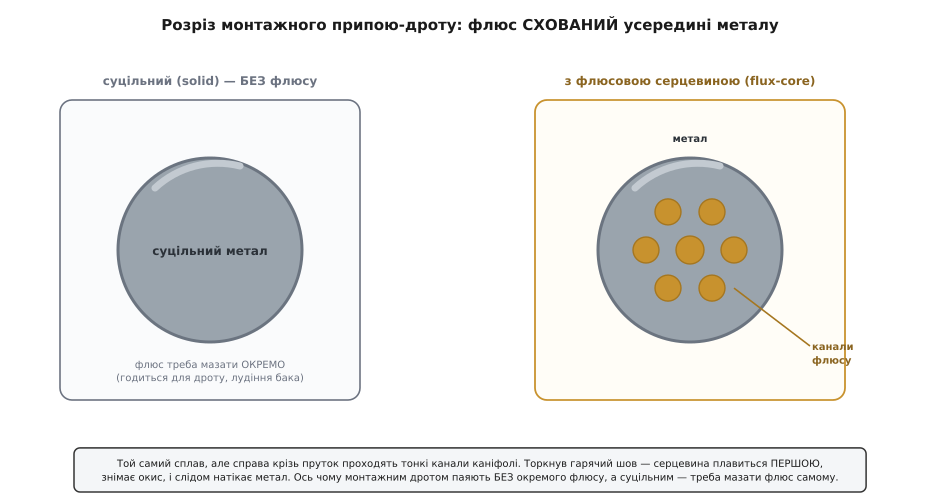
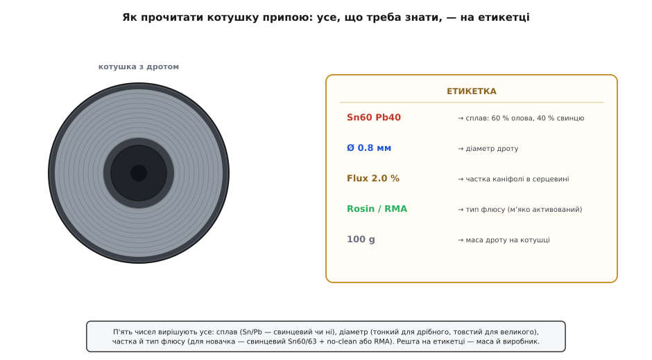

# Припій / олово

<preknowlist>
- [Мінімальна пайка](topic:hw-pcb/basic-soldering) — що таке змочування, флюс і зрощення металів; тут описано САМ матеріал, а як ним працювати — там.
- [Оксиди](root:basic-chemistry/oxides) — тонка плівка окису на металі, яку припій не змочує; саме її знімає флюс усередині дроту.
- [Металічний зв'язок](root:basic-chemistry/metallic-bond) — чому метали тримаються спільною хмарою електронів; звідси й те, що два метали здатні зрости в один.
</preknowlist>

Візьми в руки котушку монтажного припою — і в долоні опиниться на перший погляд проста річ: намотаний на бобіну блискучий сірий дротик, м'який, гнеться пальцями, лишає на них ледь помітний матовий слід. Але цей дротик — не суцільний метал, як здається, і навіть не «олово», хоч його так усі й називають. Це ретельно підібраний **сплав** із захованими всередині каналами хімічно активної смоли, і кожне число на етикетці — склад, діаметр, частка флюсу — прямо вирішує, чи ляже твій шов блискучою краплею з першого дотику, чи збереться тьмяною кулькою, яка через тиждень відвалиться.

Сама техніка пайки — коли і як гріти, чим вести жало — окрема тема; тут ідеться про сам матеріал у руці. І перше, що варто про нього зрозуміти, — чому його дарма звуть просто «оловом».

## Що це і чому не просто «олово»

Слово «припій» кажуть про метал, яким **спаюють** — з'єднують два інші метали, не розплавляючи їх самих. Його англійська назва *solder* прийшла з латини: *solidare* — «робити цілим, зміцнювати» (від *solidus* — твердий), через старофранцузьке *souder*; в англійську слово ввійшло десь у середині XIV століття, і вже сам корінь каже, для чого це — **зробити з двох одне**. Уся ідея припою — дати металу, що плавиться нижче за деталі, затекти в стик і, застигнувши, тримати їх укупі.

А чому не чисте олово, якщо всі так і кажуть — «залудити оловом»? Бо чисте олово для цього **посереднє**. Воно плавиться аж при 232 °C, а застигає не різко, а розтягнуто, встигаючи «поворухнутися» й дати тьмяний, крихкий шов. Тому монтажний припій майже завжди — **суміш**, підібрана так, щоб плавитися нижче, розтікатися легше й застигати миттєво й міцно. Класика — олово зі свинцем; сучасна альтернатива без свинцю — олово з дрібкою срібла й міді. Олово в назві теми лишилося як народна етикетка, але точніше казати саме «припій»: це завжди сплав під конкретну роботу.

> 🔧 **Навіщо це.** Плутанина «припій = олово» коштує новачкові першої зіпсованої плати. Купивши котушку «олова» навмання, легко взяти або чисто-олов'яний дріт (гарячий, примхливий, тьмяніє), або товстий сантехнічний припій із кислотним флюсом, що згодом роз'їдає доріжки. Розуміння, що це **сплав під задачу з певним флюсом**, одразу підказує читати етикетку, а не колір.

## Що всередині дроту: метал і схований флюс

Найважливіша річ, яку не видно оком: монтажний припій-дріт **порожнистий**. Крізь метал уздовж усього прутка проходять тонкі канали, залиті [флюсом](topic:hw-pcb/basic-soldering) — застиглою хвойною смолою (каніфоллю). Це називають **флюсовою серцевиною** (англ. *flux core*). Зовні — звичайний сірий дротик; у розрізі — металева трубка з бурштиновими жилками всередині.



*Той самий сплав, дві конструкції. Суцільний (solid) — однорідний метал, флюс до нього треба підводити окремо. Флюс-core — крізь пруток проходять канали каніфолі: торкнув гарячий шов, серцевина плавиться першою, знімає окисну плівку, і слідом натікає метал. Ось чому монтажним дротом паяють без окремого флюсу.*

Навіщо ховати флюс усередину? Бо без нього метал **не змочить** мідь. Будь-який метал на повітрі миттєво вкривається невидимою плівкою [окису](root:basic-chemistry/oxides), а розплавлений припій окис не любить — збирається на ньому кулькою, як вода на жирному склі. Флюс при нагріві цю плівку **розчиняє й знімає**, оголюючи чистий метал, і ненадовго береже його від нового окислення, поки натече припій. Схований у серцевині, флюс приходить рівно туди й тоді, коли треба: торкнувся дротом розігрітого стику — серцевина плавиться першою, розтікається, зачищає поверхню, а вже слідом іде метал. Тому монтажним дротом здебільшого паяють **без окремого флюсу**: він уже всередині.

Звідси й практичне правило — паяти **свіжим торканням дроту до шва**, а не наперед розплавленою на жалі краплею. У краплі, що вже посиділа на гарячому жалі, флюс вигорів, вона «мертва» й лише бруднить. А от суцільний дріт (**solid**, без серцевини) продають окремо — для лудіння великих поверхонь, ремонту, де флюс наносять пензликом самі, і там, де серцевинна каніфоль була б зайвою.

> 🔧 **Навіщо це.** Побачивши в магазині «solder wire», перевір, чи це **flux-core**, а не solid. Суцільним дротом без досвіду й окремого флюсу нормально не спаяти нічого — метал збиратиметься кульками, і здаватиметься, що «руки криві» чи «паяльник поганий», хоча бракує лише флюсу. Для звичайного монтажу бери flux-core; solid — свідомо й лише коли є свій флюс.

## Сплави: свинцевий проти безсвинцевого

Тепер головне, чим одна котушка відрізняється від іншої, — **склад сплаву**. Він записаний на етикетці хімічними символами з частками: Sn — олово (лат. *stannum*), Pb — свинець (лат. *plumbum*), Ag — срібло, Cu — мідь. Число поруч — відсоток за масою. Sn63 Pb37 читається просто: 63 % олова, 37 % свинцю.

Чому пропорції саме такі, а не круглі? Тут ховається красива фізика. Суміш 63 % олова й 37 % свинцю плавиться при **183 °C — нижче за обидва чисті метали** (олово 232 °C, свинець 327 °C) і, головне, **миттєво, в одній точці**, без проміжного напівм'якого стану. Така особлива пропорція, що плавиться й застигає різко в одній температурі, зветься [евтектикою](topic:hw-pcb/eutectic-alloys) (гр. *eútēktos* — легкоплавкий), і саме вона робить пайку зручною: припій або твердий, або рідкий, різко — тож шов не встигає «попливти» в кашоподібному стані й застигнути тьмяним.


*Де плавиться кожен сплав. Крапля — евтектика: тверде↔рідке миттєво, в одній точці. Брусок — «кашоподібний» інтервал між солідусом (усе ще тверде) і лідусом (уже цілком рідке): у ньому припій напівм'який, і його легко ненароком ворухнути, діставши тьмяний холодний шов. Свинцевий Sn63Pb37 — ідеальна точка 183 °C; безсвинцеві гарячіші й переважно з ширшим інтервалом.*

Ось чотири сплави, які реально трапляються на котушках, і чим вони різняться як товар.

**Sn63 Pb37** — свинцева евтектика, еталон монтажу. Плавиться різко при 183 °C, чудово змочує, застигає дзеркально-блискучим, **прощає** новачкові найбільше. Мінус один, але важливий: свинець отруйний.

**Sn60 Pb40** — майже той самий, трохи дешевший, з крихітним інтервалом плавлення 183–190 °C (сім градусів «каші»). На практиці для руки різниця з 63/37 майже невідчутна; обидва — чудовий вибір для навчання й ремонту.

**SAC305** (Sn ~96.5 % / Ag 3 % / Cu 0.5 %) — найпоширеніший **безсвинцевий** сплав, промисловий стандарт для поверхневого монтажу. Плавиться вище, у вузькому інтервалі близько 217–220 °C, змочує гірше, тьмяніший на вигляд і потребує гарячішого жала та активнішого флюсу. Срібло робить його помітно дорожчим.

**Sn99.3 Cu0.7** — безсвинцевий «економ»: олово з дрібкою міді, без срібла. Теж евтектичний, плавиться при 227 °C — ще гарячіший за SAC, дешевший, але капризніший у змочуванні.

Чому взагалі відмовляються від свинцю, якщо він такий зручний? Бо він **отруйний**, і з 1 липня 2006 року в побутовій електроніці Євросоюзу його обмежила директива **RoHS** (англ. *Restriction of Hazardous Substances* — обмеження небезпечних речовин; чинна саме з цієї дати). Промисловість перейшла на безсвинцеві сплави; тому нова серійна техніка паяна переважно SAC. Але для **навчання, ремонту й саморобок** багато хто свідомо бере свинцевий 60/40 чи 63/37 — він знімає половину проблем новачка сам, бо нижча температура й краще змочування дають блискучий шов навіть недосвідченій руці.

> 🔧 **Навіщо це.** Для першої плати бери **свинцевий Sn60Pb40 або Sn63Pb37 з флюсовою серцевиною** — це найлегший старт, крапка. Свинець небезпечний не парою (при 320 °C олово-свинець майже не випаровується), а **осіданням на руках**: не їж і не три очі під час пайки, мий руки після. Диму, який ти бачиш, — це флюс, що вигоряє, а не свинець; його все одно не вдихай і провітрюй. Безсвинцевий SAC свідомо бери, коли лагодиш сучасну серійну плату (щоб не мішати сплави) або коли готовий виріб має бути RoHS-сумісним; будь готовий до гарячішого жала й активнішого флюсу.

## Тип флюсу в серцевині: наскільки він їдкий

Раз флюс схований у дроті, важливо знати, **який саме** там флюс — бо від його активності залежить і те, як легко піде змочування, і те, чи треба потім відмивати плату. На етикетці це буває позначено як тип каніфольного флюсу.

**R** (Rosin, чиста каніфоль) — найм'якший, майже неактивний; годиться лише для чистих, легко-паяних поверхонь. **RMA** (Rosin Mildly Activated — каніфоль слабко активована) — найпоширеніший у монтажі: додано трохи активатора для кращого змочування злегка окисленої міді, а залишок м'який і його переважно можна не змивати. **RA** (Rosin Activated — активована) — сильніший, для важких поверхонь, але залишок їдкіший, і його краще відмивати, надто на високоомних вузлах. Окремо стоять **no-clean** — сучасні малозалишкові флюси, після яких за нормою мити не треба, — і **water-soluble** (водорозчинні), навпаки дуже активні, які **обов'язково** змивають водою, інакше залишок з часом роз'їдає доріжки.

Для практики важить проста річ: **не всякий флюс однаково нешкідливий після пайки**. І окремо — застереження про зовсім чужий клас: **кислотний флюс** (та припій із ним, «сантехнічний», для труб і жерсті) в електроніці не місце. Він чудово лудить залізо, але його залишок електропровідний і корозійний — за місяці роз'їсть тонкі мідні доріжки й виводи. На вигляд такий припій часто товщий і з окремою баночкою пасти-кислоти; його легко сплутати з монтажним, і це класична пастка.

> 🔧 **Навіщо це.** Купуючи, бери монтажний припій із позначкою **no-clean** або **RMA/rosin** — з ним можна працювати, не відмиваючи плату щоразу. Побачив «acid core», «for plumbing», «активний/кислотний флюс», окрему пасту-«паяльну кислоту» — це **не для електроніки**: спаяне ним працюватиме тиждень, а потім почне гнити зеленню на доріжках. Водорозчинний флюс — потужний, але тільки якщо готовий одразу ретельно мити плату теплою водою.

## Діаметр: тонкий чи товстий і під що

Дріт продають різної товщини, і діаметр — не дрібниця, а вибір під розмір роботи. Логіка проста: за одну секунду з дроту в шов має піти **стільки металу, скільки треба саме на цей стик**, — не більше й не менше.

**Тонкий, 0.3–0.5 мм** — для дрібного: SMD-компоненти, тонкі виводи, ноги мікросхем із малим кроком. Тонким дротом легко дозувати мікроскопічну краплю й не залити сусідні площадки. На великому стику ним намучишся — доведеться довго підсовувати.

**Середній, 0.6–0.8 мм** — універсальний робочий діапазон для звичайного наскрізного монтажу (through-hole): ноги резисторів, роз'ємів, штирів. Якщо береш **одну** котушку на все — бери десь **0.7–0.8 мм**: він і дрібне витягне, і на середньому стику не забарить.

**Товстий, 1.0 мм і більше** — для великого: масивні контакти, з'єднання товстих проводів, лудіння площ, роз'єми живлення. Багато металу за раз — але на дрібній ніжці таким дротом легко залити все навколо.

> 🔧 **Навіщо це.** Один діаметр на старт — **0.7–0.8 мм flux-core, свинцевий**: найуніверсальніший компроміс, яким комфортно і ноги деталей паяти, і більшість ремонтів. Потім, коли візьмешся за дрібний SMD, доклади котушку **0.3–0.4 мм** — товстим дротом акуратний SMD-шов майже не зробити, скільки б досвіду не було. Товстий (1 мм+) лишай на силові з'єднання й лудіння; для тонкої електроніки він завеликий.

## Як прочитати котушку

Уся потрібна інформація — на етикетці бобіни, і читається за п'ятьма пунктами. Навчившись їх бачити, ти обираєш припій свідомо, а не за виглядом дротика.



*Що написано на котушці. Сплав (Sn/Pb чи безсвинцевий) вирішує температуру й «прощення»; діаметр — під розмір роботи; частка й тип флюсу — наскільки активна серцевина й чи мити після; маса — скільки дроту. П'ять чисел — і про припій відомо все, що треба, ще до покупки.*

Ось ці п'ять пунктів по черзі:

```
Sn60 Pb40    → сплав: 60 % олова, 40 % свинцю (свинцевий, легкий у роботі)
Ø 0.8 мм     → діаметр дроту (0.7–0.8 — універсал; 0.3–0.4 — SMD; 1 мм+ — силове)
Flux 2.0 %   → частка каніфолі в серцевині (≈1.5–3.5 % — норма; менше — мало флюсу)
Rosin / RMA  → тип флюсу (no-clean чи RMA — можна не мити; acid — НЕ для електроніки)
100 g        → маса дроту на котушці (на навчання вистачить надовго)
```

Частка флюсу (**flux %** або **flux content**) — єдине число тут, яке новачки пропускають, а воно важить. Занадто мало флюсу (менше ~1.5 %) — і серцевини не вистачає, щоб зачистити поверхню, доводиться домазувати окремо. Норма для монтажу — десь **1.5–3.5 %**. Решта — маса й виробник; на масу зважай хіба щоб зайвий раз не докуповувати.

## Як зберігати і чому воно псується

Здавалося б, метал — що йому станеться. Псується не метал, а **флюс** усередині й поверхня дроту. Каніфольна серцевина з роками потроху втрачає активність, а поверхня олова тьмяніє окисом — і старий припій починає гірше змочувати, хоч сплав той самий. Тому:

Тримай котушку в **сухому** місці, подалі від вологи (вона пришвидшує окислення поверхні дроту) і від сильної спеки. Кінчик дроту, який стирчить, з часом окислюється сильніше — перед роботою після довгої перерви іноді досить відкусити й викинути перший сантиметр, і далі піде свіжий, блискучий метал. Свинцевий і безсвинцевий тримай **окремо й підписаними**: переплутавши котушки, легко здивуватися, чому «той самий» дріт раптом тече інакше — у безсвинцевого просто вища температура плавлення й примхливіший флюс.

Є ще одна екзотична, але красива загроза саме **чистому олову** (не так сплавам): на морозі воно здатне саме розсипатися на сірий порошок. Цю дивовижу — і легенду, ніби через неї замерзла армія Наполеона, — розібрано окремо, [чому олово хворіє на морозі й що з цього правда](topic:cat-hw-instruments/solder-tin/hist-solder-tin.md). Для монтажного припою це радше цікавинка, ніж практична біда: свинець і домішки в реальному дроті цю хворобу глушать.

> 🔧 **Навіщо це.** Якщо припій «раптом перестав нормально паятися» після року на полиці — перш ніж винуватити паяльник, відкуси свіжий кінчик і додай крапельку окремого флюсу: у дев'яти випадках із десяти справа в окисленому кінці й підсілій серцевині, а не в металі. І не тримай котушки біля вікна чи батареї — волога й спека старять флюс швидше за все інше.

## Мінімальний набір під припій

Щоб реально почати паяти, з боку розхідників треба небагато. **Одна котушка свинцевого flux-core, Sn60Pb40 або Sn63Pb37, діаметром 0.7–0.8 мм** — це основа, якою робиться майже все. Додатково варто мати **окремий флюс** (каніфоль або гель у шприці) — про запас, для впертих окислених точок, де серцевинного не вистачає, і для лудіння суцільним дротом. Для дрібного SMD згодом — тонша котушка 0.3–0.4 мм. Оце й весь список: решта майстерності — не в матеріалах, а в руці й у розумінні, що припій зрощує метали, а не приклеює. А як саме тримати цю руку — коли гріти деталь, а не сам припій, і чому добрий шов виходить блискучим — це вже про [саму пайку](topic:hw-pcb/basic-soldering).
