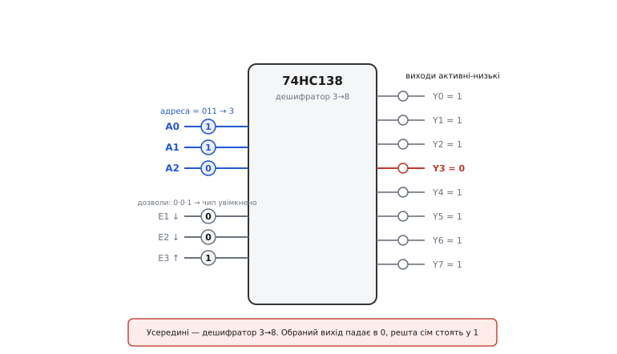
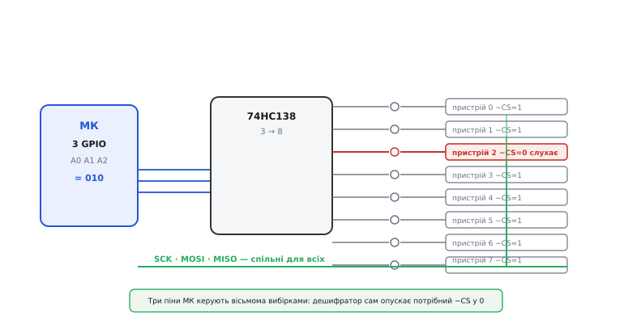
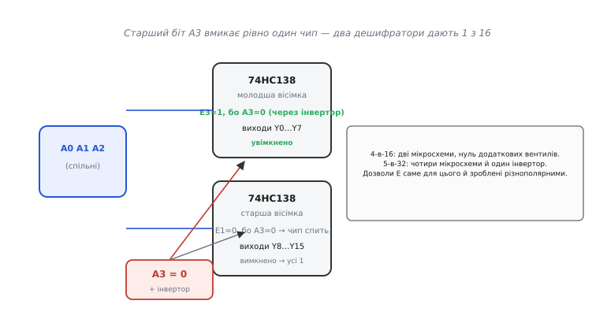

# 74HC138

74HC138 — мікросхема, що втілює [дешифратор](root:hw-digital/combinational-circuits) у чистому вигляді: число на трьох входах вмикає рівно один із восьми виходів. Логічно це той самий блок, який збирається з вентилів, тільки тут він **3-в-8** і відлитий у готову деталь. На ньому добре видно, як абстрактна комбінаційна схема перетворюється на справжню мікросхему й день у день розв'язує цілком земну задачу: як кільком пристроям ужитися на одній спільній шині, не перебиваючи одне одного.

## Що це за деталь

74HC138 — це **дешифратор/демультиплексор «1 з 8»**: бере трибітне число на адресних входах і вмикає той єдиний вихід, чий номер дорівнює цьому числу. Слово «дешифратор» (від англ. *decoder* — «розкодовувач») саме це й означає: він бере стиснутий код (три біти, що задають число 0…7) і «розгортає» його в позиційний сигнал — одну активну лінію з восьми. Друга назва, «демультиплексор» (від лат. *multiplex* — «багатоскладовий»; *demultiplex* — «розкласти один потік на багато виходів»), описує той самий чип з іншого боку: якщо адресою керувати, а на вхід дозволу подавати дані, то один вхідний сигнал піде рівно на той вихід, який вибрано адресою. Це дві ролі одного шматка кремнію.

Деталь — прямий нащадок історичної **серії 7400** (англ. *7400-series* — «серія сім-тисяч-чотириста»), родини логічних мікросхем, що почалася з простого вентиля 7400 (чотири елементи [NAND](root:hw-digital/nand-nor) в одному корпусі) від Texas Instruments: спершу у військовому виконанні (5400) восени 1964 року, а від 1966-го — у дешевому пластиковому корпусі для всіх. Кожній функції в серії дали свій номер; «138» дістався саме цьому дешифратору й закріпився за ним на десятиліття. Літери **HC** означають уже сучасну начинку — *High-speed CMOS* («швидкісний КМОН»), тобто всередині стоять [КМОН-вентилі](root:hw-digital/cmos-gate): живлення 2–6 В, у спокої — одиниці мікроампер струму, тож деталь чудово почувається поряд з мікроконтролером на 3.3 В. Та сама логічна функція, що колись стояла в міні-комп'ютерах на TTL, тепер коштує копійки.


*Усередині — дешифратор 3→8. Зліва три адресні входи A0–A2 задають число (тут 011 = 3) і три дозволи E1, E2, E3. Справа — вісім виходів Y0–Y7 з важливою деталлю: вони активні-низькі (кружок-інверсія на кожному). Обраний вихід падає в 0, решта сім стоять у 1. Тут адреса 3 і чип дозволено, тож у 0 пішов лише Y3.*

## Як читати число на входах

Три адресні входи — це звичайне двійкове число, де A0 — молодший біт, а A2 — старший. Комбінація бітів прямо називає номер виходу:

```
A2 A1 A0  →  активний вихід (падає в 0)
 0  0  0  →  Y0
 0  0  1  →  Y1
 0  1  0  →  Y2
 0  1  1  →  Y3
 1  0  0  →  Y4
  …            …
 1  1  1  →  Y7
```

Жодного перетворення в голові робити не треба: записав у три ніжки число 5 у двійці (101) — і чип сам опустив Y5. Це і є вся «таблиця істинності» дешифратора, тільки замість сухого переліку зручніше тримати в голові саме правило «номер на вході = номер виходу».

## Три групи ніжок і головна пастка

Назовні 74HC138 — це три групи ніжок плюс живлення:

```
VCC, GND        — живлення (2–6 В) і земля
A0, A1, A2      — три адресні входи (число 0…7)
E1, E2          — два дозволи, активні-НИЗЬКІ (для роботи тримати в 0)
E3              — третій дозвіл, активний-ВИСОКИЙ (для роботи тримати в 1)
Y0…Y7          — вісім виходів, активні-НИЗЬКІ (обраний = 0, решта = 1)
```

Двох речей варто пильнувати від початку, бо вони — головна пастка цієї деталі. По-перше, виходи **інверсні** (англ. *active-low* — «активний у низькому»): активний стан — це 0, а не 1, тож сім «неактивних» ліній постійно сидять у високому рівні. Хто чекає на обраному виході одиницю, той витратить вечір на марне налагодження. По-друге, дозволів аж **три**, і вони різнополярні: щоб чип почав декодувати, потрібно одночасно E1 = 0, E2 = 0 і E3 = 1. Будь-яке відхилення — E3 впало в 0 або E1/E2 піднялися в 1 — і всі вісім виходів ідуть у 1, тобто «нічого не обрано».

Ці три дозволи здаються надмірністю, та насправді це подарунок. Саме вони дають змогу **складати** дешифратори в більші, не докуповуючи вентилів: дозвіл одного чипа стає «вибором кристала» для нього самого, і з кількох корпусів виходить дешифратор на 16 чи 32 виходи.

## Навіщо це: вісім ліній вибору з трьох пінів

Тепер — навіщо все це на практиці. Уявімо спільну цифрову шину (як-от SPI), на якій висить кілька пристроїв. Дроти даних і тактів у них спільні, заведені паралельно до всіх одразу, — тож у кожен момент говорити має **рівно один**, інакше відповіді змішаються на спільних лініях. Кожен пристрій має для цього вхід **вибору кристала** (англ. *chip select*, ~CS — «вибір мікросхеми»), активний-низький: поки на ньому 1 — пристрій «спить» і відпускає шину; впав у 0 — пристрій слухає. Питання лише в тому, звідки взяти стільки сигналів ~CS, не витративши по ніжці мікроконтролера на кожен пристрій. Відповідь — 74HC138.


*Три лінії GPIO мікроконтролера задають адресу 74HC138, а його вісім активних-низьких виходів ідуть просто на входи ~CS восьми пристроїв. За адреси 010 = 2 у 0 падає лише ~CS2 — слухає пристрій 2, решта сім тримають ~CS = 1 і мовчать. Шина даних (SCK, MOSI, MISO) спільна й заведена паралельно до всіх; хто з них озветься — вирішує дешифратор. Так три піни МК керують вісьмома вибірками.*

Вигода тут двостороння. Інверсні виходи дешифратора лягають на інверсні входи ~CS **без жодного зайвого вентиля** — це той випадок, коли «незручна» активна-низька логіка раптом виявляється рівно тим, що треба. А три ніжки МК заступають вісім: економія росте, бо трьома бітами адресуються вісім ліній, чотирма — шістнадцять. На вхід дозволу E корисно завести ще один GPIO, щоб одним рухом «погасити» всі вибірки разом — це рятує при старті, поки рівні портів ще не визначені й можуть випадково зачепити якийсь пристрій.

> 🔧 **Навіщо це.** Коли до одного мікроконтролера треба під'єднати АЦП, флеш-пам'ять, дисплей і ще пару давачів по SPI, ніжок під окремий ~CS на кожного швидко бракує. 74HC138 розв'язує це майже задарма: один корпус за копійки звільняє п'ять ніжок порту (вісім вибірок замість трьох ліній адреси), які тепер можна пустити на щось корисніше.

## Перший байт: як ним «заговорити»

Найприємніше, що жодного протоколу тут немає — 74HC138 не програмують, він просто [комбінаційний](root:hw-digital/combinational-circuits): що на входах зараз, те й на виходах, без затримки на команди. «Перший байт» зводиться до трьох рядків думки:

```
1) виставити на A0,A1,A2 номер потрібного пристрою (0…7)
2) дешифратор САМ опустить відповідний ~CS у 0 (решта = 1)
3) поговорити по спільній шині — і вибрати назад іншу адресу
```

Тобто вибір пристрою — це просто запис трьох бітів у три GPIO; усе інше дешифратор робить миттєво, без команд і регістрів.

**Умова.** Три виходи мікроконтролера заведено на A0, A1, A2; дозволи прив'язані намертво (E1, E2 — на землю, E3 — на VCC). Треба вибрати пристрій 5, обмінятися байтом по SPI й зняти вибірку. Вибрати «нікого» можна лише через дозвіл, тож для паузи гасимо чип старшим бітом, якщо E3 заведено на окремий GPIO.

:::tabs
```cpp
// A0->PB0, A1->PB1, A2->PB2 (один порт, сусідні ніжки)
static inline void decoder_select(uint8_t dev) {   // dev = 0..7
    // вставляємо три біти адреси, не чіпаючи решту порту
    PORTB = (PORTB & ~0x07u) | (dev & 0x07u);
}

void talk_to_device5(void) {
    decoder_select(5);          // 101 -> Y5 падає в 0 -> ~CS пристрою 5 = 0
    uint8_t reply = spi_xfer(0x9F);   // обмін по спільній шині, поки CS5 активний
    decoder_select(0);          // 000 -> тепер активний Y0; пристрій 5 відпущено
    (void)reply;
}
```
```micropython
from machine import Pin

# A0, A1, A2 -> три окремі ніжки (у MicroPython немає «порту цілком»)
A = [Pin(0, Pin.OUT), Pin(1, Pin.OUT), Pin(2, Pin.OUT)]

def decoder_select(dev):        # dev = 0..7
    # виставляємо три біти адреси окремо на кожну ніжку
    for i in range(3):
        A[i].value((dev >> i) & 1)

def talk_to_device5():
    decoder_select(5)           # 101 -> Y5 падає в 0 -> ~CS пристрою 5 = 0
    reply = spi.read(1, 0x9F)   # обмін по спільній шині, поки CS5 активний
    decoder_select(0)           # 000 -> тепер активний Y0; пристрій 5 відпущено
    return reply
```
:::

Зверніть увагу на третій крок: «зняти вибірку з пристрою 5» означає **обрати будь-яку іншу адресу** — дешифратор завжди тримає рівно один вихід у нулі, тож «відпустити всіх одразу» самою лише адресою не вийде. Якщо в системі справді потрібен стан «жоден не вибраний», вибірку гасять через дозвіл E: поки E тримає чип вимкненим, усі виходи стоять у 1 і жоден ~CS не активний.

## Розширення вибором кристала: з двох чипів — «1 з 16»

Восьми ліній інколи замало. Тут і спрацьовує те, заради чого дозволів зробили три й різнополярними. Візьмемо **дві** мікросхеми й четвертий, старший біт адреси A3. Молодші три біти A0–A2 заводимо **спільно** на обидва чипи — вони завжди показують ту саму трійку. А біт A3 розводимо на дозволи так, щоб у кожен момент був дозволений рівно один чип: на перший — прямо, на другий — через інвертор.


*Старший біт A3 і його інверсія керують дозволами двох чипів. За A3 = 0 дозволено молодшу вісімку (виходи 0…7), а старша спить і тримає свої виходи в 1; за A3 = 1 — навпаки. Молодші біти спільні, тож разом виходить чесний дешифратор «1 з 16» — без жодного додаткового вентиля, лише на дозволах.*

Це і є **каскадування**: дозвіл одного чипа використовуємо як «вибір кристала» для нього самого. Чотирма адресними бітами адресуємо шістнадцять виходів, і для цього не потрібно жодної зайвої логіки — досить того, що один дозвіл активний-високий, а інший низький (A3 сам собі задає полярність на одному чипі, а інвертор — на другому). Якщо піти далі, **п'ять** бітів і шістнадцять виходів складаються з **чотирьох** 74HC138 та одного інвертора — виходить дешифратор «1 з 32». Це класичний прийом адресної дешифрації пам'яті: старші біти адреси крізь каскад дешифраторів вибирають потрібну мікросхему, молодші — комірку всередині неї.

> 🔧 **Навіщо це.** Коли по SPI висить понад вісім пристроїв або коли треба вибирати банки пам'яті, каскад дешифраторів дає десятки незалежних ліній вибору буквально з кількох ніжок МК. Дозволи тут — не баласт, а саме той гачок, за який чипи зчіплюються в більший дешифратор без додаткових деталей.

## Типові граблі

- **Виходи активні-низькі.** Найчастіша помилка — чекати на обраному виході 1. Ні: обраний падає в **0**, а сім інших стоять у 1. Для входів ~CS це ідеально, але якщо потрібен активний-**високий** сигнал (скажімо, засвітити світлодіод анодом до лінії), доведеться додати інвертор або взяти 74HC238 — близнюка з прямими виходами.
- **Забули про дозволи.** Лишили E3 у 0 або підтягнули E1/E2 до 1 — і чип «мертвий»: усі виходи в 1, нічого не обирається. Незадіяні дозволи **прив'язуйте** жорстко (E1, E2 — на землю, E3 — на VCC), а не лишайте «висіти»: плаваючий КМОН-вхід ловить наводки й чип починає вимикатися сам собою.
- **Тільки один активний завжди.** Дешифратор фізично не вміє мовчати «на всіх восьми»: коли він дозволений, рівно один вихід **завжди** в 0. Якщо потрібен стан «нікого не обрано», вимикайте чип через дозвіл E — тоді всі виходи разом підуть у 1.
- **Перемикання «обтікає» сусіда.** Поки три адресні біти змінюються не строго одночасно, на частку мікросекунди може коротко «блимнути» хибна адреса — і не той ~CS на мить впаде в 0. Це ті самі [глітчі](root:hw-digital/combinational-circuits), що виникають у комбінаційних схемах при неодночасній зміні входів. Тому адресу міняють, **поки шина мовчить**, а не посеред обміну, коли хибний імпульс на чужому ~CS зіпсував би передачу.

## Варіації класу

Та сама функція живе в кількох близьких номерах. **74HC138** — базовий дешифратор «1 з 8» з активними-низькими виходами; **74HC238** — його двійник з активними-**високими** виходами (зручно там, де потрібна 1, а не 0). **74HC139** — це **два** незалежні дешифратори «1 з 4» в одному корпусі (коли восьми ліній забагато, а дві четвірки — саме враз). Ширший родич **74HC154** декодує вже «1 з 16» одним корпусом (чотири адресні входи). А за іншими літерами (74**LS**138 на старому TTL, 74**HCT**138 із входами під 5-вольтову логіку) ховається той самий дешифратор — змінюється лише начинка й рівні, а призначення «три піни обирають один із багатьох» лишається тим, заради чого ця деталь і потрапила в кожну шухляду з мікросхемами.
