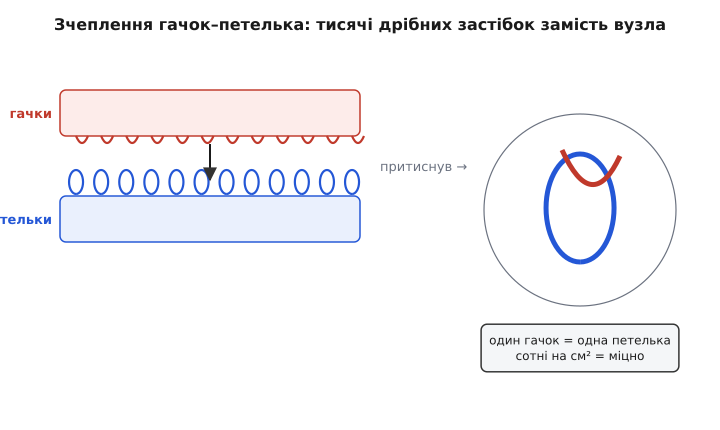
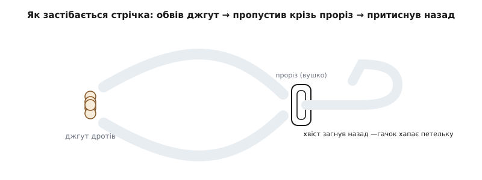
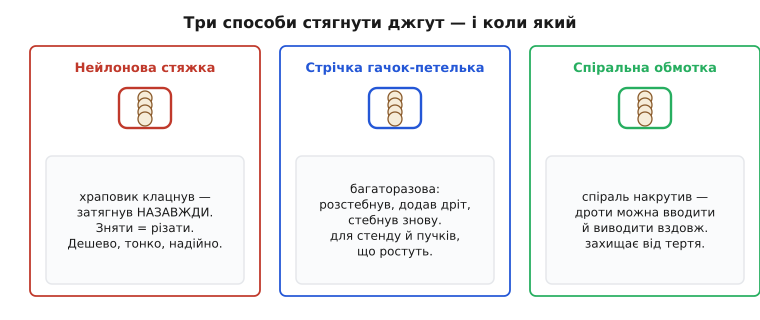

# Органайзер кабелів (стрічка)

<preknowlist>
- [Dupont-дроти](root:cat-hw-parts/dupont-wires) — тонкі перемички між платами й макеткою; саме такі жмути найчастіше й стягують стрічкою.
- [GPIO-шлейф 40-pin](root:cat-hw-parts/gpio-ribbon-cable) — плаский багатожильний кабель до одноплатника; приклад «широкого» кабелю, який стрічка тримає й згорнутим.
</preknowlist>

Візьміть будь-який стіл, де щось паяють, програмують мікроконтролери або збирають дрон. За тиждень на ньому виросте те саме: клубок дротів, у якому USB йде до плати, живлення до макетки, кілька перемичок до давача, а програматор чіпляється за все підряд. Кожен рух — і половина клубка тягнеться слідом. Органайзер кабелів — це найпростіша відповідь на цей безлад: смужка, якою ви обхоплюєте жмут дротів і стягуєте його в один охайний пучок.

Слово «органайзер» тут — про функцію, а не про якийсь один виріб. У цю сумку потрапляє кілька різних застібок, і всіх їх об'єднує одне: вони перетворюють хаос окремих дротів на керований джгут. Найцікавіша й найуживаніша серед них у роботі з електронікою — **багаторазова стрічка з мікрозчепленням «гачок-петелька»** (її часто називають торговою назвою «велкро», хоча це лише один бренд). Саме тому, коли кажуть «органайзер-стрічка», найчастіше мають на увазі саме її. З неї й почнемо, а поряд розберемо решту способів — бо вибір між ними і є половиною вміння.

## Чому взагалі варто стягувати дроти

Здавалося б, дрібниця — ну лежить клубок, і хай лежить. Але безлад дротів коштує реального часу й реальних помилок, і причина не в естетиці.

Коли десять перемичок звисають вільно, кожна з них — це важіль. Потягли за USB — і ненароком висмикнули [Dupont-перемичку](root:cat-hw-parts/dupont-wires) з давача, бо вона зачепилася. Один дріт відійшов на пів міліметра — і сигнал зник, а ви пів години шукаєте «плаваючий баг», який насправді механічний. Стягнутий джгут прибирає цей важіль: тягнете за пучок — рухається пучок цілком, окремий контакт залишається на місці.

Далі — швидкодія читання схеми. Око легко простежує три акуратні джгути «живлення», «дані», «давачі», але захлинається в двадцяти переплетених нитках. А коли треба щось перепідключити — розстебнув потрібний джгут, додав дріт, застебнув назад — це кілька секунд замість розплутування вузлів.

> 🔧 **Навіщо це.** На макетній стадії проєкту схема змінюється щодня: сьогодні додали давач температури, завтра прибрали дисплей. Незв'язані дроти щоразу перетворюють просту зміну на «спочатку розплутай». Кілька багаторазових стрічок на джгутах перетворюють ту саму зміну на «розстебнув-переткнув-застебнув» — і ви лишаєтесь у потоці роботи, а не в боротьбі з клубком.

## Як тримається стрічка: тисячі дрібних застібок

Головний фокус багаторазової стрічки — у тому, **як** вона тримається. Це не липучка в сенсі клею: там нічого не приклеюється. Одна сторона стрічки вкрита щільним полем крихітних жорстких **гачків**, друга — полем м'яких **петельок** (звідси й загальна назва цього класу застібок — «hook-and-loop», гачок-і-петелька). Притиснули дві сторони одна до одної — і кожен гачок чіпляється за якусь петельку. Поодинці зчеплення слабеньке. Але їх сотні на квадратний сантиметр, і разом вони тримають серйозне зусилля.

*Кожен гачок хапає одну петельку. Сила однієї застібки мізерна, але їх — тисячі, і сумарно вони тримають джгут упевнено, а розчіплюються легко, якщо тягти під кутом.*

Тут криється точна й гарна аналогія — реп'ях. Саме з реп'яха, який учепився в собаку на прогулянці, і народилася вся ідея (детальніше про це — нижче). Колючка реп'яха вкрита такими самими мікрогачками, тому й тримається за вовну та тканину. Аналогія працює майже повністю; ламається вона лише в одному: реп'ях природа зробила «на один раз» — гачки крихкі й обламуються. Синтетичні гачки зі щільного нейлону витримують тисячі циклів «застебнув-розстебнув», і саме багаторазовість — головна цінність стрічки в лабораторії.

Чому таке зчеплення легко розстебнути, хоч воно й міцне? Бо напрямок має значення. Коли ви тягнете дві сторони **вздовж**, намагаючись зсунути, всі застібки опираються одразу — тримає добре. А коли **відриваєте краєм**, під кутом, гачки виходять із петельок по черзі, один за одним, як застібка-блискавка. Тому стягнутий джгут не розпадається сам, але ви знімаєте стрічку одним рухом за кутик.

## Як застібається сама стрічка на джгуті

Багаторазові органайзери роблять у двох формах, і корисно розрізняти їх, бо застібаються вони по-різному.

Проста форма — **рулон** двобічної стрічки: один бік суцільно в гачках, другий у петельках. Ви відрізаєте потрібну довжину, обгортаєте джгут і накладаєте гачковий бік на петельковий — стрічка зчіплюється сама із собою. Плюс — будь-яка довжина під будь-який товщину пучка. Мінус — кінець нема за що потягти, доводиться відколупувати край.

Зручніша форма для повторюваної роботи — **стрічка з прорізом-вушком** на одному кінці. Ви обводите джгут, просовуєте хвіст крізь проріз, загинаєте назад — і хвіст лягає гачками на петельки основного тіла. Виходить самозатяжна петля, яку легко послабити або зняти, потягнувши за хвіст.

*Проріз на кінці працює як точка перегину: хвіст, протягнутий крізь нього й загнутий назад, сам себе притискає полем гачок-петелька. Затягування регулюється тим, наскільки глибоко втягнути хвіст.*

Продають такі стрічки і суцільним рулоном (нарізати самому), і готовими нарізаними смужками різної довжини — типово від 12–15 см на тонкі перемички до 20–30 см на товсті джгути та згорнуті кабелі живлення. Багато з них уже мають при основі маленьке кріпильне вушко з отвором — за нього джгут можна прикрутити гвинтиком чи повісити на гачок, щоб він не просто був стягнутий, а ще й тримався на своєму місці в корпусі.

## Не лише стрічка: сусіди по сумці органайзера

Стрічка — не єдиний спосіб зібрати дроти, і для різних задач кращі різні застібки. Три головні варіанти варто тримати в голові разом, бо вибір між ними — це і є практичне вміння.

*Стяжка стягує назавжди й дешево; стрічка стягує багаторазово для пучків, що ще зміняться; спіраль лишає доступ уздовж джгута. Природа задачі диктує вибір.*

**Нейлонова стяжка** (англ. cable tie, а в багатьох майстрів — «хомут» або торгова назва «Ty-Rap») — тонка пластикова смужка із зубцями й голівкою-храповиком на кінці. Просунули хвіст у голівку, затягнули — зубець клацнув, і назад стрічка вже не піде: храповик пускає її лише в один бік. Це стягування **назавжди**: щоб зняти, стяжку ріжуть кусачками. Саме тому вона ідеальна там, де джгут уже остаточний і більше не зміниться — у готовому виробі, всередині корпусу, на джгуті, який має пережити вібрацію. Вона дешева, тонка, тримає надійно й не боїться часу. Але для макетки, де завтра все переткнуть, різати щоразу нову стяжку — марнотратство; там її змінна сестра-стрічка виграє.

**Спіральна обмотка** (spiral wrap) — це не застібка, а гнучка пластикова спіраль, яку накручують на джгут по всій довжині, наче виноградну лозу на паркан. Її головна перевага в тому, що дроти можна **вводити й виводити збоку** в будь-якому місці: спіраль розкручується локально, ви вкидаєте новий дріт у джгут посеред траси й закручуєте назад. Плюс вона захищає дроти від тертя об гострі краї. Ціна цього — обмотка помітно товща за стрічку й забирає більше місця.

Є й дрібніші рідні: **термоусадкова трубка** (стягує намертво й ще й ізолює, але одноразова — надіти можна лише з торця відкритого кабелю), пластикові **кліпси-тримачі**, що приклеюються до столу й ловлять кабель, **гнучкий рукав-обплетення** для товстих джгутів. Усі вони вирішують ту саму задачу — приборкати дроти — але кожен під свій випадок. Стрічка серед них — універсальний робочий інструмент саме тому, що багаторазова й швидка.

Історія цих застібок несподівано драматична: і нейлонова стяжка, і мікрозчеплення гачок-петелька народилися майже одночасно, у 1950-х, і кожна — з дуже конкретної людської досади. Стяжку придумали, бо збирачі літаків до крові стирали пальці, зав'язуючи вузли на дротах; мікрозастібку — бо інженер розглянув під мікроскопом реп'ях, що вчепився в його собаку. Обидва сюжети розібрано окремо — [як народилися стяжка й «велкро»](root:cat-hw-parts/cable-organizer/hist-fasteners.md): хто, коли, з чого й чому саме нейлон усе змінив.

## Як обрати й не наробити помилок

Практичний вибір зводиться до кількох простих запитань, і кожне має чітку логіку.

**Джгут ще зміниться?** Якщо так — беріть багаторазову стрічку. Якщо джгут остаточний (готовий пристрій, схований у корпус) — стяжку: вона тонша, дешевша й надійніша в довгу. Різати стяжку щотижня на макетці безглуздо, а класти багаторазову стрічку в закритий виріб, який ніхто не відкриє роками, — теж марно.

**Наскільки тонкий пучок?** Для двох-трьох тонких перемичок вистачить найвужчої стрічки; товстий джгут живлення чи згорнутий [40-жильний шлейф](root:cat-hw-parts/gpio-ribbon-cable) потребує ширшої й довшої смужки, інакше вона просто не обхопить пучок або вріжеться в нього.

**Чи треба доступ уздовж траси?** Якщо дроти доведеться вводити-виводити посеред джгута — спіральна обмотка; якщо просто стягнути пучок в одному місці — стрічка або стяжка.

Тепер про пастки, кожна з механізмом.

*Затягли надто туго.* Дуже сильне стягування — особливо жорсткою нейлоновою стяжкою — може передавити тонкий дріт або зім'яти ізоляцію. Для сигнальних жмутів залишайте джгут «дихати»: стрічка має тримати пучок разом, а не душити його. Стяжку не тягніть до останнього зубця там, де під нею м'які дроти.

*Дуже частий крок.* Спокуса стягнути джгут через кожні два сантиметри робить його жорстким, як палиця, і ховає надлишок дроту в тугі петлі, що ламаються на згині. Достатньо кількох точок на трасу — джгут має лишатися гнучким.

*Гачки забилися.* Багаторазова стрічка з часом збирає у своє гачкове поле пил, дрібні волокна й ворс. Зчеплення слабшає — це нормальний знос; сильно забиту стрічку простіше замінити, ніж вичищати. Тому й ціна її смішна: це розхідник.

*Сховали слабкий контакт.* Найпідступніше: гарно стягнутий джгут виглядає надійно, але якщо всередині перемичка ледь тримається в роз'ємі, охайність її не полагодить — навпаки, приховає. Спочатку переконайтеся, що контакти сидять щільно, і аж тоді стягуйте. Органайзер — про порядок траси, а не про якість з'єднання.

*Стяжка з гострим хвостом.* Обрізаний край нейлонової стяжки буває гострий, як лезо, — об нього ріжуть пальці й псують сусідні дроти. Обрізайте хвіст урівень із голівкою й, за змоги, зрізом усередину джгута.

У результаті на робочому столі складається проста дисципліна: макетні джгути, що змінюються, — на багаторазовій стрічці; готові вироби — на стяжках; траси, куди ще додаватимуть дроти, — у спіральній обмотці. Кілька гривень за пакет стрічок і стяжок економлять години, які інакше йдуть на розплутування клубка й пошук механічних «плаваючих» несправностей — а це, мабуть, найкраще співвідношення користі до ціни серед усього, що лежить у ящику з приладдям.
