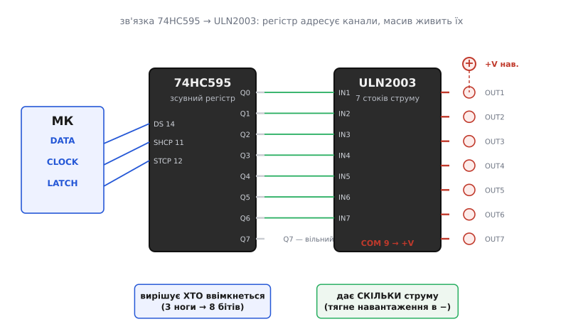

# ⚙️ Приклади керування драйверами: код, що вмикає м'язи

Три чорні прямокутники — `ULN2003`, `L293D`, `74HC595` — уже стоять у панельках, землі зведені, живлення заведене, розпіновку звірено за [довідником виводів трьох драйверів](topic:cat-hw-parts/dip-ics/api-driver-basics.md). Лишилося найцікавіше: змусити їх працювати з коду. Ось тут новачок часто спотикається не об залізо, а об хибне уявлення, ніби «керувати мотором» — це щось складне з бібліотеками й магією. Насправді за кожним із цих чипів стоїть до смішного проста ідея, і код виходить коротким. Складність уся — у **дрібницях підключення**, які код не показує: незведена земля, забутий діод, брак струму там, де його чекаєш. Тому кожен приклад тут — не лише робочий код, а й розбір: що станеться, коли одну з цих дрібниць проґавити.

Мова коду скрізь — **C/C++**. Вибір не випадковий: ми пишемо прямо в ноги — смикаємо рівні, рахуємо такти, іноді ганяємо байти через апаратний SPI. Це домен регістрів і тактів, де C/C++ — рідна мова, а Python на мікроконтролері лише заважав би між нашим наміром і залізом. А от **платформа** — не одна: кожен приклад показано вкладками під Arduino, ESP-IDF і STM32 HAL. Порядок теж не випадковий: Arduino йде першим як найкоротший шлях побачити суть. Але сама суть — «нога у вихід, рівень на нозі, ШІМ на вході дозволу, байт у зсувний регістр» — однакова на будь-якому мікроконтролері; змінюються лише назви функцій і те, скільки треба сказати вголос при налаштуванні.

Розберемо три задачі по черзі: увімкнути реле й погнати кроковий мотор через `ULN2003`; задати двигуну напрямок і оберти через `L293D`; заштовхати байт у `74HC595` і зчепити його з силовим масивом. Кожна — окремий, самодостатній шматок, який можна взяти й запустити. Яка ніжка вхід, яка вихід, де живлення й таблиця істинності — усе поруч, у [довіднику виводів](topic:cat-hw-parts/dip-ics/api-driver-basics.md); тут дивимося на код і на пастки.

## ULN2003: один канал вмикає реле чи яскравий світлодіод

Почнемо з найпростішого, що взагалі може робити драйвер, — увімкнути одне навантаження. `ULN2003` тут поводиться майже як прозорий подовжувач ноги: подаєш «1» на вхід каналу — вихід стягується на землю й пропускає струм; подаєш «0» — відпускає. З погляду коду це нічим не відрізняється від блимання світлодіодом. Уся різниця — фізична: між ногою й навантаженням тепер стоїть ключ, здатний тягти до 500 мА замість кволих 20 мА самої ноги.

Візьмемо конкретику. Вхід каналу 1 (`IN1`, вивід 1 чипа) з'єднаний з будь-якою цифровою ногою МК, налаштованою на вихід (у прикладах нижче це нога `8` на Arduino, `GPIO18` на ESP32, `PA8` на STM32). Реле обмоткою висить між **плюсом свого живлення** (скажімо, 5 В) і **виходом каналу 1** (`OUT1`, вивід 16) — тобто чип, увімкнувшись, дає струму дорогу з плюса крізь обмотку в землю. Вивід `COM` (9) заведений на той самий плюс живлення реле, і це вмикає вбудований гасильний діод. Тоді код тривіальний:

:::tabs
```arduino
// ULN2003: клацаємо реле раз на секунду через канал 1.
// Нога 8 → IN1 (вивід 1 чипа). Реле: +5V → обмотка → OUT1 (вивід 16).
// COM (вивід 9) → +5V живлення реле — обов'язково, це вмикає гасильний діод.
const int RELAY_CH = 8;   // нога МК, що керує входом каналу 1

void setup() {
  pinMode(RELAY_CH, OUTPUT);
}

void loop() {
  digitalWrite(RELAY_CH, HIGH);   // «1» на IN1 → OUT1 сідає на землю → реле спрацьовує
  delay(1000);
  digitalWrite(RELAY_CH, LOW);    // «0» → OUT1 відпускається → реле відпускає
  delay(1000);
}
```
```esp-idf
// ULN2003: клацаємо реле раз на секунду через канал 1.
// GPIO18 → IN1 (вивід 1 чипа). Реле: +5V → обмотка → OUT1 (вивід 16).
// COM (вивід 9) → +5V живлення реле — обов'язково, це вмикає гасильний діод.
#include "driver/gpio.h"
#include "freertos/FreeRTOS.h"
#include "freertos/task.h"

#define RELAY_CH  GPIO_NUM_18     // нога МК, що керує входом каналу 1

void app_main(void) {
    gpio_config_t io = {
        .pin_bit_mask = 1ULL << RELAY_CH,
        .mode = GPIO_MODE_OUTPUT,
    };
    gpio_config(&io);             // те саме, що pinMode(): нога у вихід

    while (1) {
        gpio_set_level(RELAY_CH, 1);      // «1» на IN1 → OUT1 сідає на землю → реле спрацьовує
        vTaskDelay(pdMS_TO_TICKS(1000));
        gpio_set_level(RELAY_CH, 0);      // «0» → OUT1 відпускається → реле відпускає
        vTaskDelay(pdMS_TO_TICKS(1000));
    }
}
```
```stm32
// ULN2003: клацаємо реле раз на секунду через канал 1.
// PA8 → IN1 (вивід 1 чипа). Реле: +5V → обмотка → OUT1 (вивід 16).
// COM (вивід 9) → +5V живлення реле — обов'язково, це вмикає гасильний діод.
// Ногу PA8 в CubeMX задано як GPIO_Output, push-pull, без підтяжки.
#define RELAY_PORT  GPIOA
#define RELAY_PIN   GPIO_PIN_8

int main(void) {
  HAL_Init();
  SystemClock_Config();
  MX_GPIO_Init();                 // тут увімкнено такт порту й задано режим ноги

  while (1) {
    HAL_GPIO_WritePin(RELAY_PORT, RELAY_PIN, GPIO_PIN_SET);    // «1» на IN1 → OUT1 сідає на землю
    HAL_Delay(1000);
    HAL_GPIO_WritePin(RELAY_PORT, RELAY_PIN, GPIO_PIN_RESET);  // «0» → OUT1 відпускається
    HAL_Delay(1000);
  }
}
```
:::

Це справді все. Жодної бібліотеки, жодної ініціалізації драйвера — бо `ULN2003` не має внутрішнього стану, який треба налаштовувати. Він або пропускає струм, або ні, як звичайний вимикач. Той самий код запалить **яскравий світлодіод** (чи цілу стрічку на 12 В), якщо замість реле повісити діод із струмообмежувальним резистором між плюсом і `OUT1`.

> 🔧 **Навіщо це.** Найпоширеніша плутанина новачка: він шукає в коді «команду ввімкнути реле» й не знаходить нічого, крім «виставити на нозі високий рівень» — `digitalWrite()` в Arduino, `gpio_set_level()` в ESP-IDF, `HAL_GPIO_WritePin()` на STM32. І це правильно — уся «драйверність» захована в залізі, не в коді. Код лише виставляє логічний рівень на вхід каналу; підняти струм до силового — робота Дарлінгтонів усередині чипа. Зрозумівши це раз, перестаєш шукати неіснуючі бібліотеки й починаєш дивитися на схему підключення, де й криється справжня складність.

Тепер підступ, який видно тільки на схемі, а не в коді. Полярність тут така: навантаження висить **між плюсом і виходом**, а не між виходом і землею. Це прямий наслідок того, що `ULN2003` — **стік струму** (тягне в землю), а не джерело (не подає плюс). Новачок за звичкою «світлодіод анодом на пін» чіпляє реле між `OUT1` і землею — і воно не працює ніколи, бо вихід чипа сам є шляхом у землю, другого не треба. Запам'ятати просто: **плюс іде на навантаження напряму, а чип під'єднує його інший кінець до мінуса**. Стрілка струму завжди дивиться в землю крізь чип.

## ULN2003 жене кроковий мотор 28BYJ-48: вісім фаз напівкроку

Реле — це один канал і два стани. Куди цікавіше, коли чотири канали `ULN2003` працюють разом, ганяючи по колу **кроковий мотор**. Найтиповіша пара в наборах — двигун `28BYJ-48` (маленький, 5-вольтовий, з редуктором) на драйверній платі з `ULN2003`. Розберемо керування ним у голому коді, без бібліотеки, — бо саме так видно, **що взагалі таке «крок мотора»**.

Кроковий мотор має кілька обмоток (фаз). Крутиться він не сам по собі: ротор повертається туди, куди його тягне ввімкнена в цю мить обмотка. Вмикаєш обмотки **по черзі, за певним взірцем** — і магнітне поле обертається по колу, тягнучи ротор за собою крок за кроком. Уся хитрість — у правильній послідовності вмикань. Для `28BYJ-48` чотири фази заведені на входи `IN1`–`IN4` чипа, а ті стягують кінці обмоток на землю.

Найплавніший режим — **напівкроковий** (англ. *half-step*): він чергує стани «одна обмотка ввімкнена» і «дві сусідні ввімкнені разом», через що ротор зупиняється не лише «на обмотці», а й «між обмотками», подвоюючи роздільність. Це дає рівно **вісім станів**, після яких взірець повторюється. Розпишемо їх бітами, де кожен біт — одна фаза (`IN4 IN3 IN2 IN1`):

```
Стан   IN4 IN3 IN2 IN1   що ввімкнено
  0      0   0   0   1    фаза 1
  1      0   0   1   1    фази 1+2
  2      0   0   1   0    фаза 2
  3      0   1   1   0    фази 2+3
  4      0   1   0   0    фаза 3
  5      1   1   0   0    фази 3+4
  6      1   0   0   0    фаза 4
  7      1   0   0   1    фази 4+1  →  далі знову стан 0
```

Пройти ці вісім станів за порядком — оберт на 8 напівкроків уперед; пройти їх у зворотному порядку — назад. Ось повний приклад, що обертає мотор без жодної зовнішньої бібліотеки:

:::tabs
```arduino
// 28BYJ-48 через ULN2003: напівкроковий режим, 8 станів.
// Ноги 8,9,10,11 → IN1,IN2,IN3,IN4 (входи каналів 1..4).
// Живлення мотора +5V; його спільний провід — на +5V; ULN2003 стягує фази в −.
const int PIN[4] = {8, 9, 10, 11};   // IN1, IN2, IN3, IN4

// Вісім напівкрокових станів. Біт j рядка = рівень на IN(j+1).
const uint8_t HALFSTEP[8][4] = {
  {1, 0, 0, 0},   // фаза 1
  {1, 1, 0, 0},   // 1+2
  {0, 1, 0, 0},   // 2
  {0, 1, 1, 0},   // 2+3
  {0, 0, 1, 0},   // 3
  {0, 0, 1, 1},   // 3+4
  {0, 0, 0, 1},   // 4
  {1, 0, 0, 1},   // 4+1
};

void applyState(int s) {
  for (int j = 0; j < 4; j++)
    digitalWrite(PIN[j], HALFSTEP[s][j]);   // виставляємо всі 4 фази цього стану
}

void setup() {
  for (int j = 0; j < 4; j++) pinMode(PIN[j], OUTPUT);
}

void loop() {
  // один повний оберт «уперед»: женемо стани 0→7 багато разів
  for (int i = 0; i < 512; i++) {           // 512×8 напівкроків ≈ один оберт валу редуктора
    applyState(i & 7);                       // i & 7 циклічно бере 0..7
    delayMicroseconds(1500);                 // пауза між кроками = швидкість (менша → швидше, є межа)
  }
}
```
```esp-idf
// 28BYJ-48 через ULN2003: напівкроковий режим, 8 станів.
// GPIO18,19,21,22 → IN1,IN2,IN3,IN4 (входи каналів 1..4).
// Живлення мотора +5V; його спільний провід — на +5V; ULN2003 стягує фази в −.
#include "driver/gpio.h"
#include "esp_rom_sys.h"        // esp_rom_delay_us(): паузи, коротші за тик FreeRTOS

static const gpio_num_t PHASE[4] = {GPIO_NUM_18, GPIO_NUM_19, GPIO_NUM_21, GPIO_NUM_22};

// Вісім напівкрокових станів. Біт j рядка = рівень на IN(j+1).
static const uint8_t HALFSTEP[8][4] = {
    {1, 0, 0, 0},   // фаза 1
    {1, 1, 0, 0},   // 1+2
    {0, 1, 0, 0},   // 2
    {0, 1, 1, 0},   // 2+3
    {0, 0, 1, 0},   // 3
    {0, 0, 1, 1},   // 3+4
    {0, 0, 0, 1},   // 4
    {1, 0, 0, 1},   // 4+1
};

static void apply_state(int s) {
    for (int j = 0; j < 4; j++)
        gpio_set_level(PHASE[j], HALFSTEP[s][j]);   // виставляємо всі 4 фази цього стану
}

void app_main(void) {
    gpio_config_t io = {
        .pin_bit_mask = (1ULL << GPIO_NUM_18) | (1ULL << GPIO_NUM_19) |
                        (1ULL << GPIO_NUM_21) | (1ULL << GPIO_NUM_22),
        .mode = GPIO_MODE_OUTPUT,
    };
    gpio_config(&io);

    while (1) {
        // один повний оберт «уперед»: женемо стани 0→7 багато разів
        for (int i = 0; i < 512; i++) {
            apply_state(i & 7);          // i & 7 циклічно бере 0..7
            esp_rom_delay_us(1500);      // пауза між кроками = швидкість
        }
    }
}
```
```stm32
// 28BYJ-48 через ULN2003: напівкроковий режим, 8 станів.
// PA0..PA3 → IN1..IN4 (входи каналів 1..4), усі як GPIO_Output.
// Живлення мотора +5V; його спільний провід — на +5V; ULN2003 стягує фази в −.
// TIM6 у CubeMX налаштовано так, щоб один такт лічильника = 1 мкс.
extern TIM_HandleTypeDef htim6;

static const uint16_t PHASE_PIN[4] = {GPIO_PIN_0, GPIO_PIN_1, GPIO_PIN_2, GPIO_PIN_3};

// Вісім напівкрокових станів. Біт j рядка = рівень на IN(j+1).
static const uint8_t HALFSTEP[8][4] = {
  {1, 0, 0, 0},  {1, 1, 0, 0},  {0, 1, 0, 0},  {0, 1, 1, 0},
  {0, 0, 1, 0},  {0, 0, 1, 1},  {0, 0, 0, 1},  {1, 0, 0, 1},
};

static void ApplyState(int s) {
  for (int j = 0; j < 4; j++)
    HAL_GPIO_WritePin(GPIOA, PHASE_PIN[j],
                      HALFSTEP[s][j] ? GPIO_PIN_SET : GPIO_PIN_RESET);
}

static void DelayUs(uint16_t us) {           // HAL_Delay має крок 1 мс — тут замало
  __HAL_TIM_SET_COUNTER(&htim6, 0);
  while (__HAL_TIM_GET_COUNTER(&htim6) < us) { }
}

int main(void) {
  HAL_Init();  SystemClock_Config();  MX_GPIO_Init();  MX_TIM6_Init();
  HAL_TIM_Base_Start(&htim6);

  while (1) {
    // один повний оберт «уперед»: женемо стани 0→7 багато разів
    for (int i = 0; i < 512; i++) {
      ApplyState(i & 7);      // i & 7 циклічно бере 0..7
      DelayUs(1500);          // пауза між кроками = швидкість
    }
  }
}
```
:::

Зверни увагу на дві речі. По-перше, `i & 7` — це дешевий спосіб зациклити лічильник по діапазону 0..7 (побітове «і» з числом 7 лишає тільки три молодші біти, а вони й пробігають 0..7 і починають спочатку). По-друге, пауза в 1500 мкс між станами — це і є **швидкість**: чим коротша пауза між станами, тим швидше крутиться мотор. Але тут є фізична межа: якщо квапити занадто, ротор не встигає за полем і мотор **застряє** (гуде, не крутиться) — для `28BYJ-48` пауза коротша за ~800–1000 мкс уже ризикована. Це не помилка коду, а межа заліза: моменту не вистачає розігнати інерцію ротора швидше.

> 🔧 **Навіщо це.** Написавши цей взірець руками бодай раз, назавжди розумієш, що «драйвер крокового» не крутить мотор — він лише **вмикає ті обмотки, які скаже код**. Уся хореографія обертання живе у восьми рядках таблиці, а `ULN2003` тупо тягне струм у ті фази, де стоїть «1». Тому й бібліотеки (`Stepper`, `AccelStepper`) не роблять магії — вони просто ганяють цю саму таблицю за вас, додаючи розгін і облік позиції.

Тепер найпідступніша пастка `28BYJ-48`, на якій зависають години. Вона чигає там, де за таблицю станів відповідаєте не ви, а готовий драйвер, — і найтиповіший такий драйвер для цього мотора саме arduino-івський, бібліотека `Stepper`. Якщо взяти її й чесно передати ноги в порядку `8, 9, 10, 11` (тобто `IN1, IN2, IN3, IN4`), мотор **смикатиметься на місці замість того, щоб крутитися**. Причина не в коді, а у **фізичному порядку обмоток** усередині `28BYJ-48`: його фази заведені так, що правильна послідовність збудження — це `1-3-2-4`, а не `1-2-3-4`. Тому в бібліотеку ноги передають **переставленими**:

```arduino
// Той самий мотор через стандартну бібліотеку Stepper.
// КЛЮЧОВЕ: порядок ніг у конструкторі — 1-3-2-4, а не 1-2-3-4,
// бо саме так фізично намотані фази 28BYJ-48. Інакше — тремтіння на місці.
#include <Stepper.h>

const int STEPS_PER_REV = 2048;   // повних кроків на оберт валу (після редуктора)
// ноги: IN1, IN3, IN2, IN4  ← переставлено 3 і 2 місцями!
Stepper motor(STEPS_PER_REV, 8, 10, 9, 11);

void setup() {
  motor.setSpeed(10);             // об/хв
}

void loop() {
  motor.step(STEPS_PER_REV);      // один оберт уперед
  delay(500);
  motor.step(-STEPS_PER_REV);     // один оберт назад
  delay(500);
}
```

Ця перестановка `10, 9` замість `9, 10` — джерело, мабуть, найбільшої кількості питань «чому мій `28BYJ-48` дрижить і не їде». У власному коді з таблицею `HALFSTEP` ця проблема просто не виникає, бо ми там самі керуємо порядком станів; вона вилазить саме коли бібліотека припускає «природний» порядок `1-2-3-4`, якого в цього мотора немає. Тому й на ESP-IDF чи STM32, де таблицю станів однаково пишеш сам, цю пастку нема кому підкласти — але вона повертається тієї ж миті, коли береш чужий готовий драйвер крокового.

Друга пастка суто силова, спільна для всіх каналів `ULN2003`: **спільний провід мотора йде на плюс живлення, а не на землю**. Знову той самий принцип стоку — кінці обмоток чип стягує в мінус сам, а плюс має бути заведений на них зовні. І на драйверній платі `28BYJ-48` вивід `COM` уже розведений на плюс під ці чотири гасильні діоди — саме тому обмотки мотора (а це чотири індуктивності!) не пробивають ключі при кожному перемиканні фаз. Механізм цього пробою — коли струм у котушці різко обривають, вона стріляє високою напругою зворотної полярності, і саме її замикає на себе гасильний діод; докладніше — у [кидку індуктивності](topic:hw-components/inductor-kickback).

## L293D: напрямок двома входами, оберти — через ШІМ на enable

`ULN2003` уміє лише вмикати й вимикати. Але двигун постійного струму часто мусить крутитися **то вперед, то назад** — а для цього треба **перевертати напрямок струму** крізь нього. Це робота [H-моста](topic:hw-motion/h-bridge) — чотирьох ключів, розставлених літерою «H», що по діагоналі пускають струм крізь мотор в один чи в інший бік; і `L293D` дає одразу два таких мости в одному чипі. Керування виходить рівно на два поняття складнішим за `ULN2003`: замість «увімкнено/вимкнено» тут **напрямок** (двома входами `IN1`/`IN2`) і **оберти** (ШІМ на вході дозволу `EN1`). Повну таблицю істинності цих трьох ліній зведено в [довіднику виводів](topic:cat-hw-parts/dip-ics/api-driver-basics.md); тут ми проганяємо мотор через усі її рядки в коді.

Ключова тонкість, яку часто плутають: **«гальмо» і «вільний хід» — різні речі**. Коли `EN1` низький, міст вимкнено, і мотор просто відпущений — крутиться за інерцією, поки сам не спиниться (англ. *coast*). А коли `EN1` високий, але обидва входи однакові (`1,1` або `0,0`), обидва кінці обмотки з'єднані між собою через міст — мотор працює генератором на власне коротке замикання, і його різко гальмує. Це називають **динамічним гальмуванням**. Ось код, що проганяє мотор через усі режими:

:::tabs
```arduino
// L293D, перший міст: мотор між OUT1 (вивід 3) і OUT2 (вивід 6).
// EN1 (вивід 1) — на ногу з ШІМ (позначені ~ на платі).
// IN1 (вивід 2) і IN2 (вивід 7) — на будь-які цифрові ноги.
// Vss (вивід 16) = 5V логіки; Vs (вивід 8) = живлення мотора; GND (4,5,12,13) спільна з МК.
const int EN1 = 9;    // мусить бути ШІМ-нога (~9 на Uno/Nano)
const int IN1 = 4;
const int IN2 = 5;

void forward(uint8_t speed) {   // speed 0..255 — глибина ШІМ
  digitalWrite(IN1, HIGH);
  digitalWrite(IN2, LOW);
  analogWrite(EN1, speed);      // ШІМ на enable = оберти
}

void backward(uint8_t speed) {
  digitalWrite(IN1, LOW);
  digitalWrite(IN2, HIGH);
  analogWrite(EN1, speed);
}

void brake() {                  // динамічне гальмо: enable є, входи однакові
  digitalWrite(IN1, HIGH);
  digitalWrite(IN2, HIGH);
  analogWrite(EN1, 255);        // міст увімкнено на повну, обмотка закорочена
}

void coast() {                  // вільний хід: enable знято
  analogWrite(EN1, 0);          // байдуже, що на входах
}

void setup() {
  pinMode(EN1, OUTPUT);
  pinMode(IN1, OUTPUT);
  pinMode(IN2, OUTPUT);
}

void loop() {
  forward(180);   delay(1500);  // вперед на ~70% обертів
  coast();        delay(500);   // відпустили — котиться
  backward(120);  delay(1500);  // назад повільніше
  brake();        delay(500);   // різко спинили
}
```
```esp-idf
// L293D, перший міст: мотор між OUT1 (вивід 3) і OUT2 (вивід 6).
// EN1 (вивід 1) — на GPIO з апаратним ШІМ (в ESP32 це будь-який вивід через LEDC).
// IN1 (вивід 2) і IN2 (вивід 7) — на будь-які цифрові GPIO.
// Vss (вивід 16) = 5V логіки; Vs (вивід 8) = живлення мотора; GND (4,5,12,13) спільна з МК.
#include "driver/gpio.h"
#include "driver/ledc.h"
#include "freertos/FreeRTOS.h"
#include "freertos/task.h"

#define EN1  GPIO_NUM_18          // будь-який GPIO: ШІМ туди заводить LEDC
#define IN1  GPIO_NUM_19
#define IN2  GPIO_NUM_21
#define CH   LEDC_CHANNEL_0

static void set_speed(uint8_t speed) {          // speed 0..255 — глибина ШІМ
    ledc_set_duty(LEDC_LOW_SPEED_MODE, CH, speed);
    ledc_update_duty(LEDC_LOW_SPEED_MODE, CH);
}

static void forward(uint8_t speed) {
    gpio_set_level(IN1, 1);
    gpio_set_level(IN2, 0);
    set_speed(speed);                            // ШІМ на enable = оберти
}

static void backward(uint8_t speed) {
    gpio_set_level(IN1, 0);
    gpio_set_level(IN2, 1);
    set_speed(speed);
}

static void brake(void) {                        // динамічне гальмо: enable є, входи однакові
    gpio_set_level(IN1, 1);
    gpio_set_level(IN2, 1);
    set_speed(255);                              // міст увімкнено на повну, обмотка закорочена
}

static void coast(void) { set_speed(0); }        // вільний хід: enable знято

void app_main(void) {
    gpio_config_t io = { .pin_bit_mask = (1ULL << IN1) | (1ULL << IN2),
                         .mode = GPIO_MODE_OUTPUT };
    gpio_config(&io);

    ledc_timer_config_t t = {                    // таймер задає частоту й розрядність ШІМ
        .speed_mode = LEDC_LOW_SPEED_MODE, .timer_num = LEDC_TIMER_0,
        .duty_resolution = LEDC_TIMER_8_BIT,     // 8 біт → duty так само 0..255
        .freq_hz = 1000, .clk_cfg = LEDC_AUTO_CLK,
    };
    ledc_timer_config(&t);
    ledc_channel_config_t c = {                  // канал прив'язує таймер до ноги EN1
        .gpio_num = EN1, .speed_mode = LEDC_LOW_SPEED_MODE, .channel = CH,
        .timer_sel = LEDC_TIMER_0, .duty = 0, .hpoint = 0,
    };
    ledc_channel_config(&c);

    while (1) {
        forward(180);   vTaskDelay(pdMS_TO_TICKS(1500));   // вперед на ~70% обертів
        coast();        vTaskDelay(pdMS_TO_TICKS(500));    // відпустили — котиться
        backward(120);  vTaskDelay(pdMS_TO_TICKS(1500));   // назад повільніше
        brake();        vTaskDelay(pdMS_TO_TICKS(500));    // різко спинили
    }
}
```
```stm32
// L293D, перший міст: мотор між OUT1 (вивід 3) і OUT2 (вивід 6).
// EN1 (вивід 1) → PA6 = TIM3_CH1 (ШІМ); IN1 → PB0, IN2 → PB1 (GPIO_Output).
// Vss (вивід 16) = 5V логіки; Vs (вивід 8) = живлення мотора; GND (4,5,12,13) спільна з МК.
// TIM3 у CubeMX: PWM Generation CH1, період (ARR) = 255 → глибина так само 0..255.
extern TIM_HandleTypeDef htim3;

#define IN1_PORT GPIOB
#define IN1_PIN  GPIO_PIN_0
#define IN2_PORT GPIOB
#define IN2_PIN  GPIO_PIN_1

static void SetSpeed(uint8_t speed) {            // speed 0..255 — глибина ШІМ
  __HAL_TIM_SET_COMPARE(&htim3, TIM_CHANNEL_1, speed);
}

static void Forward(uint8_t speed) {
  HAL_GPIO_WritePin(IN1_PORT, IN1_PIN, GPIO_PIN_SET);
  HAL_GPIO_WritePin(IN2_PORT, IN2_PIN, GPIO_PIN_RESET);
  SetSpeed(speed);                               // ШІМ на enable = оберти
}

static void Backward(uint8_t speed) {
  HAL_GPIO_WritePin(IN1_PORT, IN1_PIN, GPIO_PIN_RESET);
  HAL_GPIO_WritePin(IN2_PORT, IN2_PIN, GPIO_PIN_SET);
  SetSpeed(speed);
}

static void Brake(void) {                        // динамічне гальмо: enable є, входи однакові
  HAL_GPIO_WritePin(IN1_PORT, IN1_PIN, GPIO_PIN_SET);
  HAL_GPIO_WritePin(IN2_PORT, IN2_PIN, GPIO_PIN_SET);
  SetSpeed(255);                                 // міст увімкнено на повну, обмотка закорочена
}

static void Coast(void) { SetSpeed(0); }         // вільний хід: enable знято

int main(void) {
  HAL_Init();  SystemClock_Config();  MX_GPIO_Init();  MX_TIM3_Init();
  HAL_TIM_PWM_Start(&htim3, TIM_CHANNEL_1);      // з цієї миті нога EN1 під ШІМ

  while (1) {
    Forward(180);   HAL_Delay(1500);   // вперед на ~70% обертів
    Coast();        HAL_Delay(500);    // відпустили — котиться
    Backward(120);  HAL_Delay(1500);   // назад повільніше
    Brake();        HAL_Delay(500);    // різко спинили
  }
}
```
:::

ШІМ на `EN1` — це і є регуляція обертів: число `0..255` задає, яку частку часу міст під напругою (в Arduino це аргумент `analogWrite()`, в ESP-IDF — шпаруватість каналу LEDC, на STM32 — регістр порівняння таймера). `180` дає приблизно 70% максимальних обертів, `120` — близько половини. Напрямок при цьому вирішує пара `IN1/IN2` незалежно від швидкості. Так одним мостом ви отримуєте повний контроль над одним двигуном: куди й як швидко.

> 🔧 **Навіщо це.** Поділ «`IN`-входи задають напрямок, `EN` задає оберти» — це вся суть керування H-мостом, і він однаковий для `L293D`, `L298N`, `DRV8833` і майже будь-якого драйвера двигуна. Запам'ятавши цю пару понять, ви пересядете з чипа на чип без перенавчання: змінюються номери ніг, логіка лишається. А розуміння різниці «гальмо проти вільного ходу» рятує в реальних проєктах, де робот має або різко спинитися перед стіною (гальмо), або м'яко докотитися (вільний хід) — це два різні стани входів, не одна «зупинка».

Тепер пастки, специфічні саме для `L293D`. Перша — **два різні живлення, які легко переплутати**. Вивід `Vss` (16) живить логіку чипа (5 В), а `Vs` (8) — мотори (може бути 6, 9, 12 В). Заведеш мотор на `Vss` — спалиш логіку; заведеш логіку на `Vs` при 12 В — теж біда. Це дві окремі шини, і землі їхні **обов'язково зводяться разом** (виводи 4, 5, 12, 13 — усі земля), інакше входи не мають спільної опори з МК і мотор поводиться хаотично.

Друга пастка — **падіння напруги в самому `L293D`**. Це старий біполярний чип, і на його ключах втрачається близько 1.5–2 В. Тобто при `Vs = 6 В` мотор побачить лише ~4 В, а решта піде в тепло чипа. Для маленьких моторів це терпимо, але означає дві речі: мотору давай трохи вищу напругу, ніж його номінал, і не дивуйся, що `L293D` гріється. Якщо треба ефективніше й потужніше — беруть сучасніші MOSFET-драйвери (той-таки `DRV8833`), де падіння в рази менше. `L293D` цінний саме як простий, всеїдний, з вбудованими діодами чип для перших кроків, а не як межа можливого.

## 74HC595: заштовхати байт і зчепити з силовим масивом

Третій чип драйвить не потужність, а **дефіцит ніг**. `74HC595` — [зсувний регістр](topic:hw-digital/shift-register): схема, що приймає вісім бітів **послідовно, по одному**, трьома лініями (`DS` — дані, `SHCP` — такт зсуву, `STCP` — засувка), і виставляє їх **паралельно** на вісім виходів `Q0`–`Q7`. Три ноги МК — вісім керованих ліній. (Точні номери виводів і два обов'язкові статичні сигнали `OE`/`MR` — у [довіднику виводів](topic:cat-hw-parts/dip-ics/api-driver-basics.md).) Розберемо це у двох варіантах (повільно й вручну, тоді швидко через апаратний SPI) і завершимо головним практичним фокусом — зв'язкою `74HC595 → ULN2003`, де регістр вирішує, **які** канали ввімкнути, а масив дає їм **струм**.

Найпростіший спосіб заштовхати байт — вручну, ногами: вісім разів «виставили біт → клацнули такт». В Arduino цей цикл уже загорнуто у вбудовану `shiftOut()`, деінде його пишуть самі — роботи там на три рядки:

:::tabs
```arduino
// 74HC595: виставляємо один байт на 8 виходів функцією shiftOut().
// DS(14)→нога 11, SHCP(11)→нога 12, STCP(12)→нога 8.
// OE(13)→GND, MR(10)→+5V, Vcc(16)→+5V, GND(8)→спільна.
const int DATA  = 11;   // → DS
const int CLOCK = 12;   // → SHCP
const int LATCH = 8;    // → STCP

void writeByte(uint8_t value) {
  digitalWrite(LATCH, LOW);                        // закриваємо засувку: набираємось потай
  shiftOut(DATA, CLOCK, MSBFIRST, value);          // 8 тактів: заштовхали 8 бітів
  digitalWrite(LATCH, HIGH);                        // фронт засувки → усі 8 виходів оновились разом
}

void setup() {
  pinMode(DATA, OUTPUT);
  pinMode(CLOCK, OUTPUT);
  pinMode(LATCH, OUTPUT);
}

void loop() {
  // «біжуча одиниця»: по черзі запалюємо кожен вихід
  for (int i = 0; i < 8; i++) {
    writeByte(1 << i);      // 1<<i = одиниця в i-й позиції: 00000001, 00000010, ...
    delay(120);
  }
}
```
```esp-idf
// 74HC595: виставляємо один байт на 8 виходів, зсуваючи біти вручну.
// DS(14)→GPIO23, SHCP(11)→GPIO18, STCP(12)→GPIO5.
// OE(13)→GND, MR(10)→+3V3, Vcc(16)→+3V3, GND(8)→спільна.
#include "driver/gpio.h"
#include "freertos/FreeRTOS.h"
#include "freertos/task.h"

#define DATA   GPIO_NUM_23   // → DS
#define CLOCK  GPIO_NUM_18   // → SHCP
#define LATCH  GPIO_NUM_5    // → STCP

static void shift_out(uint8_t value) {           // зі старшого біта
    for (int i = 7; i >= 0; i--) {
        gpio_set_level(DATA, (value >> i) & 1);  // виставили біт
        gpio_set_level(CLOCK, 1);                // клацнули такт — чип узяв його
        gpio_set_level(CLOCK, 0);
    }
}

static void write_byte(uint8_t value) {
    gpio_set_level(LATCH, 0);                    // закриваємо засувку: набираємось потай
    shift_out(value);                            // 8 тактів: заштовхали 8 бітів
    gpio_set_level(LATCH, 1);                    // фронт засувки → усі 8 виходів оновились разом
}

void app_main(void) {
    gpio_config_t io = {
        .pin_bit_mask = (1ULL << DATA) | (1ULL << CLOCK) | (1ULL << LATCH),
        .mode = GPIO_MODE_OUTPUT,
    };
    gpio_config(&io);

    while (1) {
        // «біжуча одиниця»: по черзі запалюємо кожен вихід
        for (int i = 0; i < 8; i++) {
            write_byte(1 << i);
            vTaskDelay(pdMS_TO_TICKS(120));
        }
    }
}
```
```stm32
// 74HC595: виставляємо один байт на 8 виходів, зсуваючи біти вручну.
// DS(14)→PA5, SHCP(11)→PA6, STCP(12)→PA7 — усі три як GPIO_Output push-pull.
// OE(13)→GND, MR(10)→+3V3, Vcc(16)→+3V3, GND(8)→спільна.
#define SR_PORT  GPIOA
#define DATA     GPIO_PIN_5    // → DS
#define CLOCK    GPIO_PIN_6    // → SHCP
#define LATCH    GPIO_PIN_7    // → STCP

static void ShiftOut(uint8_t value) {            // зі старшого біта
  for (int i = 7; i >= 0; i--) {
    HAL_GPIO_WritePin(SR_PORT, DATA,
                      ((value >> i) & 1) ? GPIO_PIN_SET : GPIO_PIN_RESET);   // виставили біт
    HAL_GPIO_WritePin(SR_PORT, CLOCK, GPIO_PIN_SET);      // клацнули такт
    HAL_GPIO_WritePin(SR_PORT, CLOCK, GPIO_PIN_RESET);
  }
}

static void WriteByte(uint8_t value) {
  HAL_GPIO_WritePin(SR_PORT, LATCH, GPIO_PIN_RESET);      // закриваємо засувку
  ShiftOut(value);                                        // 8 тактів: заштовхали 8 бітів
  HAL_GPIO_WritePin(SR_PORT, LATCH, GPIO_PIN_SET);        // фронт засувки → усі 8 виходів разом
}

int main(void) {
  HAL_Init();  SystemClock_Config();  MX_GPIO_Init();

  while (1) {
    // «біжуча одиниця»: по черзі запалюємо кожен вихід
    for (int i = 0; i < 8; i++) {
      WriteByte(1 << i);
      HAL_Delay(120);
    }
  }
}
```
:::

Слати біти прийнято зі старшого — тоді біт 7 значення ляже на вихід `Q7`, а біт 0 на `Q0` (в Arduino це аргумент `MSBFIRST`, у власному циклі — напрямок лічильника); можна й з молодшого (`LSBFIRST`), якщо розводка вимагає навпаки. А ключовий трюк — **обгортка засувкою**: ми опускаємо `LATCH` перед зсувом і піднімаємо після. Без цього виходи б мерехтіли проміжними станами під час набору байта; із засувкою вони перемикаються чисто, всі вісім одночасно.

Коли швидкість важить (оновлюєш регістр тисячі разів на секунду — біжучі вогні, індикатори), програмний зсув ногами завільний: на кожен біт іде окрема команда процесора. Той самий байт можна віддати **апаратному SPI**, який жене біти залізом, у рази швидше. `74HC595` до SPI під'єднується природно: `DS` — це `MOSI`, `SHCP` — це `SCK`, а `STCP` (засувку) смикаємо окремою ногою вручну:

:::tabs
```arduino
// Той самий 74HC595, але байт жене апаратний SPI — швидко.
// DS(14)→MOSI (нога 11 на Uno), SHCP(11)→SCK (нога 13 на Uno), STCP(12)→нога 10.
#include <SPI.h>

const int LATCH = 10;   // STCP смикаємо вручну; MOSI та SCK бере на себе SPI

void writeByte(uint8_t value) {
  digitalWrite(LATCH, LOW);
  SPI.transfer(value);            // весь байт одним апаратним пострілом
  digitalWrite(LATCH, HIGH);
}

void setup() {
  pinMode(LATCH, OUTPUT);
  SPI.begin();
  SPI.beginTransaction(SPISettings(8000000, MSBFIRST, SPI_MODE0));  // 8 МГц, зі старшого біта
}

void loop() {
  writeByte(0b10101010);   // ввімкнули парні виходи
  delay(300);
  writeByte(0b01010101);   // непарні
  delay(300);
}
```
```esp-idf
// Той самий 74HC595, але байт жене апаратний SPI — швидко.
// DS(14)→MOSI (GPIO23), SHCP(11)→SCK (GPIO18), STCP(12)→GPIO5 (засувка вручну).
#include "driver/spi_master.h"
#include "driver/gpio.h"
#include "freertos/FreeRTOS.h"
#include "freertos/task.h"

#define LATCH  GPIO_NUM_5           // STCP смикаємо вручну; MOSI та SCK бере на себе SPI
static spi_device_handle_t sr;

static void write_byte(uint8_t value) {
    spi_transaction_t t = { .length = 8,              // довжина в БІТАХ
                            .flags = SPI_TRANS_USE_TXDATA, .tx_data = { value } };
    gpio_set_level(LATCH, 0);
    spi_device_polling_transmit(sr, &t);              // весь байт одним апаратним пострілом
    gpio_set_level(LATCH, 1);
}

void app_main(void) {
    gpio_config_t io = { .pin_bit_mask = 1ULL << LATCH, .mode = GPIO_MODE_OUTPUT };
    gpio_config(&io);

    spi_bus_config_t bus = { .mosi_io_num = 23, .miso_io_num = -1, .sclk_io_num = 18,
                             .quadwp_io_num = -1, .quadhd_io_num = -1 };
    spi_bus_initialize(SPI2_HOST, &bus, SPI_DMA_CH_AUTO);

    spi_device_interface_config_t dev = {
        .clock_speed_hz = 8 * 1000 * 1000,   // 8 МГц
        .mode = 0,                            // SPI-режим 0, як і треба 595-му
        .spics_io_num = -1,                   // CS не потрібен: у 595 його роль грає засувка
        .queue_size = 1,
    };
    spi_bus_add_device(SPI2_HOST, &dev, &sr);

    while (1) {
        write_byte(0b10101010);  vTaskDelay(pdMS_TO_TICKS(300));   // ввімкнули парні виходи
        write_byte(0b01010101);  vTaskDelay(pdMS_TO_TICKS(300));   // непарні
    }
}
```
```stm32
// Той самий 74HC595, але байт жене апаратний SPI — швидко.
// DS(14)→MOSI (PA7), SHCP(11)→SCK (PA5), STCP(12)→PA4 (засувка вручну, NSS не вживаємо).
// SPI1 у CubeMX: Master, дані 8 біт, MSB First, CPOL=Low, CPHA=1 Edge — це режим 0.
extern SPI_HandleTypeDef hspi1;

#define LATCH_PORT GPIOA
#define LATCH_PIN  GPIO_PIN_4

static void WriteByte(uint8_t value) {
  HAL_GPIO_WritePin(LATCH_PORT, LATCH_PIN, GPIO_PIN_RESET);
  HAL_SPI_Transmit(&hspi1, &value, 1, HAL_MAX_DELAY);   // весь байт одним апаратним пострілом
  HAL_GPIO_WritePin(LATCH_PORT, LATCH_PIN, GPIO_PIN_SET);
}

int main(void) {
  HAL_Init();  SystemClock_Config();  MX_GPIO_Init();  MX_SPI1_Init();

  while (1) {
    WriteByte(0b10101010);   HAL_Delay(300);   // ввімкнули парні виходи
    WriteByte(0b01010101);   HAL_Delay(300);   // непарні
  }
}
```
:::

Логіка та сама — засувка, байт, засувка, — але апаратна передача виштовхує всі вісім бітів залізом, тоді як зсув ногами робив би це циклом. Для восьми виходів різниця непомітна оком, але коли регістрів у ланцюжку багато й оновлюєш їх часто, SPI знімає з процесора всю метушню з тактами.

### Зчеплення в ланцюжок і зв'язка з ULN2003

Тепер два справжні козирі `74HC595`, заради яких його й ставлять.

Перший — **ланцюжок** (англ. *daisy-chain*). У регістра є вихід `Q7S` (вивід 9) — це «переливний» вивід: біт, що виштовхується за край восьмибітного регістра, виходить саме тут. З'єднай `Q7S` першого чипа з `DS` (14) другого — і два регістри стають одним шістнадцятибітним: заганяєш 16 бітів поспіль, перші вісім «протікають» крізь перший чип у другий. Три ноги МК тепер керують **шістнадцятьма** виходами; додаси третій чип — двадцятьма чотирма. У коді це лише зайві байти перед засувкою:

:::tabs
```arduino
// Два зчеплені 74HC595: Q7S(9) першого → DS(14) другого. LATCH спільний.
// Женемо 16 бітів; засувку клацаємо ОДИН раз у кінці — обидва чипи оновлюються разом.
void writeTwo(uint8_t high, uint8_t low) {
  digitalWrite(LATCH, LOW);
  shiftOut(DATA, CLOCK, MSBFIRST, high);   // ці 8 «протечуть» у другий чип
  shiftOut(DATA, CLOCK, MSBFIRST, low);    // ці 8 лишаться в першому
  digitalWrite(LATCH, HIGH);               // один фронт → усі 16 виходів разом
}
```
```esp-idf
// Два зчеплені 74HC595: Q7S(9) першого → DS(14) другого. LATCH спільний.
// Женемо 16 бітів; засувку клацаємо ОДИН раз у кінці — обидва чипи оновлюються разом.
static void write_two(uint8_t high, uint8_t low) {
    gpio_set_level(LATCH, 0);
    shift_out(high);              // ці 8 «протечуть» у другий чип
    shift_out(low);               // ці 8 лишаться в першому
    gpio_set_level(LATCH, 1);     // один фронт → усі 16 виходів разом
}
```
```stm32
// Два зчеплені 74HC595: Q7S(9) першого → DS(14) другого. LATCH спільний.
// Женемо 16 бітів; засувку клацаємо ОДИН раз у кінці — обидва чипи оновлюються разом.
static void WriteTwo(uint8_t high, uint8_t low) {
  HAL_GPIO_WritePin(SR_PORT, LATCH, GPIO_PIN_RESET);
  ShiftOut(high);                 // ці 8 «протечуть» у другий чип
  ShiftOut(low);                  // ці 8 лишаться в першому
  HAL_GPIO_WritePin(SR_PORT, LATCH, GPIO_PIN_SET);   // один фронт → усі 16 виходів разом
}
```
:::

Порядок тут важливий: перший відправлений байт проштовхується найдалі — тобто опиняється у **дальньому** (другому) чипі, а останній лишається в ближньому. Тому `high` (перший `shiftOut`) осідає у другому регістрі, `low` — у першому. Плутанина, який байт куди, — типова причина «горить не той чип у ланцюжку».

Другий козир — **зв'язка `74HC595 → ULN2003`**, і це відповідь на головне обмеження регістра. Сам `74HC595` **струму майже не дає**: його вихід — звичайний логічний рівень на кілька міліампер, ним світлодіод ще ледь запалиш, а реле чи потужну стрічку — ніколи. Тому регістр ставлять не замість силового ключа, а **перед** ним: `Q0`–`Q6` регістра заводять на входи `IN1`–`IN7` масиву `ULN2003`, і тоді регістр вирішує, **які** канали ввімкнути (він задає біти), а масив дає цим каналам **струм** (він тягне навантаження в землю).


*Розподіл праці у зв'язці. Регістр (ліворуч) бере три ноги МК і розкладає їх у вісім бітів — він вирішує, ХТО ввімкнеться. Масив (праворуч) бере ці біти на свої входи й стягує відповідні навантаження в мінус зі свого плюса на COM — він дає, СКІЛЬКИ струму. Разом: три ноги керують вісьмома сильними каналами.*

Код тут нічим не відрізняється від звичайного запису в регістр — уся «силовість» знову в залізі:

:::tabs
```arduino
// 74HC595 → ULN2003: регістр адресує канали, масив тягне їхній струм.
// Q0..Q6 регістра → IN1..IN7 масиву. COM(9) масиву → +V навантаження.
// Кожен «1» у байті → відповідний вихід ULN2003 стягує своє навантаження в −.
const int DATA = 11, CLOCK = 12, LATCH = 8;

void setChannels(uint8_t mask) {          // біт i маски → канал (i+1) масиву
  digitalWrite(LATCH, LOW);
  shiftOut(DATA, CLOCK, MSBFIRST, mask);
  digitalWrite(LATCH, HIGH);
}

void setup() {
  pinMode(DATA, OUTPUT);  pinMode(CLOCK, OUTPUT);  pinMode(LATCH, OUTPUT);
}

void loop() {
  setChannels(0b00000011);   // ввімкнули канали 1 і 2 (напр. два реле)
  delay(1000);
  setChannels(0b01001000);   // канали 4 і 7
  delay(1000);
  setChannels(0b00000000);   // усе вимкнули
  delay(1000);
}
```
```esp-idf
// 74HC595 → ULN2003: регістр адресує канали, масив тягне їхній струм.
// Q0..Q6 регістра → IN1..IN7 масиву. COM(9) масиву → +V навантаження.
// Кожен «1» у байті → відповідний вихід ULN2003 стягує своє навантаження в −.
static void set_channels(uint8_t mask) {   // біт i маски → канал (i+1) масиву
    gpio_set_level(LATCH, 0);
    shift_out(mask);
    gpio_set_level(LATCH, 1);
}

void app_main(void) {
    gpio_config_t io = {
        .pin_bit_mask = (1ULL << DATA) | (1ULL << CLOCK) | (1ULL << LATCH),
        .mode = GPIO_MODE_OUTPUT,
    };
    gpio_config(&io);

    while (1) {
        set_channels(0b00000011);  vTaskDelay(pdMS_TO_TICKS(1000));  // канали 1 і 2 (напр. два реле)
        set_channels(0b01001000);  vTaskDelay(pdMS_TO_TICKS(1000));  // канали 4 і 7
        set_channels(0b00000000);  vTaskDelay(pdMS_TO_TICKS(1000));  // усе вимкнули
    }
}
```
```stm32
// 74HC595 → ULN2003: регістр адресує канали, масив тягне їхній струм.
// Q0..Q6 регістра → IN1..IN7 масиву. COM(9) масиву → +V навантаження.
// Кожен «1» у байті → відповідний вихід ULN2003 стягує своє навантаження в −.
static void SetChannels(uint8_t mask) {    // біт i маски → канал (i+1) масиву
  HAL_GPIO_WritePin(SR_PORT, LATCH, GPIO_PIN_RESET);
  ShiftOut(mask);
  HAL_GPIO_WritePin(SR_PORT, LATCH, GPIO_PIN_SET);
}

int main(void) {
  HAL_Init();  SystemClock_Config();  MX_GPIO_Init();

  while (1) {
    SetChannels(0b00000011);  HAL_Delay(1000);   // канали 1 і 2 (напр. два реле)
    SetChannels(0b01001000);  HAL_Delay(1000);   // канали 4 і 7
    SetChannels(0b00000000);  HAL_Delay(1000);   // усе вимкнули
  }
}
```
:::

`setChannels(mask)` виставляє байт-маску: кожна одиниця в ній вмикає відповідний силовий канал. Логіка коду — та сама, що для голого регістра, бо `ULN2003` знову без стану: він лише повторює на своїх виходах (сильно) те, що бачить на входах. Ця пара — розширювач ліній плюс силовий масив — класика для складок на кшталт багаторозрядних семисегментних індикаторів чи матриць реле, де треба багато сильних каналів, а ніг мало.

> 🔧 **Навіщо це.** Зв'язка `595 + ULN2003` — приклад загального принципу: **розділяй «хто» і «скільки»**. Один чип (логічний, слабкий) вирішує адресацію — які канали активні; інший (силовий) дає їм струм. Так будують майже всю цифрову силову периферію: контролер матриці світлодіодів, драйвер сегментного табло, банк реле. Зрозумівши цей поділ на дешевій парі DIP-ів, ви впізнаєте його потім у складніших мікросхемах, де обидві ролі вже зшиті в один корпус, — і не дивуватиметесь, чому «розширювач виходів» окремо, а «драйвер струму» окремо.

## Складність і пастки: чого код не показує

Пройшовши три приклади, звернімо увагу на спільне. Код скрізь виявився коротким і майже нудним — виставити рівень на нозі, клацнути такт, задати глибину ШІМ; як саме це зветься на вашій платформі, майже не важить. Це не випадковість, а суть: **драйверний чип не має розуму, який треба програмувати**. Уся складність цих проєктів живе не в коді, а в **фізиці підключення**, якої код не бачить. Ось де реально губиться час.

**Незведені землі.** Логіка живиться від МК, мотор — від окремого блока, і їхні мінуси не з'єднані. Тоді входи драйвера не мають спільної опори з ногами МК: «1» від МК і «1», яку чекає чип, — це різні рівні відносно різних земель, і поведінка стає хаотичною (то працює, то ні, то смикається). **Спільна земля між усіма живленнями — не порада, а умова роботи** будь-якого драйвера з роздільним живленням. Це перше, що перевіряють, коли «код правильний, а не крутиться».

**Ліміт сумарного тепла корпусу.** У `ULN2003` кожен канал ніби «в межах» (менше за 500 мА), але всі сім разом можуть дати кілька ват тепла, і DIP без радіатора перегріється та піде в тепловий захист чи згорить. Порахуймо межу конкретно:

**Скільки тепла дає ULN2003 на семи активних каналах.**
```
Падіння на відкритому Дарлінгтоні:  Vce(sat) ≈ 1.0 В
Струм одного каналу (реле):         I = 0.1 А
Тепло з одного каналу:              P1 = Vce(sat) · I = 1.0 · 0.1 = 0.1 Вт
Сім каналів разом:                  Pсум = 7 · 0.1 = 0.7 Вт

Корпус DIP-16 без радіатора тримає:  ≈ 1 Вт (кімнатна температура)
0.7 Вт < 1 Вт  →  сім реле по 0.1 А чип тримає одночасно.

А тепер сім потужних каналів по 0.4 А:
P1 = 1.0 · 0.4 = 0.4 Вт;  Pсум = 7 · 0.4 = 2.8 Вт  ≫  1 Вт  →  перегрів!
```
Висновок: **на канал дивись за струмом (≤500 мА), а на весь чип — за сумарним теплом**. Сім слабких навантажень — норма; сім потужних одночасно — вже за межею корпусу, хоч кожен окремий канал ніби в допуску. Це класична пастка: рахують ліміт каналу й забувають ліміт корпусу.

**Слабкий струм 74HC595.** Повісили світлодіоди чи реле прямо на виходи регістра «щоб яскраво» — а він тягне лише міліампери, тож або тьмяно світить, або чип перевантажено на межу відмови. `74HC595` **керує**, а струм дає силовий масив за ним. Не плутай «розширювач ліній» із «силовим ключем»: перший вирішує хто, другий дає скільки.

**Конденсатор 100 нФ біля живлення.** Поруч із виводом живлення кожного драйвера ставлять керамічний конденсатор на 100 нФ — між `Vcc` і землею, якнайближче до ніжок чипа. Навіщо: коли мотор чи реле різко бере струм, живлення на коротку мить просідає, і логіка драйвера може «збитися» — регістр втратить біт, H-міст смикнеться не туди. Конденсатор — це маленький місцевий запас заряду, що згладжує ці кидки. Без нього схема на столі може працювати, а під навантаженням мотора починає збоїти незрозуміло чому. Дешева деталь, що знімає цілий клас плаваючих багів; ставити її — звичка, не опція.

**Забутий гасильний захист при індуктивному навантаженні.** У `ULN2003` і `L293D` діоди вбудовані, але в `ULN2003` вони працюють, **лише коли `COM` під'єднано до плюса живлення навантаження**. Керуєш реле чи мотором, а `COM` висить у повітрі — викид обмотки б'є прямо в ключ, і чип помирає за кілька перемикань. `COM` на плюс — не опція для будь-чого з котушкою.

Спільний висновок усіх трьох прикладів простий і трохи несподіваний: **навчитися коду тут — легко, бо коду мало; навчитися підключенню — ось де робота**. Драйвер не робить нічого розумного, він механічно підсилює те, що ви йому виставили на входи. Тому, коли «код правильний, а не працює», дивіться не в код, а на макетку: чи зведені землі, чи стоїть `COM` на плюсі, чи не чекаєте струму від слабкого регістра, чи не перегрітий корпус, чи стоїть той копійчаний конденсатор. У дев'яти випадках із десяти помилка саме там — у фізиці, якої код не показує.
