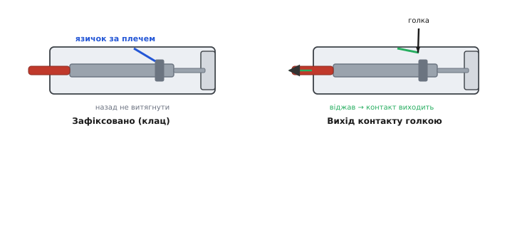

# ⚙️ Обтиск власного Dupont-контакту крок за кроком

Готовий фабричний Dupont-дріт зручний рівно доти, доки вам підходить його довжина й ви довіряєте тому, як його обтиснули на заводі. Обидві умови ламаються швидко: перемичка виявляється то задовгою (плутається в пучку, тягне зайвий опір), то закороткою (не дотягується), а дешевий обтиск ледве живий — тримається за ізоляцію, а не за жилу. Тоді берете розсипні контакти, порожні корпуси та обтискні кліщі — і робите перемичку **точно під свою плату**: тієї довжини, що треба, і з тугим свіжим контактом, який не підведе. Це не складніше за шнурування черевика, коли розумієш, що саме тиснеш і навіщо. Розберімо процедуру від голого дроту до готового багатоконтактного роз'єму — і, головне, як щоразу перевірити, що вийшло добре, а не «на вигляд добре».

## Задача: тугий контакт точної довжини

Сформулюймо, чого ми хочемо, бо від цього залежить кожен наступний рух. Нам треба перетворити відрізок тонкого багатожильного дроту на кінець, який:

- **проводить надійно** — метал контакту тисне в оголені жили з такою силою, що між ними немає ні повітряного зазору, ні окисної плівки; струм іде так, наче це суцільний метал;
- **тримається механічно** — за дріт можна смикнути, а жила не вилізе з контакту; смикне не за жилу, а за ізоляцію, яку тримає окрема пара лапок;
- **сідає в корпус** — контакт заходить у пластиковий корпус і **клацає** там фіксатором, тобто його вже не витягнути назад випадковим потягом.

Ключове слово тут — **обтиск** (англ. *crimp* — «стиснути у складку»), а не паяння. Ми не топимо припій; ми **холодним тиском** загортаємо металеві лапки контакту так туго навколо жили, що два метали зварюються тиском — без нагріву, без флюсу, без крихкого паяного вушка. Правильний обтиск проводить і тримає **краще** за поспіхом припаяний кінець, бо холодний тиск не окислює міді й не робить того ламкого напливу, що тріскається від вібрації.

> 🔧 **Навіщо це.** Дешевий фабричний Dupont часто провалює саме другу умову: лапки на жилу тиснуть абияк, і кінець тримається лише за ізоляцію. Він «працює», поки ви його не поворушите, — а на макеті, який хтось випадково зачепив ліктем, жила виходить із контакту й коло тихо розмикається. Ви годину шукаєте «плаваючий» баг у прошивці, а він у наконечнику. Власний обтиск вбиває цей клас глюків у корені: ви самі бачили, як лапки зімкнулись на голому металі, і самі смикнули за дріт для перевірки.

## Ідея: дві пари лапок, кожна робить своє

Перш ніж брати кліщі, треба ясно побачити, **що ми тиснемо**. Розкритий Dupont-контакт — це латунний чи бронзовий жолобок із двома парами відігнутих лапок (їх ще звуть «щоки» або «крильця»). Дві пари — не примха, у них розподіл праці:

- **передня пара, ближча до контактної частини, — на жилу.** Вона мусить зімкнутися на **оголеному металі**, врізатись у пучок мідних волосин. Це і є електричний контакт.
- **задня пара, ближча до дроту, — на ізоляцію.** Вона обхоплює **оболонку**, не оголюючи її. Це механічне тримання: коли дріт смикнуть, тягне за ізоляцію, а не за тонкі жилки, тож жила з переднього обтиску не висмикується.


*Уся техніка — покласти оголені жили рівно під передню пару, а край ізоляції — під задню, і зімкнути обидві так, щоб щоки загорнулися досередини й обняли метал. Добрий обтиск на торці — це замкнене кільце навколо стиснутого пучка жил; поганий — недотиснуті щоки, крізь які видно вільну жилу.*

Ось чому не можна просто «стиснути посередині»: якщо обидві пари схопили тільки ізоляцію, контакт електрично мертвий (жила ні до чого не притиснута), а якщо обидві схопили тільки голу жилу — нема механічного тримання, і перший потяг вирве волосинки. Кожна пара має лягти **на своє**. Тому й зачистка має точну довжину: оголити треба рівно стільки, щоб голий метал ліг під передню пару, а ізоляція дійшла до задньої, — і ні міліметром більше.

## Інструмент: чому звичайні пасатижі не годяться

Спокуса стиснути лапки простими плоскогубцями закінчується однаково погано: плоска губка **розчавлює** контакт у млинець, замість загорнути щоки досередини акуратним півколом. Обтиск має особливу геометрію — губки з профільованими заглибленнями, що підхоплюють кінчики щік і **закручують** їх усередину, у форму, яку по-англійськи звуть *B-crimp* (на торці дві щоки утворюють дві дуги, схожі на «B»). Саме таке загортання дає рівномірний тиск по всьому пучку жил. Тому потрібні спеціальні **обтискні кліщі**.

Практично беруть один із двох інструментів, і різниця між ними варта пояснення.

**SN-28B** — найпоширеніші дешеві кліщі-тріскачка (англ. *ratchet* — тріскачка: механізм, що не дає розтиснути губки, поки обтиск не дійде до кінця). Профіль губок розрахований на діапазон **AWG 28–18** (це переріз приблизно 0.1–1.0 мм²), крок 2.54 мм і споріднені роз'єми JST. Тріскачка — велика перевага для новачка: вона **не відпустить**, поки ви не дотиснете до повного циклу, тож недотиснути складніше. Ті самі кліщі мають кілька гнізд-профілів різного розміру: обираєте те, що підходить під ваш контакт. Мінус — губки універсальні під широкий діапазон, тож на найтонших контактах під 28 AWG обтиск виходить трохи грубуватий: щоки часом продавлюють ізоляцію замість м'яко обняти. Для макетних перемичок цього більш ніж досить.

> **Факт про SN-28B (усталено, з описів виробника IWISS).** Заявлений діапазон — AWG 28–18 (0.1–1.0 мм²), кроки 2.5 / 2.54 / 3.96 мм; це кліщі-тріскачка з профільованими гніздами, що обтискають жилу й ізоляцію за один стиск. Це масовий інструмент RC/3D-друку/макетування, не прецизійний.

**Engineer PA-09** — японські прецизійні кліщі (виробник Engineer Inc., сталь S55C, довжина 175 мм), розраховані на **мікро**-роз'єми AWG 32–20. Замість одного універсального профілю в них **чотири** окремі губки різної ширини — 1.0, 1.4, 1.6, 1.9 мм, — і ви добираєте ширину точно під розмір щік: вужчу під передню пару на жилу, ширшу під задню на ізоляцію. Це дає найточніший, найакуратніший обтиск саме на тонких 28 AWG, якими живуть Dupont, — ціною того, що передню й задню пару тиснуть **двома окремими стисками** (спершу жилу вужчою губкою, тоді ізоляцію ширшою), а не одним, як тріскачка. Кому важлива краса й надійність кожного контакту, беруть PA-09; кому потрібно швидко нашити багато перемичок — SN-28B.

> **Факт про PA-09 (усталено, з даних Engineer Inc. та TME).** Прецизійні кліщі для мікро-open-barrel-контактів AWG 32–20, чотири ширини губок 1.0 / 1.4 / 1.6 / 1.9 мм, сталь S55C, маслостійкі TPR-ручки; серед сумісних — Mini-PV (тобто «Dupont») та Molex. Обтискає жилу й ізоляцію окремими стисками, звідси вища точність на тонкому дроті.

Обидва інструменти детальніше — [обтискні кліщі як клас](root:cat-hw-instruments/crimp-tool): чим тріскачка відрізняється від простих, як налаштувати зусилля й чому профіль губок вирішує все. Тут нам вистачить того, що інструмент **загортає щоки досередини рівномірно** — а не плющить.

## Процедура: від голого дроту до контакту в корпусі

Тепер сама послідовність. Кроки прості, але порядок і точність важать — тому пройдімо кожен із поясненням, **чому** саме так.

### 1. Відрізати й зачистити ~3–4 мм

Відміряйте дріт трохи довшим, ніж треба (кілька міліметрів піде на зачистку й на те, що жила сяде в контакт). Тоді **зачистіть кінець** — знімете ізоляцію так, щоб оголити приблизно **3–4 мм** мідних жилок. Це число не випадкове: воно має покрити передню пару лапок голим металом, а край ізоляції лишити рівно під задньою парою.

Порахуймо, звідки береться саме така довжина.

**Умова: контакт має ділянку під жилу ≈ 2 мм і ділянку під ізоляцію ≈ 2 мм; хочемо, щоб гола жила заповнила першу й трохи заходила за передню пару, а ізоляція дійшла до задньої.**

```
Ділянка під жилу:        ≈ 2.0 мм  → сюди йде гола мідь
Заступ за передню пару:  ≈ 0.5 мм  → щоб жила напевно легла під лапки
Ділянка під ізоляцію:    ≈ 2.0 мм  → сюди йде оболонка, НЕ оголюємо

Оголити треба:  2.0 + 0.5 + запас     ≈ 3–4 мм
Ізоляцію лишити так, щоб її край сів під задню пару.
```

Занадто коротка зачистка — гола жила не дістає передньої пари, і та тисне в ізоляцію: електрично мертво. Занадто довга — гола мідь стирчить **перед** контактом, оголена й беззахисна, готова закоротити на сусідній вивід. Тому 3–4 мм — і не «на око», а зіставляючи з довжиною самого контакту, який тримаєте в руці.

**Головна засторога зачистки: не надкусіть жилу.** Тонка жила 28 AWG — це кілька мідних волосин; якщо знімалка ізоляції зачепить і переріже частину з них, ви втратите половину перерізу ще до обтиску. Надкушена жила — це і слабший струм, і місце майбутнього зламу. Тому знімалку ставте на розмір **під дріт, а не тонший**, і тягніть рівно.

### 2. Укласти жилки під передню пару, ізоляцію під задню

Візьміть розкритий контакт у губки кліщів так, щоб він **не випав** (у SN-28B він лягає в профіль, у PA-09 його притримують). Заведіть дріт **іззаду**: спершу він пройде крізь задню пару лапок (на ізоляцію), тоді голі жилки ляжуть у передню пару (на жилу).

Тепер вивірте посадку — це найважливіший момент усієї процедури:

- **оголені жили** мають лягти **під передню пару** й трохи виходити за неї вперед, до контактної частини, — але **не стирчати** голими перед контактом;
- **край ізоляції** має дійти рівно **до задньої пари** — так, щоб задні лапки зімкнулись на оболонці, а не перед нею на порожнечі й не за нею на голій жилі.

Коротко це запам'ятовують так: **гола мідь — у передню пару, оболонка — у задню, і жодного голого металу перед контактом**. Якщо жила лягла криво чи закоротко — витягніть і перекладіть, доки не сядуть обидві зони. Пів хвилини на вивірку тут економлять переобтиск потім.

### 3. Обтиснути

Стисніть кліщі. У тріскачки (SN-28B) тисніть **до кінця циклу** — доки механізм сам не відпустить: це гарантія, що ви дотиснули, а не зупинились на пів дорозі. Профіль губок загорне обидві пари щік досередини за один рух.

У PA-09 — **два стиски**: спершу вужчою губкою на **жилу** (передня пара), тоді ширшою на **ізоляцію** (задня пара). Не переплутайте порядок і ширину: жила — вужче, ізоляція — ширше, бо оболонка товща.

Правильно обтиснутий торець виглядає як на фігурі вище справа: щоки **загорнуті всередину**, кінчики зустрілися чи майже зустрілися по центру, а жила стиснута в щільний пучок без вільних волосин. Якщо щоки лишились розчепірені, крізь них видно вільну жилу, або контакт розплющило вбік — обтиск поганий, до цього повернемось у пастках.

### 4. Засунути контакт у корпус до клацання

Готовий контакт треба посадити в пластиковий **корпус** (англ. *housing* — оболонка). Усередині кожного гнізда корпусу є маленький пружний **язичок-фіксатор** (по-англ. *retention lance* — «фіксувальний спис»): скісний виступ, що дає контакту зайти вперед, але **не дає** вийти назад.


*Фіксатор працює як зубець-заскочка: контакт просовують уперед до клацання, і язичок падає за його боксове плече. Щоб контакт вийняти, язичок треба віджати тонкою голкою — інакше він тримає намертво.*

Порядок посадки:

- **зорієнтуйте контакт правильно.** Корпус несиметричний: язичок сидить з одного боку гнізда, і контакт має плече (боксовий виступ), за яке той язичок чіпляється. Поверніть контакт так, щоб плече дивилось у бік язичка. У більшості Dupont-корпусів це означає — вікном/заглибиною контакту до тієї стінки гнізда, де язичок. Помилитесь боком — контакт або не зайде, або не зафіксується.
- **штовхайте контакт уперед за дріт**, доки не почуєте (чи відчуєте) тихе **«клац»**. Це язичок перескочив плече й став за ним.
- **легенько потягніть дріт назад.** Контакт має сидіти — язичок не пускає. Якщо контакт вилазить, він не зафіксувався: витягніть, огляньте орієнтацію й плече, посадіть заново.

Для **одноконтактного** корпусу на цьому все. Для багатоконтактного — далі.

### 5. Зібрати багатоконтактний корпус

Корпуси бувають на 1, 2, 3… до десятка гнізд поспіль — і саме тут криється сила Dupont-системи: контакти обтискають **окремо**, а тоді складають у корпус потрібної ширини. Порядок збирання:

- **обтисніть усі контакти наперед** — окремо, кожен на свій дріт, перевіривши кожен на висмик (крок нижче). Легше перевіряти контакт, поки він не в корпусі.
- **садіть їх у корпус по одному**, дотримуючись **порядку жил**. Тут вирішує ваша колірна домовленість: якщо на платі виводи йдуть «живлення–земля–сигнал», садіть червоний–чорний–жовтий у тому самому порядку, у якому вони встромлятимуться. Переплутаний порядок у багатоконтактному роз'ємі — класична причина «все підключив, а не працює».
- **звіряйтеся з ключем корпусу.** Багато корпусів мають позначку першого контакту (стрілку, зріз кута, цифру «1»). Домовтеся, який ваш дріт — перший, і тримайтесь: інакше роз'єм можна вставити в плату «дзеркально».

Гнучкість тут повна: помилились сусідством — контакт **виймається** назад (крок нижче) і переставляється в інше гніздо, нічого не переобтискуючи. Той самий дріт можна перекинути у ширший корпус, додати сусідів — контакт лишається той самий, міняється лише оболонка.

## Перевірка: висмик і продзвін

Обтиск — це той рідкісний випадок, коли «на вигляд добре» й «справді добре» розходяться постійно. Тому кожен контакт проходить **два тести**, і жоден із них не забирає більше кількох секунд.

**Тест на висмик (механіка).** Візьміть дріт біля наконечника й **легенько, але впевнено потягніть** — так, наче хочете витягти жилу з контакту. Добрий обтиск тримає: дріт не рухається, жила сидить. Поганий видасть себе одразу — жила вилізе або зрушиться. Це найшвидший спосіб зловити «холодний» обтиск, який тримається лише на ізоляції.

Скільки саме має витримати контакт — не таємниця, для цього є галузеві норми зусилля на висмик (англ. *pull-out force* — сила відриву). Порахуймо орієнтир для 28 AWG.

**Умова: галузевий стандарт MIL-T-7928 задає мінімум відриву для 28 AWG ≈ 22 ньютони (це приблизно 5 фунтів-сили); хочемо відчути, чи наш обтиск у цьому класі. (IPC/WHMA-A-620 задає близькі мінімуми як межу, нижче якої обтиск — брак, хоч би як гарно виглядав.)**

```
Мінімальне зусилля висмику (28 AWG, MIL-T-7928):
   F_min ≈ 22 Н   (≈ 5 фунтів-сили)

Що це в звичній вазі:
   m = F / g = 22 Н / 9.81 м/с²           ≈ 2.2 кг

Тобто добрий контакт на 28 AWG має тримати
підвішені ~2.2 кг, поки жила не почне виходити.
```

Пальцями ви, звісно, не міряєте ці 22 Н динамометром — і не треба. Сенс тесту простий: **добрий обтиск не зрушиться від упевненого потягу пальцями взагалі**, а поганий здасться від легкого. Якщо жила пішла — переобтисніть або викиньте контакт; на 28 AWG це секунди роботи, не варте того, щоб потім ловити примарний обрив.

**Тест на продзвін (електрика).** Візьміть мультиметр у режимі продзвону (англ. *continuity* — перевірка суцільності: прилад пищить, якщо між щупами майже нульовий опір) і торкніться одним щупом голого металу дроту з дальнього кінця, другим — контактної частини наконечника. **Пищить** — коло суцільне, обтиск проводить. **Мовчить** — десь розрив: або жила не притиснута (обтиск сів на ізоляцію), або жила зламана всередині. Для контакту в багатоконтактному корпусі так само продзвонюють кожну лінію окремо, а заразом перевіряють, чи сусідні контакти **не закорочені** між собою (щуп на один — пищить; переставили на сусідній без переставляння другого щупа — має **замовкнути**).

> 🔧 **Навіщо це.** Два тести ловлять два різні браки, і жоден не ловить обидва. Висмик перевіряє **механіку** (тримання), продзвін — **електрику** (проведення), і контакт може провалити один, пройшовши другий: буває, що жила притиснута (пищить), але тримається кволо (висмикнеться завтра), і навпаки — тримається міцно за ізоляцію, а голого контакту нема (не пищить). Тому проходьте обидва. Тридцять секунд на пару тестів проти години пошуку плаваючого багу в зібраній схемі — обмін очевидний.

## Складність і пастки: типові браки

Тепер зберімо докупи те, на чому обтиск найчастіше зривається, — і, головне, як кожне впізнати й полагодити. Майже всі браки родом із того, що контакт **на вигляд** цілий.

**Холодний обтиск лише на ізоляції.** Найпідступніший брак: обидві пари лапок схопили ізоляцію, а до голої жили передня пара так і не дотиснулась (зачистили закоротко, або жила лягла криво). Контакт тримається механічно чудово — висмик проходить! — але **не проводить** або проводить через раз. Ловиться **тільки продзвоном**: механіка обманює, електрика — ні. Лік: витягти, перезачистити довше, укласти жилу під передню пару, обтиснути знову.

**Недотиснуті щоки.** Ви зупинили стиск на пів дорозі (дешеві кліщі без тріскачки це дозволяють), і щоки лишились розчепірені — обняли жилу кволо, не зімкнувшись. Контакт «працює», доки його не поворушиш, а від легкого потягу жила виходить. Ловиться **висмиком** (жила рухається) і оком (на торці видно вільну жилу між незімкнутими щоками, як на фігурі справа внизу). Лік: якщо кліщі-тріскачка — тисніть **до кінця циклу**; якщо прості — тисніть сильніше й до повного загортання щік. Недотиснутий контакт переобтиснути в тому ж профілі зазвичай не вийде (щоки вже деформовані) — простіше зрізати й обтиснути новий.

**Скошений (перекошений) контакт.** Ви поклали контакт у губки криво, і обтиск загорнув щоки нерівно — контакт вийшов вигнутим убік чи скрученим. Такий кінець **не заходить у корпус** рівно (застряє, не клацає) або заходить, але штир дивиться вбік і погано лягає в гніздо. Ловиться оком (контакт не прямий) і на посадці (не фіксується). Лік один: новий контакт, цього разу рівно в губках.

**Розчавлений «у млинець».** Ознака того, що обтискали **не тими** інструментом — плоскогубцями чи занадто вузьким профілем: замість загорнути щоки досередини, губка розплющила контакт плазом. Такий контакт і не тримає рівномірно, і не сідає в корпус. Лік — правильний профіль кліщів під розмір контакту (у SN-28B обрати гніздо під ваш AWG; у PA-09 — губку потрібної ширини).

**Голий метал стирчить перед контактом.** Зачистили задовго, і мідь оголена **попереду** контактної частини. На макеті ця гола цятка радо торкнеться сусіднього виводу й дасть коротке. Ловиться оком. Лік — коротша зачистка (крок 1), щоб уся гола жила ховалась під передньою парою.

**Як вийняти контакт голкою (коли треба переробити).** Помилились сусідством у корпусі, посадили криво, чи хочете перекинути дріт у інший корпус — контакт **виймається** назад, і саме ця розбірність робить Dupont ремонтопридатним. Механіка — на фігурі вище справа: язичок-фіксатор тримає контакт за плече, тож його треба **віджати**.

```
Псевдо-чеклист «вийняти контакт»:
  1. знайти язичок      → зазирнути в отвір корпусу з боку штиря/гнізда;
                          видно скісний пружний виступ у стінці гнізда
  2. віджати язичок     → тонкою голкою / шпилькою / загостреним дротом
                          легенько підняти язичок від плеча контакту
  3. витягти дріт       → тримаючи язичок віджатим, потягти дріт НАЗАД;
                          контакт вийде з корпусу
  4. оглянути           → плече й язичок цілі? контакт не деформований?
                          → можна пересадити в інше гніздо чи корпус
```

Тут одна тонка засторога, через яку люди ламають корпуси: **язичок тендітний**. Не длубайте його грубою металевою викруткою з натиском — пластиковий язичок легко надломити, і тоді гніздо більше **не фіксуватиме** жоден контакт (корпус на смітник). Тисніть **легко**, тонким і не гострим-як-ніж інструментом (шпилька, зубочистка, спеціальний екстрактор), рівно настільки, щоб язичок відпустив плече. Якщо контакт не йде — не тягніть силою, а перевірте, чи справді віджали язичок, і чи не за той бік узялися.

---

Уся ця процедура — це, по суті, три речі, зроблені уважно: **зачистити рівно** (щоб гола жила лягла куди треба), **зімкнути щоки до кінця** (щоб тримало й проводило) і **перевірити обидвома тестами** (бо око бреше). Опанувавши їх, ви перестаєте залежати від того, як хтось обтиснув дріт на заводі: робите перемички точної довжини, тугі й свіжі, під саме свою плату — і половина «плаваючих» глюків макета, що народжуються в кволих фабричних наконечниках, просто зникає ще до того, як ви ввімкнете живлення.
