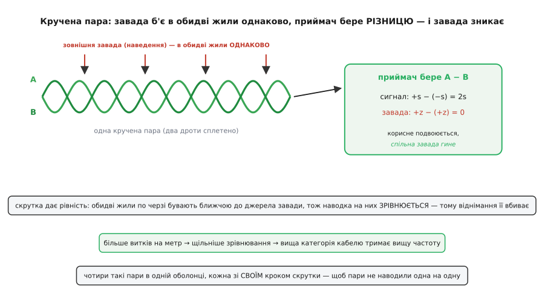
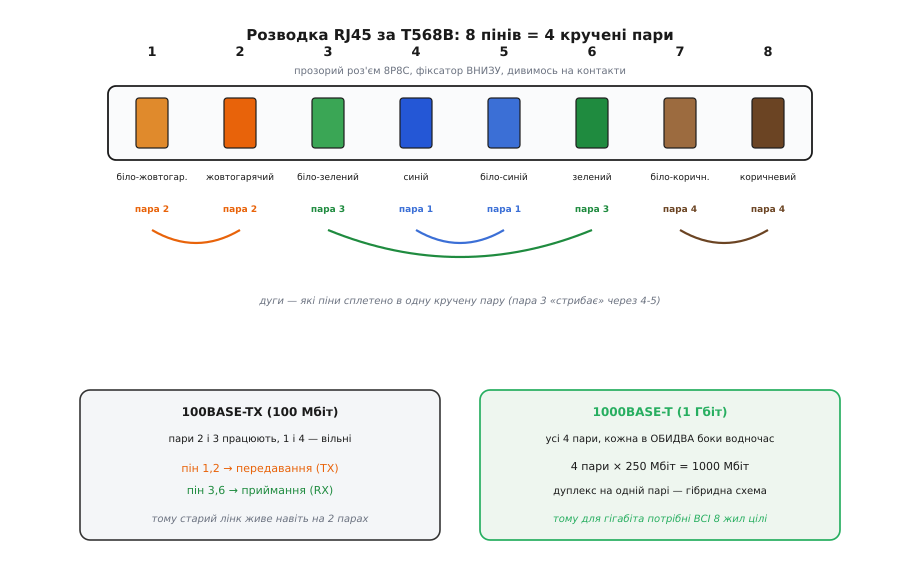

# Ethernet-кабель RJ45

<preknowlist>
- [Ethernet і USB як диференційні пари](root:com-medium/usb-ethernet-differential) — сигнал іде не одним дротом, а різницею напруг на двох; саме це робить кабель стійким до завад.
- [Кадр Ethernet](root:com-transport/ethernet-frame) — що за пакет біжить дротом: адреси, дані, контрольна сума. Кабель — лише труба для цих кадрів.
</preknowlist>

Візьміть у руки будь-який мережевий кабель — той, що йде від роутера до комп'ютера, від камери відеоспостереження до комутатора, від польотного контролера до наземної станції по дротовому лінку. Майже напевно на його кінцях сидить однаковий прозорий пластиковий штекер із золотими смужками контактів і клацаючим язичком-фіксатором. Це і є **RJ45** — найпоширеніший роз'єм для передавання даних на планеті. А сам кабель усередині — це не один товстий дріт і не купа випадкових жилок, а чотири акуратно **скручені пари** тонких мідних дротів. Уся хитрість, уся здатність гнати гігабіти на сто метрів крізь наведення від силових кабелів і люмінесцентних ламп — захована саме в цій скрутці й у тому, як пари розкидані по вісьмох контактах.

Розберімося, чому кабель влаштований саме так, як його не переплутати кінцями, чим Cat5e відрізняється від Cat6, і де він мовчки вас підведе.

## Спершу про назву: RJ45 — це насправді помилка, що прижилася

Абревіатура **RJ** — це *registered jack* (англ. «зареєстроване гніздо»), і походить вона з телефонної системи Bell ще з 1970-х, зі схеми кодів USOC для телефонних інтерфейсів. Був там і роз'єм на ім'я **RJ45S** — але то був інший звір: восьмиконтактне гніздо з ключем-виступом, для однієї телефонної лінії з програмованим опором. Той історичний RJ45S до мережевих кабелів стосунку майже не має.

Роз'єм, який ми щодня називаємо «RJ45», за стандартом зветься **8P8C** — *eight position, eight contact* (англ. «вісім позицій, вісім контактів»). Тобто в гнізді вісім місць під контакти, і всі вісім зайняті. Коли в 1980-х народжувалися комп'ютерні мережі, інженери взяли цей дешевий модульний роз'єм, схожий на телефонний RJ45S, — і за звичкою почали кликати його «RJ45». Помилка розповзлася так широко, що тепер уся документація, усі магазини й усі люди кажуть «RJ45», хоча технічно точна назва — 8P8C.

> 🔧 **Навіщо це.** У щоденній роботі «RJ45» і «8P8C» — це те саме, замовляйте сміливо. Різниця сплине лише в двох місцях: у специфікаціях на компоненти (там пишуть «8P8C») та коли зустрінете «RJ45» на телефонному обладнанні — там це може бути справді той старий телефонний варіант з іншою розводкою. Для мережі це завжди звичайний восьмиконтактний штекер.

## Серце кабелю: чотири кручені пари й трюк із різницею

Відкусіть оболонку — і побачите вісім тонких мідних дротів, зведених у **чотири пари**, і в кожній парі два дроти щільно **скручено між собою** (англ. *twisted pair*). Це не для краси й не щоб не плуталися. Скрутка — це фізичний фокус, який дозволяє гнати швидкий сигнал по дешевій міді поряд із джерелами завад.

Ось у чому суть. Сигнал у мережевому кабелі передається **диференційно**: не «напруга на одному дроті відносно землі», а **різниця напруг між двома дротами пари**. Якщо на одному дроті передавач ставить +1 В, то на другому одночасно −1 В; приймач на тому кінці дивиться лише на **різницю** цих двох: +1 − (−1) = 2 В. Це важлива відмінність від наївної схеми «один дріт — сигнал, другий — земля».

Тепер уявіть, що поряд проходить силовий кабель або блимає стартер лампи — і наводить на наш кабель завадне поле. Це поле б'є в обидва дроти пари. Але дроти скручено, тож вони йдуть **впритул один до одного**, по черзі міняючись місцями — і завада наводиться на них практично **однаково**: на кожен додається однакове +*z*. Що робить приймач? Він бере різницю. А в різниці спільний доданок скорочується:

```
корисний сигнал:  (+s) − (−s) = 2·s     ← подвоюється
спільна завада:   (+z) − (+z) = 0       ← зникає
```

Корисне подвоюється, завада гине. Ось чому диференційна пара — і чому саме **скручена**. Без скрутки один дріт був би трохи ближче до джерела завади, ніж другий, наводка на них була б **різна**, і в різниці вона б не скоротилася повністю. Скрутка робить дроти рівноправними: кожен по черзі буває і ближчою, і дальшою жилою, тож усереднена наводка на обидва **зрівнюється** — і віднімання її вбиває.


*Завада б'є в обидва дроти пари однаково; приймач бере різницю — корисний сигнал подвоюється, спільна завада скорочується до нуля. Що більше витків на метр, то щільніше зрівнюється наводка й то вищу частоту тримає кабель.*

Звідси прямо випливає, чому кабелі бувають різних «категорій». **Що щільніша й точніша скрутка (більше витків на метр, стабільніший крок), то краще зрівнюються дроти й то вищу частоту сигналу пара пропускає без спотворень.** А вища частота — це більше біт за секунду. Тому Cat6 крутіший за Cat5e не завдяки товщій міді, а завдяки акуратнішій геометрії скрутки та ізоляції.

І остання деталь про будову: чотири пари в кабелі скручено з **різним кроком** — одна густіше, інша рідше. Це навмисне. Якби всі чотири пари мали однаковий крок, вони б лягали одна вздовж одної в резонанс і наводили б завади вже **самі на себе** (це зветься перехресною завадою, англ. *crosstalk*). Різний крок зсуває пари одна відносно одної, і взаємне наведення розсіюється.

## Розводка контактів: T568A і T568B

Вісім жил треба якось розкидати по вісьмох контактах роз'єма — причому так, щоб **обидва кінці кабелю та розетки різних виробників погоджувалися** між собою. Інакше пара, скручена всередині кабелю, розпалася б на два різні контакти, що не утворюють пару на роз'ємі, — і весь трюк зі скруткою розсипався б.

Для цього існує стандарт розкладки кольорів по контактах. Історично їх **два** — **T568A** і **T568B**, — і обидва закріплені в стандарті кабельних систем **ANSI/TIA-568** (перша редакція, тоді ще EIA/TIA-568, вийшла 1991 року; стандарт розробив американський комітет TR-42 за участі понад 60 організацій — виробників, інтеграторів, замовників). *(Статус: усталений факт, підтверджений документами TIA.)*

Різниця між A і B — лише в тому, що **зелену й помаранчеву пари поміняно місцями**. Історично T568B походить від старішої телефонної розкладки AT&T (їхня схема «258A», що вросла корінням у телефонну систему USOC), а T568A зробили сумісним з іншою гілкою телефонних USOC-практик. Обидві мають рівне право на існування; електрично вони еквівалентні. Чому взагалі вижили два стандарти замість одного й хто кого проштовхував — окрема, доволі показова [історія двох розводок](root:cat-hw-parts/ethernet-cable/hist-two-wiring-standards.md): це рідкісний випадок, коли телефонна спадщина 1970-х досі диктує, як ви кладете кольори в роз'єм.

На практиці в світі **переважає T568B** (особливо в Північній Америці й у більшості готового «патч-корду»), тож саме її беруть за типову. Ось як лягають вісім жил за T568B, зліва направо, якщо тримати роз'єм контактами до себе, а фіксатором униз:


*Вісім пінів роз'єма — це чотири кручені пари. Пара 3 «стрибає» через контакти 4-5, щоб на роз'ємі лишитися парою. На 100 Мбіт працюють лише пари 2 і 3; для гігабіта потрібні всі чотири пари й усі вісім жил цілі.*

```
Пін 1 — біло-помаранчевий  ┐ пара 2 (TX+)
Пін 2 — помаранчевий       ┘         (TX−)
Пін 3 — біло-зелений       ┐ пара 3 (RX+)
Пін 4 — синій              ┐ пара 1
Пін 5 — біло-синій         ┘
Пін 6 — зелений            ┘ пара 3 (RX−)
Пін 7 — біло-коричневий    ┐ пара 4
Пін 8 — коричневий         ┘
```

Зверніть увагу на неочевидне: **пара 3 розірвана контактами 4 і 5**. Тобто зелена пара сидить на пінах 3 і 6, а між ними, на пінах 4-5, втиснута синя пара. Це не помилка розкладки — так зроблено навмисне, щоб зберегти сумісність зі старими телефонними розетками, де центральна пара (контакти 4-5) несла головну телефонну лінію. Головне, що всередині кабелю зелені дроти скручено **між собою**, а сині — **між собою**; на роз'ємі вони лише «роз'їжджаються» по своїх контактах, лишаючись фізично скрученими парами по всій довжині.

> 🔧 **Навіщо це.** Коли самі обтискаєте роз'єм кримпером, тримайтеся **одного** стандарту (найпростіше — T568B) на **обох** кінцях. Плутати всередині одного роз'єма не можна: якщо покласти дроти «як зручно», ви ризикуєте розбити скручену пару на два неспарені контакти — і кабель або не запрацює, або на короткому шматку працюватиме, а на довгому почне сипати помилками через завади. Пара має лишатися парою від штекера до штекера.

## Прямий і перехресний кабель — і чому це вже майже не турбота

Колись мало значення, які пари куди йдуть на кінцях. Логіка проста: якщо два пристрої **однакові за роллю** (комп'ютер до комп'ютера, комутатор до комутатора), то обидва «говорять» у ту саму пару й «слухають» ту саму — і виходить, що один кричить туди, куди другий теж кричить, а слухають обидва тишу. Щоб їх подружити, робили **перехресний кабель** (англ. *crossover*): на одному кінці T568A, на іншому T568B, так що передавальна пара одного пристрою потрапляла в приймальну пару іншого.

Якщо ж пристрої **різні за роллю** (комп'ютер до комутатора), передавання й приймання вже й так були розведені всередині обладнання — годився звичайний **прямий кабель** (англ. *straight-through*): T568B з обох кінців.

Сьогодні про це можна майже забути. Практично все сучасне обладнання має **Auto-MDIX** — схему, що сама визначає, які пари прийшли, і за потреби внутрішньо перемикає передавання й приймання. Тож будь-який прямий кабель з'єднає що завгодно з чим завгодно, а перехресні кабелі лишилися рідкістю для старого заліза. Але знати про різницю варто: якщо старий свіч без Auto-MDIX уперто не бачить лінка з таким самим свічем — перше, що перевіряють, це чи не потрібен тут перехресний кабель.

## Категорії: Cat5e, Cat6, Cat6a і далі

На оболонці кабелю дрібним шрифтом завжди надруковано категорію — `CAT5E`, `CAT6`, `CAT6A`. Категорія каже, **яку смугу частот** (у мегагерцах) кабель гарантовано тримає, а звідси випливає, яку швидкість і на якій довжині він потягне. Що вища частота — то щільніша й точніша має бути скрутка, краща ізоляція, іноді додається екран. Ось орієнтири (усі числа звірено за галузевими даними; довжина 100 м — стандартна межа для мідного лінка):

```
Категорія   Смуга      Швидкість × довжина
Cat5e       100 МГц    1 Гбіт до 100 м
Cat6        250 МГц    1 Гбіт до 100 м; 10 Гбіт лише на 37–55 м
Cat6a       500 МГц    10 Гбіт до 100 м
Cat7        600 МГц    10 Гбіт до 100 м (нестандартний роз'єм, не RJ45!)
Cat8        2000 МГц   25–40 Гбіт лише до ~30 м (для дата-центрів)
```

Кілька важливих висновків із цієї таблиці, які рятують гроші й нерви.

**Cat5e для гігабіта вистачає з головою.** Попри те, що це «стара» категорія, звичайний Cat5e впевнено дає 1 Гбіт на всі сто метрів. Якщо вам не потрібні 10 Гбіт — переплачувати за Cat6 сенсу зазвичай немає. Cat5e тримає гігабіт саме тому, що для нього задіяно **всі чотири пари одночасно й у обидва боки**: кожна пара жене свої 250 Мбіт, чотири пари дають рівно 1000 Мбіт.

**Cat6 і 10 Гбіт — це пастка.** Формально Cat6 «підтримує» 10 Гбіт, але лише на короткому шматку 37–55 метрів, і то за ідеальних умов. Для чесних 10 Гбіт на повну довжину потрібен **Cat6a** — саме додаткова буква «a» (англ. *augmented*, «розширений») означає вдвічі ширшу смугу (500 МГц) і кращий захист від перехресних завад між кабелями в пучку.

**Cat7 — це не про RJ45.** Cat7 живе в європейському стандарті ISO/IEC 11801 і вимагає **іншого роз'єма** (GG45 або TERA), а не звичного 8P8C. Тому в світі RJ45 практичний стелею довгий час був Cat6a, а вище — уже Cat8 для дата-центрів на дуже коротких відрізках. *(Статус: усталено; Cat7 не визнаний як RJ45-сумісний стандарт TIA.)*

Ще одна буква в маркуванні стосується **екрана**. `UTP` (англ. *unshielded twisted pair*) — неекранована кручена пара, найпоширеніший і найдешевший варіант, якого вистачає для дому й офісу. `STP`/`FTP`/`S/FTP` — різні ступені екранування (фольга навколо кожної пари й/або обплетення навколо всього кабелю). Екран потрібен там, де сильні завади: уздовж потужних силових ліній, на виробництві, у серверній зі щільними пучками. За екран доводиться платити не лише грошима, а й **обов'язковим заземленням** — неправильно заземлений екран сам стає антеною й робить гірше, ніж узагалі без нього.

## Живлення дротом: PoE

Ще одна річ, на яку той самий кабель здатен, — нести не лише дані, а й **живлення**. Це **PoE** (англ. *Power over Ethernet*, «живлення через Ethernet»): та сама вита пара подає постійну напругу, і IP-камера, точка доступу Wi-Fi чи VoIP-телефон живляться прямо з мережевого дроту, без окремого блока живлення поруч. Дуже зручно, коли пристрій висить під стелею, куди тягнути розетку — морока.

Стандарти PoE (усі — родини IEEE 802.3) різняться потужністю, яку джерело віддає в кабель:

```
802.3af  (PoE)    ~15.4 Вт від джерела   → для IP-камер, простих точок доступу
802.3at  (PoE+)   ~25.5 Вт від джерела   → потужніші точки, PTZ-камери
802.3bt  (PoE++)  до ~71 Вт від джерела  → тонкі клієнти, дисплеї, зарядки
```

Числа на боці **джерела** трохи вищі, ніж дістанеться пристрою: частина потужності гине на опорі самих мідних жил уздовж кабелю (тому на кінці пристрою від, скажімо, 802.3bt лишається близько 51 Вт замість 71). *(Статус: усталено, за редакцією IEEE 802.3bt-2018.)*

> 🔧 **Навіщо це.** Для PoE **якість кабелю раптом починає значити більше**, ніж для чистих даних. Тонкі жили дешевого кабелю мають вищий опір — на ньому губиться більше потужності й кабель відчутно **гріється**. Тому для PoE-ліній, надто довгих і потужних, беруть кабель із товщою міддю (менший калібр AWG, суцільна жила, а не «омедений алюміній» безіменних кабелів) — інакше пристрій на кінці недоотримає живлення, а сам кабель у стіні буде теплим на дотик.

## Суцільна жила проти багатожильної

Ще одна відмінність, яку не видно, поки не зіткнешся. Мідь усередині буває двох видів. **Суцільна жила** (англ. *solid*) — один товстий дріт на кожну з восьми жил. Вона краще проводить на довгих відстанях і дешевша, але **ламка на злам** — часте згинання зрештою її переломить. Тому суцільну жилу кладуть у стіни, у короби, у стаціонарну прокладку, де кабель ліг раз і лежить.

**Багатожильна** (англ. *stranded*) — кожна з восьми «жил» насправді сплетена з багатьох тоненьких дротиків. Вона гнучкіша й витриваліша до згинань, тому з неї роблять короткі **патч-корди** — ті шнури, що щодня смикають між пристроями. Платня за гнучкість — трохи вищий опір, тож дуже довгі багатожильні кабелі не роблять.

> 🔧 **Навіщо це.** Ця різниця вилазить при обтисканні роз'ємів. Стандартні роз'єми RJ45 бувають **під суцільну жилу** й **під багатожильну** — у них по-різному влаштовані контакти-ножі, що протикають ізоляцію. Поставите роз'єм не під той тип дроту — контакт вийде ненадійним, і кабель почне «моргати» лінком від будь-якого дотику. Купуючи роз'єми, дивіться, під яку жилу вони.

## На що зважати на практиці

Кілька речей, що псують життя частіше за все.

**Клацання фіксатора — це не формальність.** Язичок на роз'ємі має **клацнути** в гнізді. Якщо він обламався (типова доля кабелю, що часто виймають) або не тримає — роз'єм ходить у гнізді, контакт нестабільний, лінк то є, то нема. Такий кабель або з новим роз'ємом, або на смітник.

**Довжина 100 метрів — це стеля, і не запас, а межа.** Сто метрів — гранична довжина одного мідного сегмента для будь-якої категорії. Не «до ста добре, а трохи більше — теж нормально»: за межею сигнал слабшає й розсинхронізується, і лінк починає сипати помилками або падати до нижчої швидкості. Треба далі — ставлять комутатор посередині або переходять на оптоволокно.

**«Омеднений алюміній» — головна пастка дешевих кабелів.** Найдешевші безіменні кабелі часто зроблені не з міді, а з алюмінію, вкритого тонким шаром міді (маркування CCA, англ. *copper-clad aluminium*). Він гірше проводить, більше гріється під PoE, ламкіший і не відповідає жодній чесній категорії, хай там що написано на оболонці. Для будь-чого серйознішого за тимчасове з'єднання беріть **суцільну мідь** (маркування «bare copper» / «100% copper»).

**Категорія кабелю — це найслабша ланка всього тракту.** Роз'єми, розетки, патч-панель мусять бути **тієї ж категорії або вищої**, ніж кабель. Пустите чудовий Cat6a-кабель через дешеву Cat5e-розетку — і весь лінк упаде до можливостей тієї розетки. Тракт настільки швидкий, наскільки повільна його найгірша складова.

Поряд із мережевим кабелем у наборі часто живуть його простіші родичі для іншого — гнучкі [Dupont-дроти](root:cat-hw-parts/dupont-wires) для макетних з'єднань «пін-у-пін» та фірмові [JST-GH сигнальні джгути](root:cat-hw-parts/jst-gh-cable) для польотних контролерів. Але для передавання даних між пристроями на будь-яку відстань саме кручена пара з RJ45 лишається робочим стандартом — тому що дешева мідь плюс правильна скрутка досі дають надійний гігабіт там, де оптоволокно було б надмірним.
