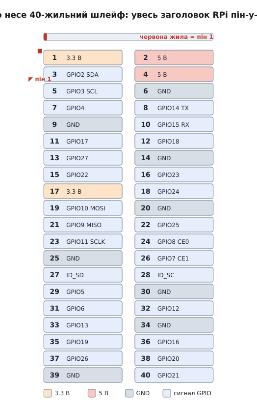
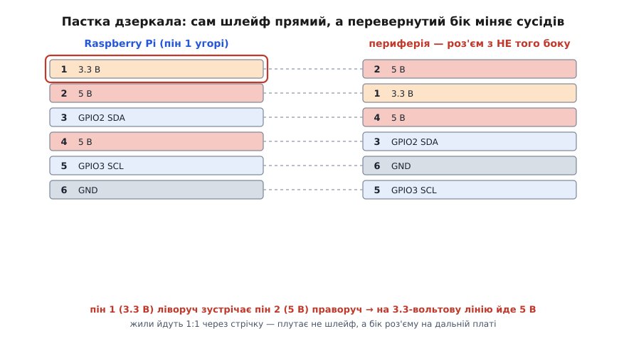

# GPIO шлейф 40-pin

<preknowlist>
- [Родина Raspberry Pi](topic:cat-hw-boards/raspberry-pi-family) — що таке одноплатний комп'ютер RPi і що 40-контактний гребінець на його краю — то і є GPIO-заголовок, який цей шлейф виносить назовні.
- [GPIO](topic:hw-digital/gpio) — вивід загального призначення: цифрова ніжка, яку прошивка робить входом чи виходом, читає 0/1 або виставляє 0/1.
- [Логічні рівні як діапазони](topic:hw-digital/logic-levels-as-ranges) — чому 3.3 В — «одиниця», 0 В — «нуль», і чому подати 5 В на 3.3-вольтову ніжку небезпечно.
- [Штирьові зʼєднувачі (male)](topic:cat-hw-parts/pin-headers) — той самий гребінець штирів із кроком 0.1″, у який шлейф насаджується роз'ємом.
</preknowlist>

Уяви, що весь ряд контактів з краю [Raspberry Pi](topic:cat-hw-boards/raspberry-pi-family) треба «продовжити» — винести кудись убік, на макетну плату чи на розширювальний модуль, не втикаючи дротики по одному. Саме це робить 40-жильний GPIO-шлейф: він бере весь гребінець одним рухом і кладе його копію на інший кінець стрічки. Не якийсь один сигнал, не жменю — **усі сорок контактів разом**, у тому самому порядку.

Шлейф (від нім. *Schleife* — петля, стрічка) тут — це **плоский стрічковий кабель** (англ. *ribbon cable*, «кабель-стрічка»): сорок тоненьких мідних жил, злиплих боками в одну пласку смугу. На кожному кінці — роз'єм-«прищіпка», що охоплює всі сорок жил разом. Ніяких окремих дротів, ніякого паяння: одна деталь замінює сорок [Dupont-дротів](topic:cat-hw-parts/dupont-wires) і робить це надійніше, бо жоден контакт не з'їде поодинці.

## Що це фізично

Візьми стрічку в руки. Ширина — близько сантиметра, товщина — як у цупкого паперу. Придивишся до торця — видно сорок паралельних жилок, кожна в своїй ізоляції, усі спаяні в одне полотно. Крок між сусідніми жилами — рівно **2.54 мм** (0.1 дюйма). Це не випадкове число: 2.54 мм — стандартний крок майже всіх штирьових гребінців у аматорській електроніці, тож жили шлейфа лягають точно навпроти штирів заголовка.

На кожному кінці стрічка заходить у **роз'єм IDC** на сорок контактів — два ряди по двадцять гнізд, разом 2×20. IDC — це *Insulation-Displacement Connector*, «роз'єм із проколюванням ізоляції»: усередині кожного гнізда є металева вилочка з гострим прорізом. Коли роз'єм затискають на стрічці, ці вилочки **прорізають ізоляцію кожної жили й уп'ялюються в мідь** — контакт виникає сам, без паяння й без зачищання. Тому шлейф і роблять на заводі за секунди: поклали стрічку в прес, стиснули — сорок контактів готові.

> 🔧 **Навіщо це.** IDC — причина, чому шлейф дешевий і однаковий. Паяти сорок жил вручну — година роботи й ризик холодної пайки; прес робить це за один хід і завжди однаково. Але зворотний бік медалі: полагодити такий роз'єм удома важко. Зіпсував затиск — простіше купити новий шлейф, ніж перепресовувати.

Один кінець насаджується на GPIO-заголовок Raspberry Pi, другий — на такий самий гребінець десь-інде: на [макетній платі-перехіднику](topic:cat-hw-boards/gpio-extension-board), на HAT-модулі, на власній платі проєкту. Обидва роз'єми однакові — стрічка симетрична за конструкцією (але не за під'єднанням, і саме тут ховається головна пастка, до неї ще дійдемо).

## Що він насправді несе

Це не «якийсь кабель для даних». Шлейф виносить **конкретний, повністю визначений гребінець** — 40-контактний GPIO-заголовок Raspberry Pi. Кожна з сорока жил має чітке призначення, і воно однакове на всіх сучасних моделях Pi (від Model B+ і Pi 2 до Pi 5). Ось що йде по цих жилах:

*Усі сорок контактів, які шлейф переносить один-в-один. Живлення (3.3 В — контакти 1 і 17; 5 В — 2 і 4) і вісім земель (6, 9, 14, 20, 25, 30, 34, 39) розкидані навмисне, а не зібрані докупи. Червона жила з краю мітить пін 1.*

Придивись до карти — і одразу видно **логіку розкладки**, яка потім боляче вилазить у пастці дзеркала:

- **Живлення й земля розкидані, а не зібрані.** Могли б покласти всі землі підряд — не поклали. Землі стоять на контактах 6, 9, 14, 20, 25, 30, 34, 39, розсипані по всьому гребінцю. Причина інженерна: коли поряд із сигнальною ніжкою є земля, зворотний струм тече близько до сигналу, петля струму мала, наведення менші. Тому землю «підселяють» до сигналів по всій довжині, а не тримають окремо.
- **Два різні живлення.** Контакти 1 і 17 дають **3.3 В** — це рівень, яким живиться сама логіка Pi. Контакти 2 і 4 дають **5 В** — сире живлення з входу плати, ним годують ненажерливу периферію. Переплутати їх — недобре: 5 В на 3.3-вольтовому вході здатні спалити ніжку.
- **Решта — сигнальні GPIO**, частина з яких уміє «за сумісництвом» бути апаратними шинами: контакти 3 і 5 — це [I²C](topic:com-devices/i2c) (лінії SDA і SCL), 8 і 10 — послідовний порт UART (TX/RX), 19–26 — шина [SPI](topic:com-devices/spi-bus) (MOSI, MISO, тактова, вибірки CE0/CE1).

> 🔧 **Навіщо це.** Шлейф не «розумний» — він тупо продовжує ці сорок ліній. Уся відповідальність за те, що куди подавати, лежить на тобі й на платі з іншого кінця. Тому знати цю карту — не примха, а страховка: перш ніж тицяти щуп чи припаювати щось до жили номер N, глянь, що по ній іде. На 3.3-вольтову ніжку 5 вольтів не подають; на землю не вішають сигнал.

Важлива дрібниця про сумісність: **перші 26 з цих 40 контактів збігаються** зі старим 26-контактним заголовком найперших Raspberry Pi (Model A/B). 40-контактний гребінець — це той самий 26-контактний плюс ще 14 нових ліній зверху. Тому 40-жильний шлейф, насаджений на старий 26-контактний Pi частиною роз'єму, спрацює для тих перших 26 ліній — розкладка збережена навмисне, заради зворотної сумісності.

## Червона жила й ключ: як не встромити навпаки

Стрічка сорокажильна й на око симетрична — обидва кінці однакові, обидва ряди схожі. Звідки роз'єм знає, де перший контакт, а де сороковий? Два незалежні орієнтири, і вони страхують один одного.

**Червона жила.** Одна крайня жила стрічки — зазвичай **червона** (рідше синя чи чорна), решта сірі або кольорові за схемою. Це домовленість, стара як самі шлейфи: **кольорова жила = контакт номер 1**. Дивишся на стрічку — знаходиш червоний край — це пін 1. Просто й безвідмовно, поки не заллєш очі й не переплутаєш кінці.

Звідки взявся кольоровий код на «райдужних» шлейфах, де кожна жила своя? Він скопійований з [резисторного кольорового коду](topic:hw-components/resistor-marking): жила 1 — коричнева (коричневий = 1 у коді резисторів), 2 — чорна, 3 — червона, 4 — жовтогаряча, і так по колу до десятої, далі послідовність повторюється. Тобто «червона жила = пін 1» строго діє лише на сірих стрічках з одним пофарбованим краєм; на райдужних першою за резисторним кодом іде **коричнева**. Тому орієнтуйся не на «шукай червоне», а на «шукай край, позначений кольором», і звіряйся з роз'ємом.

**Ключ-паз (полярність роз'єму).** Надійніший орієнтир — механічний. Хороший роз'єм шлейфа має збоку **виступ-ключ** (англ. *key*, «ключ»), а гарний заголовок на платі оточений пластиковою «спідницею» (*shroud*, «кожух») із **пазом** рівно під цей виступ. Виступ входить у паз лише в одному положенні — встромити навпаки фізично неможливо. Плюс на самому роз'ємі коло першого контакту вилито **маленький трикутник**, а на платі пін 1 підписаний квадратною площадкою чи «зрізаним кутом» у шовкографії. Три позначки разом — трикутник на роз'ємі, червона жила, зрізаний кут на платі — мають зійтися в одній точці.

> 🔧 **Навіщо це.** Дешеві шлейфи часто йдуть з **неекранованим** роз'ємом — без виступу-ключа. Тоді єдиний захист від «навпаки» — червона жила й твоя уважність. Заголовок Raspberry Pi теж зазвичай **без кожуха** (голі штирі), тож механічний ключ спрацьовує тільки якщо кожух є з боку периферії. Висновок практичний: не покладайся сліпо на «воно ж не встромиться навпаки» — на голих штирях встромиться чудово, і димом це скінчиться.

## Пастка дзеркала: чому «прямий» кабель усе одно плутає

Тут головне, і воно неочевидне. Жили шлейфа йдуть **строго один-в-один**: пін 1 роз'єму з'єднаний жилою з піном 1 другого роз'єму, пін 2 — з піном 2, і так усі сорок. Це називають **прямим (straight-through) з'єднанням 1:1** — стрічка нічого не переставляє, це просто сорок паралельних проводів. Здавалося б, помилитися ніде.

І все ж люди регулярно спалюють плати цим шлейфом. Чому?

Бо **фізична розкладка контактів дзеркалиться, коли дальній роз'єм дивиться на тебе з іншого боку**. Уяви: на Pi пін 1 угорі ліворуч. Стрічка йде до другої плати. Якщо ти розвернув другий роз'єм або поставив його «спідницею не в той бік», то в тій самій фізичній точці, де на Pi був пін 1, тепер опиняється сусідній контакт. Ряди парних і непарних міняються місцями: **пін 1 приходить туди, де інша плата чекає пін 2, пін 2 — де чекають пін 1**, і так уся пара.

*Стрічка чесно веде жилу пін-у-пін (пунктир). Плутанина не в кабелі, а в тому, з якого боку сидить дальній роз'єм: непарні й парні контакти дзеркаляться, і туди, де плата чекає 3.3 В (пін 1), приходить 5 В (пін 2).*

Подивись на малюнок і відчуй небезпеку конкретно. На Pi пін 1 — це **3.3 В**. Пін 2 — це **5 В**, і він фізично поруч, у сусідньому ряду. Досить дзеркального розвороту — і на лінію, розраховану на 3.3 В, приходить 5 В. Для 3.3-вольтової логіки це часто фатально.

**Чому дзеркалення взагалі виникає.** Це проста геометрія двох рядів. Пронумеруй контакти «змійкою»: 1 і 2 — перша пара, 3 і 4 — друга, і т. д. Дивишся на роз'єм спереду — непарні ліворуч. Перевернув роз'єм на 180° навколо довгої осі (саме це стається, коли ставиш його «іншим боком») — і непарні опиняються праворуч, тобто кожен непарний контакт помінявся місцем зі своїм парним сусідом. Жила при цьому нікуди не поділася, вона так само веде пін 1 у пін 1 — але «пін 1 другої плати» тепер фізично там, де раніше був пін 2.

> 🔧 **Навіщо це.** Практичне правило, що рятує плати: **тримай обидва роз'єми однаковим боком.** Пін 1 на Pi (зрізаний кут / квадратна площадка) і пін 1 на другій платі (така сама мітка) мають дивитися в один бік, а червона жила — з'єднувати саме їх. Якщо конструктивно так не виходить (роз'єм на другій платі мусить сидіти дзеркально), потрібен **не звичайний шлейф, а спеціальний перехідник, що компенсує переворот рядів**, — інакше пари поміняються, і пін 1 (3.3 В) зустрінеться з піном 2 (5 В). Перед першим вмиканням завжди звіряй: червона жила на обох кінцях — біля позначки пін 1.

## Де він у житті й чого стерегтися

Типовий сценарій — **винести GPIO Raspberry Pi на макетну плату**. Pi лежить у корпусі, а всі сорок ліній через шлейф приходять на плату-перехідник (breakout / [GPIO extension board](topic:cat-hw-boards/gpio-extension-board)), де кожен контакт підписаний і виведений у зручний ряд гнізд. Далі з макетки ти вже смикаєш дротиками окремі GPIO, чіпляєш давачі, світлодіоди, кнопки — не ризикуючи погнути ніжки на самому Pi. Другий типовий сценарій — під'єднати HAT-модуль, що фізично не сідає прямо на Pi (заважає корпус чи радіатор), тоді шлейф його «відсуває».

Що варто тримати в голові, коли береш цей шлейф:

- **Довжина коротка недарма.** Стандартні шлейфи — 15 см (6 дюймів), рідше довші. Плоска стрічка без екрана й без узгодження — кепський провідник для швидких сигналів: що довша, то більше наведень і завад, і то гірше працюють швидкі шини на кшталт SPI. Хочеш метр — матимеш проблеми зі стабільністю. Для GPIO-возні коротко — це правильно.
- **Жоден екран не захищає.** Це плоска стрічка, а не екранований кабель. Поряд із джерелом завад (мотор, силовий дріт) наведення підуть просто в сигнали. Тримай шлейф подалі від сильнострумових ліній.
- **Роз'єм крихкий на злам жили.** Стрічка не любить різких перегинів біля роз'єму — жила там може надломитися від утоми металу. Згинай плавно, не заламуй під прямим кутом упритул до IDC.
- **Дешевий = без ключа.** Перевір, чи є виступ-полярність. Немає — удвічі уважніше з червоною жилою й пастою дзеркала.

Головне, що варто винести: **цей шлейф — не «даних», а «продовжувач гребінця»**. Він тупо переносить весь 40-контактний заголовок Raspberry Pi на інший кінець, один-в-один. Уся розкладка — де живлення, де землі, де сигнали — лишається тією самою, тому знати її обов'язково. А єдина справжня небезпека — не в самій стрічці (вона чесна, 1:1), а в тому, яким боком сидять роз'єми: переверни один — і пари контактів дзеркаляться, підсунувши 5 В туди, де чекали 3.3 В. Червона жила до пін-1 з обох боків — і димів не буде.
